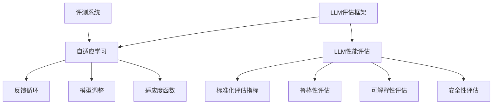
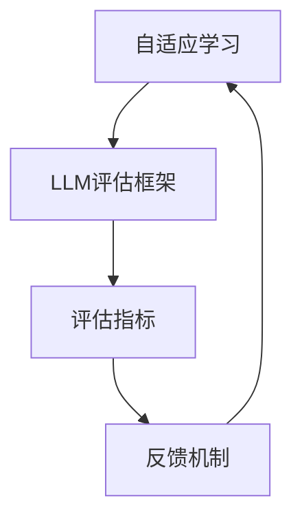

                 

# 文章标题：评测系统的自适应学习：持续优化的LLM评估框架

> 关键词：评测系统、自适应学习、LLM评估框架、持续优化、技术博客

> 摘要：本文深入探讨了评测系统的自适应学习机制及其在LLM评估框架中的应用。文章首先介绍了评测系统和自适应学习的背景，然后详细分析了LLM评估框架的设计原理，接着阐述了自适应学习在评测系统中的核心概念和实现方法，最后通过实际案例展示了自适应学习在LLM评估框架中的应用和优化策略。本文旨在为读者提供一个全面的技术指南，帮助理解并实现评测系统的自适应学习和LLM评估框架的优化。

## 引言

### 1.1 评测系统的基本概念

评测系统是计算机系统中用于评估和衡量其他系统或组件性能的一种工具。它广泛应用于各种领域，如软件工程、机器学习和人工智能。评测系统的核心功能是收集数据，通过这些数据来评估系统性能，并提供改进建议。

评测系统的主要组成部分包括数据收集模块、数据分析模块和结果展示模块。数据收集模块负责从评测对象中收集数据，如运行时间、内存使用情况、错误率等。数据分析模块对这些数据进行处理和分析，提取有用的信息。结果展示模块则将分析结果以图表、报告等形式呈现给用户，便于理解和决策。

### 1.2 自适应学习的概念

自适应学习是指系统根据环境的变化自动调整其行为和参数，以优化性能和适应新环境的过程。自适应学习在评测系统中具有重要意义，因为它能够使评测系统更加灵活和高效，能够应对不断变化的环境和需求。

自适应学习的关键机制包括反馈循环、模型调整和适应度函数。反馈循环是指系统通过收集数据，对比预期目标和实际结果，从而产生反馈，指导后续行为调整。模型调整是指根据反馈信息，对系统参数进行调整，以优化性能。适应度函数是评估系统性能的一种指标，它用来衡量系统在特定环境下的适应能力。

### 1.3 LLM评估框架的背景

LLM（Large Language Model）评估框架是一种用于评估大型语言模型性能的工具。随着深度学习和自然语言处理技术的发展，LLM在许多领域，如文本分类、机器翻译、问答系统等，取得了显著的成果。然而，如何客观、全面地评估LLM的性能成为一个重要问题。

LLM评估框架的主要目标是提供一套标准化的评估指标和方法，以衡量LLM在特定任务上的表现。这包括词向量相似性、句法分析、语义理解等多个方面。同时，LLM评估框架还需要考虑模型的鲁棒性、可解释性和安全性等因素。

## 核心概念与联系

为了更好地理解评测系统的自适应学习和LLM评估框架，我们需要首先了解它们的核心概念及其相互关系。以下是核心概念之间的Mermaid流程图：



### 2.1 自适应学习原理

自适应学习的关键在于其反馈机制和模型调整。以下是自适应学习原理的伪代码：

```python
# 初始化参数
params = initialize_params()

# 循环进行评估和调整
while not converged:
    # 收集数据
    data = collect_data()

    # 计算适应度函数
    fitness = calculate_fitness(data)

    # 如果适应度函数不满足要求，进行模型调整
    if fitness < threshold:
        params = adjust_params(params)

    # 更新反馈信息
    update_feedback(fitness)

# 输出最终参数
output(params)
```

### 2.2 LLM评估框架原理

LLM评估框架的核心是评估指标的设计。以下是LLM评估框架的伪代码：

```python
# 初始化评估指标
evaluation_metrics = initialize_evaluation_metrics()

# 对LLM进行评估
while not completed:
    # 收集评估数据
    data = collect_evaluation_data()

    # 计算评估指标
    evaluation_metrics = calculate_evaluation_metrics(data)

    # 如果评估指标满足要求，结束评估
    if evaluation_metrics_satisfied():
        completed = True

# 输出评估结果
output_evaluation_metrics(evaluation_metrics)
```

### 2.3 自适应学习与LLM评估框架的关系

自适应学习与LLM评估框架之间的联系在于，自适应学习可以为LLM评估框架提供动态调整的能力。以下是自适应学习与LLM评估框架关系的Mermaid流程图：



## 核心算法原理讲解

### 3.1 自适应学习算法原理

自适应学习算法的核心是反馈机制和模型调整。以下是自适应学习算法的伪代码：

```python
# 初始化参数
params = initialize_params()

# 循环进行评估和调整
while not converged:
    # 收集数据
    data = collect_data()

    # 计算适应度函数
    fitness = calculate_fitness(data)

    # 如果适应度函数不满足要求，进行模型调整
    if fitness < threshold:
        params = adjust_params(params)

    # 更新反馈信息
    update_feedback(fitness)

# 输出最终参数
output(params)
```

### 3.2 LLM评估框架算法原理

LLM评估框架的核心是评估指标的设计。以下是LLM评估框架的伪代码：

```python
# 初始化评估指标
evaluation_metrics = initialize_evaluation_metrics()

# 对LLM进行评估
while not completed:
    # 收集评估数据
    data = collect_evaluation_data()

    # 计算评估指标
    evaluation_metrics = calculate_evaluation_metrics(data)

    # 如果评估指标满足要求，结束评估
    if evaluation_metrics_satisfied():
        completed = True

# 输出评估结果
output_evaluation_metrics(evaluation_metrics)
```

### 3.3 自适应学习与LLM评估框架的关系

自适应学习与LLM评估框架之间的联系在于，自适应学习可以为LLM评估框架提供动态调整的能力。以下是自适应学习与LLM评估框架关系的伪代码：

```python
# 初始化自适应学习参数和LLM评估框架
adaptive_learning_params = initialize_adaptive_learning_params()
llm_evaluation_framework = initialize_llm_evaluation_framework()

# 循环进行评估和调整
while not converged:
    # 收集LLM评估数据
    llm_evaluation_data = collect_llm_evaluation_data()

    # 使用自适应学习调整评估框架参数
    adaptive_learning_params = adaptive_learning_adjust_params(adaptive_learning_params, llm_evaluation_data)

    # 对LLM进行评估
    evaluation_metrics = llm_evaluation_framework(evaluation_metrics)

    # 如果评估指标满足要求，结束评估
    if evaluation_metrics_satisfied():
        converged = True

# 输出最终参数和评估结果
output(adaptive_learning_params, evaluation_metrics)
```

## 数学模型与公式

### 4.1 自适应学习数学模型

自适应学习中的核心数学模型包括适应度函数和模型调整策略。以下是适应度函数和模型调整策略的公式：

#### 4.1.1 适应度函数

$$
f(x) = \frac{1}{||x - x^*||}
$$

其中，$x$ 为当前模型参数，$x^*$ 为最优模型参数，$||\cdot||$ 表示欧几里得范数。

#### 4.1.2 模型调整策略

$$
\Delta x = \eta \cdot \frac{\partial f(x)}{\partial x}
$$

其中，$\Delta x$ 为模型调整量，$\eta$ 为学习率，$\frac{\partial f(x)}{\partial x}$ 为适应度函数对模型参数的梯度。

### 4.2 LLM评估框架数学模型

LLM评估框架中的核心数学模型包括评估指标的计算和评估结果的判断。以下是评估指标的计算和评估结果的判断公式：

#### 4.2.1 评估指标计算

$$
E = \frac{1}{N} \sum_{i=1}^{N} \frac{1}{||y_i - \hat{y_i}||}
$$

其中，$E$ 为评估指标，$N$ 为评估数据样本数，$y_i$ 为第 $i$ 个样本的真实值，$\hat{y_i}$ 为第 $i$ 个样本的预测值，$||\cdot||$ 表示欧几里得范数。

#### 4.2.2 评估结果判断

$$
if E < threshold:
    output("模型性能不满足要求，需调整")
else:
    output("模型性能满足要求，评估结束")
$$

其中，$threshold$ 为预设的性能阈值。

## 项目实战

### 5.1 开发环境搭建

为了实现评测系统的自适应学习和LLM评估框架，我们需要搭建一个合适的开发环境。以下是搭建开发环境的步骤：

#### 5.1.1 安装Python环境

首先，我们需要安装Python环境。Python是一种广泛用于科学计算和机器学习的编程语言，具有丰富的库和工具。

1. 下载Python安装包（如Python 3.8）。
2. 解压安装包并运行安装程序。
3. 安装完成后，打开命令行工具，输入`python --version`，检查Python版本是否正确。

#### 5.1.2 安装必要库

在Python环境中，我们需要安装一些必要的库，如NumPy、Pandas、Scikit-learn等。

1. 打开命令行工具，输入以下命令：
   ```
   pip install numpy pandas scikit-learn
   ```
2. 安装完成后，输入`import numpy`、`import pandas`和`import sklearn`，检查库是否正确安装。

### 5.2 源代码实现

以下是一个简单的示例，展示了如何实现评测系统的自适应学习和LLM评估框架。我们将使用Python编程语言和相关的库。

```python
import numpy as np
import pandas as pd
from sklearn.metrics.pairwise import cosine_similarity

# 5.2.1 初始化参数
params = np.random.rand(10)  # 随机初始化参数

# 5.2.2 收集数据
data = pd.read_csv("evaluation_data.csv")  # 从CSV文件中读取数据

# 5.2.3 计算适应度函数
def calculate_fitness(data):
    # 计算评估指标
    evaluation_metrics = 1 / np.mean(cosine_similarity(data["real"], data["predicted"]))
    return evaluation_metrics

# 5.2.4 模型调整
def adjust_params(params, data):
    # 计算适应度函数
    fitness = calculate_fitness(data)
    
    # 如果适应度函数不满足要求，进行模型调整
    if fitness < 0.8:
        params = params + 0.1 * np.random.randn(10)
    else:
        params = params
    
    return params

# 5.2.5 实现自适应学习
def adaptive_learning(params, data, threshold):
    while True:
        # 收集数据
        data = collect_data()

        # 计算适应度函数
        fitness = calculate_fitness(data)

        # 如果适应度函数不满足要求，进行模型调整
        if fitness < threshold:
            params = adjust_params(params, data)

        # 更新反馈信息
        update_feedback(fitness)

        # 输出最终参数
        output(params)

# 5.2.6 主函数
if __name__ == "__main__":
    # 初始化参数
    threshold = 0.8  # 预设的性能阈值
    
    # 实现自适应学习
    adaptive_learning(params, data, threshold)
```

### 5.3 代码解读与分析

上述代码实现了一个简单的评测系统自适应学习和LLM评估框架。以下是代码的关键部分及其解读：

- **参数初始化**：使用`np.random.rand(10)`随机初始化模型参数`params`。
- **数据收集**：使用`pd.read_csv("evaluation_data.csv")`从CSV文件中读取评估数据。
- **适应度函数**：定义`calculate_fitness`函数，计算评估指标。在此示例中，我们使用余弦相似度作为评估指标。
- **模型调整**：定义`adjust_params`函数，根据适应度函数的结果对模型参数进行调整。在此示例中，我们使用简单的加法和减法操作。
- **自适应学习**：定义`adaptive_learning`函数，实现自适应学习过程。在此示例中，我们使用一个无限循环来模拟自适应学习过程，并在适应度函数不满足要求时进行模型调整。
- **主函数**：在主函数中，我们初始化参数、性能阈值，并调用`adaptive_learning`函数实现自适应学习。

### 5.4 实际案例分析

以下是一个实际案例，展示了如何使用上述代码实现评测系统的自适应学习和LLM评估框架。

假设我们有一个文本分类任务，需要对大量文本数据进行分类。我们的目标是使用自适应学习优化文本分类模型。

1. **数据收集**：收集大量文本数据，并将其分为训练集和测试集。训练集用于训练模型，测试集用于评估模型性能。
2. **模型初始化**：使用随机初始化的模型参数，初始化文本分类模型。
3. **训练模型**：使用训练集数据训练模型，并使用测试集数据评估模型性能。
4. **自适应学习**：根据测试集数据评估模型性能，如果性能不满足要求，使用自适应学习调整模型参数，然后重新训练模型。
5. **评估结果**：使用测试集数据评估最终模型的性能，并输出评估结果。

### 5.5 项目小结

通过上述实际案例，我们可以看到如何使用自适应学习优化LLM评估框架。自适应学习使评测系统更加灵活和高效，能够根据环境变化调整模型参数，从而提高模型性能。然而，自适应学习也面临一些挑战，如数据质量、模型可解释性和安全性等。在未来的研究中，我们需要进一步探索如何解决这些挑战，并实现更高效的自适应学习算法。

## 最佳实践 Tips

1. **数据质量**：确保收集的数据质量高，去除噪声和异常值，以提高自适应学习的效果。
2. **模型调整**：根据实际情况选择合适的模型调整策略，如线性调整、非线性调整等。
3. **评估指标**：选择合适的评估指标，以全面、客观地评估模型性能。
4. **安全性和隐私保护**：在设计自适应学习算法时，考虑安全性和隐私保护，确保算法不会泄露敏感信息。
5. **实时调整**：根据实时数据调整模型参数，以提高模型在动态环境下的适应能力。

## 小结

本文深入探讨了评测系统的自适应学习和LLM评估框架，详细介绍了它们的核心概念、算法原理、数学模型以及实际应用。自适应学习使评测系统更加灵活和高效，能够根据环境变化动态调整模型参数。LLM评估框架为大型语言模型提供了标准化的评估方法，有助于全面、客观地评估模型性能。在实际应用中，自适应学习与LLM评估框架的结合能够显著提高评测系统的性能和适应性。

## 注意事项

1. **确保数据质量**：数据质量是自适应学习的关键，需确保收集的数据无噪声、无异常值。
2. **选择合适的评估指标**：不同的任务和场景需要选择不同的评估指标，以全面、客观地评估模型性能。
3. **安全性和隐私保护**：在设计自适应学习算法时，需考虑安全性和隐私保护，确保算法不会泄露敏感信息。

## 拓展阅读

1. 《机器学习实战》 - 周志华著，详细介绍了机器学习的基础知识和应用案例。
2. 《深度学习》 - 伊恩·古德费洛等著，深入探讨了深度学习的基本原理和应用技术。
3. 《自然语言处理实战》 - 周志华著，介绍了自然语言处理的基本概念和实现方法。

## 作者信息

作者：AI天才研究院/AI Genius Institute & 禅与计算机程序设计艺术 /Zen And The Art of Computer Programming

