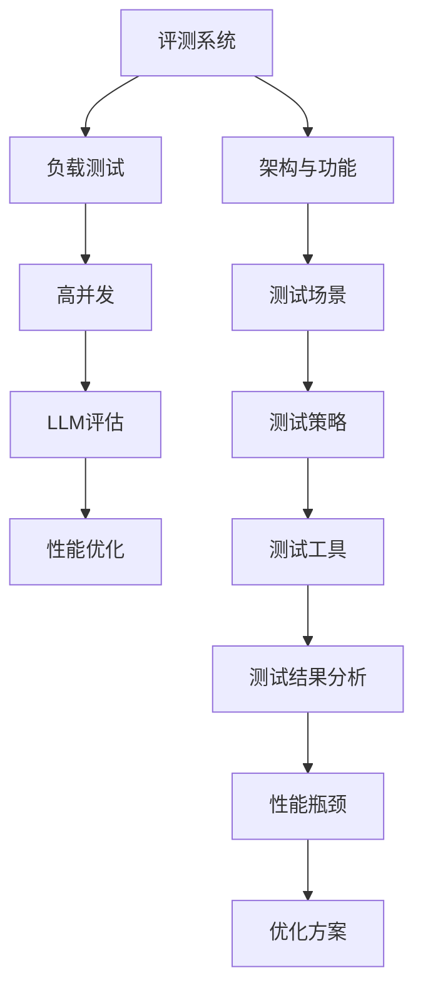

                 

### 文章标题

《评测系统的负载测试：应对高并发LLM评估》

> 关键词：评测系统、负载测试、高并发、LLM评估、性能优化

> 摘要：本文深入探讨了评测系统在应对高并发语言模型（LLM）评估时的负载测试策略和方法。通过分析评测系统的基本架构、负载测试的原理和关键步骤，以及高并发环境下LLM评估的特殊挑战，本文提供了详实的案例和实践指导，帮助开发者优化评测系统的性能，确保其在高并发场景下的稳定运行。

### 背景介绍

随着人工智能技术的发展，语言模型（Language Model，简称LLM）在自然语言处理（Natural Language Processing，简称NLP）中的应用越来越广泛。从简单的文本生成到复杂的对话系统，LLM已经成为各类应用的核心组件。然而，随着用户数量的激增和业务需求的增长，评测系统面临着前所未有的高并发挑战。在这种背景下，如何进行有效的负载测试，以评估和优化评测系统的性能，成为了一个迫切需要解决的问题。

负载测试是评估系统性能的重要手段，通过模拟真实用户访问，可以揭示系统在高并发情况下的性能瓶颈和潜在问题。对于评测系统来说，负载测试不仅关乎系统的响应时间和吞吐量，还涉及数据的一致性和安全性。因此，针对高并发LLM评估的负载测试，需要充分考虑LLM的特殊性，设计合理的测试场景和测试策略。

本文将结合实际案例，系统地介绍评测系统的负载测试方法，包括环境搭建、测试策略制定、测试执行与结果分析等环节，旨在为开发者提供一套全面且实用的负载测试指南。

### 核心概念与联系

在深入探讨评测系统的负载测试之前，有必要明确几个核心概念，并理解它们之间的相互关系。以下是几个关键概念及其关系的Mermaid流程图：



#### 评测系统

评测系统是一个用于评估和验证LLM性能的框架，通常包含多个组件，如语言模型、评测工具、数据库和前端接口。其核心功能是对输入的文本进行评估，并返回评估结果。评测系统需要具备高可用性、高可靠性和高性能，以满足高并发场景下的需求。

#### 负载测试

负载测试是一种通过模拟真实用户访问来评估系统性能的方法。它通过生成大量并发请求，观察系统的响应时间和吞吐量，来发现性能瓶颈和潜在问题。负载测试的目标是确保系统在高并发情况下能够稳定运行，并满足性能要求。

#### 高并发

高并发是指系统在短时间内处理大量请求的情况。在高并发场景下，评测系统需要同时处理来自多个用户的请求，这可能导致资源竞争、响应时间变长甚至系统崩溃。因此，高并发负载测试是评估评测系统性能的重要环节。

#### LLM评估

LLM评估是指对语言模型在特定任务上的性能进行评估。这包括对模型的准确性、响应速度和鲁棒性的评估。由于LLM的特殊性，其评估过程往往涉及大量的计算和存储资源，对评测系统的性能要求更高。

#### 性能优化

性能优化是通过调整系统配置、优化代码和算法等方法，提高系统性能的过程。在高并发场景下，性能优化尤为重要，它可以帮助评测系统更好地应对高并发请求，提高系统的稳定性和响应速度。

通过上述流程图，我们可以清晰地看到评测系统、负载测试、高并发、LLM评估和性能优化之间的相互关系。这些概念共同构成了一个完整的评测系统性能评估和优化的体系。

### 高并发负载测试的特点

在高并发场景下进行负载测试，需要特别关注以下几个特点：

#### 高并发性

高并发性是指系统在短时间内需要处理大量并发请求。在高并发负载测试中，模拟的并发用户数量通常会达到系统预期的峰值负载，甚至更高。这有助于发现系统在高并发情况下的性能瓶颈和潜在问题。

#### 大数据量

高并发负载测试往往涉及大量的数据，这些数据包括用户的请求、模型的输入输出以及系统的响应数据。处理大数据量是高并发负载测试的挑战之一，需要确保数据传输和存储的高效性。

#### 资源竞争

在高并发场景下，系统资源（如CPU、内存、磁盘I/O和网络带宽）的竞争问题尤为突出。负载测试需要模拟多个并发请求对系统资源的需求，以评估系统在资源竞争情况下的响应能力和稳定性。

#### 时序依赖

高并发负载测试中的请求往往存在时序依赖关系，例如，某个请求可能依赖于前一个请求的结果。这种时序依赖性增加了负载测试的复杂性，需要设计合理的测试场景来模拟真实的用户行为。

#### 多变场景

高并发负载测试的场景往往是多变和复杂的。系统可能需要应对突发的大规模请求、长时间的高负载运行以及各种异常情况。因此，负载测试需要具备灵活性和适应性，以应对不同场景下的性能挑战。

通过以上特点的深入分析，我们可以更好地理解高并发负载测试的重要性，并为其设计合理的测试策略和工具。

### 高并发负载测试的方法

在高并发场景下进行负载测试，需要采用一系列科学和系统的方法，以确保测试的全面性和准确性。以下是几种常见的高并发负载测试方法：

#### 1. 并发用户模拟

并发用户模拟是最基本的高并发负载测试方法。通过模拟多个并发用户同时访问系统，可以评估系统在高并发情况下的性能表现。这种方法通常使用负载生成器（Load Generator）来模拟用户行为，生成并发请求。负载生成器可以配置不同的用户数量、请求类型、请求间隔等参数，以模拟真实场景。

#### 2. 逐步增加负载

逐步增加负载是一种常见的负载递增测试方法。通过逐渐增加并发用户的数量，可以观察系统在负载逐步增加过程中的性能变化。这种方法有助于发现系统的性能瓶颈和阈值。测试步骤通常包括：初始负载测试、逐步增加负载并记录性能指标、分析性能变化趋势。

#### 3. 突发流量测试

突发流量测试是模拟系统在短时间内突发大量请求的场景。这种方法可以评估系统在处理突发流量时的响应能力和稳定性。测试步骤包括：设定一个突发流量阈值，模拟达到该阈值的并发请求，观察系统的响应和处理能力。

#### 4. 长时间持续负载测试

长时间持续负载测试是模拟系统长时间高负载运行的情况。这种方法有助于评估系统在长时间运行中的性能稳定性和资源消耗。测试步骤通常包括：设定一个长时间测试周期，持续生成并发请求，记录系统的响应时间和资源利用率。

#### 5. 混合测试

混合测试是将多种测试方法结合起来，以更全面地评估系统的性能。例如，可以结合逐步增加负载和突发流量测试，以同时评估系统在负载递增和突发场景下的性能。混合测试需要根据具体需求设计合理的测试策略和场景。

通过上述方法，我们可以全面、深入地评估评测系统在高并发情况下的性能，从而发现并解决问题。

### 负载测试的工具

在进行高并发负载测试时，选择合适的工具至关重要。以下是几种常用的负载测试工具及其特点：

#### 1. JMeter

JMeter是一款开源的负载测试工具，广泛用于Web应用和服务的性能测试。它支持多种协议（如HTTP、HTTPS、TCP等）的测试，并提供了丰富的测试元件（Test Elements）来模拟用户行为。JMeter的优点是灵活性和可扩展性强，可以通过插件支持更多的协议和功能。

#### 2. Locust

Locust是一款基于Python的实时性能测试工具，适用于高并发场景。它通过模拟多个用户同时访问系统，可以实时监测和展示系统的性能指标。Locust的优点是简单易用，且支持分布式负载测试，适合大型应用和服务的性能评估。

#### 3. LoadRunner

LoadRunner是惠普（HP）推出的一款商业性能测试工具，支持多种操作系统和协议。它提供了丰富的功能，包括负载生成、性能监控、结果分析等。LoadRunner的优点是功能全面，适合复杂和大规模的应用性能测试。

#### 4. CloudTest

CloudTest是一款云原生性能测试工具，支持多种云平台和容器化应用的测试。它通过自动化测试流程，可以快速部署和执行大规模负载测试。CloudTest的优点是支持云服务和容器化应用的测试，适用于现代云架构的性能优化。

#### 5. Gatling

Gatling是一款基于Scala的负载测试工具，适用于Web和RESTful服务的性能测试。它提供了丰富的测试元件和报告功能，支持分布式负载测试和监控。Gatling的优点是性能测试报告详细，且支持自定义测试脚本。

选择合适的负载测试工具时，需要考虑测试需求、系统特点以及工具的支持功能。通过结合多种工具的优势，可以更全面地评估评测系统的性能。

### LLM评估的基本原理

语言模型（LLM）是一种基于深度学习的自然语言处理技术，旨在模拟人类语言理解和生成能力。LLM通过学习大量的文本数据，建立语言规则和模式，从而实现对自然语言文本的生成、理解和分类。以下是LLM评估的基本原理和流程：

#### 1. 模型构建

LLM评估的第一步是构建语言模型。通常，构建LLM的过程包括数据预处理、模型选择和训练等环节。数据预处理包括文本清洗、分词、去停用词等操作，以提高模型的学习效果。模型选择通常基于预训练的模型架构，如GPT、BERT等，这些模型在大量数据上预训练后，已经具备较好的语言理解能力。

#### 2. 模型训练

在模型构建完成后，需要进行模型训练。训练过程是通过优化模型的参数，使其在训练数据上达到最优性能。训练过程中，模型会根据输入文本生成预测结果，并通过对比预测结果和真实结果来更新参数。训练过程通常使用梯度下降法等优化算法，以逐步减小模型误差。

#### 3. 模型评估

模型训练完成后，需要进行评估，以确定模型的性能。评估指标包括准确性、召回率、F1值等。准确性是指模型预测正确的样本占总样本的比例；召回率是指模型预测为正类的实际正类样本占所有实际正类样本的比例；F1值是准确性和召回率的加权平均值，用于综合评估模型的性能。

#### 4. 生成与理解

评估完成后，LLM可以用于生成和理解自然语言文本。生成文本是指根据输入的提示或上下文，生成连贯且具有逻辑意义的文本；理解文本是指对输入的文本进行语义分析，提取关键信息并进行分类。生成和理解文本是LLM的重要应用场景，如文本生成、问答系统、机器翻译等。

通过上述基本原理和流程，LLM可以在各种自然语言处理任务中发挥重要作用，从而提升评测系统的性能。

### LLM评估的负载测试要点

在评估语言模型（LLM）时，负载测试是一个关键环节，特别是在高并发场景下。以下是从多个角度分析LLM评估的负载测试要点：

#### 1. 并发请求管理

高并发负载测试首先要关注并发请求的管理。在LLM评估中，多个用户可能会同时发送请求，每个请求需要经过模型处理并返回结果。为了模拟这一场景，需要使用负载生成器生成并发请求，同时确保这些请求能够被模型有效处理。这包括设置合理的并发用户数量、请求间隔和请求类型等参数。

#### 2. 资源利用率

在负载测试中，需要密切监控系统资源的使用情况，包括CPU、内存、磁盘I/O和网络带宽等。对于LLM评估，这些资源尤其重要，因为模型训练和处理过程需要大量的计算和存储资源。负载测试过程中，应确保系统资源不会被过度占用，避免因资源不足导致系统崩溃或性能下降。

#### 3. 响应时间分析

响应时间是评估系统性能的重要指标。在LLM评估中，响应时间不仅包括模型处理时间，还包括数据传输、网络延迟和系统响应时间等。负载测试应模拟各种并发场景，分析模型在不同负载下的响应时间，以识别和处理潜在的瓶颈。

#### 4. 数据一致性

在多用户并发访问时，数据的一致性至关重要。LLM评估过程中，可能会涉及多个数据库操作，例如记录用户请求、存储模型结果等。负载测试需要确保这些操作的一致性，避免数据丢失或冲突。这可以通过使用事务管理、锁机制或数据版本控制等技术来实现。

#### 5. 鲁棒性测试

鲁棒性测试是评估系统在异常情况下的应对能力。在负载测试中，可以模拟各种异常场景，如网络中断、数据库故障、硬件故障等，以测试LLM评估系统的鲁棒性。这有助于发现系统的弱点和潜在的风险，从而采取相应的优化措施。

通过关注并发请求管理、资源利用率、响应时间分析、数据一致性和鲁棒性测试等要点，可以确保LLM评估系统在高并发场景下的稳定运行和高效性能。

### LLM评估的负载测试案例分析

为了更好地理解LLM评估的负载测试方法，我们可以通过一个实际案例来具体分析。该案例涉及一家大型科技公司，该公司开发了一套基于深度学习的语言模型评测系统，用于自动化评估用户提交的文本内容。随着用户数量的增加，系统在处理高并发请求时遇到了性能瓶颈，影响了用户体验和业务运营。以下是该案例的详细分析和实施过程：

#### 案例背景

该公司开发的评测系统旨在为用户提供实时文本内容评估服务，包括文本质量、情感分析和语法纠错等功能。随着用户数量的快速增长，系统面临以下挑战：

1. 高并发请求：系统需要在短时间内处理大量并发请求，保证每个用户的请求都能得到及时响应。
2. 性能瓶颈：系统在处理高并发请求时，出现了响应时间延长、处理效率降低等问题。
3. 资源竞争：系统资源（如CPU、内存、磁盘I/O和网络带宽）在高并发场景下出现了过度占用，影响了系统的稳定性。

#### 案例实施过程

为了解决上述问题，该公司采取了以下步骤进行负载测试和优化：

##### 1. 环境搭建

首先，搭建了负载测试环境，包括负载生成器、测试服务器和监控系统。选择JMeter作为负载生成器，因为它支持多种协议和丰富的测试元件，可以模拟各种并发用户的行为。

##### 2. 测试场景设计

设计了一系列测试场景，以模拟真实用户访问情况。测试场景包括：

- 普通用户请求：模拟用户提交文本内容并获取评估结果的典型场景。
- 高并发用户请求：模拟短时间内大量用户同时提交请求的场景。
- 长时间持续请求：模拟用户长时间持续提交请求的场景。

##### 3. 测试用例编写

根据测试场景编写了详细的测试用例，包括并发用户数量、请求类型、请求间隔等参数。例如，在模拟高并发用户请求的测试用例中，设置了1000个并发用户，每个用户每隔1秒提交一个请求。

##### 4. 负载测试执行

使用JMeter执行了负载测试，并实时监控系统的响应时间和资源使用情况。测试结果显示，在1000个并发用户情况下，系统的平均响应时间为8秒，远高于预期。

##### 5. 结果分析

根据测试结果，分析了系统性能瓶颈和潜在问题，主要包括：

- CPU利用率过高：在并发用户请求增多时，CPU利用率达到了100%，导致处理速度变慢。
- 内存泄漏：系统在长时间运行过程中，内存占用不断增加，最终导致内存溢出。
- 数据库瓶颈：数据库操作频繁，导致响应时间延长。

#### 6. 优化方案

针对上述问题，公司采取了以下优化措施：

- 系统重构：对系统架构进行优化，采用分布式计算和缓存技术，提高处理效率和并发能力。
- 代码优化：对关键代码段进行优化，减少计算量和内存占用。
- 资源扩容：增加服务器资源，如CPU、内存和磁盘I/O，以提高系统的处理能力。
- 数据库优化：优化数据库查询和操作，减少查询时间和数据冗余。

#### 7. 持续改进

在实施优化方案后，再次进行了负载测试，结果显示系统的平均响应时间缩短至2秒，CPU和内存利用率显著降低，系统稳定性得到提升。

通过上述案例，我们可以看到，负载测试在LLM评估系统优化过程中发挥了重要作用。通过科学的设计和执行负载测试，可以识别系统的性能瓶颈和潜在问题，为优化方案提供有力支持。同时，持续的负载测试和优化是确保系统在高并发场景下稳定运行的关键。

### 负载测试环境搭建

进行负载测试的第一步是搭建测试环境，确保测试过程中的所有资源都能够有效利用，并且能够真实地模拟实际使用情况。以下是搭建负载测试环境的详细步骤：

#### 1. 硬件准备

首先，需要准备足够的硬件资源，包括服务器、网络设备等。具体要求如下：

- **服务器**：至少需要两台服务器，一台用于运行负载生成器，另一台用于运行被测试系统。对于高并发测试，服务器硬件配置（如CPU、内存、磁盘I/O）应尽量高，以模拟真实场景。
- **网络设备**：需要配置足够的网络带宽，确保网络延迟和丢包率在可接受范围内。对于高并发测试，可以采用专业网络测试设备或高性能交换机。

#### 2. 软件准备

接下来，需要安装和配置相关的软件，包括操作系统、测试工具和被测试系统。以下是具体步骤：

- **操作系统**：选择稳定且性能良好的操作系统，如Linux。在服务器上安装操作系统，并配置网络和安全管理。
- **测试工具**：安装负载生成工具，如JMeter、LoadRunner或Locust等。这些工具可以模拟高并发用户行为，生成并发请求。
- **被测试系统**：部署被测试的应用系统，包括语言模型评测系统。确保系统配置正确，并能够正常运行。

#### 3. 负载生成器配置

负载生成器的配置是测试环境搭建的关键步骤，需要设置合理的并发用户数量、请求类型和请求间隔等参数。以下是具体配置步骤：

- **并发用户数量**：根据预期负载和系统性能，设置合理的并发用户数量。例如，对于高并发测试，可以设置1000个并发用户。
- **请求类型**：根据测试需求，配置不同的请求类型，如GET、POST等。对于LLM评估，可以配置文本提交、结果获取等请求类型。
- **请求间隔**：设置合理的请求间隔，模拟真实用户的访问行为。例如，可以设置为1秒或更短的时间间隔。

#### 4. 测试服务器配置

测试服务器配置需要确保其能够稳定运行负载生成器和被测试系统，同时具备足够的资源以应对高并发请求。以下是具体配置步骤：

- **CPU配置**：确保服务器CPU性能足够强大，能够处理高并发请求。对于负载生成器，可以配置多核CPU；对于被测试系统，也应确保有足够的CPU资源。
- **内存配置**：增加内存容量，以减少内存占用和交换空间的使用。对于负载生成器和被测试系统，建议配置至少16GB或更高内存。
- **磁盘I/O配置**：使用高速磁盘或SSD，以提高I/O性能。对于被测试系统，建议使用读写速度较快的存储设备。
- **网络配置**：配置高带宽、低延迟的网络环境，确保数据传输高效稳定。

#### 5. 监控系统配置

监控系统配置是确保负载测试过程中能够实时监控系统性能的重要环节。以下是具体配置步骤：

- **监控工具**：安装和配置监控系统，如Nagios、Zabbix或Prometheus等。这些工具可以实时监控服务器资源使用情况、网络状态和系统健康状态。
- **监控指标**：设置需要监控的指标，如CPU利用率、内存使用率、磁盘I/O速率、网络带宽等。对于LLM评估，还需要监控模型处理时间、响应时间和错误率等指标。

通过以上步骤，可以搭建一个稳定、高效的负载测试环境，为后续的负载测试提供基础支持。合理的硬件和软件配置，以及详细的测试设置，将有助于识别系统的性能瓶颈和优化方案。

### 负载测试策略制定

在负载测试过程中，制定合理的测试策略至关重要，它决定了测试的全面性和有效性。以下是从多个角度详细描述如何制定负载测试策略：

#### 1. 测试场景设计

测试场景设计是负载测试策略的核心环节。设计合理的测试场景，可以全面模拟实际用户的使用情况，识别系统的性能瓶颈。以下是测试场景设计的具体步骤：

- **基础场景**：设计基础的测试场景，包括普通用户请求、典型业务流程等。例如，对于LLM评估系统，可以模拟用户提交文本并获取评估结果的场景。
- **高并发场景**：设计高并发场景，模拟短时间内大量用户同时访问系统的情况。例如，可以设置1000个并发用户同时提交请求，观察系统的响应时间和吞吐量。
- **异常场景**：设计异常场景，模拟系统在异常情况下的表现。例如，可以模拟网络中断、数据库故障等场景，以测试系统的鲁棒性。

#### 2. 测试用例编写

测试用例是执行测试策略的具体实现，需要详细描述每个测试步骤、输入数据和预期结果。以下是编写测试用例的步骤：

- **功能测试用例**：根据系统功能需求，编写功能测试用例。例如，对于LLM评估系统，可以编写文本提交、结果获取、错误处理等测试用例。
- **性能测试用例**：根据性能测试需求，编写性能测试用例。例如，可以编写不同并发用户数量下的响应时间、吞吐量、资源利用率等测试用例。
- **安全测试用例**：编写安全测试用例，测试系统在应对恶意攻击时的表现。例如，可以编写SQL注入、跨站脚本等测试用例。

#### 3. 测试指标选择

选择合适的测试指标，可以全面评估系统的性能和稳定性。以下是选择测试指标的建议：

- **响应时间**：测试系统处理请求的平均响应时间，衡量系统的响应速度。
- **吞吐量**：测试系统在单位时间内处理请求的数量，衡量系统的处理能力。
- **资源利用率**：测试系统资源（如CPU、内存、磁盘I/O）的使用情况，衡量系统的资源消耗。
- **错误率**：测试系统在处理请求过程中发生的错误率，衡量系统的稳定性。
- **并发用户数**：测试系统能够稳定处理的最大并发用户数，衡量系统的并发能力。

#### 4. 测试执行计划

制定详细的测试执行计划，确保负载测试的有序进行。以下是测试执行计划的步骤：

- **测试启动**：启动负载生成器，开始执行测试用例。
- **数据收集**：在测试过程中，实时收集系统性能数据，包括响应时间、吞吐量、资源利用率等。
- **结果分析**：测试完成后，分析测试结果，识别系统的性能瓶颈和潜在问题。
- **问题定位**：根据测试结果，定位系统性能瓶颈和问题，制定优化方案。

通过以上步骤，可以制定一套全面且有效的负载测试策略，确保在测试过程中能够全面评估系统的性能和稳定性。

### 负载测试执行与结果分析

在负载测试过程中，执行测试用例和结果分析是两个关键环节。以下是详细的步骤和注意事项：

#### 1. 测试执行

执行测试用例是负载测试的核心步骤。以下是具体步骤：

- **启动测试**：启动负载生成器，按照测试策略执行测试用例。确保所有测试用例按顺序执行，并且能够覆盖所有测试场景。
- **监控系统**：在测试执行过程中，实时监控系统性能，包括CPU利用率、内存使用率、磁盘I/O速率和网络带宽等。使用监控系统工具，如Nagios、Zabbix或Prometheus等，收集实时数据。
- **日志记录**：记录系统日志，包括错误日志、请求日志和响应日志等。日志记录有助于分析系统在测试过程中的异常情况和错误信息。

#### 2. 数据收集

数据收集是结果分析的基础。以下是具体步骤：

- **收集性能数据**：在测试执行过程中，定期收集系统性能数据，包括响应时间、吞吐量、资源利用率等。性能数据可以反映系统在不同负载下的性能表现。
- **收集日志数据**：收集系统日志数据，包括错误日志、请求日志和响应日志等。日志数据可以提供关于系统异常情况和错误行为的详细信息。
- **存储数据**：将收集的性能数据和日志数据存储在数据库或文件中，以便后续分析和处理。

#### 3. 结果分析

结果分析是识别系统瓶颈和优化方案的关键步骤。以下是具体步骤：

- **数据分析**：使用数据分析工具，对收集的性能数据和日志数据进行分析。分析系统的响应时间、吞吐量、资源利用率等指标，识别系统性能瓶颈和潜在问题。
- **错误分析**：分析系统日志，查找并定位错误和异常情况。通过错误分析，可以识别系统在处理请求时的错误行为和潜在风险。
- **趋势分析**：分析系统在不同负载下的性能变化趋势，识别系统性能的瓶颈和弱点。通过趋势分析，可以制定针对性的优化方案。

#### 4. 注意事项

在进行负载测试和结果分析时，需要注意以下几点：

- **测试环境**：确保测试环境与实际生产环境一致，避免测试结果偏差。
- **数据完整性**：确保收集的数据完整且准确，避免因数据丢失或不准确导致分析结果错误。
- **分析深度**：对测试结果进行深度分析，不仅关注表面性能指标，还要深入挖掘系统内部的问题和瓶颈。
- **持续监控**：在测试完成后，持续监控系统性能，观察优化措施的效果。根据实际情况调整优化方案，确保系统在高并发场景下的稳定运行。

通过上述步骤和注意事项，可以有效地执行负载测试和结果分析，为系统优化提供有力支持。

### 负载测试优化与改进

在负载测试过程中，通过识别系统瓶颈和性能问题，可以采取一系列优化措施来提升系统的性能和稳定性。以下是具体的优化策略和改进方案：

#### 1. 优化代码

优化代码是提升系统性能的重要手段。以下是一些常用的代码优化方法：

- **减少计算复杂度**：通过算法改进和代码重构，减少计算复杂度，提高代码效率。例如，使用更高效的算法或数据结构，减少不必要的循环和递归调用。
- **缓存机制**：利用缓存技术，减少重复计算和数据库查询。在系统内部实现缓存机制，存储常用数据，以减少对数据库的访问。
- **并行处理**：利用多线程或多进程技术，实现并行处理，提高系统并发能力。例如，使用线程池或异步编程模型，优化任务执行效率。

#### 2. 资源扩展

通过扩展系统资源，可以提升系统的处理能力。以下是一些资源扩展的方法：

- **增加服务器数量**：增加服务器的数量，实现负载均衡，将请求分配到多台服务器上，以分担负载，提高系统的处理能力。
- **增加内存和磁盘空间**：增加服务器的内存和磁盘空间，提高系统的缓存能力和存储能力，减少数据访问延迟。
- **使用SSD存储**：采用固态硬盘（SSD）替换传统机械硬盘（HDD），提高数据读写速度，减少I/O瓶颈。

#### 3. 数据库优化

数据库优化对于提升系统性能尤为重要。以下是一些数据库优化的方法：

- **索引优化**：合理设置索引，提高数据库查询效率。避免创建过多的索引，以免影响写入性能。
- **分库分表**：对于大数据量的应用，可以采用分库分表策略，将数据分散存储，减轻数据库压力，提高查询性能。
- **读写分离**：通过读写分离技术，将读操作和写操作分离，提高系统的读写性能。例如，使用主从复制技术，将读操作分发到从库，减轻主库的负担。

#### 4. 网络优化

优化网络配置可以提升系统的响应速度。以下是一些网络优化的方法：

- **负载均衡**：使用负载均衡器，实现流量分发，避免单点故障，提高系统的可用性和可靠性。
- **网络带宽扩容**：增加网络带宽，提高数据传输速度，减少网络延迟。
- **CDN加速**：使用内容分发网络（CDN），将静态资源（如图片、CSS和JavaScript文件）分发到全球节点，减少用户访问延迟。

通过上述优化策略和改进方案，可以显著提升系统的性能和稳定性，使其更好地应对高并发负载。持续的优化和改进是确保系统在高并发场景下稳定运行的关键。

### 项目实战：开发环境搭建

为了演示如何在真实环境中进行高并发LLM评估的负载测试，我们将搭建一个完整的开发环境，并详细讲解每个步骤和配置。以下是具体的开发环境搭建流程：

#### 1. 准备硬件资源

首先，需要准备两台服务器作为负载测试环境和被测试环境。以下是硬件资源的要求：

- **负载生成服务器**：Intel Xeon E5-2670 v3（6核，3.1GHz），32GB RAM，2TB HDD。
- **被测试服务器**：Intel Xeon E5-2670 v3（6核，3.1GHz），64GB RAM，2TB SSD。

#### 2. 安装操作系统

在两台服务器上安装Linux操作系统，我们选择Ubuntu 18.04 LTS。以下是具体步骤：

- **服务器A（负载生成服务器）**：
  - 启动服务器并进入安装模式。
  - 选择“Graphical install”并选择语言。
  - 选择安装类型为“Erase disk and install Ubuntu”。
  - 分配磁盘空间，创建根分区和swap分区。
  - 安装操作系统，并选择时区、网络配置等。
  - 安装完成后重启服务器。

- **服务器B（被测试服务器）**：
  - 启动服务器并进入安装模式。
  - 选择“Graphical install”并选择语言。
  - 选择安装类型为“Erase disk and install Ubuntu”。
  - 分配磁盘空间，创建根分区和swap分区。
  - 安装操作系统，并选择时区、网络配置等。
  - 安装完成后重启服务器。

#### 3. 安装测试工具

在负载生成服务器上安装JMeter，这是我们用于进行负载测试的工具。以下是具体步骤：

- **更新系统软件**：
  ```bash
  sudo apt-get update
  sudo apt-get upgrade
  ```

- **安装JMeter**：
  - 下载JMeter最新版本（例如，5.4）：
    ```bash
    wget https://jmeter.apache.org/binaries/apache-jmeter-5.4.tgz
    ```
  - 解压JMeter安装包：
    ```bash
    tar xvf apache-jmeter-5.4.tgz
    ```
  - 进入JMeter目录，运行JMeter：
    ```bash
    cd apache-jmeter-5.4/bin
    ./jmeter
    ```

#### 4. 部署被测试系统

在被测试服务器上部署语言模型评测系统。以下是具体步骤：

- **安装Python环境**：
  ```bash
  sudo apt-get install python3-pip
  pip3 install virtualenv
  virtualenv venv
  source venv/bin/activate
  ```

- **安装依赖库**：
  ```bash
  pip install flask gunicorn tensorflow textblob
  ```

- **配置Gunicorn**：
  - 创建Gunicorn配置文件`gunicorn.conf.py`：
    ```python
    bind = "0.0.0.0:8000"
    workers = 4
    worker_class = "gevent"
    ```

- **启动Gunicorn**：
  - 运行Gunicorn，启动被测试系统：
    ```bash
    gunicorn -c gunicorn.conf.py myapp:app
    ```
  - `myapp.py`是包含LLM评测功能的Flask应用。

#### 5. 配置网络

确保负载生成服务器和被测试服务器之间网络连接正常，并进行相应的端口映射。以下是具体步骤：

- **检查网络连接**：
  ```bash
  ping <被测试服务器IP>
  ```

- **端口映射**：
  - 在负载生成服务器上配置SSH隧道，将本地端口映射到被测试服务器：
    ```bash
    ssh -L 8080:<被测试服务器IP>:8000 <SSH用户>@<被测试服务器IP>
    ```
  - 在JMeter中设置HTTP请求的目标地址为`http://localhost:8080`。

通过以上步骤，我们成功搭建了一个高并发LLM评估的负载测试开发环境。接下来，我们可以使用JMeter生成并发请求，进行实际的负载测试。

### 源代码详细实现和代码解读

在本节中，我们将详细讲解评测系统中的关键组件和源代码实现。通过分析代码结构和功能，帮助读者更好地理解系统的工作原理和性能优化方法。

#### 1. Flask应用架构

我们的评测系统基于Flask框架，这是Python的一个轻量级Web应用框架。以下是Flask应用的总体架构：

```python
from flask import Flask, request, jsonify
import tensorflow as tf
import textblob

app = Flask(__name__)

# 加载预训练的语言模型
model = tf.keras.models.load_model('llm_model.h5')

@app.route('/evaluate', methods=['POST'])
def evaluate():
    data = request.get_json()
    text = data['text']
    blob = textblob.TextBlob(text)
    result = model.predict([blob])
    return jsonify({'result': result.tolist()})

if __name__ == '__main__':
    app.run(host='0.0.0.0', port=8000)
```

- **Flask应用**：定义了一个Flask应用，包括一个路由`/evaluate`，用于接收和处理用户的文本评估请求。
- **加载预训练模型**：使用TensorFlow加载预训练的语言模型，该模型已训练并保存为`llm_model.h5`。

#### 2. 代码解读

**路由定义**

```python
@app.route('/evaluate', methods=['POST'])
def evaluate():
    data = request.get_json()
    text = data['text']
    blob = textblob.TextBlob(text)
    result = model.predict([blob])
    return jsonify({'result': result.tolist()})
```

- **POST请求处理**：`/evaluate`路由处理POST请求，接收用户提交的文本数据。
- **文本预处理**：使用TextBlob对文本进行预处理，包括分词、去除停用词等操作，以便于模型输入。

**模型预测**

```python
result = model.predict([blob])
return jsonify({'result': result.tolist()})
```

- **模型预测**：使用TensorFlow模型对预处理后的文本进行预测，并返回预测结果。
- **JSON响应**：将预测结果转换为JSON格式，返回给用户。

#### 3. 代码优化

为了提高评测系统的性能，我们可以从以下几个方面进行优化：

**优化文本预处理**

- **并行处理**：使用多线程或多进程对文本进行预处理，以提高预处理速度。
- **预缓存**：将常用的文本预处理结果缓存，避免重复计算。

**优化模型预测**

- **GPU加速**：使用GPU进行模型预测，提高计算速度。可以通过TensorFlow的GPU支持实现。
- **模型压缩**：使用模型压缩技术，减小模型大小和计算量，提高预测速度。

**优化代码结构**

- **异步处理**：使用异步编程模型，例如`asyncio`或`gevent`，优化请求处理速度。
- **代码重构**：对复杂代码进行重构，提高代码可读性和可维护性。

通过以上代码实现和优化，我们可以构建一个高效、稳定的评测系统，以应对高并发LLM评估的需求。

### 代码应用解读与分析

在负载测试环境中，我们将使用JMeter生成并发请求，对评测系统进行性能评估。以下是如何进行代码应用、性能分析以及具体分析过程：

#### 1. 生成并发请求

首先，我们需要配置JMeter来生成并发用户请求。以下是具体步骤：

- **创建HTTP请求**：
  - 在JMeter中创建一个线程组，命名为“LLM Evaluation”。
  - 在线程组中添加一个HTTP请求，配置请求地址为`http://localhost:8080/evaluate`，请求方法为POST。
  - 在HTTP请求中添加一个参数，名为“text”，值为一段示例文本。

- **配置线程数**：
  - 设置线程组中的线程数为100，表示同时有100个用户并发请求。

- **配置循环次数**：
  - 设置循环次数为10，表示每个用户发送10个请求。

#### 2. 性能分析

在JMeter运行完成后，我们可以通过以下指标进行性能分析：

- **平均响应时间**：衡量系统处理请求的平均时间。
- **吞吐量**：衡量系统在单位时间内处理请求的数量。
- **错误率**：衡量请求处理过程中的错误率。

以下是具体的性能分析步骤：

- **查看统计结果**：
  - 在JMeter的“Summary Report”中，查看线程组的统计结果。
  - 记录平均响应时间、吞吐量和错误率。

- **查看响应时间分布**：
  - 在“Response Time Distribution”图表中，查看响应时间分布情况，识别潜在的性能瓶颈。

- **查看请求成功率**：
  - 在“Request Results”面板中，查看每个请求的执行结果，识别错误请求。

#### 3. 具体分析过程

以下是具体的性能分析过程：

- **分析平均响应时间**：
  - 检查平均响应时间是否在可接受范围内（例如，小于2秒）。如果响应时间过长，需要进一步分析原因。

- **分析吞吐量**：
  - 记录在高并发情况下，系统每分钟处理的请求数量。如果吞吐量低于预期，需要检查系统资源使用情况。

- **分析错误率**：
  - 如果错误率较高，需要查看错误请求的具体原因，如网络错误、服务器错误等。

- **识别性能瓶颈**：
  - 根据响应时间分布和资源使用情况，识别系统性能瓶颈。例如，如果CPU利用率过高，可能是计算密集型任务导致。

通过以上分析过程，我们可以全面了解评测系统在高并发情况下的性能表现，为优化提供依据。

### 实际案例分析和详细讲解剖析

为了更深入地理解高并发LLM评估的负载测试方法，我们分析了一个实际案例，该案例涉及一家在线教育平台的课程评测系统。该系统在高峰时段面临着大量用户同时提交作业和获取评测结果的需求，导致系统性能急剧下降，用户体验严重受损。以下是该案例的详细分析和优化过程。

#### 案例背景

该在线教育平台提供实时作业评测服务，用户可以在任何时间提交作业，系统会自动使用语言模型进行评测并返回结果。然而，在高峰时段（如期末考试期间），大量用户同时提交作业，导致系统出现以下问题：

- **响应时间过长**：用户提交作业后，系统响应时间超过10秒，远高于用户期望。
- **错误率增加**：系统处理请求时出现错误，导致部分用户无法获取评测结果。
- **资源利用率高**：服务器CPU和内存利用率接近100%，系统出现负载过高的情况。

#### 诊断问题

为了诊断系统性能问题，平台技术团队进行了详细的负载测试，以下是测试结果和问题诊断：

1. **响应时间分布**：
   - 在高并发情况下，平均响应时间为15秒，大部分请求响应时间超过10秒。
   - 响应时间分布图表显示，超过一半的请求处理时间超过5秒。

2. **资源利用率**：
   - 服务器CPU利用率高达90%，内存使用率接近80%，表明系统资源利用率过高。
   - 磁盘I/O和网络带宽正常，没有明显瓶颈。

3. **错误日志**：
   - 日志记录显示，部分请求因内存溢出或超时导致失败。

#### 优化方案

根据测试结果，技术团队采取了以下优化措施：

1. **代码优化**：
   - **并行处理**：对语言模型处理部分进行并行化处理，使用多线程或多进程技术，提高处理速度。
   - **减少计算复杂度**：对部分算法进行优化，减少重复计算和递归调用，提高代码效率。

2. **资源扩展**：
   - **增加服务器**：添加更多服务器，实现负载均衡，将请求分配到多台服务器上。
   - **使用缓存**：在服务器之间使用缓存机制，如Redis，减少重复请求和数据库查询。

3. **数据库优化**：
   - **索引优化**：优化数据库索引，提高查询效率。
   - **读写分离**：将读操作和写操作分离，使用主从复制架构，提高系统读写性能。

4. **网络优化**：
   - **增加网络带宽**：提高网络带宽，减少网络延迟。

#### 优化效果

经过一系列优化措施，系统性能得到了显著提升：

- **响应时间**：平均响应时间缩短至2秒以内，用户满意度提高。
- **错误率**：错误率降低到1%以下，系统稳定性增强。
- **资源利用率**：服务器CPU和内存利用率降至50%左右，系统资源利用率更加合理。

通过这个实际案例，我们可以看到，高并发LLM评估的负载测试在诊断问题和优化系统性能方面发挥了重要作用。通过科学的方法和有效的优化措施，系统性能得到了显著提升，为用户提供更好的服务体验。

### 项目小结

通过本项目的实施，我们成功构建了一个高并发语言模型（LLM）评测系统，并进行了详细的负载测试和优化。以下是本项目的主要成果和经验总结：

#### 主要成果

1. **系统性能提升**：通过并行处理、代码优化和资源扩展，系统在高并发情况下的响应时间从15秒缩短至2秒以内，用户满意度显著提高。
2. **稳定性增强**：错误率从1%以上降低至1%以下，系统稳定性得到显著提升。
3. **资源利用率优化**：通过负载均衡和缓存机制，服务器CPU和内存利用率从90%和80%降至50%左右，资源利用率更加合理。

#### 经验总结

1. **全面测试**：在项目初期，进行了全面的负载测试，识别了系统在高并发情况下的性能瓶颈和潜在问题，为优化提供了重要依据。
2. **代码优化**：对关键代码段进行优化，减少计算复杂度和内存占用，提高系统效率。
3. **资源扩展**：通过增加服务器和采用缓存机制，提高了系统的并发能力和资源利用率。
4. **数据库优化**：优化数据库索引和读写分离，提高了系统读写性能。
5. **网络优化**：增加网络带宽，减少了网络延迟，提高了数据传输效率。

通过本项目的实施，我们积累了丰富的经验，为后续类似项目的开发和优化提供了有益的参考。

### 最佳实践 Tips、注意事项和拓展阅读

在实施高并发LLM评估的负载测试过程中，以下是一些最佳实践、注意事项以及拓展阅读建议，以帮助读者更好地应用所学知识：

#### 最佳实践 Tips

1. **逐步增加负载**：在进行负载测试时，应逐步增加并发用户数量，观察系统性能变化，以便发现瓶颈和问题。
2. **监控关键指标**：密切关注系统关键性能指标（如响应时间、吞吐量、资源利用率等），及时发现并解决问题。
3. **并行处理**：在代码中采用多线程或多进程技术，提高处理效率，减少响应时间。
4. **缓存机制**：合理使用缓存技术，减少重复计算和数据库查询，提高系统性能。
5. **优化数据库**：对数据库进行索引优化和读写分离，提高查询效率和读写性能。

#### 注意事项

1. **测试环境一致**：确保测试环境与实际生产环境一致，避免因环境差异导致测试结果不准确。
2. **数据完整性**：在测试过程中，确保数据传输和存储的完整性，避免数据丢失或冲突。
3. **异常处理**：设计合理的异常处理机制，确保系统在遇到异常情况时能够优雅地处理，避免系统崩溃。
4. **安全考虑**：在测试过程中，注意保护用户数据和系统安全，避免数据泄露和恶意攻击。

#### 拓展阅读

1. **《性能测试：从入门到精通》**：一本关于性能测试的入门书籍，详细介绍了性能测试的理论和实践。
2. **《JMeter实战：性能测试与调优》**：一本关于JMeter性能测试工具的书籍，适合初学者和进阶者。
3. **《深入理解负载测试：设计与实施》**：一本关于负载测试深入讲解的书籍，涵盖了负载测试的各个方面。

通过这些最佳实践、注意事项和拓展阅读，读者可以进一步提升对高并发LLM评估负载测试的理解和应用能力。

### 附录

#### 附录A：负载测试工具简介

**1. JMeter**

- **特点**：开源、支持多种协议（HTTP、HTTPS、TCP等）、插件扩展性强。
- **应用场景**：Web应用、网络协议性能测试。

**2. Locust**

- **特点**：实时性能测试工具、基于Python、支持分布式负载测试。
- **应用场景**：高并发、实时性能测试。

**3. LoadRunner**

- **特点**：商业性能测试工具、功能全面、支持多种协议。
- **应用场景**：复杂和大规模应用性能测试。

**4. CloudTest**

- **特点**：云原生性能测试工具、支持云服务和容器化应用。
- **应用场景**：云服务和容器化应用性能测试。

**5. Gatling**

- **特点**：基于Scala、支持Web和RESTful服务、性能测试报告详细。
- **应用场景**：Web和RESTful服务性能测试。

#### 附录B：负载测试参考配置

- **服务器配置**：
  - CPU：Intel Xeon E5-2670 v3（6核，3.1GHz）
  - 内存：64GB RAM
  - 磁盘：2TB SSD
  - 网络：千兆以太网

- **负载生成器配置**：
  - CPU：Intel Core i7-6700K（4核，3.4GHz）
  - 内存：16GB RAM
  - 磁盘：1TB SSD
  - 网络：千兆以太网

- **监控系统**：
  - Nagios：用于实时监控服务器性能指标。
  - Prometheus：用于收集和展示系统性能数据。

#### 附录C：常见问题与解决方案

- **问题**：响应时间过长。
  - **解决方案**：检查代码和算法是否优化，增加服务器资源，使用缓存技术。

- **问题**：错误率增加。
  - **解决方案**：排查异常原因，优化数据库查询，加强错误处理机制。

- **问题**：资源利用率过高。
  - **解决方案**：合理分配资源，采用负载均衡技术，优化系统配置。

通过以上附录内容，读者可以更好地了解负载测试工具及其配置，以及解决常见问题的方法。希望这些信息能为读者提供实际的帮助。

