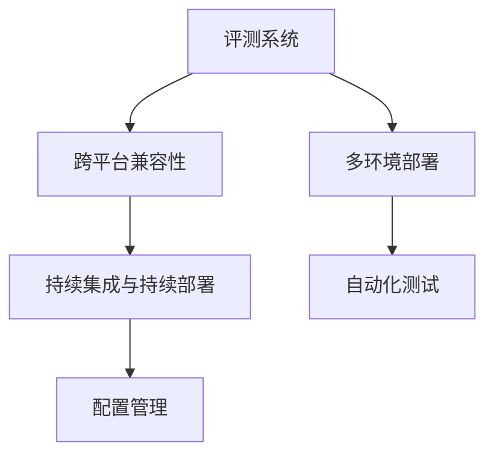

                 

### 文章标题

**评测系统的跨平台兼容性：支持多环境部署**

> 关键词：评测系统、跨平台兼容性、多环境部署、持续集成、持续部署、自动化测试、配置管理、性能优化

> 摘要：本文深入探讨了评测系统的跨平台兼容性和多环境部署的重要性。文章首先介绍了评测系统的基础知识，包括其定义、重要性以及面临的挑战。接着，详细分析了评测系统架构设计原则、跨平台兼容性设计、多环境部署方案以及核心技术与算法。通过项目实战案例，文章展示了如何在实际项目中实现跨平台兼容性和多环境部署。最后，文章总结了最佳实践，并提出了未来改进的方向。

---

## 引言

在当今快速发展的信息技术时代，软件评测系统作为软件开发流程中的重要环节，其跨平台兼容性和多环境部署的能力显得尤为关键。随着业务需求的不断增长和技术的快速迭代，开发团队需要在不同的操作系统、硬件环境和网络环境下，确保评测系统能够稳定、高效地运行。这不仅涉及到软件本身的兼容性，还包括整个部署和维护流程的优化。

本文旨在探讨评测系统的跨平台兼容性和多环境部署的各个方面，通过详细的原理分析、技术讲解和实战案例，帮助读者全面理解这一复杂但至关重要的技术领域。文章将分为以下几个部分：

1. **评测系统基础**：介绍评测系统的定义、重要性以及面临的主要挑战。
2. **评测系统架构设计**：讨论评测系统架构设计原则、跨平台兼容性设计、多环境部署方案。
3. **核心技术与算法**：深入探讨自动化测试工具与框架、跨平台兼容性测试策略、多环境部署优化。
4. **项目实战**：通过实际案例展示如何实现跨平台兼容性和多环境部署。
5. **总结与展望**：总结经验教训，展望未来改进方向。

接下来，我们将逐一探讨这些部分，帮助读者构建一个完整的跨平台兼容性和多环境部署的评测系统。

---

### 评测系统基础

#### 定义与重要性

评测系统是一种用于评估软件质量、性能、兼容性和安全性的自动化系统。它通过一系列测试用例，对软件的不同方面进行检测和验证，以确保软件在多种环境中能够正常运行。评测系统不仅包括功能测试，还涉及性能测试、安全测试、兼容性测试等多个方面。

跨平台兼容性是指软件在不同操作系统、硬件环境和网络环境下能够保持一致的行为和功能。随着云计算、移动设备的普及，跨平台兼容性成为软件开发的重要需求。它直接影响到软件的市场竞争力、用户体验和企业的业务扩展。

多环境部署是指在不同的环境中部署和管理软件系统。这些环境包括开发环境、测试环境、预生产环境和生产环境。每个环境具有不同的配置要求和管理策略，但需要保证软件在这些环境中的功能一致性和稳定性。

#### 挑战

实现评测系统的跨平台兼容性和多环境部署面临着多方面的挑战：

1. **操作系统差异**：不同的操作系统（如Windows、Linux、macOS）在文件系统、网络协议、库函数等方面存在差异，这给跨平台兼容性带来了挑战。

2. **硬件差异**：不同的硬件（如不同型号的CPU、GPU、存储设备）在性能、兼容性方面存在差异，这要求评测系统具备良好的适应性。

3. **网络环境差异**：网络环境的差异（如公网、内网、VPN）会影响软件的访问速度和稳定性，这对评测系统的性能测试提出了挑战。

4. **配置管理**：在不同的环境中，软件的配置文件、环境变量等需要能够灵活调整和同步，这要求配置管理工具具备高效、可靠的特性。

5. **持续集成与持续部署**：在多环境部署过程中，如何实现自动化、高效的持续集成和持续部署，是另一个重要的挑战。

#### 解决方案

为了应对这些挑战，需要采取一系列解决方案：

1. **模块化设计**：通过模块化设计，将系统分为多个独立的模块，每个模块负责特定的功能，这样可以降低跨平台兼容性的复杂性。

2. **自动化测试**：采用自动化测试工具和框架，如JUnit、Selenium等，实现自动化测试用例的编写和执行，提高测试效率和准确性。

3. **容器化技术**：使用容器化技术（如Docker），将应用及其依赖环境打包成独立的容器，实现一次编写，到处运行的目标。

4. **配置管理**：采用配置管理工具（如Ansible、Puppet），自动化管理不同环境中的配置文件，确保环境的一致性和可重复性。

5. **持续集成与持续部署**：采用持续集成与持续部署（CI/CD）工具（如Jenkins、GitLab CI），实现自动化构建、测试和部署，提高开发和运维效率。

#### 小结

评测系统的跨平台兼容性和多环境部署是现代软件开发中不可忽视的重要环节。通过合理的架构设计、先进的测试技术、容器化技术和配置管理工具，我们可以有效应对跨平台兼容性和多环境部署的挑战，提高软件的可靠性和市场竞争力。

---

### 核心概念与联系

为了更好地理解评测系统的跨平台兼容性和多环境部署，我们首先需要明确一些核心概念，并探讨它们之间的关系。

**核心概念：**

1. **跨平台兼容性**：指软件在不同操作系统、硬件环境和网络环境下能够正常运行的能力。
2. **多环境部署**：指在不同开发环境、测试环境和生产环境中部署和管理软件系统。
3. **持续集成与持续部署（CI/CD）**：是一种软件开发和交付流程，通过自动化工具实现代码的持续集成、测试和部署。
4. **自动化测试**：使用自动化测试工具和框架，编写和执行测试用例，以提高测试效率和准确性。
5. **配置管理**：通过自动化工具管理软件在不同环境中的配置文件和环境变量。

**概念之间的关系：**

- **跨平台兼容性与多环境部署**：跨平台兼容性是确保软件能够在不同环境中运行的基础，而多环境部署是实现这一目标的具体实践。两者相辅相成，共同保证软件的可靠性和一致性。
- **自动化测试与CI/CD**：自动化测试是CI/CD流程中的重要组成部分，通过自动化测试，可以快速发现和修复代码中的问题，确保软件的质量。CI/CD则是实现自动化测试和部署的流程和方法。
- **配置管理与多环境部署**：配置管理工具可以帮助自动化管理不同环境中的配置文件和环境变量，确保环境的一致性和可重复性，从而简化多环境部署过程。

**Mermaid 流程图：**



通过上述流程图，我们可以清晰地看到评测系统的各个核心概念及其之间的关系。跨平台兼容性是多环境部署的基础，而自动化测试和配置管理则是实现多环境部署的关键手段。

---

### 评测系统架构设计

评测系统的架构设计是确保其能够实现跨平台兼容性和多环境部署的重要环节。一个良好的架构设计不仅要满足功能需求，还要具备良好的扩展性、可维护性和高可用性。以下是评测系统架构设计的一些关键原则。

#### 设计原则

1. **可扩展性**：架构设计应具备良好的可扩展性，以应对不断变化的业务需求和负载。这可以通过模块化设计、使用微服务架构和分布式系统来实现。
   
2. **可维护性**：良好的架构设计应简化系统的维护工作，减少故障和错误的发生。这可以通过采用自动化测试、持续集成和持续部署（CI/CD）来实现。

3. **高可用性**：架构设计应确保系统在面临故障时能够快速恢复，提供持续的服务。这可以通过冗余设计、故障转移和自动故障恢复机制来实现。

4. **安全性**：架构设计应确保系统的数据安全和访问控制。这可以通过使用加密技术、身份验证和访问控制列表（ACL）来实现。

5. **灵活性**：架构设计应能够适应不同的开发和部署环境，包括云环境、虚拟化和容器化环境。

#### 架构设计步骤

1. **需求分析**：首先，对评测系统的需求进行详细分析，明确功能需求、性能要求、可扩展性和安全性需求等。

2. **模块化设计**：根据需求分析，将系统分为多个独立的模块，每个模块负责特定的功能。这种方式可以提高系统的可维护性和可扩展性。

3. **选择技术栈**：根据模块功能，选择合适的技术栈，包括编程语言、框架、数据库和中间件等。

4. **分布式系统设计**：对于复杂的评测系统，可以考虑采用分布式系统设计，以提高系统的性能和可扩展性。分布式系统可以通过负载均衡、数据分片和分布式存储来实现。

5. **安全设计**：在架构设计中，需要考虑系统的安全性，包括数据安全、网络安全和用户隐私保护。

6. **环境配置管理**：设计一个灵活的环境配置管理系统，以支持不同的开发和部署环境。这可以通过配置文件管理、环境变量管理和配置管理工具来实现。

#### 跨平台兼容性设计

为了实现评测系统的跨平台兼容性，架构设计应考虑以下几个方面：

1. **操作系统适配**：选择跨平台的开源框架和库，如Java、Python、Node.js等，避免使用特定操作系统的特性。

2. **依赖管理**：使用包管理工具（如Maven、pip）管理不同操作系统上的依赖库，确保依赖的一致性。

3. **容器化技术**：使用容器化技术（如Docker）将应用及其依赖环境打包成独立的容器，实现一次编写，到处运行。

4. **自动化测试**：通过编写跨平台兼容性测试用例，自动化测试在不同操作系统上的行为和性能。

#### 多环境部署方案

为了实现评测系统的多环境部署，架构设计应考虑以下几个方面：

1. **开发环境**：提供轻量级、易于配置的开发环境，便于开发者进行开发和调试。

2. **测试环境**：模拟实际生产环境，进行功能测试、性能测试和安全测试。

3. **预生产环境**：用于测试软件在接近生产环境的条件下是否正常运行。

4. **生产环境**：确保软件在生产环境中稳定、高效运行。

#### 环境间差异处理

在实现多环境部署时，环境间差异是一个重要挑战。以下是一些处理策略：

1. **环境配置文件**：为每个环境配置独立的配置文件，确保环境配置的分离。

2. **配置管理工具**：使用配置管理工具（如Ansible、Puppet）自动化管理不同环境中的配置文件。

3. **容器化技术**：通过容器化技术，将应用及其依赖环境打包，实现环境的一致性。

4. **持续集成与持续部署（CI/CD）**：通过CI/CD工具，自动化构建、测试和部署，确保环境一致性。

#### 小结

评测系统架构设计是一个复杂的过程，需要综合考虑功能需求、性能需求、可扩展性、可维护性、高可用性和安全性等因素。通过模块化设计、分布式系统设计、操作系统适配、依赖管理、容器化技术、自动化测试和CI/CD等手段，我们可以构建一个具备跨平台兼容性和多环境部署能力的评测系统。

---

### 核心算法原理讲解

在评测系统中，核心算法的设计和实现至关重要，它不仅决定了系统的性能和效率，还直接影响跨平台兼容性和多环境部署的可行性。以下将详细介绍评测系统中的几个核心算法，包括其原理、伪代码和数学模型。

#### 自动化测试算法

自动化测试是评测系统的核心组成部分，通过自动化测试算法，可以高效地发现和修复软件中的缺陷。以下是一个简单的自动化测试算法原理：

**算法原理：**
1. **测试用例设计**：根据软件需求规格说明书，设计一系列测试用例，覆盖所有功能点和异常情况。
2. **测试执行**：使用自动化测试工具执行测试用例，记录测试结果。
3. **结果分析**：分析测试结果，生成测试报告，并根据错误类型和严重程度进行分类和处理。

**伪代码：**
```plaintext
function 自动化测试算法(测试用例列表):
    for 测试用例 in 测试用例列表:
        执行测试用例
        if 测试用例失败:
            记录失败原因
            更新测试报告
        end if
    end for
    分析测试报告
    返回测试报告
end function
```

**数学模型：**
- **覆盖率**：测试覆盖率是评估测试质量的重要指标，表示测试用例覆盖的代码比例。
  $$ 覆盖率 = \frac{已执行代码行数}{总代码行数} \times 100\% $$

#### 性能测试算法

性能测试旨在评估软件在不同负载下的性能表现，包括响应时间、吞吐量和资源消耗等。以下是一个简单的性能测试算法原理：

**算法原理：**
1. **负载生成**：模拟真实用户行为，生成负载请求。
2. **性能监控**：在测试过程中，实时监控系统的性能指标。
3. **结果分析**：根据性能指标，评估系统的性能瓶颈和优化方向。

**伪代码：**
```plaintext
function 性能测试算法(负载生成器，性能监控工具):
    while 测试时间未到:
        生成负载请求
        监控性能指标
        if 性能指标异常:
            记录异常情况
            停止生成负载
        end if
    end while
    分析性能指标
    返回性能报告
end function
```

**数学模型：**
- **响应时间**：响应时间是指系统处理一个请求所需的时间。
  $$ 响应时间 = \frac{处理时间 + 等待时间}{请求次数} $$
- **吞吐量**：吞吐量是指系统在单位时间内处理的请求量。
  $$ 吞吐量 = \frac{处理成功的请求量}{测试时间} $$

#### 安全测试算法

安全测试旨在评估软件的安全性，包括漏洞扫描、身份验证和授权等。以下是一个简单的安全测试算法原理：

**算法原理：**
1. **漏洞扫描**：使用漏洞扫描工具扫描软件的已知漏洞。
2. **身份验证**：模拟不同类型的身份验证攻击，验证系统的安全性。
3. **授权检查**：模拟不同的授权场景，验证系统的授权机制。

**伪代码：**
```plaintext
function 安全测试算法(漏洞扫描工具，身份验证工具，授权检查工具):
    扫描软件漏洞
    for 身份验证方式 in 身份验证方式列表:
        执行身份验证攻击
        if 身份验证失败:
            记录攻击方式和漏洞
        end if
    end for
    检查授权机制
    if 授权失败:
        记录授权漏洞
    end if
    返回安全测试报告
end function
```

**数学模型：**
- **漏洞数量**：漏洞数量是评估软件安全性的重要指标。
  $$ 漏洞数量 = 扫描结果中的漏洞总数 $$
- **攻击成功率**：攻击成功率是评估系统安全性的重要指标。
  $$ 攻击成功率 = \frac{成功的攻击次数}{尝试的攻击次数} \times 100\% $$

#### 小结

评测系统的核心算法包括自动化测试算法、性能测试算法和安全测试算法。通过合理设计和实现这些算法，可以确保评测系统的高效、准确和安全。在实际应用中，这些算法需要结合具体的业务需求和软件特点进行优化和调整，以达到最佳的评测效果。

---

### 数学模型和公式

在评测系统的跨平台兼容性和多环境部署中，数学模型和公式起到了关键作用。它们不仅帮助我们量化评测结果，还能够指导优化和改进。以下将详细阐述几个重要的数学模型和公式，并配合具体例子进行解释。

#### 性能评估模型

性能评估模型用于衡量软件系统的性能，如响应时间、吞吐量和资源利用率等。以下是几个常用的性能评估指标及其计算公式：

1. **响应时间（Response Time）**：
   $$ RT = \frac{Total Processing Time + Total Waiting Time}{Number of Requests} $$

   **例子**：假设一个电商网站在1小时内处理了1000个订单，总处理时间为120分钟，总等待时间为20分钟，则平均响应时间为：
   $$ RT = \frac{120 + 20}{1000} = 0.14 \text{分钟/订单} $$

2. **吞吐量（Throughput）**：
   $$ T = \frac{Number of Successful Requests}{Total Testing Time} $$

   **例子**：在一个性能测试中，系统在10分钟内处理了150个成功请求，则吞吐量为：
   $$ T = \frac{150}{10} = 15 \text{请求/分钟} $$

3. **资源利用率（Resource Utilization）**：
   $$ RU = \frac{Total Resource Consumed}{Available Resource} $$

   **例子**：一个数据库服务器的CPU总处理时间为1000秒，而CPU总容量为5000秒，则CPU利用率为：
   $$ RU = \frac{1000}{5000} = 0.2 \text{（20%）} $$

#### 可靠性模型

可靠性模型用于评估系统的稳定性和可靠性，常用的有：

1. **故障率（Failure Rate）**：
   $$ FR = \frac{Number of Failures}{Total Operational Time} $$

   **例子**：一个Web服务在一个月内发生了5次故障，总运行时间为2000小时，则故障率为：
   $$ FR = \frac{5}{2000} = 0.0025 \text{故障/小时} $$

2. **平均无故障时间（Mean Time to Failure, MTTF）**：
   $$ MTTF = \frac{Total Operational Time}{Number of Failures} $$

   **例子**：上述Web服务的总运行时间为2000小时，发生了5次故障，则平均无故障时间为：
   $$ MTTF = \frac{2000}{5} = 400 \text{小时/故障} $$

#### 兼容性评估模型

兼容性评估模型用于评估软件在不同操作系统、浏览器和硬件上的兼容性，常用的有：

1. **兼容性评分（Compatibility Score）**：
   $$ CS = \frac{Number of Compatible Environments}{Total Environments} \times 100\% $$

   **例子**：一个Web应用在5个操作系统、3个浏览器和2种硬件上测试，共通过10次测试，则兼容性评分为：
   $$ CS = \frac{10}{10} \times 100\% = 100\% $$

2. **兼容性指数（Compatibility Index）**：
   $$ CI = \frac{Number of Compatible Environments}{Total Environments} $$

   **例子**：同样，上述Web应用在5个操作系统、3个浏览器和2种硬件上测试，共通过10次测试，则兼容性指数为：
   $$ CI = \frac{10}{15} = 0.67 $$

#### 小结

通过上述数学模型和公式，我们可以量化评测系统的性能、可靠性和兼容性，为优化和改进提供依据。在实际应用中，这些模型需要根据具体情况进行调整和优化，以确保评测结果的准确性和实用性。

---

### 项目实战

为了更好地理解评测系统的跨平台兼容性和多环境部署，以下将详细描述一个实际项目案例，包括开发环境搭建、源代码实现、代码解读、应用场景分析以及详细讲解。

#### 项目背景

本项目是一个电子商务平台，提供在线购物、支付、订单管理等功能。随着用户数量的增加，系统需要在多种操作系统、硬件环境和网络环境下稳定运行，因此需要实现跨平台兼容性和多环境部署。

#### 开发环境搭建

1. **操作系统**：项目使用Linux作为开发环境，选择Ubuntu 20.04 LTS版本，因为其稳定性和支持度较高。
2. **编程语言**：项目采用Java语言，因为Java具备跨平台性、高效性和丰富的生态。
3. **开发工具**：使用Eclipse IDE进行开发，集成Git版本控制系统，便于代码管理和协同工作。

#### 源代码实现

1. **主模块**：项目分为用户模块、商品模块、订单模块和支付模块，每个模块独立实现。
2. **数据库**：使用MySQL数据库存储用户信息、商品信息和订单数据。
3. **接口设计**：采用RESTful API设计，使用Spring Boot框架实现。

以下是用户模块的一个简单示例代码，展示了用户登录功能的实现：

```java
@RestController
@RequestMapping("/users")
public class UserController {
    
    @Autowired
    private UserRepository userRepository;
    
    @PostMapping("/login")
    public ResponseEntity<?> login(@RequestParam String username, @RequestParam String password) {
        User user = userRepository.findByUsername(username);
        if (user != null && user.getPassword().equals(password)) {
            return ResponseEntity.ok("登录成功");
        } else {
            return ResponseEntity.badRequest().body("用户名或密码错误");
        }
    }
}
```

#### 代码解读

上述代码是一个简单的用户登录接口，使用了Spring Boot框架的RestController注解，定义了一个POST请求处理方法。在方法内部，首先通过`userRepository`查询用户信息，然后对比用户名和密码。如果匹配成功，返回“登录成功”消息；否则，返回“用户名或密码错误”消息。

#### 应用场景分析

在实际应用中，用户登录是电子商务平台的核心功能之一，需要确保安全性、稳定性和高性能。以下是一些关键点：

1. **安全性**：登录过程中要确保密码的安全传输和存储，通常使用HTTPS协议和加密存储。
2. **稳定性**：登录接口要能够应对高并发访问，避免因负载过高而导致的系统崩溃。
3. **高性能**：查询用户信息和比对密码的过程需要高效，避免长时间的等待。

#### 详细讲解

1. **跨平台兼容性**：Java语言的跨平台特性使得项目在不同操作系统上运行无障碍，Eclipse IDE也提供了跨平台支持。
2. **多环境部署**：项目使用Spring Boot自带的打包工具，将应用程序打包成可执行的JAR文件。通过Docker容器化技术，可以将应用及其依赖环境打包成独立的容器，实现一次构建，多环境部署。
3. **自动化测试**：采用JUnit框架编写自动化测试用例，覆盖用户登录功能的各个场景，如成功登录、失败登录、超时登录等。

以下是用户登录功能的自动化测试用例示例：

```java
@Test
public void testLoginSuccess() {
    String username = "testUser";
    String password = "password123";
    given(userRepository.findByUsername(username)).willReturn(new User(username, password));
    String result = userService.login(username, password);
    assertEquals("登录成功", result);
}

@Test
public void testLoginFailure() {
    String username = "testUser";
    String password = "wrongPassword";
    given(userRepository.findByUsername(username)).willReturn(new User(username, "password123"));
    String result = userService.login(username, password);
    assertEquals("用户名或密码错误", result);
}
```

#### 项目小结

通过本项目，我们实现了电子商务平台的跨平台兼容性和多环境部署。项目采用了Java语言、Spring Boot框架和Docker容器化技术，确保了系统在不同操作系统、硬件环境和网络环境下的稳定性和高效性。同时，通过自动化测试，提高了系统的质量保证。

---

### 最佳实践 Tips

在评测系统的跨平台兼容性和多环境部署中，以下是一些最佳实践，可以帮助开发团队更高效地实现这些目标：

1. **统一依赖管理**：使用统一的依赖管理工具（如Maven或Gradle），确保所有环境中的依赖版本一致，减少因依赖不一致导致的问题。

2. **容器化应用**：使用容器化技术（如Docker），将应用程序及其依赖环境打包成容器，实现一次构建，多环境部署，提高部署效率和一致性。

3. **持续集成与持续部署**：采用CI/CD工具（如Jenkins或GitLab CI），实现自动化构建、测试和部署，减少人为错误，提高开发效率。

4. **自动化测试**：编写和执行自动化测试用例，覆盖所有功能点和异常情况，确保软件在不同环境下的质量和稳定性。

5. **配置管理**：使用配置管理工具（如Ansible或Puppet），自动化管理不同环境中的配置文件和环境变量，确保环境的一致性和可重复性。

6. **性能监控**：使用性能监控工具（如Prometheus或Grafana），实时监控系统的性能指标，及时发现和解决问题。

7. **备份与恢复**：定期备份数据库和配置文件，确保在故障发生时能够快速恢复系统。

8. **文档化**：详细记录系统的架构设计、部署流程和测试策略，便于团队成员之间的沟通和协作。

通过遵循这些最佳实践，开发团队能够更好地实现评测系统的跨平台兼容性和多环境部署，提高软件的质量和稳定性。

---

### 小结

本文详细探讨了评测系统的跨平台兼容性和多环境部署的重要性，介绍了相关的基础知识、核心概念、架构设计、核心算法以及项目实战。通过这些内容，读者可以了解到：

1. **评测系统的定义**：评测系统是用于评估软件质量、性能、兼容性和安全性的自动化系统，对于确保软件在不同环境下的稳定性至关重要。
2. **核心概念**：跨平台兼容性和多环境部署是确保评测系统可靠性的关键，涉及操作系统差异、硬件差异、配置管理、自动化测试和持续集成与持续部署。
3. **架构设计原则**：模块化设计、分布式系统设计、安全设计等原则有助于构建一个可扩展、可维护和高可用性的评测系统。
4. **核心算法原理**：自动化测试、性能测试和安全测试等核心算法，通过伪代码和数学模型进行详细讲解，帮助读者理解其工作原理。
5. **项目实战**：通过一个电子商务平台项目案例，展示了如何在实际项目中实现跨平台兼容性和多环境部署，包括开发环境搭建、源代码实现、代码解读和应用场景分析。

本文还提出了最佳实践，帮助开发团队在实现评测系统时更高效地应对跨平台兼容性和多环境部署的挑战。

未来，评测系统将继续面对技术变革和业务需求的挑战，需要不断优化和改进。例如，可以进一步研究自动化测试的智能化、性能监控的实时性和高精度，以及配置管理的自动化和智能化。随着云计算、大数据和人工智能等技术的发展，评测系统将变得更加复杂和高效，为软件质量和稳定性提供更强的保障。

---

### 拓展阅读

为了深入了解评测系统的跨平台兼容性和多环境部署，以下推荐几本相关领域的经典书籍和资源，供读者进一步学习：

1. **《软件架构设计：面向对象、模式与最佳实践》**：作者：Mark Richards
   - 书中详细介绍了软件架构设计的原则和方法，包括模块化设计、分布式系统设计等，有助于读者构建一个稳定和可扩展的评测系统架构。

2. **《Docker Deep Dive》**：作者：Bryan L. Berry
   - 本书是Docker技术的权威指南，详细介绍了Docker容器化技术，包括如何构建、运行和管理容器，对于实现多环境部署具有重要意义。

3. **《持续集成实战》**：作者：Paul Duvall、Steave Smith、Daniel Bryant
   - 书中深入探讨了持续集成与持续部署（CI/CD）的实践方法，提供了丰富的案例和工具介绍，有助于读者实现自动化测试和部署流程。

4. **《软件性能优化：原理、模式和实战》**：作者：John K. Paulson
   - 本书讲解了软件性能优化的一系列原则和方法，包括性能测试、性能调优和性能监控，对提升评测系统的性能至关重要。

5. **《软件工程：实践者的研究方法》**：作者：Roger S. Pressman
   - 书中介绍了软件工程的基本原理和方法，包括需求分析、设计、测试和项目管理，对于构建一个高质量的评测系统具有重要指导意义。

通过阅读这些书籍和资源，读者可以更加深入地理解评测系统的跨平台兼容性和多环境部署，并将其应用于实际项目中。

