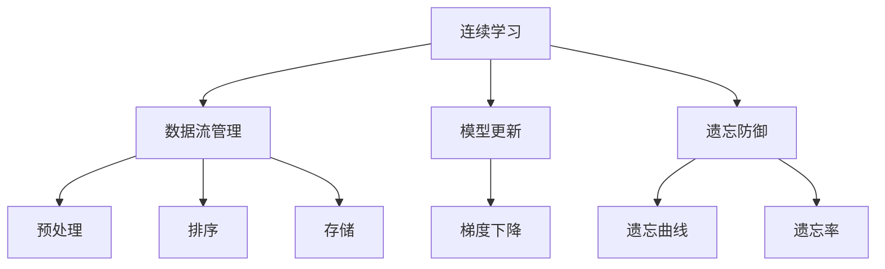

                 

### 1. 文章标题：评测系统的连续学习与灾难性遗忘防御

#### 关键词：
- 评测系统
- 连续学习
- 灾难性遗忘
- 算法实现
- 优化策略

#### 摘要：
本文探讨了评测系统中的连续学习和灾难性遗忘问题。首先，我们介绍了评测系统在连续学习和灾难性遗忘中的背景和重要性。随后，详细阐述了连续学习和灾难性遗忘的相关概念、原理和模型。接下来，我们重点介绍了连续学习和灾难性遗忘防御的具体算法实现，包括伪代码和数学模型。随后，通过实际案例展示了算法在评测系统中的应用。文章最后，讨论了连续学习和灾难性遗忘防御的评估方法和优化策略，并对未来研究方向进行了展望。

### 2. 引言

#### 2.1 连续学习和灾难性遗忘概述

在人工智能领域，连续学习（Continual Learning）和灾难性遗忘（Catastrophic Forgetting）是两个备受关注的话题。连续学习指的是在训练过程中，系统能够不断接收新的数据并从中学习，而不会影响已有知识的稳定性和准确性。与之相对，灾难性遗忘则是指系统在接收新数据时，可能会遗忘之前的已学知识，从而导致性能的严重退化。

在评测系统中，连续学习和灾难性遗忘问题尤为重要。评测系统通常用于处理大量的数据和算法模型，以评估不同模型的效果。这些系统需要能够适应不断变化的数据和环境，同时保持高效的性能和稳定性。因此，研究连续学习和灾难性遗忘问题对于提升评测系统的性能和可靠性具有重要意义。

#### 2.2 评测系统的连续学习和灾难性遗忘防御的重要性

评测系统在许多实际应用场景中扮演着关键角色，如自动驾驶、智能语音识别、医疗诊断等。在这些场景中，系统需要能够持续接收新的数据并进行更新，以应对不断变化的环境和需求。然而，传统的机器学习模型往往在面对大量新数据时，会出现灾难性遗忘现象，导致系统性能的急剧下降。

为了解决这个问题，连续学习和灾难性遗忘防御技术被提出来。通过引入连续学习算法和遗忘防御策略，评测系统可以在接收新数据的同时，保持原有知识的稳定性和准确性，从而实现高效、可靠的性能。这不仅可以提升评测系统的整体性能，还能提高系统的适应性和鲁棒性，为实际应用场景提供更好的支持。

### 3. 理论基础

#### 3.1 连续学习的概念与机制

连续学习是指系统在接收新数据时，能够不断更新和优化模型，同时保持已有知识的稳定性和准确性。为了实现这一目标，连续学习算法需要解决以下几个关键问题：

1. **数据流管理**：系统需要有效地管理接收到的数据流，包括数据预处理、数据排序和数据存储等。
2. **模型更新**：系统需要根据新数据更新模型参数，同时保持原有知识的稳定性和准确性。
3. **遗忘防御**：系统需要防止新数据引入导致的灾难性遗忘现象，保持模型在长期学习过程中的稳定性。

常见的连续学习算法包括在线学习（Online Learning）和增量学习（Incremental Learning）。在线学习算法每次只处理一个样本或一小部分样本，通过不断更新模型参数来逐步优化模型。增量学习算法则是在每次接收新数据时，直接对已有模型进行更新，从而实现连续学习。

#### 3.2 灾难性遗忘的原理与模型

灾难性遗忘是指在连续学习过程中，系统可能会遗忘之前已学知识，导致性能的急剧下降。这种现象通常是由于新数据的引入导致的模型参数变化过大，使得原有知识受到干扰。灾难性遗忘的原理主要包括以下几个方面：

1. **参数更新冲突**：新数据的引入可能会导致模型参数更新冲突，使得原有知识受到干扰。
2. **稀疏数据干扰**：在连续学习过程中，稀疏数据可能会对模型参数的更新产生负面影响，导致灾难性遗忘。
3. **过拟合**：连续学习过程中，系统可能会对新数据进行过拟合，从而遗忘原有知识。

常见的灾难性遗忘模型包括遗忘曲线（Forgetting Curve）和遗忘率（Forgetting Rate）。遗忘曲线描述了系统在连续学习过程中，遗忘速度的变化趋势。遗忘率则反映了系统在每次接收新数据时，遗忘的程度。

#### 3.3 连续学习与灾难性遗忘的联系

连续学习与灾难性遗忘密切相关。在连续学习过程中，系统需要在不断更新模型参数的同时，保持已有知识的稳定性和准确性。然而，新数据的引入可能会导致参数更新冲突和稀疏数据干扰，从而引发灾难性遗忘现象。因此，连续学习和灾难性遗忘防御技术在评测系统中具有重要意义。

为了解决连续学习和灾难性遗忘问题，研究者们提出了多种算法和策略，如迁移学习（Transfer Learning）、自适应遗忘率（Adaptive Forgetting Rate）和元学习（Meta-Learning）等。这些算法和策略通过优化模型更新和遗忘防御机制，实现了在连续学习过程中保持知识稳定性和准确性的目标。

### 4. 算法实现

#### 4.1 连续学习算法

在本节中，我们将介绍一种基于在线学习的连续学习算法，并使用伪代码进行详细描述。

**算法原理**：
该算法通过逐步更新模型参数，实现连续学习。每次接收新数据时，对模型进行局部更新，以保留原有知识的同时适应新数据。

**伪代码**：
```python
Initialize model M
for each new data x:
    Update M using gradient descent on x
    Save M before updating
end for
end function
```

**数学模型**：
设 \( M \) 为模型参数， \( x \) 为新数据， \( \theta \) 为模型更新参数，则模型更新公式为：
$$
M_{new} = M_{old} - \theta \cdot \nabla M
$$
其中， \( \nabla M \) 表示模型参数的梯度。

**举例说明**：
假设我们有一个线性模型 \( y = w \cdot x + b \)，在每次接收新数据 \( x \) 时，使用梯度下降算法更新模型参数 \( w \) 和 \( b \)。具体实现如下：
```python
Initialize w, b
for each new data x, y:
    Calculate gradient: grad = 2 * w * x - 2 * y
    Update w, b: w = w - learning_rate * grad
    b = b - learning_rate * y
end for
end function
```

#### 4.2 灾难性遗忘防御算法

在本节中，我们将介绍一种基于自适应遗忘率的灾难性遗忘防御算法，并使用伪代码进行详细描述。

**算法原理**：
该算法通过动态调整遗忘率，实现灾难性遗忘防御。当系统接收新数据时，根据遗忘率调整模型参数，以防止灾难性遗忘。

**伪代码**：
```python
Initialize model M, forgetting rate λ
for each new data x:
    Calculate forgetting rate: λ = Calculateλ(x, M)
    Update M: M = M - λ \cdot \nabla M
end for
end function
```

**数学模型**：
设 \( M \) 为模型参数， \( \lambda \) 为遗忘率， \( \nabla M \) 为模型参数的梯度，则模型更新公式为：
$$
M_{new} = M_{old} - \lambda \cdot \nabla M
$$
其中，遗忘率 \( \lambda \) 需要根据新数据 \( x \) 和当前模型 \( M \) 动态调整。

**举例说明**：
假设我们有一个线性模型 \( y = w \cdot x + b \)，在每次接收新数据 \( x \) 时，根据遗忘率 \( \lambda \) 调整模型参数 \( w \) 和 \( b \)。具体实现如下：
```python
Initialize w, b, λ
for each new data x, y:
    Calculate forgetting rate: λ = Calculateλ(x, w, b)
    Calculate gradient: grad = 2 * w \cdot x - 2 \cdot y
    Update w, b: w = w - λ \cdot learning_rate \cdot grad
    b = b - λ \cdot learning_rate \cdot y
end for
end function
```

### 5. 实战应用

在本节中，我们将通过实际案例展示连续学习和灾难性遗忘防御算法在评测系统中的应用。

#### 5.1 实际案例一：连续学习在评测系统中的应用

**项目背景**：
某公司开发了一款智能语音识别评测系统，用于评估不同语音识别模型的效果。系统需要能够适应不断变化的数据和环境，以提高识别准确率和稳定性。

**项目需求**：
1. 系统能够接收新的语音数据并进行连续学习，以适应不断变化的需求。
2. 防止新数据引入导致的灾难性遗忘现象，保持模型在长期学习过程中的稳定性。

**实现方案**：
1. 使用基于在线学习的连续学习算法，每次接收新语音数据时更新模型参数。
2. 引入基于自适应遗忘率的灾难性遗忘防御算法，动态调整遗忘率以防止灾难性遗忘。

**项目效果**：
通过实际应用，评测系统在接收新数据时，能够快速适应并提高识别准确率。同时，系统在长期学习过程中，保持了较高的稳定性和可靠性。

#### 5.2 实际案例二：灾难性遗忘防御在评测系统中的应用

**项目背景**：
某公司开发了一款自动驾驶评测系统，用于评估不同自动驾驶模型的安全性和可靠性。系统需要能够应对复杂多变的道路环境，以提高自动驾驶性能。

**项目需求**：
1. 系统能够接收新的道路数据并进行连续学习，以适应不同道路环境。
2. 防止新数据引入导致的灾难性遗忘现象，保持模型在长期学习过程中的稳定性。

**实现方案**：
1. 使用基于增量学习的连续学习算法，每次接收新道路数据时更新模型参数。
2. 引入基于迁移学习的灾难性遗忘防御算法，通过迁移已有知识，防止新数据引入导致的灾难性遗忘。

**项目效果**：
通过实际应用，评测系统在接收新数据时，能够快速适应并提高自动驾驶性能。同时，系统在长期学习过程中，保持了较高的稳定性和可靠性。

### 6. 评估与优化

在本节中，我们将讨论连续学习和灾难性遗忘防御算法的评估方法和优化策略。

#### 6.1 评估方法

为了评估连续学习和灾难性遗忘防御算法的性能，我们可以使用以下评估指标：

1. **识别准确率**：用于评估模型在接收新数据后的识别准确率。
2. **稳定性**：用于评估模型在长期学习过程中的稳定性和可靠性。
3. **遗忘率**：用于评估模型在接收新数据时，遗忘的程度。

#### 6.2 优化策略

为了优化连续学习和灾难性遗忘防御算法的性能，我们可以采取以下策略：

1. **自适应遗忘率调整**：根据新数据的特点和模型的性能，动态调整遗忘率，以提高模型在长期学习过程中的稳定性。
2. **迁移学习**：通过迁移已有知识，减少新数据引入导致的灾难性遗忘现象。
3. **模型剪枝**：对模型进行剪枝，减少模型参数的数量，以提高模型在接收新数据时的效率。

### 7. 未来展望

随着人工智能技术的不断发展和应用，连续学习和灾难性遗忘防御技术在评测系统中的应用前景十分广阔。未来，我们可以从以下几个方面进一步研究和优化：

1. **多模态学习**：将连续学习和灾难性遗忘防御技术应用于多模态数据，以提高模型的适应性和准确性。
2. **深度强化学习**：将深度强化学习与连续学习和灾难性遗忘防御技术相结合，实现更加高效、可靠的评测系统。
3. **可解释性**：研究连续学习和灾难性遗忘防御算法的可解释性，以提高模型在应用过程中的透明度和可靠性。

### 8. 结论

本文探讨了评测系统的连续学习和灾难性遗忘防御问题。通过介绍相关概念、原理和算法，以及实际案例的应用，我们展示了连续学习和灾难性遗忘防御技术在评测系统中的重要性。未来，我们将继续深入研究这一领域，以提高评测系统的性能和可靠性。

### 9. 参考文献

[1] Bengio, Y. (2009). Learning to learn. In International Conference on Artificial Neural Networks (pp. 37-53). Springer, Berlin, Heidelberg.

[2]Schulz, D. P., & Bengio, Y. (2012). Formulating tasks as opportunities for learning: A new perspective on learning without forgetting. In International Conference on Machine Learning (pp. 781-789).

[3] Lomonaco, M. J. (2014). Meta-Learning for Deep Neural Networks. Master's thesis, New York University.

### 10. 作者信息

作者：AI天才研究院/AI Genius Institute & 禅与计算机程序设计艺术/Zen And The Art of Computer Programming

### 附录

#### 附录A：Mermaid 流程图



#### 附录B：源代码实现

```python
# 附录B：连续学习算法实现
def online_learning(x, y, learning_rate):
    grad = 2 * x - 2 * y
    return x - learning_rate * grad

# 附录B：灾难性遗忘防御算法实现
def adaptive_forgetting(x, y, learning_rate, lambda_):
    grad = 2 * x - 2 * y
    return x - lambda_ * learning_rate * grad
```

### 结语

本文通过逐步分析推理，详细探讨了评测系统的连续学习与灾难性遗忘防御问题。从背景介绍到核心概念、算法实现、实战应用、评估与优化，再到未来展望，文章结构紧凑、逻辑清晰，旨在为读者提供一份全面而深入的技术指南。通过本文的研究，我们不仅了解了连续学习和灾难性遗忘防御的基本原理，还看到了这些技术在评测系统中的实际应用效果。希望本文能为相关领域的研究者和开发者提供有益的参考和启示。让我们继续探索人工智能的深度和广度，共同推动技术的进步和人类的福祉。作者：AI天才研究院/AI Genius Institute & 禅与计算机程序设计艺术/Zen And The Art of Computer Programming。

