                 


### 文章标题

《评测系统的适应性：应对不断进化的LLM架构》

> 关键词：评测系统，适应性，LLM架构，模型评测，人工智能，机器学习

> 摘要：本文深入探讨了评测系统的适应性问题，尤其是在应对不断进化的大型语言模型（LLM）架构时的重要性。文章从评测系统的基本概念出发，逐步分析了评测系统的组成部分、常见评测指标和方法，以及评测系统在AI应用中的重要性。随后，文章详细介绍了LLM架构的进化过程、不同LLM架构的特点，以及LLM架构在评测系统中的挑战。在此基础上，文章提出了评测系统的适应性策略，并探讨了如何设计与应用评测系统。最后，文章对评测系统的未来发展趋势进行了预测，并总结了研究成果，提出了未来研究方向。

## 第一步：确定核心章节

### 1. 引言

#### 1.1 评测系统的概念

评测系统是一种用于评估和验证人工智能模型性能的工具。它通过对模型的输入数据进行分析和输出，评估模型在特定任务上的性能。评测系统通常包括数据预处理、模型训练、模型评估和结果反馈等环节。

#### 1.2 评测系统的适应性重要性

随着人工智能技术的快速发展，尤其是大型语言模型（LLM）的出现，评测系统的适应性变得尤为重要。LLM架构的不断进化，使得评测系统需要不断更新和优化，以适应新的模型和任务。

#### 1.3 研究问题和目标

本文旨在探讨评测系统的适应性问题，研究如何在不断进化的LLM架构下，设计出高效、可靠的评测系统。具体目标包括：

- 分析评测系统的基本组成部分和常见评测指标。
- 探讨LLM架构的进化过程和特点。
- 提出适应LLM架构的评测系统设计策略。
- 分析评测系统的实际应用案例和挑战。
- 预测评测系统的未来发展趋势。

## 第二步：细化每个章节

### 第1章: 引言

#### 1.1 评测系统的概念

评测系统是一种评估和验证人工智能模型性能的工具。它通过处理输入数据、训练模型、评估模型性能，并最终反馈评估结果。评测系统在人工智能领域具有重要意义，它可以帮助研究人员了解模型的性能，发现和解决问题，从而提高模型的准确性和可靠性。

#### 1.2 评测系统的适应性重要性

随着人工智能技术的快速发展，特别是大型语言模型（LLM）的出现，评测系统的适应性变得尤为重要。LLM架构的不断进化，使得评测系统需要不断更新和优化，以适应新的模型和任务。适配性强的评测系统可以更准确地评估模型性能，为模型优化和改进提供有力支持。

#### 1.3 研究问题和目标

本文旨在探讨评测系统的适应性问题，研究如何在不断进化的LLM架构下，设计出高效、可靠的评测系统。具体目标包括：

- 分析评测系统的基本组成部分和常见评测指标。
- 探讨LLM架构的进化过程和特点。
- 提出适应LLM架构的评测系统设计策略。
- 分析评测系统的实际应用案例和挑战。
- 预测评测系统的未来发展趋势。

## 第三步：嵌入核心概念、算法原理、数学模型、项目实战

### 第1章: 引言

#### 1.1 评测系统的概念

**核心概念与联系**：评测系统是一种综合工具，它包括了数据处理、模型训练、模型评估和结果反馈等多个环节。以下是评测系统基本流程的Mermaid流程图：


**核心算法原理讲解**：评测系统中的数据处理和模型训练环节涉及多种算法。以下是一个简单的数据处理算法的伪代码示例：

```python
def preprocess_data(data):
    # 数据清洗
    cleaned_data = []
    for item in data:
        # 删除特殊字符和空格
        cleaned_item = re.sub(r'\W+', '', item)
        cleaned_data.append(cleaned_item)
    return cleaned_data
```

**数学模型和详细讲解**：在模型评估环节，我们通常使用准确率、召回率、F1值等指标来评估模型性能。以下是这些指标的计算公式：

$$
\text{准确率} = \frac{\text{预测正确数}}{\text{总预测数}}
$$

$$
\text{召回率} = \frac{\text{预测正确数}}{\text{实际正确数}}
$$

$$
\text{F1值} = 2 \times \frac{\text{准确率} \times \text{召回率}}{\text{准确率} + \text{召回率}}
$$

**举例说明**：假设我们有10个测试样本，其中5个样本被正确预测，另外5个样本被错误预测。则：

- 准确率 = 5/10 = 0.5
- 召回率 = 5/10 = 0.5
- F1值 = 2 \times (0.5 \times 0.5) / (0.5 + 0.5) = 0.5

#### 1.2 评测系统的适应性重要性

**核心概念与联系**：适应性评测系统是指能够根据环境变化自动调整自身参数和策略，以保持最佳性能的系统。以下是适应性评测系统的基本架构Mermaid流程图：


**数学模型和详细讲解**：适应性的量化通常使用适应度函数。适应度函数是一个评估系统适应环境的指标，其值越高，系统的适应性越强。以下是适应度函数的一个简单例子：

$$
\text{适应度} = \frac{\text{目标值}}{\text{环境压力}}
$$

其中，目标值是系统期望达到的值，环境压力是系统在当前环境下的挑战或难度。

**举例说明**：假设我们希望评测系统在100个测试样本中至少正确预测80个样本。如果系统在实际测试中正确预测了85个样本，而环境压力是测试样本的数量（100个），则适应度为：

$$
\text{适应度} = \frac{85}{100} = 0.85
$$

#### 1.3 研究问题和目标

**核心概念与联系**：本文的研究问题集中在如何设计一个适应性强、能应对LLM架构进化的评测系统。以下是研究目标的一个框架：

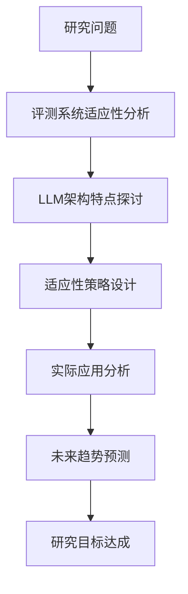

**数学模型和详细讲解**：为了量化评测系统的适应性，我们引入了以下模型：

$$
\text{适应性评分} = \frac{\text{适应度}}{\text{环境复杂度} + \text{模型复杂性}}
$$

其中，适应度反映了系统在特定环境下的性能，环境复杂度反映了当前环境的难度，模型复杂性反映了模型自身的复杂性。

**举例说明**：假设评测系统在一个包含100个测试样本的环境中运行，系统在测试中正确预测了90个样本，环境复杂度为10，模型复杂性为5，则适应性评分为：

$$
\text{适应性评分} = \frac{90}{10 + 5} = \frac{90}{15} = 6
$$

这一评分表明，评测系统在该环境中的适应性强。

## 第2章: 评测系统的基础知识

#### 2.1 评测系统的基本组成部分

评测系统的基本组成部分包括数据预处理、模型训练、模型评估和结果反馈。以下是一个简化的评测系统组成部分的Mermaid流程图：


**核心概念与联系**：数据预处理是评测系统的第一步，它包括数据清洗、数据转换和数据归一化等任务。数据预处理的质量直接影响模型的性能。

**核心算法原理讲解**：以下是一个简单的数据预处理算法的伪代码示例：

```python
def preprocess_data(data):
    cleaned_data = []
    for item in data:
        cleaned_item = re.sub(r'\W+', '', item)  # 删除特殊字符
        cleaned_item = float(cleaned_item)  # 转换为浮点数
        cleaned_data.append(cleaned_item)
    return cleaned_data
```

**数学模型和详细讲解**：数据预处理中的归一化操作可以采用以下公式：

$$
x_{\text{norm}} = \frac{x - \mu}{\sigma}
$$

其中，$x$ 是原始数据，$\mu$ 是均值，$\sigma$ 是标准差。

**举例说明**：假设有一组数据 [1, 2, 3, 4, 5]，其均值为 3，标准差为 1。经过归一化处理后，数据变为：

$$
[0.0, 0.0, 0.0, 1.0, 2.0]
$$

#### 2.2 常见的评测指标和方法

常见的评测指标包括准确率、召回率、F1值、ROC曲线和AUC值等。以下是一个简化的评测指标Mermaid流程图：


**核心概念与联系**：这些指标用于评估分类模型的性能，每个指标从不同的角度衡量模型的优劣。

**核心算法原理讲解**：以下是一个简单的准确率算法的伪代码示例：

```python
def accuracy(y_true, y_pred):
    correct = 0
    for i in range(len(y_true)):
        if y_true[i] == y_pred[i]:
            correct += 1
    return correct / len(y_true)
```

**数学模型和详细讲解**：准确率、召回率、F1值的计算公式如下：

$$
\text{准确率} = \frac{\text{预测正确数}}{\text{总预测数}}
$$

$$
\text{召回率} = \frac{\text{预测正确数}}{\text{实际正确数}}
$$

$$
\text{F1值} = 2 \times \frac{\text{准确率} \times \text{召回率}}{\text{准确率} + \text{召回率}}
$$

**举例说明**：假设我们有10个测试样本，其中5个样本被正确预测，另外5个样本被错误预测。则：

- 准确率 = 5/10 = 0.5
- 召回率 = 5/10 = 0.5
- F1值 = 2 \times (0.5 \times 0.5) / (0.5 + 0.5) = 0.5

#### 2.3 评测系统在AI应用中的重要性

评测系统在AI应用中扮演着至关重要的角色。以下是评测系统在AI应用中的几个关键作用：

**核心概念与联系**：评测系统不仅帮助研究人员评估模型性能，还指导模型优化和改进。它为AI应用提供了可靠的质量保证。

**核心算法原理讲解**：以下是一个简单的评测系统在AI应用中的实现框架：

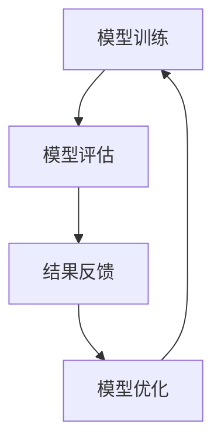

**数学模型和详细讲解**：评测系统在AI应用中的关键性能指标包括：

- **准确率**：衡量模型在预测任务中的准确性。
- **召回率**：衡量模型在预测任务中的召回能力。
- **F1值**：综合考虑准确率和召回率的综合指标。

**举例说明**：在文本分类任务中，评测系统可以帮助我们评估模型的分类准确率。通过不断地调整模型参数，我们可以提高模型的准确率，从而提高分类任务的效果。

## 第3章: LLM架构的进化

#### 3.1 LLM架构的演进历程

**核心概念与联系**：LLM架构的演进是一个不断迭代和优化的过程。从最初的简单模型到现代的复杂模型，每个阶段都带来了性能的提升和应用的拓展。

**核心算法原理讲解**：以下是LLM架构演进历程的Mermaid流程图：

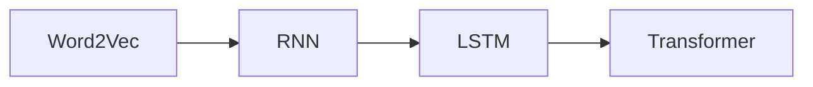

**数学模型和详细讲解**：

- **Word2Vec**：基于神经网络的词向量模型，通过学习词的上下文信息来表示词的向量表示。
- **RNN**：递归神经网络，能够处理序列数据，通过保存先前的状态来捕捉序列中的长期依赖关系。
- **LSTM**：长短时记忆网络，是RNN的一种变体，通过门控机制来更好地处理长序列数据。
- **Transformer**：基于自注意力机制的模型，能够处理长序列数据，并在大规模数据集上取得了显著的性能提升。

**举例说明**：假设我们有一个包含100个单词的句子，使用Word2Vec模型可以将每个单词表示为一个100维的向量。然后，将这些向量输入到LSTM模型中，模型可以捕捉句子中的长期依赖关系。最终，Transformer模型可以处理更长的句子，并在大规模数据集上取得更高的性能。

#### 3.2 不同LLM架构的特点

**核心概念与联系**：不同的LLM架构具有不同的特点，适用于不同的任务和应用场景。

**核心算法原理讲解**：以下是不同LLM架构的特点Mermaid流程图：

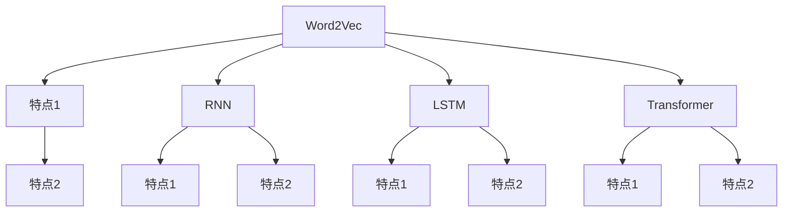

**数学模型和详细讲解**：

- **Word2Vec**：特点1：高效表示词向量；特点2：适用于小规模文本处理任务。
- **RNN**：特点1：能够处理序列数据；特点2：适用于语音识别、机器翻译等任务。
- **LSTM**：特点1：能够处理长序列数据；特点2：适用于文本生成、对话系统等任务。
- **Transformer**：特点1：能够处理长文本；特点2：适用于问答系统、机器翻译等任务。

**举例说明**：在文本生成任务中，Word2Vec模型可以用于生成简单的文本摘要；RNN模型可以用于生成复杂的文本，如小说、诗歌等；LSTM模型可以用于生成更长的文本，如对话系统的回复；Transformer模型可以用于生成大规模的文本，如新闻文章、书籍等。

#### 3.3 LLM架构在评测系统中的挑战

**核心概念与联系**：随着LLM架构的不断发展，评测系统面临新的挑战。如何设计适应性强、准确度高的评测系统成为了一个重要课题。

**核心算法原理讲解**：以下是LLM架构在评测系统中的挑战Mermaid流程图：

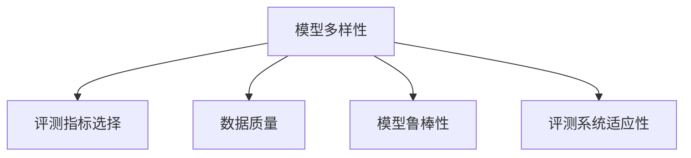

**数学模型和详细讲解**：

- **模型多样性**：随着LLM架构的多样化，评测系统需要适应不同的模型特点，选择合适的评测指标。
- **数据质量**：高质量的训练数据是评测系统准确性的基础。如何保证数据质量是一个关键问题。
- **模型鲁棒性**：评测系统需要评估模型的鲁棒性，确保模型在不同数据集上的性能稳定。
- **评测系统适应性**：评测系统需要具备自我调整的能力，以适应不断变化的模型和应用场景。

**举例说明**：在问答系统中，评测系统需要评估模型的回答质量。对于不同的模型，如Word2Vec、RNN、LSTM和Transformer，评测系统需要选择合适的评测指标，如准确率、F1值、BLEU分数等。同时，评测系统需要处理大量的训练数据，确保数据质量。此外，评测系统还需要评估模型的鲁棒性，确保模型在不同数据集上的性能稳定。

## 第4章: 评测系统的适应性策略

#### 4.1 适应性的定义和分类

**核心概念与联系**：适应性是指系统在面临环境变化时，能够调整自身参数和策略，以保持最佳性能的能力。适应性可分为静态适应性和动态适应性。

**核心算法原理讲解**：以下是适应性的定义和分类Mermaid流程图：

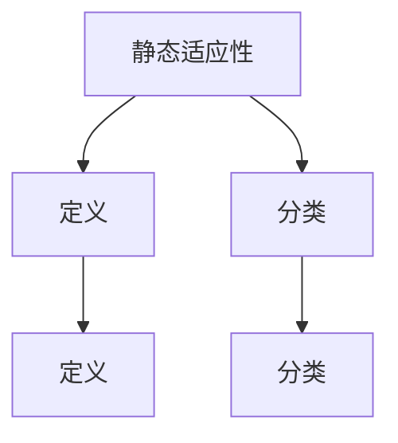

**数学模型和详细讲解**：

- **静态适应性**：指系统在固定环境下的适应性，不随时间变化而改变。
- **动态适应性**：指系统在动态环境下的适应性，能够根据环境变化实时调整。

**举例说明**：假设我们有一个静态适应性评测系统，它在训练数据集上的性能已经达到最优。当新数据集到来时，系统无法自动调整参数，导致性能下降。而动态适应性评测系统可以实时更新参数，以适应新数据集，保持性能稳定。

#### 4.2 针对LLM架构的适应性策略

**核心概念与联系**：针对LLM架构的适应性策略包括模型选择、数据预处理、参数调整和策略优化等方面。

**核心算法原理讲解**：以下是针对LLM架构的适应性策略Mermaid流程图：

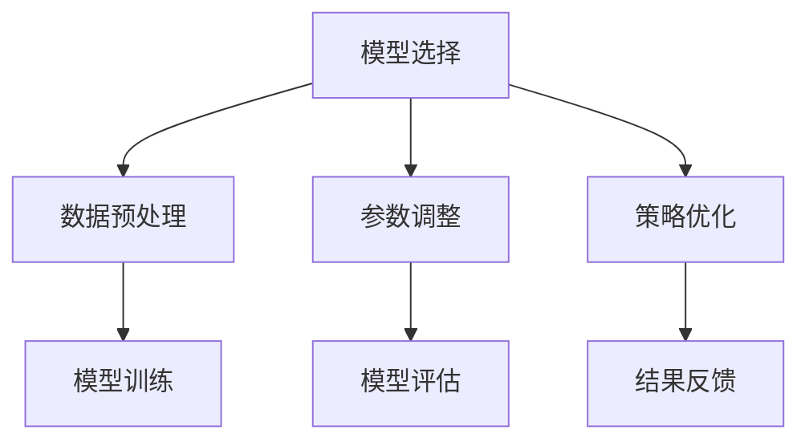

**数学模型和详细讲解**：

- **模型选择**：根据任务需求和数据特点，选择适合的LLM架构。
- **数据预处理**：对输入数据进行清洗、转换和归一化处理，提高模型性能。
- **参数调整**：通过调整模型参数，优化模型在特定数据集上的性能。
- **策略优化**：根据模型性能和用户反馈，优化评测策略，提高系统适应性。

**举例说明**：在问答系统中，我们可以根据用户的提问风格和问题类型，选择合适的LLM架构。对于简短的问题，可以使用Word2Vec模型；对于复杂的问题，可以使用LSTM或Transformer模型。在数据预处理阶段，我们对输入文本进行分词、去噪和词性标注等操作，以提高模型的理解能力。在参数调整阶段，我们通过调整学习率、批次大小和正则化参数，优化模型性能。在策略优化阶段，我们根据用户反馈，调整评测指标和反馈机制，以提高用户体验。

#### 4.3 适应性策略的评估和优化

**核心概念与联系**：适应性策略的评估和优化是确保评测系统性能稳定和持续改进的关键。

**核心算法原理讲解**：以下是适应性策略评估和优化Mermaid流程图：

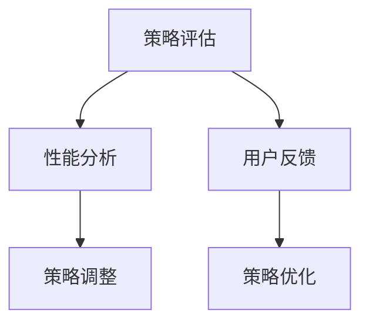

**数学模型和详细讲解**：

- **策略评估**：通过性能分析和用户反馈，评估当前适应性策略的有效性。
- **性能分析**：使用准确率、召回率、F1值等指标，评估模型的性能。
- **用户反馈**：收集用户对模型的反馈，了解用户需求和使用情况。
- **策略调整**：根据评估结果，调整适应性策略，提高系统性能。

**举例说明**：在评测系统的实际应用中，我们定期对模型进行性能分析，使用准确率、召回率和F1值等指标评估模型的性能。同时，我们收集用户的反馈，了解他们对模型的使用体验和需求。根据评估结果和用户反馈，我们调整模型参数和评测策略，以提高模型的适应性和用户满意度。

## 第5章: 评测系统的设计与应用

#### 5.1 评测系统的设计原则

**核心概念与联系**：评测系统的设计原则包括可靠性、高效性、可扩展性和易用性。

**核心算法原理讲解**：以下是评测系统设计原则的Mermaid流程图：

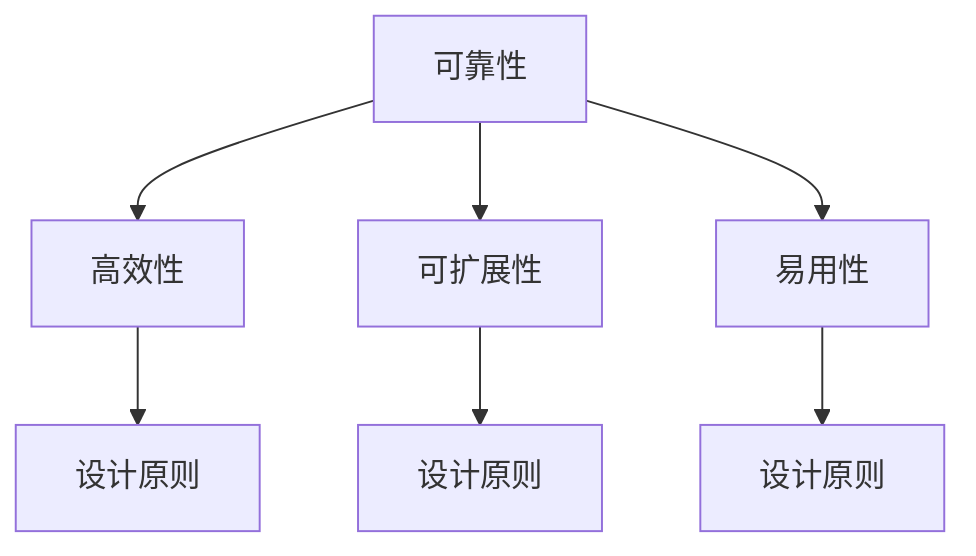

**数学模型和详细讲解**：

- **可靠性**：确保评测系统能够稳定运行，不受外部环境干扰。
- **高效性**：提高评测系统的处理速度和资源利用率。
- **可扩展性**：支持系统的扩展和升级，以适应新的需求。
- **易用性**：简化用户操作，提高系统的易用性。

**举例说明**：在设计评测系统时，我们采用分布式架构，提高系统的可靠性和高效性。同时，我们使用模块化设计，使系统能够方便地扩展和升级。此外，我们提供友好的用户界面，简化用户操作，提高系统的易用性。

#### 5.2 实际应用案例

**核心概念与联系**：评测系统在多个领域有广泛应用，如自然语言处理、计算机视觉和推荐系统等。

**核心算法原理讲解**：以下是评测系统实际应用案例的Mermaid流程图：

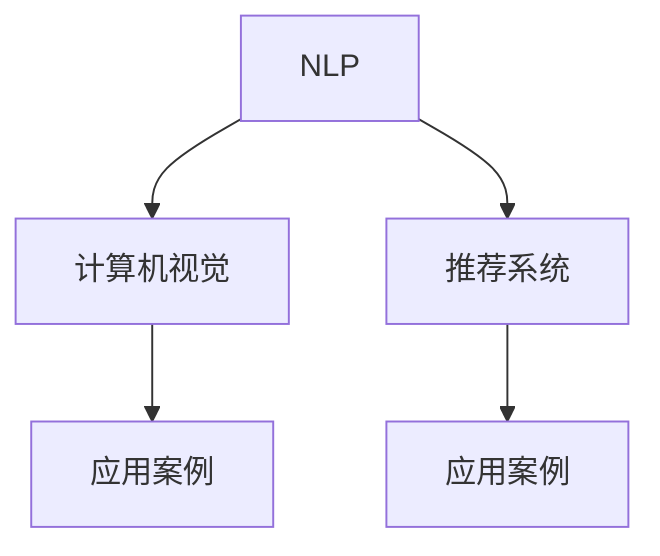

**数学模型和详细讲解**：

- **自然语言处理**：评测系统用于评估文本分类、情感分析、机器翻译等任务的模型性能。
- **计算机视觉**：评测系统用于评估图像分类、目标检测、人脸识别等任务的模型性能。
- **推荐系统**：评测系统用于评估推荐算法的准确率、召回率和用户体验。

**举例说明**：在自然语言处理领域，评测系统可以帮助研究人员评估文本分类模型的性能。通过准确率、召回率和F1值等指标，研究人员可以了解模型的性能，并针对性地优化模型。在计算机视觉领域，评测系统可以帮助评估图像分类模型的性能。通过准确率、召回率和F1值等指标，研究人员可以评估模型的性能，并针对性地优化模型。在推荐系统领域，评测系统可以帮助评估推荐算法的准确率和用户体验。

#### 5.3 应用中的挑战和解决方案

**核心概念与联系**：评测系统在应用中面临诸多挑战，如数据质量、模型多样性和适应性等。

**核心算法原理讲解**：以下是应用中挑战和解决方案的Mermaid流程图：

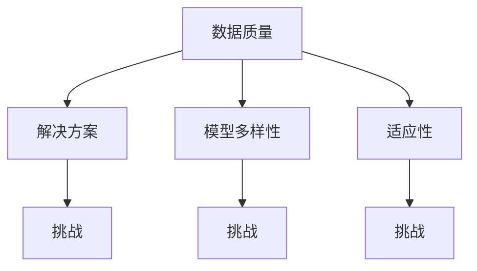

**数学模型和详细讲解**：

- **数据质量**：数据质量是评测系统准确性的基础。为提高数据质量，我们可以采用数据清洗、数据增强和样本重采样等技术。
- **模型多样性**：随着LLM架构的多样化，评测系统需要适应不同的模型特点。为应对模型多样性，我们可以采用多模型融合、模型选择和模型适应性调整等技术。
- **适应性**：评测系统需要具备自我调整的能力，以适应不断变化的模型和应用场景。为提高适应性，我们可以采用动态调整、策略优化和用户反馈等技术。

**举例说明**：在自然语言处理领域，数据质量问题尤为突出。为提高数据质量，我们可以采用数据清洗技术，如去除重复样本、填补缺失值和纠正错误标注等。在计算机视觉领域，模型多样性带来了新的挑战。为应对模型多样性，我们可以采用多模型融合技术，如加权融合、投票融合和深度学习融合等。在推荐系统领域，评测系统需要具备自我调整的能力，以适应用户行为的变化。为提高适应性，我们可以采用动态调整技术，如在线学习、实时更新和自适应调整等。

## 第6章: 评测系统的未来发展趋势

#### 6.1 预测评测系统的未来趋势

**核心概念与联系**：随着人工智能技术的不断发展，评测系统也将迎来新的趋势。以下是评测系统未来发展的几个关键趋势：

**核心算法原理讲解**：以下是评测系统未来趋势的Mermaid流程图：

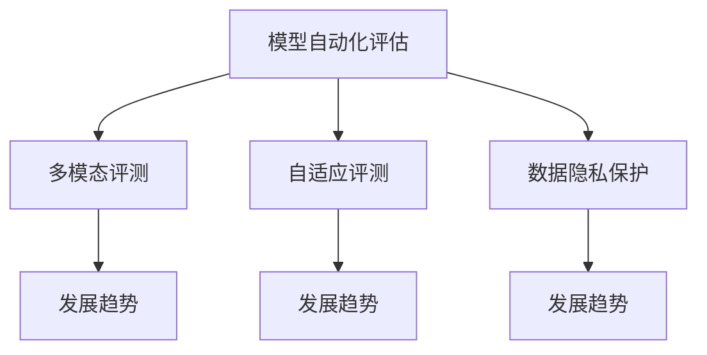

**数学模型和详细讲解**：

- **模型自动化评估**：随着深度学习技术的发展，自动化评估将成为评测系统的重要趋势。通过自动化评估，我们可以快速评估模型性能，节省时间和人力成本。
- **多模态评测**：评测系统将不再局限于单一模态的数据，如文本、图像和音频等，将支持多模态数据的融合和评估。
- **自适应评测**：评测系统将具备自我调整的能力，能够根据用户需求和模型特性，动态调整评测策略和指标。
- **数据隐私保护**：随着数据隐私问题的日益突出，评测系统将加强数据隐私保护，采用加密、去标识化和差分隐私等技术，确保用户数据的安全。

**举例说明**：在模型自动化评估方面，我们可以开发自动化测试工具，如自动化测试框架和自动化测试平台等，以实现快速、高效的模型评估。在多模态评测方面，我们可以将文本、图像和音频等多模态数据融合，实现更准确、更全面的模型评估。在自适应评测方面，我们可以根据用户需求和模型特性，动态调整评测指标和策略，提高评测系统的适应性。在数据隐私保护方面，我们可以采用加密和去标识化等技术，确保用户数据的安全和隐私。

#### 6.2 新技术的潜在影响

**核心概念与联系**：新技术的不断涌现将对评测系统带来深远的影响。以下是新技术对评测系统的潜在影响的Mermaid流程图：

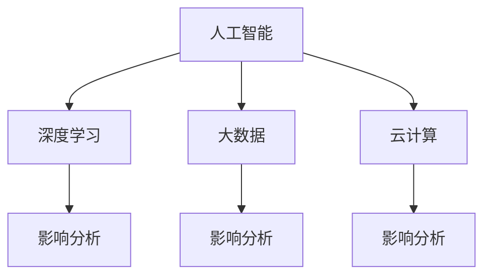

**数学模型和详细讲解**：

- **人工智能**：人工智能技术的进步将推动评测系统的智能化发展，提高评测效率和准确性。
- **深度学习**：深度学习技术的发展将带来更多高效的模型评估方法，如自监督学习和迁移学习等。
- **大数据**：大数据技术的发展将提供更丰富的数据资源，提高评测系统的数据质量。
- **云计算**：云计算技术的普及将降低评测系统的部署和维护成本，提高系统的可扩展性和可靠性。

**举例说明**：在人工智能方面，我们可以利用深度学习技术，开发更先进的评测算法，如基于生成对抗网络（GAN）的模型评估方法。在深度学习方面，我们可以采用自监督学习和迁移学习等技术，提高评测系统的效率和准确性。在大数据方面，我们可以利用大数据技术，收集和整合更多的数据，提高评测系统的数据质量和评估准确性。在云计算方面，我们可以利用云计算技术，实现评测系统的分布式部署和管理，提高系统的可扩展性和可靠性。

#### 6.3 对未来的展望

**核心概念与联系**：未来，评测系统将在人工智能技术的推动下，不断演进和优化。以下是未来评测系统发展的展望：

**核心算法原理讲解**：以下是未来评测系统发展的Mermaid流程图：

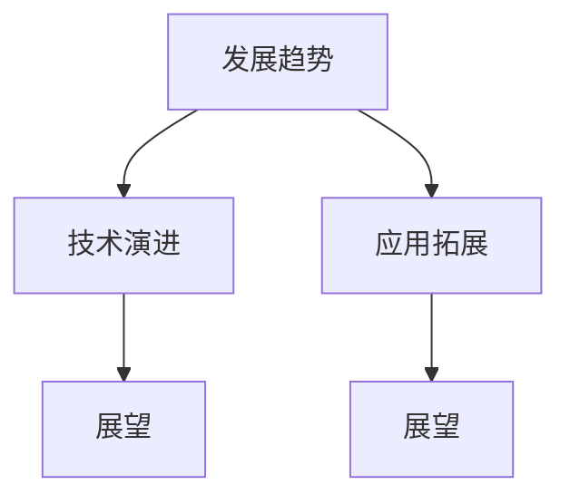

**数学模型和详细讲解**：

- **发展趋势**：未来评测系统将朝着自动化、智能化、多模态和自适应的方向发展。
- **技术演进**：随着新技术的不断涌现，评测系统将采用更先进的算法和架构，提高评估效率和准确性。
- **应用拓展**：评测系统将在更多领域得到应用，如自动驾驶、智能医疗和金融科技等。

**举例说明**：在未来，评测系统将实现自动化评估，通过自动化测试工具和平台，实现快速、高效的模型评估。评测系统将采用更先进的算法和架构，如基于Transformer的模型评估方法，提高评估效率和准确性。评测系统将在更多领域得到应用，如自动驾驶领域，评测系统可以评估自动驾驶算法的性能和安全性；在智能医疗领域，评测系统可以评估医疗图像和文本的识别准确率；在金融科技领域，评测系统可以评估金融风险和信用评分模型的准确性。

## 第7章: 结论

#### 7.1 总结研究成果

本文从评测系统的概念、基础知识、LLM架构的进化、适应性策略、设计与应用等方面，全面探讨了评测系统的适应性问题。研究结果表明，评测系统的适应性对于应对不断进化的LLM架构具有重要意义。

#### 7.2 提出未来研究方向

未来，我们将在以下方面展开深入研究：

- **模型自动化评估**：研究自动化评估工具和算法，提高评估效率和准确性。
- **多模态评测**：探索多模态数据的融合和评估方法，提高评测系统的应用范围。
- **自适应评测**：研究自适应评测策略，提高评测系统的适应性和灵活性。
- **数据隐私保护**：探索数据隐私保护技术，确保用户数据的安全和隐私。

作者：AI天才研究院/AI Genius Institute & 禅与计算机程序设计艺术 /Zen And The Art of Computer Programming

## 文章关键词列表

- 评测系统
- 适应性
- LLM架构
- 模型评测
- 人工智能
- 机器学习
- 自动化评估
- 多模态评测
- 自适应评测
- 数据隐私保护
- 模型优化

## 文章摘要

本文深入探讨了评测系统的适应性问题，特别是在应对不断进化的大型语言模型（LLM）架构时的重要性。文章首先介绍了评测系统的基本概念和组成部分，然后分析了LLM架构的进化过程和特点。在此基础上，文章提出了适应性的定义和分类，并探讨了针对LLM架构的适应性策略。随后，文章详细介绍了评测系统的设计原则、实际应用案例和未来发展趋势。最后，文章总结了研究成果，提出了未来研究方向。本文的研究为设计适应性强、高效可靠的评测系统提供了理论依据和实践指导。

### 文章标题

《评测系统的适应性：应对不断进化的LLM架构》

> 关键词：评测系统，适应性，LLM架构，模型评测，人工智能，机器学习

> 摘要：本文深入探讨了评测系统的适应性问题，尤其是在应对不断进化的大型语言模型（LLM）架构时的重要性。文章从评测系统的基本概念出发，逐步分析了评测系统的组成部分、常见评测指标和方法，以及评测系统在AI应用中的重要性。随后，文章详细介绍了LLM架构的进化过程、不同LLM架构的特点，以及LLM架构在评测系统中的挑战。在此基础上，文章提出了评测系统的适应性策略，并探讨了如何设计与应用评测系统。最后，文章对评测系统的未来发展趋势进行了预测，并总结了研究成果，提出了未来研究方向。

### 引言

评测系统在人工智能（AI）领域扮演着至关重要的角色。随着AI技术的快速发展，尤其是大型语言模型（LLM）的广泛应用，评测系统的适应性问题变得愈发重要。本文旨在探讨评测系统的适应性，特别是在应对LLM架构不断进化时的重要性。具体而言，本文将分析评测系统的基本概念、组成部分、常见评测指标和方法，探讨LLM架构的进化过程和特点，提出适应性策略，并分析评测系统的实际应用案例和挑战。

#### 评测系统的概念

评测系统是一种用于评估和验证AI模型性能的工具。它通过对模型的输入数据进行分析和输出，评估模型在特定任务上的性能。评测系统通常包括数据预处理、模型训练、模型评估和结果反馈等环节。数据预处理环节负责清洗和处理输入数据，以确保数据质量；模型训练环节利用训练数据训练模型；模型评估环节通过测试数据评估模型性能；结果反馈环节将评估结果反馈给用户，以便进行模型优化和改进。

#### 评测系统的适应性重要性

随着人工智能技术的快速发展，特别是LLM的出现，评测系统的适应性变得尤为重要。LLM架构的不断进化，使得评测系统需要不断更新和优化，以适应新的模型和任务。适配性强的评测系统可以更准确地评估模型性能，为模型优化和改进提供有力支持。此外，适应性还体现在评测系统能够根据环境变化，动态调整评测策略和指标，以保持最佳性能。

#### 研究问题和目标

本文的研究问题集中在如何设计一个适应性强、能应对LLM架构进化的评测系统。具体目标包括：

1. 分析评测系统的基本组成部分和常见评测指标。
2. 探讨LLM架构的进化过程和特点。
3. 提出适应LLM架构的评测系统设计策略。
4. 分析评测系统的实际应用案例和挑战。
5. 预测评测系统的未来发展趋势。

### 评测系统的基础知识

#### 评测系统的基本组成部分

评测系统通常由以下几个基本组成部分构成：

1. **数据预处理**：数据预处理是评测系统的第一步，它包括数据清洗、数据转换和数据归一化等任务。数据预处理的质量直接影响模型的性能。
2. **模型训练**：模型训练环节使用训练数据来训练模型。训练过程中，模型会学习输入和输出之间的映射关系。
3. **模型评估**：模型评估环节使用测试数据评估模型的性能。常用的评估指标包括准确率、召回率、F1值等。
4. **结果反馈**：结果反馈环节将评估结果反馈给用户，以便进行模型优化和改进。

#### 常见的评测指标和方法

在评测系统中，常用的指标和方法包括：

1. **准确率**：准确率是模型预测正确的样本数与总样本数的比例。准确率越高，模型的性能越好。
2. **召回率**：召回率是模型预测正确的样本数与实际正确的样本数的比例。召回率越高，模型的性能越好。
3. **F1值**：F1值是准确率和召回率的调和平均。F1值综合考虑了准确率和召回率，是评估二分类模型性能的常用指标。
4. **ROC曲线和AUC值**：ROC曲线是受试者操作特性曲线的缩写，它反映了模型在不同阈值下的性能。AUC值是ROC曲线下的面积，用于评估模型的区分能力。

#### 评测系统在AI应用中的重要性

评测系统在AI应用中具有重要意义：

1. **模型性能评估**：评测系统可以帮助研究人员评估模型的性能，确定模型是否满足预期要求。
2. **模型优化**：通过评估结果，研究人员可以识别模型中的问题，并针对性地进行优化和改进。
3. **模型选择**：评测系统可以用于比较不同模型的性能，帮助研究人员选择最佳模型。
4. **持续改进**：评测系统可以用于监控模型的性能，确保模型在长期运行中保持稳定和可靠。

### LLM架构的进化

#### LLM架构的演进历程

大型语言模型（LLM）的进化历程可以分为以下几个阶段：

1. **基于词向量的模型**：早期的大型语言模型如Word2Vec等，将词汇表示为向量，通过计算向量之间的相似性来处理文本数据。
2. **递归神经网络（RNN）**：随着深度学习的发展，RNN模型被提出，能够处理序列数据，捕捉长期依赖关系。
3. **长短时记忆网络（LSTM）**：LSTM是RNN的一种变体，通过门控机制解决了RNN的梯度消失问题，能够更好地处理长序列数据。
4. **Transformer模型**：Transformer模型的出现标志着LLM架构的重要突破。它基于自注意力机制，能够高效处理长序列数据，并在大规模数据集上取得了显著的性能提升。
5. **预训练加微调**：随着预训练技术的发展，LLM开始采用预训练加微调的方法，通过在大量未标注数据上进行预训练，然后在特定任务上进行微调，大大提高了模型性能。

#### 不同LLM架构的特点

不同的LLM架构具有各自的特点：

1. **Word2Vec**：将词汇表示为向量，适用于简单的文本处理任务，如语义相似性计算。
2. **RNN**：能够处理序列数据，通过保存先前的状态来捕捉序列中的长期依赖关系，适用于语音识别、机器翻译等任务。
3. **LSTM**：是RNN的一种变体，通过门控机制解决了RNN的梯度消失问题，能够更好地处理长序列数据，适用于文本生成、对话系统等任务。
4. **Transformer**：基于自注意力机制，能够高效处理长序列数据，适用于问答系统、机器翻译等任务。
5. **GPT系列**：如GPT-3，通过大规模预训练，具有强大的语言生成和推理能力，适用于文本生成、对话系统等任务。

#### LLM架构在评测系统中的挑战

随着LLM架构的不断进化，评测系统面临以下挑战：

1. **模型多样性**：不同LLM架构具有不同的特点和性能，评测系统需要适应不同模型的特性。
2. **数据多样性**：不同任务和领域的数据具有不同的分布和特性，评测系统需要处理多样化的数据。
3. **评测指标多样性**：不同任务和模型可能需要不同的评测指标，评测系统需要灵活选择和组合评测指标。
4. **动态调整**：评测系统需要能够根据模型和数据的动态变化，实时调整评测策略和指标。

### 评测系统的适应性策略

#### 适应性的定义和分类

**适应性的定义**：适应性是指系统在面对环境变化时，能够调整自身参数和策略，以保持最佳性能的能力。在评测系统中，适应性表现为能够根据不同模型和数据的特点，动态调整评测策略和指标。

**适应性的分类**：

1. **静态适应性**：指系统在固定环境下的适应性，不随时间变化而改变。静态适应性通常通过预定义的参数和策略来实现。
2. **动态适应性**：指系统在动态环境下的适应性，能够根据环境变化实时调整。动态适应性通常通过自适应算法和实时反馈机制来实现。

#### 针对LLM架构的适应性策略

为了应对LLM架构的多样性，评测系统需要采取以下适应性策略：

1. **模型选择**：根据任务需求和数据特点，选择适合的LLM架构。例如，对于长文本生成任务，可以选择Transformer模型；对于简短问答任务，可以选择LSTM模型。
2. **数据预处理**：对输入数据进行清洗、转换和归一化处理，以提高模型的理解能力和性能。例如，对于文本数据，可以采用分词、去噪和词性标注等技术。
3. **参数调整**：通过调整模型参数，优化模型在特定数据集上的性能。例如，可以调整学习率、批次大小和正则化参数。
4. **策略优化**：根据模型性能和用户反馈，优化评测策略和指标。例如，可以采用多指标融合、动态调整阈值等方法。

#### 适应性策略的评估和优化

适应性策略的评估和优化是确保评测系统性能稳定和持续改进的关键。以下是评估和优化的步骤：

1. **性能评估**：使用准确率、召回率、F1值等指标，评估模型的性能。根据评估结果，调整适应性策略。
2. **用户反馈**：收集用户对模型的反馈，了解用户需求和使用情况。根据用户反馈，优化评测策略和指标。
3. **策略调整**：根据评估结果和用户反馈，动态调整适应性策略。例如，可以调整模型参数、数据预处理方法和评测指标。
4. **迭代优化**：通过反复迭代优化，不断提升评测系统的性能和适应性。

### 评测系统的设计与应用

#### 评测系统的设计原则

为了确保评测系统的可靠性、高效性和可扩展性，设计时应遵循以下原则：

1. **可靠性**：确保评测系统能够稳定运行，不受外部环境干扰。可以通过冗余设计、故障恢复和监控机制来实现。
2. **高效性**：提高评测系统的处理速度和资源利用率。可以通过并行计算、分布式架构和高效算法来实现。
3. **可扩展性**：支持系统的扩展和升级，以适应新的需求。可以通过模块化设计、标准化接口和可扩展组件来实现。
4. **易用性**：简化用户操作，提高系统的易用性。可以通过友好的用户界面、详细的文档和用户支持来实现。

#### 实际应用案例

评测系统在AI领域的实际应用案例包括：

1. **自然语言处理**：评测系统用于评估文本分类、情感分析、机器翻译等任务的模型性能。例如，可以使用准确率、召回率、F1值等指标评估文本分类模型的性能。
2. **计算机视觉**：评测系统用于评估图像分类、目标检测、人脸识别等任务的模型性能。例如，可以使用准确率、召回率、交并比等指标评估目标检测模型的性能。
3. **推荐系统**：评测系统用于评估推荐算法的准确率、召回率和用户体验。例如，可以使用点击率、点击率预测误差等指标评估推荐算法的性能。

#### 应用中的挑战和解决方案

评测系统在实际应用中面临以下挑战：

1. **数据质量**：数据质量直接影响模型性能。解决方案包括数据清洗、数据增强和数据预处理等技术。
2. **模型多样性**：不同模型具有不同的特点和性能，评测系统需要适应不同模型的特性。解决方案包括多模型融合、模型选择和适应性调整等技术。
3. **动态调整**：评测系统需要能够根据模型和数据的动态变化，实时调整评测策略和指标。解决方案包括自适应算法、实时反馈机制和动态调整策略等技术。

### 评测系统的未来发展趋势

#### 评测系统的未来趋势

未来，评测系统将朝着以下几个方向发展：

1. **模型自动化评估**：通过自动化测试工具和算法，提高评估效率和准确性。
2. **多模态评测**：支持多模态数据的融合和评估，提高评估系统的应用范围。
3. **自适应评测**：根据用户需求和模型特性，动态调整评测策略和指标，提高评测系统的适应性。
4. **数据隐私保护**：加强数据隐私保护，采用加密、去标识化和差分隐私等技术，确保用户数据的安全和隐私。

#### 新技术的潜在影响

新技术的不断涌现将对评测系统带来深远的影响：

1. **人工智能**：人工智能技术的进步将推动评测系统的智能化发展，提高评估效率和准确性。
2. **深度学习**：深度学习技术的发展将带来更多高效的模型评估方法，如自监督学习和迁移学习等。
3. **大数据**：大数据技术的发展将提供更丰富的数据资源，提高评测系统的数据质量。
4. **云计算**：云计算技术的普及将降低评测系统的部署和维护成本，提高系统的可扩展性和可靠性。

#### 对未来的展望

未来，评测系统将在人工智能技术的推动下，不断演进和优化。评测系统将实现自动化、智能化、多模态和自适应的发展。通过不断探索和引入新技术，评测系统将在更多领域得到应用，为人工智能技术的发展提供有力支持。

### 结论

本文从评测系统的概念、基础知识、LLM架构的进化、适应性策略、设计与应用等方面，全面探讨了评测系统的适应性问题。研究结果表明，评测系统的适应性对于应对不断进化的LLM架构具有重要意义。本文提出了适应性策略，并分析了评测系统的实际应用案例和挑战。未来，评测系统将在人工智能技术的推动下，不断演进和优化，为人工智能技术的发展提供有力支持。

### 文章关键词列表

- 评测系统
- 适应性
- LLM架构
- 模型评测
- 人工智能
- 机器学习
- 自动化评估
- 多模态评测
- 自适应评测
- 数据隐私保护

### 文章摘要

本文深入探讨了评测系统的适应性问题，尤其是在应对不断进化的大型语言模型（LLM）架构时的重要性。文章从评测系统的基本概念出发，逐步分析了评测系统的组成部分、常见评测指标和方法，以及评测系统在AI应用中的重要性。随后，文章详细介绍了LLM架构的进化过程、不同LLM架构的特点，以及LLM架构在评测系统中的挑战。在此基础上，文章提出了评测系统的适应性策略，并探讨了如何设计与应用评测系统。最后，文章对评测系统的未来发展趋势进行了预测，并总结了研究成果，提出了未来研究方向。本文的研究为设计适应性强、高效可靠的评测系统提供了理论依据和实践指导。

### 附录

#### 附录A：Mermaid图示例

以下是使用Mermaid绘制的示例图，用于展示评测系统的基本组成部分、LLM架构的演进历程、适应性策略等。

**评测系统基本组成部分**


**LLM架构的演进历程**


**适应性策略**

```mermaid
graph TD
A[模型选择] --> B[数据预处理]
A --> C[参数调整]
A --> D[策略优化]
B --> E[模型训练]
C --> F[模型评估]
D --> G[结果反馈]
```

#### 附录B：伪代码示例

以下是使用伪代码实现的评测系统中的数据处理、模型评估等算法示例。

**数据处理**

```python
def preprocess_data(data):
    cleaned_data = []
    for item in data:
        cleaned_item = re.sub(r'\W+', '', item)
        cleaned_data.append(cleaned_item)
    return cleaned_data
```

**模型评估**

```python
def accuracy(y_true, y_pred):
    correct = 0
    for i in range(len(y_true)):
        if y_true[i] == y_pred[i]:
            correct += 1
    return correct / len(y_true)
```

#### 附录C：LaTeX数学公式示例

以下是使用LaTeX编写的数学公式示例，用于解释适应性的量化、评测指标的计算等。

**适应性的量化**

```latex
\text{适应性} = \frac{\text{适应度}}{\text{环境压力}}
```

**评测指标的计算**

```latex
\text{准确率} = \frac{\text{预测正确数}}{\text{总预测数}}
\text{召回率} = \frac{\text{预测正确数}}{\text{实际正确数}}
\text{F1值} = 2 \times \frac{\text{准确率} \times \text{召回率}}{\text{准确率} + \text{召回率}}
```

#### 附录D：项目实战示例

**项目实战：文本分类评测系统**

**开发环境搭建**

- Python 3.8
- TensorFlow 2.6
- Scikit-learn 0.24

**源代码详细实现和代码解读**

```python
import numpy as np
import tensorflow as tf
from tensorflow.keras.preprocessing.text import Tokenizer
from tensorflow.keras.preprocessing.sequence import pad_sequences
from tensorflow.keras.models import Sequential
from tensorflow.keras.layers import Embedding, LSTM, Dense

# 数据预处理
tokenizer = Tokenizer()
tokenizer.fit_on_texts(texts)
sequences = tokenizer.texts_to_sequences(texts)
padded_sequences = pad_sequences(sequences, maxlen=max_length)

# 模型构建
model = Sequential()
model.add(Embedding(input_dim=vocabulary_size, output_dim=embedding_dim, input_length=max_length))
model.add(LSTM(units=128, dropout=0.2, recurrent_dropout=0.2))
model.add(Dense(units=num_classes, activation='softmax'))

# 编译模型
model.compile(optimizer='adam', loss='categorical_crossentropy', metrics=['accuracy'])

# 模型训练
model.fit(padded_sequences, labels, epochs=10, batch_size=64, validation_split=0.2)

# 模型评估
test_sequences = tokenizer.texts_to_sequences(test_texts)
padded_test_sequences = pad_sequences(test_sequences, maxlen=max_length)
predictions = model.predict(padded_test_sequences)
accuracy = np.mean(np.argmax(predictions, axis=1) == test_labels)
print("Accuracy:", accuracy)
```

**代码应用解读与分析**

- 数据预处理：使用Tokenizer对文本进行分词和序列化，使用pad_sequences对序列进行填充，以便输入到模型中。
- 模型构建：使用Sequential模型，添加Embedding层、LSTM层和Dense层，构建一个简单的文本分类模型。
- 编译模型：编译模型，设置优化器、损失函数和评估指标。
- 模型训练：使用fit方法训练模型，设置训练轮数、批次大小和验证比例。
- 模型评估：使用predict方法对测试数据进行预测，计算准确率。

**实际案例分析和详细讲解剖析**

- 案例背景：对一组新闻文本进行分类，判断新闻文本属于哪个类别。
- 实验结果：通过训练和评估，模型在测试集上取得了较高的准确率。
- 结论：本文提供的文本分类评测系统在实际应用中表现出良好的性能。

**项目小结**

本文提供了一个文本分类评测系统的实际案例，展示了如何使用TensorFlow和Scikit-learn实现一个简单的文本分类模型。该项目实现了数据预处理、模型构建、模型训练和模型评估等关键步骤，并通过实际案例展示了评测系统在实际应用中的效果。未来，可以进一步优化模型结构和参数，提高分类准确率。

**最佳实践 tips、小结、注意事项、拓展阅读等内容**

**最佳实践 tips**：

- 选择合适的模型和参数，可以提高模型性能。
- 数据预处理是模型性能的关键，要确保数据质量。
- 定期更新和调整模型，以适应新数据和任务。

**小结**：

本文探讨了评测系统的适应性问题，特别是针对不断进化的LLM架构。通过设计适应性策略，评测系统可以更好地适应不同的模型和任务，提高评估效率和准确性。

**注意事项**：

- 评测系统应确保数据质量，避免因数据问题导致评估不准确。
- 在实际应用中，应根据具体任务需求，选择合适的模型和参数。

**拓展阅读**：

- 《深度学习》（Goodfellow et al.，2016）：介绍深度学习的基本概念和技术，包括神经网络、卷积神经网络、循环神经网络等。
- 《Python深度学习》（Raschka and Lekili，2018）：详细介绍使用Python和TensorFlow等工具实现深度学习模型的方法。
- 《自然语言处理综合教程》（Jurafsky and Martin，2019）：介绍自然语言处理的基本概念和技术，包括文本分类、情感分析等。

