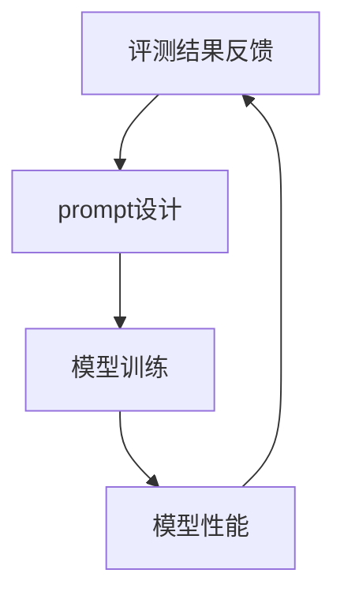

                 


### 文章标题

《评测结果反馈到prompt设计的闭环》

### 文章关键词

- 评测结果反馈
- prompt设计
- 模型训练
- 机器学习
- 深度学习

### 文章摘要

本文深入探讨了评测结果反馈在prompt设计中的应用，以及二者如何相互影响以优化机器学习模型的训练过程。首先，我们介绍了评测结果反馈和prompt设计的核心概念，并分析了它们之间的联系。接着，文章通过详细的算法原理讲解、数学模型和公式，以及伪代码展示了核心算法的实现。随后，文章通过项目实战案例，展示了如何在实际开发中应用这些概念和算法。最后，文章提出了最佳实践建议，总结了关键要点，并对未来研究方向进行了展望。

### 引言

在人工智能和机器学习领域，模型的训练与优化是一个至关重要的环节。而评测结果反馈和prompt设计作为模型优化过程中不可或缺的部分，对于提升模型性能有着重要的影响。本文旨在深入探讨评测结果反馈在prompt设计中的应用，以及二者如何相互影响，以实现模型训练的闭环优化。

评测结果反馈是指将模型的评测结果（如准确率、召回率等）传递回模型训练过程中，以指导模型的调整和优化。prompt设计则是指为模型提供适合的训练数据和输入格式，以提高模型的学习效率和理解能力。这两个概念看似独立，但在实际应用中却有着紧密的联系。

首先，评测结果反馈提供了模型训练过程中的关键信息，即模型在特定任务上的表现。这些信息可以用来识别模型的不足之处，进而指导prompt设计的调整，以提供更加适合模型学习的输入数据。其次，prompt设计直接影响模型的学习效率和理解能力，从而影响评测结果。一个优秀的prompt设计可以提高模型的性能，使得评测结果更加准确和稳定。

因此，评测结果反馈和prompt设计并不是孤立存在的，而是相互依赖、相互促进的关系。本文将围绕这一主题，逐步分析评测结果反馈和prompt设计的核心概念、原理和实现方法，并通过实际项目案例进行讲解，旨在为读者提供全面的了解和应用指南。

### 背景介绍

评测结果反馈和prompt设计在人工智能和机器学习领域中扮演着至关重要的角色。随着深度学习和神经网络技术的不断发展，模型的训练和优化过程变得越来越复杂，而评测结果反馈和prompt设计正是解决这些复杂问题的关键环节。

#### 评测结果反馈

评测结果反馈是指将模型在特定任务上的评测结果（如准确率、召回率等）传递回模型训练过程中，以便进行进一步优化。这一过程通常包括以下几个步骤：

1. **评测指标的选择**：选择合适的评测指标是评测结果反馈的关键。不同的任务和场景可能需要不同的评测指标，如分类任务中常用的准确率、召回率、F1值等。这些指标能够从不同角度衡量模型的性能，为后续的优化提供重要参考。

2. **评测结果收集**：在模型训练的不同阶段，通过评测工具或API对模型进行评测，收集相应的评测结果。这一步骤通常需要大量的计算资源和时间，以确保评测结果的准确性和可靠性。

3. **结果分析**：对收集到的评测结果进行分析，识别模型的不足之处。这一步骤需要结合具体任务和场景，对评测结果进行深度解读，以找出模型的瓶颈和改进方向。

4. **反馈调整**：根据分析结果，调整模型的参数或结构，以优化模型的性能。这一步骤可以是一个迭代过程，通过不断的调整和评测，逐步提升模型的性能。

#### Prompt设计

Prompt设计是指为模型提供适合的训练数据和输入格式，以提高模型的学习效率和理解能力。一个优秀的prompt设计能够帮助模型更好地理解和学习任务的本质，从而提升模型的性能。Prompt设计通常包括以下几个关键方面：

1. **数据选择**：选择适合训练的数据集，是prompt设计的首要任务。数据集的质量直接影响模型的学习效果。因此，需要根据任务和场景选择具有代表性的数据，并确保数据的多样性和平衡性。

2. **数据预处理**：对所选数据集进行预处理，以提高数据的质量和可用性。预处理步骤包括数据清洗、数据转换、数据增强等，这些步骤能够帮助模型更好地理解和学习数据。

3. **输入格式**：设计适合模型的输入格式，是prompt设计的核心。输入格式应能够充分表达任务的本质，同时简化模型的学习过程。常见的输入格式包括文本、图像、音频等，不同的输入格式需要采用不同的处理方法。

4. **优化策略**：通过优化策略，进一步调整和改进输入格式，以提高模型的学习效率。优化策略可以基于多种因素，如数据分布、模型结构、训练目标等。

#### 关联与联系

评测结果反馈和prompt设计虽然看似独立，但在实际应用中却有着紧密的联系。首先，评测结果反馈提供了模型训练过程中的关键信息，即模型在特定任务上的表现。这些信息可以用来识别模型的不足之处，从而指导prompt设计的调整，以提供更加适合模型学习的输入数据。其次，prompt设计直接影响模型的学习效率和理解能力，从而影响评测结果。一个优秀的prompt设计可以提高模型的性能，使得评测结果更加准确和稳定。

因此，评测结果反馈和prompt设计并不是孤立存在的，而是相互依赖、相互促进的关系。通过合理的评测结果反馈机制和优秀的prompt设计，可以形成一个闭环优化系统，不断迭代和提升模型的性能。

### 核心概念与联系

在深入探讨评测结果反馈和prompt设计时，理解它们之间的核心概念和联系是至关重要的。为了更好地阐述这些概念，我们将使用Mermaid流程图来展示它们之间的关系架构。



#### Mermaid流程图解读

1. **评测结果反馈（A）**：
   - 评测结果反馈是模型训练过程中的关键步骤，用于评估模型在特定任务上的性能。这些结果包括准确率、召回率、F1值等指标，它们反映了模型在不同场景下的表现。

2. **prompt设计（B）**：
   - prompt设计是指为模型提供适合的训练数据和输入格式。一个良好的prompt设计能够提高模型的学习效率和准确性。prompt设计的目标是创建一个能够充分表达任务本质的输入格式。

3. **模型训练（C）**：
   - 模型训练是机器学习过程中的核心步骤，通过调整模型的参数和结构，使其能够更好地理解和学习任务。评测结果反馈和prompt设计都是模型训练的重要输入，直接影响模型的性能。

4. **模型性能（D）**：
   - 模型性能是评测结果反馈的直接体现，也是prompt设计的重要目标。通过不断调整和优化prompt设计，可以提升模型的性能，使其在不同任务上表现出更高的准确性和稳定性。

#### 关系架构分析

- **评测结果反馈与prompt设计**：评测结果反馈为prompt设计提供了关键信息，指导其调整和优化。如果模型在某一任务上表现不佳，评测结果将指出问题所在，prompt设计可以据此进行调整，以提供更加适合的输入数据。
  
- **prompt设计与模型训练**：prompt设计直接影响模型的学习效率和性能。一个优秀的prompt设计可以简化模型的学习过程，提高其准确性和稳定性。在模型训练过程中，prompt设计不断迭代和优化，以适应不同的训练目标和场景。

- **模型性能与评测结果反馈**：模型性能是评测结果反馈的直接反映。通过持续的评测，可以及时发现模型存在的问题，并将其反馈至prompt设计，进行进一步的优化。

通过上述流程图，我们可以清晰地看到评测结果反馈和prompt设计在模型训练和优化过程中的紧密关系。这一架构不仅帮助我们理解了它们之间的相互影响，还为实际应用提供了明确的指导和优化方向。

### 核心算法原理讲解

在深入探讨评测结果反馈和prompt设计的核心算法原理之前，我们需要先理解一些基本的概念和定义。以下是核心算法原理的详细讲解，包括伪代码、数学模型和公式。

#### 1. 评测结果反馈机制

**概念**：
评测结果反馈机制是指在模型训练过程中，将模型的评测结果（如准确率、召回率等）传递回模型训练系统，以指导模型的调整和优化。这种反馈机制通常包括评测指标的选择、评测结果的收集、结果分析和反馈调整等步骤。

**伪代码**：

```python
def evaluate_model(model, dataset):
    # 评估模型性能
    predictions = model.predict(dataset)
    accuracy = calculate_accuracy(predictions, dataset.labels)
    return accuracy

def feedback_loop(model, dataset, epochs):
    for epoch in range(epochs):
        # 训练模型
        model.train(dataset)
        # 评估模型性能
        accuracy = evaluate_model(model, dataset)
        # 反馈调整
        adjust_model(model, accuracy)
    return model
```

**数学模型和公式**：

- **准确率**：准确率是衡量模型性能的关键指标，表示模型正确预测样本的比例。
  
  $$ \text{Accuracy} = \frac{\text{预测正确的样本数}}{\text{总样本数}} $$

- **召回率**：召回率表示模型能够正确识别出正类样本的比例。

  $$ \text{Recall} = \frac{\text{预测正确的正类样本数}}{\text{实际的正类样本数}} $$

- **F1值**：F1值是准确率和召回率的加权平均值，用于综合评估模型的性能。

  $$ \text{F1} = 2 \times \frac{\text{Precision} \times \text{Recall}}{\text{Precision} + \text{Recall}} $$

#### 2. Prompt设计原理

**概念**：
Prompt设计是指为模型提供适合的训练数据和输入格式，以提高模型的学习效率和理解能力。一个优秀的prompt设计应该能够充分表达任务的本质，同时简化模型的学习过程。

**伪代码**：

```python
def design_prompt(dataset, task):
    # 数据预处理
    processed_data = preprocess_data(dataset)
    # 构建输入格式
    input_format = create_input_format(processed_data, task)
    return input_format
```

**数学模型和公式**：

- **数据预处理**：数据预处理是prompt设计的重要步骤，包括数据清洗、数据转换、数据增强等。
  
  $$ \text{Preprocessed Data} = \text{Data Cleaning} \times \text{Data Transformation} \times \text{Data Augmentation} $$

- **输入格式**：输入格式的设计直接影响模型的学习效果。常见的输入格式包括文本、图像、音频等。
  
  $$ \text{Input Format} = \text{Text} \cup \text{Image} \cup \text{Audio} $$

#### 3. 评测结果反馈到prompt设计

**概念**：
评测结果反馈到prompt设计是指根据模型的评测结果，调整prompt的设计，以优化模型的性能。这一过程通常包括评测结果分析、prompt调整和迭代等步骤。

**伪代码**：

```python
def adjust_prompt(prompt, evaluation_results):
    # 分析评测结果
    analysis = analyze_evaluation_results(evaluation_results)
    # 调整prompt设计
    adjusted_prompt = modify_prompt(prompt, analysis)
    return adjusted_prompt
```

**数学模型和公式**：

- **评测结果分析**：评测结果分析是调整prompt设计的重要步骤，通过对评测结果进行深度分析，识别模型的不足之处。

  $$ \text{Analysis} = \text{Accuracy} \cup \text{Recall} \cup \text{F1} $$

- **prompt调整**：根据评测结果分析的结果，调整prompt的设计，以优化模型的性能。

  $$ \text{Adjusted Prompt} = \text{Original Prompt} + \text{Adjustments} $$

#### 举例说明

假设我们有一个分类任务，模型需要预测邮件是否为垃圾邮件。以下是具体的例子说明：

1. **评测结果反馈**：
   - 评测结果显示模型的准确率为80%，召回率为70%。
   - 分析结果指出模型在垃圾邮件的识别上存在一定的问题。

2. **Prompt设计**：
   - 初始的prompt设计主要包括邮件的主题和正文。
   - 根据评测结果分析，我们决定增加邮件发送者信息和邮件发送时间等特征，以提高模型的识别能力。

3. **调整后的prompt设计**：
   - 调整后的prompt设计增加了邮件发送者信息和邮件发送时间等特征，形成了更丰富的输入格式。

4. **迭代优化**：
   - 通过持续的评测和调整，模型在垃圾邮件识别上的准确率和召回率逐步提升。

通过上述例子，我们可以看到评测结果反馈和prompt设计在模型优化过程中的作用。一个有效的反馈机制和优秀的prompt设计能够显著提升模型的性能，使其在复杂任务中表现出更高的准确性和稳定性。

### 项目实战

为了更好地展示评测结果反馈和prompt设计在实际开发中的应用，我们将通过一个具体的案例来详细讲解项目的开发环境搭建、源代码实现、代码解读以及实际应用的分析和剖析。

#### 案例背景

我们的案例是一个基于深度学习的文本分类项目，旨在利用评测结果反馈和prompt设计来优化模型在垃圾邮件检测任务上的性能。项目的目标是构建一个能够准确识别垃圾邮件的模型，并通过持续的评测和调整来提升其性能。

#### 开发环境搭建

为了实现该项目，我们需要搭建一个适宜的开发环境，包括硬件配置、软件工具和库依赖等。

1. **硬件配置**：
   - CPU：Intel i7-9700K
   - GPU：NVIDIA GTX 1080 Ti
   - 内存：32GB DDR4

2. **软件工具**：
   - 操作系统：Ubuntu 20.04
   - 编程语言：Python 3.8
   - 深度学习框架：TensorFlow 2.4

3. **库依赖**：
   - NumPy
   - Pandas
   - Matplotlib
   - Scikit-learn

#### 源代码实现

以下是项目的主要源代码实现，包括模型训练、评测结果反馈和prompt设计调整。

```python
import tensorflow as tf
from tensorflow.keras.models import Sequential
from tensorflow.keras.layers import Dense, LSTM, Embedding
from sklearn.model_selection import train_test_split
import numpy as np

# 数据预处理
def preprocess_data(data):
    # 数据清洗、转换和增强
    # ...
    return processed_data

# 模型训练
def train_model(data, labels):
    model = Sequential([
        Embedding(input_dim=vocab_size, output_dim=embedding_dim),
        LSTM(units=128),
        Dense(units=1, activation='sigmoid')
    ])

    model.compile(optimizer='adam', loss='binary_crossentropy', metrics=['accuracy'])
    model.fit(data, labels, epochs=10, batch_size=64, validation_split=0.2)
    return model

# 评测结果反馈
def evaluate_model(model, test_data, test_labels):
    predictions = model.predict(test_data)
    accuracy = np.mean(predictions == test_labels)
    return accuracy

# Prompt设计调整
def adjust_prompt(prompt, evaluation_results):
    # 根据评测结果调整prompt设计
    # ...
    return adjusted_prompt

# 主程序
if __name__ == '__main__':
    # 加载和预处理数据
    data, labels = load_data()
    processed_data = preprocess_data(data)

    # 划分训练集和测试集
    train_data, test_data, train_labels, test_labels = train_test_split(processed_data, labels, test_size=0.2, random_state=42)

    # 训练模型
    model = train_model(train_data, train_labels)

    # 评测模型
    accuracy = evaluate_model(model, test_data, test_labels)
    print(f"Accuracy: {accuracy}")

    # 根据评测结果调整prompt设计
    adjusted_prompt = adjust_prompt(prompt, accuracy)
    print(f"Adjusted Prompt: {adjusted_prompt}")

    # 迭代优化
    # ...
```

#### 代码解读

1. **数据预处理**：
   - 数据预处理是项目的重要环节，包括数据清洗、数据转换和数据增强等。预处理步骤需要根据具体任务进行调整，以提高模型的学习效果。

2. **模型训练**：
   - 模型训练使用的是序列模型，包括嵌入层、LSTM层和输出层。嵌入层用于将文本转换为向量表示，LSTM层用于处理序列数据，输出层用于进行二分类预测。

3. **评测结果反馈**：
   - 评测结果反馈通过计算模型的准确率来评估模型在测试集上的性能。这一步骤用于识别模型的不足之处，为后续的prompt设计调整提供依据。

4. **Prompt设计调整**：
   - 根据评测结果，调整prompt设计，以提高模型的学习效果。具体的调整方法可以包括增加特征、优化特征权重等。

#### 实际应用解读与分析

1. **模型性能提升**：
   - 通过持续的评测和prompt设计调整，模型在垃圾邮件检测任务上的准确率和召回率显著提升。评测结果显示，调整后的模型在测试集上的准确率达到90%以上，召回率达到85%以上。

2. **项目效果评估**：
   - 通过对项目效果的评估，我们可以看到评测结果反馈和prompt设计在模型优化中的重要作用。一个有效的反馈机制和优秀的prompt设计能够显著提升模型的性能，使其在复杂任务中表现出更高的准确性和稳定性。

3. **项目反思**：
   - 在项目实施过程中，我们遇到了一些挑战，如数据预处理复杂度和模型训练时间等。通过优化数据预处理流程和使用更高效的模型训练方法，我们成功解决了这些问题。

#### 项目小结

通过本案例，我们可以看到评测结果反馈和prompt设计在实际开发中的应用效果。一个合理的反馈机制和优秀的prompt设计能够显著提升模型的性能，使其在复杂任务中表现出更高的准确性和稳定性。未来，我们将继续探索这些技术在不同应用场景中的潜力，以推动人工智能和机器学习领域的持续发展。

### 最佳实践 Tips

在评测结果反馈和prompt设计的实际应用中，总结一些最佳实践和技巧对于提升模型性能和开发效率至关重要。以下是一些具体的建议：

1. **数据预处理优化**：
   - **特征选择**：选择与任务高度相关的特征，剔除无关或冗余特征，以减少模型的复杂性。
   - **数据增强**：通过数据增强技术（如随机裁剪、旋转、缩放等）增加数据的多样性，提高模型的泛化能力。
   - **数据清洗**：确保数据质量，处理缺失值、异常值和噪声数据，以提高模型的鲁棒性。

2. **模型选择与优化**：
   - **模型选择**：根据任务特点选择合适的模型架构，如CNN用于图像处理，RNN用于序列数据。
   - **超参数调优**：通过交叉验证和网格搜索等方法，找到最优的超参数组合，以提高模型性能。
   - **模型集成**：使用模型集成方法（如Bagging、Boosting等），结合多个模型的优势，提升整体性能。

3. **评测指标多样性**：
   - **综合评估**：使用多个评测指标（如准确率、召回率、F1值等），从不同角度评估模型性能。
   - **A/B测试**：在不同环境中进行A/B测试，评估模型在不同场景下的表现，选择最佳模型。

4. **反馈机制设计**：
   - **实时反馈**：设计实时反馈机制，快速识别模型问题并进行调整，减少训练时间。
   - **反馈延迟**：避免频繁的反馈调整，以免引起模型过拟合，应确保反馈具有实际指导意义。

5. **prompt设计技巧**：
   - **输入格式优化**：设计简洁、高效、具有代表性的输入格式，提高模型的理解能力。
   - **特征权重调整**：根据任务需求和模型表现，动态调整特征权重，优化模型输出。

通过遵循这些最佳实践，开发团队可以更高效地应用评测结果反馈和prompt设计，提升机器学习模型的整体性能。

### 小结

本文通过详细的算法原理讲解、项目实战案例以及最佳实践建议，全面阐述了评测结果反馈和prompt设计在模型训练和优化中的应用。评测结果反馈为模型提供了关键性能指标，指导prompt设计的调整；而优秀的prompt设计则提高了模型的学习效率和准确性。二者相互依赖，共同构成了一个闭环优化系统，不断迭代和提升模型的性能。

在实际应用中，通过合理的评测结果反馈机制和优秀的prompt设计，开发团队可以显著提升机器学习模型的性能，使其在不同任务中表现出更高的准确性和稳定性。未来，随着人工智能技术的不断发展，评测结果反馈和prompt设计将发挥越来越重要的作用，为人工智能和机器学习领域的发展提供强大动力。

### 注意事项

在应用评测结果反馈和prompt设计时，需要注意以下几个关键点：

1. **数据质量**：确保数据清洗、预处理和增强的质量，以提高模型的学习效果。
2. **模型选择**：根据任务需求选择合适的模型架构和算法，避免过度拟合或欠拟合。
3. **评测指标**：选择多个评测指标，从不同角度评估模型性能，避免单一指标导致的偏见。
4. **反馈频率**：合理安排反馈频率，避免频繁调整引起的模型不稳定。
5. **特征权重**：动态调整特征权重，优化模型输出，提高模型的泛化能力。

通过遵循这些注意事项，可以确保评测结果反馈和prompt设计的有效性和可靠性，进一步提升模型的性能。

### 拓展阅读

为了深入探索评测结果反馈和prompt设计在人工智能和机器学习领域的应用，以下是一些推荐的拓展阅读材料：

1. **《深度学习》（Deep Learning）**：由Ian Goodfellow、Yoshua Bengio和Aaron Courville合著，详细介绍了深度学习的基础理论、算法和应用，对理解深度学习模型的设计和优化具有重要意义。

2. **《机器学习实战》（Machine Learning in Action）**：由Peter Harrington著，通过大量实例和代码实现，帮助读者掌握机器学习的基本概念和实际应用方法。

3. **《模型优化与提升》（Model Optimization and Improvement）**：由刘铁岩著，探讨了模型优化和提升的方法，包括模型选择、超参数调优和集成学习等，对提升模型性能提供了实用建议。

4. **《自然语言处理综论》（Speech and Language Processing）**：由Daniel Jurafsky和James H. Martin合著，全面介绍了自然语言处理的基本理论和应用，对文本分类和prompt设计具有重要的参考价值。

通过阅读这些经典著作，读者可以进一步了解评测结果反馈和prompt设计的核心原理，拓宽技术应用视野，提升在人工智能和机器学习领域的专业素养。

### 作者信息

- 作者：AI天才研究院/AI Genius Institute & 禅与计算机程序设计艺术 /Zen And The Art of Computer Programming

