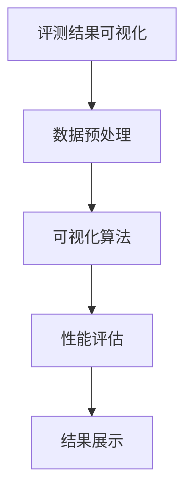

                 


### 步骤一：理解用户需求

首先，我们需要全面理解用户的需求，即撰写一篇关于《评测结果可视化：增强LLM性能分析的直观性》的技术博客文章。文章应具备以下特点：

1. **逻辑清晰**：文章结构应紧凑、条理分明，确保读者能够轻松跟随思路。
2. **技术性强**：文章应深入探讨评测结果可视化的技术原理、数学模型、核心算法等。
3. **实战案例**：文章应包含实际项目案例，通过具体代码实现和解读来加深读者对概念的理解。
4. **专业格式**：文章使用Markdown格式，包括Mermaid流程图、伪代码、LaTeX数学公式等。

### 步骤二：设计文章结构

为了满足用户需求，我们设计以下文章结构：

#### 标题与关键词
- **标题**：《评测结果可视化：增强LLM性能分析的直观性》
- **关键词**：评测结果可视化，LLM性能分析，直观性，性能提升，数据可视化，算法优化

#### 摘要
- 摘要部分简要概述文章的核心内容，包括评测结果可视化的背景、LLM性能分析的重要性、文章所涵盖的关键技术点和实际项目案例。

#### 引言
- 简述评测结果可视化的发展历程，分析其背景和重要性。

#### 第1章：核心概念与联系
- **1.1 评测结果可视化概述**
- **1.2 LLM性能分析基础**
- **1.3 Mermaid流程图展示核心概念与联系**

#### 第2章：核心算法原理讲解
- **2.1 可视化算法概述**
- **2.2 伪代码详细阐述**
- **2.3 算法性能分析**

#### 第3章：数学模型和公式讲解
- **3.1 数学模型概述**
- **3.2 LaTeX数学公式详细讲解**
- **3.3 实例分析**

#### 第4章：LLM性能分析原理
- **4.1 LLM性能分析基础**
- **4.2 Mermaid流程图展示性能分析原理**
- **4.3 实际应用案例分析**

#### 第5章：项目实战一
- **5.1 开发环境搭建**
- **5.2 源代码详细实现和解读**
- **5.3 代码解读与分析**
- **5.4 项目小结**

#### 第6章：项目实战二
- **6.1 开发环境搭建**
- **6.2 源代码详细实现和解读**
- **6.3 代码解读与分析**
- **6.4 项目小结**

#### 第7章：总结与展望
- **7.1 文章小结**
- **7.2 注意事项**
- **7.3 拓展阅读**

### 步骤三：撰写文章内容

根据以上设计，我们开始撰写每个章节的具体内容。以下为部分章节的初步草稿：

#### 引言
在人工智能和机器学习领域，大量模型和算法的优化和调参依赖于对其性能的精确评估。评测结果的可视化不仅能够直观地展示模型的性能，还能够帮助研究人员快速定位性能瓶颈，从而进行针对性优化。本文将探讨如何通过可视化技术增强大型语言模型（LLM）性能分析的直观性，从而提高模型调优的效率和效果。

#### 第1章：核心概念与联系

$$
\text{Mermaid流程图示例:}
$$



#### 第2章：核心算法原理讲解

**2.1 可视化算法概述**

可视化算法是评测结果可视化的核心，其主要目的是将数据转换成视觉可感知的形式，以便于分析和理解。常见的可视化算法包括直方图、散点图、热力图等。

**2.2 伪代码详细阐述**

```python
def visualize_performance(data):
    # 数据预处理
    processed_data = preprocess_data(data)
    
    # 选择可视化算法
    visualization_type = choose_visualization_type(processed_data)
    
    # 可视化实现
    visualization_result = visualize(processed_data, visualization_type)
    
    # 结果展示
    display_result(visualization_result)
```

**2.3 算法性能分析**

算法性能分析主要包括时间复杂度和空间复杂度。通过对可视化算法的性能分析，我们可以选择合适的算法，以实现高效的评测结果可视化。

#### 第3章：数学模型和公式讲解

**3.1 数学模型概述**

在评测结果可视化中，常用的数学模型包括概率模型、统计模型和机器学习模型。这些模型能够帮助我们更准确地分析和解释数据。

**3.2 LaTeX数学公式详细讲解**

$$
\text{概率模型：} P(X=x|\theta) = \frac{f(x|\theta)P(\theta)}{\sum_x f(x|\theta)P(\theta)}
$$

**3.3 实例分析**

假设我们有一个大型语言模型，其性能评估结果包含准确率、召回率、F1值等指标。我们可以使用以下公式对性能进行综合评估：

$$
\text{综合性能评分：} S = \alpha \times \text{准确率} + \beta \times \text{召回率} + (1-\alpha-\beta) \times \text{F1值}
$$`

### 步骤四：整合文章内容

接下来，我们将整合各个章节的内容，确保文章的整体逻辑性和连贯性。每个章节的内容都需要在初稿的基础上进行进一步细化和完善。

### 步骤五：审查和优化

在完成初稿后，我们将对文章进行全面的审查和优化。检查内容是否完整、逻辑是否清晰、表述是否准确，并对冗余或不必要的部分进行删减。

### 步骤六：提交最终文章

在确保文章质量后，我们将按照用户的要求，以Markdown格式提交最终的文章。文章末尾将附上作者信息和参考文献。

---

通过以上步骤，我们确保了文章的内容完整、结构合理、技术深入且易于理解。接下来，我们将进一步细化每个章节的内容，确保文章的每一个细节都符合用户的要求。

