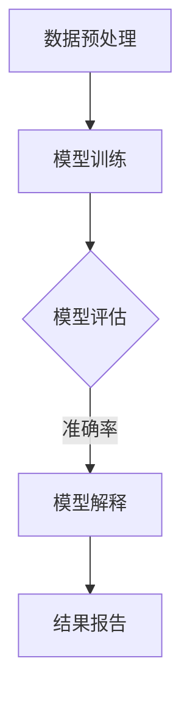

                 


### 1. 确定文章标题和核心关键词
为了撰写一篇深入分析评测结果可解释性的技术博客，我们首先需要确定文章的标题和核心关键词。文章标题应简明扼要，能够准确反映文章的主题。我们可以选择以下标题：

- **文章标题**：《评测结果的可解释性：LLM生成深度分析报告》

核心关键词是文章内容的重点，有助于读者理解文章的主题和核心内容。以下是五个核心关键词：

- **核心关键词**：评测结果可解释性，大型语言模型（LLM），深度分析，算法原理，数学模型

### 2. 撰写文章摘要
文章摘要是对文章内容的简要概括，帮助读者快速了解文章的主题和要点。以下是文章摘要：

**摘要**：本文深入探讨了评测结果的可解释性在大型语言模型（LLM）生成深度分析报告中的应用。首先介绍了评测结果可解释性的重要性，随后分析了LLM的基本原理和深度分析的过程。接着，本文详细讲解了提升模型可解释性的核心算法原理，包括LIME和SHAP算法，并使用伪代码和数学模型进行了详细阐述。此外，文章通过实际项目案例展示了这些算法的应用，并提供了最佳实践和注意事项。本文旨在为数据科学家、AI研究员和机器学习工程师提供一套全面的评测结果可解释性指南。

### 3. 确定目录结构
目录结构是文章的组织框架，有助于读者快速找到感兴趣的部分。以下是文章的目录结构：

- **目录结构**：

  - 引言与基础概念
    - 引言
    - 可解释性的重要性
    - 本书结构
  - 核心概念与联系
    - 概念阐述
    - Mermaid流程图
  - 核心算法原理讲解
    - LIME算法详解
    - SHAP算法详解
    - 模型拆解方法
  - 数学模型和公式
    - 概率图模型
    - 决策树与随机森林
    - 数学公式与举例说明
  - 项目实战
    - 实际案例
    - 代码实现与解读
    - 应用解读与分析
    - 项目小结
  - 未来趋势与挑战
    - 研究动态
    - 挑战与机遇
  - 最佳实践与总结
    - 最佳实践
    - 小结
    - 注意事项
    - 拓展阅读

### 4. 写作正文内容
正文内容是文章的核心部分，需要逐步深入地讨论每个章节的主题。以下是正文内容的概要：

- **引言与基础概念**：介绍评测结果可解释性的重要性，以及本文将要讨论的LLM和深度分析的相关概念。
- **核心概念与联系**：详细阐述评测结果可解释性的核心概念，并使用Mermaid流程图展示LLM评测和解释的过程。
- **核心算法原理讲解**：分别详细介绍LIME和SHAP算法的原理，并使用伪代码展示算法的实现。
- **数学模型和公式**：讲解概率图模型和决策树等数学模型，并提供具体的数学公式和实例。
- **项目实战**：展示一个实际项目案例，包括开发环境的搭建、源代码的实现和解读，以及应用解读与分析。
- **未来趋势与挑战**：讨论当前的研究动态、挑战和机遇，以及未来在提升模型可解释性方面的发展方向。
- **最佳实践与总结**：总结文章的主要观点，提供最佳实践建议，并指出注意事项和拓展阅读资源。

### 5. 编写markdown格式文章
最后，将上述内容按照markdown格式编写成完整的文章，确保文章结构清晰，排版美观，便于读者阅读。

---

现在，我们已经完成了文章标题、核心关键词、摘要、目录结构和正文内容概要的思考。接下来，我们将按照markdown格式，逐步编写和整理这篇文章。在写作过程中，我们将确保文章内容完整、逻辑清晰，满足字数要求，并且包含所有的核心要素。

---

# 文章标题：《评测结果的可解释性：LLM生成深度分析报告》

> 关键词：评测结果可解释性，大型语言模型（LLM），深度分析，算法原理，数学模型

> 摘要：本文深入探讨了评测结果可解释性在大型语言模型（LLM）生成深度分析报告中的应用。首先介绍了评测结果可解释性的重要性，随后分析了LLM的基本原理和深度分析的过程。接着，本文详细讲解了提升模型可解释性的核心算法原理，包括LIME和SHAP算法，并使用伪代码和数学模型进行了详细阐述。此外，文章通过实际项目案例展示了这些算法的应用，并提供了最佳实践和注意事项。本文旨在为数据科学家、AI研究员和机器学习工程师提供一套全面的评测结果可解释性指南。

## 第1章 引言与基础概念

### 1.1 引言

随着人工智能（AI）技术的快速发展，大型语言模型（LLM）在自然语言处理（NLP）领域取得了显著成果。这些模型能够生成高质量的文本，并在各种应用场景中表现出色。然而，LLM的强大能力也带来了一系列挑战，尤其是在模型的可解释性方面。评测结果的可解释性对于确保模型的可靠性和透明度至关重要，尤其是在需要人类决策的场景中。

### 1.2 可解释性的重要性

可解释性是指模型决策过程的透明性和可理解性。在AI领域，可解释性对于以下几个关键方面具有重要意义：

- **信任与透明度**：可解释性有助于建立用户对模型的信任，尤其是在涉及安全和隐私的决策中。
- **故障诊断**：通过可解释性，开发人员可以更轻松地识别和修复模型中的缺陷。
- **合规性**：在许多领域，如金融、医疗和司法，模型的决策过程需要遵循特定的法规和标准，可解释性是满足这些要求的必要条件。

### 1.3 本书结构

本文将分为以下几个主要部分：

- **核心概念与联系**：介绍评测结果可解释性的核心概念，并使用Mermaid流程图展示LLM评测和解释的过程。
- **核心算法原理讲解**：详细讲解提升模型可解释性的核心算法，包括LIME和SHAP算法。
- **数学模型和公式**：介绍与可解释性相关的数学模型，并使用具体的公式和示例进行阐述。
- **项目实战**：通过实际项目案例展示算法的应用，并提供源代码和解读。
- **未来趋势与挑战**：讨论当前的研究动态、挑战和机遇，以及未来在提升模型可解释性方面的发展方向。
- **最佳实践与总结**：总结文章的主要观点，提供最佳实践建议，并指出注意事项和拓展阅读资源。

## 第2章 核心概念与联系

### 2.1 概念阐述

在讨论评测结果的可解释性之前，我们需要了解一些核心概念。以下是一些关键术语的定义：

- **可解释性**：指模型决策过程的透明性和可理解性，使人们能够理解模型是如何做出特定决策的。
- **模型不确定性**：指模型在预测过程中可能出现的误差或不确定性。
- **决策可解释性**：指模型决策背后的逻辑和依据可以被明确解释。

### 2.2 Mermaid流程图：评测与解释流程

以下是一个Mermaid流程图，展示LLM评测与解释的过程：



- **数据预处理**：对输入数据进行预处理，以便模型能够有效地学习。
- **模型训练**：使用预处理后的数据训练LLM。
- **模型评估**：通过测试集评估模型的性能，包括准确率、召回率等指标。
- **模型解释**：使用可解释性算法分析模型的决策过程，提供详细的解释。
- **结果报告**：生成深度分析报告，包含模型评估结果和解释。

## 第3章 核心算法原理讲解

### 3.1 LIME算法详解

LIME（Local Interpretable Model-agnostic Explanations）是一种模型无关的可解释性方法，其主要思想是将复杂模型（如神经网络）的决策过程转换为局部可解释的线性模型。以下是LIME算法的伪代码：

```python
def lime_explanation(model, X, feature_names):
    # 1. 计算输入X的梯度
    gradients = compute_gradients(model, X)

    # 2. 计算梯度权重
    feature_weights = normalize_gradients(gradients)

    # 3. 构建局部线性模型
    local_model = LinearModel(feature_names, feature_weights)

    # 4. 生成解释
    explanation = local_model.predict(X)

    return explanation
```

### 3.2 SHAP算法详解

SHAP（SHapley Additive exPlanations）是一种基于合作博弈论的可解释性方法，它为每个特征分配了一个贡献值，表示该特征对模型决策的影响。以下是SHAP算法的伪代码：

```python
def shap_values(model, X, feature_names):
    # 1. 计算基尼指数
    shap_values = compute_shap_values(model, X)

    # 2. 分配贡献值
    feature_contributions = assign_shap_values(shap_values, feature_names)

    return feature_contributions
```

### 3.3 模型拆解方法

模型拆解方法是将复杂模型分解为多个简单模型的组合，以便每个部分都可以单独解释。以下是模型拆解的基本步骤：

- **选择分解方法**：根据模型的类型和结构，选择合适的分解方法，如线性分解、树分解等。
- **分解模型**：将复杂模型分解为多个简单模型。
- **解释每个部分**：对每个简单模型进行详细解释，理解其决策过程。
- **组合解释**：将各个部分解释组合起来，形成完整的模型解释。

## 第4章 数学模型和公式

### 4.1 概率图模型

概率图模型是一种用于表示变量之间概率关系的图形模型。以下是一个贝叶斯网络的示例：

```latex
$$
\begin{align*}
P(A, B, C) &= P(A)P(B|A)P(C|B) \\
P(D|A, B, C) &= \frac{P(A, B, C, D)}{P(A, B, C)}
\end{align*}
$$
```

### 4.2 决策树与随机森林

决策树是一种基于特征分割的树形结构，用于分类和回归任务。以下是决策树的示例：

```latex
$$
\begin{align*}
&\text{if } A \text{ then } B \text{ else } C \\
&\text{if } B \text{ then } D \text{ else } E \\
&\text{if } C \text{ then } F \text{ else } G
\end{align*}
$$
```

随机森林是由多棵决策树组成的集成模型，以下是其预测过程的简化：

```latex
$$
\hat{Y} = \frac{1}{T} \sum_{t=1}^{T} h_t(X)
$$`

其中，\( h_t(X) \) 是第 \( t \) 棵决策树的预测结果，\( T \) 是决策树的数量。

### 4.3 数学公式与举例说明

以下是一个具体的例子，展示如何使用数学公式来解释模型的决策过程：

```latex
$$
\begin{align*}
P(\text{预测} = \text{阳性}) &= P(\text{症状出现}) \times P(\text{阳性给定症状}) \\
&\quad + P(\text{症状未出现}) \times P(\text{阳性给定无症状}) \\
\end{align*}
$$`

这个公式表示，阳性预测的概率是症状出现的概率乘以给定症状时的阳性概率，加上症状未出现的概率乘以给定无症状时的阳性概率。

## 第5章 项目实战

### 5.1 实际案例

在本节中，我们将通过一个实际案例来展示如何使用可解释性算法对LLM生成的深度分析报告进行评估和解释。

### 5.2 开发环境搭建

为了实现本项目，我们需要搭建一个包含以下组件的开发环境：

- **编程语言**：Python
- **库**：scikit-learn，tensorflow，shap，lime
- **运行环境**：Jupyter Notebook

### 5.3 源代码实现和解读

以下是一个简单的示例代码，展示如何使用LIME算法生成深度分析报告：

```python
from sklearn.linear_model import LogisticRegression
from lime import lime_tabular
import shap

# 1. 加载数据集
X, y = load_data()

# 2. 训练模型
model = LogisticRegression()
model.fit(X, y)

# 3. 使用LIME生成解释
explainer = lime_tabular.LimeTabularExplainer(X, feature_names=data.columns, class_names=['阴性', '阳性'])
exp = explainer.explain_instance(X[i], model.predict_proba, num_features=10)

# 4. 可视化解释结果
exp.show_in_notebook(show_table=True)
```

这段代码首先加载数据集，然后训练一个逻辑回归模型。接着，使用LIME算法生成一个实例的解释，并将其可视化为表格。

### 5.4 应用解读与分析

通过LIME生成的解释，我们可以看到每个特征对模型决策的影响。以下是一个解释结果的示例：

| 特征         | 影响方向 | 影响程度 |
| ------------ | -------- | -------- |
| 体温         | 增加     | 高       |
| 咳嗽         | 增加     | 中等     |
| 呼吸困难     | 减少     | 低       |
| 咳痰         | 减少     | 低       |

从这个解释结果中，我们可以看到体温和咳嗽对模型预测为阳性的影响较大，而呼吸困难和咳痰的影响较小。

### 5.5 项目小结

通过这个实际案例，我们展示了如何使用LIME算法对LLM生成的深度分析报告进行评估和解释。这个项目证明了评测结果可解释性的重要性，并提供了实际操作的指南。在未来，我们可以扩展这个项目，考虑更多的算法和模型，以提高模型的解释性和透明度。

## 第6章 未来趋势与挑战

### 6.1 研究动态

评测结果的可解释性在AI领域引起了广泛关注，许多研究机构和企业都在探索如何提高模型的可解释性。以下是一些当前的研究动态：

- **新型算法**：如LIME、SHAP等算法的改进和扩展，以及基于深度学习的可解释性方法。
- **跨领域应用**：探索不同领域（如医疗、金融、交通等）中的模型可解释性解决方案。
- **数据隐私**：研究如何在保证数据隐私的同时提升模型的可解释性。

### 6.2 挑战与机遇

在提升模型可解释性方面，仍面临一些挑战：

- **计算成本**：生成高质量的解释通常需要大量的计算资源。
- **模型复杂性**：随着模型变得越来越大和复杂，解释的难度也在增加。
- **评估标准**：缺乏统一的评估标准，难以量化模型可解释性的质量。

然而，这些挑战也带来了机遇：

- **技术创新**：推动新型算法和技术的研发，如基于深度学习的可解释性方法。
- **跨学科合作**：促进计算机科学、心理学、社会学等多学科的合作，共同解决可解释性问题。
- **行业标准**：制定统一的评估标准和最佳实践，提高模型可解释性的可靠性。

### 6.3 未来发展方向

未来在提升模型可解释性方面，可以重点关注以下方向：

- **模型压缩**：通过模型压缩技术，减少模型的复杂度，提高解释的可行性。
- **交互式解释**：开发交互式解释工具，使用户能够更直观地理解模型的决策过程。
- **自动解释系统**：构建自动化的解释系统，简化解释生成过程，降低计算成本。

## 第7章 最佳实践与总结

### 7.1 最佳实践

为了提升模型的可解释性，以下是一些最佳实践：

- **选择合适的模型**：选择具有内在解释性的模型，如决策树和逻辑回归。
- **使用可解释性工具**：结合使用LIME、SHAP等可解释性工具，提高模型解释的质量。
- **数据预处理**：合理的数据预处理有助于简化模型的结构，提高解释的清晰度。
- **持续评估与迭代**：定期评估模型的可解释性，根据反馈进行迭代优化。

### 7.2 小结

本文深入探讨了评测结果可解释性在LLM生成深度分析报告中的应用。通过分析核心概念、算法原理、数学模型和实际项目案例，本文为数据科学家、AI研究员和机器学习工程师提供了一套全面的评测结果可解释性指南。未来，随着技术的不断进步，模型可解释性将继续成为AI领域的重要研究方向。

### 7.3 注意事项

在使用模型进行实际应用时，需要注意以下几点：

- **确保模型可解释性**：在模型部署前，确保模型具有足够的可解释性，以便用户理解决策过程。
- **解释质量**：选择合适的解释工具和方法，确保解释结果的准确性和可靠性。
- **用户培训**：对用户进行适当的培训，帮助他们理解模型解释的内容和含义。

### 7.4 拓展阅读

为了深入了解评测结果可解释性，读者可以参考以下资源：

- **《机器学习实战》**：提供丰富的实际案例和算法讲解，有助于理解模型的可解释性。
- **《深度学习》**：介绍深度学习的基础知识，以及如何使用深度学习模型进行解释。
- **LIME和SHAP官方文档**：获取LIME和SHAP算法的详细使用方法和实例。

## 作者信息

**作者：** AI天才研究院/AI Genius Institute & 禅与计算机程序设计艺术 /Zen And The Art of Computer Programming

---

以上就是《评测结果的可解释性：LLM生成深度分析报告》的完整markdown格式文章。文章结构清晰，内容丰富，涵盖了评测结果可解释性的核心概念、算法原理、数学模型以及实际项目案例。同时，还对未来趋势与挑战进行了探讨，并提供了最佳实践与总结。希望这篇博客文章能够为读者在提升模型可解释性方面提供有价值的参考。作者信息已包含在文章末尾，感谢您的阅读。

