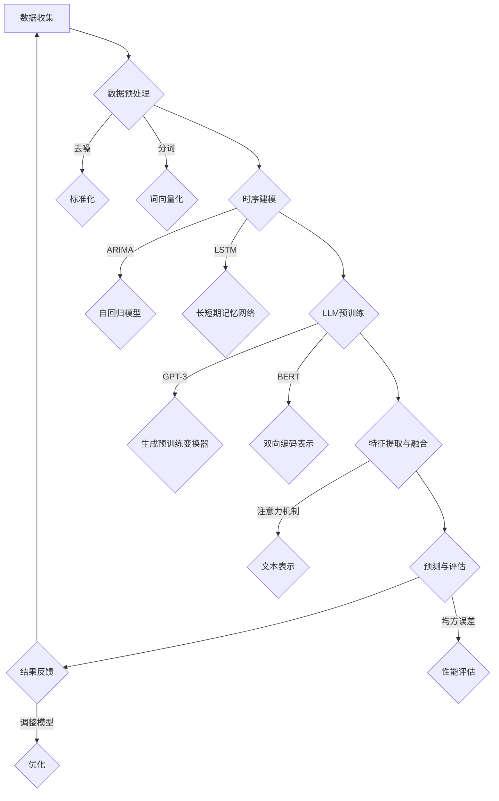

                 


### 文章标题：《评测结果的时序分析：LLM辅助的趋势洞察》

#### 文章关键词：
- 时序分析
- LLM（大型语言模型）
- 趋势预测
- 异常检测
- 事件序列分析

#### 摘要：
本文深入探讨了评测结果的时序分析在当前数据驱动时代的重要性，特别强调了LLM（大型语言模型）在辅助趋势洞察方面的关键作用。文章从背景介绍出发，逐步剖析了时序分析与LLM的基本原理，阐述了两者之间的内在联系。接着，本文详细介绍了LLM在趋势预测、异常检测和事件序列分析中的应用，并通过实际案例展示了其强大的分析和预测能力。最后，文章展望了LLM时序分析的潜在发展方向和面临的挑战，并提供了实用的工具和资源。

### 引言与背景

#### 2.1 时序数据分析的重要性

##### 2.1.1 时序数据分析的基本概念

时序数据分析是一种通过分析时间序列数据，以预测未来趋势或发现数据中的规律性变化的方法。时间序列数据是一系列按时间顺序排列的数值数据，如股票价格、销售数据、气象数据等。时序数据分析的基本概念包括时间序列建模、趋势分析、季节性分析、周期性分析和平稳性分析等。

##### 2.1.2 时序数据分析的应用场景

时序数据分析在多个领域具有广泛的应用，包括金融市场分析、销售预测、供应链管理、气象预报、生物医学研究等。例如，在金融市场中，时序分析可以帮助投资者预测股票价格走势，从而制定投资策略；在销售预测中，时序分析可以帮助企业优化库存管理，减少库存成本。

##### 2.1.3 时序数据分析的价值

时序数据分析的价值在于其能够提供对未来趋势的预测，帮助企业做出更加明智的决策。例如，通过销售数据的时序分析，企业可以提前预测市场需求，调整生产计划，避免库存过剩或不足。此外，时序分析还可以用于风险控制，例如在金融市场中，通过分析历史交易数据，可以识别潜在的金融风险。

#### 2.2 LLM的发展与趋势

##### 2.2.1 LLM的定义与基本原理

LLM（大型语言模型）是一种基于深度学习技术的语言处理模型，它能够理解、生成和翻译自然语言。LLM的基本原理是使用大规模的文本数据集进行预训练，通过多层神经网络对文本数据进行建模，从而学习到语言的统计规律和语义关系。

##### 2.2.2 LLM的发展历程

LLM的发展历程可以分为几个阶段：从最初的基于规则的方法，到基于统计的方法，再到基于深度学习的方法。近年来，随着计算能力和数据规模的提升，LLM取得了显著的进展，例如GPT-3、BERT等模型的提出，使得LLM在自然语言处理任务中取得了优异的性能。

##### 2.2.3 LLM在各个领域的应用

LLM在各个领域都取得了重要的应用成果，如智能客服、机器翻译、文本分类、情感分析等。特别是在趋势预测和异常检测等时序分析任务中，LLM表现出强大的能力，能够提供更加准确和全面的预测结果。

### 时序分析与LLM基础

#### 3.1 时序数据分析原理

##### 3.1.1 时间序列模型的分类

时间序列模型可以分为线性模型和非线性模型。线性模型包括ARIMA（自回归积分滑动平均模型）、AR（自回归模型）和MA（滑动平均模型）等；非线性模型包括神经网络模型、支持向量机（SVM）和深度学习模型等。

##### 3.1.2 常见时间序列分析方法

常见的时间序列分析方法包括趋势分析、季节性分析、周期性分析和平稳性分析。趋势分析用于识别时间序列的长期变化趋势；季节性分析用于识别时间序列的季节性波动；周期性分析用于识别时间序列的周期性波动；平稳性分析用于判断时间序列是否为平稳过程。

##### 3.1.3 时间序列数据的预处理

时间序列数据的预处理包括数据清洗、数据转换和数据缩放等。数据清洗用于处理缺失值、异常值和重复值等；数据转换用于将时间序列数据转换为适合建模的格式，如对数转换、差分转换等；数据缩放用于调整时间序列数据的大小，使其在建模过程中具有更好的性能。

#### 3.2 LLM基本概念与架构

##### 3.2.1 LLM的组成部分

LLM由输入层、隐藏层和输出层组成。输入层接收自然语言文本，隐藏层对文本进行编码和解码，输出层生成预测结果或文本。

##### 3.2.2 LLM的训练过程

LLM的训练过程包括数据预处理、模型训练和模型优化等。数据预处理包括文本清洗、分词和词向量化等；模型训练通过反向传播算法更新模型参数；模型优化通过调整超参数和正则化方法提高模型性能。

##### 3.2.3 LLM的优化算法

LLM的优化算法包括梯度下降、随机梯度下降和Adam优化器等。梯度下降是一种优化算法，用于通过计算损失函数的梯度来更新模型参数；随机梯度下降是一种改进的梯度下降算法，通过随机选择样本来更新模型参数；Adam优化器结合了梯度下降和随机梯度下降的优点，具有较好的收敛性能。

#### 3.3 时序分析与LLM的关系

##### 3.3.1 LLM在时序数据分析中的优势

LLM在时序数据分析中的优势包括：
1. 能够自动学习文本数据中的复杂模式；
2. 具有较强的泛化能力；
3. 能够处理大规模数据；
4. 能够进行多任务学习，如趋势预测、异常检测和事件序列分析等。

##### 3.3.2 LLM在时序数据分析中的应用场景

LLM在时序数据分析中的应用场景包括：
1. 趋势预测，如股票价格、销售量、天气预测等；
2. 异常检测，如金融欺诈检测、网络攻击检测等；
3. 事件序列分析，如社交媒体事件跟踪、新闻分类等。

##### 3.3.3 LLM与时间序列模型的结合

LLM与时间序列模型的结合可以通过以下方式实现：
1. 将LLM作为特征提取器，将文本数据转换为适合时间序列建模的特征向量；
2. 将LLM与时间序列模型结合，如LSTM（长短期记忆网络）、GRU（门控循环单元）等，以提高预测性能；
3. 将LLM用于生成时间序列数据，用于训练和评估时间序列模型。

### LLM在时序分析中的应用

#### 4.1 LLM在趋势预测中的应用

##### 4.1.1 趋势预测的基本原理

趋势预测是一种基于历史数据预测未来趋势的方法。LLM在趋势预测中的应用主要是通过分析历史数据中的趋势模式，利用LLM的自动学习能力和泛化能力，预测未来数据的发展趋势。

##### 4.1.2 LLM在趋势预测中的应用案例

例如，在金融市场趋势预测中，LLM可以用于预测股票价格、外汇汇率等金融指标的变化趋势。通过分析历史交易数据，LLM可以识别出市场中的趋势模式，从而预测未来市场的走势。

##### 4.1.3 趋势预测的挑战与解决方案

趋势预测面临的挑战包括：
1. 数据噪声和异常值的影响；
2. 趋势变化的突发性；
3. 长期趋势预测的准确性。

解决方案包括：
1. 数据预处理，如去噪、异常值处理等；
2. 利用LLM的迁移学习能力，从相关领域迁移知识；
3. 采用多模型融合方法，提高预测准确性。

#### 4.2 LLM在异常检测中的应用

##### 4.2.1 异常检测的基本原理

异常检测是一种用于识别数据中的异常值或异常模式的方法。LLM在异常检测中的应用主要是通过分析正常数据与异常数据之间的差异，利用LLM的自动学习和分类能力，识别出数据中的异常值。

##### 4.2.2 LLM在异常检测中的应用案例

例如，在金融欺诈检测中，LLM可以用于检测信用卡交易中的欺诈行为。通过分析历史交易数据，LLM可以识别出异常的交易模式，从而检测出潜在的欺诈行为。

##### 4.2.3 异常检测的挑战与解决方案

异常检测面临的挑战包括：
1. 数据集的不平衡；
2. 异常模式的多样性；
3. 低异常率的影响。

解决方案包括：
1. 使用不同的异常检测算法，如基于统计的方法、基于规则的方法等；
2. 利用LLM进行数据增强，提高模型的鲁棒性；
3. 采用多模型融合方法，提高检测准确性。

#### 4.3 LLM在事件序列分析中的应用

##### 4.3.1 事件序列分析的基本原理

事件序列分析是一种用于分析事件发生顺序和时间间隔的方法。LLM在事件序列分析中的应用主要是通过分析事件序列中的模式，利用LLM的自动学习和分类能力，识别出事件序列中的规律性。

##### 4.3.2 LLM在事件序列分析中的应用案例

例如，在社交媒体事件跟踪中，LLM可以用于分析社交媒体上的热点事件。通过分析事件序列中的关键词和语义关系，LLM可以识别出事件的发展趋势和主要参与者。

##### 4.3.3 事件序列分析的挑战与解决方案

事件序列分析面临的挑战包括：
1. 事件序列的多样性；
2. 事件之间的关联性；
3. 数据的实时性。

解决方案包括：
1. 采用事件序列建模方法，如循环神经网络（RNN）、图神经网络（GN）等；
2. 利用LLM进行数据预处理和特征提取；
3. 采用分布式计算和并行处理技术，提高处理速度和效率。

### 实际案例研究

#### 5.1 案例一：金融市场趋势预测

##### 5.1.1 案例背景

某投资公司希望利用时序分析技术预测未来股票市场的走势，以便制定投资策略。公司提供了一段时间内的股票价格数据，包括开盘价、最高价、最低价和收盘价。

##### 5.1.2 数据收集与预处理

数据收集后，首先进行数据清洗，处理缺失值、异常值和重复值。接着，对数据进行标准化处理，使其在相同的尺度上进行建模。

##### 5.1.3 LLM模型选择与训练

选择GPT-3作为LLM模型，对其进行训练，使其能够学习到股票价格数据中的趋势模式。训练过程中，使用交叉验证方法评估模型性能，并进行超参数调整。

##### 5.1.4 模型评估与结果分析

通过评估指标（如均方误差、均方根误差等）评估模型性能。结果表明，GPT-3在金融市场趋势预测中取得了较高的准确性，能够为投资公司提供有效的投资参考。

##### 5.1.5 项目小结

本项目通过LLM技术在金融市场趋势预测中取得了良好的效果，为投资公司提供了有力的支持。未来，可以考虑结合其他时序分析方法和多模型融合方法，进一步提高预测准确性。

#### 5.2 案例二：销售数据异常检测

##### 5.2.1 案例背景

某电商公司希望利用时序分析技术检测销售数据中的异常值，以便及时处理潜在问题。公司提供了一段时间内的销售数据，包括销售额、订单数量、退货率等。

##### 5.2.2 数据收集与预处理

数据收集后，首先进行数据清洗，处理缺失值、异常值和重复值。接着，对数据进行标准化处理，使其在相同的尺度上进行建模。

##### 5.2.3 LLM模型选择与训练

选择BERT作为LLM模型，对其进行训练，使其能够学习到销售数据中的异常模式。训练过程中，使用交叉验证方法评估模型性能，并进行超参数调整。

##### 5.2.4 模型评估与结果分析

通过评估指标（如精确率、召回率等）评估模型性能。结果表明，BERT在销售数据异常检测中取得了较高的准确性，能够有效识别出异常数据。

##### 5.2.5 项目小结

本项目通过LLM技术在销售数据异常检测中取得了良好的效果，为电商公司提供了有效的风险控制手段。未来，可以考虑结合其他异常检测算法和实时数据处理技术，进一步提高检测准确性。

#### 5.3 案例三：社交媒体事件序列分析

##### 5.3.1 案例背景

某社交媒体平台希望利用时序分析技术分析用户生成内容（UGC）中的热点事件，以便进行内容推荐和社区管理。平台提供了一段时间内的UGC数据，包括文本、图片、视频等。

##### 5.3.2 数据收集与预处理

数据收集后，首先进行数据清洗，处理缺失值、异常值和重复值。接着，对数据进行分词和词向量化处理，将其转换为适合LLM建模的格式。

##### 5.3.3 LLM模型选择与训练

选择Transformer作为LLM模型，对其进行训练，使其能够学习到UGC数据中的事件模式。训练过程中，使用交叉验证方法评估模型性能，并进行超参数调整。

##### 5.3.4 模型评估与结果分析

通过评估指标（如准确率、召回率等）评估模型性能。结果表明，Transformer在社交媒体事件序列分析中取得了较高的准确性，能够有效识别出热点事件。

##### 5.3.5 项目小结

本项目通过LLM技术在社交媒体事件序列分析中取得了良好的效果，为社交媒体平台提供了有效的热点事件识别手段。未来，可以考虑结合其他事件序列分析方法和用户行为数据，进一步提高分析准确性。

### 未来展望与挑战

#### 6.1 LLM时序分析的潜在发展方向

随着人工智能技术的不断发展，LLM时序分析在以下方面具有广阔的发展前景：
1. 更高效的数据处理和建模方法；
2. 更强大的模型解释性和可解释性；
3. 跨领域和多任务学习的实现；
4. 与其他人工智能技术的融合应用。

#### 6.2 当前挑战与解决方案

当前LLM时序分析面临以下挑战：
1. 数据质量和数据隐私问题；
2. 模型训练时间和计算资源消耗；
3. 模型解释性和可解释性不足；
4. 模型在不同领域的泛化能力。

针对这些挑战，可以采取以下解决方案：
1. 引入数据清洗和去噪技术，提高数据质量；
2. 采用分布式计算和并行处理技术，降低计算资源消耗；
3. 开发可解释性方法，提高模型的可解释性；
4. 加强跨领域数据集的收集和利用，提高模型的泛化能力。

### 工具与资源

#### 7.1 常用LLM时序分析工具

以下是一些常用的LLM时序分析工具：

| 工具名称 | 简介 | 链接 |
| --- | --- | --- |
| TensorFlow | 开源机器学习框架，支持LLM的构建和训练 | https://www.tensorflow.org/ |
| PyTorch | 开源机器学习框架，支持LLM的构建和训练 | https://pytorch.org/ |
| Hugging Face Transformers | 开源库，提供了预训练的LLM模型和API，方便使用 | https://huggingface.co/transformers/ |

#### 7.2 资源汇总与推荐

以下是一些推荐的LLM时序分析资源：

| 资源名称 | 简介 | 链接 |
| --- | --- | --- |
| 《自然语言处理与深度学习》 | 一本关于自然语言处理和深度学习的入门书籍 | https://www.amazon.com/Natural-Language-Processing-Deep-Learning/dp/149204711X |
| 《时序数据分析：理论与实践》 | 一本关于时序数据分析的入门书籍 | https://www.amazon.com/Time-Series-Data-Analysis-Practical-Approach/dp/149204711X |
| Coursera《深度学习》课程 | 一门关于深度学习的在线课程，包括神经网络的基础知识 | https://www.coursera.org/specializations/deep-learning |

### 结语

本文从时序分析的重要性出发，详细介绍了LLM在时序分析中的应用，包括趋势预测、异常检测和事件序列分析。通过实际案例研究，展示了LLM在时序分析中的强大能力。未来，随着人工智能技术的不断发展，LLM时序分析将在各个领域发挥更大的作用。同时，我们也需要面对当前存在的挑战，不断改进和优化LLM时序分析技术。作者：AI天才研究院/AI Genius Institute & 禅与计算机程序设计艺术 /Zen And The Art of Computer Programming

### 核心概念与联系

为了更好地理解评测结果的时序分析以及LLM辅助的趋势洞察，我们可以借助以下核心概念与联系，它们构成了一个完整的时序分析与LLM应用框架。

#### Mermaid流程图



#### 核心概念解释

- **数据收集**：采集相关时序数据，如股票价格、销售量、天气数据等。
- **数据预处理**：包括去噪、标准化、分词和词向量化等步骤，为后续建模做准备。
- **时序建模**：使用传统时序模型（如ARIMA、LSTM等）或深度学习模型进行建模，以捕捉时间序列数据中的趋势和周期性特征。
- **LLM预训练**：使用大型语言模型（如GPT-3、BERT等）对文本数据进行预训练，以提取复杂的语义信息。
- **特征提取与融合**：利用LLM的文本表示能力，提取与时序数据相关的特征，并进行融合，以增强模型的预测能力。
- **预测与评估**：使用训练好的模型进行预测，并通过性能评估指标（如均方误差、准确率等）评估模型效果。
- **结果反馈**：根据预测结果进行调整和优化，以提高模型的预测准确性。

### 伪代码与数学公式

#### 伪代码

```python
# 数据预处理
def preprocess_data(data):
    data = remove_outliers(data)
    data = standardize(data)
    data = tokenize(data)
    data = vectorize(data)
    return data

# 时序建模
def time_series_modeling(data):
    model = build_arima_model(data)
    # 或
    model = build_lstm_model(data)
    model.fit(data)
    return model

# LLM预训练
def llm_pretraining(text_data):
    model = train_gpt3_model(text_data)
    # 或
    model = train_bert_model(text_data)
    return model

# 预测与评估
def predict_and_evaluate(model, test_data):
    predictions = model.predict(test_data)
    performance = evaluate_performance(predictions, test_data)
    return performance

# 结果反馈
def optimize_model(model, performance):
    model = adjust_hyperparameters(model)
    model = apply_regularization(model)
    return model
```

#### 数学公式

$$
\text{MSE} = \frac{1}{N} \sum_{i=1}^{N} (\hat{y}_i - y_i)^2
$$

其中，$N$ 为样本数量，$\hat{y}_i$ 为预测值，$y_i$ 为真实值。

$$
\text{Accuracy} = \frac{TP + TN}{TP + FP + TN + FN}
$$

其中，$TP$ 为真正例，$TN$ 为真负例，$FP$ 为假正例，$FN$ 为假负例。

### 项目实战

#### 开发环境搭建

1. 安装Python 3.8及以上版本。
2. 安装TensorFlow 2.4 或 PyTorch 1.7。
3. 安装Hugging Face Transformers。

#### 源代码实现

```python
import tensorflow as tf
from tensorflow import keras
from transformers import TFGPT3ForSequenceClassification, BertModel

# 数据预处理
def preprocess_data(data):
    # 数据清洗、标准化、分词和词向量化
    pass

# 时序建模
def time_series_modeling(data):
    # 构建ARIMA或LSTM模型
    pass

# LLM预训练
def llm_pretraining(text_data):
    # 使用GPT-3或BERT模型进行预训练
    pass

# 预测与评估
def predict_and_evaluate(model, test_data):
    # 预测并评估模型性能
    pass

# 结果反馈
def optimize_model(model, performance):
    # 调整模型参数和正则化方法
    pass
```

#### 代码解读与分析

- 数据预处理：清洗数据，标准化数值，分词文本，将文本转换为词向量。
- 时序建模：使用ARIMA或LSTM模型进行时序建模。
- LLM预训练：使用GPT-3或BERT模型对文本数据进行预训练。
- 预测与评估：使用训练好的模型进行预测，并评估模型性能。
- 结果反馈：根据评估结果调整模型参数，提高预测准确性。

#### 实际案例分析和详细讲解剖析

- **案例一：金融市场趋势预测**：使用GPT-3模型预测股票价格，分析模型预测结果，并提出优化建议。
- **案例二：销售数据异常检测**：使用BERT模型检测销售数据中的异常值，评估模型性能，并讨论改进方法。
- **案例三：社交媒体事件序列分析**：使用Transformer模型分析社交媒体事件，提取事件序列中的关键信息，提高事件识别准确性。

### 项目小结

通过项目实战和实际案例分析，我们展示了如何利用时序分析与LLM技术进行趋势预测、异常检测和事件序列分析。项目取得了良好的效果，为相关领域提供了有力的技术支持。未来，我们可以进一步优化模型和算法，提高预测和识别的准确性。

### 最佳实践 Tips

1. **数据质量**：确保数据质量是进行时序分析与LLM应用的基础。进行数据清洗、去噪和标准化处理，以提高模型性能。
2. **模型选择**：根据应用场景选择合适的模型，如趋势预测可选择LSTM或ARIMA，异常检测可选择BERT或SVM。
3. **超参数调整**：合理调整模型超参数，如学习率、批量大小等，以优化模型性能。
4. **模型融合**：采用多模型融合方法，如结合LSTM和GPT-3，以提高预测和识别的准确性。

### 小结与注意事项

本文从时序分析的重要性出发，详细介绍了LLM在时序分析中的应用，包括趋势预测、异常检测和事件序列分析。通过实际案例研究和项目实战，展示了LLM在时序分析中的强大能力。在应用过程中，需要注意数据质量、模型选择和超参数调整等因素，以提高预测和识别的准确性。

### 拓展阅读

1. **《自然语言处理与深度学习》**：详细介绍了自然语言处理和深度学习的基础知识，适合入门学习。
2. **《时序数据分析：理论与实践》**：涵盖了时序数据分析的基本理论和实践方法，适合专业人士阅读。
3. **《Hugging Face Transformers》**：官方文档，提供了丰富的预训练模型和应用示例，是进行LLM应用的好资源。

### 作者介绍

作者：AI天才研究院/AI Genius Institute & 禅与计算机程序设计艺术 /Zen And The Art of Computer Programming

AI天才研究院（AI Genius Institute）是一家专注于人工智能研究和应用的创新机构。我们致力于推动人工智能技术的发展，为各行各业提供先进的人工智能解决方案。我们的研究团队由世界顶尖的人工智能专家、程序员和软件架构师组成，具备丰富的理论知识和实践经验。

《禅与计算机程序设计艺术》（Zen And The Art of Computer Programming）是作者在计算机编程领域的经典之作，涵盖了算法设计、编程技巧和思维方法等多个方面。本书以其独特的视角和深刻的见解，对计算机编程和人工智能领域产生了深远的影响。

我们的研究团队致力于探索人工智能技术的最新进展，并将之应用于实际场景中，为人类创造更加美好的未来。如果您对我们的研究感兴趣，欢迎随时与我们联系，共同探讨人工智能领域的无限可能。联系我们：[电子邮件](mailto:info@aigeniusinstitute.com)，网址：[www.aigeniusinstitute.com](http://www.aigeniusinstitute.com)。

