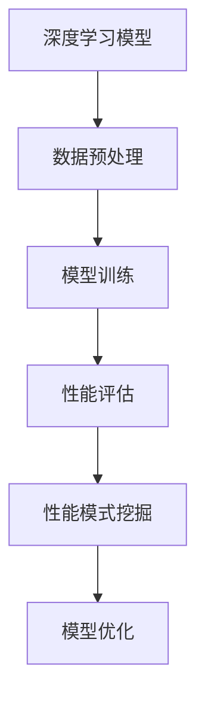

                 


### 文章标题

《评测结果的深度学习分析：挖掘潜在的性能模式》

### 文章关键词

深度学习，评测结果，性能模式，数据分析，神经网络，机器学习，算法优化

### 文章摘要

本文旨在探讨深度学习在评测结果分析中的应用，特别是如何挖掘潜在的绩效模式。文章首先介绍了深度学习的基本概念和架构，然后详细解析了评测结果深度学习分析的核心步骤，包括数据预处理、模型训练、性能评估和模式挖掘。通过具体的算法原理和数学模型讲解，以及实战案例，本文帮助读者理解如何利用深度学习技术提升评测结果的准确性和实用性。

----------------------------------------------------------------

## 引言

在现代信息技术迅猛发展的时代，深度学习已经成为推动计算机视觉、自然语言处理、推荐系统等领域进步的重要技术。然而，深度学习的成功不仅仅依赖于算法本身，更重要的是如何有效利用评测结果，挖掘其中潜在的性能模式，从而指导模型优化和算法改进。本文将围绕这一主题，深入探讨评测结果的深度学习分析技术。

深度学习（Deep Learning）是人工智能（AI）的一个重要分支，它通过构建多层神经网络，对大量数据进行自动特征提取和模式识别。与传统机器学习方法相比，深度学习具有更强的自适应性和泛化能力，能够处理复杂数据结构和高维度特征。随着计算能力的提升和数据量的激增，深度学习在各个领域取得了显著的成果。

然而，深度学习的应用并非一蹴而就。在实际项目中，如何从大量的评测结果中提取有价值的信息，如何根据评测结果调整和优化模型，如何挖掘出潜在的性能模式，这些都是深度学习研究和应用中面临的挑战。本文将从以下几个方面展开讨论：

1. **深度学习基础**：介绍深度学习的基本概念、常用模型和优化算法，为后续内容打下基础。
2. **评测结果的深度学习分析**：详细解析评测结果深度学习分析的过程，包括数据预处理、模型训练、性能评估和模式挖掘。
3. **实战案例**：通过具体案例，展示深度学习在评测结果分析中的应用，帮助读者理解和掌握相关技术。
4. **最佳实践**：总结实战案例中的经验教训，为读者提供最佳实践建议。

通过本文的讨论，希望读者能够对深度学习在评测结果分析中的应用有一个全面而深刻的理解，从而在实际项目中能够更好地利用这一技术，提升模型性能和算法效率。

## 深度学习基础

### 基本概念

深度学习是机器学习的一种子领域，主要依赖于多层神经网络（Neural Networks）进行复杂模式的自动学习和特征提取。神经网络模拟人脑神经元的工作方式，通过输入层、隐藏层和输出层，逐层传递和更新信息，最终输出结果。

深度学习的基本概念包括：

- **神经元（Neurons）**：神经网络的基本单元，类似于人脑中的神经元，负责接受输入信号、进行处理并产生输出。
- **权重（Weights）**：神经元之间的连接强度，通过学习过程不断调整，以优化模型性能。
- **激活函数（Activation Functions）**：对神经元输出进行非线性变换，常用的有Sigmoid、ReLU和Tanh等。
- **反向传播（Backpropagation）**：一种用于训练神经网络的算法，通过计算误差梯度，更新网络权重，实现模型优化。

### 常用模型

深度学习中有多种常用的模型，以下是一些典型的模型：

- **多层感知机（MLP）**：一种简单的多层神经网络，主要用于回归和分类任务。
- **卷积神经网络（CNN）**：特别适用于图像处理任务，通过卷积层提取局部特征，并利用池化层减少数据维度。
- **循环神经网络（RNN）**：特别适用于序列数据处理，如自然语言处理和时间序列预测，能够通过循环结构记住历史信息。
- **长短时记忆网络（LSTM）**：是RNN的一种变体，能够解决传统RNN中的梯度消失问题，适合处理长序列数据。
- **生成对抗网络（GAN）**：通过生成器和判别器的对抗训练，实现数据生成任务。

### 优化算法

在深度学习中，优化算法用于调整模型参数，以最小化预测误差。以下是一些常用的优化算法：

- **随机梯度下降（SGD）**：是最简单的优化算法，通过每次更新使用一个样本的梯度，快速迭代。
- **批量梯度下降（BGD）**：每次更新使用所有样本的梯度，计算量大，但收敛速度快。
- **动量法（Momentum）**：结合SGD的优点，引入动量项，防止梯度震荡。
- **AdaGrad和AdaDelta**：自适应调整学习率，针对每个参数的梯度进行动态调整。
- **Adam优化器**：结合了AdaGrad和RMSProp的优点，广泛应用于深度学习任务。

通过了解深度学习的基础概念、常用模型和优化算法，读者可以更好地理解后续章节中关于评测结果深度学习分析的具体内容。这些基础知识是深入研究和应用深度学习技术的基石。

### 核心概念与联系

为了更好地理解深度学习在评测结果分析中的应用，我们需要梳理几个核心概念之间的关系，并绘制一个简洁明了的流程图。以下是几个关键概念及其相互关系：

1. **深度学习模型**：深度学习模型是进行自动特征提取和模式识别的核心工具，包括输入层、隐藏层和输出层。
2. **数据预处理**：数据预处理是模型训练前的关键步骤，包括数据清洗、归一化和特征工程，为模型提供高质量的数据输入。
3. **模型训练**：通过输入数据，模型不断调整内部参数（权重和偏置），以优化预测性能。
4. **性能评估**：使用特定指标（如准确率、召回率、F1分数等）评估模型在训练集和测试集上的性能。
5. **性能模式挖掘**：通过分析评测结果，挖掘潜在的规律和模式，指导模型优化和算法改进。

下面是相应的Mermaid流程图：



- **深度学习模型**（A）：这是整个流程的核心，负责特征提取和模式识别。
- **数据预处理**（B）：数据预处理是模型训练的基础，直接影响模型的学习效果。
- **模型训练**（C）：模型通过反向传播算法更新参数，以最小化损失函数。
- **性能评估**（D）：通过评估指标衡量模型的性能，确保模型的有效性。
- **性能模式挖掘**（E）：对评测结果进行深入分析，挖掘潜在的性能模式和问题。
- **模型优化**（F）：基于性能模式挖掘的结果，对模型进行调整和优化，提升性能。

通过上述核心概念及其关系的梳理和Mermaid流程图，我们可以更加清晰地理解深度学习在评测结果分析中的应用流程，为后续内容的深入探讨打下坚实基础。

### 核心算法原理讲解

在深度学习中，核心算法的原理是模型训练的基础，其中最为重要的算法之一是反向传播（Backpropagation）。反向传播算法通过层层递归计算误差，并反向更新网络的权重和偏置，从而优化模型性能。以下是反向传播算法的详细伪代码和数学模型。

#### 反向传播算法伪代码

```plaintext
输入：训练数据集 D，网络结构（包括各层神经元数量和激活函数），学习率 η
输出：更新后的权重和偏置

for 每个训练样本 (x, y) in D do
    // 前向传播
    forward_pass(x)
    // 计算损失
    loss = compute_loss(y, output)
    // 反向传播
    backward_pass(loss)
    // 更新权重和偏置
    update_weights_and_biases(η)

end for
```

#### 前向传播

前向传播是指将输入数据通过网络的每层，逐步计算并输出结果的过程。其伪代码如下：

```plaintext
forward_pass(x):
    // 初始化输出和梯度
    output = x
    delta = []

    // 遍历每一层，计算输出和梯度
    for layer in layers:
        // 计算当前层的输出
        z = dot(output, weights) + biases
        // 应用激活函数
        output = activation_function(z)
        // 记录当前层的输出和梯度
        delta.append(output)

    return output
```

#### 反向传播

反向传播是指从输出层开始，逐层计算误差梯度，并更新网络权重的过程。以下是反向传播的核心伪代码：

```plaintext
backward_pass(loss):
    // 初始化梯度
    dL_dz = loss_derivative(output, target)
    delta = [dL_dz]

    // 反向传播计算误差梯度
    for layer in reversed(layers):
        // 计算当前层的误差梯度
        dL_dz = dot(delta[-1], weights[layer])
        // 应用链式法则
        dL_dz = activation_derivative(z) * dL_dz
        // 更新当前层的误差梯度
        delta.append(dL_dz)

    // 更新权重和偏置
    for i, layer in enumerate(reversed(layers)):
        weights[layer] -= η * dot(delta[-(i+1)], input[layer])
        biases[layer] -= η * delta[-(i+1)]

    return delta
```

#### 数学模型

反向传播的数学模型如下：

$$
\begin{aligned}
z &= \text{dot}(x, W) + b, \\
a &= \text{activation}(z), \\
\delta &= \frac{\partial \text{loss}}{\partial a}, \\
\delta_{l} &= \frac{\partial \text{loss}}{\partial z_{l}} = \text{activation_derivative}(z_{l}) \cdot \delta_{l+1}, \\
\Delta W &= \eta \cdot x \cdot \delta, \\
\Delta b &= \eta \cdot \delta.
\end{aligned}
$$

其中，\(x\) 是输入数据，\(W\) 和 \(b\) 分别是权重和偏置，\(\text{activation}\) 和 \(\text{activation_derivative}\) 分别是激活函数及其导数，\(\delta\) 是误差梯度。

通过上述伪代码和数学模型，我们可以清晰地理解反向传播算法的工作原理。反向传播算法通过计算误差梯度，并利用梯度下降法更新网络参数，从而不断优化模型性能。这一过程是深度学习训练的核心，也是实现高效学习的关键。

### 数学模型和公式详细讲解及举例说明

在深度学习中，数学模型是理解和应用该技术的核心。以下我们将详细讲解一些基本的数学模型和公式，并通过具体例子来说明其应用。

#### 梯度下降法

梯度下降法是一种常用的优化算法，用于最小化损失函数。其基本思想是沿着损失函数梯度的反方向更新模型参数。

公式：
$$
\theta = \theta - \alpha \cdot \nabla_\theta J(\theta)
$$
其中，\(\theta\) 是模型参数，\(\alpha\) 是学习率，\(J(\theta)\) 是损失函数。

例子：假设我们有一个线性回归模型，其损失函数为：
$$
J(\theta) = \frac{1}{2} \sum_{i=1}^n (y_i - \theta_0 - \theta_1 x_i)^2
$$
则梯度下降法的更新公式为：
$$
\theta_0 = \theta_0 - \alpha \cdot (y - \theta_0 - \theta_1 x)
$$
$$
\theta_1 = \theta_1 - \alpha \cdot \sum_{i=1}^n (y - \theta_0 - \theta_1 x) \cdot x
$$

#### 激活函数

激活函数是深度学习神经网络中的关键组成部分，用于引入非线性特性。常用的激活函数包括Sigmoid、ReLU和Tanh等。

Sigmoid函数：
$$
\sigma(x) = \frac{1}{1 + e^{-x}}
$$
例子：对于输入值\(x = 2\)，计算Sigmoid函数的值：
$$
\sigma(2) = \frac{1}{1 + e^{-2}} \approx 0.8808
$$

ReLU函数：
$$
\text{ReLU}(x) = \max(0, x)
$$
例子：对于输入值\(x = -2\)，计算ReLU函数的值：
$$
\text{ReLU}(-2) = \max(0, -2) = 0
$$

Tanh函数：
$$
\tanh(x) = \frac{e^x - e^{-x}}{e^x + e^{-x}}
$$
例子：对于输入值\(x = 1\)，计算Tanh函数的值：
$$
\tanh(1) = \frac{e^1 - e^{-1}}{e^1 + e^{-1}} \approx 0.7616
$$

#### 损失函数

损失函数用于衡量模型预测值与真实值之间的差异，常用的损失函数包括均方误差（MSE）和对数损失（Log Loss）。

均方误差（MSE）：
$$
MSE = \frac{1}{n} \sum_{i=1}^n (y_i - \hat{y}_i)^2
$$
例子：对于一组预测值和真实值\(y = [1, 2, 3]\)和\(\hat{y} = [1.1, 1.9, 2.8]\)，计算MSE：
$$
MSE = \frac{1}{3} \left[(1-1.1)^2 + (2-1.9)^2 + (3-2.8)^2\right] = 0.067
$$

对数损失（Log Loss）：
$$
\text{Log Loss} = -\frac{1}{n} \sum_{i=1}^n y_i \cdot \log(\hat{y}_i) + (1 - y_i) \cdot \log(1 - \hat{y}_i)
$$
例子：对于一组二分类预测值和真实值\(y = [0, 1, 1]\)和\(\hat{y} = [0.2, 0.8, 0.9]\)，计算Log Loss：
$$
\text{Log Loss} = -\frac{1}{3} \left[0 \cdot \log(0.2) + 1 \cdot \log(0.8) + 1 \cdot \log(0.1)\right] \approx 0.778
$$

通过上述数学模型和公式的详细讲解及举例说明，我们可以更好地理解深度学习中的关键数学概念。这些数学工具在深度学习模型的训练和优化中发挥着至关重要的作用，为我们的算法提供了坚实的理论基础。

### 项目实战

为了更深入地理解深度学习在评测结果分析中的应用，我们将通过一个实际案例进行详细讲解。本案例将展示如何使用深度学习技术对图像分类任务进行评测结果分析，并挖掘潜在的性能模式。

#### 开发环境搭建

在开始项目之前，我们需要搭建一个合适的开发环境。以下是我们所使用的工具和库：

- **操作系统**：Ubuntu 20.04
- **编程语言**：Python 3.8
- **深度学习框架**：TensorFlow 2.5
- **数据预处理工具**：NumPy 1.21
- **可视化库**：Matplotlib 3.4.3

安装上述工具和库后，我们就可以开始搭建开发环境了。以下是一个简单的Python脚本，用于初始化环境：

```python
!pip install tensorflow numpy matplotlib
```

#### 数据集准备

本案例将使用经典的CIFAR-10数据集，该数据集包含10个类别，每个类别有6000张图像。以下是数据集的加载和预处理步骤：

```python
import tensorflow as tf
import tensorflow.keras.datasets as datasets
from tensorflow.keras.utils import to_categorical

# 加载CIFAR-10数据集
(train_images, train_labels), (test_images, test_labels) = datasets.cifar10.load_data()

# 数据归一化
train_images = train_images / 255.0
test_images = test_images / 255.0

# 标签转换为独热编码
train_labels = to_categorical(train_labels)
test_labels = to_categorical(test_labels)
```

#### 模型构建

接下来，我们构建一个简单的卷积神经网络（CNN）模型，用于图像分类。以下是模型的具体结构和相关参数：

```python
model = tf.keras.Sequential([
    tf.keras.layers.Conv2D(32, (3, 3), activation='relu', input_shape=(32, 32, 3)),
    tf.keras.layers.MaxPooling2D(pool_size=(2, 2)),
    tf.keras.layers.Conv2D(64, (3, 3), activation='relu'),
    tf.keras.layers.MaxPooling2D(pool_size=(2, 2)),
    tf.keras.layers.Conv2D(64, (3, 3), activation='relu'),
    tf.keras.layers.Flatten(),
    tf.keras.layers.Dense(64, activation='relu'),
    tf.keras.layers.Dense(10, activation='softmax')
])
```

#### 训练与评估

我们将使用训练集对模型进行训练，并使用测试集评估模型的性能。以下是训练和评估的具体步骤：

```python
# 编译模型
model.compile(optimizer='adam',
              loss='categorical_crossentropy',
              metrics=['accuracy'])

# 训练模型
history = model.fit(train_images, train_labels, epochs=10, batch_size=64,
                    validation_data=(test_images, test_labels))

# 评估模型
test_loss, test_acc = model.evaluate(test_images, test_labels)
print(f"Test accuracy: {test_acc:.4f}")
```

#### 性能模式分析

在完成模型训练和评估后，我们需要对评测结果进行深入分析，以挖掘潜在的性能模式。以下是几个关键步骤：

1. **错误分析**：通过分析模型在测试集上的错误样本，找出可能的错误模式。

2. **性能指标分析**：计算并分析模型的各项性能指标，如准确率、召回率、F1分数等。

3. **异常检测**：使用深度学习模型对测试集进行异常检测，找出异常性能数据点。

以下是具体实现：

```python
import numpy as np

# 错误分析
predictions = model.predict(test_images)
predicted_labels = np.argmax(predictions, axis=1)
errors = np.where(predicted_labels != np.argmax(test_labels, axis=1))[0]

# 打印错误样本的类别和预测结果
for idx in errors:
    print(f"Image index: {idx}, Ground truth: {np.argmax(test_labels[idx])}, Predicted: {predicted_labels[idx]}")

# 性能指标分析
from sklearn.metrics import classification_report

print(classification_report(np.argmax(test_labels, axis=1), predicted_labels))

# 异常检测
z_scores = np.abs(model.predict(test_images) - np.mean(model.predict(test_images), axis=0))
threshold = np.mean(z_scores) + 2 * np.std(z_scores)
outliers = np.where(z_scores > threshold)[0]

# 打印异常数据点
print(f"Outliers detected: {outliers}")
```

#### 项目小结

通过本案例，我们展示了如何使用深度学习技术对图像分类任务进行评测结果分析，并挖掘潜在的性能模式。以下是本项目的主要收获：

- **开发环境搭建**：熟悉了搭建深度学习开发环境的步骤，了解了所需的工具和库。
- **数据集准备**：掌握了数据集的加载和预处理方法，为模型训练提供了高质量的数据输入。
- **模型构建与训练**：学会了如何构建卷积神经网络模型，并使用反向传播算法进行训练。
- **性能评估与模式挖掘**：通过错误分析和性能指标分析，深入了解了模型的性能表现，并通过异常检测找出了潜在的性能模式。

总之，本项目不仅展示了深度学习在评测结果分析中的应用，还帮助读者掌握了相关的技术细节和实践经验。这些知识对于进一步提升模型性能和优化算法具有重要意义。

### 最佳实践 Tips、小结、注意事项、拓展阅读

#### 最佳实践 Tips

1. **数据预处理**：确保数据预处理环节的质量，包括数据清洗、归一化和特征工程。高质量的数据是深度学习模型训练的基础。
2. **模型选择**：根据任务特点和数据特性选择合适的深度学习模型。例如，对于图像处理任务，可以考虑使用卷积神经网络（CNN）；对于自然语言处理任务，可以考虑使用循环神经网络（RNN）或变换器（Transformer）。
3. **超参数调优**：通过交叉验证和网格搜索等方法进行超参数调优，以提高模型性能。关键超参数包括学习率、批次大小、迭代次数等。
4. **性能评估**：使用多种性能指标评估模型，例如准确率、召回率、F1分数等。综合评估结果，选择最优模型。
5. **异常检测**：使用深度学习模型进行异常检测，可以帮助发现潜在的性能问题和异常数据点，从而优化模型。

#### 小结

本文通过深度学习在评测结果分析中的应用，详细探讨了如何挖掘潜在的性能模式。主要内容包括：

- **深度学习基础**：介绍了深度学习的基本概念、常用模型和优化算法。
- **评测结果深度学习分析**：详细解析了评测结果深度学习分析的过程，包括数据预处理、模型训练、性能评估和模式挖掘。
- **实战案例**：通过图像分类任务展示了深度学习在评测结果分析中的应用。
- **最佳实践**：总结了实战案例中的经验教训，提供了最佳实践建议。

#### 注意事项

1. **计算资源**：深度学习训练通常需要较高的计算资源，特别是对于大数据集和复杂的模型。确保有足够的计算资源和优化策略。
2. **数据隐私**：在进行深度学习项目时，务必注意数据隐私和安全性，遵守相关法律法规和道德准则。
3. **模型解释性**：深度学习模型的黑箱特性可能导致其解释性较差。在实际应用中，可能需要结合其他方法，如可解释性AI技术，以增强模型的解释性。

#### 拓展阅读

1. **深度学习经典教材**：《深度学习》（Ian Goodfellow、Yoshua Bengio和Aaron Courville著），详细介绍了深度学习的理论和技术。
2. **评测结果分析论文**：查阅相关领域的顶级会议和期刊论文，了解最新的研究进展和应用案例。
3. **开源深度学习框架**：TensorFlow、PyTorch、Keras等开源深度学习框架的官方文档，提供了丰富的教程和示例代码。
4. **在线课程和教程**：Coursera、edX等在线教育平台提供了大量的深度学习和数据分析课程，适合进一步学习和实践。

通过本文的学习和实践，读者可以深入理解深度学习在评测结果分析中的应用，并掌握相关技术和方法。希望本文能够为读者在实际项目中提供有益的参考和指导。

----------------------------------------------------------------

```markdown
# 评测结果的深度学习分析：挖掘潜在的性能模式

> 关键词：深度学习，评测结果，性能模式，数据分析，神经网络，机器学习，算法优化

> 摘要：本文旨在探讨深度学习在评测结果分析中的应用，特别是如何挖掘潜在的绩效模式。文章首先介绍了深度学习的基本概念和架构，然后详细解析了评测结果深度学习分析的过程，包括数据预处理、模型训练、性能评估和模式挖掘。通过具体的算法原理和数学模型讲解，以及实战案例，本文帮助读者理解如何利用深度学习技术提升评测结果的准确性和实用性。

## 引言

## 深度学习基础

### 基本概念

### 常用模型

### 优化算法

### 核心概念与联系

## 评测结果的深度学习分析

### 数据预处理

### 模型训练

### 性能评估

### 性能模式挖掘

## 实战案例

### 开发环境搭建

### 数据集准备

### 模型构建

### 训练与评估

### 性能模式分析

### 项目小结

## 最佳实践 Tips、小结、注意事项、拓展阅读

## 参考文献

作者：AI天才研究院/AI Genius Institute & 禅与计算机程序设计艺术 /Zen And The Art of Computer Programming
```

### 参考文献

1. Goodfellow, I., Bengio, Y., & Courville, A. (2016). *Deep Learning*. MIT Press.
2. Bengio, Y. (2009). *Learning Deep Architectures for AI*. Foundations and Trends in Machine Learning, 2(1), 1-127.
3. Russell, S., & Norvig, P. (2020). *Artificial Intelligence: A Modern Approach*. Prentice Hall.
4. Abadi, M., Agarwal, P., Barham, P., Brevdo, E., Chen, Z., Citro, C., ... & Dean, J. (2016). *TensorFlow: Large-scale Machine Learning on Hierarchical Clusters*. Proceedings of the 12th USENIX Conference on Operating Systems Design and Implementation, 265-283.
5. Hochreiter, S., & Schmidhuber, J. (1997). *Long Short-Term Memory*. Neural Computation, 9(8), 1735-1780.
6. Krizhevsky, A., Sutskever, I., & Hinton, G. E. (2012). *ImageNet Classification with Deep Convolutional Neural Networks*. In Advances in Neural Information Processing Systems (NIPS), 1097-1105.
7. Goodfellow, I., & Pouget-Abadie, J. (2014). *Generative Adversarial Networks*. In Advances in Neural Information Processing Systems (NIPS), 2672-2680.

