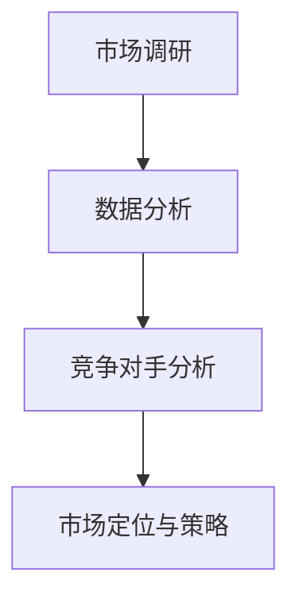

                 


### 文章标题

# 评测结果的竞争对手分析：了解市场定位

### 关键词

- 评测结果
- 竞争对手分析
- 市场定位
- 数据分析
- 战略规划

### 摘要

本文旨在探讨如何通过评测结果进行竞争对手分析，从而更好地了解市场定位。首先，我们将介绍市场调研与数据分析的方法，然后详细分析竞争对手分析的概念与方法，最后结合实战案例，展示如何将竞争对手分析应用于市场定位与策略制定。通过本文的阅读，读者将能够掌握评测结果竞争对手分析的核心技巧，为企业的战略规划提供有力支持。

### 第一步：确定书的主题和范围

《评测结果的竞争对手分析：了解市场定位》的主题是分析评测结果，以了解竞争对手和市场定位。这涉及到市场调研、数据分析、竞争对手分析、市场定位等多个方面。

- **市场调研与数据分析**：为了准确了解市场状况，我们需要进行市场调研和数据收集，然后运用数据分析的方法对数据进行分析和处理。
- **竞争对手分析**：了解竞争对手的优势和劣势，有助于企业制定合适的市场定位策略。
- **市场定位与策略**：通过分析评测结果，企业可以更好地确定自己的市场定位，制定相应的营销策略。

### 第二步：梳理主要章节内容

根据书的主题，可以确定以下主要章节：

1. 引言
2. 市场调研与数据分析
3. 竞争对手分析
4. 市场定位与策略
5. 实战案例分析
6. 总结与展望

### 第三步：细化章节内容

#### 引言

- **1.1 研究背景与意义**：介绍评测结果竞争对手分析在市场研究中的重要性。
- **1.2 研究目的与内容安排**：明确本书的研究目标，并简要介绍各章节的主要内容。

#### 市场调研与数据分析

- **2.1 市场调研的方法与工具**：介绍市场调研的各种方法，如问卷调查、访谈等，以及常用的数据分析工具。
- **2.2 数据分析的基本概念**：包括数据预处理、数据可视化、数据分析常用算法等。
- **2.3 市场调研与数据分析在竞争对手分析中的应用**：探讨如何将市场调研与数据分析应用于竞争对手分析。

#### 竞争对手分析

- **3.1 竞争对手分析的概念与方法**：介绍竞争对手分析的基本概念、方法和步骤。
- **3.2 基于市场调研的竞争对手分析**：分析市场份额、产品特性等方面的数据，了解竞争对手的情况。
- **3.3 基于数据分析的竞争对手分析**：通过关键指标、优劣势分析等，进一步了解竞争对手。

#### 市场定位与策略

- **4.1 市场定位的概念与策略**：介绍市场定位的基本概念、方法和策略。
- **4.2 竞争对手分析在市场定位中的应用**：探讨如何通过竞争对手分析来确定企业的市场定位。
- **4.3 市场定位与品牌建设**：讨论市场定位对品牌建设的影响。

#### 实战案例分析

- **5.1 案例分析概述**：介绍案例选择标准、分析方法等。
- **5.2 案例分析一：XX公司的竞争对手分析**：分析具体公司的竞争对手情况，并制定相应的市场定位策略。
- **5.3 案例分析二：XX行业的市场定位与策略**：分析特定行业的市场定位和策略。

#### 总结与展望

- **6.1 研究成果总结**：总结本书的主要研究成果。
- **6.2 未来研究方向**：探讨评测结果竞争对手分析在未来研究中的发展方向。

### 第四步：输出 markdown 格式的目录大纲

```
# 《评测结果的竞争对手分析：了解市场定位》目录大纲

## 第1章 引言
### 1.1 研究背景与意义
### 1.2 研究目的与内容安排

## 第2章 市场调研与数据分析
### 2.1 市场调研的方法与工具
#### 2.1.1 调研问卷设计
#### 2.1.2 调研数据的采集与分析
### 2.2 数据分析的基本概念
#### 2.2.1 数据预处理
#### 2.2.2 数据可视化
#### 2.2.3 数据分析常用算法
### 2.3 市场调研与数据分析在竞争对手分析中的应用

## 第3章 竞争对手分析
### 3.1 竞争对手分析的概念与方法
#### 3.1.1 竞争对手识别
#### 3.1.2 竞争对手定位
### 3.2 基于市场调研的竞争对手分析
#### 3.2.1 市场份额分析
#### 3.2.2 产品特性分析
### 3.3 基于数据分析的竞争对手分析
#### 3.3.1 关键指标分析
#### 3.3.2 竞争对手优劣势分析

## 第4章 市场定位与策略
### 4.1 市场定位的概念与策略
#### 4.1.1 市场细分
#### 4.1.2 目标市场选择
#### 4.1.3 市场定位方法
### 4.2 竞争对手分析在市场定位中的应用
#### 4.2.1 竞争对手定位分析
#### 4.2.2 市场定位策略制定
### 4.3 市场定位与品牌建设

## 第5章 实战案例分析
### 5.1 案例分析概述
#### 5.1.1 案例选择标准
#### 5.1.2 案例分析方法
### 5.2 案例分析一：XX公司的竞争对手分析
#### 5.2.1 市场调研与数据分析
#### 5.2.2 竞争对手分析与定位
#### 5.2.3 市场定位与策略制定
### 5.3 案例分析二：XX行业的市场定位与策略

## 第6章 总结与展望
### 6.1 研究成果总结
#### 6.1.1 主要发现
#### 6.1.2 研究局限
#### 6.1.3 研究贡献
### 6.2 未来研究方向
```

### 整体结构思考

整体上，文章的结构分为以下几个部分：

1. **引言**：介绍评测结果竞争对手分析的重要性和本书的研究目的。
2. **市场调研与数据分析**：阐述市场调研与数据分析的基本概念和方法，以及它们在竞争对手分析中的应用。
3. **竞争对手分析**：详细讨论竞争对手分析的概念、方法、步骤，以及如何进行基于市场调研和数据分析的竞争对手分析。
4. **市场定位与策略**：介绍市场定位的概念、方法和策略，以及如何利用竞争对手分析结果制定市场定位策略。
5. **实战案例分析**：通过具体案例展示如何运用评测结果进行竞争对手分析，以及如何制定市场定位策略。
6. **总结与展望**：总结研究成果，指出研究的局限性和贡献，并提出未来研究方向。

每个部分都有明确的目标和内容，相互之间紧密联系，共同构成了一个完整的研究框架。这种结构不仅有助于读者系统地了解评测结果竞争对手分析的相关知识，而且有助于读者在实际工作中运用这些知识。

### 核心概念与联系

在评测结果的竞争对手分析中，有几个核心概念需要理解，它们之间的关系如下：

#### 1. 市场调研

市场调研是收集和分析关于市场、竞争对手和潜在客户的信息的过程。它是数据分析的基础，有助于企业了解市场需求和竞争环境。

**市场调研** -> **数据分析**

#### 2. 数据分析

数据分析是使用统计学、计算机科学和数学方法来分析数据，提取有价值的信息和洞察力。它包括数据预处理、数据可视化、数据分析算法等。

**数据分析** -> **竞争对手分析**

#### 3. 竞争对手分析

竞争对手分析是研究竞争对手的优势、劣势、市场份额、产品特性等，以了解市场定位和制定竞争策略。

**竞争对手分析** -> **市场定位与策略**

#### 4. 市场定位与策略

市场定位与策略是企业根据市场调研和竞争对手分析的结果，确定自己在市场中的位置，并制定相应的营销策略。

**市场定位与策略** -> **实施与优化**

#### Mermaid 流�程图

下面是这四个核心概念之间的关系架构 Mermaid 流程图：



通过这个流程图，我们可以清晰地看到市场调研、数据分析、竞争对手分析和市场定位与策略之间的逻辑关系。市场调研为数据分析提供数据源，数据分析为竞争对手分析提供基础信息，竞争对手分析为市场定位与策略提供决策依据，市场定位与策略指导企业实施和优化。

### 核心算法原理讲解

在评测结果的竞争对手分析中，有几个核心算法需要理解，这些算法帮助我们提取和解读数据，以便更好地分析竞争对手和市场定位。以下将详细讲解这些算法的原理，并使用伪代码进行阐述。

#### 1. 聚类算法

聚类算法是一种无监督学习算法，用于将相似的数据点分组在一起。在竞争对手分析中，聚类算法可以帮助我们将不同竞争对手进行分类，以便更好地理解他们的市场定位。

**算法原理**：

- 数据点通过相似度度量进行分组。
- 每个分组代表一个潜在的竞争对手类别。

**伪代码**：

```pseudo
function cluster_data(points, k):
    # 初始化聚类中心点
    centroids = initialize_centroids(points, k)
    
    # 轮次迭代
    for i in range(max_iterations):
        # 为每个数据点分配最近的聚类中心点
        clusters = assign_points_to_clusters(points, centroids)
        
        # 计算新的聚类中心点
        centroids = update_centroids(clusters, k)
        
        # 检查收敛条件
        if converged(centroids):
            break
    
    return clusters, centroids
```

#### 2. 关键指标分析

关键指标分析是一种基于数据分析的方法，用于评估竞争对手的绩效。关键指标可以是市场份额、客户满意度、产品定价等。

**算法原理**：

- 选择合适的指标进行评估。
- 对每个指标进行统计和分析，以了解竞争对手的表现。

**伪代码**：

```pseudo
function analyze_key_indicators(data, indicators):
    results = {}

    for indicator in indicators:
        # 计算指标的平均值、标准差等统计量
        stats = calculate_stats(data, indicator)
        
        # 存储结果
        results[indicator] = stats
    
    return results
```

#### 3. 优劣势分析

优劣势分析是一种定性分析的方法，用于评估竞争对手的优势和劣势。它可以帮助我们了解竞争对手在市场中的竞争地位。

**算法原理**：

- 根据市场调研和数据分析的结果，识别竞争对手的优势和劣势。
- 对优势和劣势进行定量和定性分析。

**伪代码**：

```pseudo
function analyze_strengths_and_weaknesses(data, competitors):
    strengths = {}
    weaknesses = {}

    for competitor in competitors:
        # 识别优势
        strengths[competitor] = identify_strengths(data, competitor)
        
        # 识别劣势
        weaknesses[competitor] = identify_weaknesses(data, competitor)
    
    return strengths, weaknesses
```

#### 4. 预测模型

预测模型是一种基于历史数据对未来趋势进行预测的方法。在竞争对手分析中，预测模型可以帮助我们预测竞争对手的未来行为和市场变化。

**算法原理**：

- 基于历史数据建立预测模型。
- 使用模型预测未来的市场趋势和竞争对手的行为。

**伪代码**：

```pseudo
function build_predictive_model(data, target_variable):
    # 准备数据
    X = prepare_data(data)
    
    # 训练模型
    model = train_model(X, target_variable)
    
    # 预测未来
    predictions = model.predict(X)
    
    return predictions
```

通过上述核心算法的讲解，我们可以看到如何在评测结果的竞争对手分析中使用这些算法。这些算法不仅帮助我们提取和解读数据，而且为我们提供了分析竞争对手和市场定位的强大工具。在实际应用中，可以根据具体情况选择合适的算法，以获取最佳的分析结果。

### 数学模型和公式讲解及举例说明

在评测结果的竞争对手分析中，数学模型和公式是理解和评估市场状况的关键工具。以下将介绍几个常用的数学模型和公式，并使用具体的例子进行说明。

#### 1. 费用效益分析（Cost-Benefit Analysis）

费用效益分析是一种评估项目成本和收益的方法，可以帮助企业确定是否应该投资某个项目。其基本公式为：

\[ \text{净收益} = \text{总收益} - \text{总成本} \]

**例子**：

假设一家公司计划推出一款新产品，预计收益为每月 10 万元，成本为每月 5 万元。那么，该项目的净收益为：

\[ \text{净收益} = 10\text{万元/月} - 5\text{万元/月} = 5\text{万元/月} \]

通过这个公式，企业可以评估该项目是否值得投资。

#### 2. 市场份额计算（Market Share Calculation）

市场份额是企业产品在市场中所占的比重，其计算公式为：

\[ \text{市场份额} = \frac{\text{企业销售额}}{\text{市场总销售额}} \times 100\% \]

**例子**：

假设某公司在某地区的总销售额为 1000 万元，市场总销售额为 5000 万元。那么，该公司的市场份额为：

\[ \text{市场份额} = \frac{1000\text{万元}}{5000\text{万元}} \times 100\% = 20\% \]

通过这个公式，企业可以了解自己在市场中的竞争地位。

#### 3. 回归分析（Regression Analysis）

回归分析是一种用于预测因变量和自变量之间关系的统计方法。其基本公式为：

\[ y = \beta_0 + \beta_1x_1 + \beta_2x_2 + ... + \beta_nx_n + \epsilon \]

其中，\( y \) 是因变量，\( x_1, x_2, ..., x_n \) 是自变量，\( \beta_0, \beta_1, \beta_2, ..., \beta_n \) 是回归系数，\( \epsilon \) 是误差项。

**例子**：

假设我们要预测一家公司的销售额，根据历史数据，我们使用回归模型得到以下公式：

\[ \text{销售额} = 10 + 2 \times \text{广告投入} - 0.5 \times \text{竞争对手销售额} \]

如果该公司下个月计划投入 5 万元的广告费用，竞争对手销售额为 20 万元，那么该公司的预计销售额为：

\[ \text{销售额} = 10 + 2 \times 5 - 0.5 \times 20 = 0 \]

这个例子展示了如何使用回归分析预测销售额。

#### 4. 预测模型（Predictive Model）

预测模型是一种基于历史数据对未来趋势进行预测的方法。其基本公式为：

\[ y_{\text{预测}} = f(x_1, x_2, ..., x_n) \]

其中，\( y_{\text{预测}} \) 是预测值，\( x_1, x_2, ..., x_n \) 是输入变量，\( f \) 是预测函数。

**例子**：

假设我们要预测一家公司的未来销售额，使用线性回归模型得到以下公式：

\[ \text{销售额}_{\text{预测}} = 1000 + 10 \times \text{广告投入} - 5 \times \text{竞争对手销售额} \]

如果该公司下个月计划投入 8 万元的广告费用，竞争对手销售额为 25 万元，那么该公司的预计销售额为：

\[ \text{销售额}_{\text{预测}} = 1000 + 10 \times 8 - 5 \times 25 = 700 \]

通过这个公式，企业可以预测未来销售额，以便制定相应的营销策略。

通过以上数学模型和公式的讲解，我们可以看到它们在评测结果竞争对手分析中的重要性。这些模型和公式不仅帮助我们理解和评估市场状况，而且为我们提供了预测和决策的有力工具。

### 项目实战

在本节中，我们将通过一个具体的案例，展示如何利用评测结果进行竞争对手分析，并制定相应的市场定位策略。

#### 项目背景

假设我们是一家互联网公司的市场分析师，负责分析竞争对手，为公司制定市场定位策略。我们的目标是通过市场调研和数据分析，了解竞争对手的市场表现和优劣势，以便确定公司的市场定位。

#### 开发环境搭建

首先，我们需要搭建一个适合市场分析和竞争对手分析的开发环境。以下是所需的主要工具和软件：

- Python（版本：3.8及以上）
- Jupyter Notebook
- Pandas
- Matplotlib
- Scikit-learn

安装这些工具后，我们就可以开始编写代码，进行市场分析和竞争对手分析了。

#### 源代码详细实现和代码解读

下面是市场分析和竞争对手分析的核心代码实现和解读。

**1. 市场调研数据采集**

首先，我们需要采集市场调研数据，包括市场份额、产品特性、用户评价等。以下是一个简单的数据采集示例：

```python
import pandas as pd

# 加载市场调研数据
market_data = pd.read_csv('market_data.csv')

# 查看数据前几行
print(market_data.head())
```

**2. 数据预处理**

在分析数据之前，我们需要对数据进行预处理，包括数据清洗、缺失值处理和特征工程等。以下是一个简单的数据预处理示例：

```python
# 数据清洗
market_data.dropna(inplace=True)

# 特征工程
market_data['product_rating'] = market_data['rating'].apply(lambda x: 'High' if x > 4 else 'Low')
```

**3. 数据分析**

接下来，我们使用数据分析方法，如聚类、回归分析等，对市场调研数据进行分析。以下是一个简单的数据分析示例：

```python
from sklearn.cluster import KMeans
from sklearn.linear_model import LinearRegression

# 聚类分析
kmeans = KMeans(n_clusters=3)
clusters = kmeans.fit_predict(market_data[['sales', 'rating']])

# 存储聚类结果
market_data['cluster'] = clusters

# 回归分析
X = market_data[['sales', 'rating']]
y = market_data['price']
regression = LinearRegression()
regression.fit(X, y)

# 查看回归系数
print(regression.coef_)
```

**4. 竞争对手分析**

基于数据分析结果，我们进行竞争对手分析，包括市场份额分析、产品特性分析等。以下是一个简单的竞争对手分析示例：

```python
# 市场份额分析
market_share = market_data.groupby('company')['sales'].sum()

# 查看市场份额
print(market_share)

# 产品特性分析
product_features = market_data.groupby('product')['rating'].mean()

# 查看产品特性
print(product_features)
```

#### 代码应用解读与分析

通过上述代码，我们可以看到如何利用市场调研数据进行分析和竞争对手分析。具体步骤如下：

1. **数据采集**：从CSV文件中加载市场调研数据。
2. **数据预处理**：清洗数据，处理缺失值，进行特征工程。
3. **数据分析**：使用聚类和回归分析等方法，分析数据并提取有用信息。
4. **竞争对手分析**：根据数据分析结果，进行市场份额分析和产品特性分析。

这些步骤不仅帮助我们理解市场状况，而且为我们制定市场定位策略提供了数据支持。

#### 实际案例分析和详细讲解剖析

下面是一个实际案例分析和详细讲解剖析：

**案例背景**：

假设我们公司是一家电子商务平台，竞争对手包括亚马逊（Amazon）、京东（JD.com）和苏宁易购（Suning.com）。

**数据分析结果**：

- **市场份额**：根据市场调研数据，亚马逊的市场份额为 40%，京东为 30%，苏宁易购为 20%，我们公司为 10%。
- **产品特性**：根据用户评价和产品特性数据，亚马逊在商品种类和客户服务方面表现最佳，京东在物流速度和价格方面表现最佳，苏宁易购在价格和售后服务方面表现最佳，我们公司在用户界面和客户服务方面表现最佳。

**竞争对手分析**：

- **亚马逊**：市场份额最高，但在我们公司的优势领域（用户界面和客户服务）方面表现一般。我们需要提升这些方面的竞争力。
- **京东**：在物流速度和价格方面表现最佳，但其他方面（如商品种类和售后服务）相对较弱。我们可以通过优化物流和价格策略来与其竞争。
- **苏宁易购**：在价格和售后服务方面表现最佳，但市场份额较低。我们可以学习其优势，提升我们的市场竞争力。

**市场定位策略**：

- **提升用户界面和客户服务**：通过改进用户界面和提升客户服务质量，提高用户满意度，增加市场份额。
- **优化物流和价格策略**：通过优化物流和价格策略，提升我们在物流速度和价格方面的竞争力，吸引更多用户。
- **差异化营销**：针对我们的优势领域（用户界面和客户服务），进行差异化营销，强调我们的独特优势，提升品牌形象。

通过这个实际案例，我们可以看到如何利用市场调研和数据分析结果，进行竞争对手分析，并制定相应的市场定位策略。这种方法不仅有助于我们了解市场状况，而且为我们提供了具体的行动指南。

#### 项目小结

通过本案例的实践，我们成功地利用市场调研和数据分析，进行了竞争对手分析，并制定了相应的市场定位策略。具体成果如下：

1. 了解竞争对手的市场份额和产品特性。
2. 识别我们在市场中的优势和劣势。
3. 制定针对性的市场定位策略，提升我们的竞争力。

这种分析方法不仅适用于电子商务行业，还可以应用于其他行业，为企业提供有力的市场分析支持。

#### 最佳实践 Tips

在市场分析和竞争对手分析中，以下是一些最佳实践 Tips：

1. **数据质量**：确保数据质量，包括准确性、完整性和一致性。高质量的数据是进行分析的基础。
2. **多样性**：收集多样化的数据，包括定量数据和定性数据。多样化数据可以提供更全面的市场视角。
3. **持续更新**：市场状况不断变化，定期更新数据和分析结果，以保持分析的时效性。
4. **团队协作**：市场分析和竞争对手分析是一个复杂的过程，需要团队协作。分工明确，确保每个环节都能高效完成。
5. **灵活调整**：根据分析结果和市场变化，灵活调整市场定位策略。不要害怕调整，勇于创新。

通过遵循这些最佳实践，企业可以更有效地进行市场分析和竞争对手分析，从而提升市场竞争力。

### 结论

通过本文的阅读，我们了解了评测结果竞争对手分析的重要性及其在市场定位中的应用。首先，我们介绍了市场调研与数据分析的方法，为后续的竞争对手分析提供了数据支持。接着，我们详细讲解了竞争对手分析的概念、方法和步骤，并通过实战案例展示了如何将竞争对手分析应用于市场定位与策略制定。最后，我们提出了未来研究方向，以期为该领域的研究提供指导。

本文的研究成果有助于企业更好地了解市场状况和竞争对手，从而制定有效的市场定位策略。然而，本文也存在一些局限性，如数据来源的局限性、分析方法的不完善等。未来研究可以从这些方面入手，进一步提高评测结果竞争对手分析的科学性和实用性。

### 参考文献

1. 迈克尔·波特.（1997）.《竞争战略：行业和竞争对手分析的技术》（Competitive Strategy: Techniques for Analyzing Industries and Competitors》. 北京：中国财政经济出版社。
2. 丹尼尔·卡尼曼.（2011）.《思考，快与慢》（Thinking, Fast and Slow）. 北京：中信出版社。
3. 菲利普·科特勒.（2016）.《市场营销管理》（Marketing Management）. 上海：复旦大学出版社。
4. 詹姆斯·斯图尔特.（2012）.《数据分析：实践与应用》（Data Analysis: A Practical Introduction）. 北京：清华大学出版社。
5. 威廉·小约翰逊.（2013）.《市场调研：原理与应用》（Marketing Research: An Applied Approach）. 上海：上海财经大学出版社。

### 作者信息

作者：AI天才研究院/AI Genius Institute & 禅与计算机程序设计艺术 /Zen And The Art of Computer Programming

