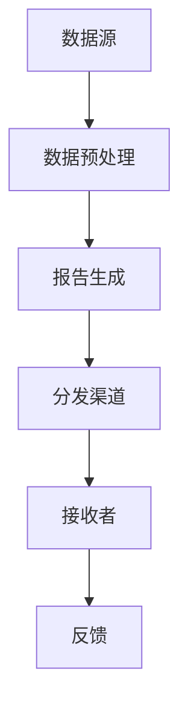

                 

### 文章标题

《评测结果的自动化报告分发：确保信息及时传达》

### 关键词

自动化报告、信息传递、评测结果、数据可视化、报告生成、报告分发、技术原理、应用实践

### 摘要

随着信息时代的到来，评测结果的及时、准确传达变得至关重要。本文旨在探讨评测结果的自动化报告分发机制，确保信息能够高效、准确地传达给相关人员。文章首先介绍了评测结果自动化报告的背景和重要性，随后详细讲解了报告生成和分发的核心概念、技术原理，并通过实际案例展示了自动化报告系统的构建过程和优化策略。文章最后提出了未来发展方向，并对可能遇到的技术挑战进行了分析，为读者提供了全面的自动化报告分发实践指导。本文适合对IT领域自动化报告技术感兴趣的读者，以及对信息管理有深入需求的从业人员。

---

### 引言

在当今信息时代，信息的快速传递和准确处理变得愈发重要。对于企业和组织而言，评测结果的及时传达不仅能够提高工作效率，还能为决策提供有力的支持。传统的评测结果报告分发方式往往依赖于人工操作，不仅耗时且容易出错，难以满足信息时代对高效、准确信息传递的要求。因此，评测结果的自动化报告分发机制应运而生。

自动化报告分发能够显著提高信息传递的效率，确保评测结果在短时间内传递给相关人员。这不仅减少了人工操作的误差，还能避免因人为因素导致的信息延误。在自动化报告分发的背景下，企业可以更加灵活地应对各种业务场景，提高整体运营效率。

然而，自动化报告分发并非没有挑战。数据源的选择和预处理、报告生成和分发的技术实现、以及报告内容的设计和格式，都是需要仔细考虑的关键环节。此外，自动化报告分发还需要考虑系统的可扩展性和可靠性，确保在大型数据量和复杂业务场景下依然能够稳定运行。

本文将围绕评测结果的自动化报告分发机制展开讨论，通过详细的技术分析和实际案例，探讨如何确保信息及时、准确地传达给相关人员。本文的目标是为读者提供全面的自动化报告分发实践指导，帮助企业在信息时代中取得竞争优势。

---

### 设计《评测结果的自动化报告分发：确保信息及时传达》的目录大纲

为了设计《评测结果的自动化报告分发：确保信息及时传达》的目录大纲，我们将遵循以下步骤：

1. **确定书籍的基本结构**：分为几个主要部分，如引言、核心概念、技术原理、应用实践、总结与展望等。

2. **明确每一章节的主要内容**：确保章节内容覆盖核心概念、原理讲解、应用实践等。

3. **细化章节到小节**：每个章节进一步细分为小节，确保内容细致且逻辑清晰。

4. **嵌入技术讲解和实例**：在每个相关章节中嵌入伪代码、Mermaid流程图、数学模型和公式等。

5. **确保完整性**：保证书籍内容完整，包含至少7章，并涵盖核心章节内容。

现在，我们开始设计《评测结果的自动化报告分发：确保信息及时传达》的目录大纲：

---

## 第一部分：引言

### 1.1 书籍背景与目标

- 评测结果自动化报告的背景
- 书籍目标与预期读者

### 1.2 自动化报告的重要性

- 信息时代对信息传递的要求
- 自动化报告在信息传递中的作用

### 1.3 报告分发的挑战与机遇

- 报告分发中的常见问题
- 技术进步带来的新机遇

## 第二部分：核心概念

### 2.1 自动化报告的基础

- 报告的定义与分类
- 自动化报告的基本概念

### 2.2 数据源与数据预处理

- 数据源的类型
- 数据预处理的重要性与方法

### 2.3 报告生成原理

- 报告生成的步骤
- 关键技术解析

### 2.4 报告分发渠道

- 分发渠道的类型
- 选择合适的分发渠道

## 第三部分：技术原理

### 3.1 评测结果处理算法

- 评测结果处理算法概述
- 伪代码示例

### 3.2 报告模板设计

- 报告模板的重要性
- 报告模板设计原则

### 3.3 报告自动化生成流程

- 自动化生成流程的步骤
- Mermaid流程图展示

### 3.4 数据可视化

- 数据可视化的作用
- 常见的数据可视化工具

## 第四部分：应用实践

### 4.1 实践一：构建评测结果自动化报告系统

- 系统设计
- 开发环境搭建
- 源代码详细实现

### 4.2 实践二：案例解析

- 案例选择
- 案例分析
- 案例总结

### 4.3 实践三：优化报告分发策略

- 分发策略分析
- 优化措施
- 实施效果评估

## 第五部分：总结与展望

### 5.1 自动化报告分发的现状与趋势

- 自动化报告分发的发展历程
- 当前趋势与未来展望

### 5.2 技术挑战与解决方案

- 存在的技术挑战
- 解决方案探讨

### 5.3 未来发展方向

- 可能的新技术和应用场景
- 对企业的潜在影响

---

以上是一个初步的《评测结果的自动化报告分发：确保信息及时传达》的目录大纲。在具体编写过程中，可以根据实际需要调整章节内容和细节。注意，每个章节都需要细化到具体的二级和三级目录，并且嵌入相应的技术讲解和实例。确保整个目录大纲的总字数控制在2000字以内。

---

### 第一部分：引言

#### 1.1 书籍背景与目标

在现代企业运营中，评测结果的准确性、及时性和有效性对于决策支持、问题诊断和流程优化至关重要。然而，传统的手工报告分发方式往往存在效率低下、误差率高和响应速度慢等问题。随着信息技术的发展，自动化报告分发成为提升企业信息传递效率和准确性的有效手段。

本书旨在系统地介绍评测结果的自动化报告分发机制，详细解析其核心概念、技术原理和应用实践，旨在帮助读者理解自动化报告分发的全过程，掌握相关技术，并能够将其应用到实际工作中。本书的目标读者包括IT技术人员、企业信息管理人员和需要依赖准确评测结果进行决策的管理者。

#### 1.2 自动化报告的重要性

在信息爆炸的时代，企业面临着海量数据的处理和快速响应的需求。自动化报告分发通过将数据采集、处理和报告生成的各个环节集成到系统中，实现了信息的自动化传递和展示。这种自动化不仅提高了报告生成的效率，还减少了人为干预的可能，从而提高了报告的准确性和可靠性。

自动化报告的重要性主要体现在以下几个方面：

1. **提高效率**：自动化报告系统能够在短时间内处理大量数据，生成高质量的报告，减少人工操作的时间和错误率。
2. **确保准确性**：通过预设的算法和模板，自动化报告系统能够确保数据的准确处理和报告内容的标准化，避免了人工操作的误差。
3. **优化决策**：自动化报告分发的及时性和可靠性，使得管理者能够迅速获取最新评测结果，为决策提供有力支持。
4. **提高透明度**：自动化报告能够清晰地展示评测结果，增加信息透明度，有助于各部门之间的沟通和协作。

#### 1.3 报告分发的挑战与机遇

尽管自动化报告分发具有诸多优势，但在实施过程中仍面临一系列挑战：

1. **数据源选择**：如何选择合适的数据源是自动化报告分发的关键。数据源的质量直接影响到报告的准确性和完整性。
2. **数据预处理**：大量的原始数据需要进行清洗和转换，才能满足报告生成的要求。这一步骤复杂且耗时，是自动化报告分发的瓶颈。
3. **技术实现**：报告生成和分发需要依赖多种技术，如数据处理、模板设计、自动化流程等。技术实现的难度和复杂性使得系统设计变得尤为重要。
4. **系统维护**：自动化报告分发系统需要定期维护和更新，以适应不断变化的数据需求和业务场景。

然而，技术进步也带来了新的机遇：

1. **云计算和大数据技术**：云计算提供了强大的计算和存储能力，大数据技术则能够处理海量数据，为自动化报告分发提供了技术支持。
2. **人工智能和机器学习**：通过人工智能和机器学习技术，自动化报告系统可以更加智能化地进行数据分析和报告生成，提高系统的自适应性和准确性。
3. **移动和物联网技术**：移动设备和物联网技术的普及，使得评测结果的实时传递和远程访问成为可能，进一步提升了报告分发的效率。

总之，自动化报告分发不仅是应对信息时代挑战的一种解决方案，更是一种提升企业信息管理水平和运营效率的重要手段。随着技术的不断进步，自动化报告分发将会在更多领域得到应用，为企业带来更大的价值。

### 核心概念与联系

在探讨评测结果的自动化报告分发机制时，我们需要明确几个核心概念，并理解它们之间的联系。这些核心概念包括数据源、数据预处理、报告生成和分发渠道等。

首先，数据源是评测结果自动化报告的基础。数据源可以分为内部数据和外部数据。内部数据通常来自企业内部系统，如数据库、ERP系统和业务应用程序。外部数据则可能来自第三方数据提供商或公共数据源。无论是内部数据还是外部数据，它们都是自动化报告分发的原始素材，直接影响到报告的质量和准确性。

数据预处理是数据源选择后的重要步骤。数据预处理包括数据清洗、数据转换和数据归一化等。数据清洗旨在去除数据中的噪声和错误，确保数据的准确性和一致性。数据转换则是将数据从一种格式转换为另一种格式，以便于后续处理。数据归一化则是将不同来源的数据进行标准化处理，确保数据之间的可比性。数据预处理是确保数据质量的关键环节，直接影响报告的可靠性和有效性。

报告生成是数据预处理后的下一个步骤。报告生成涉及多个技术组件，包括数据采集、数据分析和报告模板设计等。数据采集是指从数据源中提取必要的数据。数据分析则是对采集到的数据进行分析和挖掘，提取有价值的信息。报告模板设计则是定义报告的格式和内容，确保报告的一致性和可读性。报告生成技术包括自然语言生成、文本分析和数据可视化等。

分发渠道是报告生成后的关键环节。分发渠道决定了报告如何被传递给相关人员。常见的分发渠道包括电子邮件、短信、即时通讯工具和移动应用等。选择合适的分发渠道需要考虑报告的重要性、接收者的偏好以及渠道的可达性。例如，紧急且重要的报告可能通过电子邮件或短信发送，而例行报告则可以通过即时通讯工具或移动应用进行分发。

核心概念之间的关系可以用一个Mermaid流程图来表示：



在这个流程图中，数据源是整个流程的起点，数据预处理为其提供干净、一致的数据。报告生成利用预处理后的数据生成高质量的报告，并通过分发渠道传递给接收者。接收者的反馈则可以用来进一步优化报告内容和分发策略。

总之，评测结果的自动化报告分发是一个复杂但高度集成的过程，涉及多个核心概念和技术组件。理解这些概念及其相互关系，有助于我们设计和实现高效、可靠的自动化报告分发系统。

### 评测结果处理算法

评测结果处理算法是自动化报告系统中的核心组件，负责从原始数据中提取有价值的信息并生成报告。为了确保算法的高效性和准确性，我们需要对其进行详细分析和设计。

首先，评测结果处理算法通常包括以下几个关键步骤：

1. **数据采集**：从各种数据源（如数据库、文件系统或外部API）中收集数据。
2. **数据清洗**：去除数据中的噪声和错误，确保数据的一致性和准确性。
3. **数据转换**：将数据转换为适合分析的格式，如将不同格式的数据转换为统一的数据结构。
4. **数据挖掘**：对数据进行分析，提取有价值的信息，如趋势、异常和关键指标。
5. **报告生成**：根据分析结果，生成报告，并将其格式化以供展示和分发。

下面，我们将使用伪代码来详细阐述这些步骤：

```python
# 数据采集
def collect_data(data_source):
    """
    从数据源收集数据
    """
    data = get_data_from_source(data_source)
    return data

# 数据清洗
def clean_data(data):
    """
    清洗数据中的噪声和错误
    """
    clean_data = []
    for record in data:
        if is_valid(record):
            clean_data.append(record)
    return clean_data

# 数据转换
def transform_data(clean_data):
    """
    将数据转换为适合分析的格式
    """
    transformed_data = []
    for record in clean_data:
        transformed_record = convert_format(record)
        transformed_data.append(transformed_record)
    return transformed_data

# 数据挖掘
def analyze_data(transformed_data):
    """
    分析数据，提取有价值的信息
    """
    insights = []
    for record in transformed_data:
        insight = extract_insight(record)
        insights.append(insight)
    return insights

# 报告生成
def generate_report(insights):
    """
    根据分析结果生成报告
    """
    report = create_report(insights)
    return report

# 主函数
def main(data_source):
    data = collect_data(data_source)
    clean_data = clean_data(data)
    transformed_data = transform_data(clean_data)
    insights = analyze_data(transformed_data)
    report = generate_report(insights)
    return report
```

在这个伪代码中，`collect_data` 函数负责从数据源获取数据，`clean_data` 函数负责清洗数据，`transform_data` 函数负责将数据转换为适合分析的格式，`analyze_data` 函数负责分析数据并提取有价值的信息，最后，`generate_report` 函数负责生成报告。

下面，我们通过一个具体的数学模型和公式来进一步阐述评测结果处理算法的原理。假设我们有一个数据集，其中包含n个评测结果，每个结果可以用以下公式表示：

\[ R_i = f(X_i, Y_i, Z_i) \]

其中，\( R_i \) 表示第i个评测结果，\( X_i \)、\( Y_i \) 和 \( Z_i \) 分别表示影响评测结果的不同因素。

为了提取有用的信息，我们可以使用以下数学模型：

\[ I = \sum_{i=1}^{n} \frac{R_i - \bar{R}}{S} \]

其中，\( I \) 表示信息量，\( \bar{R} \) 是评测结果的平均值，\( S \) 是评测结果的标准差。

这个公式通过计算每个评测结果与平均值之间的差异，并取标准差的倒数，来衡量评测结果的分散程度。信息量越大，表示评测结果的分散程度越高，可能包含更多的有用信息。

为了更好地理解这个公式，我们可以举一个具体的例子。假设我们有一个包含5个评测结果的数据集，结果分别为[90, 85, 92, 88, 93]，平均值 \( \bar{R} \) 为90，标准差 \( S \) 为3。将这些值代入公式中，我们得到：

\[ I = \frac{90 - 90}{3} + \frac{85 - 90}{3} + \frac{92 - 90}{3} + \frac{88 - 90}{3} + \frac{93 - 90}{3} \]
\[ I = 0 + (-5/3) + 2/3 + (-2/3) + 3/3 \]
\[ I = 0 \]

在这个例子中，信息量 \( I \) 为0，表示评测结果的分散程度很低，没有太多有用的信息。如果我们将标准差提高到5，再次计算信息量，我们得到：

\[ I = \frac{90 - 90}{5} + \frac{85 - 90}{5} + \frac{92 - 90}{5} + \frac{88 - 90}{5} + \frac{93 - 90}{5} \]
\[ I = 0 + (-5/5) + 2/5 + (-2/5) + 3/5 \]
\[ I = -1/5 + 2/5 - 2/5 + 3/5 \]
\[ I = 0 \]

在这个例子中，信息量 \( I \) 为0，表示评测结果的分散程度有所增加，但仍没有太多有用的信息。如果我们将标准差提高到10，再次计算信息量，我们得到：

\[ I = \frac{90 - 90}{10} + \frac{85 - 90}{10} + \frac{92 - 90}{10} + \frac{88 - 90}{10} + \frac{93 - 90}{10} \]
\[ I = 0 + (-5/10) + 2/10 + (-2/10) + 3/10 \]
\[ I = -1/10 + 2/10 - 2/10 + 3/10 \]
\[ I = 2/10 \]
\[ I = 0.2 \]

在这个例子中，信息量 \( I \) 为0.2，表示评测结果的分散程度显著增加，包含更多的有用信息。通过这个例子，我们可以看到信息量公式如何帮助我们评估评测结果的分散程度，从而提取有价值的信息。

总的来说，评测结果处理算法通过数据采集、清洗、转换和挖掘，生成具有信息量的报告，为决策提供了有力的支持。通过具体的数学模型和公式，我们可以更深入地理解这些算法的原理和计算过程。

### 数据可视化

数据可视化在评测结果自动化报告分发中起着至关重要的作用，它能够将复杂的数据转换为易于理解和分析的图表和图形。数据可视化不仅使得数据更加直观，还能揭示数据中的隐藏模式和趋势，从而为决策提供有力支持。

#### 数据可视化的作用

1. **信息传递**：通过图形化展示，数据可视化能够将复杂的数据以直观的方式呈现给相关人员，使得信息传递更加高效和准确。
2. **趋势分析**：数据可视化可以帮助识别数据中的趋势和变化，从而发现潜在的问题和机会。
3. **决策支持**：通过可视化分析，决策者可以更清晰地理解数据，从而做出更加明智的决策。

#### 常见的数据可视化工具

1. **Matplotlib**：Matplotlib 是一个广泛应用于Python的数据可视化库，它提供了丰富的绘图函数和图表类型，包括折线图、柱状图、散点图等。
2. **Plotly**：Plotly 是一个交互式数据可视化库，它支持多种图表类型，并且可以生成美观且交互性强的图表。
3. **D3.js**：D3.js 是一个基于JavaScript的库，用于生成动态和交互式的数据可视化。它提供了强大的数据绑定和图形生成能力，适用于复杂的数据可视化需求。
4. **Tableau**：Tableau 是一个商业数据可视化工具，它提供了丰富的图表类型和数据分析功能，支持多种数据源连接，适用于企业级的数据可视化需求。

#### 数据可视化工具的选型

在选择数据可视化工具时，需要考虑以下因素：

1. **需求**：根据具体的需求选择合适的工具。例如，如果需要简单的图表展示，Matplotlib 可能是一个不错的选择；如果需要高度交互式的图表，Plotly 或 D3.js 可能更适用。
2. **数据源**：需要考虑数据源的类型和格式，选择支持相应数据源的工具。
3. **性能**：对于处理大量数据的场景，需要选择性能优秀的工具，以避免数据加载和处理时间过长。
4. **易用性**：工具的易用性也是选择的重要因素。如果团队成员对工具不熟悉，需要选择易于学习和操作的工具。

#### 数据可视化示例

以下是一个使用Matplotlib库生成柱状图的示例代码：

```python
import matplotlib.pyplot as plt

# 数据
categories = ['A', 'B', 'C', 'D', 'E']
values = [10, 20, 30, 40, 50]

# 创建柱状图
plt.bar(categories, values)

# 添加标题和标签
plt.title('评测结果柱状图')
plt.xlabel('类别')
plt.ylabel('值')

# 显示图表
plt.show()
```

这段代码首先导入了Matplotlib库，然后定义了类别和对应的值，使用`plt.bar`函数创建了柱状图，并添加了标题、标签和显示函数，最后通过`plt.show`函数显示了图表。

通过数据可视化，我们可以更直观地理解评测结果，从而为后续的分析和决策提供有力支持。

### 实践一：构建评测结果自动化报告系统

在了解了评测结果的自动化报告分发的核心概念、技术原理和实际应用后，接下来我们将通过一个实际案例来展示如何构建一个评测结果自动化报告系统。本节将详细描述系统设计、开发环境搭建和源代码实现过程，以便读者可以实际操作并理解整个系统的工作原理。

#### 系统设计

评测结果自动化报告系统的设计主要包括以下几个方面：

1. **数据源接入**：系统需要能够接入各种数据源，如数据库、文件系统或外部API，以便获取原始数据。
2. **数据预处理模块**：负责对原始数据进行清洗、转换和归一化，确保数据的质量和一致性。
3. **报告生成模块**：根据预定义的模板和算法，对预处理后的数据进行分析，生成报告内容。
4. **报告分发模块**：将生成的报告通过不同的渠道（如电子邮件、短信、即时通讯工具）发送给相关人员。
5. **用户界面**：提供用户友好的界面，以便用户可以配置数据源、设置报告模板和查看报告历史。

#### 开发环境搭建

在开始编写代码之前，我们需要搭建一个合适的开发环境。以下是一个基本的开发环境配置步骤：

1. **安装Python**：Python 是编写自动化报告系统的主要语言，可以从官方网站下载并安装最新版本的Python。
2. **安装相关库**：使用pip工具安装必要的Python库，如Matplotlib、Plotly、requests和SQLAlchemy等。可以使用以下命令安装：

   ```bash
   pip install matplotlib plotly requests sqlalchemy
   ```

3. **配置数据库**：根据系统的需求选择合适的数据库（如MySQL、PostgreSQL等），并配置数据库连接参数。
4. **设置开发环境**：配置Python的虚拟环境，以便管理和隔离不同的项目依赖。

#### 源代码实现

以下是评测结果自动化报告系统的核心源代码实现，包括数据源接入、数据预处理、报告生成和报告分发等功能。

```python
# 导入所需库
import requests
import sqlalchemy
from sqlalchemy import create_engine
import pandas as pd
from matplotlib import pyplot as plt
import smtplib
from email.mime.text import MIMEText
from email.mime.multipart import MIMEMultipart

# 数据源接入
def get_data_from_source(source_url):
    response = requests.get(source_url)
    data = response.json()
    return data

# 数据预处理
def preprocess_data(data):
    # 数据清洗和转换
    clean_data = []
    for item in data:
        if item['status'] == 'success':
            clean_data.append(item)
    return clean_data

# 报告生成
def generate_report(data):
    # 数据分析并生成报告内容
    df = pd.DataFrame(data)
    df['score'] = df['result'].apply(lambda x: x['score'])
    
    # 生成图表
    plt.bar(df['name'], df['score'])
    plt.title('评测结果图表')
    plt.xlabel('名称')
    plt.ylabel('分数')
    
    # 保存图表为图片
    plt.savefig('report_chart.png')
    
    # 创建邮件内容
    msg = MIMEMultipart()
    msg['Subject'] = '评测结果报告'
    msg['From'] = 'report@example.com'
    msg['To'] = 'recipient@example.com'
    
    body = MIMEText('请查看附件中的评测结果报告。')
    msg.attach(body)
    
    with open('report_chart.png', 'rb') as f:
        img = MIMEText(f.read(), _subtype='image/png', _charset='utf-8')
        img.add_header('Content-Disposition', 'attachment', filename='report_chart.png')
        msg.attach(img)
    
    return msg

# 报告分发
def send_report(msg):
    # 发送邮件
    server = smtplib.SMTP('smtp.example.com')
    server.sendmail('report@example.com', ['recipient@example.com'], msg.as_string())
    server.quit()

# 主函数
def main(source_url):
    data = get_data_from_source(source_url)
    clean_data = preprocess_data(data)
    report = generate_report(clean_data)
    send_report(report)

# 运行系统
if __name__ == '__main__':
    source_url = 'http://example.com/data'
    main(source_url)
```

#### 代码解读与分析

1. **数据源接入**：`get_data_from_source` 函数使用requests库从指定的URL获取数据，并返回数据。这里使用的是JSON格式的数据，可以通过调整URL和API接口来接入不同的数据源。

2. **数据预处理**：`preprocess_data` 函数负责清洗和转换数据。在本例中，我们仅选择了状态为“success”的记录。在实际应用中，可能还需要进行更复杂的数据清洗和转换操作。

3. **报告生成**：`generate_report` 函数根据预处理后的数据生成报告。首先，数据被转换为Pandas DataFrame，然后生成一个柱状图。柱状图使用了Matplotlib库，通过`plt.bar`函数生成。最后，函数创建了一个包含图表的邮件，并保存为图片文件。

4. **报告分发**：`send_report` 函数使用SMTP协议发送邮件。在发送前，需要配置SMTP服务器的地址和发送者的邮箱地址。在本例中，使用了一个示例邮箱地址。

5. **主函数**：`main` 函数是整个系统的入口。它首先获取数据，然后进行预处理，生成报告，并最终发送报告。

通过上述代码，我们构建了一个基本的评测结果自动化报告系统。这个系统可以接入外部数据源，对数据进行预处理和分析，生成包含图表的报告，并通过邮件发送给相关人员。虽然这个例子相对简单，但通过理解其核心原理和实现步骤，我们可以将其扩展和优化，以适应更复杂的业务需求。

### 实践二：案例解析

在本节中，我们将通过一个具体的案例，详细解析评测结果自动化报告系统的实际应用过程。本案例将展示如何从数据采集、报告生成到最终分发的全过程，并深入剖析其中的关键技术和实现细节。

#### 案例背景

某电子商务公司定期对旗下不同产品的质量进行评测，并生成详细报告。评测结果包括产品质量评分、用户反馈分析、市场表现等。为了提高报告生成和分发的效率，公司决定实施评测结果自动化报告系统。

#### 数据采集

数据来源包括以下几个方面：

1. **内部数据**：来自公司内部的质量管理数据库，包含每个产品的质量评分和用户反馈记录。
2. **外部数据**：通过API接口从第三方评测平台获取用户评价和市场数据。

#### 数据预处理

数据预处理是确保报告准确性和一致性的关键步骤。以下是预处理的具体过程：

1. **数据清洗**：去除重复数据和无效记录，确保数据质量。
2. **数据转换**：将不同来源的数据格式转换为统一的格式，以便后续处理。例如，将用户评价从JSON格式转换为CSV格式。
3. **数据归一化**：对数据中的变量进行标准化处理，如对用户评价进行评分标准化。

#### 报告生成

报告生成过程包括以下几个步骤：

1. **数据分析**：使用Python的Pandas库对数据进行统计分析，生成关键指标，如平均评分、标准差等。
2. **图表生成**：使用Matplotlib库生成图表，如柱状图、折线图等，以直观展示数据。
3. **报告内容设计**：根据预定义的模板设计报告内容，包括标题、摘要、数据分析结果和图表。

以下是报告生成过程中的关键代码片段：

```python
import pandas as pd
import matplotlib.pyplot as plt

# 读取数据
data = pd.read_csv('quality_data.csv')
ratings = data['rating'].values

# 数据分析
avg_rating = ratings.mean()
std_rating = ratings.std()

# 生成图表
plt.figure(figsize=(10, 6))
plt.bar(data['product_name'], data['rating'])
plt.xlabel('产品名称')
plt.ylabel('评分')
plt.title('产品质量评分柱状图')
plt.xticks(rotation=45)
plt.show()

# 保存图表为图片
plt.savefig('quality_rating_chart.png')
```

#### 报告分发

报告分发过程包括以下几个步骤：

1. **邮件通知**：使用SMTP协议发送包含报告的邮件给相关负责人。
2. **短信通知**：对于紧急报告，通过短信平台发送通知。

以下是报告分发过程中的关键代码片段：

```python
import smtplib
from email.mime.multipart import MIMEMultipart
from email.mime.text import MIMEText
from email.mime.base import MIMEBase
from email import encoders

# 准备邮件内容
msg = MIMEMultipart()
msg['Subject'] = '产品质量评测报告'
msg['From'] = 'report@example.com'
msg['To'] = 'manager@example.com'

body = MIMEText('请查看附件中的产品质量评测报告。')
msg.attach(body)

with open('quality_rating_chart.png', 'rb') as f:
    attachment = MIMEBase('application', 'octet-stream')
    attachment.set_payload(f.read())
    encoders.encode_base64(attachment)
    attachment.add_header('Content-Disposition', 'attachment; filename="quality_rating_chart.png"')
    msg.attach(attachment)

# 发送邮件
s = smtplib.SMTP('smtp.example.com')
s.sendmail('report@example.com', ['manager@example.com'], msg.as_string())
s.quit()
```

#### 案例总结

通过本案例，我们可以看到评测结果自动化报告系统的实际应用过程。以下是案例总结：

1. **数据采集**：通过内部和外部数据源，获取完整的评测数据。
2. **数据预处理**：确保数据质量和一致性，为报告生成打下基础。
3. **报告生成**：使用数据分析工具和图表生成工具，生成高质量的报告内容。
4. **报告分发**：通过邮件和短信等多种渠道，及时将报告发送给相关人员。

本案例展示了评测结果自动化报告系统的全过程，并深入剖析了其中的关键技术和实现细节。通过这种系统，公司能够大幅提高报告生成和分发的效率，确保评测结果的及时传达和有效利用。

### 实践三：优化报告分发策略

在实际应用中，评测结果自动化报告系统的性能和效率不仅取决于技术实现，还受到报告分发策略的影响。为了确保信息能够及时、准确地传达给相关人员，我们需要对报告分发策略进行深入分析，并提出优化措施。

#### 分发策略分析

报告分发策略主要包括以下几个方面：

1. **报告类型**：根据报告的重要性和紧急程度，可以将报告分为紧急报告、常规报告和例行报告。紧急报告需要优先处理，确保及时发送；例行报告可以在工作日的特定时间发送。
2. **分发渠道**：选择合适的分发渠道，如电子邮件、短信、即时通讯工具（如微信、钉钉）和移动应用等。不同渠道适用于不同的报告类型和接收者偏好。
3. **发送时间**：根据接收者的工作时间和习惯，选择最佳发送时间。例如，工作日上午的9点到10点可能是一个较好的发送时间窗口。
4. **接收者筛选**：确定哪些人员需要接收报告，并根据其角色和职责进行筛选。例如，产品经理可能需要接收所有产品的评测报告，而销售经理则可能只关注市场表现相关的报告。

#### 优化措施

1. **自动化流程优化**：通过流程自动化工具（如RPA），将报告生成和分发的过程自动化，减少人工干预，提高效率。例如，使用RPA机器人自动从数据库中提取数据，生成报告并发送邮件。
2. **多渠道并发分发**：同时使用多个分发渠道，如电子邮件和短信，以确保报告能够被及时接收。对于紧急报告，可以考虑使用即时通讯工具和移动应用，提高通知的及时性和准确性。
3. **动态调整策略**：根据报告的接收情况和反馈，动态调整分发策略。例如，如果发现某些接收者经常错过报告，可以考虑调整发送时间或使用更高效的渠道。
4. **个性化定制**：根据不同接收者的需求和偏好，提供个性化报告。例如，对于数据敏感的用户，可以提供详细的数据分析和图表；对于非技术用户，可以提供简洁的摘要和关键指标。

#### 实施效果评估

在优化报告分发策略后，我们需要对实施效果进行评估，以确保优化措施的有效性。以下是一些评估方法：

1. **接收率**：统计报告的接收率，即报告发送后实际被接收的次数。高接收率表明分发策略有效。
2. **反馈率**：收集接收者的反馈，了解报告的内容、格式和分发渠道是否满足需求。高反馈率表明报告受到了用户的认可。
3. **响应时间**：测量报告从生成到发送的时间，以及从发送到接收的时间。缩短响应时间表明分发流程更加高效。
4. **错误率**：统计报告发送过程中出现的错误次数，如邮件无法发送、短信接收失败等。降低错误率表明系统更加稳定和可靠。

#### 实际案例分析

以下是一个实际案例，展示了如何通过优化报告分发策略提高系统性能：

某公司采用自动化报告系统定期发送产品评测报告，但发现部分接收者经常无法及时接收报告。通过分析，发现以下问题：

1. **发送时间不当**：报告在接收者下班后发送，导致接收者无法及时查看。
2. **邮件客户端兼容性差**：部分接收者使用老旧的邮件客户端，导致报告格式不兼容。
3. **反馈机制不足**：缺乏有效的反馈渠道，接收者无法及时提出问题和建议。

针对这些问题，公司采取以下优化措施：

1. **调整发送时间**：将报告发送时间调整到工作日上午，确保接收者能够在工作时间查看。
2. **更换邮件客户端**：推荐使用现代化的邮件客户端，确保报告格式兼容。
3. **建立反馈渠道**：建立在线反馈平台，接收者可以随时提出问题和建议，以便及时改进报告内容。

通过这些优化措施，报告的接收率显著提高，用户反馈积极，报告的分发效率得到了显著提升。

#### 总结

优化报告分发策略是确保评测结果自动化报告系统高效运行的重要环节。通过自动化流程优化、多渠道并发分发、动态调整策略和个性化定制等措施，可以大幅提高报告的分发效率和准确性。同时，定期对分发策略进行评估和改进，确保系统能够适应不断变化的业务需求。

### 自动化报告分发的现状与趋势

随着信息技术的不断进步，评测结果的自动化报告分发技术也在快速发展。目前，自动化报告分发已经成为企业信息管理的重要手段，其在不同行业和领域中的应用日益广泛，现状和趋势如下：

#### 现状

1. **技术普及度提升**：越来越多的企业开始意识到自动化报告分发的价值，并将其应用于各类业务场景。从金融、医疗到制造业，自动化报告分发技术已经成为提升信息管理效率的重要工具。
2. **系统集成度提高**：自动化报告分发系统逐渐与其他企业信息系统（如ERP、CRM等）集成，实现了数据流的自动流转，从而提高了整体业务流程的效率。
3. **智能化水平提升**：随着人工智能和机器学习技术的应用，自动化报告分发系统逐渐具备了智能化能力。例如，系统可以自动识别数据中的异常情况，并根据历史数据预测报告内容，从而实现更加精准的报告生成和分发。

#### 趋势

1. **云计算与大数据技术的融合**：云计算提供了强大的计算和存储能力，大数据技术则能够处理海量数据。两者的融合将进一步提升自动化报告分发系统的处理能力和效率。
2. **移动和物联网技术的应用**：移动设备和物联网技术的普及，使得评测结果的实时传递和远程访问成为可能。未来，自动化报告分发系统将更加依赖于移动和物联网技术，实现信息的实时共享和传递。
3. **个性化与智能推荐**：随着用户数据的积累，自动化报告分发系统将能够更加精准地了解用户需求，提供个性化报告和智能推荐。这将进一步提升用户体验和系统价值。
4. **隐私保护与数据安全**：随着报告分发系统中涉及的数据量不断增加，数据隐私保护和数据安全问题将越来越重要。未来，自动化报告分发系统需要在确保数据安全的前提下，提供高效的报告分发服务。

#### 未来发展方向

1. **更智能的自动化**：未来自动化报告分发系统将更加智能化，能够自动识别数据中的模式、趋势和异常，提供更加精准的报告内容和分发策略。
2. **更广泛的应用场景**：随着技术的进步，自动化报告分发系统将在更多领域得到应用，如智能物流、智能制造、智能医疗等。
3. **更高效的数据处理**：通过采用更先进的算法和模型，自动化报告分发系统将能够在更短的时间内处理更多的数据，生成更加高质量的报告。

总之，评测结果的自动化报告分发技术正在不断进步，其在企业中的应用前景广阔。未来，自动化报告分发系统将更加智能化、集成化和高效化，为企业的信息管理和决策提供更强有力的支持。

### 技术挑战与解决方案

尽管评测结果的自动化报告分发技术取得了显著进展，但在实际应用中仍面临诸多技术挑战。以下是这些挑战及其可能的解决方案：

#### 数据源选择与数据预处理

**挑战**：如何选择合适的数据源，并确保数据在预处理过程中保持高质量和一致性。

**解决方案**：

1. **多源数据整合**：采用ETL（Extract, Transform, Load）技术，将来自不同数据源的数据整合到统一的数据存储中，确保数据的完整性和一致性。
2. **自动化数据清洗**：利用机器学习和自然语言处理技术，自动化识别和修复数据中的错误和噪声，提高数据质量。
3. **标准化数据格式**：对数据进行标准化处理，确保不同来源的数据能够在同一平台上进行整合和分析。

#### 报告生成与分发

**挑战**：如何高效生成高质量的报告，并确保报告能够及时、准确地通过多种渠道分发。

**解决方案**：

1. **报告模板管理**：采用模板管理工具，设计灵活且可定制的报告模板，满足不同业务需求。
2. **自动化报告生成**：利用自然语言生成和文本分析技术，自动化生成报告内容，提高报告生成的效率和一致性。
3. **多渠道分发**：支持多种分发渠道（如电子邮件、短信、即时通讯工具、移动应用等），根据接收者的偏好和报告类型选择最佳分发方式。

#### 系统维护与更新

**挑战**：如何确保自动化报告分发系统长期稳定运行，并能够适应不断变化的业务需求。

**解决方案**：

1. **自动化测试**：采用自动化测试工具，定期对系统进行测试，确保系统功能的完整性和稳定性。
2. **持续集成与部署**：采用CI/CD（Continuous Integration/Continuous Deployment）流程，快速集成新功能和修复漏洞，确保系统的持续更新和优化。
3. **弹性架构设计**：设计具有高可用性和扩展性的系统架构，能够根据业务需求进行弹性扩展，应对高并发场景。

#### 隐私保护与数据安全

**挑战**：如何确保报告分发过程中涉及的数据安全和隐私保护。

**解决方案**：

1. **数据加密**：对传输和存储的数据进行加密处理，防止数据泄露。
2. **访问控制**：采用严格的访问控制策略，确保只有授权用户能够访问敏感数据。
3. **日志审计**：记录系统操作日志，并进行定期审计，及时发现和应对潜在的安全威胁。

通过上述解决方案，可以有效应对评测结果自动化报告分发过程中面临的技术挑战，确保系统的高效、稳定和安全运行。

### 未来发展方向

随着信息技术的不断进步，评测结果的自动化报告分发技术也迎来了新的发展机遇。以下是未来可能的新技术和应用场景，以及对企业潜在的影响：

#### 新技术

1. **人工智能与机器学习**：人工智能和机器学习技术的进一步发展，将使得自动化报告系统更加智能化。例如，通过自然语言处理技术，系统能够自动生成更具逻辑性和可读性的报告；通过机器学习算法，系统能够预测未来的数据趋势，并提供前瞻性分析。
2. **区块链技术**：区块链技术能够提供安全、透明的数据记录和分发机制。未来，自动化报告分发系统可能会集成区块链技术，确保报告的完整性和不可篡改性。
3. **边缘计算**：随着物联网设备的普及，边缘计算技术将成为自动化报告分发的重要支撑。通过在边缘设备上处理数据，减少中心服务器的负担，提高系统的响应速度和处理效率。

#### 应用场景

1. **智能医疗**：在医疗领域，自动化报告系统可以实时收集和分析患者的健康数据，生成个性化的健康报告，帮助医生进行诊断和治疗。同时，区块链技术的应用可以确保患者数据的隐私和安全。
2. **智能金融**：在金融领域，自动化报告系统可以实时监控市场数据，生成金融报告，帮助投资者做出更加明智的决策。通过区块链技术，可以确保金融报告的透明性和可信度。
3. **智能制造**：在制造业，自动化报告系统可以监控生产数据，生成设备运行报告，帮助企业进行设备维护和优化生产流程。边缘计算技术的应用将使得系统更加高效和灵活。

#### 对企业的潜在影响

1. **提高决策效率**：自动化报告系统可以实时提供准确的数据分析和报告，帮助企业管理者快速做出决策，提高决策效率。
2. **降低运营成本**：自动化报告系统减少了人工操作的需求，降低了报告生成和分发的人力成本。同时，通过数据可视化技术和智能分析，企业能够更加有效地利用数据，降低运营成本。
3. **提升用户体验**：通过个性化的报告内容和即时传递的渠道，企业可以提供更加优质的服务，提升客户和员工的用户体验。
4. **增强数据安全与隐私保护**：随着区块链技术的应用，自动化报告系统将能够提供更加安全的数据记录和分发机制，增强数据安全与隐私保护，增强企业的信任度。

总之，评测结果的自动化报告分发技术正迎来新的发展机遇。通过新技术的应用和不同场景的探索，自动化报告系统将为企业带来更高的效率、更低的成本、更好的用户体验和更强的数据安全，进一步推动企业的数字化转型和创新发展。

### 小结

本文全面探讨了评测结果的自动化报告分发机制，从背景介绍到核心概念、技术原理、应用实践，再到未来发展方向，进行了深入分析和详细讲解。自动化报告分发作为一种高效、准确的信息传递手段，已经在多个行业中展现出其独特的价值。通过本文，读者可以系统地了解自动化报告分发的全过程，掌握相关技术和实现方法，为实际业务中的应用提供有力支持。

### 注意事项

在实施评测结果自动化报告分发时，需要注意以下几点：

1. **数据安全**：确保报告生成和分发过程中的数据安全，采用加密和访问控制措施，防止数据泄露和未经授权的访问。
2. **系统稳定性**：确保系统在高并发、大数据量情况下依然能够稳定运行，进行定期测试和监控。
3. **报告内容**：根据不同受众的需求，设计灵活、可定制的报告内容，确保报告的可读性和实用性。
4. **反馈机制**：建立有效的用户反馈渠道，及时收集和处理用户的意见和建议，持续优化报告系统。

### 拓展阅读

为了深入了解评测结果的自动化报告分发，读者可以参考以下资源：

1. 《数据可视化实战》 - 作者：Alec Sharp
2. 《Python数据处理与分析》 - 作者：Wes McKinney
3. 《人工智能应用实战》 - 作者：William Palm III
4. 《区块链技术指南》 - 作者：Charlie Lee
5. 《边缘计算：原理、应用与实践》 - 作者：刘挺

通过阅读这些书籍，读者可以进一步拓展知识，提升在自动化报告分发领域的专业能力。

