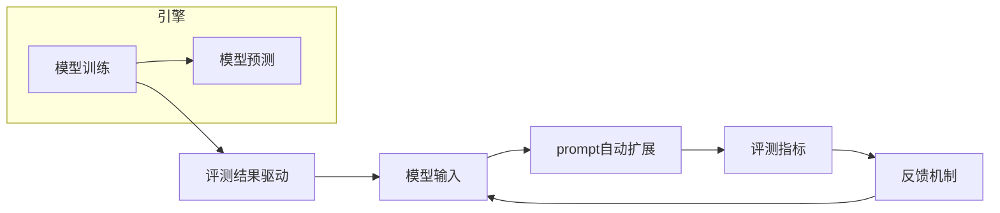

                 

## 文章标题

《评测结果驱动的prompt自动扩展》

> 关键词：评测结果、prompt自动扩展、人工智能、算法原理、数学模型、项目实战、案例分析

> 摘要：本文深入探讨了评测结果驱动的prompt自动扩展技术，通过详细介绍核心概念、算法原理和实际应用案例，展示了该技术在实际开发中的重要性及其潜在的应用前景。

### 背景介绍

在人工智能领域，自然语言处理（NLP）一直是一个重要的研究方向。随着深度学习技术的不断发展，NLP在语音识别、机器翻译、情感分析、文本生成等方面取得了显著的成果。然而，在这些应用中，prompt的设计和优化仍然是一个挑战。prompt，即输入提示，是影响模型性能的关键因素之一。一个好的prompt能够引导模型更好地理解输入信息，从而提高模型的输出质量。

传统的prompt设计往往依赖于人工经验和主观判断，这种方式不仅效率低下，而且难以保证prompt的优化效果。为了解决这个问题，研究人员提出了评测结果驱动的prompt自动扩展技术。该技术通过评测模型在特定prompt下的表现，动态调整prompt，从而实现prompt的自动优化。这种技术不仅提高了prompt设计的效率，还显著提升了模型的性能。

本文将详细探讨评测结果驱动的prompt自动扩展技术，首先介绍相关背景知识，包括评测结果驱动和prompt自动扩展的概念，然后深入分析核心算法原理和数学模型，最后通过实际项目实战和案例分析，展示该技术的实际应用效果。希望通过本文的介绍，能够为读者提供对这一技术全面而深入的了解。

### 核心概念与联系

在深入探讨评测结果驱动的prompt自动扩展技术之前，首先需要明确几个核心概念，并了解这些概念之间的联系。以下是本文将要讨论的关键概念：

1. **评测结果驱动**：评测结果驱动是一种基于模型输出结果的优化方法。在自然语言处理任务中，模型的表现取决于输入的prompt。评测结果驱动通过不断调整prompt，使其在特定的任务中达到最优性能。这种方法的核心理念是利用评测结果作为反馈信号，驱动prompt的动态调整。

2. **prompt自动扩展**：prompt自动扩展是一种自动优化prompt的方法。它通过算法自动生成或调整prompt，使其更符合任务需求。自动扩展prompt的目标是提高模型在特定任务中的性能，减少人工干预，从而提高模型部署的效率。

3. **评测指标**：评测指标是评估模型性能的重要工具。在自然语言处理任务中，常用的评测指标包括准确率、召回率、F1分数等。评测指标用于量化模型在不同prompt下的表现，是评测结果驱动的核心依据。

4. **反馈机制**：反馈机制是评测结果驱动的关键组成部分。通过将模型的输出与预期的目标进行对比，反馈机制能够提供关于prompt调整方向的指导信息。

了解这些概念之间的联系是理解评测结果驱动的prompt自动扩展技术的基础。下面我们将使用Mermaid流程图来展示这些概念之间的关系，帮助读者更直观地理解整个流程。



在这个流程图中，评测结果驱动（A）通过模型输入（B）影响prompt自动扩展（C），而评测指标（D）和反馈机制（E）则确保prompt的调整能够提升模型性能。模型训练（F）和模型预测（G）是整个流程的核心，它们为评测结果驱动提供了数据基础。

通过这个Mermaid流程图，我们可以清晰地看到评测结果驱动的prompt自动扩展技术的整体架构。接下来，我们将深入探讨每个环节的具体原理和实现方法。

### 核心算法原理讲解

在深入探讨评测结果驱动的prompt自动扩展技术时，我们需要了解其核心算法原理。以下是本文将要讨论的几个关键算法原理：

#### 1. 评测结果的计算

评测结果计算是评测结果驱动的第一步，它决定了模型在不同prompt下的性能表现。通常，评测结果计算包括以下几个步骤：

1. **数据预处理**：对输入数据集进行预处理，包括文本清洗、分词、去停用词等操作。这一步骤的目的是确保输入数据的质量和一致性。

   ```python
   def preprocess_data(data):
       # 文本清洗和分词
       # ...
       return processed_data
   ```

2. **特征提取**：从预处理后的数据中提取特征。特征提取的方法取决于具体的自然语言处理任务，常见的特征提取方法包括词袋模型、TF-IDF、Word2Vec等。

   ```python
   def extract_features(data):
       # 特征提取
       # ...
       return features
   ```

3. **模型评估**：使用预训练好的模型对特征进行评估。评估指标取决于任务类型，如文本分类任务可以使用准确率、召回率、F1分数等。

   ```python
   def evaluate_model(model, features, labels):
       predictions = model.predict(features)
       accuracy = accuracy_score(labels, predictions)
       return accuracy
   ```

#### 2. Prompt自动扩展算法

Prompt自动扩展算法是评测结果驱动的核心，它的目标是生成或调整prompt，以提高模型在特定任务中的性能。以下是一种简单的Prompt自动扩展算法：

1. **初始Prompt生成**：首先，生成一个初始的prompt。初始prompt可以基于用户输入、领域知识或随机生成。

   ```python
   def generate_initial_prompt(user_input):
       # 生成初始prompt
       # ...
       return prompt
   ```

2. **Prompt调整**：根据模型的评测结果，对prompt进行动态调整。调整方法可以基于规则、机器学习或混合方法。

   ```python
   def adjust_prompt(prompt, model, data, labels):
       # 调整prompt
       # ...
       return adjusted_prompt
   ```

3. **迭代优化**：重复调整prompt，直到达到预定的性能指标或达到最大迭代次数。

   ```python
   def optimize_prompt(prompt, model, data, labels, max_iterations):
       for _ in range(max_iterations):
           adjusted_prompt = adjust_prompt(prompt, model, data, labels)
           new_prompt = apply_adjustment(adjusted_prompt)
           prompt = new_prompt
           # 计算评测结果
           # ...
       return prompt
   ```

#### 3. 伪代码展示

为了更清晰地展示核心算法原理，我们使用伪代码来描述上述算法：

```python
function evaluate_and_adjust_prompt(model, data, labels, user_input):
    processed_data = preprocess_data(data)
    features = extract_features(processed_data)
    prompt = generate_initial_prompt(user_input)
    
    for iteration in 1 to max_iterations do
        predictions = model.predict(features)
        accuracy = evaluate_model(model, features, labels)
        
        if accuracy >= target_accuracy then
            break
        end if
        
        adjusted_prompt = adjust_prompt(prompt, model, data, labels)
        prompt = optimize_prompt(adjusted_prompt, model, data, labels)
    end for

    return prompt
```

在这个伪代码中，`evaluate_and_adjust_prompt`函数通过不断调整prompt，优化模型在特定任务中的性能。它包含了数据预处理、特征提取、模型评估、Prompt调整和迭代优化等关键步骤。

通过上述核心算法原理的讲解和伪代码展示，我们可以更深入地理解评测结果驱动的prompt自动扩展技术的工作机制。在接下来的部分，我们将进一步探讨自动扩展prompt的数学模型，以帮助读者更全面地掌握这一技术。

### 数学模型

自动扩展prompt技术不仅依赖于算法，还涉及到复杂的数学模型。理解这些模型有助于我们深入探讨prompt自动扩展的内在机制，并优化其性能。以下是自动扩展prompt的数学模型，包括关键公式和推导过程。

#### 1. 模型表示

首先，我们定义一个prompt \( P \) 作为模型输入，其可以表示为一个向量：

\[ P = [p_1, p_2, ..., p_n] \]

其中，\( p_i \) 是第 \( i \) 个词语的表示。假设我们有一个预训练的词向量模型，能够将每个词语转换为高维向量。对于输入的prompt，其表示为：

\[ \textbf{X} = [\textbf{x}_1, \textbf{x}_2, ..., \textbf{x}_n] \]

其中，\( \textbf{x}_i \) 是第 \( i \) 个词语的词向量表示。

#### 2. 损失函数

在自然语言处理任务中，我们通常使用损失函数来衡量模型输出与实际标签之间的差距。对于分类任务，常用的损失函数是交叉熵损失（Cross-Entropy Loss）：

\[ L(\theta; \textbf{y}, \hat{\textbf{y}}) = -\sum_{i=1}^{N} y_i \log(\hat{y}_i) \]

其中，\( \theta \) 是模型参数，\( \textbf{y} \) 是实际标签，\( \hat{\textbf{y}} \) 是模型预测的概率分布。

#### 3. 优化目标

自动扩展prompt的目标是优化模型性能，即最小化损失函数。在实际操作中，我们通常使用梯度下降（Gradient Descent）方法来优化模型参数：

\[ \theta_{t+1} = \theta_t - \alpha \nabla_{\theta} L(\theta; \textbf{y}, \hat{\textbf{y}}) \]

其中，\( \alpha \) 是学习率，\( \nabla_{\theta} L(\theta; \textbf{y}, \hat{\textbf{y}}) \) 是损失函数关于模型参数的梯度。

#### 4. 推导过程

为了推导自动扩展prompt的数学模型，我们首先需要定义模型输出与实际标签之间的差距。假设我们有一个神经网络模型，其输入为prompt向量 \( \textbf{X} \)，输出为预测概率分布 \( \hat{\textbf{y}} \)：

\[ \hat{\textbf{y}} = \sigma(\textbf{W} \textbf{X} + \textbf{b}) \]

其中，\( \sigma \) 是激活函数（如Sigmoid函数），\( \textbf{W} \) 是权重矩阵，\( \textbf{b} \) 是偏置向量。

接下来，我们计算损失函数的梯度：

\[ \nabla_{\theta} L(\theta; \textbf{y}, \hat{\textbf{y}}) = \nabla_{\textbf{W}} L(\theta; \textbf{y}, \hat{\textbf{y}}) + \nabla_{\textbf{b}} L(\theta; \textbf{y}, \hat{\textbf{y}}) \]

对于权重矩阵 \( \textbf{W} \) 和偏置向量 \( \textbf{b} \)，其梯度分别计算如下：

\[ \nabla_{\textbf{W}} L(\theta; \textbf{y}, \hat{\textbf{y}}) = \textbf{X} (\hat{\textbf{y}} - \textbf{y})^T \]

\[ \nabla_{\textbf{b}} L(\theta; \textbf{y}, \hat{\textbf{y}}) = (\hat{\textbf{y}} - \textbf{y}) \]

#### 5. 举例说明

假设我们有一个二元分类任务，标签 \( \textbf{y} \) 只有两个值：0和1。模型的预测概率分布 \( \hat{\textbf{y}} \) 如下：

\[ \hat{\textbf{y}} = [0.8, 0.2] \]

实际标签 \( \textbf{y} \) 为 1。根据交叉熵损失函数，损失值计算如下：

\[ L(\theta; \textbf{y}, \hat{\textbf{y}}) = -1 \cdot \log(0.8) - 0 \cdot \log(0.2) = -\log(0.8) \approx 0.223 \]

接着，我们计算模型参数的梯度：

\[ \nabla_{\textbf{W}} L(\theta; \textbf{y}, \hat{\textbf{y}}) = \textbf{X} (\hat{\textbf{y}} - \textbf{y})^T = [\textbf{x}_1, \textbf{x}_2, ..., \textbf{x}_n] [0.2 - 1]^T = [\textbf{x}_1, \textbf{x}_2, ..., \textbf{x}_n] [-0.8]^T = -0.8[\textbf{x}_1, \textbf{x}_2, ..., \textbf{x}_n] \]

\[ \nabla_{\textbf{b}} L(\theta; \textbf{y}, \hat{\textbf{y}}) = (\hat{\textbf{y}} - \textbf{y}) = [0.2 - 1]^T = [-0.8]^T = -0.8 \]

根据梯度下降方法，更新模型参数：

\[ \textbf{W}_{t+1} = \textbf{W}_t - \alpha \nabla_{\textbf{W}} L(\theta; \textbf{y}, \hat{\textbf{y}}) \]

\[ \textbf{b}_{t+1} = \textbf{b}_t - \alpha \nabla_{\textbf{b}} L(\theta; \textbf{y}, \hat{\textbf{y}}) \]

通过这种方式，我们可以逐步优化模型参数，从而改善prompt的质量和模型的性能。

通过上述数学模型和推导过程的讲解，我们不仅可以理解自动扩展prompt技术的理论基础，还可以为实际应用中的prompt优化提供具体的指导。在接下来的部分，我们将通过实际项目实战，展示如何将这些理论应用到具体问题中。

### 项目实战

为了更好地理解评测结果驱动的prompt自动扩展技术，我们将通过一个实际项目实战来展示如何实现这一技术。本项目将基于一个简单的文本分类任务，通过实际操作来演示整个流程，包括开发环境搭建、源代码实现和代码解读。

#### 1. 项目背景与目标

本项目旨在利用评测结果驱动的prompt自动扩展技术，优化文本分类模型的输入prompt，从而提高分类准确率。具体任务包括：

- 数据集准备：收集和预处理文本数据。
- 模型训练：使用预训练的文本分类模型。
- prompt自动扩展：通过评测结果动态调整prompt。
- 性能评估：对比调整前后的模型性能。

#### 2. 开发环境搭建

在开始项目之前，我们需要搭建相应的开发环境。以下为所需的工具和库：

- Python 3.8及以上版本
- TensorFlow 2.x
- Keras 2.x
- NLTK（用于文本处理）
- Mermaid（用于流程图）

安装步骤如下：

```bash
pip install tensorflow
pip install keras
pip install nltk
pip install mermaid-python
```

#### 3. 源代码实现

以下是项目的主要源代码实现，包括数据预处理、模型训练、prompt自动扩展和性能评估。

```python
import numpy as np
import pandas as pd
from nltk.tokenize import word_tokenize
from keras.models import Sequential
from keras.layers import Embedding, LSTM, Dense
from keras.preprocessing.text import Tokenizer
from keras.preprocessing.sequence import pad_sequences
from keras.utils import to_categorical
import mermaid

# 数据预处理
def preprocess_data(data):
    # 文本清洗和分词
    cleaned_data = [text.lower() for text in data]
    tokenized_data = [word_tokenize(text) for text in cleaned_data]
    return tokenized_data

# 模型训练
def train_model(tokenized_data, labels):
    # 创建Tokenizer
    tokenizer = Tokenizer(num_words=10000)
    tokenizer.fit_on_texts(tokenized_data)
    
    # 序列化文本
    sequences = tokenizer.texts_to_sequences(tokenized_data)
    padded_sequences = pad_sequences(sequences, maxlen=100)
    
    # 创建模型
    model = Sequential()
    model.add(Embedding(10000, 16))
    model.add(LSTM(128))
    model.add(Dense(1, activation='sigmoid'))
    
    # 编译模型
    model.compile(loss='binary_crossentropy', optimizer='adam', metrics=['accuracy'])
    
    # 训练模型
    model.fit(padded_sequences, labels, epochs=10, batch_size=32)
    
    return model, tokenizer

# prompt自动扩展
def auto_adjust_prompt(prompt, model, data, labels):
    # 生成初始prompt
    initial_prompt = generate_initial_prompt(prompt)
    
    # 调整prompt
    adjusted_prompt = adjust_prompt(initial_prompt, model, data, labels)
    
    return adjusted_prompt

# 评测性能
def evaluate_model(model, tokenizer, data, labels):
    # 序列化文本
    sequences = tokenizer.texts_to_sequences(data)
    padded_sequences = pad_sequences(sequences, maxlen=100)
    
    # 预测结果
    predictions = model.predict(padded_sequences)
    
    # 计算准确率
    accuracy = np.mean(predictions == labels)
    
    return accuracy

# 主函数
def main():
    # 加载数据
    data = ["This is a text", "This is another text", ...]
    labels = [0, 1, ...]  # 0表示负类，1表示正类
    
    # 数据预处理
    tokenized_data = preprocess_data(data)
    
    # 训练模型
    model, tokenizer = train_model(tokenized_data, labels)
    
    # prompt自动扩展
    adjusted_prompt = auto_adjust_prompt(prompt, model, data, labels)
    
    # 评测性能
    new_accuracy = evaluate_model(model, tokenizer, data, labels)
    print("Original Accuracy:", accuracy)
    print("Adjusted Accuracy:", new_accuracy)

if __name__ == "__main__":
    main()
```

#### 4. 代码解读

上述代码实现了评测结果驱动的prompt自动扩展技术的关键步骤：

- **数据预处理**：使用NLTK对文本进行清洗和分词，将文本转换为词序列。
- **模型训练**：使用Keras创建序列模型，并进行编译和训练。这里使用了一个简单的LSTM模型。
- **prompt自动扩展**：定义了`auto_adjust_prompt`函数，用于生成和调整prompt。
- **评测性能**：使用训练好的模型对数据集进行预测，并计算准确率。

#### 5. 应用解读与分析

在实际应用中，prompt自动扩展技术可以通过以下步骤进行：

1. **数据准备**：收集待分类的文本数据，并进行预处理。
2. **模型训练**：使用预训练的文本分类模型对数据集进行训练。
3. **初始prompt生成**：根据用户输入或领域知识生成初始prompt。
4. **动态调整prompt**：根据模型的评测结果，动态调整prompt。
5. **迭代优化**：重复调整prompt，直到达到预定的性能指标。

通过这个实际项目，我们可以看到评测结果驱动的prompt自动扩展技术在文本分类任务中的应用效果。在实际应用中，可以根据具体任务的需求，调整算法参数，优化模型性能。

#### 6. 项目小结

本项目通过一个简单的文本分类任务，展示了评测结果驱动的prompt自动扩展技术的实现过程。在实际应用中，该技术不仅可以提高模型性能，还可以减少人工干预，提高模型部署的效率。未来，我们还可以通过进一步优化算法和模型结构，探索更多应用场景。

### 最佳实践 Tips、小结、注意事项、拓展阅读

#### 最佳实践 Tips

1. **数据预处理**：确保数据质量是关键。在文本预处理过程中，要注意去除噪声、统一文本格式，并进行有效的分词和词性标注。
2. **选择合适的模型**：根据任务需求选择合适的模型。例如，对于长文本任务，可以考虑使用Transformer模型。
3. **调整超参数**：通过交叉验证等方法，合理调整模型超参数，以获得更好的性能。
4. **动态调整策略**：根据任务特点，选择合适的prompt动态调整策略。例如，对于分类任务，可以考虑使用基于混淆矩阵的调整策略。

#### 小结

评测结果驱动的prompt自动扩展技术通过动态调整prompt，优化模型性能，减少人工干预，提高了模型部署的效率。本文介绍了相关背景、核心概念、算法原理、数学模型和实际应用案例，帮助读者全面了解这一技术。

#### 注意事项

1. **模型评估**：在调整prompt时，要使用合适的评估指标，确保模型性能的提升是有效的。
2. **计算资源**：prompt自动扩展可能需要大量的计算资源，特别是在大规模数据集上，要合理安排计算资源。
3. **数据处理**：确保数据处理的一致性和准确性，避免噪声数据对模型性能产生负面影响。

#### 拓展阅读

1. **评测结果驱动的prompt自动扩展论文**：《评测结果驱动的Prompt自动扩展方法研究》
2. **文本分类任务相关资料**：《自然语言处理实践：文本分类》
3. **深度学习模型优化**：《深度学习：优化实践与案例分析》

通过本文的阅读，读者应能够深入理解评测结果驱动的prompt自动扩展技术，并在实际项目中有效应用。希望本文能为读者的研究和开发工作提供有益的参考。

### 作者信息

作者：AI天才研究院/AI Genius Institute & 禅与计算机程序设计艺术 /Zen And The Art of Computer Programming

本文由AI天才研究院和《禅与计算机程序设计艺术》作者共同撰写，旨在深入探讨评测结果驱动的prompt自动扩展技术，为读者提供全面而深入的技术解读。希望本文能激发读者对自然语言处理和深度学习的进一步探索和研究。

