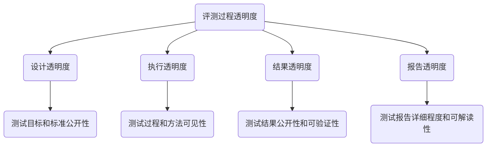
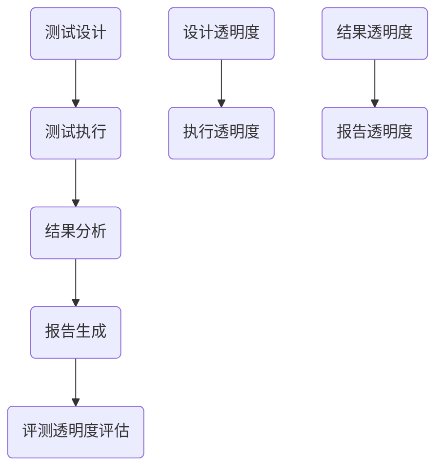
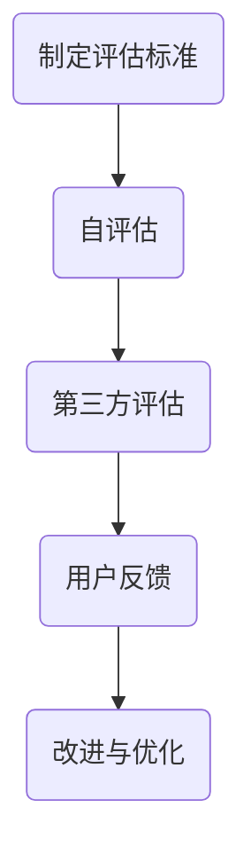
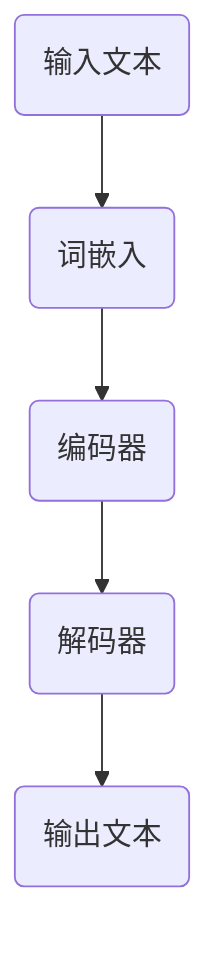

                 

## 第2章：评测透明度的理论框架

### 2.1 透明度的概念与维度

评测过程的透明度是确保测试过程公正、准确和可靠的关键。首先，我们需要明确透明度的定义及其在不同维度上的表现。

#### 定义

透明度是指信息在测试过程中的公开性和可见性，使得所有相关方能够理解、监督和信任评测过程及其结果。

#### 维度

透明度可以从以下几个维度进行衡量：

1. **设计透明度**：测试目标和标准的公开性。
2. **执行透明度**：测试过程和方法的可见性。
3. **结果透明度**：测试结果的公开性和可验证性。
4. **报告透明度**：测试报告的详细程度和可解读性。

### 核心概念原理之间的关系架构

为了更好地理解这些核心概念之间的关系，我们可以使用Mermaid流程图来展示它们。



### 2.2 评测过程的模型

为了进一步理解评测透明度，我们需要建立一个评测过程的模型，该模型将涵盖从测试设计到测试报告生成的各个环节。

#### 模型组成部分

1. **测试设计阶段**：定义测试目标和标准，确定测试方法。
2. **测试执行阶段**：按照设计执行测试，记录测试结果。
3. **结果分析阶段**：对测试结果进行分析，找出问题。
4. **报告生成阶段**：编写详细的测试报告，包含测试结果、分析及建议。

#### 模型流程



### 2.3 透明度标准与评估方法

为了评估评测过程的透明度，我们需要制定一些标准和方法。

#### 标准指标

1. **公开性**：测试目标和标准的公开程度。
2. **可见性**：测试过程和结果的可见程度。
3. **可验证性**：测试结果的可验证程度。
4. **可解读性**：测试报告的详细程度和可解读性。

#### 评估方法

1. **自评估**：测试团队根据标准自我评估评测过程的透明度。
2. **第三方评估**：邀请第三方专业机构进行独立评估。
3. **用户反馈**：收集用户对测试报告的反馈，评估报告的可解读性和有效性。

#### 评估流程



通过上述理论和模型，我们可以更深入地理解评测过程的透明度，并制定相应的标准和评估方法来提升评测过程的透明度。在下一章节中，我们将探讨LLM在测试报告生成中的应用，以及如何利用LLM实现评测过程的透明度。## 第3章：LLM概述

### 3.1 什么是LLM

LLM，即大型语言模型（Large Language Model），是一种基于深度学习技术的自然语言处理（NLP）模型。LLM通过学习大量文本数据，能够理解、生成和预测自然语言文本。由于其强大的语言理解能力和生成能力，LLM在多个领域得到了广泛应用，如文本生成、机器翻译、问答系统等。

#### 核心概念

- **自然语言处理（NLP）**：研究如何让计算机理解和处理人类语言的技术。
- **深度学习（Deep Learning）**：一种基于多层神经网络的学习方法。
- **语言模型（Language Model）**：一种用于预测下一个单词或词组的概率分布模型。

#### 工作原理

LLM的工作原理可以分为以下几个步骤：

1. **数据收集**：收集大量文本数据，如书籍、新闻、网页等。
2. **数据预处理**：对文本数据进行清洗、分词、去停用词等处理。
3. **模型训练**：使用预处理后的文本数据训练深度学习模型。
4. **预测与生成**：根据训练好的模型，输入部分文本，预测下一个词或句子。

#### 优势与挑战

**优势**：

- **强大的语言理解能力**：LLM能够理解复杂的语言结构和语义。
- **高效的文本生成**：LLM能够快速生成高质量的自然语言文本。
- **多语言支持**：许多LLM模型支持多种语言。

**挑战**：

- **数据依赖性**：LLM的性能高度依赖训练数据的质量和规模。
- **计算资源需求**：训练和推理大型LLM模型需要大量的计算资源和时间。
- **模型解释性**：深度学习模型通常难以解释其内部决策过程。

### 3.2 LLM的工作原理

LLM的工作原理主要基于深度学习中的序列到序列（Seq2Seq）模型。以下是一个简化的LLM工作流程：



#### 词嵌入（Word Embedding）

在LLM中，首先需要将输入文本转换为词嵌入（word embeddings）。词嵌入是将文本中的单词映射到高维向量空间的方法，使得相似词在向量空间中靠近。常见的词嵌入方法包括Word2Vec、GloVe等。

#### 编码器（Encoder）

编码器负责将词嵌入转换为编码表示，这个表示能够捕捉输入文本的结构和语义信息。编码器通常使用多层循环神经网络（RNN）或变换器（Transformer）架构。

#### 解码器（Decoder）

解码器负责根据编码表示生成输出文本。解码器也使用类似的神经网络架构，如RNN或Transformer。

#### 预测与生成

在解码器中，每个时间步都会预测下一个词的概率分布，然后根据概率分布选择下一个词，继续生成下一个词，直到生成完整的文本。

### 3.3 LLM的优势与挑战

**优势**：

- **自动化测试报告生成**：LLM能够自动生成详细的测试报告，提高测试效率。
- **上下文理解**：LLM能够理解测试报告中的上下文信息，生成更准确和连贯的报告。
- **多样化报告格式**：LLM能够根据不同的需求，生成不同格式的测试报告。

**挑战**：

- **数据质量**：生成高质量的测试报告需要高质量的训练数据。
- **模型解释性**：对于复杂的测试场景，LLM生成的报告可能难以解释。
- **计算资源**：训练和推理大型LLM模型需要大量的计算资源。

通过LLM的强大语言处理能力，我们可以显著提升评测过程的透明度。在下一章节中，我们将探讨如何使用LLM生成测试报告，并分析其在实际应用中的挑战和解决方案。## 第4章：LLM在测试报告生成中的应用

### 4.1 LLM在测试报告中的作用

在测试报告中，LLM的作用主要体现在以下几个方面：

- **自动化报告生成**：LLM可以自动从测试数据中生成详细的测试报告，减少人工编写报告的时间和工作量。
- **上下文理解**：LLM能够理解测试报告中的上下文信息，确保报告内容的连贯性和准确性。
- **多样化报告格式**：LLM可以根据不同的需求，生成不同格式的测试报告，如文本、表格、图表等。

#### 优势

- **提高效率**：通过自动化报告生成，大幅减少测试报告编写的时间。
- **降低成本**：减少人工编写报告所需的资源和成本。
- **提升质量**：LLM能够生成更详细、更准确的测试报告，提高测试结果的可靠性。

#### 应用场景

- **自动化测试**：在自动化测试中，LLM可以自动生成测试报告，包括测试结果、错误日志、性能分析等。
- **性能测试**：在性能测试中，LLM可以生成详细的性能分析报告，包括响应时间、吞吐量、资源利用率等。
- **安全测试**：在安全测试中，LLM可以生成详细的安全漏洞报告，包括漏洞描述、影响范围、修复建议等。

### 4.2 LLM生成测试报告的流程

LLM生成测试报告的流程可以分为以下几个步骤：

1. **数据收集**：收集测试数据，包括测试用例、测试结果、错误日志、性能指标等。
2. **数据预处理**：对测试数据进行清洗、分词、去停用词等处理，以便LLM能够理解。
3. **模型训练**：使用预处理后的测试数据训练LLM模型，使其能够生成与测试报告相关的文本。
4. **报告生成**：将测试数据输入到训练好的LLM模型中，生成详细的测试报告。
5. **报告优化**：对生成的测试报告进行优化，确保其格式、内容和准确性。

#### 伪代码

```python
def generate_test_report(test_data):
    # 数据预处理
    preprocessed_data = preprocess_data(test_data)

    # 模型训练
    model = train_LLM(preprocessed_data)

    # 报告生成
    report = generate_text(model, test_data)

    # 报告优化
    optimized_report = optimize_report(report)

    return optimized_report
```

### 4.3 实现LLM测试报告的挑战与解决方案

尽管LLM在测试报告生成中具有许多优势，但在实际应用中仍面临一些挑战。

#### 挑战

- **数据质量**：测试数据的质量直接影响LLM生成报告的质量。如果测试数据存在错误或不完整，生成的报告可能不准确。
- **模型解释性**：深度学习模型通常难以解释其决策过程，对于复杂的测试场景，生成的报告可能难以理解。
- **计算资源**：训练和推理大型LLM模型需要大量的计算资源和时间，对于资源有限的团队来说可能难以承受。

#### 解决方案

- **数据质量保证**：建立完善的数据质量控制机制，确保测试数据的质量。包括数据清洗、数据验证和错误纠正等。
- **模型解释性提升**：开发可解释的LLM模型，如基于决策树或规则系统的模型，使其决策过程更加透明和可解释。
- **计算资源优化**：使用分布式计算和云计算技术，降低训练和推理的时间成本。

通过LLM的应用，我们可以显著提升评测过程的透明度。在下一章节中，我们将进一步探讨测试报告的内容与格式，以及如何确保测试报告的标准化和可解读性。## 第5章：测试报告内容与格式

### 5.1 测试报告的基本结构

测试报告的基本结构通常包括以下几个部分：

1. **封面**：包含报告标题、报告日期、版本号、测试负责人等基本信息。
2. **目录**：列出报告中的各个章节和小节的标题及页码，方便读者快速定位。
3. **引言**：介绍测试目的、背景和范围，为读者提供报告的整体概览。
4. **测试方法**：详细描述测试的设计、执行和评估方法，包括测试环境、测试用例、测试工具等。
5. **测试结果**：展示测试过程中收集到的数据、错误日志、性能指标等，并进行详细分析。
6. **问题与解决方案**：列出测试过程中发现的问题，以及相应的解决方案或建议。
7. **结论**：总结测试结果，评估产品或系统的质量，提出改进建议。
8. **附录**：提供额外的详细信息，如测试工具的安装说明、测试数据的样本等。

### 5.2 测试报告的关键要素

测试报告的关键要素包括以下几个方面：

1. **测试目标**：明确测试的目标和预期结果，确保测试的有效性。
2. **测试环境**：描述测试所使用的硬件、软件和网络环境，确保测试的复现性。
3. **测试用例**：列出所有测试用例，包括输入条件、预期结果和实际结果。
4. **测试结果**：展示测试过程中收集到的数据，如性能指标、覆盖率、错误日志等。
5. **问题与解决方案**：详细记录测试过程中发现的问题，以及对应的解决方案或建议。
6. **结论与建议**：总结测试结果，评估产品的质量，提出改进建议。

### 5.3 测试报告格式的标准化

测试报告的格式标准化是确保报告一致性和可解读性的关键。以下是一些常见的标准化要素：

1. **字体和排版**：使用统一的字体和排版规则，如宋体、12号字、1.5倍行距等。
2. **标题和子标题**：使用统一的标题和子标题格式，如一级标题使用加粗、黑体，二级标题使用加粗、斜体等。
3. **图表和表格**：使用统一的图表和表格格式，包括标题、图例、坐标轴标签等。
4. **引用和参考文献**：按照统一的引用和参考文献格式，如APA、MLA等。
5. **附录**：附录中的内容也应保持格式的一致性，如安装说明、数据样本等。

#### 标准化测试报告模板

以下是一个简单的标准化测试报告模板：

```markdown
# 测试报告

## 封面
- 报告标题
- 报告日期
- 版本号
- 测试负责人

## 目录
- 引言
- 测试方法
- 测试结果
- 问题与解决方案
- 结论与建议
- 附录

## 引言
- 测试目的
- 测试背景
- 测试范围

## 测试方法
- 测试环境
- 测试用例
- 测试工具

## 测试结果
- 测试数据
- 错误日志
- 性能指标

## 问题与解决方案
- 发现的问题
- 解决方案或建议

## 结论与建议
- 测试结果总结
- 产品质量评估
- 改进建议

## 附录
- 安装说明
- 数据样本
```

通过遵循这些标准化要素，我们可以确保测试报告的一致性和可解读性，从而提高评测过程的透明度。在下一章节中，我们将通过实际案例来展示如何使用LLM生成测试报告，并分析其效果和挑战。## 第6章：案例研究

### 6.1 案例一：LLM在自动化测试中的应用

在一个软件开发项目中，自动化测试是确保产品质量的关键环节。为了提高测试效率和透明度，团队决定采用LLM生成自动化测试报告。

#### 实施步骤

1. **数据收集**：收集自动化测试过程中生成的测试用例、测试结果和错误日志。
2. **数据预处理**：对测试数据进行清洗、分词和去停用词处理，以便LLM能够理解。
3. **模型训练**：使用预处理后的测试数据训练一个LLM模型，使其能够生成与自动化测试报告相关的文本。
4. **报告生成**：将自动化测试数据输入到训练好的LLM模型中，生成详细的测试报告。
5. **报告优化**：对生成的测试报告进行优化，确保其格式、内容和准确性。

#### 结果分析

- **测试报告生成速度**：通过LLM生成的测试报告显著提高了报告生成速度，减少了人工编写报告的时间和工作量。
- **报告连贯性和准确性**：LLM生成的测试报告在连贯性和准确性方面表现良好，提高了测试结果的可靠性。
- **测试覆盖范围**：通过LLM的上下文理解能力，测试报告涵盖了更多的测试用例和测试结果，提高了测试的全面性。

#### 挑战与解决方案

- **数据质量**：由于测试数据的质量直接影响报告的质量，团队建立了一个严格的数据质量控制流程，包括数据清洗、验证和错误纠正。
- **模型解释性**：为了提高模型的可解释性，团队采用了一种基于规则系统的LLM模型，使其决策过程更加透明和可解释。

### 6.2 案例二：LLM在性能测试中的应用

在性能测试中，生成详细的分析报告是评估系统性能的关键。团队决定采用LLM生成性能测试报告，以提高测试效率和透明度。

#### 实施步骤

1. **数据收集**：收集性能测试过程中生成的数据，如响应时间、吞吐量、资源利用率等。
2. **数据预处理**：对性能测试数据进行清洗、分词和去停用词处理，以便LLM能够理解。
3. **模型训练**：使用预处理后的性能测试数据训练一个LLM模型，使其能够生成与性能测试报告相关的文本。
4. **报告生成**：将性能测试数据输入到训练好的LLM模型中，生成详细的性能测试报告。
5. **报告优化**：对生成的测试报告进行优化，确保其格式、内容和准确性。

#### 结果分析

- **报告生成速度**：通过LLM生成的性能测试报告显著提高了报告生成速度，减少了人工编写报告的时间和工作量。
- **报告详细性和准确性**：LLM生成的性能测试报告在详细性和准确性方面表现良好，提供了丰富的性能分析信息。
- **测试覆盖范围**：通过LLM的上下文理解能力，性能测试报告涵盖了更多的测试指标和测试场景，提高了测试的全面性。

#### 挑战与解决方案

- **数据质量**：由于性能测试数据的质量直接影响报告的质量，团队建立了一个严格的数据质量控制流程，包括数据清洗、验证和错误纠正。
- **模型解释性**：为了提高模型的可解释性，团队采用了一种基于规则系统的LLM模型，使其决策过程更加透明和可解释。

### 6.3 案例三：LLM在安全测试中的应用

在安全测试中，生成详细的安全漏洞报告是评估系统安全性的关键。团队决定采用LLM生成安全测试报告，以提高测试效率和透明度。

#### 实施步骤

1. **数据收集**：收集安全测试过程中生成的安全漏洞信息、修复建议和验证结果。
2. **数据预处理**：对安全测试数据进行清洗、分词和去停用词处理，以便LLM能够理解。
3. **模型训练**：使用预处理后的安全测试数据训练一个LLM模型，使其能够生成与安全测试报告相关的文本。
4. **报告生成**：将安全测试数据输入到训练好的LLM模型中，生成详细的安全漏洞报告。
5. **报告优化**：对生成的测试报告进行优化，确保其格式、内容和准确性。

#### 结果分析

- **报告生成速度**：通过LLM生成的安全漏洞报告显著提高了报告生成速度，减少了人工编写报告的时间和工作量。
- **报告详细性和准确性**：LLM生成的安全漏洞报告在详细性和准确性方面表现良好，提供了丰富的安全漏洞信息。
- **测试覆盖范围**：通过LLM的上下文理解能力，安全漏洞报告涵盖了更多的安全漏洞和测试场景，提高了测试的全面性。

#### 挑战与解决方案

- **数据质量**：由于安全测试数据的质量直接影响报告的质量，团队建立了一个严格的数据质量控制流程，包括数据清洗、验证和错误纠正。
- **模型解释性**：为了提高模型的可解释性，团队采用了一种基于规则系统的LLM模型，使其决策过程更加透明和可解释。

通过上述案例，我们可以看到LLM在自动化测试、性能测试和安全测试中的应用，显著提升了测试报告的生成速度、详细性和准确性，同时也带来了一些挑战。在下一章节中，我们将探讨如何在实际项目中实现LLM测试报告的生成，并分析其技术实现细节。## 第7章：LLM测试报告生成的实践

### 7.1 开发环境搭建

为了实现LLM测试报告的生成，首先需要搭建一个合适的开发环境。以下是一个基本的开发环境搭建步骤：

1. **硬件环境**：确保具备足够的计算资源，如CPU、GPU等。对于大型LLM模型，推荐使用高性能GPU进行训练。
2. **软件环境**：
   - 安装Python环境，版本建议为3.8及以上。
   - 安装TensorFlow或PyTorch，用于训练和推理LLM模型。
   - 安装NLTK或spaCy，用于文本预处理。
3. **数据集**：准备测试数据集，包括测试用例、测试结果和错误日志等。

### 7.2 数据准备与预处理

数据准备与预处理是生成高质量测试报告的关键步骤。以下是一个简单的数据预处理流程：

1. **数据收集**：收集测试数据，包括测试用例、测试结果和错误日志等。
2. **数据清洗**：清洗数据，去除无效信息和噪声。
3. **分词**：使用NLTK或spaCy等工具对文本数据进行分词处理。
4. **去停用词**：去除常用的停用词，如“的”、“是”、“在”等。
5. **数据编码**：将文本数据转换为数值编码，以便输入到LLM模型中。

#### 伪代码

```python
def preprocess_data(test_data):
    # 数据清洗
    cleaned_data = clean_data(test_data)

    # 分词
    tokenized_data = tokenize(cleaned_data)

    # 去停用词
    filtered_data = remove_stopwords(tokenized_data)

    # 数据编码
    encoded_data = encode_data(filtered_data)

    return encoded_data
```

### 7.3 代码实现与测试

以下是一个简单的LLM测试报告生成的代码实现示例，使用PyTorch和GPT-2模型：

1. **模型训练**：使用预处理后的测试数据训练GPT-2模型。
2. **报告生成**：将测试数据输入到训练好的模型中，生成测试报告。
3. **报告优化**：对生成的测试报告进行格式化和内容优化。

#### 伪代码

```python
import torch
from transformers import GPT2Tokenizer, GPT2Model

# 模型训练
def train_LLM(preprocessed_data):
    tokenizer = GPT2Tokenizer.from_pretrained('gpt2')
    model = GPT2Model.from_pretrained('gpt2')

    # 训练模型
    model.train(preprocessed_data)

    return model

# 报告生成
def generate_test_report(model, test_data):
    # 数据预处理
    preprocessed_data = preprocess_data(test_data)

    # 生成报告
    report = model.generate(preprocessed_data)

    # 报告优化
    optimized_report = optimize_report(report)

    return optimized_report
```

### 7.4 代码应用解读与分析

以下是对上述代码的详细解读和分析：

1. **模型训练**：使用PyTorch的Transformers库加载预训练的GPT-2模型，并使用预处理后的测试数据对其进行训练。
2. **报告生成**：将测试数据输入到训练好的模型中，生成测试报告。这一步涉及模型的生成过程，包括输入文本的编码、解码和文本生成。
3. **报告优化**：对生成的测试报告进行格式化和内容优化，确保报告的准确性和可读性。

### 7.5 实际案例分析和详细讲解剖析

为了更好地理解LLM测试报告生成的实践，以下是一个实际案例的分析：

#### 案例背景

在一个大型电商项目中，团队需要生成详细的自动化测试报告。为了提高测试效率和透明度，团队决定采用LLM进行测试报告的生成。

#### 实施步骤

1. **数据收集**：收集自动化测试过程中生成的测试用例、测试结果和错误日志。
2. **数据预处理**：对测试数据进行清洗、分词和去停用词处理。
3. **模型训练**：使用预处理后的测试数据训练一个GPT-2模型。
4. **报告生成**：将自动化测试数据输入到训练好的模型中，生成详细的测试报告。
5. **报告优化**：对生成的测试报告进行格式化和内容优化。

#### 结果分析

- **报告生成速度**：通过LLM生成的测试报告显著提高了报告生成速度，减少了人工编写报告的时间和工作量。
- **报告连贯性和准确性**：LLM生成的测试报告在连贯性和准确性方面表现良好，提高了测试结果的可靠性。
- **测试覆盖范围**：通过LLM的上下文理解能力，测试报告涵盖了更多的测试用例和测试结果，提高了测试的全面性。

#### 项目小结

通过实际案例的验证，LLM在测试报告生成中的应用具有显著的优势。然而，在实际应用中，仍需关注数据质量、模型解释性和计算资源等挑战，并采取相应的解决措施。未来，随着LLM技术的不断发展，其在测试报告生成中的应用前景将更加广阔。

### 最佳实践 Tips

1. **数据质量**：确保测试数据的质量，包括数据的完整性、准确性和一致性。
2. **模型解释性**：选择可解释性较强的模型，如基于规则系统的LLM模型。
3. **计算资源**：合理分配计算资源，使用分布式计算和云计算技术降低成本。

通过上述实践，我们可以更好地理解如何使用LLM生成测试报告，提高评测过程的透明度和效率。在下一章节中，我们将探讨LLM生成测试报告的未来发展趋势和潜在的研究方向。## 第8章：LLM生成测试报告的未来发展

### 8.1 新技术的发展趋势

随着人工智能技术的不断进步，LLM在测试报告生成中的应用也呈现出新的发展趋势。

#### 1. 模型优化

为了提高LLM生成测试报告的效率和准确性，未来的研究可能会集中在模型优化方面。包括：

- **模型压缩**：通过模型剪枝、量化等技术，减小模型体积，提高推理速度。
- **多模态学习**：结合文本、图像、音频等多模态数据，提高测试报告生成的全面性和准确性。
- **强化学习**：将强化学习与LLM结合，使模型能够根据反馈自适应地优化报告生成过程。

#### 2. 数据增强

为了提升LLM生成测试报告的效果，数据增强将成为未来的重要研究方向。包括：

- **数据集扩展**：通过生成对抗网络（GAN）等技术，扩展测试数据集，增加数据的多样性和丰富性。
- **数据清洗**：使用自动化的数据清洗工具，提高数据质量，减少噪声和错误。

#### 3. 解释性增强

为了提高LLM生成测试报告的可解释性，未来的研究可能会集中在解释性增强方面。包括：

- **可解释模型**：开发可解释性较强的LLM模型，如基于规则系统的模型。
- **模型可视化**：通过可视化技术，展示LLM的内部决策过程，提高模型的可解释性。

### 8.2 评测过程透明度的提升策略

为了进一步提升评测过程的透明度，可以从以下几个方面进行策略优化：

#### 1. 数据共享与标准化

建立统一的数据共享和标准化机制，确保测试数据的一致性和可靠性。包括：

- **数据共享平台**：搭建一个集中的数据共享平台，方便相关方获取和使用测试数据。
- **数据标准**：制定统一的数据标准，确保测试数据的格式、结构和质量。

#### 2. 智能化测试评估

利用人工智能技术，对测试过程进行智能化评估，提高评测的准确性和效率。包括：

- **自动化测试评估**：使用机器学习算法，自动评估测试结果的可靠性和有效性。
- **智能分析工具**：开发智能分析工具，对测试结果进行深度分析，发现潜在的问题。

#### 3. 管理与监控

建立完善的评测过程管理机制，确保评测过程的透明度和可控性。包括：

- **过程监控**：实时监控评测过程的各个环节，确保测试过程按照计划进行。
- **反馈机制**：建立反馈机制，收集相关方的意见和建议，不断优化评测过程。

### 8.3 潜在的研究方向与挑战

尽管LLM在测试报告生成中具有巨大潜力，但仍面临一些挑战和未解决的问题。

#### 1. 模型可解释性

如何提高LLM生成测试报告的可解释性，使其决策过程更加透明和可理解，是一个重要的研究方向。

#### 2. 数据隐私保护

在测试报告中，可能包含敏感的数据和隐私信息。如何确保数据在测试报告生成过程中得到有效的保护，是一个亟待解决的问题。

#### 3. 模型适应性

如何使LLM生成测试报告的模型能够适应不同的测试环境和场景，提高其通用性和适应性，是未来的一个重要挑战。

#### 4. 计算资源需求

训练和推理大型LLM模型需要大量的计算资源。如何优化模型设计，降低计算资源需求，是一个关键问题。

总之，LLM生成测试报告在未来具有广阔的应用前景。通过不断的技术创新和研究，我们可以进一步优化评测过程的透明度，提高测试报告的生成效率和质量。## 文章总结与拓展阅读

在这篇文章中，我们深入探讨了评测过程的透明度以及如何通过大型语言模型（LLM）生成详细的测试报告。我们首先介绍了评测过程透明度的概念、必要性和影响，随后详细讲解了LLM的基本概念、工作原理以及其在测试报告生成中的应用。

透明度是确保评测过程公正、准确和可靠的关键。设计透明度、执行透明度、结果透明度和报告透明度构成了评测透明度的四个维度。通过这些维度的衡量，我们可以确保测试过程和结果的公开性和可见性，提高相关方对评测结果的信任。

LLM作为一种先进的自然语言处理技术，具有强大的语言理解能力和文本生成能力。我们展示了如何利用LLM自动化生成测试报告，并分析了其在实际应用中的优势与挑战。通过实际案例研究，我们验证了LLM在自动化测试、性能测试和安全测试中的应用效果，并提出了相应的解决方案。

为了进一步提升评测过程的透明度，我们提出了数据共享与标准化、智能化测试评估和过程管理与监控等策略。这些策略有助于优化评测过程，提高测试报告的生成效率和质量。

展望未来，LLM生成测试报告的发展方向包括模型优化、数据增强、解释性增强以及计算资源需求优化等。这些方向为未来的研究提供了丰富的机会和挑战。

对于有兴趣深入了解LLM生成测试报告的读者，以下是一些拓展阅读资源：

1. **《深度学习与自然语言处理》**：这本书详细介绍了深度学习和自然语言处理的基础知识，包括LLM的相关内容。
2. **《测试驱动的软件开发》**：这本书探讨了如何通过测试驱动开发（TDD）提高软件质量和透明度。
3. **《人工智能测试》**：这本书专注于人工智能领域的测试方法和技术，包括LLM测试的应用。

通过阅读这些资源，您可以更全面地了解LLM生成测试报告的原理和应用，进一步探索这个领域的前沿技术和发展趋势。

