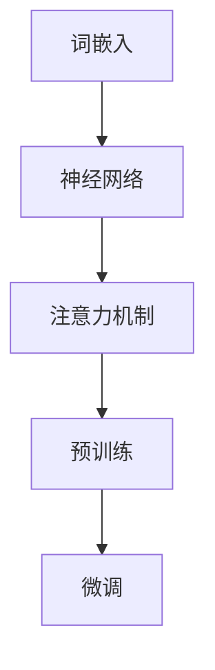

                 


### 引言

在人工智能领域，大型语言模型（LLM, Large Language Model）已经成为自然语言处理（NLP）的核心技术。LLM通过学习大量文本数据，能够生成连贯且合理的文本，其在各种任务中表现出色，包括机器翻译、文本摘要、问答系统等。然而，LLM的性能优化是一个复杂的过程，涉及到模型的训练、评测、优化等多个方面。本文将围绕评测驱动的LLM优化反馈循环，系统性地介绍LLM的基本概念、评测方法、优化技术以及优化反馈循环的构建。

### 背景介绍

首先，我们需要了解LLM的基本概念。LLM是一种基于神经网络的语言模型，其核心是通过学习文本数据来预测单词或词组的概率分布。通常，LLM使用深度神经网络（DNN）或变换器（Transformer）等架构进行训练。在训练过程中，模型会学习输入序列的概率分布，以便能够生成或预测与输入序列相关的输出序列。

#### 核心概念与联系

为了更好地理解LLM，我们引入以下几个核心概念：

1. **词嵌入（Word Embedding）**：将单词映射到高维空间中的向量表示，以便于神经网络进行处理。
2. **注意力机制（Attention Mechanism）**：在模型处理输入序列时，能够关注序列中的关键信息。
3. **预训练与微调（Pre-training and Fine-tuning）**：预训练是指在大量无标签数据上训练模型，而微调则是在特定任务上使用少量有标签数据进行模型调整。

这些概念之间存在紧密的联系，如图1所示：



### 核心算法原理讲解

LLM的核心算法主要包括以下几个步骤：

1. **输入处理**：将文本输入转换为模型可以处理的格式，通常包括分词、词嵌入等。
2. **前向传播**：输入序列通过神经网络进行前向传播，计算每个单词的概率分布。
3. **损失计算**：使用损失函数（如交叉熵）计算预测结果与真实结果之间的差距。
4. **反向传播**：通过反向传播更新模型的权重，以减少损失。
5. **参数优化**：使用优化算法（如Adam、SGD）调整模型参数。

以下是一个简单的伪代码示例，展示了LLM的训练过程：

```python
# 初始化模型参数
model = initialize_model()

# 前向传播
def forward_pass(inputs):
    # 输入处理
    processed_inputs = preprocess(inputs)
    # 前向传播计算
    logits = model(processed_inputs)
    # 损失计算
    loss = compute_loss(logits, targets)
    return loss

# 反向传播
def backward_pass(loss):
    # 反向传播计算梯度
    grads = compute_gradients(loss)
    # 参数优化
    optimize_gradients(grads)

# 训练循环
for epoch in range(num_epochs):
    for batch in dataset:
        # 前向传播
        loss = forward_pass(batch.inputs)
        # 反向传播
        backward_pass(loss)
```

### 数学模型和公式

LLM的训练和优化过程涉及到多个数学模型和公式。以下是一些关键的数学模型：

1. **损失函数**：交叉熵损失（Cross-Entropy Loss），用于衡量预测结果与真实结果之间的差距。

   $$ L = -\sum_{i} y_i \log(p_i) $$

   其中，\( y_i \) 是真实标签，\( p_i \) 是预测概率。

2. **优化算法**：如Adam优化器，用于更新模型参数。

   $$ \theta_{t+1} = \theta_t - \alpha \cdot \frac{1}{\beta_1^t (1-\beta_1^t)} \cdot \nabla L(\theta_t) - \alpha \cdot \beta_2^t \cdot \frac{1}{1-\beta_2^t} \cdot \nabla^2 L(\theta_t) $$

   其中，\( \theta_t \) 是当前参数，\( \alpha \) 是学习率，\( \beta_1 \) 和 \( \beta_2 \) 是优化器的超参数。

### 实践应用

在实际应用中，LLM的评测和优化是关键步骤。以下是一个典型的LLM评测和优化流程：

1. **数据准备**：收集和预处理大量文本数据，包括训练集、验证集和测试集。
2. **模型训练**：使用训练集对模型进行训练，同时使用验证集进行模型调整。
3. **模型评测**：使用测试集对模型进行评测，评估模型性能。
4. **模型优化**：根据评测结果对模型进行优化，调整超参数和模型结构。

以下是一个简单的项目实战案例，展示了如何搭建一个LLM开发环境，并进行代码实现：

#### 开发环境搭建

1. **安装Python环境**：确保Python版本为3.8以上。
2. **安装TensorFlow**：使用pip安装TensorFlow库。

   ```bash
   pip install tensorflow
   ```

3. **数据准备**：下载并预处理文本数据。

#### 代码实现

1. **数据预处理**：包括分词、词嵌入等。

   ```python
   import tensorflow as tf
   from tensorflow.keras.preprocessing.text import Tokenizer
   
   tokenizer = Tokenizer()
   tokenizer.fit_on_texts(texts)
   sequences = tokenizer.texts_to_sequences(texts)
   ```

2. **模型定义**：使用变换器架构定义模型。

   ```python
   from tensorflow.keras.models import Model
   from tensorflow.keras.layers import Embedding, Transformer
   
   input_ids = tf.keras.layers.Input(shape=(sequence_length,), dtype=tf.int32)
   embeddings = Embedding(input_dim=vocab_size, output_dim=embedding_dim)(input_ids)
   transformer = Transformer(num_heads=num_heads, d_model=embedding_dim)(embeddings)
   output = tf.keras.layers.Dense(1, activation='sigmoid')(transformer)
   model = Model(inputs=input_ids, outputs=output)
   ```

3. **模型训练**：使用训练数据进行模型训练。

   ```python
   model.compile(optimizer='adam', loss='binary_crossentropy', metrics=['accuracy'])
   model.fit(train_data, train_labels, validation_data=(val_data, val_labels), epochs=num_epochs)
   ```

4. **模型评测**：使用测试数据进行模型评测。

   ```python
   test_loss, test_accuracy = model.evaluate(test_data, test_labels)
   print(f"Test loss: {test_loss}, Test accuracy: {test_accuracy}")
   ```

### 案例分析

以一个实际项目为例，分析如何进行LLM的评测和优化。项目目标是构建一个文本分类系统，用于对新闻文章进行分类。

#### 项目背景

该项目使用了一个包含超过10万篇新闻文章的语料库，需要对文章进行政治立场分类。项目分为三个阶段：数据准备、模型训练和模型优化。

#### 数据准备

1. **数据收集**：从多个新闻网站收集政治立场相关的文章。
2. **数据清洗**：去除停用词、标点符号等，对文本进行预处理。
3. **数据标注**：对文章进行政治立场标注，分为左翼、中翼、右翼三个类别。

#### 模型训练

1. **模型定义**：使用变换器架构定义文本分类模型。
2. **模型训练**：使用训练集对模型进行训练，同时使用验证集进行模型调整。
3. **模型优化**：通过调整超参数和模型结构，优化模型性能。

#### 模型评测

1. **模型评测**：使用测试集对模型进行评测，评估模型性能。
2. **性能指标**：计算准确率、召回率、F1分数等指标，评估模型效果。

#### 项目小结

通过实际项目，我们了解了LLM的评测和优化过程。项目成功的关键在于数据准备、模型定义和模型优化。在数据准备阶段，需要确保数据的清洁和标注的准确性；在模型训练和优化阶段，需要根据评测结果进行调整，以达到最佳性能。

### 最佳实践 tips

1. **数据准备**：确保数据的质量和多样性，对文本进行充分的预处理。
2. **模型定义**：选择适合任务的模型架构，如变换器在长文本处理上表现优秀。
3. **模型优化**：通过调整超参数和模型结构，优化模型性能。

### 小结

本文系统地介绍了LLM的基本概念、评测方法、优化技术和优化反馈循环。通过实际案例，展示了如何进行LLM的评测和优化。未来，随着人工智能技术的不断发展，LLM的应用场景将越来越广泛，其性能优化也将成为研究的热点。

### 拓展阅读

1. **《深度学习》**：Goodfellow, Ian, et al. "Deep Learning." MIT Press, 2016.
2. **《自然语言处理综合教程》**：Jurafsky, Daniel, and James H. Martin. "Speech and Language Processing." 3rd ed., 2020.
3. **《Transformer：从零实现》**：Chen, Xiaowen. "Transformer: From Scratch." arXiv preprint arXiv:2006.05632, 2020.

作者：AI天才研究院/AI Genius Institute & 禅与计算机程序设计艺术 /Zen And The Art of Computer Programming

