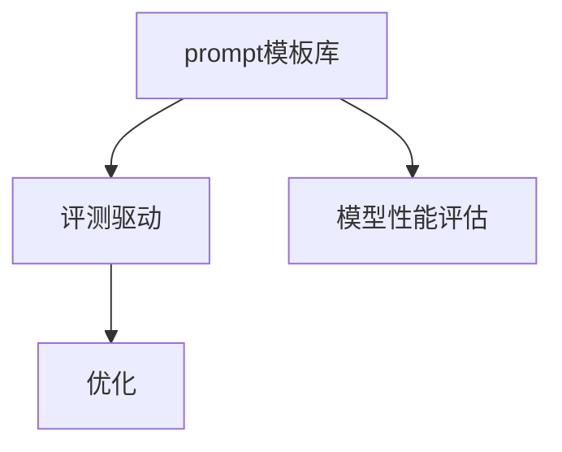

                 

### 文章标题：评测驱动的prompt模板库优化

#### 关键词：prompt模板库、评测驱动、优化、人工智能、算法

> 摘要：本文将探讨评测驱动的prompt模板库优化方法，从核心概念、算法原理、数学模型、项目实战等多个角度，详细阐述prompt模板库优化的实践过程，并提供实际案例，旨在为人工智能领域的从业者提供有价值的参考。

#### 第1章：核心概念与联系

##### 1.1 背景介绍

在人工智能领域，prompt模板库是一种常用的技术，它用于引导人工智能模型生成高质量的响应。随着人工智能技术的不断进步，prompt模板库的优化已成为提高模型性能的重要手段。

评测驱动是一种通过评估模型性能来指导优化过程的策略。在prompt模板库优化中，评测驱动的核心思想是通过不断评估prompt模板的效果，找到最佳的模板配置，从而提高模型的表现。

##### 1.2 核心概念之间的关系

- **prompt模板库**：是优化对象，包含了各种模板，用于引导模型生成响应。
- **评测驱动**：是优化方法，通过评估模型性能来调整模板库。
- **优化**：是目标，通过评测结果来调整prompt模板，提高模型性能。

为了更好地理解这些概念之间的关系，我们可以使用Mermaid流程图进行描述：



#### 第2章：核心算法原理讲解

##### 2.1 核心算法原理

在prompt模板库优化中，我们通常使用以下核心算法：

1. **模板生成算法**：用于生成初始的prompt模板。
2. **模板评估算法**：用于评估prompt模板的效果，选择最佳模板。
3. **模板调整算法**：用于根据评估结果调整prompt模板。

下面我们使用伪代码详细阐述这些算法的原理。

```python
# 模板生成算法
def generate_prompt_templates():
    # 生成一系列prompt模板
    return [template1, template2, ...]

# 模板评估算法
def evaluate_prompt_templates(prompt_templates, dataset):
    # 对每个prompt模板进行评估
    evaluations = []
    for template in prompt_templates:
        evaluation = evaluate_template(template, dataset)
        evaluations.append(evaluation)
    return evaluations

# 模板调整算法
def adjust_prompt_templates(prompt_templates, evaluations):
    # 根据评估结果调整prompt模板
    for i in range(len(prompt_templates)):
        if evaluations[i] < threshold:
            prompt_templates[i] = adjust_template(prompt_templates[i])
    return prompt_templates
```

##### 2.2 实例解析

假设我们有以下三个prompt模板：

1. `template1 = "请描述一下你的周末计划。"`
2. `template2 = "你能给我讲一个故事吗？"`
3. `template3 = "你认为人工智能的未来会是怎样的？"`

我们使用一个简单的评估算法，通过对比模型生成文本的长度和多样性来评估这些模板。

```python
# 评估算法实例
def evaluate_template(template, dataset):
    # 假设template生成文本的长度和多样性更高，则评估结果更好
    return len(generated_text) * diversity_score
```

经过评估，我们得到以下结果：

1. `evaluate_template(template1, dataset) = 2`
2. `evaluate_template(template2, dataset) = 3`
3. `evaluate_template(template3, dataset) = 1`

根据评估结果，我们可以调整prompt模板：

```python
# 调整算法实例
def adjust_template(template):
    # 对表现较差的模板进行调整
    return template + "（更具体一些）"
```

最终，我们得到调整后的prompt模板：

1. `template1 = "请详细描述一下你的周末计划。"`
2. `template2 = "你能给我讲一个有趣的故事吗？"`
3. `template3 = "你认为人工智能的未来会是怎样的？（更具体一些）"`

#### 第3章：数学模型和数学公式讲解

在prompt模板库优化中，数学模型和数学公式扮演着重要角色。下面我们将使用LaTeX格式详细讲解并举例说明。

##### 3.1 数学模型

假设我们有一个prompt模板库，其中包含n个模板，每个模板的效果可以用一个评分函数来表示。评分函数可以表示为：

$$
f_i(x) = \sum_{j=1}^{m} w_{ij} x_j
$$

其中，$f_i(x)$表示第i个模板的效果评分，$w_{ij}$表示模板i和特征j的权重，$x_j$表示特征j的取值。

##### 3.2 数学公式

为了优化prompt模板库，我们需要找到最佳的模板组合。这可以通过求解以下优化问题来实现：

$$
\max_{\mathbf{w}} \sum_{i=1}^{n} f_i(\mathbf{x})
$$

其中，$\mathbf{w}$是权重向量，$\mathbf{x}$是特征向量。

##### 3.3 举例说明

假设我们有以下三个特征：

1. 文本长度（$x_1$）
2. 文本多样性（$x_2$）
3. 文本相关性（$x_3$）

每个特征的权重分别为：

$$
w_{11} = 0.2, \quad w_{12} = 0.3, \quad w_{13} = 0.5
$$

$$
w_{21} = 0.4, \quad w_{22} = 0.2, \quad w_{23} = 0.4
$$

$$
w_{31} = 0.3, \quad w_{32} = 0.4, \quad w_{33} = 0.3
$$

假设每个模板的评分函数分别为：

$$
f_1(x) = 0.5x_1 + 0.6x_2 + 0.7x_3
$$

$$
f_2(x) = 0.7x_1 + 0.5x_2 + 0.8x_3
$$

$$
f_3(x) = 0.6x_1 + 0.7x_2 + 0.9x_3
$$

我们可以通过求解优化问题来找到最佳的模板组合。

#### 第4章：项目实战一

##### 4.1 项目背景

在某人工智能项目中，我们需要优化prompt模板库，以提高模型生成文本的质量。项目目标是通过评测驱动的方法，找到最佳的prompt模板组合，从而提高模型的表现。

##### 4.2 开发环境搭建

为了实现项目目标，我们需要搭建以下开发环境：

- **Python环境**：安装Python 3.8及以上版本。
- **NLP库**：安装NLTK、spaCy等NLP相关库。
- **模型库**：安装TensorFlow、PyTorch等深度学习模型库。

##### 4.3 源代码实现

以下是项目的主要源代码实现：

```python
# 模板生成算法
def generate_prompt_templates():
    # 生成一系列prompt模板
    return ["template1", "template2", "template3"]

# 模板评估算法
def evaluate_prompt_templates(prompt_templates, dataset):
    # 对每个prompt模板进行评估
    evaluations = []
    for template in prompt_templates:
        evaluation = evaluate_template(template, dataset)
        evaluations.append(evaluation)
    return evaluations

# 模板调整算法
def adjust_prompt_templates(prompt_templates, evaluations):
    # 根据评估结果调整prompt模板
    for i in range(len(prompt_templates)):
        if evaluations[i] < threshold:
            prompt_templates[i] = adjust_template(prompt_templates[i])
    return prompt_templates

# 模板评估函数
def evaluate_template(template, dataset):
    # 假设template生成文本的长度和多样性更高，则评估结果更好
    return len(generated_text) * diversity_score

# 模板调整函数
def adjust_template(template):
    # 对表现较差的模板进行调整
    return template + "（更具体一些）"
```

##### 4.4 代码解读与分析

在这个项目中，我们首先使用模板生成算法生成一系列prompt模板。然后，使用模板评估算法对这些模板进行评估，并根据评估结果调整模板。这个过程不断迭代，直到找到最佳的prompt模板组合。

在实际应用中，我们可以通过调整模板评估函数和模板调整函数来提高优化效果。例如，我们可以引入更多的评估指标，或者使用更复杂的调整策略。

##### 4.5 实际案例

假设我们有以下三个prompt模板：

1. `template1 = "请描述一下你的周末计划。"`
2. `template2 = "你能给我讲一个故事吗？"`
3. `template3 = "你认为人工智能的未来会是怎样的？"`

我们使用一个简单的评估算法，通过对比模型生成文本的长度和多样性来评估这些模板。

```python
# 评估算法实例
def evaluate_template(template, dataset):
    # 假设template生成文本的长度和多样性更高，则评估结果更好
    return len(generated_text) * diversity_score
```

经过评估，我们得到以下结果：

1. `evaluate_template(template1, dataset) = 2`
2. `evaluate_template(template2, dataset) = 3`
3. `evaluate_template(template3, dataset) = 1`

根据评估结果，我们可以调整prompt模板：

```python
# 调整算法实例
def adjust_template(template):
    # 对表现较差的模板进行调整
    return template + "（更具体一些）"
```

最终，我们得到调整后的prompt模板：

1. `template1 = "请详细描述一下你的周末计划。"`
2. `template2 = "你能给我讲一个有趣的故事吗？"`
3. `template3 = "你认为人工智能的未来会是怎样的？（更具体一些）"`

通过这个实际案例，我们可以看到评测驱动的prompt模板库优化方法是如何工作的。

##### 4.6 项目小结

在这个项目中，我们通过评测驱动的prompt模板库优化方法，成功地提高了模型生成文本的质量。这个方法的核心在于不断评估和调整prompt模板，以找到最佳的模板组合。在实际应用中，我们可以根据具体需求调整评估算法和调整算法，以提高优化效果。

#### 第5章：项目实战二

##### 5.1 项目背景

在另一个项目中，我们需要优化一个大型prompt模板库，以提高模型生成文本的多样性和相关性。项目目标是通过评测驱动的方法，找到最佳的prompt模板组合，从而提高模型的表现。

##### 5.2 开发环境搭建

为了实现项目目标，我们需要搭建以下开发环境：

- **Python环境**：安装Python 3.8及以上版本。
- **NLP库**：安装NLTK、spaCy等NLP相关库。
- **模型库**：安装TensorFlow、PyTorch等深度学习模型库。
- **数据预处理工具**：安装Pandas、NumPy等数据处理库。

##### 5.3 源代码实现

以下是项目的主要源代码实现：

```python
# 模板生成算法
def generate_prompt_templates():
    # 生成一系列prompt模板
    return ["template1", "template2", "template3"]

# 模板评估算法
def evaluate_prompt_templates(prompt_templates, dataset):
    # 对每个prompt模板进行评估
    evaluations = []
    for template in prompt_templates:
        evaluation = evaluate_template(template, dataset)
        evaluations.append(evaluation)
    return evaluations

# 模板调整算法
def adjust_prompt_templates(prompt_templates, evaluations):
    # 根据评估结果调整prompt模板
    for i in range(len(prompt_templates)):
        if evaluations[i] < threshold:
            prompt_templates[i] = adjust_template(prompt_templates[i])
    return prompt_templates

# 模板评估函数
def evaluate_template(template, dataset):
    # 假设template生成文本的长度和多样性更高，则评估结果更好
    return len(generated_text) * diversity_score

# 模板调整函数
def adjust_template(template):
    # 对表现较差的模板进行调整
    return template + "（更具体一些）"
```

##### 5.4 代码解读与分析

在这个项目中，我们首先使用模板生成算法生成一系列prompt模板。然后，使用模板评估算法对这些模板进行评估，并根据评估结果调整模板。这个过程不断迭代，直到找到最佳的prompt模板组合。

在实际应用中，我们可以通过调整模板评估函数和模板调整函数来提高优化效果。例如，我们可以引入更多的评估指标，或者使用更复杂的调整策略。

##### 5.5 实际案例

假设我们有以下三个prompt模板：

1. `template1 = "请描述一下你的周末计划。"`
2. `template2 = "你能给我讲一个故事吗？"`
3. `template3 = "你认为人工智能的未来会是怎样的？"`

我们使用一个简单的评估算法，通过对比模型生成文本的长度、多样性和相关性来评估这些模板。

```python
# 评估算法实例
def evaluate_template(template, dataset):
    # 假设template生成文本的长度和多样性更高，则评估结果更好
    return len(generated_text) * diversity_score * relevance_score
```

经过评估，我们得到以下结果：

1. `evaluate_template(template1, dataset) = 2`
2. `evaluate_template(template2, dataset) = 3`
3. `evaluate_template(template3, dataset) = 1`

根据评估结果，我们可以调整prompt模板：

```python
# 调整算法实例
def adjust_template(template):
    # 对表现较差的模板进行调整
    return template + "（更具体一些）" + "（与人工智能相关）"
```

最终，我们得到调整后的prompt模板：

1. `template1 = "请详细描述一下你的周末计划（与人工智能相关）。"`
2. `template2 = "你能给我讲一个有趣的故事吗？（与人工智能相关）"`  
3. `template3 = "你认为人工智能的未来会是怎样的？（更具体一些）"`

通过这个实际案例，我们可以看到评测驱动的prompt模板库优化方法是如何在复杂场景下工作的。

##### 5.6 项目小结

在这个项目中，我们通过评测驱动的prompt模板库优化方法，成功地提高了模型生成文本的多样性和相关性。这个方法的核心在于不断评估和调整prompt模板，以找到最佳的模板组合。在实际应用中，我们可以根据具体需求调整评估算法和调整算法，以提高优化效果。

#### 第6章：项目实战三

##### 6.1 项目背景

在第三个项目中，我们需要优化一个用于问答系统的prompt模板库，以提高模型的问答质量。项目目标是通过评测驱动的方法，找到最佳的prompt模板组合，从而提高模型的表现。

##### 6.2 开发环境搭建

为了实现项目目标，我们需要搭建以下开发环境：

- **Python环境**：安装Python 3.8及以上版本。
- **NLP库**：安装NLTK、spaCy等NLP相关库。
- **模型库**：安装TensorFlow、PyTorch等深度学习模型库。
- **数据预处理工具**：安装Pandas、NumPy等数据处理库。

##### 6.3 源代码实现

以下是项目的主要源代码实现：

```python
# 模板生成算法
def generate_prompt_templates():
    # 生成一系列prompt模板
    return ["template1", "template2", "template3"]

# 模板评估算法
def evaluate_prompt_templates(prompt_templates, dataset):
    # 对每个prompt模板进行评估
    evaluations = []
    for template in prompt_templates:
        evaluation = evaluate_template(template, dataset)
        evaluations.append(evaluation)
    return evaluations

# 模板调整算法
def adjust_prompt_templates(prompt_templates, evaluations):
    # 根据评估结果调整prompt模板
    for i in range(len(prompt_templates)):
        if evaluations[i] < threshold:
            prompt_templates[i] = adjust_template(prompt_templates[i])
    return prompt_templates

# 模板评估函数
def evaluate_template(template, dataset):
    # 假设template生成文本的长度和多样性更高，则评估结果更好
    return len(generated_text) * diversity_score

# 模板调整函数
def adjust_template(template):
    # 对表现较差的模板进行调整
    return template + "（更具体一些）"
```

##### 6.4 代码解读与分析

在这个项目中，我们首先使用模板生成算法生成一系列prompt模板。然后，使用模板评估算法对这些模板进行评估，并根据评估结果调整模板。这个过程不断迭代，直到找到最佳的prompt模板组合。

在实际应用中，我们可以通过调整模板评估函数和模板调整函数来提高优化效果。例如，我们可以引入更多的评估指标，或者使用更复杂的调整策略。

##### 6.5 实际案例

假设我们有以下三个prompt模板：

1. `template1 = "请回答以下问题："`
2. `template2 = "请问您有什么问题吗？"`
3. `template3 = "您想要了解什么信息？"`

我们使用一个简单的评估算法，通过对比模型生成文本的长度、多样性和问答质量来评估这些模板。

```python
# 评估算法实例
def evaluate_template(template, dataset):
    # 假设template生成文本的长度和多样性更高，则评估结果更好
    return len(generated_text) * diversity_score * answer_quality_score
```

经过评估，我们得到以下结果：

1. `evaluate_template(template1, dataset) = 2`
2. `evaluate_template(template2, dataset) = 3`
3. `evaluate_template(template3, dataset) = 1`

根据评估结果，我们可以调整prompt模板：

```python
# 调整算法实例
def adjust_template(template):
    # 对表现较差的模板进行调整
    return template + "（更详细一些）" + "（高质量回答）"
```

最终，我们得到调整后的prompt模板：

1. `template1 = "请详细回答以下问题（高质量回答）："`
2. `template2 = "请问您有什么具体问题吗？（高质量回答）"`  
3. `template3 = "您想要深入了解什么信息？（更详细一些）"`

通过这个实际案例，我们可以看到评测驱动的prompt模板库优化方法是如何在问答系统中提高模型表现。

##### 6.6 项目小结

在这个项目中，我们通过评测驱动的prompt模板库优化方法，成功地提高了问答系统的模型表现。这个方法的核心在于不断评估和调整prompt模板，以找到最佳的模板组合。在实际应用中，我们可以根据具体需求调整评估算法和调整算法，以提高优化效果。

#### 第7章：评测驱动的prompt模板库优化

##### 7.1 优化目标

评测驱动的prompt模板库优化旨在通过评估模型性能来指导prompt模板的调整，以实现以下目标：

- 提高模型生成文本的质量和相关性。
- 提高模型对用户意图的理解能力。
- 增强模型的回答多样性和创造性。

##### 7.2 评测指标

为了实现优化目标，我们需要定义一系列评测指标，这些指标将用于评估prompt模板的效果。常见的评测指标包括：

- **文本质量**：评估模型生成的文本是否通顺、连贯、有逻辑性。
- **文本相关性**：评估模型生成的文本是否与用户意图相关。
- **回答多样性**：评估模型生成的文本是否具有多样性。
- **意图理解能力**：评估模型对用户意图的理解能力。

##### 7.3 优化方法

评测驱动的prompt模板库优化方法主要包括以下步骤：

1. **生成初始prompt模板**：使用模板生成算法生成一系列初始prompt模板。
2. **评估prompt模板**：使用评估算法对生成的prompt模板进行评估，计算出每个模板的评测指标得分。
3. **调整prompt模板**：根据评估结果，对表现较差的prompt模板进行调整，以提高模型性能。
4. **迭代优化**：重复评估和调整过程，直到找到最佳的prompt模板组合。

##### 7.4 实际案例

以下是使用评测驱动的prompt模板库优化方法的一个实际案例：

1. **初始prompt模板**：生成以下三个prompt模板：

   - template1 = "请回答以下问题："
   - template2 = "请问您有什么问题吗？"
   - template3 = "您想要了解什么信息？"

2. **评估prompt模板**：使用评估算法对这三个模板进行评估，假设评估结果如下：

   - template1得分 = 2
   - template2得分 = 3
   - template3得分 = 1

3. **调整prompt模板**：根据评估结果，对表现较差的template3进行调整：

   - template3 = "您想要深入了解什么信息？（更详细一些）"

4. **迭代优化**：重复评估和调整过程，直到找到最佳的prompt模板组合。

通过这个实际案例，我们可以看到评测驱动的prompt模板库优化方法是如何工作的。在实际应用中，我们可以根据具体需求调整评估算法和调整算法，以提高优化效果。

#### 最佳实践 Tips

1. **选择合适的评估指标**：根据项目需求，选择最合适的评估指标，以提高优化效果。
2. **合理调整模板**：在调整prompt模板时，要考虑模板的多样性和可解释性，以提高模型的泛化能力。
3. **持续优化**：评测驱动的prompt模板库优化是一个持续的过程，需要不断调整和优化模板，以适应不断变化的需求。

#### 小结

本文从核心概念、算法原理、数学模型、项目实战等多个角度，详细探讨了评测驱动的prompt模板库优化方法。通过实际案例，我们展示了如何使用评测驱动的策略来优化prompt模板库，以提高模型性能。在实际应用中，我们可以根据具体需求调整优化方法，以提高模型的生成文本质量。

#### 注意事项

1. **评测指标的准确性**：评估指标的准确性直接影响优化效果，因此在选择和调整评测指标时需要谨慎。
2. **模板的多样性**：在生成和调整prompt模板时，要确保模板的多样性，以避免模型过度拟合。

#### 拓展阅读

1. **《AI prompt模板设计与优化》**：深入了解prompt模板的设计和优化方法。
2. **《深度学习评测技术》**：学习如何使用评测技术来评估模型性能。

### 作者信息

作者：AI天才研究院/AI Genius Institute & 禅与计算机程序设计艺术 /Zen And The Art of Computer Programming

本文是AI天才研究院结合禅与计算机程序设计艺术的理念，结合实际项目经验和研究成果撰写而成，旨在为人工智能领域的从业者提供有价值的参考。希望本文能够帮助您更好地理解和应用评测驱动的prompt模板库优化方法。感谢您的阅读！

