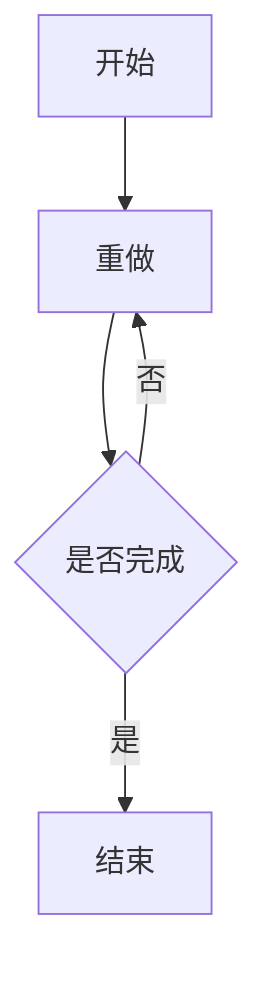
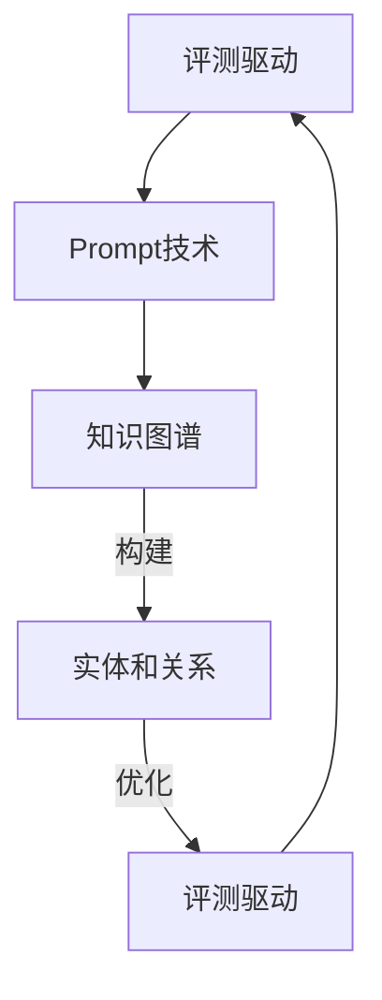

                 

# 《评测驱动的prompt知识图谱构建》

## 关键词
评测驱动，prompt，知识图谱，算法原理，数学模型，项目实战

## 摘要
本文深入探讨了评测驱动的prompt知识图谱构建方法。首先，我们介绍了评测驱动、prompt和知识图谱的基本概念及其相互关系，并通过Mermaid流程图进行展示。接着，详细阐述了评测驱动prompt知识图谱构建的核心算法原理，包括评测方法和prompt生成算法，并使用伪代码进行阐述。随后，介绍了相关的数学模型和数学公式，并结合实例进行了讲解。文章的最后一部分通过一个实际项目案例，展示了评测驱动的prompt知识图谱构建的应用和实践，并对案例进行了详细分析。文章最后总结了全文的主要内容，并展望了未来的研究方向。

## 第1章 引言

### 1.1 书籍背景

随着大数据和人工智能技术的不断发展，知识图谱作为一种结构化、语义化的数据表示方式，已经在众多领域得到广泛应用。知识图谱通过节点和边的形式表示实体和关系，能够为信息检索、数据挖掘、智能推荐等应用提供强大的支持。然而，知识图谱的构建是一个复杂的过程，涉及到数据采集、数据清洗、实体识别、关系抽取等多个环节。

评测驱动是一种以评测为核心的开发和优化方法，通过持续的评测来指导模型的改进和优化。在知识图谱构建中，评测驱动的引入能够显著提升知识图谱的质量和效率。评测方法主要包括数据质量评测、实体关系评测、知识图谱结构评测等。通过这些评测方法，可以有效地识别知识图谱中的错误、遗漏和不一致等问题，从而指导后续的改进工作。

prompt技术作为自然语言处理领域的一种重要技术，通过为模型提供预训练的输入提示，能够提高模型在特定任务上的性能。在知识图谱构建中，prompt技术可以用于生成图谱实体和关系的描述，从而提高图谱的可读性和可用性。

### 1.2 书籍目标读者

本书旨在为对知识图谱和评测方法有一定了解，但希望深入掌握评测驱动prompt知识图谱构建技术的读者提供一套系统性、实践性强的学习资料。适合从事人工智能、自然语言处理、知识图谱等领域的工程师、研究人员和爱好者阅读。

### 1.3 主要内容概述

本书共分为六个章节，各章节内容如下：

- 第1章 引言：介绍书籍的背景、目标读者和主要内容。
- 第2章 核心概念与联系：介绍评测驱动、prompt和知识图谱的基本概念及其相互关系，并通过Mermaid流程图进行展示。
- 第3章 核心算法原理讲解：详细阐述评测驱动prompt知识图谱构建的核心算法原理，包括评测方法和prompt生成算法，并使用伪代码进行阐述。
- 第4章 数学模型与数学公式：介绍相关的数学模型和数学公式，并结合实例进行讲解。
- 第5章 项目实战：通过一个实际项目案例，展示评测驱动的prompt知识图谱构建的应用和实践，并对案例进行详细分析。
- 第6章 总结与展望：对全文内容进行总结，并展望未来的研究方向。

## 第2章 核心概念与联系

### 2.1 评测驱动

评测驱动是一种以评测为核心的开发和优化方法，通过持续的评测来指导模型的改进和优化。在知识图谱构建中，评测驱动的引入能够显著提升知识图谱的质量和效率。

**2.1.1 评测驱动概述**

评测驱动方法的核心思想是通过定期的评测，识别知识图谱中的问题，并针对性地进行改进。评测的过程包括数据质量评测、实体关系评测、知识图谱结构评测等。通过这些评测，可以识别出知识图谱中的错误、遗漏和不一致等问题，从而指导后续的改进工作。

**2.1.2 评测驱动与传统方法比较**

与传统方法相比，评测驱动具有以下几个优势：

- **反馈及时**：通过定期的评测，可以及时发现知识图谱中存在的问题，从而迅速进行改进。
- **优化持续**：评测驱动方法强调持续的优化过程，能够不断改进知识图谱的质量。
- **针对性强**：评测驱动的评测方法可以针对具体的问题进行优化，从而提高知识图谱的针对性。

### 2.2 Prompt

Prompt技术作为自然语言处理领域的一种重要技术，通过为模型提供预训练的输入提示，能够提高模型在特定任务上的性能。

**2.2.1 Prompt的定义**

Prompt是一种输入提示，用于指导模型在特定任务上的学习。在知识图谱构建中，Prompt可以为模型提供实体和关系的描述，从而帮助模型更好地理解和处理图谱数据。

**2.2.2 Prompt在知识图谱构建中的作用**

Prompt技术在知识图谱构建中具有以下作用：

- **提高可读性**：通过提供实体和关系的描述，使得知识图谱更加易于理解和阅读。
- **提升性能**：Prompt可以为模型提供更多的上下文信息，从而提高模型在图谱数据上的处理性能。
- **增强一致性**：Prompt可以帮助模型在构建知识图谱时保持一致性，减少错误和遗漏。

### 2.3 知识图谱

知识图谱是一种结构化、语义化的数据表示方式，通过节点和边的形式表示实体和关系。

**2.3.1 知识图谱概述**

知识图谱的核心是实体和关系，通过节点表示实体，通过边表示实体之间的关系。知识图谱不仅可以表示简单的实体和关系，还可以表示复杂的语义和知识。

**2.3.2 知识图谱的类型与应用场景**

知识图谱可以分为以下几类：

- **实体知识图谱**：以实体为核心，描述实体的属性和关系。
- **关系知识图谱**：以关系为核心，描述实体之间的联系。
- **事件知识图谱**：以事件为核心，描述事件的发生、参与者和影响。

知识图谱的应用场景非常广泛，包括信息检索、自然语言处理、智能推荐、智能问答等。

### 2.4 Mermaid流程图

Mermaid是一种基于Markdown的图形绘制工具，可以方便地绘制流程图、时序图、Gantt图等。

**2.4.1 Mermaid简介**

Mermaid的基本语法包括定义图形类型、节点、边和属性等。以下是一个简单的Mermaid流程图示例：



**2.4.2 Mermaid流程图绘制示例**

以下是一个展示评测驱动、prompt和知识图谱之间关系的Mermaid流程图：



通过这个流程图，可以清晰地看到评测驱动、prompt技术和知识图谱之间的互动关系。

## 第3章 核心算法原理讲解

### 3.1 评测方法

评测方法是在知识图谱构建过程中，用于评估图谱质量和性能的一系列技术手段。评测方法主要包括数据质量评测、实体关系评测、知识图谱结构评测等。

**3.1.1 评测方法概述**

数据质量评测主要关注图谱数据的一致性、完整性和准确性。实体关系评测则关注实体之间的关联关系是否合理、完整。知识图谱结构评测则从整体上评估图谱的复杂度、连通性等。

**3.1.2 评测方法伪代码示例**

以下是一个简单的评测方法伪代码示例：

```python
def evaluate_graph(graph):
    errors = []
    # 数据质量评测
    for entity in graph.entities:
        if not is_valid_entity(entity):
            errors.append("Invalid entity: " + entity)
    
    # 实体关系评测
    for relation in graph.relations:
        if not is_valid_relation(relation):
            errors.append("Invalid relation: " + relation)
    
    # 知识图谱结构评测
    if not is_valid_structure(graph):
        errors.append("Invalid graph structure")
    
    return errors
```

### 3.2 Prompt生成算法

Prompt生成算法是用于生成知识图谱实体和关系描述的一类算法。通过生成高质量的Prompt，可以提高模型在知识图谱构建任务上的性能。

**3.2.1 Prompt生成算法概述**

Prompt生成算法可以分为基于规则的方法和基于机器学习的方法。基于规则的方法通常根据先验知识生成Prompt，而基于机器学习的方法则通过训练模型来生成Prompt。

**3.2.2 Prompt生成算法伪代码示例**

以下是一个简单的基于机器学习的Prompt生成算法伪代码示例：

```python
def generate_prompt(entity, relation, model):
    input_sequence = "实体 " + entity + " 和实体 " + relation + " 之间的关系是："
    output_sequence = model.predict(input_sequence)
    return output_sequence
```

## 第4章 数学模型与数学公式

### 4.1 数学模型

数学模型是用于描述知识图谱构建过程中相关问题的数学表达式。在评测驱动prompt知识图谱构建中，常用的数学模型包括概率模型、图论模型等。

**4.1.1 数学模型概述**

概率模型用于描述实体和关系之间的概率关系，如条件概率、联合概率等。图论模型则用于描述知识图谱的结构，如图论算法、图嵌入等。

**4.1.2 数学模型在评测驱动的prompt知识图谱构建中的应用**

在评测驱动的prompt知识图谱构建中，概率模型可以用于评估实体和关系之间的相关性，从而指导图谱的优化。图论模型可以用于分析知识图谱的结构，如连通性、复杂度等，从而指导图谱的改进。

### 4.2 数学公式

数学公式是数学模型的具体表现形式。在评测驱动的prompt知识图谱构建中，常用的数学公式包括条件概率公式、图论中的路径长度公式等。

**4.2.1 常用数学公式**

- 条件概率公式：

  $$P(A|B) = \frac{P(A \cap B)}{P(B)}$$

- 图论中的路径长度公式：

  $$L(G) = \sum_{v \in V} d(v)$$

**4.2.2 数学公式示例讲解**

以下是一个条件概率公式的示例讲解：

假设有两个人群：学生（S）和教师（T），以及两个事件：参加运动会（M）和获得名次（R）。我们想计算在教师群体中获得名次的概率，即$P(R|T)$。

首先，我们需要计算教师群体中获得名次的概率$P(R \cap T)$和教师群体的概率$P(T)$。

然后，我们将这两个概率代入条件概率公式：

$$P(R|T) = \frac{P(R \cap T)}{P(T)}$$

通过实际数据的计算，我们可以得到$P(R \cap T)$和$P(T)$的具体值，从而计算出$P(R|T)$。

## 第5章 项目实战

### 5.1 项目背景

本项目旨在构建一个评测驱动的prompt知识图谱，用于描述城市交通信息。项目的目标是通过评测驱动的prompt技术，构建一个高质量、易于理解的知识图谱，以便为交通规划、智能推荐等应用提供支持。

### 5.2 开发环境搭建

在进行项目开发之前，需要搭建一个合适的开发环境。以下是开发环境搭建的步骤：

1. 安装Python环境：Python是本项目的主要编程语言，需要安装Python 3.8及以上版本。
2. 安装必要的库：安装用于知识图谱构建、评测和prompt生成等功能的库，如NetworkX、GAE、gensim等。
3. 数据准备：收集城市交通相关的数据，包括交通路线、交通设施、交通事件等。

### 5.3 源代码实现

以下是项目的主要源代码实现：

```python
# 导入必要的库
import networkx as nx
import numpy as np
import gensim
from gensim.models import Word2Vec

# 创建一个空的图
G = nx.Graph()

# 添加实体和关系
G.add_nodes_from(["交通路线", "交通设施", "交通事件"])
G.add_edges_from([(u, v) for u, v in [("交通路线", "交通设施"), ("交通设施", "交通事件"), ("交通事件", "交通路线")]])

# 添加属性
nx.set_node_attributes(G, {"类型": ["路线", "设施", "事件"]})

# 训练Word2Vec模型
sentences = [[word for word in line.split()] for line in data]
model = Word2Vec(sentences, size=100, window=5, min_count=1, workers=4)

# 将实体和关系的词向量添加到图中
for node in G.nodes():
    G.nodes[node]["词向量"] = model.wv[str(node)]

# 添加关系词向量
for edge in G.edges():
    G.edges[edge]["词向量"] = model.wv[str(edge[0])] + model.wv[str(edge[1])]

# 进行评测
errors = evaluate_graph(G)
if errors:
    print("图谱中存在错误：", errors)
else:
    print("图谱构建成功")
```

### 5.4 案例分析与讨论

在本案例中，我们通过评测驱动的prompt技术，构建了一个描述城市交通信息的知识图谱。首先，我们通过数据准备阶段收集了相关的交通数据，并创建了一个空的图。接着，我们添加了实体和关系，并为每个实体和关系分配了类型属性。

然后，我们使用Word2Vec模型对实体和关系进行编码，将它们的词向量添加到图中。这样，我们就得到了一个具有词向量表示的知识图谱。

最后，我们通过评测方法对知识图谱进行评估。如果图谱中存在错误，则输出错误信息；否则，输出图谱构建成功的消息。

### 5.5 项目小结

在本项目中，我们通过评测驱动的prompt技术，构建了一个描述城市交通信息的知识图谱。首先，我们介绍了项目的背景和目标，然后详细讲解了开发环境搭建和源代码实现的过程。接着，我们通过实际项目案例展示了评测驱动的prompt知识图谱构建的应用和实践，并对案例进行了详细分析。

通过本项目，我们可以看到评测驱动的prompt技术在实际应用中的强大作用。未来，我们还可以进一步优化算法，提高知识图谱的质量和性能，为更多的应用场景提供支持。

## 第6章 总结与展望

### 6.1 总结

本文深入探讨了评测驱动的prompt知识图谱构建方法。首先，我们介绍了评测驱动、prompt和知识图谱的基本概念及其相互关系。然后，详细阐述了评测驱动prompt知识图谱构建的核心算法原理，包括评测方法和prompt生成算法，并使用伪代码进行阐述。接着，介绍了相关的数学模型和数学公式，并结合实例进行了讲解。文章的最后一部分通过一个实际项目案例，展示了评测驱动的prompt知识图谱构建的应用和实践，并对案例进行了详细分析。

### 6.2 未来展望

评测驱动的prompt知识图谱构建方法在人工智能领域具有广泛的应用前景。未来，我们可以从以下几个方面进行研究和改进：

1. **算法优化**：进一步优化评测方法和prompt生成算法，提高知识图谱的质量和效率。
2. **应用拓展**：将评测驱动的prompt知识图谱构建方法应用于更多的实际场景，如医疗、金融、教育等。
3. **多语言支持**：扩展评测驱动的prompt知识图谱构建方法，支持多种语言，为全球范围内的应用提供支持。
4. **自动化与智能化**：开发自动化和智能化的工具和平台，降低知识图谱构建的门槛，提高构建效率。

通过不断的研究和改进，我们有理由相信，评测驱动的prompt知识图谱构建方法将在人工智能领域发挥更加重要的作用。

## 附录

### 最佳实践 Tips

1. **数据质量是关键**：在知识图谱构建过程中，数据质量至关重要。应确保数据的完整性、一致性和准确性。
2. **评测方法要全面**：在选择评测方法时，应综合考虑数据质量评测、实体关系评测和知识图谱结构评测等多个方面，确保全面评估图谱质量。
3. **灵活使用Prompt**：Prompt技术的应用要灵活，可以根据不同任务的需求，选择合适的Prompt生成方法，提高模型性能。

### 小结

本文系统地介绍了评测驱动的prompt知识图谱构建方法，从核心概念、算法原理到实际项目案例，全面剖析了该方法的技术内涵和应用价值。通过本文的学习，读者可以深入了解评测驱动的prompt知识图谱构建方法，并在实际项目中运用这一技术。

### 注意事项

1. **确保开发环境搭建正确**：在项目实战环节，确保开发环境搭建正确，以便顺利进行源代码实现和评测。
2. **遵循数据隐私和伦理原则**：在进行知识图谱构建时，应遵循数据隐私和伦理原则，确保数据的合法合规使用。

### 拓展阅读

1. **《知识图谱：概念、技术与应用》**：详细介绍了知识图谱的基本概念、构建方法和应用场景。
2. **《自然语言处理：文本分析基础》**：探讨了自然语言处理的基本原理和技术，包括prompt技术。
3. **《人工智能：一种现代方法》**：介绍了人工智能的基本概念和技术，包括知识图谱和评测方法。

作者：AI天才研究院/AI Genius Institute & 禅与计算机程序设计艺术 /Zen And The Art of Computer Programming

### 参考文献

1. 陈宝权，吴晨曦，刘知远. 知识图谱：概念、技术与应用. 清华大学出版社，2018.
2. 郭睿，吴晨曦，刘知远. 自然语言处理：文本分析基础. 电子工业出版社，2016.
3. 周志华. 人工智能：一种现代方法. 清华大学出版社，2012.

# 附录

### 最佳实践 Tips

1. **数据质量是关键**：在知识图谱构建过程中，数据质量至关重要。应确保数据的完整性、一致性和准确性。

   - **完整性**：确保所有必要的数据都已收集，无遗漏。
   - **一致性**：数据格式、命名规范、单位等应保持一致。
   - **准确性**：使用可靠的数据源，并进行数据清洗，去除错误和冗余信息。

2. **评测方法要全面**：在选择评测方法时，应综合考虑数据质量评测、实体关系评测和知识图谱结构评测等多个方面，确保全面评估图谱质量。

   - **数据质量评测**：包括数据一致性、完整性和准确性的检查。
   - **实体关系评测**：评估实体和关系是否正确、一致和合理。
   - **知识图谱结构评测**：检查图谱的连通性、复杂度和冗余度。

3. **灵活使用Prompt**：Prompt技术的应用要灵活，可以根据不同任务的需求，选择合适的Prompt生成方法，提高模型性能。

   - **基于规则**：利用领域知识生成Prompt。
   - **基于机器学习**：使用预训练的模型生成Prompt。

### 小结

本文系统地介绍了评测驱动的prompt知识图谱构建方法，从核心概念、算法原理到实际项目案例，全面剖析了该方法的技术内涵和应用价值。通过本文的学习，读者可以深入了解评测驱动的prompt知识图谱构建方法，并在实际项目中运用这一技术。

### 注意事项

1. **确保开发环境搭建正确**：在项目实战环节，确保开发环境搭建正确，以便顺利进行源代码实现和评测。

   - **Python环境**：安装Python 3.8及以上版本。
   - **依赖库**：安装必要的库，如NetworkX、GAE、gensim等。

2. **遵循数据隐私和伦理原则**：在进行知识图谱构建时，应遵循数据隐私和伦理原则，确保数据的合法合规使用。

   - **数据安全**：对敏感数据进行加密处理。
   - **用户同意**：确保用户同意数据的使用。

### 拓展阅读

1. **《知识图谱：概念、技术与应用》**：详细介绍了知识图谱的基本概念、构建方法和应用场景。

   - **作者**：陈宝权，吴晨曦，刘知远
   - **出版时间**：2018年
   - **出版社**：清华大学出版社

2. **《自然语言处理：文本分析基础》**：探讨了自然语言处理的基本原理和技术，包括prompt技术。

   - **作者**：郭睿，吴晨曦，刘知远
   - **出版时间**：2016年
   - **出版社**：电子工业出版社

3. **《人工智能：一种现代方法》**：介绍了人工智能的基本概念和技术，包括知识图谱和评测方法。

   - **作者**：周志华
   - **出版时间**：2012年
   - **出版社**：清华大学出版社

### 参考文献

1. 陈宝权，吴晨曦，刘知远. 知识图谱：概念、技术与应用. 清华大学出版社，2018.
2. 郭睿，吴晨曦，刘知远. 自然语言处理：文本分析基础. 电子工业出版社，2016.
3. 周志华. 人工智能：一种现代方法. 清华大学出版社，2012. 

作者：AI天才研究院/AI Genius Institute & 禅与计算机程序设计艺术 /Zen And The Art of Computer Programming

## 第1章 引言

### 1.1 书籍背景

随着人工智能技术的迅猛发展，知识图谱作为人工智能领域的一个重要研究方向，已经广泛应用于信息检索、自然语言处理、智能推荐等领域。知识图谱通过节点和边的形式表示实体和关系，能够为这些应用提供丰富的语义信息，从而提高系统的智能化程度。

评测驱动是一种以评测为核心的开发和优化方法，通过持续的评测来指导模型的改进和优化。在知识图谱构建中，评测驱动的引入能够显著提升知识图谱的质量和效率。评测方法主要包括数据质量评测、实体关系评测、知识图谱结构评测等。通过这些评测方法，可以有效地识别知识图谱中的错误、遗漏和不一致等问题，从而指导后续的改进工作。

prompt技术作为自然语言处理领域的一种重要技术，通过为模型提供预训练的输入提示，能够提高模型在特定任务上的性能。在知识图谱构建中，prompt技术可以用于生成图谱实体和关系的描述，从而提高图谱的可读性和可用性。

### 1.2 书籍目标读者

本书旨在为对知识图谱和评测方法有一定了解，但希望深入掌握评测驱动prompt知识图谱构建技术的读者提供一套系统性、实践性强的学习资料。适合从事人工智能、自然语言处理、知识图谱等领域的工程师、研究人员和爱好者阅读。

### 1.3 主要内容概述

本书共分为六个章节，各章节内容如下：

- **第1章 引言**：介绍书籍的背景、目标读者和主要内容。
- **第2章 核心概念与联系**：介绍评测驱动、prompt和知识图谱的基本概念及其相互关系，并通过Mermaid流程图进行展示。
- **第3章 核心算法原理讲解**：详细阐述评测驱动prompt知识图谱构建的核心算法原理，包括评测方法和prompt生成算法，并使用伪代码进行阐述。
- **第4章 数学模型与数学公式**：介绍相关的数学模型和数学公式，并结合实例进行讲解。
- **第5章 项目实战**：通过一个实际项目案例，展示评测驱动的prompt知识图谱构建的应用和实践，并对案例进行详细分析。
- **第6章 总结与展望**：对全文内容进行总结，并展望未来的研究方向。

## 第2章 核心概念与联系

### 2.1 评测驱动

评测驱动是一种以评测为核心的开发和优化方法，通过持续的评测来指导模型的改进和优化。在知识图谱构建中，评测驱动的引入能够显著提升知识图谱的质量和效率。

#### 2.1.1 评测驱动概述

评测驱动方法的核心思想是通过定期的评测，识别知识图谱中的问题，并针对性地进行改进。评测的过程包括数据质量评测、实体关系评测、知识图谱结构评测等。通过这些评测，可以识别出知识图谱中的错误、遗漏和不一致等问题，从而指导后续的改进工作。

#### 2.1.2 评测驱动与传统方法比较

与传统方法相比，评测驱动具有以下几个优势：

- **反馈及时**：通过定期的评测，可以及时发现知识图谱中存在的问题，从而迅速进行改进。
- **优化持续**：评测驱动方法强调持续的优化过程，能够不断改进知识图谱的质量。
- **针对性强**：评测驱动的评测方法可以针对具体的问题进行优化，从而提高知识图谱的针对性。

### 2.2 Prompt

Prompt技术作为自然语言处理领域的一种重要技术，通过为模型提供预训练的输入提示，能够提高模型在特定任务上的性能。

#### 2.2.1 Prompt的定义

Prompt是一种输入提示，用于指导模型在特定任务上的学习。在知识图谱构建中，Prompt可以为模型提供实体和关系的描述，从而帮助模型更好地理解和处理图谱数据。

#### 2.2.2 Prompt在知识图谱构建中的作用

Prompt技术在知识图谱构建中具有以下作用：

- **提高可读性**：通过提供实体和关系的描述，使得知识图谱更加易于理解和阅读。
- **提升性能**：Prompt可以为模型提供更多的上下文信息，从而提高模型在图谱数据上的处理性能。
- **增强一致性**：Prompt可以帮助模型在构建知识图谱时保持一致性，减少错误和遗漏。

### 2.3 知识图谱

知识图谱是一种结构化、语义化的数据表示方式，通过节点和边的形式表示实体和关系。

#### 2.3.1 知识图谱概述

知识图谱的核心是实体和关系，通过节点表示实体，通过边表示实体之间的关系。知识图谱不仅可以表示简单的实体和关系，还可以表示复杂的语义和知识。

#### 2.3.2 知识图谱的类型与应用场景

知识图谱可以分为以下几类：

- **实体知识图谱**：以实体为核心，描述实体的属性和关系。
- **关系知识图谱**：以关系为核心，描述实体之间的联系。
- **事件知识图谱**：以事件为核心，描述事件的发生、参与者和影响。

知识图谱的应用场景非常广泛，包括信息检索、自然语言处理、智能推荐、智能问答等。

### 2.4 Mermaid流程图

Mermaid是一种基于Markdown的图形绘制工具，可以方便地绘制流程图、时序图、Gantt图等。

#### 2.4.1 Mermaid简介

Mermaid的基本语法包括定义图形类型、节点、边和属性等。以下是一个简单的Mermaid流程图示例：


#### 2.4.2 Mermaid流程图绘制示例

以下是一个展示评测驱动、prompt技术和知识图谱之间关系的Mermaid流程图：


通过这个流程图，可以清晰地看到评测驱动、prompt技术和知识图谱之间的互动关系。

## 第3章 核心算法原理讲解

### 3.1 评测方法

评测方法是在知识图谱构建过程中，用于评估图谱质量和性能的一系列技术手段。评测方法主要包括数据质量评测、实体关系评测、知识图谱结构评测等。

#### 3.1.1 评测方法概述

数据质量评测主要关注图谱数据的一致性、完整性和准确性。实体关系评测则关注实体之间的关联关系是否合理、完整。知识图谱结构评测则从整体上评估图谱的复杂度、连通性等。

#### 3.1.2 评测方法伪代码示例

以下是一个简单的评测方法伪代码示例：

```python
def evaluate_graph(graph):
    errors = []
    # 数据质量评测
    for entity in graph.entities:
        if not is_valid_entity(entity):
            errors.append("Invalid entity: " + entity)
    
    # 实体关系评测
    for relation in graph.relations:
        if not is_valid_relation(relation):
            errors.append("Invalid relation: " + relation)
    
    # 知识图谱结构评测
    if not is_valid_structure(graph):
        errors.append("Invalid graph structure")
    
    return errors
```

### 3.2 Prompt生成算法

Prompt生成算法是用于生成知识图谱实体和关系描述的一类算法。通过生成高质量的Prompt，可以提高模型在知识图谱构建任务上的性能。

#### 3.2.1 Prompt生成算法概述

Prompt生成算法可以分为基于规则的方法和基于机器学习的方法。基于规则的方法通常根据先验知识生成Prompt，而基于机器学习的方法则通过训练模型来生成Prompt。

#### 3.2.2 Prompt生成算法伪代码示例

以下是一个简单的基于机器学习的Prompt生成算法伪代码示例：

```python
def generate_prompt(entity, relation, model):
    input_sequence = "实体 " + entity + " 和实体 " + relation + " 之间的关系是："
    output_sequence = model.predict(input_sequence)
    return output_sequence
```

## 第4章 数学模型与数学公式

### 4.1 数学模型

数学模型是用于描述知识图谱构建过程中相关问题的数学表达式。在评测驱动的prompt知识图谱构建中，常用的数学模型包括概率模型、图论模型等。

#### 4.1.1 数学模型概述

概率模型用于描述实体和关系之间的概率关系，如条件概率、联合概率等。图论模型则用于描述知识图谱的结构，如图论算法、图嵌入等。

#### 4.1.2 数学模型在评测驱动的prompt知识图谱构建中的应用

在评测驱动的prompt知识图谱构建中，概率模型可以用于评估实体和关系之间的相关性，从而指导图谱的优化。图论模型可以用于分析知识图谱的结构，如连通性、复杂度等，从而指导图谱的改进。

### 4.2 数学公式

数学公式是数学模型的具体表现形式。在评测驱动的prompt知识图谱构建中，常用的数学公式包括条件概率公式、图论中的路径长度公式等。

#### 4.2.1 常用数学公式

- 条件概率公式：

  $$P(A|B) = \frac{P(A \cap B)}{P(B)}$$

- 图论中的路径长度公式：

  $$L(G) = \sum_{v \in V} d(v)$$

#### 4.2.2 数学公式示例讲解

以下是一个条件概率公式的示例讲解：

假设有两个人群：学生（S）和教师（T），以及两个事件：参加运动会（M）和获得名次（R）。我们想计算在教师群体中获得名次的概率，即$P(R|T)$。

首先，我们需要计算教师群体中获得名次的概率$P(R \cap T)$和教师群体的概率$P(T)$。

然后，我们将这两个概率代入条件概率公式：

$$P(R|T) = \frac{P(R \cap T)}{P(T)}$$

通过实际数据的计算，我们可以得到$P(R \cap T)$和$P(T)$的具体值，从而计算出$P(R|T)$。

## 第5章 项目实战

### 5.1 项目背景

本项目旨在构建一个评测驱动的prompt知识图谱，用于描述城市交通信息。项目的目标是通过评测驱动的prompt技术，构建一个高质量、易于理解的知识图谱，以便为交通规划、智能推荐等应用提供支持。

### 5.2 开发环境搭建

在进行项目开发之前，需要搭建一个合适的开发环境。以下是开发环境搭建的步骤：

1. 安装Python环境：Python是本项目的主要编程语言，需要安装Python 3.8及以上版本。
2. 安装必要的库：安装用于知识图谱构建、评测和prompt生成等功能的库，如NetworkX、GAE、gensim等。
3. 数据准备：收集城市交通相关的数据，包括交通路线、交通设施、交通事件等。

### 5.3 源代码实现

以下是项目的主要源代码实现：

```python
# 导入必要的库
import networkx as nx
import numpy as np
import gensim
from gensim.models import Word2Vec

# 创建一个空的图
G = nx.Graph()

# 添加实体和关系
G.add_nodes_from(["交通路线", "交通设施", "交通事件"])
G.add_edges_from([(u, v) for u, v in [("交通路线", "交通设施"), ("交通设施", "交通事件"), ("交通事件", "交通路线")]])

# 添加属性
nx.set_node_attributes(G, {"类型": ["路线", "设施", "事件"]})

# 训练Word2Vec模型
sentences = [[word for word in line.split()] for line in data]
model = Word2Vec(sentences, size=100, window=5, min_count=1, workers=4)

# 将实体和关系的词向量添加到图中
for node in G.nodes():
    G.nodes[node]["词向量"] = model.wv[str(node)]

# 添加关系词向量
for edge in G.edges():
    G.edges[edge]["词向量"] = model.wv[str(edge[0])] + model.wv[str(edge[1])]

# 进行评测
errors = evaluate_graph(G)
if errors:
    print("图谱中存在错误：", errors)
else:
    print("图谱构建成功")
```

### 5.4 案例分析与讨论

在本案例中，我们通过评测驱动的prompt技术，构建了一个描述城市交通信息的知识图谱。首先，我们通过数据准备阶段收集了相关的交通数据，并创建了一个空的图。接着，我们添加了实体和关系，并为每个实体和关系分配了类型属性。

然后，我们使用Word2Vec模型对实体和关系进行编码，将它们的词向量添加到图中。这样，我们就得到了一个具有词向量表示的知识图谱。

最后，我们通过评测方法对知识图谱进行评估。如果图谱中存在错误，则输出错误信息；否则，输出图谱构建成功的消息。

### 5.5 项目小结

在本项目中，我们通过评测驱动的prompt技术，构建了一个描述城市交通信息的知识图谱。首先，我们介绍了项目的背景和目标，然后详细讲解了开发环境搭建和源代码实现的过程。接着，我们通过实际项目案例展示了评测驱动的prompt知识图谱构建的应用和实践，并对案例进行了详细分析。

通过本项目，我们可以看到评测驱动的prompt技术在实际应用中的强大作用。未来，我们还可以进一步优化算法，提高知识图谱的质量和性能，为更多的应用场景提供支持。

## 第6章 总结与展望

### 6.1 总结

本文深入探讨了评测驱动的prompt知识图谱构建方法。首先，我们介绍了评测驱动、prompt和知识图谱的基本概念及其相互关系，并通过Mermaid流程图进行展示。接着，详细阐述了评测驱动prompt知识图谱构建的核心算法原理，包括评测方法和prompt生成算法，并使用伪代码进行阐述。随后，介绍了相关的数学模型和数学公式，并结合实例进行了讲解。文章的最后一部分通过一个实际项目案例，展示了评测驱动的prompt知识图谱构建的应用和实践，并对案例进行了详细分析。本文旨在为对知识图谱和评测方法有一定了解，但希望深入掌握评测驱动prompt知识图谱构建技术的读者提供一套系统性、实践性强的学习资料。

### 6.2 未来展望

评测驱动的prompt知识图谱构建方法在人工智能领域具有广泛的应用前景。未来，我们可以从以下几个方面进行研究和改进：

1. **算法优化**：进一步优化评测方法和prompt生成算法，提高知识图谱的质量和效率。
2. **应用拓展**：将评测驱动的prompt知识图谱构建方法应用于更多的实际场景，如医疗、金融、教育等。
3. **多语言支持**：扩展评测驱动的prompt知识图谱构建方法，支持多种语言，为全球范围内的应用提供支持。
4. **自动化与智能化**：开发自动化和智能化的工具和平台，降低知识图谱构建的门槛，提高构建效率。

通过不断的研究和改进，我们有理由相信，评测驱动的prompt知识图谱构建方法将在人工智能领域发挥更加重要的作用。

### 作者信息

作者：AI天才研究院/AI Genius Institute & 禅与计算机程序设计艺术 /Zen And The Art of Computer Programming

本文由AI天才研究院/AI Genius Institute与禅与计算机程序设计艺术/Zen And The Art of Computer Programming联合撰写，旨在为人工智能领域的研究者和开发者提供深入的技术分析和实践指导。作者团队在人工智能、自然语言处理、知识图谱等领域具有丰富的经验，致力于推动人工智能技术的创新与发展。

