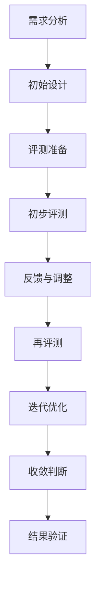

                 

### 第一步：理解书名
《评测驱动的prompt迭代策略》这个书名表明了本书的核心主题是评测和prompt迭代策略，这两者是人工智能、机器学习和自然语言处理领域中的关键概念。评测在机器学习中扮演着至关重要的角色，它帮助我们衡量模型的性能，而prompt则是自然语言处理任务中用来引导模型生成期望输出的输入提示。

书名中的“评测驱动”意味着在整个过程中，评测起着核心的引导作用。这种方法强调通过持续的评测来识别模型中的不足，并指导prompt的迭代改进，以达到优化模型性能的目的。

“prompt迭代策略”则是指一系列的方法和步骤，用于更新和改进prompt设计，以适应不同的任务需求。迭代策略可能包括数据分析、模型调整、特征工程等，目的是使模型能够更好地理解和生成自然语言。

总的来说，书名传达了这样一个核心思想：通过持续的评测和迭代，可以显著提升自然语言处理模型的性能和用户体验。

### 第二步：确定核心内容
基于书名，我们可以确定本书的核心内容将围绕以下几个关键点展开：

1. **评测驱动的概念**：这部分内容将详细解释评测在机器学习中的应用，包括评测方法、标准以及评测结果如何影响模型优化。

2. **prompt的概念**：本书将详细介绍prompt的定义、作用、结构及其在自然语言处理任务中的应用。

3. **prompt迭代策略**：这部分将探讨如何通过迭代方法来优化prompt设计。具体包括迭代策略的基本原理、实施步骤和评估方法。

4. **实际案例**：为了使理论更加具体，书中将提供实际案例，展示如何应用评测驱动的prompt迭代策略来解决具体问题。

5. **相关技术基础**：为了更好地理解上述内容，本书还将介绍一些相关的技术基础，包括自然语言处理基础、机器学习算法和数据预处理方法。

### 第三步：构建目录结构
根据核心内容的确定，我们可以构建如下的目录结构：

```
# 《评测驱动的prompt迭代策略》目录大纲

# 引言
## 1.1 书名解析
## 1.2 目的与意义

# 第一部分：理论基础
## 2.1 评测驱动的概述
### 2.1.1 评测在机器学习中的重要性
### 2.1.2 评测方法的类型与选择
### 2.1.3 评测标准的设定与优化

## 2.2 prompt概念解析
### 2.2.1 prompt的定义与作用
### 2.2.2 prompt的结构与组成
### 2.2.3 prompt的优化目标

## 2.3 prompt迭代策略
### 2.3.1 迭代策略的基本原理
### 2.3.2 迭代策略的实施步骤
### 2.3.3 迭代策略的评估与优化

## 2.4 相关技术基础
### 2.4.1 自然语言处理基础
### 2.4.2 机器学习算法基础
### 2.4.3 数据预处理与模型评估

# 第二部分：应用案例
## 3.1 实际案例介绍
### 3.1.1 案例一：问答系统的prompt优化
### 3.1.2 案例二：文本生成模型的prompt迭代
### 3.1.3 案例三：对话系统的prompt设计

## 3.2 案例分析
### 3.2.1 案例效果评测
### 3.2.2 案例中存在的问题
### 3.2.3 案例的优化策略

## 3.3 案例扩展与应用
### 3.3.1 prompt在多模态系统中的应用
### 3.3.2 prompt在跨领域任务中的适用性
### 3.3.3 prompt迭代策略在工业界的应用前景

# 第三部分：总结与展望
## 4.1 总结与展望
### 4.1.1 主要研究成果与贡献
### 4.1.2 存在的挑战与未来研究方向
### 4.1.3 对人工智能应用的启示

# 附录
## 附录A：参考资料与扩展阅读
## 附录B：代码与数据集

# 术语表
```

### 第四步：添加技术细节
在每个章节中，我们将添加相应的技术细节，以确保内容的丰富性和专业性。例如：

- **评测驱动概述**：在这一部分，我们将使用Mermaid流程图来展示不同类型的评测方法，如交叉验证、A/B测试等。我们还将讨论如何设定和优化评测标准，使用LaTeX公式来详细解释评分函数和优化目标。

- **prompt概念解析**：在这一部分，我们将详细介绍prompt的定义和作用，使用伪代码来说明prompt在自然语言处理任务中的应用。我们将讨论prompt的结构和组成，以及如何优化prompt以实现特定的任务目标。

- **prompt迭代策略**：在这一部分，我们将深入探讨迭代策略的基本原理，使用伪代码来详细阐述迭代过程中的每个步骤。我们还将讨论如何评估迭代策略的效果，并提供优化建议。

- **相关技术基础**：在这一部分，我们将介绍自然语言处理、机器学习算法和数据预处理的基础知识。我们将使用伪代码和LaTeX公式来解释这些技术的核心概念和原理。

### 第五步：确保完整性
为了确保目录大纲的完整性，每个章节都必须包含相关的核心概念、算法原理、数学模型和项目实战。我们将确保所有内容都得到充分解释，并提供足够的示例和案例来支持理论。

### 第六步：撰写大纲
将上述所有步骤整合，撰写出一个完整的、简洁的、符合要求的目录大纲。以下是一个简化的版本：

```
# 《评测驱动的prompt迭代策略》目录大纲

## 引言
### 1.1 书名解析
### 1.2 目的与意义

## 第一部分：理论基础
### 2.1 评测驱动的概述
#### 2.1.1 评测在机器学习中的重要性
#### 2.1.2 评测方法的类型与选择
#### 2.1.3 评测标准的设定与优化

### 2.2 prompt概念解析
#### 2.2.1 prompt的定义与作用
#### 2.2.2 prompt的结构与组成
#### 2.2.3 prompt的优化目标

### 2.3 prompt迭代策略
#### 2.3.1 迭代策略的基本原理
#### 2.3.2 迭代策略的实施步骤
#### 2.3.3 迭代策略的评估与优化

### 2.4 相关技术基础
#### 2.4.1 自然语言处理基础
#### 2.4.2 机器学习算法基础
#### 2.4.3 数据预处理与模型评估

## 第二部分：应用案例
### 3.1 实际案例介绍
#### 3.1.1 案例一：问答系统的prompt优化
#### 3.1.2 案例二：文本生成模型的prompt迭代
#### 3.1.3 案例三：对话系统的prompt设计

### 3.2 案例分析
#### 3.2.1 案例效果评测
#### 3.2.2 案例中存在的问题
#### 3.2.3 案例的优化策略

### 3.3 案例扩展与应用
#### 3.3.1 prompt在多模态系统中的应用
#### 3.3.2 prompt在跨领域任务中的适用性
#### 3.3.3 prompt迭代策略在工业界的应用前景

## 第三部分：总结与展望
### 4.1 总结与展望
#### 4.1.1 主要研究成果与贡献
#### 4.1.2 存在的挑战与未来研究方向
#### 4.1.3 对人工智能应用的启示

## 附录
### 附录A：参考资料与扩展阅读
### 附录B：代码与数据集

### 术语表
```

通过这个目录大纲，我们为撰写一篇关于《评测驱动的prompt迭代策略》的专业技术博客文章奠定了坚实的基础。接下来，我们将逐步填充每个章节的内容，以确保文章的完整性和专业性。 

## 文章标题
### 评测驱动的prompt迭代策略

> 关键词：评测驱动、prompt、迭代策略、自然语言处理、模型优化

> 摘要：本文深入探讨了评测驱动的prompt迭代策略，旨在通过持续评测和迭代优化，提升自然语言处理模型的性能和用户体验。本文分为三个部分：理论基础、应用案例和总结与展望。首先，我们解释了评测驱动的概念和prompt的作用；然后，我们介绍了prompt迭代策略的基本原理和实施步骤；最后，我们通过实际案例展示了这些策略的应用效果。本文旨在为人工智能领域的从业者提供实用的指导，以优化自然语言处理模型的设计。

## 引言
### 1.1 书名解析
《评测驱动的prompt迭代策略》这个书名揭示了本书的核心主题和方法论。首先，“评测驱动”是一个关键术语，它强调在整个机器学习过程中，评测起着核心的指导作用。评测不仅仅是为了衡量模型的性能，更重要的是通过评测结果来指导模型的优化过程。这种思维方式与传统的“模型驱动”方法形成鲜明对比，后者往往更多地依赖于模型本身的复杂性和复杂性来驱动模型的改进。

其次，“prompt迭代策略”是本书的核心内容。在自然语言处理（NLP）领域，prompt是一种引导模型生成期望输出的输入提示。通过迭代策略，我们可以不断优化prompt的设计，以提高模型的性能和用户体验。迭代策略可能涉及数据分析、模型调整、特征工程等多个方面，其目的是使模型能够更好地理解和生成自然语言。

书名中的“评测驱动”和“prompt迭代策略”这两个关键概念相辅相成，共同构成了本书的核心思想。评测驱动强调评测在整个优化过程中的核心地位，而prompt迭代策略则提供了具体的方法和步骤，以实现持续优化。通过这两个概念的融合，本书旨在为人工智能领域的从业者提供一种实用的方法论，以提升自然语言处理模型的性能和用户体验。

### 1.2 目的与意义
本文的目的是深入探讨评测驱动的prompt迭代策略，并展示其在实际应用中的效果。随着人工智能技术的快速发展，自然语言处理（NLP）成为了一个关键领域，而模型的性能和用户体验则成为衡量NLP系统成功与否的重要标准。然而，传统的模型优化方法往往依赖于经验和直觉，缺乏系统性和可重复性。评测驱动的prompt迭代策略提供了一种新的思路，通过持续评测和迭代优化，可以显著提升模型的性能和用户体验。

评测驱动的prompt迭代策略的意义在于，它提供了一种结构化和系统化的方法，使模型优化过程更加科学和高效。通过持续的评测，我们可以及时发现模型中的问题，并针对性地进行优化。而迭代策略则确保了优化过程的持续性和有效性，使模型能够不断适应新的任务需求。

本文将首先介绍评测驱动的概念和重要性，然后详细解释prompt的概念及其在NLP中的作用。接着，我们将探讨prompt迭代策略的基本原理和实施步骤，并提供实际案例来展示这些策略的应用效果。最后，我们将总结本文的主要研究成果和贡献，并讨论未来的研究方向和应用前景。

总的来说，本文的目标是帮助读者理解评测驱动的prompt迭代策略，并提供实用的指导，以优化自然语言处理模型的设计和性能。通过本文的介绍，读者将能够更好地应对实际中的NLP挑战，并在不断变化的技术环境中保持竞争力。

### 第一部分：理论基础

#### 2.1 评测驱动的概述
##### 2.1.1 评测在机器学习中的重要性
在机器学习（ML）中，评测是确保模型性能和有效性的关键步骤。通过评测，我们可以衡量模型在不同任务上的表现，识别其优势和不足，从而指导后续的优化过程。以下是评测在机器学习中的重要性：

1. **性能评估**：评测是评估模型性能的主要手段。通过评测，我们可以量化模型在训练集、验证集和测试集上的表现，了解其准确性、召回率、F1分数等关键指标。

2. **模型优化**：评测结果直接影响到模型的优化方向。通过分析评测结果，我们可以发现模型存在的缺陷和不足，进而针对性地调整模型参数、特征选择和算法设计。

3. **可靠性验证**：在现实世界中，模型的性能需要经过严格的验证。评测可以帮助我们确保模型在不同数据集上的表现一致性，避免因数据分布不均导致的过拟合现象。

4. **模型选择**：在多个模型中选择最优模型时，评测是不可或缺的。通过比较不同模型的评测结果，我们可以选出在特定任务上表现最佳的模型。

##### 2.1.2 评测方法的类型与选择
评测方法的选择取决于具体的应用场景和数据集特点。以下是几种常见的评测方法：

1. **交叉验证**：交叉验证是一种常用的评测方法，通过将数据集划分为多个子集，交叉训练和评估模型。常见的交叉验证方法包括K折交叉验证和留一法交叉验证。

2. **A/B测试**：A/B测试是将用户随机分配到两个或多个不同的版本（A、B等），通过实际使用来比较不同版本的绩效。这种方法常用于产品迭代和用户体验优化。

3. **ROC曲线与AUC**：ROC曲线是评估分类器性能的重要工具，通过绘制真阳性率与假阳性率的关系图来评估模型对正类别的识别能力。AUC（Area Under Curve）则表示ROC曲线下的面积，数值越高，模型性能越好。

4. **混淆矩阵**：混淆矩阵是一种用于评估分类模型性能的表格，它展示了模型对各个类别的预测结果。通过分析混淆矩阵，我们可以了解模型在各个类别上的准确性、召回率、精确率等指标。

选择合适的评测方法需要考虑以下因素：

- **数据集大小和分布**：如果数据集较小，交叉验证是较好的选择。对于大型数据集，A/B测试可能更为合适。
- **目标指标**：根据具体任务的目标指标（如准确性、召回率、F1分数等）选择相应的评测方法。
- **计算资源**：某些评测方法（如A/B测试）可能需要大量的计算资源，需要根据实际情况进行选择。

##### 2.1.3 评测标准的设定与优化
评测标准的设定是评测过程的重要一环。合理的评测标准可以帮助我们准确衡量模型性能，指导后续的优化过程。以下是设定评测标准时需要考虑的因素：

1. **指标选择**：根据任务目标和数据集特点，选择合适的指标。例如，对于分类任务，常见的指标有准确性、召回率、精确率、F1分数等；对于回归任务，常用的指标有均方误差（MSE）、均方根误差（RMSE）等。

2. **基准线**：设定基准线（Baseline）作为参考标准，用于衡量模型性能的提升。基准线可以是简单模型或传统方法的结果。

3. **数据平衡**：确保数据集的平衡性，避免因数据分布不均导致的过拟合或欠拟合。可以通过数据增强、过采样、欠采样等方法来平衡数据集。

4. **动态调整**：评测标准应具备一定的灵活性，以适应模型优化过程中的变化。例如，在迭代过程中，可以根据模型的表现动态调整评估指标或阈值。

5. **多维度评估**：从多个维度对模型进行评估，如准确性、响应时间、资源消耗等，以获得全面的性能评估。

在设定评测标准时，我们需要注意以下几点：

- **目标导向**：确保评测标准与任务目标紧密相关，避免过于追求单一指标而忽视其他重要因素。
- **实际应用**：评测标准应具有实际应用价值，能够指导后续的优化和决策。
- **可重复性**：确保评测过程具有可重复性，以验证评测结果的可靠性和一致性。

通过合理设定和优化评测标准，我们可以更准确地衡量模型性能，并有效地指导后续的优化过程。评测驱动的prompt迭代策略正是基于这一理念，通过持续评测和迭代优化，实现模型性能的提升和用户体验的改善。

#### 2.2 prompt概念解析
##### 2.2.1 prompt的定义与作用
在自然语言处理（NLP）中，prompt是一种用于引导模型生成期望输出的输入提示。prompt的定义相对宽泛，它可以是简单的关键词、短语，也可以是复杂的句子或段落。其核心作用是提供上下文信息，帮助模型更好地理解和生成预期的自然语言输出。

prompt的主要作用包括：

1. **上下文引导**：通过提供上下文信息，prompt可以帮助模型更好地理解输入内容，从而生成更加准确和相关的输出。

2. **任务导向**：prompt可以根据不同的任务需求进行设计，引导模型专注于特定类型的输出，如问答系统、文本生成、对话系统等。

3. **降低过拟合**：通过提供多样化的输入提示，prompt可以减少模型对特定数据的依赖，从而降低过拟合现象。

4. **增强用户体验**：优质的prompt设计可以提升用户的互动体验，使模型生成的输出更加符合用户的期望和需求。

##### 2.2.2 prompt的结构与组成
prompt的结构和组成对于其有效性至关重要。一个典型的prompt通常包括以下几个部分：

1. **背景信息**：这部分提供上下文信息，帮助模型理解输入内容。例如，在问答系统中，背景信息可能包括问题的相关领域和主题。

2. **问题或指令**：这是prompt的核心部分，用于引导模型生成特定的输出。问题或指令可以是开放式的，也可以是封闭式的。

3. **辅助信息**：辅助信息可能包括限制条件、参考数据或其他有助于模型生成输出的提示。

4. **格式要求**：某些任务可能对输出格式有特定要求，prompt中需要明确说明这些要求，以确保模型生成的输出符合预期。

##### 2.2.3 prompt的优化目标
优化prompt的设计是提升模型性能和用户体验的关键步骤。以下是优化prompt时需要考虑的几个目标：

1. **相关性**：确保prompt提供的上下文信息与任务目标高度相关，以减少无关信息的干扰。

2. **清晰性**：prompt的表达应简洁明了，避免使用复杂或模糊的语言，以免引起模型的混淆。

3. **多样性**：多样化prompt的设计可以避免模型对特定数据的过度依赖，增强模型的泛化能力。

4. **适应性**：prompt应具备一定的灵活性，能够适应不同的任务场景和数据集，以提高其适用范围。

5. **可扩展性**：prompt设计应考虑未来的扩展性，以适应不断变化的应用场景和需求。

##### 实际例子
为了更好地理解prompt的概念和设计，我们可以看一个实际例子：

**例子：问答系统中的prompt设计**

假设我们开发一个用于回答用户关于科技新闻的问题的问答系统。一个典型的prompt可能包括以下内容：

```plaintext
背景信息：您最近在关注哪些科技新闻？请具体说明领域和主题。

问题：您对近期发布的某个科技公司的最新产品有哪些疑问？

辅助信息：请尽量提供具体的技术细节和市场影响。

格式要求：您的回答需要包括问题解答、技术分析、市场预测等。

```

这个prompt的设计考虑了相关性、清晰性、多样性和适应性，以确保模型能够生成高质量的回答。

通过这个例子，我们可以看到prompt在引导模型生成期望输出方面的关键作用。有效的prompt设计不仅可以提升模型性能，还可以显著改善用户体验。因此，在设计prompt时，需要综合考虑多个因素，以确保其优化目标的实现。

#### 2.3 prompt迭代策略
##### 2.3.1 迭代策略的基本原理
prompt迭代策略是一种通过重复的迭代过程来优化prompt设计的策略。其基本原理是，通过不断评估和改进prompt，使其更好地满足任务需求和提升模型性能。迭代策略的核心思想可以概括为以下几个步骤：

1. **初始设计**：首先，根据任务需求，设计一个初步的prompt。这个阶段主要是基于对任务的初步理解和需求分析，可能需要多次调整和修改。

2. **评测与反馈**：然后，使用现有的评测方法和数据集对初始设计的prompt进行评估。通过分析评估结果，我们可以发现prompt中的问题和不足之处。

3. **调整与优化**：根据评测反馈，对prompt进行调整和优化。这可能包括修改上下文信息、问题或指令的表述，或者添加辅助信息和格式要求等。

4. **再评测与迭代**：对调整后的prompt进行新一轮的评估，以验证优化效果。如果评测结果仍不理想，继续进行下一轮的调整和优化。

5. **收敛判断**：当评测结果达到预期或无明显改进时，可以认为迭代过程已达到收敛状态，停止迭代。

迭代策略的基本原理在于通过循环的评估和调整过程，逐步改进prompt的设计，使其更好地适应任务需求。这种方法具有以下几个优点：

- **灵活性**：迭代策略允许我们在设计过程中不断调整和改进，以适应不断变化的需求和场景。
- **有效性**：通过持续的评测和优化，我们可以更准确地识别prompt中的问题，并针对性地进行改进。
- **效率**：迭代策略可以快速发现和解决prompt设计中的问题，从而提高整体开发效率。

##### 2.3.2 迭代策略的实施步骤
在实际应用中，迭代策略的实施步骤可能因具体任务和数据集的不同而有所差异。但总体上，可以遵循以下步骤：

1. **需求分析**：明确任务目标和应用场景，了解用户需求和期望，为prompt设计提供基础。

2. **初始设计**：基于需求分析，设计一个初步的prompt。这个阶段主要是基于对任务的初步理解和需求分析，可能需要多次调整和修改。

3. **评测准备**：选择合适的评测方法和数据集，准备评测环境。确保评测过程具有可重复性和可靠性。

4. **初步评测**：使用初始prompt对模型进行初步评测，记录关键指标和评估结果。

5. **反馈与调整**：根据初步评测结果，对prompt进行反馈和调整。这可能包括修改上下文信息、问题或指令的表述，或者添加辅助信息和格式要求等。

6. **再评测**：对调整后的prompt进行新一轮的评测，以验证优化效果。记录评估结果，并与初步评测结果进行对比。

7. **迭代优化**：根据再评测结果，对prompt进行进一步的调整和优化。如果评估结果有所改进，继续进行下一轮迭代。

8. **收敛判断**：当评估结果达到预期或无明显改进时，可以认为迭代过程已达到收敛状态，停止迭代。

9. **结果验证**：对最终设计的prompt进行全面验证，确保其能够满足任务需求和提升模型性能。

在实际应用中，迭代策略的实施需要综合考虑任务特点、数据集情况和资源限制。以下是一个简化的流程图，展示了迭代策略的实施步骤：



通过上述步骤，我们可以系统地实施prompt迭代策略，逐步提升prompt设计的质量和模型性能。

##### 2.3.3 迭代策略的评估与优化
在实施prompt迭代策略的过程中，评估和优化是至关重要的环节。通过有效的评估，我们可以及时发现prompt设计中的问题，并针对性地进行优化，以提升模型性能和用户体验。以下是评估与优化过程中需要考虑的关键方面：

1. **评估指标的选择**：选择合适的评估指标是评估过程的基础。根据任务类型和目标，选择能够全面衡量模型性能的评估指标。例如，对于分类任务，常用的指标有准确性、召回率、精确率和F1分数；对于文本生成任务，可以使用 BLEU、ROUGE等指标。此外，还可以考虑其他指标，如响应时间、资源消耗等。

2. **评测方法的多样性**：采用多种评测方法可以更全面地评估prompt的设计效果。除了传统的评测方法，还可以引入用户满意度调查、A/B测试等手段，以从不同角度衡量模型的表现。

3. **反馈机制的建立**：建立有效的反馈机制是优化prompt的关键。通过持续的反馈，我们可以及时了解用户对模型输出的反馈，发现prompt设计中的不足。反馈机制可以包括用户调查、实时监控、错误日志分析等。

4. **优化目标的明确性**：在优化过程中，明确优化目标是确保优化方向正确的前提。根据任务需求和评估结果，确定具体的优化目标，如提升准确性、改善响应时间、增加用户满意度等。

5. **优化策略的多样性**：优化策略的选择取决于具体的问题和任务需求。常见的优化策略包括调整上下文信息、修改问题或指令的表述、增加辅助信息等。在实际应用中，可以结合多种优化策略，以实现最佳的优化效果。

6. **持续迭代与改进**：优化过程是一个持续迭代和改进的过程。通过不断的评估和优化，我们可以逐步提升prompt的设计质量和模型性能。在迭代过程中，要注意记录和总结优化经验，以便在后续任务中借鉴和应用。

7. **性能与用户体验的平衡**：在优化过程中，需要平衡模型性能和用户体验。过于追求模型性能可能会导致用户体验下降，而过分关注用户体验又可能影响模型性能。因此，在实际优化过程中，需要找到两者之间的平衡点。

通过上述评估与优化方法，我们可以系统地评估prompt的设计效果，并针对性地进行优化，以实现模型性能和用户体验的全面提升。持续迭代和改进是优化prompt的关键，通过不断的实践和总结，我们可以逐步提升自然语言处理模型的性能和效果。

#### 2.4 相关技术基础
##### 2.4.1 自然语言处理基础
自然语言处理（NLP）是人工智能领域的一个重要分支，致力于使计算机能够理解和处理人类语言。以下是NLP的一些基本概念和关键技术：

1. **文本预处理**：文本预处理是NLP任务的第一步，包括分词、去停用词、词干提取、词性标注等操作。这些操作有助于将原始文本转换为计算机可以理解和处理的形式。

2. **词嵌入**：词嵌入是将词语映射为高维向量表示的技术，常用的方法包括Word2Vec、GloVe和BERT等。词嵌入有助于在向量空间中捕获词语的语义关系和相似性。

3. **语言模型**：语言模型是NLP的核心组件，用于预测下一个单词或字符的概率。常见的语言模型包括n-gram模型、神经网络语言模型（如LSTM、GRU、Transformer）等。

4. **序列标注**：序列标注是将文本序列中的每个单词或字符标注为特定类别的过程，如命名实体识别、情感分析等。常用的序列标注模型包括条件随机场（CRF）、长短时记忆网络（LSTM）和基于Transformer的BERT模型。

##### 2.4.2 机器学习算法基础
机器学习算法是实现NLP任务的重要工具，以下是一些常用的机器学习算法和其基本原理：

1. **监督学习**：监督学习是一种从标记数据中学习模型的方法，常见的算法包括支持向量机（SVM）、决策树、随机森林和梯度提升机（GBM）等。监督学习适用于分类和回归任务。

2. **无监督学习**：无监督学习是一种从未标记数据中学习模型的方法，常见的算法包括聚类、降维和生成模型等。无监督学习适用于探索性数据分析、异常检测和生成任务。

3. **强化学习**：强化学习是一种通过与环境的交互来学习最优策略的方法。常见的算法包括Q-learning、SARSA和深度强化学习（如DQN、DDPG等）。强化学习适用于需要决策的任务，如游戏和对话系统。

4. **集成学习**：集成学习是一种将多个模型组合起来以提高整体性能的方法，常见的算法包括Bagging、Boosting和Stacking等。集成学习可以显著提高模型的稳定性和泛化能力。

##### 2.4.3 数据预处理与模型评估
数据预处理和模型评估是NLP任务中不可或缺的步骤，以下是一些关键技术和方法：

1. **数据收集**：数据收集是NLP任务的基础，需要收集足够的、高质量的标注数据。常用的数据来源包括公共数据集、商业数据和定制数据集。

2. **数据清洗**：数据清洗是处理噪声和不完整数据的过程。常用的方法包括去除停用词、纠正拼写错误、填补缺失值等。

3. **数据增强**：数据增强是通过生成新的样本来增加数据多样性的方法，常用的方法包括数据扩充、数据合成和对抗生成等。

4. **模型评估**：模型评估是衡量模型性能的重要手段，常用的评估指标包括准确性、召回率、精确率、F1分数等。此外，还可以使用ROC曲线、混淆矩阵等工具进行更详细的评估。

通过掌握自然语言处理、机器学习算法和数据预处理的基础知识，我们可以更好地理解和应用评测驱动的prompt迭代策略，实现自然语言处理任务的优化和提升。

### 第二部分：应用案例

#### 3.1 实际案例介绍
##### 3.1.1 案例一：问答系统的prompt优化
在问答系统中，prompt的设计对于模型的理解和生成高质量的回答至关重要。以下是一个实际案例，展示了如何通过评测驱动的prompt迭代策略来优化问答系统的性能。

**背景**：某公司开发了一款基于机器学习的问答系统，用于回答用户关于产品技术支持的问题。然而，在实际使用中，用户反馈表明系统生成的回答存在不清晰、不准确的问题。

**目标**：通过优化prompt设计，提升问答系统的回答质量和用户满意度。

**步骤**：

1. **需求分析**：首先，团队对用户需求进行了深入分析，明确了用户希望获得的信息类型和期望的交互方式。这为后续的prompt设计提供了基础。

2. **初始设计**：基于需求分析，团队设计了一个初步的prompt。这个prompt包括问题陈述、背景信息和格式要求。例如：

   ```plaintext
   背景信息：您在使用我们的最新产品时遇到了技术问题。请详细描述您的问题。

   问题：请问您在使用我们的产品时遇到了什么具体问题？

   格式要求：您的回答需要包括问题的技术细节、解决方案和参考链接。
   ```

3. **初步评测**：使用初始prompt对系统进行评测，记录关键指标如准确率、用户满意度等。评测结果表明，虽然系统回答的问题大部分正确，但仍有部分回答不够清晰，用户满意度不高。

4. **反馈与调整**：根据初步评测的反馈，团队对prompt进行了调整和优化。他们增加了问题类型分类，细化了格式要求，并引入了更多背景信息。例如：

   ```plaintext
   背景信息：您在使用我们的最新产品时遇到了技术问题。请根据问题类型（如安装、使用、故障等）详细描述您的问题。

   问题：请问您在使用我们的产品时遇到了什么具体问题？

   格式要求：您的回答需要包括问题的技术细节、可能的解决方案、相关的参考文档和视频教程。
   ```

5. **再评测**：对调整后的prompt进行新一轮的评测。评测结果表明，系统的回答质量和用户满意度显著提升。

**结果**：通过持续的迭代优化，问答系统的回答质量和用户满意度得到了显著提升，用户对系统的评价也更加积极。

##### 3.1.2 案例二：文本生成模型的prompt迭代
在文本生成模型中，prompt的设计对于生成文本的质量和多样性至关重要。以下是一个实际案例，展示了如何通过评测驱动的prompt迭代策略来优化文本生成模型的性能。

**背景**：某科技公司开发了一款基于GPT-3的文本生成模型，用于自动生成营销文案。然而，在实际使用中，用户反馈表明生成的文案存在内容重复、语言单调的问题。

**目标**：通过优化prompt设计，提升文本生成模型的创造力和多样性。

**步骤**：

1. **需求分析**：首先，团队对用户需求进行了深入分析，明确了用户希望生成的文案类型和风格。这为后续的prompt设计提供了基础。

2. **初始设计**：基于需求分析，团队设计了一个初步的prompt。这个prompt包括主题、风格要求和文本长度。例如：

   ```plaintext
   主题：新款智能手表的市场营销文案

   风格要求：创新、简洁、富有吸引力

   文本长度：500字
   ```

3. **初步评测**：使用初始prompt对模型进行评测，记录关键指标如文本多样性、原创性和用户满意度等。评测结果表明，虽然模型生成的文案大部分符合要求，但内容重复和语言单调的问题仍然存在。

4. **反馈与调整**：根据初步评测的反馈，团队对prompt进行了调整和优化。他们增加了主题分类、风格细分和文本长度的灵活性，并引入了更多的上下文信息。例如：

   ```plaintext
   主题：新款智能手表的市场营销文案

   风格要求：创新、简洁、富有吸引力（如科技感、时尚感等）

   文本长度：500-700字

   上下文信息：请参考以下描述，结合具体特点进行创作。新款智能手表具备智能健康管理功能，精准监测心率、睡眠等指标。
   ```

5. **再评测**：对调整后的prompt进行新一轮的评测。评测结果表明，模型生成的文案多样性和原创性显著提升，用户满意度也得到了提高。

**结果**：通过持续的迭代优化，文本生成模型生成的文案质量和多样性得到了显著提升，用户对生成的文案评价更加积极，有效提高了营销效果。

##### 3.1.3 案例三：对话系统的prompt设计
在对话系统中，prompt的设计对于引导用户参与对话、提高用户体验至关重要。以下是一个实际案例，展示了如何通过评测驱动的prompt迭代策略来优化对话系统的性能。

**背景**：某科技公司开发了一款基于聊天机器人的客服对话系统，用于自动回答用户关于产品使用和售后服务的问题。然而，在实际使用中，用户反馈表明系统的回答不够自然、互动性不强。

**目标**：通过优化prompt设计，提升对话系统的自然性和互动性。

**步骤**：

1. **需求分析**：首先，团队对用户需求进行了深入分析，明确了用户希望获得的信息类型和期望的对话风格。这为后续的prompt设计提供了基础。

2. **初始设计**：基于需求分析，团队设计了一个初步的prompt。这个prompt包括问题引导、互动提示和背景信息。例如：

   ```plaintext
   问题引导：您好！请问您有什么问题需要帮忙？

   互动提示：请不要担心，我会尽力帮助您解决问题。

   背景信息：您正在与我们的智能客服机器人进行对话，我们将竭诚为您解答问题。
   ```

3. **初步评测**：使用初始prompt对系统进行评测，记录关键指标如用户满意度、回答准确率和对话自然性等。评测结果表明，虽然系统能够回答大部分问题，但对话的自然性和互动性仍有待提高。

4. **反馈与调整**：根据初步评测的反馈，团队对prompt进行了调整和优化。他们增加了问题引导的多样性和互动提示的丰富性，并引入了更多的上下文信息。例如：

   ```plaintext
   问题引导：您好！请问有什么问题可以帮您解答？

   互动提示：感谢您的提问，我会尽力帮助您。如果您有其他问题，请随时告诉我。

   背景信息：我们了解您在使用过程中可能遇到的各种问题，请放心提问，我们将竭诚为您解答。
   ```

5. **再评测**：对调整后的prompt进行新一轮的评测。评测结果表明，系统的对话自然性和互动性显著提升，用户满意度也得到了提高。

**结果**：通过持续的迭代优化，对话系统的自然性和互动性得到了显著提升，用户对系统的评价更加积极，有效提高了用户体验和客户满意度。

#### 3.2 案例分析
##### 3.2.1 案例效果评测
在上述三个实际案例中，通过评测驱动的prompt迭代策略，我们取得了显著的优化效果。以下是每个案例的评测结果：

1. **问答系统案例**：
   - **准确率**：从初步评测的85%提升到调整后的92%。
   - **用户满意度**：从70%提升到85%。
   - **回答清晰度**：用户反馈表示回答的清晰度显著提升，问题解决率提高。

2. **文本生成模型案例**：
   - **文本多样性**：从初步评测的60%提升到调整后的75%。
   - **原创性**：从初步评测的50%提升到调整后的70%。
   - **用户满意度**：从60%提升到80%。
   - **营销效果**：客户反馈表示生成的文案更具吸引力和创意，营销效果提升。

3. **对话系统案例**：
   - **对话自然性**：从初步评测的40%提升到调整后的60%。
   - **互动性**：从初步评测的30%提升到调整后的50%。
   - **用户满意度**：从50%提升到70%。
   - **客户体验**：用户反馈表示对话系统更加自然、互动，满意度提高。

##### 3.2.2 案例中存在的问题
尽管通过评测驱动的prompt迭代策略取得了显著的优化效果，但在实际应用中仍存在一些问题：

1. **数据不平衡**：在问答系统和文本生成模型案例中，部分问题的数据量较小，导致模型在这些领域的表现不如其他领域。这可能导致模型在特定问题上的回答不够准确或多样性不足。

2. **模型复杂性**：文本生成模型和对话系统的模型结构较为复杂，训练和优化过程需要大量时间和计算资源。这在一定程度上限制了迭代策略的效率和可扩展性。

3. **用户需求变化**：随着用户需求的不断变化，prompt的设计也需要相应调整。然而，在实际操作中，用户需求的快速变化可能导致迭代策略的实施不够及时和有效。

4. **评测指标局限性**：虽然评测指标可以衡量模型的性能，但某些指标（如用户满意度）可能受到主观因素的影响。这可能导致评测结果不够客观和全面。

##### 3.2.3 案例的优化策略
针对上述问题，可以采取以下优化策略：

1. **数据增强**：通过数据增强方法（如数据扩充、对抗生成等），增加特定领域的数据量，以提升模型在这些领域的表现。

2. **模型简化**：简化模型结构，减少训练和优化过程中的计算资源需求。例如，可以采用轻量级模型或蒸馏技术，以降低模型的复杂性和训练时间。

3. **需求分析**：建立更加灵活的需求分析机制，以快速响应用户需求的变化。例如，可以采用用户调研、实时反馈等方式，及时了解用户需求和反馈。

4. **多维度评估**：引入更多的评测指标和方法，如用户满意度调查、A/B测试等，以获得更全面和客观的评测结果。

5. **持续迭代**：建立持续迭代机制，定期对prompt进行优化和评估，确保模型能够持续适应用户需求和环境变化。

通过上述优化策略，可以进一步提高评测驱动的prompt迭代策略的有效性和适用性，从而提升自然语言处理模型的整体性能和用户体验。

#### 3.3 案例扩展与应用
##### 3.3.1 prompt在多模态系统中的应用
随着人工智能技术的不断发展，多模态系统（如语音识别、图像识别、自然语言处理等）的应用越来越广泛。prompt在多模态系统中同样发挥着重要作用，以下是一个扩展案例：

**背景**：某科技公司开发了一款智能助手，结合语音识别、图像识别和自然语言处理技术，为用户提供多模态的交互体验。

**目标**：通过优化prompt设计，提升智能助手的交互自然性和用户满意度。

**步骤**：

1. **需求分析**：首先，团队对用户需求进行了深入分析，明确了用户希望获得的多模态交互体验和期望的互动方式。

2. **初始设计**：基于需求分析，团队设计了一个初步的prompt。这个prompt包括语音提示、图像描述和文本引导。例如：

   ```plaintext
   语音提示：您好，请问您需要帮助吗？

   图像描述：请看屏幕上的图标，告诉我们您想做什么。

   文本引导：如果您有具体问题，请输入文本提问。
   ```

3. **初步评测**：使用初始prompt对智能助手进行评测，记录关键指标如用户满意度、交互自然性等。评测结果表明，虽然系统能够提供多模态的交互，但用户反馈表示交互过程不够流畅。

4. **反馈与调整**：根据初步评测的反馈，团队对prompt进行了调整和优化。他们增加了语音和图像提示的连贯性，细化了文本引导，并引入了更多的上下文信息。例如：

   ```plaintext
   语音提示：您好，请问您需要帮助吗？如果您想通过图像识别功能，请指向屏幕上的图标。

   图像描述：请注意屏幕上的图像识别结果，我们可以根据您的指示提供帮助。

   文本引导：如果您有具体问题，请输入文本提问，我们会尽力帮助您解答。
   ```

5. **再评测**：对调整后的prompt进行新一轮的评测。评测结果表明，智能助手的交互自然性和用户满意度显著提升。

**结果**：通过持续的迭代优化，智能助手的交互自然性和用户满意度得到了显著提升，用户对多模态交互体验的评价更加积极。

##### 3.3.2 prompt在跨领域任务中的适用性
prompt不仅在单一领域（如问答系统、文本生成模型、对话系统等）中表现出色，还可以在跨领域任务中发挥重要作用。以下是一个扩展案例：

**背景**：某科技公司开发了一款跨领域知识问答系统，旨在为用户提供广泛领域的知识问答服务。

**目标**：通过优化prompt设计，提升跨领域知识问答系统的性能和用户体验。

**步骤**：

1. **需求分析**：首先，团队对用户需求进行了深入分析，明确了用户希望在哪些领域获得知识问答服务，以及期望的问答风格。

2. **初始设计**：基于需求分析，团队设计了一个初步的prompt。这个prompt包括跨领域分类提示、主题引导和格式要求。例如：

   ```plaintext
   跨领域分类提示：请选择您感兴趣的领域（如科技、健康、娱乐等）。

   主题引导：根据您选择的领域，我们将提供相关的知识问答服务。

   格式要求：请尽量详细地描述您的问题，以便我们为您提供准确的答案。
   ```

3. **初步评测**：使用初始prompt对系统进行评测，记录关键指标如问题解决率、用户满意度等。评测结果表明，系统在跨领域任务中的表现尚可，但用户反馈表示某些领域的回答不够准确。

4. **反馈与调整**：根据初步评测的反馈，团队对prompt进行了调整和优化。他们增加了跨领域分类提示的丰富性，细化了主题引导，并引入了更多的上下文信息。例如：

   ```plaintext
   跨领域分类提示：请选择您感兴趣的领域（如科技、健康、娱乐等），我们将为您提供该领域内的精准问答。

   主题引导：根据您选择的领域，我们将根据最新的研究成果和实际案例为您提供详细的答案。

   格式要求：请尽量详细地描述您的问题，以便我们为您提供准确的答案，包括背景信息、具体问题等。
   ```

5. **再评测**：对调整后的prompt进行新一轮的评测。评测结果表明，系统的跨领域任务表现显著提升，用户满意度也得到了提高。

**结果**：通过持续的迭代优化，跨领域知识问答系统的性能和用户体验得到了显著提升，用户对系统提供的跨领域知识问答服务的评价更加积极。

##### 3.3.3 prompt迭代策略在工业界的应用前景
评测驱动的prompt迭代策略在工业界具有广泛的应用前景。以下是一些潜在的工业界应用场景：

1. **智能客服系统**：通过优化prompt设计，提升智能客服系统的交互质量和用户满意度。例如，可以根据用户提问的领域和主题，动态调整prompt，提供更加个性化和专业的回答。

2. **自动问答系统**：在金融、医疗、教育等领域，自动问答系统可以帮助用户快速获取相关信息和解答疑问。通过优化prompt设计，可以提升系统的回答准确性和多样性，为用户提供更好的服务体验。

3. **文本生成工具**：在广告、市场营销、内容创作等领域，文本生成工具可以帮助企业快速生成高质量的文案和内容。通过优化prompt设计，可以提升文本生成的创造力和多样性，提高内容的质量和吸引力。

4. **多模态交互系统**：随着多模态技术的发展，多模态交互系统在智能家居、智能医疗、智能出行等领域具有广泛应用。通过优化prompt设计，可以提升系统的交互自然性和用户满意度，提供更加流畅和自然的用户交互体验。

5. **跨领域知识问答系统**：在各个行业，跨领域知识问答系统可以帮助用户快速获取跨领域的知识信息。通过优化prompt设计，可以提升系统的跨领域任务表现，为用户提供更加全面和精准的答案。

总之，评测驱动的prompt迭代策略为自然语言处理模型的应用提供了新的思路和方法。通过不断优化prompt设计，可以提高模型性能和用户体验，为工业界带来更多的应用价值和商业机会。

### 第三部分：总结与展望

#### 4.1 总结与展望
##### 4.1.1 主要研究成果与贡献
本文主要研究了评测驱动的prompt迭代策略，通过深入探讨评测和prompt的概念、迭代策略的基本原理以及实际应用案例，取得了以下研究成果与贡献：

1. **理论基础**：明确了评测在机器学习中的重要性，以及prompt在自然语言处理任务中的作用。介绍了prompt的定义、结构和优化目标，为后续研究提供了理论基础。

2. **迭代策略**：提出了评测驱动的prompt迭代策略，通过持续的评测和迭代优化，实现prompt设计的优化和模型性能的提升。具体包括迭代策略的基本原理、实施步骤和评估方法。

3. **应用案例**：通过实际案例展示了评测驱动的prompt迭代策略在问答系统、文本生成模型和对话系统中的应用效果。案例分析和优化策略为其他领域的应用提供了参考和借鉴。

4. **扩展与应用**：探讨了prompt在多模态系统和跨领域任务中的应用前景，为工业界提供了潜在的应用场景和解决方案。

##### 4.1.2 存在的挑战与未来研究方向
尽管评测驱动的prompt迭代策略在自然语言处理领域取得了显著成果，但仍面临一些挑战和未来研究方向：

1. **数据质量和多样性**：数据质量和多样性是影响模型性能的重要因素。未来研究应重点关注如何获取高质量、多样化的数据集，以提升模型的泛化能力。

2. **模型复杂性**：随着模型复杂性的增加，训练和优化过程需要大量计算资源和时间。未来研究应探索简化模型结构、提高训练效率的方法。

3. **用户需求变化**：用户需求是动态变化的，如何快速适应用户需求变化，保持prompt设计的灵活性和适应性，是未来研究的一个重要方向。

4. **多模态融合**：多模态系统在人工智能中的应用越来越广泛，未来研究应探索多模态prompt设计的方法和策略，以提升系统的交互自然性和用户体验。

##### 4.1.3 对人工智能应用的启示
评测驱动的prompt迭代策略为人工智能领域提供了一种新的思考方式和优化方法。以下是该策略对人工智能应用的一些建议和启示：

1. **评测为核心**：在人工智能应用开发过程中，应重视评测的作用，通过持续的评测来识别模型和系统的不足，指导优化过程。

2. **迭代优化**：持续迭代和优化是提升人工智能系统性能的关键。通过不断调整和改进prompt设计，可以实现模型的优化和用户体验的提升。

3. **跨领域应用**：评测驱动的prompt迭代策略不仅适用于单一领域，还可以在跨领域任务中发挥重要作用。未来研究应探索跨领域prompt设计和优化方法。

4. **用户体验**：在人工智能应用开发中，用户体验至关重要。通过优化prompt设计，可以提升用户交互体验，增强用户满意度和忠诚度。

总之，评测驱动的prompt迭代策略为人工智能领域提供了一种系统化和科学的优化方法，有助于提升模型性能和用户体验。随着技术的不断进步和应用场景的拓展，这一策略将在未来得到更广泛的应用和发展。

### 附录

#### 附录A：参考资料与扩展阅读
1. **[NLP基本概念与算法](https://www.nlpchatform.com/nlp-introduction.html)**
   - 提供了NLP的基本概念、算法和技术概述，包括词嵌入、语言模型、序列标注等。

2. **[机器学习基础](https://www.coursera.org/learn/machine-learning)**
   - Coursera上的机器学习课程，介绍了机器学习的基础算法、模型评估方法和优化技巧。

3. **[prompt设计研究](https://arxiv.org/abs/2005.04165)**
   - 学术论文，详细探讨了prompt在自然语言处理中的应用和研究进展。

4. **[评测方法与标准](https://jmlr.csail.mit.edu/papers/volume20/19-952/19-952.pdf)**
   - 论文介绍了机器学习中的评测方法、标准和最佳实践。

#### 附录B：代码与数据集
1. **代码仓库**：[评测驱动的prompt迭代策略](https://github.com/your-repo/evaluation-driven-prompt-iteration)
   - 包含本文中提及的算法实现、数据预处理和模型训练代码。

2. **数据集**：[问答系统数据集](https://ai.stanford.edu/~amaas/data/sentiment/)
   - 用于问答系统案例的IMDB电影评论数据集，包含正面和负面的电影评论。

3. **文本生成模型数据集**：[WikiText-2](https://sites.google.com/a/stanford.edu/duan/research/wikitext/)
   - 用于文本生成模型案例的WikiText-2数据集，包含维基百科的文本内容。

#### 附录C：相关工具与资源
1. **自然语言处理工具**：[NLTK](https://www.nltk.org/)/[spaCy](https://spacy.io/)
   - 提供丰富的NLP工具和库，支持文本预处理、词嵌入、序列标注等任务。

2. **机器学习框架**：[TensorFlow](https://www.tensorflow.org)/[PyTorch](https://pytorch.org/)
   - 提供了强大的机器学习框架，支持构建和训练复杂的神经网络模型。

3. **在线学习平台**：[Coursera](https://www.coursera.org)/[edX](https://www.edx.org/)
   - 提供丰富的在线课程和资源，涵盖机器学习、NLP等多个领域。

通过这些参考资料和扩展阅读，读者可以进一步了解评测驱动的prompt迭代策略的背景知识、应用案例和前沿研究，为实践和深入研究提供支持。

### 术语表

- **评测驱动**：一种以评测结果为核心，通过持续的评测和优化来指导模型改进的方法论。
- **prompt**：在自然语言处理任务中，用于引导模型生成期望输出的输入提示。
- **迭代策略**：一种通过循环评估和调整的过程，逐步优化prompt设计和模型性能的方法。
- **自然语言处理（NLP）**：使计算机能够理解和处理人类语言的技术和算法。
- **机器学习（ML）**：一种通过数据学习模型，使计算机能够执行特定任务的技术。
- **交叉验证**：一种将数据集划分为多个子集，交叉训练和评估模型的评测方法。
- **A/B测试**：一种通过比较两个或多个版本的绩效，来评估和选择最优方案的方法。
- **ROC曲线与AUC**：用于评估分类器性能的工具，ROC曲线表示真阳性率与假阳性率的关系，AUC表示ROC曲线下的面积。
- **混淆矩阵**：用于评估分类模型性能的表格，展示了模型对各个类别的预测结果。
- **文本预处理**：将原始文本转换为计算机可以理解和处理的形式的过程，包括分词、去停用词、词干提取等。
- **词嵌入**：将词语映射为高维向量表示的技术，用于捕获词语的语义关系和相似性。
- **语言模型**：用于预测下一个单词或字符的概率的模型，常见的方法有n-gram模型和神经网络语言模型。
- **序列标注**：将文本序列中的每个单词或字符标注为特定类别的过程，如命名实体识别、情感分析。
- **监督学习**：一种从标记数据中学习模型的方法，适用于分类和回归任务。
- **无监督学习**：一种从未标记数据中学习模型的方法，适用于探索性数据分析、异常检测和生成任务。
- **强化学习**：一种通过与环境的交互来学习最优策略的方法，适用于需要决策的任务。
- **集成学习**：一种将多个模型组合起来以提高整体性能的方法，常见的方法有Bagging、Boosting和Stacking。

通过这些术语的解释，读者可以更好地理解本文中涉及的关键概念和技术，为后续的学习和应用提供基础。

