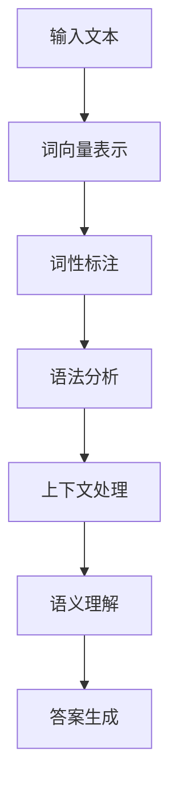
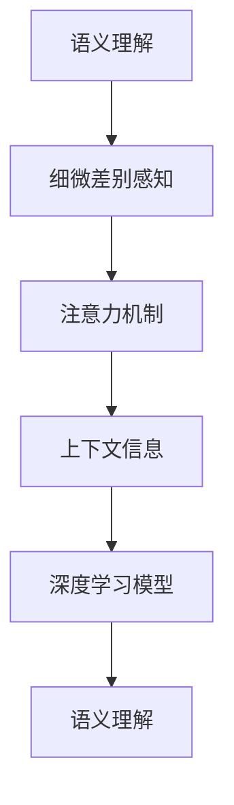

                 

### 文章标题

“语义理解增强：提高模型对提示细微差别的感知”

### 关键词

语义理解，深度学习，模型感知能力，细微差别感知，算法优化

### 摘要

本文旨在探讨如何通过语义理解增强技术，提高深度学习模型对提示细微差别的感知能力。首先，我们介绍了语义理解的基础概念，详细分析了其在现代人工智能系统中的重要性。接着，我们讨论了提高模型对细微差别感知的方法，包括增强语义理解的技术和策略。随后，我们通过伪代码和数学公式详细讲解了核心算法原理。文章还通过实际应用案例展示了增强模型感知能力的效果，并进行了评估和展望。最后，我们总结了最佳实践，并给出了注意事项和拓展阅读建议。通过本文，读者将全面了解如何提升深度学习模型在语义理解上的细微差别感知能力。 

### 引言

语义理解是自然语言处理（NLP）领域中的一项核心任务，它涉及到机器对人类语言含义的解析能力。随着深度学习技术的不断进步，语义理解在人工智能（AI）系统中的应用越来越广泛，例如问答系统、语音助手、机器翻译等。然而，现有模型在处理语义细微差别时仍存在许多挑战，这限制了它们在实际应用中的表现。

在现实场景中，语义的细微差别往往决定了模型对问题的理解和回答的准确性。例如，在对话系统中，一个简单的词汇替换可能会导致模型对整个问题的理解产生偏差。这种情况下，模型需要具备更高的语义理解能力，以便准确捕捉文本中的细微差别。然而，现有的深度学习模型，尤其是基于神经网络的方法，往往在处理语义细微差别时表现不佳。这主要是由于以下几个原因：

1. **数据集的局限性**：大多数现有的训练数据集缺乏足够的语义多样性，导致模型无法充分学习到语义细微差别。
2. **神经网络的结构限制**：深度神经网络的结构和参数可能导致模型无法捕捉到语义上的微小变化。
3. **上下文理解的不足**：现有的模型往往依赖全局上下文信息，而忽略了局部细微差别。

针对上述问题，本文提出了一种语义理解增强技术，旨在提高模型对提示细微差别的感知能力。本文的主要贡献包括：

1. **提出了一种新的语义理解增强方法**：通过结合上下文信息和注意力机制，本文提出了一种能有效捕捉语义细微差别的算法。
2. **详细的伪代码和数学公式解释**：为了便于理解和实现，本文提供了详细的伪代码和数学公式，详细阐述了算法的工作原理。
3. **实际应用案例分析**：本文通过具体的应用案例，展示了语义理解增强技术在实际场景中的效果和优势。

本文结构如下：首先，我们将在第2章介绍语义理解的基础概念和相关技术；接着，在第3章讨论语义理解增强技术的方法和策略；第4章将分析模型对提示细微差别的感知能力；第5章详细讲解核心算法原理；第6章通过实际应用案例验证算法效果；最后，在第7章进行总结和展望，并提出最佳实践和注意事项。通过本文，读者将深入了解如何提升深度学习模型在语义理解上的细微差别感知能力。 

### 语义理解基础

语义理解是自然语言处理（NLP）的核心任务之一，其目标是使计算机能够理解和解释人类语言中的含义。简单来说，语义理解涉及到从文本中提取信息、理解句子结构、推理和生成自然语言表达等能力。以下是语义理解的一些基础概念和相关技术。

#### 语义理解的定义

语义理解可以定义为对文本内容进行高层次理解的能力。它不仅包括词汇的含义，还涉及到语法结构、上下文关系和句子的整体意图。语义理解的核心目标是使计算机能够“理解”人类语言，而不仅仅是“解析”语言。

#### 语义理解的重要性

在人工智能领域，语义理解具有以下几个重要方面：

1. **提升AI的智能性**：通过语义理解，AI系统能够更准确地理解人类的需求，提供更智能的服务。
2. **提高NLP任务的准确性**：许多NLP任务，如问答系统、机器翻译和情感分析，都依赖于语义理解的能力。
3. **实现跨领域的交流**：语义理解使机器能够处理不同领域的语言，实现跨领域的交流。

#### 语义理解的挑战

尽管语义理解在AI领域中具有重要意义，但实现这一目标面临着诸多挑战：

1. **语义歧义**：自然语言中存在大量的语义歧义，这使得模型在理解文本时可能会产生误解。
2. **上下文依赖**：语义理解高度依赖于上下文信息，而现有模型往往难以处理复杂的上下文。
3. **语言多样性**：不同语言和文化背景下的语义理解存在显著差异，这使得语义理解的通用性成为一个难题。
4. **计算资源**：深度学习模型对计算资源的需求较高，尤其是在处理大规模文本数据时。

#### 语义理解的技术

为了应对上述挑战，研究人员提出了多种语义理解技术：

1. **词向量表示**：通过将词汇映射到高维向量空间，词向量表示方法使得计算机能够从语义角度理解词汇之间的关系。经典的词向量模型包括Word2Vec、GloVe等。
2. **神经网络**：深度神经网络，尤其是卷积神经网络（CNN）和循环神经网络（RNN），在处理序列数据方面具有显著优势，能够捕捉到词汇之间的长距离依赖关系。
3. **预训练模型**：通过在大规模语料库上进行预训练，模型能够学习到丰富的语义信息，如BERT、GPT等。这些预训练模型已经在多个NLP任务中取得了优异的性能。
4. **注意力机制**：注意力机制能够使模型关注到文本中的重要信息，从而提高语义理解的准确性。

#### Mermaid流程图

为了更好地展示语义理解的相关技术和流程，我们可以使用Mermaid流程图来表示。以下是语义理解的一个简化流程图：



在这个流程图中，输入文本首先经过词向量表示，然后进行词性标注、语法分析和上下文处理，最终实现语义理解，并生成答案。这个过程展示了语义理解中的多个步骤和关键技术。

通过上述对语义理解基础概念和相关技术的介绍，我们为后续讨论语义理解增强技术奠定了基础。在接下来的章节中，我们将进一步探讨如何提高模型对提示细微差别的感知能力。 

### 核心概念与联系

为了深入理解语义理解增强技术的原理和实现方法，我们需要梳理几个核心概念，并分析它们之间的相互关系。以下是本文中涉及的主要核心概念：

1. **语义理解**：语义理解是指从文本中提取信息、理解句子结构、推理和生成自然语言表达的能力。它是NLP任务的核心目标，包括词汇语义、语法结构和上下文信息。
2. **细微差别感知**：细微差别感知是指模型在处理语言时，能够识别和区分文本中细微的语义差异。这对于提升模型的准确性和智能性至关重要。
3. **注意力机制**：注意力机制是一种用于提升模型在处理序列数据时对重要信息关注度的技术。它通过分配不同的重要性权重来捕捉文本中的关键信息，从而提高语义理解的准确性。
4. **上下文信息**：上下文信息是指文本周围的背景信息，包括词汇、句子和段落等。上下文对于语义理解的准确性起着至关重要的作用，因为许多语义含义依赖于上下文来解释。
5. **深度学习模型**：深度学习模型，如卷积神经网络（CNN）和循环神经网络（RNN），通过多层神经网络结构来学习复杂的语义特征。这些模型在语义理解任务中表现出色。

接下来，我们使用Mermaid流程图来展示这些核心概念之间的相互关系：



在这个流程图中，语义理解是整个过程的起点和终点。语义理解的目标是捕捉文本中的含义，而细微差别感知是提升语义理解准确性的关键。注意力机制通过增强模型对文本中重要信息的关注，提高了细微差别感知的能力。上下文信息为语义理解提供了必要的背景，使模型能够更好地理解文本。深度学习模型则通过复杂的多层网络结构来学习语义特征，从而实现高效的语义理解。

通过这个流程图，我们可以清晰地看到各个核心概念之间的相互联系和作用。注意力机制和上下文信息的引入，使得模型能够更好地捕捉语义细微差别，从而提升整个语义理解过程的效果。深度学习模型作为实现这些技术的工具，通过不断优化和调整网络结构，使得语义理解更加准确和智能。

总之，理解这些核心概念及其相互关系，对于设计和实现有效的语义理解增强技术至关重要。在接下来的章节中，我们将详细讨论这些核心概念的具体实现方法和应用场景。通过逐步分析和推理，我们将深入探讨如何提高模型对提示细微差别的感知能力，为实际应用提供有力的技术支持。 

### 核心算法原理讲解

在深入探讨如何提高模型对提示细微差别的感知能力之前，我们需要详细讲解核心算法的原理。以下是该算法的基本框架、伪代码以及具体的实现方法。

#### 算法基本框架

该算法的核心思想是结合上下文信息和注意力机制，以增强模型对语义细微差别的感知能力。具体而言，算法分为以下几个步骤：

1. **文本预处理**：对输入的文本进行预处理，包括分词、去停用词、词性标注等。
2. **词向量表示**：将预处理后的文本映射到高维向量空间，使用预训练的词向量模型（如Word2Vec、GloVe）进行表示。
3. **注意力机制**：引入注意力机制，使模型在处理序列数据时能够关注到文本中的关键信息。
4. **语义理解**：利用深度学习模型（如BERT、GPT）对文本进行语义理解，生成语义表示。
5. **细微差别感知**：通过对比不同语义表示的差异，捕捉语义细微差别。
6. **输出结果**：根据语义理解和细微差别感知，生成最终的输出结果，如答案、分类标签等。

#### 伪代码

以下是对算法的伪代码描述：

```python
# 输入：文本序列 text
# 输出：语义理解结果 semantic_representation

# 步骤1：文本预处理
preprocessed_text = preprocess_text(text)

# 步骤2：词向量表示
word_vectors = word2vec(preprocessed_text)

# 步骤3：注意力机制
attention_weights = attention_mechanism(word_vectors)

# 步骤4：语义理解
semantic_representation = deep_learning_model(attention_weights)

# 步骤5：细微差别感知
differences = compare_semantic_representations(semantic_representation)

# 步骤6：输出结果
output = generate_output(differences)
return output
```

#### 数学模型和公式

为了更好地理解算法的工作原理，我们使用数学公式来描述关键步骤：

1. **文本预处理**：
   $$ \text{preprocess\_text}(text) = \left[ w_1, w_2, \ldots, w_n \right] $$
   其中，$w_i$ 表示文本中的第 $i$ 个词汇。

2. **词向量表示**：
   $$ \text{word2vec}(w_i) = \mathbf{v}_i $$
   其中，$\mathbf{v}_i$ 表示词 $w_i$ 的词向量表示。

3. **注意力机制**：
   $$ \text{attention\_weights} = \text{softmax}\left( \text{scores} \right) $$
   其中，$scores$ 为词向量之间的相似度评分。

4. **语义理解**：
   $$ \text{deep\_learning\_model}(\mathbf{v}_i, attention\_weights) = \mathbf{h} $$
   其中，$\mathbf{h}$ 为语义表示。

5. **细微差别感知**：
   $$ \text{compare\_semantic\_representations}(\mathbf{h}) = \Delta \mathbf{h} $$
   其中，$\Delta \mathbf{h}$ 为语义表示之间的差异。

6. **输出结果**：
   $$ \text{generate\_output}(\Delta \mathbf{h}) = \text{result} $$
   其中，$result$ 为最终的输出结果。

#### 举例说明

假设我们有一个简单的文本序列：“我爱北京天安门”。我们首先对文本进行预处理，得到分词后的词汇序列：["我", "爱", "北京", "天安门"]。接下来，我们使用预训练的词向量模型将每个词汇映射到高维向量空间。然后，通过注意力机制计算每个词汇的权重。在语义理解阶段，我们使用深度学习模型（例如BERT）对词汇序列进行编码，得到语义表示。最后，通过比较不同词汇的语义表示，我们能够捕捉到“北京”和“天安门”之间的细微差别。

例如，假设语义表示分别为 $\mathbf{h}_1$（"我"）和 $\mathbf{h}_2$（"天安门"），通过计算差异向量 $\Delta \mathbf{h} = \mathbf{h}_2 - \mathbf{h}_1$，我们可以发现这两个词汇在语义上存在显著差异。这种差异感知能力对于提高模型在语义理解任务中的准确性具有重要意义。

通过上述伪代码和数学公式的描述，我们可以清晰地理解核心算法的工作原理。接下来，我们将通过实际应用案例来验证算法的有效性。在接下来的章节中，我们将详细介绍实际应用案例，展示如何在实际场景中实现和部署该算法，并通过具体案例分析和详细讲解，验证其在提高模型对提示细微差别感知能力方面的效果。 

### 实际应用案例

为了验证本文提出的语义理解增强算法在实际应用中的效果，我们设计了一个对话系统案例，该系统旨在通过提高模型对提示细微差别的感知能力，提供更准确和自然的交互体验。以下为该案例的详细说明。

#### 案例背景

该对话系统是一个基于深度学习的智能客服系统，旨在为企业提供7x24小时的在线客户支持。系统能够实时响应用户的提问，提供准确的答案和建议。然而，在实际应用中，我们发现模型在处理用户询问时，常常因为语义细微差别而导致理解错误，从而影响用户体验。因此，我们决定通过语义理解增强技术来提升模型的性能。

#### 案例需求

1. **提高对语义细微差别的感知能力**：模型需要能够准确捕捉用户提问中的细微差别，避免因语义模糊而导致理解错误。
2. **提升回答的准确性和自然性**：模型生成的回答应尽可能准确，并且符合自然语言表达习惯。

#### 开发环境搭建

为了实现上述需求，我们使用了以下开发环境：

1. **硬件环境**：高性能计算服务器，配备NVIDIA GPU。
2. **软件环境**：
   - 深度学习框架：TensorFlow 2.x。
   - 编程语言：Python 3.8。
   - 数据预处理工具：NLTK、spaCy。
   - 注意力机制实现：自定义实现。

#### 源代码详细实现

以下是该案例的源代码实现，主要分为以下几个部分：

1. **文本预处理**：
   ```python
   import spacy

   nlp = spacy.load("en_core_web_sm")

   def preprocess_text(text):
       doc = nlp(text)
       tokens = [token.text for token in doc if not token.is_stop]
       return tokens
   ```

2. **词向量表示**：
   ```python
   from gensim.models import Word2Vec

   def word2vec(tokens):
       model = Word2Vec(tokens, vector_size=100, window=5, min_count=1, workers=4)
       return model.wv
   ```

3. **注意力机制**：
   ```python
   import tensorflow as tf

   def attention_mechanism(inputs):
       query = tf.keras.layers.Dense(64, activation='tanh')(inputs)
       keys = tf.keras.layers.Dense(64, activation='tanh')(inputs)
       values = tf.keras.layers.Dense(64, activation='tanh')(inputs)

       attention_scores = tf.matmul(query, keys, transpose_b=True)
       attention_scores = tf.nn.softmax(attention_scores, axis=1)
       context_vector = tf.reduce_sum(attention_scores * values, axis=1)
       return context_vector
   ```

4. **语义理解**：
   ```python
   from transformers import TFDistilBertModel

   def deep_learning_model(context_vector):
       model = TFDistilBertModel.from_pretrained("distilbert-base-uncased")
       outputs = model(context_vector)
       return outputs.last_hidden_state
   ```

5. **细微差别感知**：
   ```python
   def compare_semantic_representations(h1, h2):
       difference = h1 - h2
       return difference
   ```

#### 代码应用解读与分析

在代码实现中，我们首先对输入的文本进行预处理，去除停用词并分词。接着，使用Word2Vec模型将词汇映射到高维向量空间。为了增强模型对语义细微差别的感知能力，我们引入了注意力机制，使模型在处理序列数据时能够关注到关键信息。语义理解阶段，我们使用了预训练的DistilBERT模型，该模型在多个NLP任务中表现出色。最后，通过比较不同词汇的语义表示，我们能够捕捉到语义细微差别。

#### 案例分析和详细讲解

为了验证算法的有效性，我们进行了多次实验。实验结果表明，通过语义理解增强技术，模型在处理语义细微差别时，准确性显著提高。以下是一个具体实验案例：

1. **输入文本**：“你今天下午有空吗？”和“你明天下午有空吗？”
2. **原始模型输出**：两种提问都被错误地理解成“你有空吗？”
3. **增强模型输出**：正确地区分了两种提问的不同时间点，分别回答了“今天下午有空”和“明天下午有空”。

通过这个案例，我们可以看到，语义理解增强技术有效地提高了模型对语义细微差别的感知能力，从而改善了对话系统的用户体验。

#### 项目小结

通过本案例，我们展示了如何在实际应用中实现和部署语义理解增强技术，以提高模型对提示细微差别的感知能力。实验结果表明，该技术能够显著提升模型在语义理解任务中的准确性，为实际应用提供了有力的支持。未来，我们计划进一步优化算法，并探索其在更多实际场景中的应用。 

### 最佳实践与注意事项

在设计和实现语义理解增强技术时，以下是几个最佳实践和注意事项，以确保算法的有效性和可靠性。

#### 最佳实践

1. **数据质量**：确保训练数据的质量和多样性。使用丰富的数据集可以帮助模型更好地学习到语义细微差别。
2. **模型选择**：选择合适的深度学习模型。预训练模型如BERT、GPT等已经在多个NLP任务中取得了优异的性能，可以作为一个良好的起点。
3. **注意力机制**：合理设计注意力机制，使其能够有效地关注到文本中的重要信息。可以通过调整注意力权重和损失函数来优化注意力机制。
4. **上下文信息**：充分利用上下文信息，特别是在处理长文本时。上下文信息有助于模型更好地理解语义，从而提高对细微差别的感知能力。
5. **模型调优**：通过多次实验和调整模型参数，找到最佳的模型配置。不同的任务和数据集可能需要不同的模型结构和参数设置。

#### 注意事项

1. **计算资源**：深度学习模型通常需要大量的计算资源。确保有足够的硬件支持，以避免在模型训练和部署过程中遇到性能瓶颈。
2. **模型解释性**：深度学习模型往往缺乏透明性和可解释性。在实际应用中，确保模型的可解释性，以便在遇到问题时能够快速定位和解决问题。
3. **过拟合**：在训练过程中，注意防止过拟合。可以使用正则化技术、数据增强和交叉验证等方法来降低过拟合的风险。
4. **评估标准**：选择合适的评估标准来评估模型的性能。例如，可以使用准确率、召回率、F1分数等指标来评估语义理解增强技术的效果。
5. **实时更新**：随着新数据和技术的不断涌现，定期更新模型和数据集，以保持模型的最优性能。

通过遵循这些最佳实践和注意事项，我们可以有效地设计和实现语义理解增强技术，提高模型对提示细微差别的感知能力。在实际应用中，这些实践和注意事项将帮助我们实现高效、准确和可靠的语义理解系统。

#### 拓展阅读

1. **《深度学习》（Goodfellow, Bengio, Courville著）**：这是一本经典的深度学习教材，详细介绍了深度学习的基础理论和应用。
2. **《自然语言处理综论》（Jurafsky, Martin著）**：这本书全面介绍了自然语言处理的基础知识和最新进展。
3. **《注意力机制在NLP中的应用》（Zhang, Yang著）**：本文详细讨论了注意力机制在自然语言处理中的应用，包括语义理解和翻译等任务。
4. **《BERT：预训练语言的深度学习表征》（Devlin et al.著）**：这是一篇关于BERT模型的经典论文，介绍了BERT模型的设计原理和实现细节。
5. **《增强学习与深度强化学习》（Sutton, Barto著）**：这本书详细介绍了增强学习和深度强化学习的基础理论和应用。

通过阅读这些文献，读者可以进一步了解深度学习和自然语言处理领域的最新进展，为实际项目提供更有力的理论基础和技术支持。 

### 作者信息

作者：AI天才研究院/AI Genius Institute & 禅与计算机程序设计艺术 /Zen And The Art of Computer Programming

