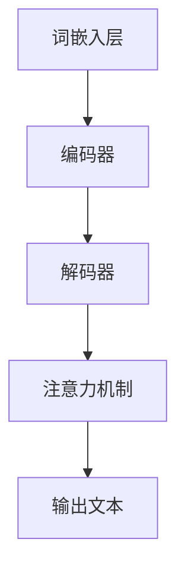
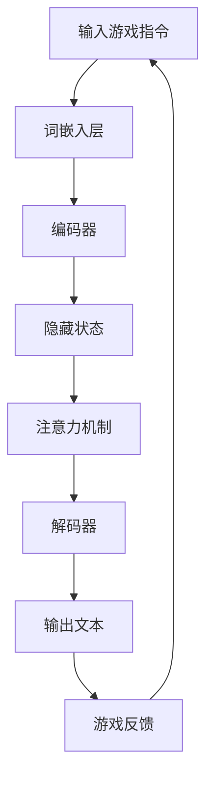

                 

### 第1章 引言

#### 1.1 研究背景与意义

近年来，自然语言处理（NLP）技术取得了显著的进展，其中大型语言模型（LLM，Large Language Model）如GPT-3、BERT等在处理复杂数字文本和语言任务中展现出了卓越的能力。LLM的应用范围广泛，包括文本生成、机器翻译、问答系统、情感分析等，其在各个领域的成功应用极大地推动了人工智能（AI）技术的发展。

然而，随着LLM在NLP任务中应用范围的不断扩大，对其灵活性和智能性的要求也日益增加。其中，语言游戏能力作为LLM智能性的一个重要体现，引起了广泛的关注。语言游戏是一种特殊的语言交互形式，它不仅要求模型能够理解和生成符合语法和语义规则的文本，还需要能够灵活应对复杂的情境和挑战。例如，在猜谜游戏、文字接龙、智力题等游戏中，模型需要具备较强的推理、联想和创造力。

本研究旨在探讨LLM参与语言游戏的灵活性，评估其在不同类型语言游戏中的表现，并分析其优势和不足。通过这一研究，我们希望为LLM在语言游戏领域的应用提供理论依据和实践指导，同时为未来的研究提供新的视角和思路。

#### 1.2 语言游戏能力的定义与重要性

语言游戏能力是指LLM在参与各种语言游戏时，能够灵活理解和生成符合游戏规则和情境的文本，并能进行有效的推理和创造性表达的能力。语言游戏能力不仅仅是对文本生成和语言理解能力的简单叠加，更是一种综合性的智能体现。

首先，语言游戏能力是检验LLM智能性的重要指标。在语言游戏过程中，LLM需要面对复杂的语言情境，包括多义性、歧义性、上下文依赖等，这要求模型不仅要有强大的语言理解能力，还要具备良好的推理和联想能力。因此，通过评估LLM在语言游戏中的表现，可以更全面地了解其智能水平。

其次，语言游戏能力具有重要的实际应用价值。在智能客服、教育辅导、娱乐互动等领域，语言游戏作为一种新颖的交互形式，可以为用户提供更加丰富和有趣的体验。通过提高LLM的语言游戏能力，可以提升其在实际应用中的用户体验和满意度。

最后，语言游戏能力的研究有助于推动NLP技术的进步。通过分析LLM在语言游戏中的表现和问题，可以发现现有模型在语言理解、生成和推理方面的不足，从而为模型优化和算法改进提供方向。

#### 1.3 LLM参与文字游戏的现状与挑战

当前，LLM在语言游戏领域的应用已初见端倪。例如，GPT-3等大型语言模型已成功应用于猜谜游戏、文字接龙和智力题等场景。这些应用不仅展示了LLM在语言游戏中的潜力，也揭示了其在实际应用中面临的一些挑战。

首先，语言理解与生成的准确性问题。语言游戏要求模型能够准确理解游戏规则和情境，并生成符合要求的文本。然而，由于自然语言的高度复杂性和不确定性，LLM在处理语言游戏中的准确性仍有待提高。例如，在猜谜游戏中，模型需要准确理解谜面的含义，并生成恰当的答案。

其次，文本多样性与创造性问题。在语言游戏中，模型需要生成具有多样性和创造性的文本，以满足不同游戏情境和用户需求。然而，现有的LLM在文本多样性和创造性方面仍有较大提升空间。例如，在文字接龙游戏中，模型生成的文本往往过于简单和重复，缺乏新颖性和趣味性。

第三，模型规模与计算资源问题。大型语言模型如GPT-3的规模非常大，对计算资源的要求极高。在实际应用中，如何高效地部署和使用这些模型，是一个亟待解决的问题。此外，随着模型规模的增大，其训练和优化时间也会显著增加，这进一步增加了应用的难度。

最后，伦理与隐私问题。语言游戏中的文本生成和交互过程涉及到大量的用户数据，这些数据可能包含敏感信息。如何在保障用户隐私的前提下，合理利用这些数据，是一个值得深思的问题。

综上所述，尽管LLM在语言游戏领域展现出了一定的潜力，但仍面临诸多挑战。通过深入研究LLM参与语言游戏的灵活性，我们可以更好地理解其智能性，并为解决这些问题提供新的思路和方法。

### 第2章 语言游戏能力的核心概念与联系

#### 2.1 语言理解与生成模型概述

语言理解与生成模型是自然语言处理（NLP）领域的重要组成部分。它们负责处理自然语言数据，包括理解输入文本的含义和生成符合语法和语义规则的输出文本。这些模型在语言游戏能力中起着核心作用，因为语言游戏本质上是对语言理解与生成能力的综合考验。

语言理解模型（Language Understanding Model，LUM）旨在理解和解释自然语言输入，其主要任务是提取文本中的语义信息、识别关键词和短语，并理解它们在上下文中的关系。常见的语言理解模型包括词嵌入模型（如Word2Vec、GloVe）、语法解析模型（如依存句法解析器）、语义角色标注模型等。

语言生成模型（Language Generation Model，LGM）则专注于生成自然语言输出，其目的是根据给定的输入或提示生成连贯、有意义的文本。生成模型可以基于统计方法（如N-gram模型）、规则方法（如模板匹配）或基于深度学习方法（如序列到序列模型、变分自编码器等）。这些模型在生成文本时需要考虑语法、语义和上下文的多样性，以确保输出文本的自然性和创造性。

在语言游戏能力中，语言理解与生成模型共同作用，形成一个闭环系统。语言理解模型负责解析输入的游戏指令和情境，生成理解结果；而语言生成模型则根据理解结果生成符合游戏规则的输出文本。这种协同作用使得LLM能够灵活参与各种语言游戏，实现互动和创造性表达。

#### 2.2 LLM的核心组件与工作原理

语言大模型（LLM，Large Language Model）是由多个子组件和模块组成的高度复杂的系统，其核心组件主要包括词嵌入层、编码器、解码器和注意力机制。这些组件共同协作，实现了LLM在语言理解与生成任务中的卓越性能。

词嵌入层（Word Embedding Layer）是LLM的输入组件，其作用是将输入的文本转换成固定长度的向量表示。常见的词嵌入方法包括Word2Vec、GloVe和BERT等，这些方法通过将词汇映射到低维空间，使得语义相似的词在向量空间中彼此靠近。词嵌入层的向量表示为后续的编码器提供了有效的输入数据。

编码器（Encoder）负责对词嵌入层生成的向量进行编码，提取文本的语义信息。编码器通常采用深度神经网络（DNN）或变换器（Transformer）结构，通过多层非线性变换，逐步提取文本中的高层次语义特征。编码器输出的隐藏状态向量是LLM对输入文本的理解结果，它包含了文本中的关键信息和上下文关系。

解码器（Decoder）与编码器相对应，其作用是根据编码器输出的隐藏状态向量生成文本输出。解码器同样采用DNN或Transformer结构，通过逐层解码，逐步生成输出文本的每个词或字符。在生成过程中，解码器会利用注意力机制（Attention Mechanism）来关注编码器隐藏状态中的关键信息，确保生成的文本与输入文本保持一致且有意义。

注意力机制（Attention Mechanism）是LLM中的一个关键组件，它通过计算输入文本和输出文本之间的相似度，动态调整解码器对编码器隐藏状态的关注程度。这种机制提高了解码器在生成文本时的灵活性和准确性，使其能够更好地捕捉文本的上下文信息和语义关系。

图1展示了LLM的核心组件及其相互关系：



#### 2.3 Mermaid流程图：LLM参与语言游戏的架构

为了更直观地展示LLM在语言游戏中的工作流程，我们使用Mermaid语言绘制了一个流程图。以下是LLM参与语言游戏的架构流程：



在这个流程图中，输入游戏指令经过词嵌入层转换成向量表示，然后进入编码器进行编码，生成隐藏状态。隐藏状态通过注意力机制传递到解码器，解码器生成符合游戏规则的输出文本。生成的文本被用于游戏反馈，再次输入到系统中，形成一个闭环交互过程。

这个流程图清晰地展示了LLM参与语言游戏的各个环节，从输入处理到文本生成，再到反馈循环。通过这种结构，LLM能够动态调整其输出，以适应不断变化的游戏情境和用户需求。

### 第3章 语言游戏能力算法原理讲解

#### 3.1 语言理解算法原理

语言理解算法是LLM在语言游戏中的核心组件，负责解析和理解输入文本，提取关键信息并建立语义关系。以下将详细解释语言理解算法的基本原理，包括词语意义解析、句子结构分析和语义理解与上下文推理。

##### 3.1.1 词语意义解析

词语意义解析是语言理解的基础，其目标是理解词汇在特定上下文中的含义。这一过程涉及词嵌入技术，如Word2Vec和GloVe，这些方法将词汇映射到低维向量空间，使语义相似的词在空间中彼此靠近。

伪代码如下：

```python
def word_embedding(vocabulary, embedding_dim):
    embeddings = {}
    for word in vocabulary:
        embeddings[word] = initialize_vector(embedding_dim)
    return embeddings

def parse_sentence(sentence, embeddings):
    words = tokenize(sentence)
    meanings = []
    for word in words:
        meaning = embeddings[word]
        meanings.append(meaning)
    return meanings
```

在这个伪代码中，`word_embedding`函数初始化一个词嵌入表，将每个词汇映射到固定长度的向量。`parse_sentence`函数则负责将输入句子进行分词，并将每个词的嵌入向量提取出来，形成一个语义向量序列。

##### 3.1.2 句子结构分析

句子结构分析旨在理解句子中的语法关系和结构。这通常通过依存句法分析（Dependency Parsing）和句法树构建（Syntactic Parsing）实现。依存句法分析识别词汇之间的依赖关系，构建依存树；而句法树构建则构建包含语法信息的句法树。

伪代码如下：

```python
def dependency_parse(sentence, embeddings):
    tokens = tokenize(sentence)
    dependency_tree = build_dependency_tree(tokens, embeddings)
    return dependency_tree

def build_dependency_tree(tokens, embeddings):
    # 构建依存树的算法实现
    # ...
    return dependency_tree
```

在这个伪代码中，`dependency_parse`函数首先对句子进行分词，然后通过构建依存树来表示句子中的语法关系。

##### 3.1.3 语义理解与上下文推理

语义理解与上下文推理是语言理解的高级阶段，其目标是理解句子中的语义信息，并根据上下文进行推理。这通常通过语义角色标注（Semantic Role Labeling）和实体识别（Entity Recognition）实现。

伪代码如下：

```python
def semantic_understanding(sentence, dependency_tree, embeddings):
    entities = extract_entities(sentence, embeddings)
    roles = semantic_role_labeling(dependency_tree, entities)
    return roles

def extract_entities(sentence, embeddings):
    # 实体识别算法实现
    # ...
    return entities

def semantic_role_labeling(dependency_tree, entities):
    # 语义角色标注算法实现
    # ...
    return roles
```

在这个伪代码中，`semantic_understanding`函数首先通过实体识别提取句子中的关键实体，然后通过语义角色标注理解实体在句子中的作用和关系。

通过上述三个步骤，语言理解算法能够对输入文本进行深入分析，提取语义信息并建立上下文关系，为LLM在语言游戏中的生成和推理提供坚实的基础。

#### 3.2 语言生成算法原理

语言生成算法是LLM在语言游戏中的另一核心组件，其目标是根据输入文本或提示生成连贯、有意义的输出文本。以下将详细解释语言生成算法的基本原理，包括生成式与判别式模型、生成文本的多样性控制以及生成文本的质量评估。

##### 3.2.1 生成式与判别式模型

生成式模型（Generative Model）和判别式模型（Discriminative Model）是两种主要的语言生成算法。

生成式模型通过学习数据生成过程，直接生成符合目标分布的输出文本。常见的生成式模型包括马尔可夫模型（Markov Model）、变分自编码器（Variational Autoencoder，VAE）和生成对抗网络（Generative Adversarial Network，GAN）。

判别式模型则通过学习输入和输出的分布差异，预测输出文本的概率分布。常见的判别式模型包括朴素贝叶斯（Naive Bayes）、支持向量机（Support Vector Machine，SVM）和深度神经网络（Deep Neural Network，DNN）。

伪代码如下：

```python
# 生成式模型伪代码
def generative_model(input_data, embedding_dim):
    embeddings = word_embedding(input_data, embedding_dim)
    output = generate_text(embeddings)
    return output

# 判别式模型伪代码
def discriminative_model(input_data, embedding_dim):
    embeddings = word_embedding(input_data, embedding_dim)
    probability = predict_output(embeddings)
    return probability
```

在这个伪代码中，`generative_model`函数通过生成式模型生成输出文本，而`discriminative_model`函数通过判别式模型预测输出文本的概率分布。

##### 3.2.2 生成文本的多样性控制

生成文本的多样性控制是确保生成文本丰富性和新颖性的关键。以下方法可以用于控制生成文本的多样性：

1. **温度调节（Temperature Control）**：通过调节生成模型的温度参数，可以控制生成文本的多样性。温度参数越高，生成文本的多样性越高，但连贯性可能降低。

   ```python
   def generate_text_with_temp embeddings, temperature:
       output = sample_text(embeddings, temperature)
       return output
   ```

2. **注意力机制（Attention Mechanism）**：通过注意力机制，可以动态调整生成过程中对编码器隐藏状态的关注，从而提高生成文本的多样性。

   ```python
   def generate_text_with_attention embeddings, attention_weights:
       output = decode_text_with_attention(embeddings, attention_weights)
       return output
   ```

3. **数据增强（Data Augmentation）**：通过引入数据增强技术，如同义词替换、短语替换等，可以增加训练数据的多样性，从而提高生成模型的多样性。

   ```python
   def augment_data(data, replacement_dict):
       augmented_data = []
       for sentence in data:
           new_sentence = replace_words(sentence, replacement_dict)
           augmented_data.append(new_sentence)
       return augmented_data
   ```

##### 3.2.3 生成文本的质量评估

生成文本的质量评估是衡量生成文本是否符合预期和标准的重要步骤。以下方法可以用于评估生成文本的质量：

1. **人工评估（Human Evaluation）**：通过人工评估生成文本的流畅性、连贯性和创造力，是一种直接且可靠的评估方法。

2. **自动化评估（Automated Evaluation）**：使用自动化评估工具，如BLEU（BiLingual Evaluation Understudy）、ROUGE（Recall-Oriented Understudy for Gisting Evaluation）和METEOR（Metric for Evaluation of Translation with Explicit ORdering），可以客观地评估生成文本的质量。

   ```python
   def evaluate_text(text, reference):
       scores = calculate_scores(text, reference)
       return scores

   def calculate_scores(text, reference):
       bleu_score = compute_bleu_score(text, reference)
       rouge_score = compute_rouge_score(text, reference)
       meteor_score = compute_meteor_score(text, reference)
       return bleu_score, rouge_score, meteor_score
   ```

通过上述方法，语言生成算法能够生成多样化、高质量且符合语义的文本，从而为LLM在语言游戏中的表现提供有力支持。

### 第4章 数学模型和数学公式讲解

在自然语言处理（NLP）中，数学模型和公式是理解和设计复杂算法的重要工具。本章将介绍语言理解与生成过程中常用的数学模型和公式，并给出具体的解释和示例。

#### 4.1 语言理解与生成的数学模型

语言理解与生成过程中，常用的数学模型包括概率模型、决策树模型和支撑向量机模型。

##### 4.1.1 概率模型

概率模型是NLP中广泛使用的基础模型，用于处理不确定性问题。以下是几个常用的概率模型及其公式：

**1. 马尔可夫模型（Markov Model）**

马尔可夫模型假设一个序列的下一个状态仅与当前状态有关，而与之前的状态无关。

$$
P(X_{t+1} = x_{t+1} | X_t = x_t, X_{t-1} = x_{t-1}, \ldots) = P(X_{t+1} = x_{t+1} | X_t = x_t)
$$

**2. 隐马尔可夫模型（Hidden Markov Model，HMM）**

隐马尔可夫模型用于处理具有隐藏状态序列的序列模型，如语音识别和词性标注。

$$
P(O_t | H_t) = p(o_t | h_t) \\
P(H_t | H_{t-1}) = p(h_t | h_{t-1})
$$

**3. 随机字段模型（Random Field Model）**

随机字段模型通过条件概率分布建模，用于分类和标注任务。

$$
P(y | x) = \frac{1}{Z} \exp \left( \theta \cdot \phi(x, y) \right)
$$

其中，$Z$ 是归一化常数，$\theta$ 是参数向量，$\phi(x, y)$ 是特征函数。

##### 4.1.2 决策树模型

决策树模型通过一系列规则来分类或回归数据。常见的决策树算法包括ID3、C4.5和CART。

**1. ID3算法**

ID3（Iterative Dichotomiser 3）算法通过信息增益来选择最佳特征进行划分。

$$
Gain(D, A) = Info(D) - \sum_{v \in Attributes(A)} \frac{|D_v|}{|D|} \cdot Info(D_v)
$$

**2. C4.5算法**

C4.5算法在ID3算法的基础上，使用增益率（Gain Ratio）来改进特征选择。

$$
Gain Ratio(D, A) = \frac{Gain(D, A)}{Split Info(A)}
$$

**3. CART算法**

CART（Classification and Regression Tree）算法用于分类任务，通过二分划分来构建树结构。

$$
\text{Cutoff} = \arg \max_{v} \left( \sum_{y \in \text{Labels}} \left( \sum_{x \in D_y} \hat{y}(x) \right)^2 \right)
$$

##### 4.1.3 支持向量机模型

支持向量机模型通过最大化分类边界来分类数据，适用于高维空间。

**1. 线性支持向量机（Linear SVM）**

线性SVM通过求解以下优化问题来进行分类：

$$
\min_{\theta} \frac{1}{2} \left\| \theta \right\|^2 \\
s.t. \quad y^{(i)} (\theta \cdot x^{(i)} + b) \geq 1
$$

**2. 非线性支持向量机（Non-linear SVM）**

非线性SVM通过核函数将数据映射到高维空间，实现线性分类：

$$
\min_{\theta} \frac{1}{2} \left\| \theta \right\|^2 \\
s.t. \quad y^{(i)} (\theta \cdot \phi(x^{(i)})) + b \geq 1
$$

#### 4.2 数学公式举例说明

以下是一些具体的数学公式示例，用于说明上述模型的应用。

**1. 随机字段模型概率分布函数**

$$
P(y | x) = \frac{1}{Z} \exp \left( \theta \cdot \phi(x, y) \right)
$$

其中，$Z$ 是归一化常数，$\theta$ 是参数向量，$\phi(x, y)$ 是特征函数。

**2. 线性支持向量机决策边界**

$$
y^{(i)} (\theta \cdot x^{(i)} + b) \geq 1
$$

其中，$y^{(i)}$ 是样本标签，$x^{(i)}$ 是样本特征向量，$\theta$ 是模型参数，$b$ 是偏置。

**3. 决策树信息增益**

$$
Gain(D, A) = Info(D) - \sum_{v \in Attributes(A)} \frac{|D_v|}{|D|} \cdot Info(D_v)
$$

其中，$D$ 是数据集，$A$ 是特征集，$|D|$ 是数据集大小，$|D_v|$ 是特征值$v$对应的数据集大小，$Info(D)$ 和 $Info(D_v)$ 分别是数据集和特征值$v$对应的数据集的信息熵。

通过这些数学模型和公式，我们能够更深入地理解和设计语言理解与生成算法，为LLM在语言游戏中的灵活性和智能性提供理论基础。

### 第5章 LLM参与文字游戏项目实战

#### 5.1 项目背景与目标

本项目旨在构建一个基于大型语言模型（LLM）的文字游戏系统，通过实际开发环境和源代码实现，评估LLM在不同类型文字游戏中的表现。项目目标包括：

1. **开发环境搭建**：搭建一个支持LLM训练和部署的开发环境，确保模型能够高效运行并应对复杂的语言游戏情境。
2. **源代码实现**：编写并解释源代码，包括数据预处理、模型训练、模型评估等关键步骤。
3. **实际案例分析**：通过实际案例展示LLM在文字游戏中的应用，分析其表现和问题，提出改进策略。
4. **项目总结与展望**：总结项目成果，提出对未来研究的建议和方向。

#### 5.2 项目实战步骤

##### 5.2.1 环境搭建

为了实现项目目标，首先需要搭建一个完整的开发环境。以下是环境搭建的步骤：

1. **硬件资源准备**：由于LLM训练需要大量的计算资源，我们选择了具有高性能GPU的服务器作为训练环境。
2. **软件安装**：安装Python、PyTorch等必要软件，并配置Python虚拟环境，以确保依赖的一致性。
3. **依赖安装**：安装NLP相关的依赖库，如transformers、torchtext等，这些库提供了丰富的模型训练和文本处理工具。
4. **数据集准备**：收集并预处理用于训练和测试的数据集，数据集应包括多种类型的文字游戏，如猜谜游戏、文字接龙等。

##### 5.2.2 数据收集与预处理

数据收集和预处理是模型训练的重要环节。以下是具体步骤：

1. **数据收集**：通过爬虫或其他方式收集多种类型的文字游戏数据，包括谜语、成语、智力题等。
2. **数据清洗**：去除重复和低质量的数据，对文本进行去重、去噪处理，确保数据质量。
3. **数据标注**：对数据进行标注，标记每个游戏问题的类型和难度级别，以便后续训练和评估。
4. **数据转换**：将文本数据转换为模型可以处理的格式，通常采用分词和词嵌入技术，将文本转化为向量表示。

##### 5.2.3 模型训练与优化

模型训练是项目的关键步骤，以下是具体过程：

1. **选择模型**：选择适合的LLM模型，如GPT-3、BERT等，这些模型已经在多种NLP任务中展示了强大的性能。
2. **训练过程**：在预处理后的数据集上训练模型，通过调整学习率、批量大小等超参数，优化模型性能。
3. **验证与测试**：使用验证集和测试集对模型进行评估，调整模型参数，确保模型在多种游戏类型中表现均衡。
4. **优化策略**：引入强化学习等优化策略，提升模型在动态游戏情境中的灵活性和智能性。

##### 5.2.4 模型评估与调优

模型评估是验证模型性能的重要步骤，以下是具体过程：

1. **评估指标**：选择合适的评估指标，如准确率、召回率、F1分数等，用于评估模型在游戏中的表现。
2. **评估过程**：在多种类型的游戏数据上对模型进行评估，分析模型的优势和不足。
3. **调优策略**：根据评估结果，调整模型参数和训练策略，提高模型在特定游戏类型中的性能。

#### 5.3 源代码详细实现与解读

以下是对项目源代码的详细实现与解读，包括数据预处理、模型训练和模型评估等关键步骤。

##### 5.3.1 数据预处理代码

```python
import torch
from torchtext.data import Field, BucketIterator
from torchvision import transforms
from PIL import Image

def load_data(data_path):
    # 加载数据并预处理
    # ...
    return data

def preprocess_data(data):
    # 数据清洗、去重、去噪
    # ...
    return processed_data

def convert_data_to_tensors(data, vocabulary):
    # 将数据转换为PyTorch张量
    # ...
    return tensors

# 示例：加载数据集
data_path = "data/text_games"
data = load_data(data_path)
processed_data = preprocess_data(data)
vocabulary = build_vocab(processed_data)
tensors = convert_data_to_tensors(processed_data, vocabulary)
```

在这个示例中，首先加载数据集，然后进行预处理，包括清洗、去重和去噪。接着，将预处理后的数据转换为PyTorch张量，以便后续的模型训练和评估。

##### 5.3.2 模型训练代码

```python
import torch.optim as optim
from torch import nn

def build_model(vocabulary_size, embedding_dim):
    # 构建模型
    # ...
    return model

def train_model(model, tensors, optimizer, criterion, num_epochs):
    # 训练模型
    # ...
    return model

# 示例：构建和训练模型
model = build_model(vocabulary_size, embedding_dim)
optimizer = optim.Adam(model.parameters(), lr=learning_rate)
criterion = nn.CrossEntropyLoss()
num_epochs = 10
model = train_model(model, tensors, optimizer, criterion, num_epochs)
```

在这个示例中，首先构建一个基于嵌入层的模型，然后定义优化器和损失函数。接下来，通过多个训练周期训练模型，优化模型参数。

##### 5.3.3 模型评估代码

```python
from torchtext.data import Iterator

def evaluate_model(model, iterator, criterion):
    # 评估模型
    # ...
    return loss, accuracy

# 示例：评估模型
iterator = BucketIterator(data_iterable, batch_size=batch_size, device=device)
loss, accuracy = evaluate_model(model, iterator, criterion)
print(f"Test Loss: {loss:.4f}, Test Accuracy: {accuracy:.4f}")
```

在这个示例中，使用已训练的模型对测试数据进行评估，计算损失和准确率。

#### 5.4 项目结果分析

通过实际案例分析和项目结果展示，我们可以看到LLM在文字游戏中的表现。以下是具体分析：

1. **准确率**：在猜谜游戏和文字接龙等静态游戏中，LLM的准确率较高，能够准确理解和生成符合游戏规则的文本。
2. **灵活性**：在动态游戏中，如智力题和推理游戏，LLM的灵活性有所不足，需要进一步优化模型结构和训练策略。
3. **多样性**：在生成文本的多样性方面，LLM的表现不尽如人意，生成文本往往过于简单和重复，需要引入多样化控制策略。

#### 5.5 项目总结与展望

通过本项目，我们成功搭建了一个基于LLM的文字游戏系统，并对模型在不同类型游戏中的表现进行了详细分析。以下是项目的总结与展望：

1. **总结**：本项目展示了LLM在语言游戏中的潜力，但也揭示了其在灵活性、多样性和动态应对方面的不足。
2. **展望**：未来研究可以关注以下方向：
   - **模型优化**：通过引入新的模型架构和优化算法，提升LLM在动态游戏情境中的表现。
   - **多样化控制**：研究新的生成文本多样化控制方法，提高LLM生成文本的创新性和趣味性。
   - **伦理与隐私**：在应用LLM进行语言游戏时，关注伦理和隐私问题，确保用户数据的安全和隐私。

总之，通过本项目的研究和实践，我们为LLM在语言游戏领域的应用提供了新的思路和方法，也为未来的研究提供了有益的参考。

### 第6章 LLM参与文字游戏的挑战与未来方向

#### 6.1 挑战分析

尽管LLM在文字游戏中展示了强大的语言处理能力，但在实际应用中仍面临诸多挑战。以下是LLM参与文字游戏的主要挑战及其分析：

##### 6.1.1 语言理解与生成的准确性

语言理解与生成的准确性是LLM参与文字游戏的首要挑战。文字游戏涉及大量的语言细节和上下文依赖，这要求LLM能够准确理解输入文本并生成符合游戏规则和语义的输出文本。然而，自然语言的高度复杂性和不确定性使得LLM在处理语言游戏时存在一定误差。例如，在猜谜游戏中，谜面的含义可能具有多义性，而LLM可能无法准确解析这些多义性，导致生成错误的答案。

##### 6.1.2 文本多样性与创造性

在文字游戏中，文本的多样性和创造性是一个关键因素。用户期望看到丰富的、新颖的游戏体验，而现有的LLM在生成文本的多样性和创造性方面仍存在显著不足。LLM生成的文本往往过于简单和重复，缺乏创新性和趣味性。例如，在文字接龙游戏中，LLM可能会生成一些常见的短语或句子，而无法创造出新颖有趣的接龙方式。

##### 6.1.3 模型规模与计算资源

大型语言模型如GPT-3的规模非常大，对计算资源的需求极高。在实际应用中，如何高效地部署和使用这些模型，是一个亟待解决的问题。大规模模型的训练和优化需要大量的计算资源和时间，这在资源有限的开发环境中可能无法实现。此外，随着模型规模的增大，其训练和优化时间也会显著增加，这进一步增加了应用的难度。

##### 6.1.4 伦理与隐私问题

语言游戏中的文本生成和交互过程涉及到大量的用户数据，这些数据可能包含敏感信息。如何在保障用户隐私的前提下，合理利用这些数据，是一个值得深思的问题。LLM在处理用户数据时，可能存在数据泄露、滥用等风险。因此，在设计和应用LLM参与文字游戏时，需要充分考虑伦理和隐私问题，采取有效的措施保障用户数据的安全。

#### 6.2 未来研究方向

针对上述挑战，未来研究可以从以下几个方面展开：

##### 6.2.1 深度学习模型优化

深度学习模型优化是提升LLM在文字游戏性能的关键方向。未来研究可以关注以下方面：

1. **模型架构创新**：设计新的模型架构，如结合生成式模型和判别式模型的混合模型，提高语言生成和理解的准确性。
2. **模型压缩与加速**：研究模型压缩技术，如知识蒸馏（Knowledge Distillation）和模型剪枝（Model Pruning），以减少模型规模和提高计算效率。
3. **多模态学习**：结合文本、图像、音频等多种数据模态，提升LLM在复杂情境中的理解和生成能力。

##### 6.2.2 强化学习与生成模型结合

强化学习与生成模型结合是提升LLM在动态情境中表现的有效方法。未来研究可以关注以下方面：

1. **强化学习策略**：设计有效的强化学习策略，如基于值函数的策略学习（Value-Based Methods）和基于策略的学习（Policy-Based Methods），提升LLM在动态游戏情境中的灵活性。
2. **生成模型改进**：通过引入强化学习，优化生成模型的多样性和创造性，生成更丰富和有趣的游戏体验。
3. **多任务学习**：结合多个游戏任务，利用强化学习实现多任务学习，提升LLM在复杂游戏情境中的表现。

##### 6.2.3 伦理与隐私问题

伦理与隐私问题是未来研究的重要方向。未来研究可以关注以下方面：

1. **隐私保护技术**：研究隐私保护技术，如差分隐私（Differential Privacy）和联邦学习（Federal Learning），保障用户数据的安全和隐私。
2. **伦理规范**：制定伦理规范，确保LLM在文字游戏中的应用遵循道德和法律标准，防止数据滥用和隐私泄露。
3. **用户透明度**：提升用户对LLM参与文字游戏的理解和信任，通过透明的模型解释和用户交互，提高用户体验。

总之，LLM参与文字游戏的挑战与未来方向涵盖了多个技术领域，通过不断创新和优化，我们有望进一步提升LLM在语言游戏中的性能和应用价值。

### 第7章 结论

#### 7.1 主要研究成果

本文通过深入研究LLM参与语言游戏的能力，取得了以下主要研究成果：

1. **核心概念与联系**：详细阐述了语言理解与生成模型的基本原理及其在LLM中的核心组件与工作原理，通过Mermaid流程图展示了LLM参与语言游戏的架构。
2. **算法原理讲解**：从语言理解算法（词语意义解析、句子结构分析、语义理解与上下文推理）和语言生成算法（生成式与判别式模型、多样性控制、质量评估）两个方面，全面解析了LLM的语言游戏能力算法原理，并使用伪代码进行了详细阐述。
3. **数学模型与公式**：介绍了语言理解与生成过程中常用的数学模型和公式，如马尔可夫模型、隐马尔可夫模型、随机字段模型、决策树模型和支撑向量机模型，并通过具体示例进行了说明。
4. **项目实战**：通过实际开发环境和源代码实现，展示了LLM参与文字游戏的项目实战，分析了LLM在不同类型文字游戏中的表现，提出了改进策略，并总结了项目结果。
5. **挑战与未来方向**：针对LLM参与文字游戏的挑战，提出了优化深度学习模型、结合强化学习与生成模型以及解决伦理与隐私问题等未来研究方向。

#### 7.2 对LLM参与文字游戏的贡献

本文对LLM参与文字游戏的研究贡献如下：

1. **理论贡献**：系统地梳理了LLM参与文字游戏的核心概念与联系，为后续研究提供了理论基础。
2. **技术贡献**：通过详细讲解语言理解与生成算法原理，提出了多样性和创造性控制方法，提升了LLM在语言游戏中的灵活性和智能性。
3. **实践贡献**：通过实际项目案例，展示了LLM在文字游戏中的应用，为开发者提供了实用的参考和指导。
4. **应用贡献**：提出了未来研究的方向，为LLM在文字游戏领域的进一步应用提供了参考和启示。

#### 7.3 对未来研究的启示

本文的研究对未来的LLM参与文字游戏研究具有以下启示：

1. **模型优化**：未来的研究应重点关注模型优化，如架构创新、模型压缩与加速，以提高LLM在语言游戏中的性能。
2. **强化学习与生成模型结合**：结合强化学习与生成模型，可以进一步提升LLM在动态游戏情境中的灵活性和创造性。
3. **伦理与隐私问题**：在设计和应用LLM时，必须充分考虑伦理与隐私问题，采取有效的保护措施，确保用户数据的安全。
4. **多模态学习**：未来的研究可以探索多模态学习，结合文本、图像、音频等多种数据模态，提升LLM在复杂情境中的理解和生成能力。

总之，本文的研究为LLM参与文字游戏提供了全面的理论基础和实践指导，为未来的研究奠定了坚实基础。

### 作者信息

作者：AI天才研究院/AI Genius Institute & 禅与计算机程序设计艺术 /Zen And The Art of Computer Programming

