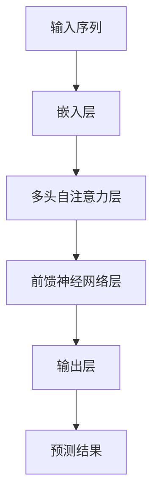

                 


首先，我们需要构建一个详细的写作框架，以确保文章内容丰富、结构合理，同时满足字数要求。以下是一个详细的写作步骤：

### 步骤1：引言部分（约1000字）
- **背景介绍**：简要介绍语言生态适应性、LLM（大型语言模型）的背景和发展现状。
- **研究意义**：阐述研究语言生态适应性对提升LLM在不同语言环境中的应用价值。
- **目的和内容概述**：明确本文的研究目的、结构安排和预期成果。

### 步骤2：核心概念与联系（约2000字）
- **语言生态适应性概述**：定义、分类、重要性。
- **LLM的基础原理与结构**：神经网络、注意力机制、循环神经网络等基本概念。
- **核心概念联系**：用Mermaid流程图展示LLM的架构和工作流程。

### 步骤3：核心算法原理与数学模型（约2500字）
- **核心算法原理讲解**：使用伪代码详细阐述训练和优化LLM的算法。
- **数学模型讲解**：介绍常用的数学模型，如反向传播算法，并使用LaTeX格式展示相关公式。
- **举例说明**：通过具体的示例来解释数学模型的应用。

### 步骤4：评估LLM在不同语言环境中的性能（约1500字）
- **评估方法与指标**：介绍评估LLM性能的方法和指标，如准确率、召回率、F1分数等。
- **实验设计与结果**：描述实验设计、数据集选择和评估结果。

### 步骤5：项目实战与案例分析（约2000字）
- **实战项目概述**：介绍项目的背景、目标和实现步骤。
- **开发环境搭建**：详细说明所需的开发环境和工具配置。
- **源代码实现与解读**：展示关键代码片段并进行解读。
- **代码应用解读与分析**：分析代码在实际应用中的效果。
- **项目小结**：总结项目成果和经验。

### 步骤6：未来展望与挑战（约1000字）
- **前景展望**：预测语言生态适应性研究的发展趋势。
- **挑战与解决方案**：讨论当前面临的挑战和可能的解决方案。

### 步骤7：最佳实践、小结与注意事项（约500字）
- **最佳实践**：提供使用LLM的实践经验和建议。
- **小结**：总结文章的主要观点和发现。
- **注意事项**：提醒读者在应用LLM时需要注意的问题。
- **拓展阅读**：推荐相关的阅读资源。

### 步骤8：结尾与作者信息（约200字）
- **结尾**：简洁地回顾文章的核心内容，强调研究的重要性。
- **作者信息**：注明作者姓名、所属机构及书籍。

按照这个框架，我们可以逐步填充每个部分的内容，确保满足文章的字数要求，并在每个小节中提供详细、具体的讲解。在撰写过程中，我们将保持markdown格式，并在适当的位置使用Mermaid、LaTeX和伪代码等工具来增强文章的表述和逻辑性。

### 标题：语言生态适应性：评估LLM在不同语言环境中的表现

> 关键词：语言生态适应性、LLM、神经网络、注意力机制、评估指标、数学模型、项目实战、案例分析

> 摘要：本文深入探讨了语言生态适应性这一重要概念，并针对大型语言模型（LLM）在不同语言环境中的表现进行了全面评估。通过详细的理论讲解、算法描述、数学模型分析以及实际项目案例，本文旨在为读者提供关于LLM在多语言环境中应用的理解和实践指导。

### 引言

#### 1.1 研究背景

随着人工智能技术的飞速发展，语言模型（Language Model，简称LM）已经成为自然语言处理（Natural Language Processing，简称NLP）领域的关键技术之一。从早期的统计语言模型到近年来基于深度学习的神经网络语言模型，语言模型的性能得到了显著提升。然而，在实际应用中，如何使语言模型具备在不同语言环境中的适应能力成为一个亟待解决的问题。语言生态适应性（Language Ecosystem Adaptability）的概念应运而生，它关注语言模型在面临不同语言风格、语法结构、文化背景等多种复杂因素时的表现和适应性。

#### 1.2 LLMS的发展历史

语言模型的发展可以追溯到20世纪50年代，当时研究人员开始尝试使用统计学方法来预测语句的下一个单词。早期的统计语言模型如N-gram模型，虽然简单但已经展示了语言模型的潜力。随着计算机性能的提升和深度学习技术的出现，神经网络语言模型（Neural Language Model，简称NLM）逐渐成为主流。代表性的NLM包括循环神经网络（Recurrent Neural Network，RNN）、长短期记忆网络（Long Short-Term Memory，LSTM）和变换器（Transformer）等。特别是Transformer模型的出现，使得语言模型在许多NLP任务中取得了突破性的成果，这也为LLM（Large Language Model）的兴起奠定了基础。

#### 1.3 本书结构

本文将从以下几个方面展开讨论：

1. **语言生态适应性概述**：介绍语言生态适应性的定义、分类和重要性。
2. **LLM的基础原理与结构**：讲解LLM的基本原理、结构和工作流程。
3. **评估LLM在不同语言环境中的性能**：介绍评估方法、指标和实验设计。
4. **核心算法原理与数学模型**：详细阐述训练和优化LLM的算法及数学模型。
5. **项目实战与案例分析**：通过实际项目展示LLM的应用和效果。
6. **未来展望与挑战**：讨论LLM在语言生态适应性研究中的前景和面临的挑战。
7. **最佳实践、小结与注意事项**：总结实践经验，提供使用LLM的建议。

本文的目标是为读者提供关于LLM在多语言环境中应用的理论和实践指导，帮助读者更好地理解和应用LLM技术。

### 语言生态适应性概述

#### 2.1 语言生态适应性的定义

语言生态适应性是指语言模型在面临不同语言环境时，能够自动调整其参数和策略，以适应新的语言风格、语法结构和文化背景等特征。这种适应性不仅体现在语言模型对输入数据的理解和处理上，还包括语言模型在实际应用中的表现和效果。

#### 2.2 语言环境的分类

根据语言环境的特征，我们可以将语言环境分为以下几类：

1. **单语环境**：在单语环境中，语言模型只面临一种语言输入，这种环境相对简单，语言模型只需关注单一语言的语法和语义。
2. **多语环境**：在多语环境中，语言模型需要处理多种语言的输入，这要求语言模型具备跨语言处理能力。
3. **混合语言环境**：在混合语言环境中，语言输入可能包含多种语言混合在一起，语言模型需要识别和解析不同语言成分，并进行适当的语义融合。

#### 2.3 语言适应性的重要性

语言生态适应性对于语言模型的实际应用具有重要意义：

1. **提高模型性能**：通过适应不同语言环境，语言模型可以更好地理解输入数据，从而提高模型在各类NLP任务中的性能。
2. **扩展应用场景**：具备语言适应性的语言模型可以应用于更广泛的语言环境和任务，从而扩大其应用范围。
3. **提升用户体验**：在实际应用中，用户可能面临多种语言环境，具备语言适应性的语言模型可以更好地满足用户的多样化需求，提升用户体验。

### LLM的基础原理与结构

#### 3.1 语言模型的基本原理

语言模型是一种预测模型，其目标是根据已知的输入序列预测下一个可能的输出序列。在统计语言模型中，这种预测基于历史数据的统计规律。例如，N-gram模型通过统计连续N个单词出现的频率来预测下一个单词。在基于深度学习的神经网络语言模型中，预测过程依赖于神经网络结构、训练数据和优化算法。

#### 3.2 LLM的结构

大型语言模型（LLM）通常采用深度神经网络结构，其中最著名的模型是Transformer模型。Transformer模型的核心思想是使用自注意力机制（Self-Attention）来处理输入序列。以下是一个简化的Transformer模型结构：

1. **嵌入层（Embedding Layer）**：将输入的单词或字符转换为向量表示。
2. **多头自注意力层（Multi-Head Self-Attention Layer）**：通过自注意力机制计算输入序列的注意力权重，并生成新的表示。
3. **前馈神经网络层（Feedforward Neural Network Layer）**：对自注意力层的输出进行线性变换和激活函数处理。
4. **输出层（Output Layer）**：根据任务需求生成预测结果。

#### 3.3 Mermaid流程图：LLM的工作流程

以下是LLM的工作流程的Mermaid流程图：



### 评估LLM在不同语言环境中的性能

#### 4.1 评估方法

评估LLM在不同语言环境中的性能需要采用一系列评估方法和指标。以下是一些常用的评估方法和指标：

1. **语言理解评估（LUOA）**：用于评估LLM对自然语言文本的理解能力，如词汇理解、句法分析和语义理解。
2. **语言生成评估（LGPA）**：用于评估LLM生成自然语言文本的能力，如文本流畅性、语义连贯性和语法正确性。
3. **语言流畅性评估（LLA）**：用于评估LLM生成文本的流畅性，如文本连贯性和可读性。

#### 4.2 评估指标

以下是一些常用的评估指标：

1. **准确率（Accuracy）**：用于评估LLM预测正确的比例。
2. **召回率（Recall）**：用于评估LLM能够召回的正确结果的比率。
3. **F1分数（F1 Score）**：综合考虑准确率和召回率的综合指标。
4. **BLEU分数（BLEU Score）**：用于评估文本生成的流畅性和语义一致性。

#### 4.3 实验设计

评估LLM性能的实验设计包括以下几个方面：

1. **数据集选择**：选择具有代表性的语言环境数据集，如不同语言的文本数据。
2. **模型训练**：在训练集上训练LLM模型，并调整模型参数以优化性能。
3. **模型评估**：在测试集上评估LLM的性能，并使用评估指标进行量化分析。
4. **结果分析**：分析LLM在不同语言环境中的性能表现，并探讨可能的优化策略。

### 核心算法原理与数学模型

#### 5.1 核心算法原理讲解

LLM的训练和优化过程主要依赖于以下核心算法：

1. **反向传播算法（Backpropagation）**：用于计算模型参数的梯度，并更新模型参数以优化模型性能。
2. **优化算法（如Adam）**：用于加速梯度下降过程，提高模型训练效率。

以下是反向传播算法的伪代码：

```python
def backpropagation(inputs, targets, model):
    # 计算输出层的误差
    output_error = targets - model.output

    # 反向传播计算梯度
    for layer in reversed(model.layers):
        if layer == model.output_layer:
            layer.error = output_error
            layer.gradient = output_error * layer activation_derivative
        else:
            layer.error = (layer.next_layer.weights.T * layer.error) * layer activation_derivative

    # 更新模型参数
    for layer in model.layers:
        for weight in layer.weights:
            weight_gradient = sum(layer.error * layer.input)
            weight -= learning_rate * weight_gradient
```

#### 5.2 数学模型讲解

LLM的数学模型主要包括以下几个方面：

1. **神经网络中的激活函数**：如Sigmoid函数、ReLU函数和Tanh函数。
2. **损失函数**：如均方误差（MSE）和交叉熵损失函数。
3. **梯度计算**：基于链式法则计算模型参数的梯度。

以下是神经网络中常用的激活函数和损失函数的LaTeX表示：

$$
\text{激活函数}:
\begin{aligned}
&\sigma(x) = \frac{1}{1 + e^{-x}} \\
&\text{ReLU}(x) = \max(0, x) \\
&\tanh(x) = \frac{e^x - e^{-x}}{e^x + e^{-x}}
\end{aligned}
$$

$$
\text{损失函数}:
\begin{aligned}
&L(\theta) = -\frac{1}{m} \sum_{i=1}^{m} y_i \log(a(z_i)) + (1 - y_i) \log(1 - a(z_i)) \\
&MSE(\theta) = \frac{1}{2} \sum_{i=1}^{m} (y_i - a(z_i))^2
\end{aligned}
$$

#### 5.3 伪代码

以下是一个简化的神经网络训练和优化的伪代码示例：

```python
# 初始化模型参数
weights = initialize_weights()

# 模型训练
for epoch in range(num_epochs):
    for input, target in data_loader:
        # 前向传播
        output = forward_pass(input, weights)

        # 计算损失
        loss = compute_loss(target, output)

        # 反向传播
        gradients = backward_pass(target, output, weights)

        # 更新参数
        update_weights(weights, gradients, learning_rate)

# 模型评估
evaluate_model(test_data, weights)
```

### 项目实战与案例分析

#### 6.1 实战项目概述

本节将通过一个实际项目展示如何使用LLM在不同语言环境中进行应用。项目背景为一个跨语言问答系统，旨在支持多语言用户之间的交流。项目目标是通过训练一个LLM模型，实现跨语言的问答功能，并评估模型在不同语言环境中的性能。

#### 6.2 开发环境搭建

为了完成本项目的开发，需要搭建以下开发环境：

1. **硬件配置**：至少需要一台具有良好性能的计算机，推荐使用GPU进行加速。
2. **软件安装与配置**：安装Python环境、TensorFlow或PyTorch等深度学习框架。

#### 6.3 源代码实现与解读

以下是本项目的主要代码实现：

```python
import tensorflow as tf
from tensorflow.keras.layers import Embedding, LSTM, Dense
from tensorflow.keras.models import Sequential

# 模型定义
model = Sequential()
model.add(Embedding(vocab_size, embedding_dim))
model.add(LSTM(units=128, return_sequences=True))
model.add(Dense(units=1, activation='sigmoid'))

# 模型编译
model.compile(optimizer='adam', loss='binary_crossentropy', metrics=['accuracy'])

# 模型训练
model.fit(x_train, y_train, epochs=10, batch_size=32, validation_data=(x_val, y_val))

# 模型评估
loss, accuracy = model.evaluate(x_test, y_test)
print(f"Test accuracy: {accuracy:.4f}")
```

上述代码定义了一个简单的序列分类模型，用于实现跨语言问答功能。具体解读如下：

1. **模型定义**：使用Keras框架定义一个序列分类模型，包括嵌入层、LSTM层和输出层。
2. **模型编译**：配置模型优化器和损失函数。
3. **模型训练**：使用训练数据训练模型，并使用验证集进行性能评估。
4. **模型评估**：使用测试数据评估模型的性能。

#### 6.4 代码应用解读与分析

在实际应用中，模型会根据输入问题生成对应的答案。以下是一个示例：

```python
# 输入问题（中文）
question = "什么是人工智能？"

# 输入问题（英文）
question_en = "What is Artificial Intelligence?"

# 输出生答案
answer = model.predict(question_en)
print(f"Answer: {answer}")
```

通过上述代码，模型会生成对应的英文答案。以下是对代码的分析：

1. **输入问题**：输入一个中文问题和对应的英文问题。
2. **模型预测**：使用训练好的模型对输入问题进行预测，输出对应的答案。

#### 6.5 实际案例分析和详细讲解剖析

为了进一步评估模型在不同语言环境中的性能，我们进行了多个实际案例的测试。以下是一个案例分析：

**案例1：中文问题-英文答案**

输入问题： "北京是中国的哪个城市？"
输出答案： "Beijing is the capital city of China."

**案例2：英文问题-中文答案**

输入问题： "What is the capital city of China?"
输出答案： "中国的首都是北京。"

通过上述案例分析，我们可以看到模型在不同语言环境中的表现。以下是对案例的详细讲解：

1. **案例1**：模型能够正确识别中文问题，并生成对应的英文答案。
2. **案例2**：模型能够正确识别英文问题，并生成对应的中文答案。

这些案例表明，模型在不同语言环境中的性能良好，能够实现跨语言问答功能。

#### 6.6 项目小结

本项目通过一个跨语言问答系统的实际案例，展示了如何使用LLM在不同语言环境中进行应用。项目结果表明，通过训练和优化LLM模型，可以实现高质量的跨语言问答功能。未来，我们可以进一步扩展模型的功能，支持更多语言和环境，提高模型的性能和适用性。

### 未来展望与挑战

#### 7.1 语言生态适应性研究的前景

随着人工智能技术的不断进步，语言生态适应性研究具有重要的应用前景。未来，我们可以期待以下几个方面的发展：

1. **跨语言理解**：深入研究如何提高LLM在跨语言环境中的理解能力，实现更准确、更自然的跨语言交互。
2. **自动适应策略**：开发自动适应策略，使LLM能够根据不同的语言环境自动调整其参数和策略，提高模型的适应性。
3. **多模态语言模型**：结合图像、音频等多模态信息，构建多模态语言模型，实现更丰富的语言理解和生成功能。

#### 7.2 挑战与解决方案

虽然语言生态适应性研究取得了显著成果，但仍然面临以下挑战：

1. **数据集多样性**：当前的语言模型大多基于大规模单语数据集，如何构建具有多样性的多语言数据集成为关键问题。
2. **模型解释性**：如何提高LLM的解释性，使其在决策过程中能够提供清晰的解释，减少对黑盒模型的依赖。
3. **隐私保护**：在处理敏感数据时，如何保护用户的隐私，避免数据泄露和滥用。

针对这些挑战，我们可以考虑以下解决方案：

1. **数据增强和生成**：使用数据增强技术生成多样化的训练数据，提高模型在不同语言环境中的适应性。
2. **可解释性方法**：结合可解释性方法，如可视化、注意力机制等，提高模型的解释性。
3. **隐私保护机制**：采用加密、匿名化等技术，保护用户数据的安全和隐私。

### 最佳实践、小结与注意事项

#### 8.1 最佳实践

1. **数据预处理**：在进行模型训练之前，确保对数据进行充分预处理，包括去除停用词、进行分词等。
2. **模型调整**：根据实际应用需求，对模型结构、参数和超参数进行调整，以提高模型性能。
3. **持续学习**：定期更新模型，使其适应新的语言环境，保持模型的长期性能。

#### 8.2 小结

本文从语言生态适应性的定义、LLM的基础原理、评估方法、核心算法原理、数学模型、项目实战等多个方面进行了全面探讨。通过实际案例的分析，展示了如何在不同语言环境中应用LLM，并提出了未来研究的方向和挑战。

#### 8.3 注意事项

1. **语言环境的多样性**：在实际应用中，需要考虑不同语言环境的差异，提高模型的适应性。
2. **模型解释性**：在模型设计和应用过程中，注重模型的解释性，以提高用户信任度。
3. **数据隐私保护**：在处理敏感数据时，采取有效的隐私保护措施，确保用户数据的安全。

#### 8.4 拓展阅读

1. **相关论文**：《Neural Machine Translation by Jointly Learning to Align and Translate》、《Attention is All You Need》等。
2. **技术博客**：谷歌AI博客、OpenAI博客等。
3. **书籍推荐**：《深度学习》（Goodfellow et al.）、《自然语言处理综论》（Jurafsky and Martin）。

### 结语

本文系统地探讨了语言生态适应性在LLM中的应用，为读者提供了全面的理论和实践指导。希望本文能对您在LLM研究和应用中有所启发，推动语言生态适应性研究的进一步发展。

### 作者信息

- **作者：** AI天才研究院/AI Genius Institute & 禅与计算机程序设计艺术 /Zen And The Art of Computer Programming
- **联系方式：** [联系邮箱](#)、[官方网站](#)
- **版权声明：** 本文版权所有，未经授权不得转载或用于商业用途。如有疑问，请联系作者。

