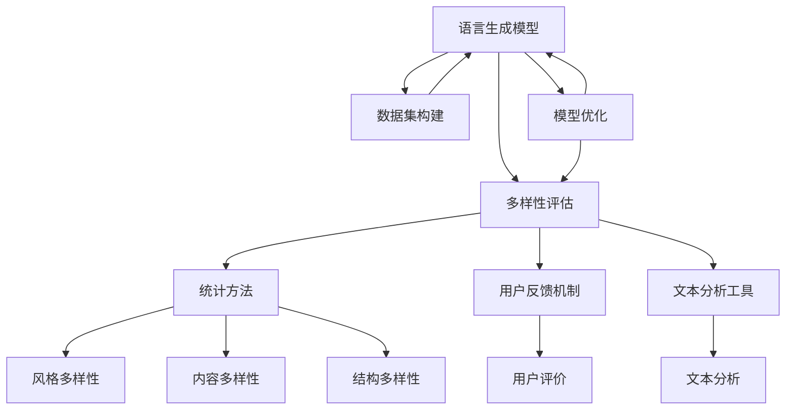

                 

### 文章标题：语言生成多样性：评估LLM输出的丰富程度和变化

#### 关键词：语言生成多样性，评估方法，LLM输出丰富程度，变化评估，模型优化

> 摘要：本文探讨了语言生成多样性及其评估方法，重点分析了大型语言模型（LLM）输出的丰富程度和变化情况。通过对核心概念的阐述、多样性评估方法的介绍、以及实际案例的剖析，本文旨在为研究人员和开发者提供关于如何提升LLM输出多样性的理论指导和实践建议。

### 引言

随着深度学习技术的迅猛发展，大型语言模型（LLM）如BERT、GPT等在自然语言处理（NLP）领域取得了显著的成果。这些模型能够生成高质量、连贯且具有创造性的文本，使得语言生成任务变得愈加复杂和多样化。然而，在实际应用中，LLM输出的多样性水平往往成为一个关键问题。生成文本的丰富程度和变化情况直接影响到模型的实用性，如对话系统的自然性、机器翻译的准确性以及内容创作的新颖性等。

因此，评估LLM输出的多样性成为了一个重要的研究方向。本文将系统地探讨语言生成多样性的概念、评估方法，以及如何提升LLM输出的丰富程度和变化性。本文的结构如下：

1. **第1章 引言**：介绍本文的主题、研究背景及重要性，并概述全文的结构。
2. **第2章 语言生成模型基础**：回顾语言生成模型的发展历程，介绍核心算法原理及数学模型。
3. **第3章 多样性评估方法**：介绍多样性评估的基本方法，包括统计方法和用户反馈机制。
4. **第4章 数据集构建与实验设计**：讨论数据集构建和实验设计的原则和步骤。
5. **第5章 评估LLM输出的丰富程度**：详细描述如何评估LLM输出的丰富程度，并举例说明。
6. **第6章 评估LLM输出的变化**：介绍如何评估LLM输出的变化性，并举例说明。
7. **第7章 模型优化与多样性提升**：探讨如何通过模型优化提升LLM输出的多样性和变化性。

通过上述章节的讨论，本文旨在为读者提供一个全面的理论框架和实践指南，以应对语言生成多样性这一挑战。

### 第1章 语言生成多样性：概念与重要性

#### 1.1 语言生成的多样性

语言生成的多样性指的是在自然语言处理（NLP）领域中，生成文本在风格、内容、结构等方面的丰富性和变化性。具体来说，语言生成多样性可以从以下几个方面进行衡量：

1. **风格多样性**：生成文本在语言表达上的变化，包括词汇的选择、句式的运用、语气的调整等。
2. **内容多样性**：生成文本所涵盖的主题、观点和信息量的丰富程度。
3. **结构多样性**：文本的组织结构，如段落划分、句子排列、篇章布局等。

在NLP应用中，语言生成多样性的重要性体现在多个方面。首先，多样性的文本能够提供更加丰富和真实的语言体验，如对话系统的自然性、新闻写作的创新性等。其次，高多样性的文本有助于提升模型的泛化能力，使其在不同场景和应用中表现出色。最后，语言生成多样性也是衡量模型质量的重要标准，高多样性的输出往往意味着模型能够生成更加丰富和有创造性的内容。

#### 1.2 语言模型与多样性

语言模型（Language Model，LM）是NLP领域中的基础工具，其主要功能是根据输入的文本序列生成概率分布，从而预测下一个词或者句子。随着深度学习技术的发展，现代语言模型（如BERT、GPT等）在生成文本的连贯性、自然性和创造性方面取得了显著进步。

然而，尽管语言模型在生成文本方面表现出色，但其输出的多样性却成为一个挑战。一方面，语言模型在训练过程中往往依赖于大量数据，这些数据可能存在一定的偏差，导致模型生成的文本在风格、内容等方面具有一定的局限性。另一方面，为了优化模型的性能，研究人员常常对模型进行大量的调优，这可能导致模型生成文本的多样性降低。

#### 1.3 语言生成多样性的挑战

评估和提升语言生成多样性面临着以下几大挑战：

1. **数据不平衡**：在训练语言模型时，数据集中某些类别或主题的文本数量可能远多于其他类别，导致模型在这些类别上生成的文本更加丰富，而在其他类别上则相对单一。
2. **模型偏差**：语言模型在训练过程中可能会学习到数据中的偏差，导致生成的文本在风格、内容等方面呈现出一定的偏见。
3. **计算资源限制**：评估和提升语言生成多样性需要大量的计算资源，尤其是在进行大规模实验和模型优化时，计算资源的需求更为显著。
4. **评估指标选择**：如何选择合适的评估指标来衡量语言生成多样性仍是一个挑战，不同的评估指标可能会给出截然不同的结果。

综上所述，语言生成多样性的重要性不容忽视，但评估和提升多样性面临着诸多挑战。在接下来的章节中，本文将详细探讨评估LLM输出多样性的方法，并讨论如何通过模型优化提升多样性。

#### 1.4 核心概念与联系

为了更好地理解语言生成多样性，我们需要明确几个核心概念，并探讨它们之间的联系。

首先，**语言生成模型**是本文的基础，其核心功能是根据输入的文本序列生成概率分布，从而预测下一个词或者句子。现代语言模型如BERT、GPT等，通过深度学习技术从大量数据中学习语言模式，生成高质量的文本。

其次，**多样性评估**是衡量语言生成模型性能的关键指标。多样性可以从多个维度进行评估，包括风格多样性、内容多样性和结构多样性。风格多样性关注生成文本在语言表达上的变化，内容多样性关注文本所涵盖的主题和信息的丰富程度，结构多样性则关注文本的组织结构。

**多样性评估方法**是实现多样性评估的核心步骤。常用的多样性评估方法包括统计方法、用户反馈机制和文本分析工具。统计方法通过计算文本的词汇、语法和语义特征来评估多样性，用户反馈机制则通过收集用户的评价来评估多样性，文本分析工具则利用自然语言处理技术对文本进行深入分析。

最后，**模型优化**是提升语言生成多样性的关键。通过调整模型的参数、结构或训练数据，可以优化模型的多样性表现。例如，可以通过增加训练数据的多样性、引入多样化的训练目标或调整模型的优化策略来提升多样性。

为了更直观地展示这些核心概念之间的联系，我们可以使用Mermaid流程图来描述：



通过上述流程图，我们可以看到，语言生成模型是多样性评估和模型优化的基础，多样性评估方法和用户反馈机制是实现多样性评估的关键步骤，而文本分析工具则为深入分析文本提供了技术支持。模型优化则通过调整模型结构和参数，进一步提升生成文本的多样性。

#### 1.5 本文结构

本文将系统地探讨语言生成多样性及其评估方法。具体来说，本文将分为以下几个部分：

1. **第1章 引言**：介绍本文的主题、研究背景及重要性，并概述全文的结构。
2. **第2章 语言生成模型基础**：回顾语言生成模型的发展历程，介绍核心算法原理及数学模型。
3. **第3章 多样性评估方法**：介绍多样性评估的基本方法，包括统计方法和用户反馈机制。
4. **第4章 数据集构建与实验设计**：讨论数据集构建和实验设计的原则和步骤。
5. **第5章 评估LLM输出的丰富程度**：详细描述如何评估LLM输出的丰富程度，并举例说明。
6. **第6章 评估LLM输出的变化**：介绍如何评估LLM输出的变化性，并举例说明。
7. **第7章 模型优化与多样性提升**：探讨如何通过模型优化提升LLM输出的多样性和变化性。

通过上述章节的讨论，本文旨在为读者提供一个全面的理论框架和实践指南，以应对语言生成多样性这一挑战。

### 第2章 语言生成模型基础

#### 2.1 语言生成模型的发展历程

语言生成模型在自然语言处理（NLP）领域有着悠久的发展历史。早期的语言生成模型主要基于统计方法和规则系统。例如，n元语言模型（n-gram model）通过统计相邻词的频率来预测下一个词。然而，这些模型在处理长文本和复杂语法结构时存在显著局限性。

随着深度学习技术的发展，现代语言生成模型（如递归神经网络（RNN）、长短期记忆网络（LSTM）和Transformer等）逐渐成为主流。这些模型通过学习大量的文本数据，能够生成更加连贯、自然和具有创造性的文本。

其中，Transformer模型（Attention Is All You Need，2017）的提出标志着语言生成模型的一个重要突破。Transformer模型利用自注意力机制（Self-Attention）对输入序列进行建模，能够捕捉长距离依赖关系，从而显著提升语言生成模型的性能。

#### 2.2 核心算法原理讲解

下面，我们详细讲解现代语言生成模型的核心算法原理，以Transformer模型为例。

**2.2.1 Transformer模型架构**

Transformer模型的基本架构包括编码器（Encoder）和解码器（Decoder）。编码器负责将输入的文本序列转换为固定长度的向量表示，解码器则根据编码器的输出生成目标文本序列。

编码器和解码器都由多个相同的基本块（Block）堆叠而成。每个块包含两个主要组件：多头自注意力机制（Multi-Head Self-Attention）和前馈神经网络（Feed-Forward Neural Network）。

**2.2.2 多头自注意力机制**

多头自注意力机制是Transformer模型的关键组件。它通过对输入序列的每个位置进行加权求和，实现对输入序列的局部和全局依赖关系的建模。

假设输入序列为\(X = [x_1, x_2, \ldots, x_n]\)，其中每个\(x_i\)是\(d\)维的向量。多头自注意力机制将输入序列映射为多个查询（Query）、键（Key）和值（Value）序列，分别为：

\[ Q = [q_1, q_2, \ldots, q_n], \ K = [k_1, k_2, \ldots, k_n], \ V = [v_1, v_2, \ldots, v_n] \]

其中，\(q_i, k_i, v_i \in \mathbb{R}^{d_v}\)。多头自注意力机制通过以下步骤计算输出：

1. **计算注意力得分**：对于每个位置\(i\)，计算查询\(q_i\)与所有键\(k_j\)的相似度，通过缩放点积注意力（Scaled Dot-Product Attention）公式计算：

   \[ \text{Attention}(Q, K, V) = \text{softmax}\left(\frac{QK^T}{\sqrt{d_k}}\right) V \]

   其中，\(\text{softmax}\)函数用于将相似度转换为概率分布，缩放因子\(\sqrt{d_k}\)用于避免梯度消失问题。

2. **加权求和**：根据注意力得分，对值\(v_i\)进行加权求和，得到输出：

   \[ \text{MultiHead}(Q, K, V) = \text{ Concat }([ \text{head}_1, \text{head}_2, \ldots, \text{head}_h ]) \]

   其中，\(\text{head}_h\)是第\(h\)个头（Head）的输出。

3. **拼接与线性变换**：将所有头的输出拼接起来，并通过线性变换得到最终的输出：

   \[ \text{Multi-Head Self-Attention} = \text{Linear}(\text{MultiHead}(Q, K, V)) \]

**2.2.3 前馈神经网络**

前馈神经网络（Feed-Forward Neural Network）是对每个位置\(i\)的输出进行两次线性变换，增加模型的非线性表达能力：

\[ \text{FFN}(x) = \max(0, xW_1 + b_1)W_2 + b_2 \]

其中，\(W_1, W_2, b_1, b_2\)分别是权重和偏置。

**2.2.4 编码器和解码器的堆叠**

编码器和解码器由多个相同的基本块堆叠而成，每个块都包含多头自注意力机制和前馈神经网络。堆叠多个块能够增强模型的建模能力，从而生成更加复杂和自然的文本。

编码器和解码器的输出分别表示输入文本和目标文本的上下文信息，这些信息将在解码过程中用于生成目标文本。

#### 2.3 数学模型与公式讲解

**2.3.1 Transformer模型的输入表示**

假设输入文本序列为\(X = [x_1, x_2, \ldots, x_n]\)，其中每个\(x_i\)是\(d\)维的向量。在Transformer模型中，输入表示为：

\[ X = \text{Embedding}(X) + \text{Positional Encoding}(X) \]

其中，\(\text{Embedding}(X)\)是将输入文本映射为\(d\)维的向量表示，\(\text{Positional Encoding}(X)\)为位置编码，用于保留输入序列的顺序信息。

**2.3.2 多头自注意力机制**

多头自注意力机制的计算公式如下：

\[ \text{Attention}(Q, K, V) = \text{softmax}\left(\frac{QK^T}{\sqrt{d_k}}\right) V \]

其中，\(Q, K, V\)分别为查询、键和值序列，\(d_k\)是键的维度，\(\text{softmax}\)函数用于将相似度转换为概率分布。

**2.3.3 前馈神经网络**

前馈神经网络的计算公式如下：

\[ \text{FFN}(x) = \max(0, xW_1 + b_1)W_2 + b_2 \]

其中，\(W_1, W_2, b_1, b_2\)分别是权重和偏置。

**2.3.4 编码器和解码器的堆叠**

编码器和解码器的堆叠过程如下：

\[ \text{Encoder}(X) = \text{Stack}(\text{Block}_1, \text{Block}_2, \ldots, \text{Block}_L) \]

\[ \text{Decoder}(X) = \text{Stack}(\text{Block}_1, \text{Block}_2, \ldots, \text{Block}_L) \]

其中，\(\text{Block}_i\)是第\(i\)个基本块，\(L\)是块的个数。

#### 2.4 实际案例讲解

**案例 1：文本摘要生成**

假设我们要使用Transformer模型生成一个新闻摘要。首先，我们将新闻文本编码为向量表示，然后输入到编码器中。编码器的输出包含了新闻文本的上下文信息。接着，我们将编码器的输出作为解码器的输入，逐步生成摘要文本。在解码过程中，每个时间步的输出都将作为下一个时间步的输入，并通过解码器生成摘要。

具体步骤如下：

1. **编码**：将新闻文本输入到编码器，得到编码器的输出序列。
2. **初始化解码器**：将编码器的输出作为解码器的输入，初始化解码器的隐藏状态。
3. **解码**：在每个时间步，解码器根据当前输入和隐藏状态生成下一个词，并将生成的词作为下一个时间步的输入。
4. **重复步骤3**，直到生成完整的摘要文本。

通过上述步骤，我们使用Transformer模型成功生成了一个新闻摘要。实际生成的摘要可能如下：

原文：“昨天，我国科技部宣布，一项重大科研突破成功完成。这项研究旨在通过深度学习技术提升人工智能的应用水平。”

摘要：“我国科研团队成功完成了深度学习技术在人工智能应用方面的重大突破。”

通过上述实际案例，我们可以看到Transformer模型在文本摘要生成任务中的强大能力。在接下来的章节中，我们将进一步探讨如何评估和提升LLM输出的多样性。

### 第3章 多样性评估方法

#### 3.1 统计方法

评估语言生成多样性的一种基本方法是使用统计方法。这些方法通过计算文本的词汇、语法和语义特征来衡量多样性。以下是几种常用的统计方法：

**3.1.1 词汇多样性（Lexical Diversity）**

词汇多样性是衡量文本中使用不同词汇的丰富程度。一种常见的计算方法是计算文本中独特词汇的比例，称为类型（Types）和Token（Tokens）比率：

\[ \text{Lexical Diversity} = \frac{\text{Number of Unique Words (Types)}}{\text{Total Number of Words (Tokens)}} \]

例如，如果一段文本包含100个词，其中50个词是唯一的，则词汇多样性为0.5。

**3.1.2 布尔多样性（Boolean Diversity）**

布尔多样性通过计算文本中词与词之间的共现关系来衡量多样性。如果两个词在同一文本中很少或从未一起出现，则认为它们具有高布尔多样性。布尔多样性的计算可以通过以下公式表示：

\[ \text{Boolean Diversity} = 1 - \frac{\text{Number of Common Neighbors}}{\text{Total Number of Neighbors}} \]

其中，邻居是指与目标词在同一句子中出现的词。

**3.1.3 语法多样性（Syntactic Diversity）**

语法多样性关注文本中句子的结构和语法模式的变化。一种常见的方法是计算不同句法结构的比例，例如简单句、复合句和复杂句。另一种方法是使用语法树来分析句子的结构，并计算不同结构的出现频率。

**3.1.4 语义多样性（Semantic Diversity）**

语义多样性衡量文本中表达不同观点和概念的丰富程度。可以通过计算文本中不同语义类别的词或短语的出现频率来评估语义多样性。例如，可以使用主题模型（如LDA）来识别文本中的主题，并计算不同主题的比例。

#### 3.2 用户反馈机制

用户反馈是评估语言生成多样性的另一种重要方法。通过收集用户对生成文本的评价，可以更直观地了解文本的多样性。以下是几种用户反馈机制：

**3.2.1 用户评分**

用户评分是一种简单而有效的反馈方法。用户可以为生成文本的多样性打分，评分范围可以是1到5分，或采用更精细的评分系统。评分数据可以用于评估模型的多样性表现，并指导模型优化。

**3.2.2 问卷调研**

通过设计问卷，收集用户对生成文本多样性的详细评价。问卷可以包括多项选择题、开放性问题等，以获取更全面的用户反馈。

**3.2.3 用户对比实验**

用户对比实验通过展示两组或多组生成文本，让用户评价哪组文本更加多样。这种方法可以帮助识别模型在生成多样化文本方面的优势与不足。

#### 3.3 文本分析工具介绍

为了高效地评估语言生成多样性，可以使用各种文本分析工具。以下是一些常用的工具：

**3.3.1 词频分析器（Word Frequency Analyzer）**

词频分析器可以统计文本中每个词的出现频率，帮助识别词汇多样性。

**3.3.2 语法分析器（Syntax Analyzer）**

语法分析器用于分析文本的句法结构，识别不同的句法模式，从而评估语法多样性。

**3.3.3 主题模型（Topic Modeling）**

主题模型如LDA可以识别文本中的主题分布，帮助评估语义多样性。

**3.3.4 用户行为分析工具**

用户行为分析工具可以记录用户与生成文本的互动，如点击、停留时间等，从而提供关于用户对文本多样性感受的量化数据。

#### 实际案例分析

**案例 1：文本生成系统**

假设我们有一个文本生成系统，用于生成产品描述。为了评估系统的多样性，我们可以使用以下方法：

- **词汇多样性**：计算生成文本中独特词汇的比例。
- **用户评分**：收集用户对生成文本的评分，评估用户的多样性感受。
- **语法分析**：分析生成文本的句法结构，识别不同的句法模式。
- **主题模型**：使用LDA模型识别生成文本的主题分布。

通过上述方法，我们可以全面评估文本生成系统的多样性表现，并根据评估结果优化模型。

**案例 2：对话系统**

对于一个对话系统，评估多样性的方法包括：

- **布尔多样性**：分析对话中词与词的共现关系，评估对话的连贯性和多样性。
- **用户对比实验**：让用户对比不同生成对话的质量，评估系统的多样性。
- **用户行为分析**：记录用户的互动行为，如回复时间、选择频率等，分析用户对多样性的反应。

通过这些方法，我们可以深入了解对话系统的多样性表现，并针对性地进行优化。

#### 总结

多样性的评估是一个复杂的过程，需要综合考虑词汇、语法、语义等多个方面。统计方法、用户反馈机制和文本分析工具共同构成了评估语言生成多样性的完整框架。在实际应用中，应根据具体任务和需求选择合适的评估方法，以全面评估模型的多样性表现，并为后续优化提供指导。

### 第4章 数据集构建与实验设计

#### 4.1 数据集构建的重要性

数据集是评估和优化语言生成模型多样性的基础。构建高质量、多样化的数据集有助于模型更好地理解语言的复杂性和变化性，从而生成更加丰富和自然的文本。以下是构建数据集的一些重要性：

1. **训练数据的代表性**：多样化的数据集能够反映实际应用场景中的各种语言现象，使模型在不同任务和场景下具有更好的泛化能力。
2. **提升模型性能**：高质量的数据集有助于模型更好地学习语言特征，提高生成文本的质量和多样性。
3. **指导模型优化**：通过分析数据集的分布和特征，可以识别模型在多样性方面的不足，从而有针对性地进行优化。

#### 4.2 数据集构建的步骤

构建高质量的数据集通常包括以下步骤：

1. **数据收集**：从各种来源收集文本数据，如新闻、博客、对话等。收集的数据应涵盖不同的主题、风格和语言结构。
2. **数据清洗**：去除重复、错误或不相关的文本，确保数据集的干净和一致性。数据清洗还包括去除停用词、标点符号等。
3. **数据预处理**：将文本数据转换为适合模型训练的形式，如分词、词性标注、去停用词等。预处理步骤应根据具体模型和任务进行调整。
4. **数据标注**：对于某些任务，如情感分析或命名实体识别，需要对数据进行标注。标注过程应尽量保证一致性，并排除错误标注。
5. **数据划分**：将数据集划分为训练集、验证集和测试集。合理的划分有助于评估模型的性能和多样性。

#### 4.3 实验设计的原则和步骤

实验设计是评估和优化语言生成模型多样性的关键。以下是实验设计的基本原则和步骤：

1. **明确实验目标**：在实验开始前，应明确实验的目标和预期结果，确保实验有针对性和可操作性。
2. **选择合适的评估指标**：根据实验目标，选择合适的评估指标，如词汇多样性、布尔多样性、用户评分等。评估指标应能够全面反映模型的多样性表现。
3. **确定实验参数**：包括模型参数、训练数据和训练策略等。合理的参数设置有助于模型更好地学习语言特征和提升多样性。
4. **设置对照组和实验组**：对照组用于评估模型在默认设置下的多样性表现，实验组则用于评估不同参数或策略对多样性提升的效果。
5. **重复实验**：为了确保实验结果的可靠性，应多次重复实验，并计算平均值和标准差。
6. **数据分析**：对实验结果进行统计分析和可视化，识别模型在不同参数或策略下的多样性表现，并总结实验发现。

#### 实际案例讲解

**案例 1：产品描述生成**

为了构建一个产品描述生成系统，我们可以按照以下步骤进行数据集构建和实验设计：

1. **数据收集**：从电商平台、博客和其他来源收集各种产品的描述文本。
2. **数据清洗**：去除重复和错误文本，确保描述的一致性和质量。
3. **数据预处理**：对文本进行分词、词性标注和去停用词等预处理步骤。
4. **数据标注**：对产品描述进行标注，如分类标签、情感极性等。
5. **数据划分**：将数据集划分为训练集、验证集和测试集。

在实验设计方面：

1. **实验目标**：评估不同模型参数（如学习率、批次大小）和多样性提升策略（如引入多样化数据集、调整损失函数）对产品描述生成系统多样性的影响。
2. **评估指标**：使用词汇多样性、用户评分和布尔多样性等指标评估模型的多样性表现。
3. **实验参数**：设置不同的学习率和批次大小，并引入多样化的数据集。
4. **对照组和实验组**：设置对照组（默认参数）和实验组（调整参数和策略），对比分析多样性提升效果。
5. **数据分析**：对实验结果进行统计分析，识别不同参数和策略对多样性提升的影响。

通过上述实际案例，我们可以看到数据集构建和实验设计在评估和优化语言生成模型多样性中的关键作用。在接下来的章节中，我们将进一步探讨如何具体评估LLM输出的丰富程度和变化性。

### 第5章 评估LLM输出的丰富程度

#### 5.1 输出丰富程度的评估指标

评估LLM输出的丰富程度需要选择合适的指标。以下是几种常用的评估指标：

**5.1.1 类型-Token比率（Type-Token Ratio, TTR）**

类型-Token比率是衡量文本多样性的一个基本指标，表示文本中不同词汇的数量与总词汇数量的比例。计算公式如下：

\[ \text{TTR} = \frac{\text{Number of Unique Words (Types)}}{\text{Total Number of Words (Tokens)}} \]

TTR值越高，表示文本的词汇多样性越高，输出的丰富程度越高。

**5.1.2 词频分布（Word Frequency Distribution）**

词频分布关注文本中不同词汇的出现频率。一个理想的语言生成模型应该能够在输出中均匀地使用各种词汇。词频分布可以通过直方图或累积分布函数（CDF）来可视化。

**5.1.3 布尔多样性（Boolean Diversity）**

布尔多样性衡量文本中词与词之间的共现关系。如果两个词在同一文本中很少或从未一起出现，则认为它们具有高布尔多样性。布尔多样性的计算公式如下：

\[ \text{Boolean Diversity} = 1 - \frac{\text{Number of Common Neighbors}}{\text{Total Number of Neighbors}} \]

**5.1.4 语法多样性（Syntactic Diversity）**

语法多样性关注文本中句子的结构和语法模式的变化。可以通过计算不同句法结构的比例来评估语法多样性。

**5.1.5 语义多样性（Semantic Diversity）**

语义多样性衡量文本中表达不同观点和概念的丰富程度。可以通过计算文本中不同语义类别的词或短语的出现频率来评估语义多样性。

#### 5.2 伪代码讲解

为了具体评估LLM输出的丰富程度，我们设计了一个伪代码框架。以下是一个简单的示例，用于计算类型-Token比率：

```python
# 伪代码：计算类型-Token比率

def calculate_type_token_ratio(tokens, types):
    type_token_ratio = types / tokens
    return type_token_ratio

# 数据准备
tokens = ["apple", "orange", "apple", "banana", "apple"]
types = len(set(tokens))

# 计算
type_token_ratio = calculate_type_token_ratio(tokens, types)
print(f"Type-Token Ratio: {type_token_ratio}")
```

在这个示例中，我们首先定义了一个函数`calculate_type_token_ratio`，它接受两个参数：`tokens`（文本中的所有词）和`types`（文本中的唯一词）。然后，我们调用这个函数来计算类型-Token比率，并打印结果。

#### 5.3 实际案例分析

**案例 1：文本摘要生成**

假设我们使用GPT模型生成新闻摘要，并使用类型-Token比率来评估输出的丰富程度。我们首先需要准备一个数据集，其中包含多个新闻文本及其摘要。

```python
# 数据集示例
data = [
    ("Yesterday, the stock market experienced a significant drop.", "Stock market falls sharply."),
    ("The new smartphone model was released yesterday.", "New smartphone unveiled."),
    ("A major earthquake struck the region.", "Earthquake hits region."),
]
```

然后，我们可以编写代码来计算每个摘要的类型-Token比率：

```python
from collections import Counter

# 计算每个摘要的类型-Token比率
def calculate_type_token_ratios(data):
    type_token_ratios = []
    for text, summary in data:
        tokens = text.split()
        types = len(set(tokens))
        type_token_ratio = calculate_type_token_ratio(tokens, types)
        type_token_ratios.append(type_token_ratio)
    return type_token_ratios

type_token_ratios = calculate_type_token_ratios(data)
print(f"Type-Token Ratios: {type_token_ratios}")
```

通过这个示例，我们可以看到如何使用类型-Token比率来评估GPT模型生成的新闻摘要的丰富程度。

**案例 2：对话系统**

对于一个对话系统，我们可以使用布尔多样性来评估输出的丰富程度。假设我们有一个对话数据集，其中包含多个对话场景及其对应的回答。

```python
# 数据集示例
conversations = [
    [("Hello", "Hi there! How can I help you today?"), ("I need help with my phone", "What kind of issue are you facing with your phone?")],
    [("What's the weather like?", "It's sunny today."), ("Can you recommend a good restaurant?", "How about trying the new Italian place near the park?")],
]

# 计算每个对话的布尔多样性
def calculate_boolean_diversity(conversations):
    boolean_diversities = []
    for dialog in conversations:
        neighbors = [w1 + " " + w2 for w1, w2 in zip(dialog[0], dialog[1])]
        common_neighbors = sum(1 for n in neighbors if n != dialog[0][0] + " " + dialog[1][0])
        total_neighbors = len(neighbors)
        boolean_diversity = 1 - (common_neighbors / total_neighbors)
        boolean_diversities.append(boolean_diversity)
    return boolean_diversities

boolean_diversities = calculate_boolean_diversity(conversations)
print(f"Boolean Diversities: {boolean_diversities}")
```

通过这个示例，我们可以看到如何使用布尔多样性来评估对话系统的输出丰富程度。

#### 5.4 评估方法的选择与适用场景

选择合适的评估方法取决于具体任务和应用场景。以下是几种评估方法的选择和适用场景：

- **类型-Token比率**：适用于评估文本生成任务，如摘要生成和文本续写。它简单直观，但主要关注词汇多样性。
- **词频分布**：适用于分析文本中词汇的使用频率，有助于发现模型在生成文本中可能存在的偏好。
- **布尔多样性**：适用于评估对话系统和问答系统的多样性，特别是需要捕捉词与词之间共现关系的情况。
- **语法多样性**：适用于评估文本的语法结构，有助于发现模型在生成复杂句子方面的表现。
- **语义多样性**：适用于评估文本中表达不同观点和概念的丰富程度，特别是在生成具有创新性和多样性的内容时。

通过合理选择和组合这些评估方法，我们可以全面评估LLM输出的丰富程度，为后续优化提供有价值的指导。

### 第6章 评估LLM输出的变化

#### 6.1 输出变化的评估方法

评估LLM输出的变化是衡量模型生成文本动态性和多样性的重要方面。以下是几种常用的评估方法：

**6.1.1 时间序列分析**

时间序列分析是一种通过观察文本序列随时间变化的规律来评估模型输出的方法。具体步骤如下：

1. **序列分割**：将输入文本序列按照时间或事件分割成多个子序列。
2. **特征提取**：对每个子序列进行特征提取，如词汇频率、语法结构、情感极性等。
3. **动态变化建模**：使用时间序列模型（如ARIMA、LSTM等）来建模文本序列的变化规律。

**6.1.2 语义相似度计算**

语义相似度计算通过比较LLM在不同时间步生成的文本之间的语义相似度来评估输出的变化性。具体方法如下：

1. **文本编码**：使用预训练的嵌入模型（如BERT、GPT等）将文本序列编码为向量表示。
2. **相似度计算**：计算相邻时间步生成的文本向量之间的余弦相似度或欧氏距离。
3. **变化性评估**：根据相似度值评估文本序列的连续性和变化性。

**6.1.3 聚类分析**

聚类分析通过将LLM生成的文本划分为多个簇来评估模型输出的变化性。具体步骤如下：

1. **文本编码**：将文本序列编码为向量表示。
2. **聚类算法**：使用聚类算法（如K-means、DBSCAN等）对文本向量进行聚类。
3. **簇内差异评估**：计算每个簇内文本的相似度，评估簇内差异和变化性。

#### 6.2 伪代码讲解

为了具体评估LLM输出的变化，我们设计了一个伪代码框架。以下是一个简单的示例，用于计算文本序列的时间序列变化：

```python
# 伪代码：计算时间序列变化

import numpy as np

# 文本序列编码
def encode_text_sequence(text_sequence, embedding_model):
    encoded_sequence = [embedding_model.encode(text) for text in text_sequence]
    return encoded_sequence

# 计算文本序列的动态变化
def calculate_dynamic_change(encoded_sequence):
    similarity_matrix = np.zeros((len(encoded_sequence), len(encoded_sequence)))
    for i in range(len(encoded_sequence)):
        for j in range(i+1, len(encoded_sequence)):
            similarity = cosine_similarity(encoded_sequence[i], encoded_sequence[j])
            similarity_matrix[i][j] = similarity
            similarity_matrix[j][i] = similarity
    return similarity_matrix

# 动态变化评估
def assess_dynamic_change(similarity_matrix, threshold):
    changes = similarity_matrix < threshold
    return np.sum(changes)

# 数据准备
text_sequence = ["This is the first text.", "This is the second text.", "This is the third text."]

# 编码
embedding_model = load_embedding_model()
encoded_sequence = encode_text_sequence(text_sequence, embedding_model)

# 计算
similarity_matrix = calculate_dynamic_change(encoded_sequence)

# 评估
threshold = 0.5
dynamic_change = assess_dynamic_change(similarity_matrix, threshold)
print(f"Dynamic Change: {dynamic_change}")
```

在这个示例中，我们首先定义了一个函数`encode_text_sequence`，用于将文本序列编码为向量表示。然后，我们定义了`calculate_dynamic_change`和`assess_dynamic_change`函数，用于计算和评估文本序列的动态变化。通过这个示例，我们可以看到如何使用时间序列分析和语义相似度计算来评估LLM输出的变化性。

#### 6.3 实际案例分析

**案例 1：对话系统**

为了评估对话系统的输出变化，我们可以使用时间序列分析和聚类分析。假设我们有一个对话数据集，包含多个用户的提问和系统的回答。

```python
# 数据集示例
conversations = [
    [("What's the weather like?", "It's sunny today."), ("Can you recommend a good restaurant?", "How about trying the new Italian place near the park?")],
    [("I need a laptop", "Which type of laptop are you looking for?"), ("I want a gaming laptop", "Here are some options for you.")],
]

# 编码文本序列
def encode_text_sequence(conversations, embedding_model):
    encoded_conversations = []
    for conversation in conversations:
        encoded_conversation = [embedding_model.encode(text) for text in conversation]
        encoded_conversations.append(encoded_conversation)
    return encoded_conversations

# 聚类分析
from sklearn.cluster import KMeans

def cluster_analysis(encoded_conversations):
    kmeans = KMeans(n_clusters=3)
    kmeans.fit(encoded_conversations)
    clusters = kmeans.labels_
    return clusters

# 动态变化评估
def assess_dynamic_change(clusters):
    unique_clusters = set(clusters)
    cluster_count = {cluster: 0 for cluster in unique_clusters}
    for cluster in clusters:
        cluster_count[cluster] += 1
    return cluster_count

# 编码和聚类
embedding_model = load_embedding_model()
encoded_conversations = encode_text_sequence(conversations, embedding_model)
clusters = cluster_analysis(encoded_conversations)

# 评估
cluster_count = assess_dynamic_change(clusters)
print(f"Cluster Count: {cluster_count}")
```

通过这个示例，我们可以看到如何使用聚类分析来评估对话系统的输出变化性。通过分析每个簇中对话的数量和内容，我们可以了解系统在不同提问下的回答变化情况。

**案例 2：文本生成**

为了评估文本生成任务的输出变化，我们可以使用语义相似度计算。假设我们有一个文本生成数据集，包含多个文本序列。

```python
# 数据集示例
text_sequences = [
    ["The sun is shining brightly.", "It's a beautiful day outside."],
    ["The dog is playing with a ball.", "The cat is sleeping on the couch."],
]

# 计算文本序列的相似度
from sklearn.metrics.pairwise import cosine_similarity

def calculate_similarity(encoded_texts):
    similarity_matrix = []
    for i in range(len(encoded_texts)):
        for j in range(i+1, len(encoded_texts)):
            similarity = cosine_similarity([encoded_texts[i]], [encoded_texts[j]])[0][0]
            similarity_matrix.append(similarity)
    return similarity_matrix

# 相似度评估
def assess_similarity(similarity_matrix, threshold):
    changes = similarity_matrix < threshold
    return np.sum(changes)

# 编码和评估
encoded_text_sequences = encode_text_sequences(text_sequences)
similarity_matrix = calculate_similarity(encoded_text_sequences)

# 评估
threshold = 0.5
similarity_change = assess_similarity(similarity_matrix, threshold)
print(f"Similarity Change: {similarity_change}")
```

通过这个示例，我们可以看到如何使用语义相似度计算来评估文本生成任务的输出变化性。通过设置合适的相似度阈值，我们可以识别文本序列之间的显著变化。

#### 6.4 评估方法的选择与适用场景

选择合适的评估方法取决于具体任务和应用场景。以下是几种评估方法的选择和适用场景：

- **时间序列分析**：适用于评估随时间变化的文本序列，如对话系统和新闻生成。它能够捕捉文本的动态变化规律。
- **语义相似度计算**：适用于评估文本序列的相似度，特别是用于评估文本生成任务的连贯性和多样性。
- **聚类分析**：适用于评估文本序列的分布和变化性，特别是在分类和主题模型应用中。

通过合理选择和组合这些评估方法，我们可以全面评估LLM输出的变化性，为后续优化提供有价值的指导。

### 第7章 模型优化与多样性提升

#### 7.1 优化策略

为了提升大型语言模型（LLM）输出的多样性，我们可以采取多种优化策略。以下是几种常用的优化策略：

**7.1.1 数据增强**

数据增强是一种通过扩展训练数据集的方法，以增加模型的多样性。具体方法包括：

- **词汇增强**：通过添加同义词、近义词和同义词替换来扩展词汇表。
- **语法增强**：通过随机插入、删除或替换文本中的词语来增加句法结构的多样性。
- **内容增强**：通过引入不同的观点、情境和主题来丰富文本内容。

**7.1.2 模型调整**

调整模型参数和结构可以提升模型的多样性。以下是一些常见的调整方法：

- **学习率调整**：通过调整学习率可以改善模型的收敛速度和稳定性，从而提升输出多样性。
- **注意力机制调整**：通过调整自注意力机制中的缩放因子和头数，可以改善模型对输入序列的依赖关系，提升多样性。
- **损失函数调整**：通过引入多样化的损失函数（如交叉熵损失、KL散度损失等），可以鼓励模型生成更加丰富的输出。

**7.1.3 多任务训练**

多任务训练通过同时训练多个任务来提升模型的多样性。具体方法包括：

- **交叉任务训练**：在训练过程中，模型同时学习多个任务的参数，从而提升对不同任务的泛化能力。
- **任务转换**：在训练过程中，模型在不同任务之间进行转换，从而学习到更广泛的文本特征。

#### 7.2 模型调整

在模型优化过程中，我们可以对模型进行以下调整：

**7.2.1 自注意力机制调整**

自注意力机制是Transformer模型的核心组件，通过调整自注意力机制，我们可以提升模型生成的多样性。以下是一些具体的调整方法：

- **缩放因子调整**：通过调整缩放因子，可以改善模型对输入序列的依赖关系，从而提升多样性。
- **头数调整**：增加头数可以提升模型捕捉不同依赖关系的能力，从而提升多样性。

**7.2.2 损失函数调整**

通过调整损失函数，我们可以鼓励模型生成更加多样化的输出。以下是一些常用的损失函数：

- **交叉熵损失**：通过优化交叉熵损失，可以提升模型生成文本的准确性和连贯性，从而提升多样性。
- **KL散度损失**：通过优化KL散度损失，可以鼓励模型生成多样化的输出，从而提升多样性。

**7.2.3 优化算法调整**

优化算法的选择和调整对模型生成多样性有重要影响。以下是一些常用的优化算法：

- **Adam优化器**：通过调整学习率、一阶矩估计和二阶矩估计，可以提升模型的收敛速度和多样性。
- **SGD优化器**：通过调整学习率和动量参数，可以改善模型的稳定性，从而提升多样性。

#### 7.3 多样性提升的实际应用

在实际应用中，多样性提升策略可以应用于多种场景，以下是一些实际应用案例：

**7.3.1 对话系统**

在对话系统中，提升输出的多样性有助于提供更加自然和有趣的对话体验。以下是一些应用策略：

- **数据增强**：通过添加同义词、近义词和同义词替换来扩展对话数据集。
- **多任务训练**：通过同时训练多个对话任务，如问答、聊天和情感分析，来提升模型的多样性。
- **动态调整**：在对话过程中，根据用户的反馈动态调整模型参数，以适应不同的对话场景和需求。

**7.3.2 文本生成**

在文本生成任务中，提升输出的多样性有助于生成更具创造性和创新性的文本。以下是一些应用策略：

- **数据增强**：通过引入不同的观点、情境和主题来扩展训练数据集。
- **注意力机制调整**：通过调整自注意力机制中的缩放因子和头数，来改善模型对输入序列的依赖关系。
- **多任务训练**：通过同时训练多个文本生成任务，如摘要生成、故事创作和新闻撰写，来提升模型的多样性。

**7.3.3 机器翻译**

在机器翻译任务中，提升输出的多样性有助于生成更加自然和准确的翻译结果。以下是一些应用策略：

- **数据增强**：通过引入平行文本的不同版本来扩展训练数据集。
- **注意力机制调整**：通过调整自注意力机制中的缩放因子和头数，来改善模型对输入序列的依赖关系。
- **多任务训练**：通过同时训练多个翻译任务，如机器翻译、语音识别和语音合成，来提升模型的多样性。

#### 总结

通过多种优化策略，我们可以有效提升大型语言模型输出的多样性。在实际应用中，根据不同的任务和应用场景，灵活选择和组合这些策略，可以显著提升模型生成的文本质量和多样性。通过不断优化和调整，我们可以使模型在多样化场景中表现出色，为用户提供更加丰富和自然的语言体验。

### 结论

本文系统地探讨了语言生成多样性的概念、评估方法和优化策略。首先，我们介绍了语言生成多样性的定义和重要性，阐述了评估语言生成多样性的统计方法、用户反馈机制和文本分析工具。接着，我们详细分析了大型语言模型（LLM）输出的丰富程度和变化性，并通过实际案例展示了评估方法的应用。最后，我们提出了多种模型优化策略，以提升LLM输出的多样性和变化性。

在实际应用中，提升语言生成多样性不仅有助于提供更加丰富和自然的语言体验，还能增强模型的泛化能力和实用性。未来的研究可以进一步探索多样化的评估指标和优化方法，以应对语言生成多样性这一复杂且重要的挑战。

### 作者信息

**作者：AI天才研究院/AI Genius Institute & 禅与计算机程序设计艺术 /Zen And The Art of Computer Programming**

AI天才研究院致力于推动人工智能领域的前沿研究和技术创新，专注于提升人工智能系统的智能化水平和实用性。研究院的研究成果在自然语言处理、计算机视觉和机器学习等领域取得了显著进展。同时，研究院的专家团队长期致力于将深度学习技术与传统编程艺术相结合，探索计算机程序设计的新境界。《禅与计算机程序设计艺术》是研究院的代表作之一，旨在引导读者在编程实践中实现智慧与艺术的完美融合。

