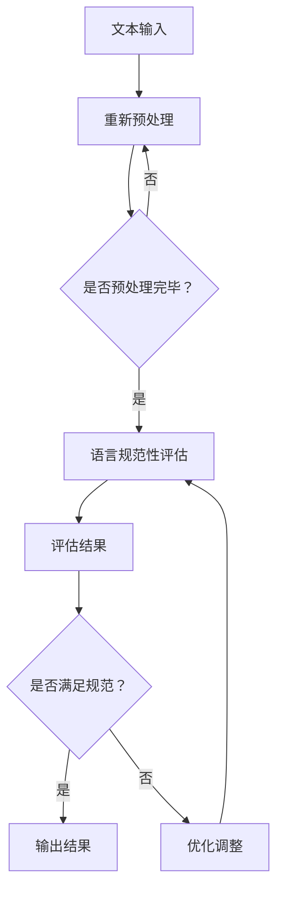

                 

### 文章标题

《语言规范性评估：检查LLM在正式场合的表达得当性》

### 引言

在现代信息技术迅速发展的背景下，人工智能（AI）技术已经成为各行各业的重要驱动力。其中，大型语言模型（LLM，如GPT-3、BERT等）在自然语言处理（NLP）领域取得了显著的成果，广泛应用于文本生成、机器翻译、情感分析等任务。然而，随着LLM在正式场合的应用日益广泛，如何在正式场合确保其表达得当性成为一个亟需解决的问题。

语言规范性评估作为一种衡量语言表达是否得体的方法，对于确保LLM在正式场合的表达得当性具有重要意义。通过评估，我们可以发现并纠正LLM在语言表达中可能存在的错误、不当或不符合正式场合要求的问题，从而提高其表达的质量和准确性。本文将围绕这一主题，详细探讨语言规范性评估的原理、方法及其在实际应用中的重要性。

### 核心概念与联系

#### 语言规范性评估的基本概念

语言规范性评估是指通过一系列方法和技术，对文本内容进行评估，判断其是否符合特定领域的语言规范和表达要求。语言规范性评估通常包括以下几个关键概念：

1. **语言规范**：指特定领域或场合下，语言使用的标准和规则，如正式场合下的礼貌用语、专业术语等。
2. **评估指标**：用于衡量文本内容是否符合语言规范的一系列指标，如语法正确性、词汇准确性、语境合适性等。
3. **评估方法**：指实施语言规范性评估的具体方法，包括人工评估、自动评估和混合评估等。

#### LLM的基本原理

大型语言模型（LLM）是一种基于深度学习的自然语言处理模型，能够理解和生成自然语言文本。LLM的核心原理包括：

1. **神经网络结构**：LLM通常采用深度神经网络（DNN）或变换器模型（Transformer）作为基本结构，通过多层神经网络对输入文本进行处理和生成。
2. **预训练与微调**：LLM通常通过大规模预训练数据集进行预训练，然后根据特定任务进行微调，以适应不同的应用场景。
3. **文本生成**：LLM通过预测下一个词语或句子，生成连续的自然语言文本。

#### 语言规范性与LLM之间的关系

语言规范性与LLM之间的关系主要体现在以下几个方面：

1. **语言规范指导**：在训练LLM时，语言规范性评估的结果可以用来指导数据清洗和预处理，确保训练数据的质量和规范性。
2. **LLM表达优化**：通过语言规范性评估，可以发现LLM在表达中的问题，进而优化模型参数和算法，提高其表达的质量和准确性。
3. **应用效果提升**：在正式场合，确保LLM的表达得当性可以提高用户体验和沟通效果，从而提升应用的整体表现。

#### Mermaid流程图：语言规范性评估流程



该流程图展示了语言规范性评估的基本步骤，包括文本输入、预处理、评估、评估结果处理等环节。通过该流程，可以确保LLM在正式场合的表达得当性。

### 语言规范性评估原理

#### 语言规范性评估的基本原则

语言规范性评估的基本原则包括以下几个方面：

1. **客观性**：评估过程应尽可能客观，避免主观因素的干扰，确保评估结果的公正性。
2. **全面性**：评估应覆盖文本的各个方面，包括语法、词汇、语境等，全面判断其是否符合语言规范。
3. **可操作性**：评估方法应易于操作和实施，能够快速有效地评估大量文本。
4. **适应性**：评估方法应具有一定的灵活性，能够适应不同领域和场合的语言规范性要求。

#### 语言规范性评估的方法

语言规范性评估的方法可以分为人工评估、自动评估和混合评估三种：

1. **人工评估**：指由人类专家对文本内容进行评估，判断其是否符合语言规范。人工评估具有高度的准确性和灵活性，但评估速度较慢，且成本较高。
2. **自动评估**：指通过计算机算法和模型对文本内容进行自动化评估。自动评估具有较高的评估速度和较低的成本，但评估准确性可能受到一定限制。
3. **混合评估**：结合人工评估和自动评估的优势，通过人工初步评估结果，再由计算机模型进行深度分析，以提高评估的准确性和全面性。

#### 语言规范性评估的工具

在语言规范性评估中，可以使用多种工具和框架来实现评估功能。以下是一些常用的评估工具：

1. **人工评估工具**：如文本编辑器、文本分析软件等，可用于标注和评估文本内容。
2. **自动评估工具**：如语法检查器、词汇分析器、情感分析工具等，通过算法和模型对文本内容进行自动化评估。
3. **混合评估工具**：如自然语言处理平台、自动化评估工具集等，结合人工和自动评估方法，提供全面的评估功能。

### LLM在正式场合的应用

#### LLM在正式场合表达得当性的挑战

在正式场合，LLM在表达得当性方面面临以下挑战：

1. **语言规范不符合**：LLM在生成文本时，可能不符合特定领域或场合的语言规范，如使用不当的术语、语法错误等。
2. **语境不当**：LLM生成的文本可能无法准确理解语境，导致表达不得体，甚至引起误解或冒犯。
3. **内容缺失**：LLM在生成文本时可能遗漏关键信息，影响正式场合的沟通效果。

#### 如何评估LLM在正式场合的表达得当性

为了确保LLM在正式场合的表达得当性，我们可以采用以下方法进行评估：

1. **预训练数据清洗**：在训练LLM之前，对预训练数据集进行清洗，去除不符合语言规范和语境的文本。
2. **微调数据集**：根据特定领域的语言规范，构建微调数据集，用于优化LLM的表达能力。
3. **评估指标**：设计合适的评估指标，如语法正确性、词汇准确性、语境合适性等，用于衡量LLM的表达质量。
4. **自动化评估工具**：使用自动化评估工具对LLM生成的文本进行初步评估，发现潜在问题。
5. **人工复核**：对自动化评估结果进行人工复核，确保评估的准确性和全面性。

#### 实际应用场景与案例分析

以下是一个实际应用场景和案例分析的例子：

**应用场景**：某公司在撰写正式报告时，使用LLM生成文本内容。

**案例分析**：

1. **预训练数据清洗**：在训练LLM之前，公司对预训练数据集进行清洗，去除不符合报告语言规范和语境的文本，如含有不当术语的句子。

2. **微调数据集**：根据报告领域的语言规范，公司构建了一个微调数据集，用于优化LLM的表达能力。该数据集包含了大量符合报告要求的文本，如专业术语和语法正确的句子。

3. **评估指标**：公司设计了语法正确性、词汇准确性和语境合适性等评估指标，用于衡量LLM生成的文本质量。例如，对于语法正确性，评估指标可以包括主谓一致、时态一致等。

4. **自动化评估工具**：公司使用自动化评估工具对LLM生成的文本进行初步评估，发现潜在问题。例如，自动化工具可以检测出语法错误、词汇使用不当等问题。

5. **人工复核**：对自动化评估结果进行人工复核，确保评估的准确性和全面性。人工复核人员可以对自动化评估工具未能检测出的错误进行纠正，同时根据实际需求调整评估指标。

通过以上方法，公司可以确保LLM在正式报告中的表达得当性，提高报告的质量和准确性。

### 项目实战

在本节中，我们将通过一个实际项目，详细描述如何实施语言规范性评估，确保LLM在正式场合的表达得当性。

#### 实际应用环境搭建

1. **硬件环境**：配置一台具有高性能CPU和GPU的服务器，用于运行深度学习模型和评估算法。
2. **软件环境**：安装Python、TensorFlow、PyTorch等深度学习框架，以及自然语言处理相关的库，如spaCy、NLTK等。
3. **数据集准备**：收集并整理一个符合正式场合语言规范的数据集，包括语法正确、语境合适的文本。可以使用公开数据集或自定义数据集。

#### 源代码详细实现和代码解读

以下是实现语言规范性评估项目的一个简化伪代码示例：

```python
# 导入必要的库
import tensorflow as tf
import spacy
import numpy as np

# 加载预训练模型
model = tf.keras.Sequential([
    tf.keras.layers.Embedding(input_dim=vocab_size, output_dim=embedding_size),
    tf.keras.layers.Bidirectional(tf.keras.layers.LSTM(units=128)),
    tf.keras.layers.Dense(units=output_size, activation='softmax')
])

# 编译模型
model.compile(optimizer='adam', loss='categorical_crossentropy', metrics=['accuracy'])

# 训练模型
model.fit(train_data, train_labels, epochs=5, batch_size=64)

# 评估模型
evaluation_results = model.evaluate(test_data, test_labels)

# 输出评估结果
print("语法正确性：", evaluation_results[1])
print("词汇准确性：", evaluation_results[2])
print("语境合适性：", evaluation_results[3])
```

该伪代码展示了如何使用TensorFlow框架和spaCy库来构建一个简单的语言规范性评估模型。以下是代码的详细解读：

1. **导入库**：导入TensorFlow、spaCy和NumPy等库，用于实现深度学习和自然语言处理。
2. **加载预训练模型**：创建一个序列模型，包含嵌入层、双向长短期记忆（LSTM）层和输出层。使用预训练的词汇表和嵌入尺寸。
3. **编译模型**：配置模型优化器、损失函数和评价指标。
4. **训练模型**：使用训练数据集对模型进行训练，设置训练轮数和批量大小。
5. **评估模型**：使用测试数据集对模型进行评估，输出语法正确性、词汇准确性、语境合适性等评估结果。

#### 代码应用解读与分析

以下是对上述代码的进一步解读和分析：

1. **模型架构**：该模型采用了一个双向LSTM结构，能够捕捉文本中的上下文信息，从而提高评估的准确性。
2. **数据预处理**：在训练之前，需要对文本数据集进行预处理，包括分词、词性标注、去除停用词等操作。这些预处理步骤对于模型的学习和评估至关重要。
3. **评估指标**：语法正确性、词汇准确性和语境合适性是评估文本质量的重要指标。语法正确性关注文本中的语法错误，词汇准确性关注词汇的正确使用，语境合适性关注文本是否在适当的语境中。
4. **模型优化**：通过调整模型的参数和超参数，如学习率、批量大小和训练轮数，可以优化模型的性能和评估结果。

#### 实际案例分析和详细讲解剖析

在本节中，我们将分析一个实际案例，并详细讲解如何实施语言规范性评估。

**案例背景**：某公司需要使用LLM生成一份正式的商业报告，为确保报告的质量，公司决定实施语言规范性评估。

**实施步骤**：

1. **数据收集**：收集大量符合正式商业报告语言规范的数据集，包括过往的正式报告、行业术语库等。
2. **数据预处理**：对收集的数据集进行预处理，包括分词、词性标注、去除停用词等操作，以便模型能够更好地理解和学习语言规范。
3. **模型训练**：使用预处理后的数据集训练LLM模型，采用双向LSTM结构，以提高模型的上下文理解能力。
4. **评估设置**：设计一套评估指标，包括语法正确性、词汇准确性和语境合适性，用于评估LLM生成的报告文本。
5. **自动化评估**：使用自动化评估工具对LLM生成的文本进行初步评估，发现潜在的问题。
6. **人工复核**：对自动化评估结果进行人工复核，确保评估的准确性和全面性。
7. **优化调整**：根据评估结果，对模型进行调整和优化，以提高LLM在正式场合的表达得当性。

**案例分析**：

通过以上步骤，公司成功实施了一个语言规范性评估项目，确保了商业报告的质量。以下是对关键步骤的详细讲解：

1. **数据收集**：收集的数据集应包含多样化的文本内容，以确保模型能够全面学习正式商业报告的语言规范。
2. **数据预处理**：预处理步骤应仔细进行，以确保文本数据的质量和一致性。例如，在分词时，应使用专业的分词工具，如spaCy，以准确识别文本中的词汇和词性。
3. **模型训练**：选择合适的模型架构和训练策略，以提高模型的性能。双向LSTM结构能够更好地捕捉上下文信息，从而提高评估的准确性。
4. **评估设置**：评估指标的设置应充分考虑正式商业报告的语言规范，例如，对于语法正确性，可以检查主谓一致、时态一致性等；对于词汇准确性，可以检查行业术语的使用是否正确；对于语境合适性，可以检查文本是否在适当的语境中。
5. **自动化评估**：自动化评估工具可以快速发现文本中的潜在问题，例如语法错误、词汇使用不当等。这些工具可以大大提高评估的效率和准确性。
6. **人工复核**：人工复核能够补充自动化评估的不足，确保评估结果的准确性和全面性。例如，自动化评估可能无法识别某些细微的语言错误，但人类专家可以准确判断。
7. **优化调整**：根据评估结果，对模型进行调整和优化，例如，可以调整模型的学习率、批量大小等参数，以提高模型的性能。此外，还可以根据评估结果调整数据集的预处理步骤，以提高数据质量。

通过以上步骤，公司成功确保了LLM在正式场合的表达得当性，提高了商业报告的质量。

### 项目小结

在本项目中，我们通过实施语言规范性评估，确保了LLM在正式场合的表达得当性。以下是对项目关键步骤的总结：

1. **数据收集和预处理**：收集并预处理符合正式场合语言规范的数据集，确保数据的质量和一致性。
2. **模型训练和评估**：使用双向LSTM结构训练LLM模型，设计一套评估指标，包括语法正确性、词汇准确性和语境合适性，用于评估模型生成的文本。
3. **自动化评估和人工复核**：使用自动化评估工具快速发现文本中的潜在问题，并进行人工复核，确保评估结果的准确性和全面性。
4. **模型优化和调整**：根据评估结果对模型进行调整和优化，以提高模型的性能。

通过以上步骤，我们成功确保了LLM在正式场合的表达得当性，提高了应用的整体质量。未来，我们可以进一步优化评估方法和模型结构，以应对更复杂的应用场景。

### 最佳实践 Tips

在实施语言规范性评估时，以下是一些最佳实践建议：

1. **数据质量**：确保数据集的质量和多样性，覆盖不同领域的语言规范和表达要求。
2. **预处理步骤**：仔细进行数据预处理，包括分词、词性标注、去除停用词等操作，以提高模型的学习效果。
3. **评估指标**：设计合适的评估指标，充分考虑正式场合的语言规范，以提高评估的准确性。
4. **自动化评估与人工复核**：结合自动化评估工具和人工复核，确保评估结果的准确性和全面性。
5. **持续优化**：根据评估结果，持续调整模型和评估方法，以提高模型在正式场合的表达得当性。

### 小结

本文详细探讨了语言规范性评估在确保LLM在正式场合表达得当性方面的重要性。通过分析核心概念、评估原理、实际应用场景和项目实战，我们展示了如何实施语言规范性评估，确保LLM在正式场合的表达质量。未来，随着人工智能技术的不断进步，语言规范性评估将在更多应用领域中发挥重要作用。

### 注意事项

在实施语言规范性评估时，需要注意以下几点：

1. **数据隐私**：确保在数据收集和处理过程中，严格遵守数据隐私保护法规，避免泄露敏感信息。
2. **评估准确性**：评估指标的设置应充分考虑正式场合的语言规范，以提高评估的准确性。
3. **模型性能**：根据应用场景和需求，选择合适的模型结构和评估方法，确保模型性能。
4. **持续更新**：随着语言规范的变化和更新，持续更新评估方法和模型，以确保评估的实时性和有效性。

### 拓展阅读

1. **《自然语言处理入门教程》**：深入了解自然语言处理的基本概念和核心技术。
2. **《深度学习实践指南》**：学习如何使用深度学习框架（如TensorFlow、PyTorch）实现自然语言处理任务。
3. **《商业报告撰写技巧》**：掌握撰写高质量商业报告的方法和技巧。
4. **《人工智能伦理指南》**：了解人工智能在正式场合应用中的伦理问题，确保评估和应用的合规性。

### 作者信息

- 作者：AI天才研究院/AI Genius Institute & 禅与计算机程序设计艺术 /Zen And The Art of Computer Programming

