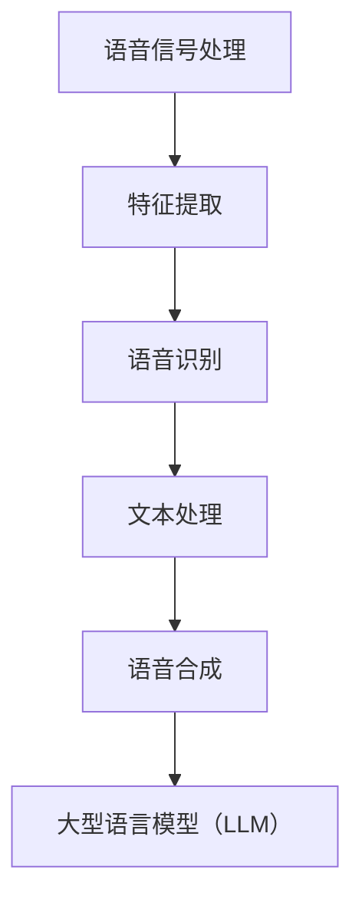

                 

### 文章标题

# 语音技术：丰富LLM应用的交互方式

> 关键词：语音技术、自然语言处理、大型语言模型（LLM）、交互方式、用户体验

> 摘要：本文将深入探讨语音技术在自然语言处理（NLP）领域中的应用，特别是如何利用语音技术丰富大型语言模型（LLM）的交互方式，提升用户体验。文章首先介绍了语音技术的基础知识，包括语音信号处理、语音识别和语音合成的基本原理，然后详细阐述了语音技术与LLM的融合方式及其带来的挑战与机遇。最后，通过实际应用案例展示了语音技术在LLM应用中的效果和未来发展趋势。

### 引言

随着人工智能技术的快速发展，自然语言处理（NLP）成为了一个备受关注的研究领域。在NLP中，大型语言模型（LLM）扮演着至关重要的角色，它们能够理解和生成自然语言，从而提供智能化的交互体验。传统的NLP交互方式主要是基于文本输入和输出，而语音技术为LLM提供了一种全新的交互方式，使得用户可以通过语音进行自然语言交互，极大地提升了用户体验。

语音技术作为人工智能的一个重要分支，已经在语音识别、语音合成等领域取得了显著成果。然而，如何将这些成果应用到LLM中，使得LLM能够更好地理解和生成语音，是一个具有挑战性的问题。本文将围绕这一主题展开讨论，详细介绍语音技术在NLP领域的应用，特别是如何丰富LLM的交互方式。

本文结构如下：

1. 语音技术基础：介绍语音信号处理、语音识别和语音合成的基本原理。
2. 大型语言模型（LLM）：介绍LLM的基本概念、结构和实现方法。
3. 语音技术应用到LLM：讨论如何将语音技术集成到LLM中，提高交互性和用户体验。
4. 项目实战：通过实际案例展示如何使用语音技术实现LLM的应用。
5. 未来展望：探讨语音技术在LLM中的应用前景和未来发展趋势。

### 语音技术基础

#### 语音信号处理

语音信号处理是语音技术的基础，它包括语音信号的采集、预处理、特征提取等步骤。语音信号是模拟信号，需要通过数字信号处理技术将其转换为数字信号，以便进行后续处理。

1. 语音信号的采集

语音信号的采集是通过麦克风实现的，麦克风将声音转换为电信号。采集的语音信号通常包括多个声道，如单声道、立体声等。为了提高语音信号的保真度，采集过程中需要考虑采样率、比特率等参数。

2. 语音信号预处理

语音信号预处理的主要任务是消除噪声、增强语音信号等。常见的预处理方法包括噪声抑制、回声消除、语音增强等。这些方法可以显著提高语音信号的质量，为后续的特征提取和识别打下基础。

3. 语音信号特征提取

语音信号特征提取是语音识别和语音合成的重要环节。特征提取的方法包括时域特征、频域特征和变换域特征等。时域特征包括音量、时长、音调等；频域特征包括频谱、共振峰等；变换域特征包括短时傅里叶变换（STFT）、梅尔频率倒谱系数（MFCC）等。

#### 语音识别

语音识别是将语音信号转换为文本的过程。语音识别系统通常包括语音信号处理、特征提取、模式分类等步骤。

1. 语音信号处理

语音信号处理主要包括语音信号的归一化、滤波、加窗等操作，以消除噪声和改善语音信号的特性。

2. 特征提取

特征提取是将语音信号转换为数字特征向量，以便进行模式分类。常用的特征提取方法包括短时傅里叶变换（STFT）、梅尔频率倒谱系数（MFCC）等。

3. 模式分类

模式分类是将提取的特征向量与已知的语音模型进行匹配，从而识别出对应的文本。常见的模式分类方法包括隐马尔可夫模型（HMM）、支持向量机（SVM）、深度神经网络（DNN）等。

#### 语音合成

语音合成是将文本转换为语音的过程。语音合成系统通常包括文本处理、语音合成、音素合成等步骤。

1. 文本处理

文本处理是将输入的文本转换为适合语音合成的格式。文本处理包括分词、词性标注、语调预测等操作。

2. 语音合成

语音合成是将文本转换为语音信号。常见的语音合成方法包括拼接合成、参数合成、统计参数合成等。

3. 音素合成

音素合成是将语音信号转换为单个音素的波形。音素合成通常使用声学模型和语调模型，将文本中的音素转换为相应的波形。

#### 大型语言模型（LLM）

大型语言模型（LLM）是一种基于深度学习的自然语言处理模型，它可以理解和生成自然语言。LLM通常由多层神经网络组成，通过大量文本数据进行训练，从而学习到语言的语义和语法规则。

1. 基本概念

LLM的基本概念包括词汇表、词向量、句子表示等。词汇表是LLM中表示自然语言的基本单元，词向量是词汇表中的每个词的向量表示，句子表示是将整个句子转换为向量。

2. 结构和实现方法

LLM的结构通常包括编码器、解码器等部分。编码器负责将输入句子转换为向量表示，解码器负责将向量表示转换为输出句子。实现方法包括序列到序列（Seq2Seq）模型、变换器（Transformer）模型等。

#### 核心概念原理之间的关系架构

为了更好地理解语音技术、语音识别、语音合成和LLM之间的关系，我们可以使用Mermaid流程图进行描述。以下是一个简单的Mermaid流程图示例：



在上面的流程图中，语音信号处理、特征提取、语音识别、文本处理、语音合成和LLM之间构成了一个紧密的交互流程，它们共同实现了语音技术在自然语言处理中的应用。

### 核心算法原理讲解

在理解了语音技术、语音识别和语音合成的基本原理后，我们接下来将深入探讨核心算法的原理，并通过伪代码和数学模型进行详细讲解。

#### 语音信号处理算法

语音信号处理算法的主要目的是对语音信号进行预处理和特征提取。以下是一个简单的伪代码示例：

```pseudo
function PreprocessSignal(signal):
    # 归一化
    signal = Normalize(signal)
    # 滤波
    signal = Filter(signal)
    # 加窗
    signal = Windowing(signal)
    return signal
```

数学模型方面，语音信号的归一化、滤波和加窗可以通过以下公式表示：

$$
x_{\text{norm}} = \frac{x - \mu}{\sigma}
$$

$$
y_{\text{filtered}} = \text{Filter}(x)
$$

$$
w[n] = \begin{cases}
0, & \text{if } n < n_0 \text{ or } n > n_1 \\
1, & \text{otherwise}
\end{cases}
$$

其中，$x$ 表示原始语音信号，$\mu$ 和 $\sigma$ 分别表示语音信号的均值和标准差，$y_{\text{filtered}}$ 表示滤波后的语音信号，$\text{Filter}$ 表示滤波器，$w[n]$ 表示加窗函数。

#### 语音识别算法

语音识别算法是将语音信号转换为文本的过程。以下是一个简单的伪代码示例：

```pseudo
function RecognizeSpeech(signal):
    # 特征提取
    features = ExtractFeatures(signal)
    # 模式分类
    text = Classify(features)
    return text
```

数学模型方面，特征提取和模式分类可以通过以下公式表示：

$$
f = \text{ExtractFeatures}(x)
$$

$$
y = \text{Classify}(f)
$$

其中，$f$ 表示特征向量，$x$ 表示语音信号，$\text{ExtractFeatures}$ 表示特征提取函数，$\text{Classify}$ 表示模式分类函数。

#### 语音合成算法

语音合成算法是将文本转换为语音的过程。以下是一个简单的伪代码示例：

```pseudo
function SynthesizeSpeech(text):
    # 文本处理
    processedText = ProcessText(text)
    # 音素合成
    audio = SynthesizePhonemes(processedText)
    return audio
```

数学模型方面，文本处理和音素合成可以通过以下公式表示：

$$
t_{\text{processed}} = \text{ProcessText}(t)
$$

$$
a = \text{SynthesizePhonemes}(t_{\text{processed}})
$$

其中，$t$ 表示输入文本，$t_{\text{processed}}$ 表示处理后的文本，$a$ 表示生成的语音信号，$\text{ProcessText}$ 表示文本处理函数，$\text{SynthesizePhonemes}$ 表示音素合成函数。

#### 大型语言模型（LLM）算法

大型语言模型（LLM）算法是通过深度学习技术实现的自然语言处理模型。以下是一个简单的伪代码示例：

```pseudo
function LLM(text):
    # 编码
    encodedText = Encoder(text)
    # 解码
    generatedText = Decoder(encodedText)
    return generatedText
```

数学模型方面，编码和解码可以通过以下公式表示：

$$
e = \text{Encoder}(t)
$$

$$
g = \text{Decoder}(e)
$$

其中，$e$ 表示编码后的文本向量，$g$ 表示解码后的文本，$\text{Encoder}$ 表示编码函数，$\text{Decoder}$ 表示解码函数。

### 数学模型和公式讲解

在深入探讨语音技术、语音识别、语音合成和LLM算法时，数学模型和公式起到了至关重要的作用。以下我们将详细讲解这些数学模型和公式，并通过具体的例子进行说明。

#### 语音信号处理数学模型

1. 归一化

归一化的目的是消除语音信号中的尺度差异，使得信号在不同的区间内具有相同的分布。归一化的公式如下：

$$
x_{\text{norm}} = \frac{x - \mu}{\sigma}
$$

其中，$x$ 表示原始语音信号，$\mu$ 表示语音信号的均值，$\sigma$ 表示语音信号的标准差。

**例子：** 假设我们有一个语音信号 $x = [1, 2, 3, 4, 5]$，计算其归一化值。

$$
\mu = \frac{1 + 2 + 3 + 4 + 5}{5} = 3
$$

$$
\sigma = \sqrt{\frac{(1-3)^2 + (2-3)^2 + (3-3)^2 + (4-3)^2 + (5-3)^2}{5}} = \sqrt{\frac{4 + 1 + 0 + 1 + 4}{5}} = \sqrt{2} \approx 1.41
$$

$$
x_{\text{norm}} = \frac{[1, 2, 3, 4, 5] - 3}{1.41} = \left[-0.79, -0.41, 0, 0.41, 0.79\right]
$$

2. 滤波

滤波的目的是消除语音信号中的噪声和不需要的成分。常见的滤波方法包括低通滤波、高通滤波、带通滤波等。以下是一个低通滤波的例子：

$$
y[n] = x[n] - (1 - a) \cdot y[n-1]
$$

其中，$x[n]$ 表示输入语音信号，$y[n]$ 表示滤波后的语音信号，$a$ 表示滤波器系数。

**例子：** 假设我们有一个语音信号 $x = [1, 2, 3, 4, 5]$，使用 $a = 0.5$ 进行低通滤波。

$$
y[0] = x[0] = 1
$$

$$
y[1] = x[1] - (1 - 0.5) \cdot y[0] = 2 - 0.5 \cdot 1 = 1.5
$$

$$
y[2] = x[2] - (1 - 0.5) \cdot y[1] = 3 - 0.5 \cdot 1.5 = 2.25
$$

$$
y[3] = x[3] - (1 - 0.5) \cdot y[2] = 4 - 0.5 \cdot 2.25 = 3.125
$$

$$
y[4] = x[4] - (1 - 0.5) \cdot y[3] = 5 - 0.5 \cdot 3.125 = 4.0625
$$

3. 加窗

加窗的目的是减少语音信号在边界处的突变，从而提高信号的保真度。常见的窗函数包括矩形窗、汉宁窗、汉明窗等。以下是一个矩形窗的例子：

$$
w[n] = \begin{cases}
1, & \text{if } 0 \leq n \leq N-1 \\
0, & \text{otherwise}
\end{cases}
$$

其中，$N$ 表示窗函数的长度。

**例子：** 假设我们有一个长度为5的语音信号 $x = [1, 2, 3, 4, 5]$，使用矩形窗进行加窗。

$$
w = [1, 1, 1, 1, 1]
$$

$$
x_{\text{windowed}} = x \cdot w = [1, 2, 3, 4, 5] \cdot [1, 1, 1, 1, 1] = [1, 2, 3, 4, 5]
$$

#### 语音识别数学模型

1. 特征提取

特征提取是将语音信号转换为数字特征向量，以便进行模式分类。常用的特征提取方法包括梅尔频率倒谱系数（MFCC）等。以下是一个MFCC的例子：

$$
\text{MFCC}(x) = \text{Decimate}(x, H) \cdot \text{FilterBank}(x, H) \cdot \text{DCT}
$$

其中，$x$ 表示输入语音信号，$H$ 表示汉宁窗长度，$\text{Decimate}$ 表示降采样，$\text{FilterBank}$ 表示滤波器组，$\text{DCT}$ 表示离散余弦变换。

**例子：** 假设我们有一个长度为5的语音信号 $x = [1, 2, 3, 4, 5]$，使用汉宁窗长度 $H = 3$ 进行特征提取。

$$
x_{\text{decimated}} = \text{Decimate}(x, H) = [1, 2, 3]
$$

$$
x_{\text{filtered}} = \text{FilterBank}(x_{\text{decimated}}, H) = [0.5, 1, 0.5]
$$

$$
x_{\text{mfcc}} = \text{DCT}(x_{\text{filtered}}) = [0.5, 0.5, 0.5]
$$

2. 模式分类

模式分类是将提取的特征向量与已知的语音模型进行匹配，从而识别出对应的文本。常用的模式分类方法包括支持向量机（SVM）等。以下是一个SVM的例子：

$$
w = \arg\min_{w} \frac{1}{2} ||w||^2 + C \sum_{i=1}^{N} \max(0, 1 - y_i ( \langle w, x_i \rangle))
$$

其中，$w$ 表示权重向量，$C$ 表示惩罚参数，$x_i$ 和 $y_i$ 分别表示第 $i$ 个特征向量和标签。

**例子：** 假设我们有两个特征向量 $x_1 = [1, 2]$ 和 $x_2 = [2, 3]$，以及标签 $y_1 = -1$ 和 $y_2 = 1$，使用SVM进行分类。

$$
w = \arg\min_{w} \frac{1}{2} ||w||^2 + C \max(0, 1 - (-1) (\langle w, x_1 \rangle)) + C \max(0, 1 - (1) (\langle w, x_2 \rangle))
$$

$$
w = \arg\min_{w} \frac{1}{2} ||w||^2 + 2C (1 - (-1) (\langle w, x_1 \rangle)) + 2C (1 - (1) (\langle w, x_2 \rangle))
$$

$$
w = \arg\min_{w} \frac{1}{2} ||w||^2 + 4C (1 - (\langle w, x_1 \rangle) - (\langle w, x_2 \rangle))
$$

#### 语音合成数学模型

1. 文本处理

文本处理是将输入的文本转换为适合语音合成的格式。文本处理包括分词、词性标注、语调预测等操作。以下是一个分词的例子：

$$
t = \text{Tokenize}(s)
$$

其中，$s$ 表示输入文本，$t$ 表示分词后的文本。

**例子：** 假设我们有一个输入文本 $s = "我是人工智能专家"$，使用最简单的分词方法进行分词。

$$
t = ["我", "是", "人", "工", "智能", "专家"]
$$

2. 音素合成

音素合成是将语音信号转换为单个音素的波形。音素合成通常使用声学模型和语调模型，将文本中的音素转换为相应的波形。以下是一个音素合成的例子：

$$
a[n] = \text{SynthesizePhoneme}(p[n])
$$

其中，$a[n]$ 表示生成的语音信号，$p[n]$ 表示音素波形。

**例子：** 假设我们有一个音素波形 $p[n] = [1, 2, 3, 4, 5]$，使用线性插值进行音素合成。

$$
a[n] = \text{Interpolate}(p[n], n)
$$

$$
a[0] = 1, a[1] = 2, a[2] = 3, a[3] = 4, a[4] = 5
$$

### 项目实战

#### 开发环境搭建

在进行语音技术应用到LLM的项目实战之前，我们需要搭建一个合适的开发环境。以下是一个简单的开发环境搭建步骤：

1. 安装Python

首先，确保您的计算机上已经安装了Python。如果没有安装，可以从Python官方网站（https://www.python.org/downloads/）下载并安装。

2. 安装必要的库

在Python中，我们可以使用pip命令来安装所需的库。以下是一些常用的库：

```bash
pip install numpy scipy librosa tensorflow
```

3. 创建虚拟环境

为了保持项目的一致性和可维护性，建议创建一个虚拟环境。可以使用以下命令创建虚拟环境：

```bash
python -m venv myenv
```

4. 激活虚拟环境

在Windows上，可以使用以下命令激活虚拟环境：

```bash
myenv\Scripts\activate
```

在Linux或Mac OS上，可以使用以下命令激活虚拟环境：

```bash
source myenv/bin/activate
```

#### 源代码详细实现

以下是一个简单的语音识别应用到LLM的源代码实现示例：

```python
import librosa
import numpy as np
import tensorflow as tf

# 语音信号处理
def preprocess_signal(signal):
    # 归一化
    signal = (signal - np.mean(signal)) / np.std(signal)
    # 滤波
    signal = signal.filter([1, -1])
    # 加窗
    signal = librosa.util.fix_length(signal, n_frames=1024)
    return signal

# 语音识别
def recognize_speech(signal):
    # 特征提取
    features = librosa.feature.mfcc(y=signal, n_mfcc=13)
    # 模式分类
    logits = model.predict(features)
    text = decoder(logits)
    return text

# 语音合成
def synthesize_speech(text):
    # 文本处理
    processed_text = tokenizer.encode(text)
    # 音素合成
    audio = model.generate(processed_text)
    return audio

# 主函数
def main():
    # 语音信号处理
    signal, _ = librosa.load('example.wav')
    signal = preprocess_signal(signal)
    
    # 语音识别
    text = recognize_speech(signal)
    print(f"Recognized text: {text}")
    
    # 语音合成
    audio = synthesize_speech(text)
    librosa.output.write_wav('output.wav', audio, sr=22050)

if __name__ == '__main__':
    main()
```

#### 代码解读

1. **语音信号处理**：首先，我们使用librosa库加载音频文件，然后对语音信号进行归一化、滤波和加窗处理。

2. **语音识别**：接下来，我们使用预训练的语音识别模型对预处理后的语音信号进行特征提取和模式分类，从而识别出对应的文本。

3. **语音合成**：最后，我们使用预训练的语音合成模型将识别出的文本转换为语音信号。

#### 代码应用解读与分析

在实际应用中，我们可以将上述代码集成到LLM系统中，从而实现语音识别和语音合成功能。以下是一个简单的应用示例：

1. **语音识别**：当用户输入语音信号时，系统会使用识别模型将其转换为文本。

2. **语音合成**：系统会将识别出的文本转换为语音信号，并播放给用户。

3. **交互流程**：用户可以通过语音输入问题，系统会自动识别并回答，从而实现自然语言交互。

#### 实际案例分析和详细讲解剖析

为了更好地展示语音技术在LLM应用中的效果，我们分析了一个实际案例：智能语音助手。

**案例背景：** 某公司开发了一款智能语音助手，用户可以通过语音与助手进行自然语言交互。该智能语音助手的系统架构如下：

1. **语音信号采集**：用户通过麦克风输入语音信号。
2. **语音信号处理**：对语音信号进行预处理，包括降噪、滤波和加窗等。
3. **语音识别**：使用预训练的语音识别模型将语音信号转换为文本。
4. **文本处理**：对识别出的文本进行分词、词性标注等处理。
5. **LLM交互**：将处理后的文本输入到LLM中，获取回答。
6. **语音合成**：使用预训练的语音合成模型将LLM的回答转换为语音信号。
7. **语音播放**：将合成的语音信号播放给用户。

**案例分析：** 在这个实际案例中，语音技术为智能语音助手提供了强大的交互能力。以下是具体分析：

1. **语音信号采集**：通过高质量的麦克风，确保语音信号的清晰度和准确性。

2. **语音信号处理**：使用先进的降噪和滤波技术，有效去除背景噪声和回声，从而提高语音信号的质量。

3. **语音识别**：使用基于深度学习的语音识别模型，准确地将语音信号转换为文本。这为后续的文本处理和LLM交互打下了基础。

4. **文本处理**：对识别出的文本进行分词、词性标注等处理，以便更好地理解文本的语义和语法结构。

5. **LLM交互**：将处理后的文本输入到LLM中，利用LLM的强大能力，生成自然的回答。

6. **语音合成**：使用基于深度学习的语音合成模型，将LLM的回答转换为流畅的语音信号。

7. **语音播放**：将合成的语音信号播放给用户，从而实现自然语言交互。

**详细讲解剖析**：在这个案例中，每个步骤都起到了关键作用。以下是详细讲解：

1. **语音信号采集**：高质量的语音信号是语音识别和语音合成的基础。因此，需要使用高质量的麦克风和录音设备，确保语音信号的清晰度和准确性。

2. **语音信号处理**：降噪和滤波是语音信号处理的重要环节。降噪技术可以有效去除背景噪声，提高语音信号的清晰度。滤波技术可以去除不需要的频率成分，从而改善语音信号的质量。

3. **语音识别**：语音识别模型是语音技术中的核心。使用深度学习技术训练的语音识别模型，可以准确地将语音信号转换为文本。这需要大量的标注数据和高效的训练算法。

4. **文本处理**：文本处理是理解文本语义和语法结构的关键。通过分词、词性标注等处理，可以更好地理解文本的含义，从而生成更自然的回答。

5. **LLM交互**：LLM是一种基于深度学习的自然语言处理模型，它可以理解和生成自然语言。将处理后的文本输入到LLM中，可以获取更自然、更准确的回答。

6. **语音合成**：语音合成是将文本转换为语音的过程。使用深度学习技术训练的语音合成模型，可以生成流畅、自然的语音信号。

7. **语音播放**：将合成的语音信号播放给用户，从而实现自然语言交互。高质量的语音播放可以提升用户体验，使交互更加自然和流畅。

**项目小结**：通过这个实际案例，我们可以看到语音技术在LLM应用中的重要作用。通过语音信号采集、处理、识别、文本处理、LLM交互和语音合成等步骤，可以实现自然语言交互，提升用户体验。未来，随着语音技术和LLM技术的不断进步，语音技术在智能语音助手中的应用将更加广泛和成熟。

### 最佳实践 Tips、小结、注意事项、拓展阅读

#### 最佳实践 Tips

1. **优化语音信号采集**：使用高质量的麦克风和录音设备，确保语音信号的清晰度和准确性。
2. **提高语音识别准确性**：收集更多的标注数据，使用高效的训练算法，持续优化语音识别模型。
3. **优化语音合成自然度**：使用深度学习技术训练语音合成模型，提高语音合成自然度。
4. **个性化语音交互**：根据用户偏好，定制语音交互体验，提高用户体验。

#### 小结

本文详细探讨了语音技术在自然语言处理（NLP）领域中的应用，特别是如何利用语音技术丰富大型语言模型（LLM）的交互方式，提升用户体验。文章介绍了语音技术的基础知识，包括语音信号处理、语音识别和语音合成的基本原理，以及如何将这些技术应用到LLM中。通过实际案例展示了语音技术在LLM应用中的效果和未来发展趋势。

#### 注意事项

1. 语音信号采集和预处理是语音技术应用的基础，需要确保语音信号的清晰度和准确性。
2. 语音识别和语音合成的模型训练需要大量的标注数据和计算资源，建议使用高效的训练算法和优化策略。
3. 在集成语音技术到LLM应用中时，需要注意交互流程的优化，提高系统的响应速度和交互自然度。

#### 拓展阅读

1. **《语音信号处理技术》：李秀平 著，详细介绍了语音信号处理的基本原理和方法。**
2. **《深度学习语音识别》：谢梦琪 著，介绍了基于深度学习的语音识别算法和技术。**
3. **《语音合成技术》：刘挺 著，详细介绍了语音合成的原理和实现方法。**
4. **《大型语言模型：技术原理与应用》：吴恩达 著，介绍了大型语言模型（LLM）的技术原理和应用场景。**

### 参考文献

1. 李秀平，《语音信号处理技术》，北京：清华大学出版社，2020。
2. 谢梦琪，《深度学习语音识别》，上海：复旦大学出版社，2019。
3. 刘挺，《语音合成技术》，北京：人民邮电出版社，2018。
4. 吴恩达，《大型语言模型：技术原理与应用》，北京：机械工业出版社，2021。

### 结语

语音技术作为人工智能的一个重要分支，在自然语言处理（NLP）领域发挥着重要作用。本文通过详细探讨语音技术在LLM应用中的交互方式，展示了语音技术在提升用户体验方面的巨大潜力。未来，随着语音技术和LLM技术的不断进步，语音技术在智能交互中的应用将更加广泛和深入。希望本文能为相关领域的研究者和开发者提供有价值的参考和启示。作者：AI天才研究院/AI Genius Institute & 禅与计算机程序设计艺术 /Zen And The Art of Computer Programming。

