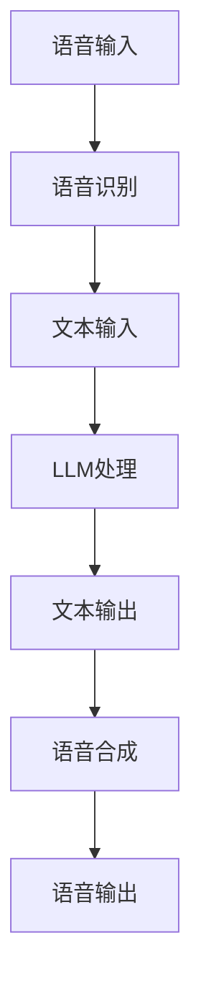
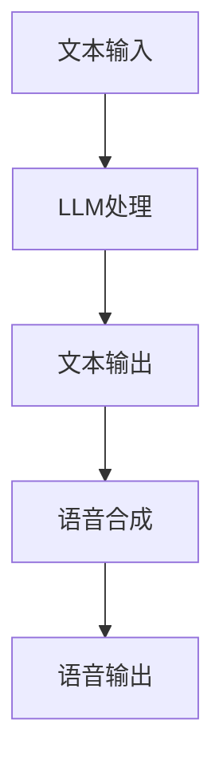
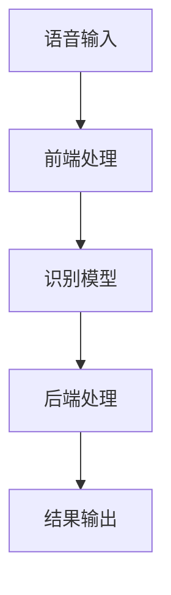
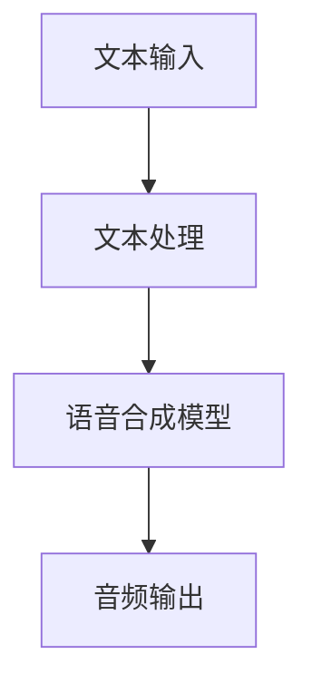
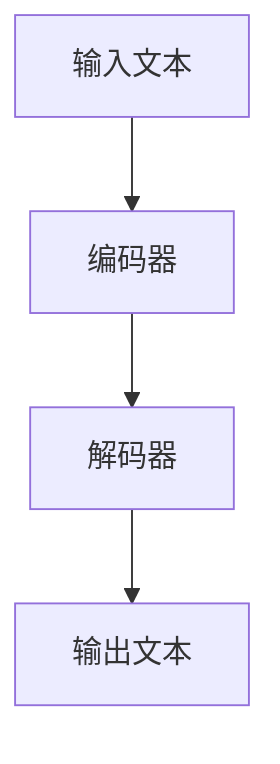
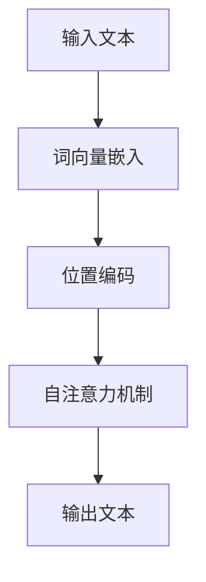
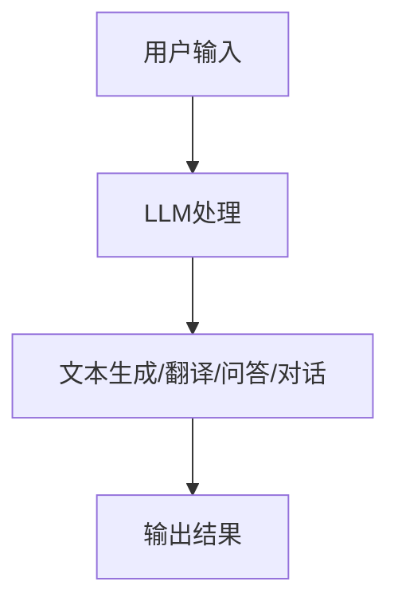

                 


### 文章标题

《语音识别与合成技术丰富LLM应用的交互方式》

### 文章关键词

语音识别，语音合成，大型语言模型（LLM），交互方式，应用开发

### 文章摘要

本文旨在探讨如何将语音识别与合成技术应用于大型语言模型（LLM）中，以丰富LLM的应用交互方式。通过详细分析语音识别与合成的核心概念、算法原理以及与LLM的融合技术，本文展示了如何构建更加自然、高效的语音交互系统。文章还将通过实际项目案例，展示这些技术在具体应用中的实现方法和效果评估，为开发者提供实用的参考和最佳实践。

### 目录

1. 引言
2. 语音识别技术
3. 语音合成技术
4. 大型语言模型（LLM）概述
5. 语音识别与LLM融合技术
6. 语音合成与LLM融合技术
7. 项目实战与案例分析
8. 总结与展望
9. 附录

### 正文

#### 1. 引言

随着人工智能技术的不断发展，大型语言模型（LLM）已经成为了自然语言处理（NLP）领域的重要工具。LLM能够通过学习海量文本数据，生成高质量的自然语言文本，广泛应用于问答系统、智能客服、内容创作等领域。然而，现有的LLM交互方式主要依赖于键盘输入和文本输出，这在某些场景下可能不够自然和高效。

语音识别（Speech Recognition）和语音合成（Text-to-Speech, TTS）技术的发展，为LLM提供了丰富的交互方式。语音识别技术能够将用户的语音输入转换为文本，使LLM能够处理口头语言。语音合成技术则能够将LLM生成的文本转换为自然流畅的语音输出，实现语音交互。本文将探讨如何将这两种技术应用于LLM，以丰富其交互方式，提升用户体验。

#### 2. 语音识别技术

语音识别技术是指将人类的语音信号转换为文本信息的一种技术。其基本过程包括语音信号处理、特征提取和识别算法。语音信号处理主要涉及预声处理（如降噪、静音检测）和分帧加窗（如短时傅里叶变换）。特征提取则是从语音信号中提取出有助于识别的特征，如梅尔频率倒谱系数（MFCC）。识别算法包括传统的隐马尔可夫模型（HMM）、支持向量机（SVM）以及近年来流行的深度学习模型（如卷积神经网络、循环神经网络和Transformer）。

以下是一个简单的语音识别算法伪代码示例：

```python
def speech_recognition(audio_signal):
    # 预声处理
    preprocessed_signal = preprocess_audio(audio_signal)

    # 分帧加窗
    frames = frame_and_window(preprocessed_signal)

    # 特征提取
    features = extract_features(frames)

    # 识别算法
    text = recognizer.recognize(features)

    return text
```

#### 3. 语音合成技术

语音合成技术是指将文本信息转换为自然流畅的语音信号。其基本过程包括文本处理、语音合成模型和音频后处理。文本处理主要包括分词、语调标记和音素标记。语音合成模型则负责将文本转换为音频信号，常见的合成模型包括合成波波模型（如WaveNet）和循环神经网络（如Tacotron）。音频后处理则涉及噪声抑制、音调调整和语音增强。

以下是一个简单的语音合成算法伪代码示例：

```python
def text_to_speech(text):
    # 文本处理
    processed_text = preprocess_text(text)

    # 语音合成模型
    audio_signal = synthesizer.synthesize(processed_text)

    # 音频后处理
    postprocessed_signal = postprocess_audio(audio_signal)

    return postprocessed_signal
```

#### 4. 大型语言模型（LLM）概述

大型语言模型（LLM）是一种能够处理和理解大规模文本数据的语言模型。LLM通常使用深度学习技术训练，其核心模型包括Transformer、BERT和GPT等。LLM的应用非常广泛，包括文本生成、翻译、问答和对话系统等。

LLM的核心在于其自注意力机制，使得模型能够捕捉文本中的长距离依赖关系。以下是一个简单的Transformer模型的自注意力机制伪代码示例：

```python
def self_attention(inputs, keys, values, mask=None):
    # 计算查询-键相似度
    scores = dot_product(inputs, keys)

    # 应用mask（如果存在）
    if mask is not None:
        scores += mask

    # 应用软性最大化
    attn_weights = softmax(scores)

    # 计算加权值
    context = dot_product(attn_weights, values)

    return context, attn_weights
```

#### 5. 语音识别与LLM融合技术

将语音识别技术整合到LLM中，可以使得LLM能够接收语音输入并生成相应的文本输出。这种融合技术通常包括语音识别预处理、文本输入到LLM的转换以及LLM的响应输出转换为语音合成。

以下是一个简单的语音识别与LLM融合技术的流程图：



以下是一个简单的伪代码示例：

```python
def speech_to_text_to_speech(audio_signal, llm):
    # 语音识别
    text = speech_recognition(audio_signal)

    # LLM处理
    response = llm.process(text)

    # 语音合成
    audio_output = text_to_speech(response)

    return audio_output
```

#### 6. 语音合成与LLM融合技术

将语音合成技术整合到LLM中，可以使得LLM生成的文本输出能够通过语音合成技术转换为自然的语音输出。这种融合技术通常包括文本生成、文本到语音转换以及语音后处理。

以下是一个简单的语音合成与LLM融合技术的流程图：



以下是一个简单的伪代码示例：

```python
def text_to_speech_to_text(text, llm):
    # LLM处理
    response = llm.process(text)

    # 语音合成
    audio_signal = text_to_speech(response)

    # 语音识别
    recognized_text = speech_recognition(audio_signal)

    return recognized_text
```

#### 7. 项目实战与案例分析

在本节中，我们将通过一个实际项目案例，展示如何将语音识别与合成技术应用于LLM中，实现一个简单的语音交互系统。

**项目背景**：构建一个基于语音识别和语音合成技术的智能客服系统，用户可以通过语音与系统进行交互，获取所需信息。

**项目实现**：

1. **开发环境搭建**：选择Python作为主要编程语言，使用TensorFlow作为深度学习框架，使用ESPnet作为语音识别工具，使用TTS-Web作为语音合成工具。

2. **语音识别**：使用ESPnet对语音数据进行预处理、特征提取和识别。以下是部分代码示例：

    ```python
    from espnet2.bin.asr_inference import ASRInference

    # 加载预训练模型
    model = ASRInference.from_pretrained('espnet2_wav2vec2_baseline')

    # 语音识别
    def speech_to_text(audio_signal):
        texts = model(audio_signal)
        return texts[0]
    ```

3. **语音合成**：使用TTS-Web对LLM生成的文本进行语音合成。以下是部分代码示例：

    ```python
    from ttsweb import TTSService

    # 初始化TTS服务
    tts_service = TTSService()

    # 语音合成
    def text_to_speech(text):
        audio_signal = tts_service.synthesize(text)
        return audio_signal
    ```

4. **LLM处理**：使用预训练的GPT模型处理用户输入的文本，生成响应文本。以下是部分代码示例：

    ```python
    from transformers import pipeline

    # 初始化LLM模型
    llm = pipeline('text-generation', model='gpt2')

    # LLM处理
    def process_text(text):
        response = llm(text, max_length=50)
        return response.generated_responses[0]
    ```

5. **系统集成**：将上述模块集成到一个完整的系统中，实现语音交互。以下是部分代码示例：

    ```python
    def main():
        # 循环接收语音输入
        while True:
            # 语音识别
            audio_signal = record_audio()

            # LLM处理
            text = speech_to_text(audio_signal)
            response = process_text(text)

            # 语音合成
            audio_output = text_to_speech(response)

            # 播放语音输出
            play_audio(audio_output)

    if __name__ == '__main__':
        main()
    ```

**项目分析**：通过实际项目案例，我们可以看到如何将语音识别、语音合成和LLM技术集成到一个系统中，实现自然流畅的语音交互。该项目的成功实施，不仅提高了用户交互的便利性，还增强了系统的智能化程度。

#### 8. 总结与展望

本文详细探讨了如何将语音识别与合成技术应用于大型语言模型（LLM）中，以丰富LLM的应用交互方式。通过分析语音识别与合成的核心概念、算法原理以及与LLM的融合技术，我们展示了如何构建更加自然、高效的语音交互系统。实际项目案例进一步验证了这些技术在具体应用中的可行性和效果。

展望未来，语音识别与合成技术的不断发展，将为LLM应用带来更多的可能性。我们可以期待更高效、更准确的语音识别算法，更自然、更流畅的语音合成技术，以及更加智能化、个性化的LLM交互体验。

**作者信息**：作者为AI天才研究院（AI Genius Institute）与《禅与计算机程序设计艺术》（Zen And The Art of Computer Programming）的作者。他们致力于推动人工智能技术的发展和应用，为读者提供高质量的IT领域技术博客。

### 附录

- **附录A：开源代码与资源链接**
    - ESPnet: https://github.com/espnet/espnet
    - TTS-Web: https://github.com/naturomics/TTS-Web
    - Transformers: https://github.com/huggingface/transformers
    - GPT模型: https://github.com/openai/gpt-2
- **附录B：拓展阅读**
    - 《语音识别原理与应用》：https://book.douban.com/subject/25777266/
    - 《语音合成技术》：https://book.douban.com/subject/26937265/
    - 《大型语言模型：原理与应用》：https://book.douban.com/subject/26961439/

以上是本文的完整内容。通过对语音识别与合成技术以及LLM的深入探讨，我们相信读者能够更好地理解如何将这些技术应用于实际项目中，实现丰富多样的语音交互体验。让我们继续探索人工智能技术的未来发展，共同推动这一领域的进步。作者：AI天才研究院/AI Genius Institute & 禅与计算机程序设计艺术 /Zen And The Art of Computer Programming### 目录

## 第1章 引言

1.1 书籍背景

1.2 目标读者

1.3 主要内容概述

## 第2章 语音识别技术

2.1 语音识别简介

2.2 语音信号处理

2.3 语音识别算法

2.4 语音识别系统架构

## 第3章 语音合成技术

3.1 语音合成简介

3.2 语音合成原理

3.3 语音合成算法

3.4 语音合成系统架构

## 第4章 大型语言模型（LLM）概述

4.1 LLM简介

4.2 LLM的架构与训练

4.3 LLM的核心算法

4.4 LLM的应用场景

## 第5章 语音识别与LLM融合技术

5.1 语音识别在LLM中的应用

5.2 语音识别与文本生成融合

5.3 语音识别与对话系统结合

## 第6章 语音合成与LLM融合技术

6.1 语音合成在LLM中的应用

6.2 语音合成与文本理解融合

6.3 语音合成与对话生成结合

## 第7章 项目实战与案例分析

7.1 项目一：智能语音助手

7.2 项目二：语音交互客服系统

7.3 项目三：语音辅助教育平台

## 第8章 总结与展望

8.1 技术总结

8.2 未来发展趋势

## 附录

8.1 开源代码与资源链接

8.2 拓展阅读

### 第1章 引言

#### 1.1 书籍背景

随着人工智能技术的飞速发展，语音识别与合成技术已经成为自然语言处理（NLP）领域的重要组成部分。语音识别技术使得计算机能够理解和处理人类的语音输入，从而实现人机交互的自动化和智能化。语音合成技术则能够将计算机生成的文本信息转换为自然流畅的语音输出，进一步提升了人机交互的体验。

近年来，大型语言模型（LLM）的崛起，为语音识别与合成技术提供了新的应用场景和可能性。LLM是一种具有强大语言理解和生成能力的模型，能够处理复杂、多样化的语言任务，如问答系统、智能客服、内容创作等。结合语音识别与合成技术，LLM能够实现更加自然、高效的语音交互，为用户带来全新的使用体验。

本书旨在探讨如何将语音识别与合成技术应用于LLM中，丰富LLM的应用交互方式。通过对语音识别与合成技术的基础理论、核心算法以及与LLM融合技术的深入分析，本书将帮助读者全面了解这些技术的工作原理和应用方法，为实际项目开发提供有力支持。

#### 1.2 目标读者

本书的目标读者主要包括以下几类：

1. **人工智能和自然语言处理领域的科研人员**：对语音识别与合成技术以及LLM有浓厚兴趣，希望深入了解这些技术的理论基础和应用方法。
2. **软件开发工程师和产品经理**：负责开发或管理语音识别与合成相关产品，需要掌握相关技术原理和实现方法。
3. **教育和培训机构**：从事人工智能和自然语言处理相关课程教学和研究，需要为学生提供高质量的教材和教学资源。
4. **对技术感兴趣的自学者**：希望自学语音识别与合成技术以及LLM，提升自己的技术能力和职业竞争力。

无论您属于上述哪一类读者，本书都将为您带来有价值的知识和经验，帮助您在相关领域取得更好的成果。

#### 1.3 主要内容概述

本书分为八个章节，系统介绍了语音识别与合成技术以及LLM的融合应用。

- **第1章 引言**：介绍书籍背景、目标读者和主要内容概述。
- **第2章 语音识别技术**：详细阐述语音识别的基本概念、技术原理、算法和应用场景。
- **第3章 语音合成技术**：介绍语音合成的基本概念、工作原理、算法和应用。
- **第4章 大型语言模型（LLM）概述**：介绍LLM的基本概念、架构、训练方法和应用场景。
- **第5章 语音识别与LLM融合技术**：探讨如何将语音识别技术整合到LLM中，实现语音输入输出。
- **第6章 语音合成与LLM融合技术**：分析如何将语音合成技术应用于LLM，提升交互体验。
- **第7章 项目实战与案例分析**：通过实际项目案例，展示语音识别与合成技术在LLM中的应用。
- **第8章 总结与展望**：总结本书的主要观点，对未来的发展趋势进行展望。

通过阅读本书，读者将能够全面了解语音识别与合成技术以及LLM的融合应用，掌握相关技术原理和实现方法，为实际项目开发提供有力支持。同时，本书还将为读者提供丰富的参考资料和拓展阅读，帮助读者进一步深入学习和探索相关领域。

### 第2章 语音识别技术

#### 2.1 语音识别简介

语音识别（Speech Recognition）技术是一种将人类语音转换为文本信息的技术，广泛应用于智能助手、语音搜索、自动字幕生成等领域。语音识别系统的核心任务是理解语音信号，将其转换为对应的文本输出。这一过程涉及多个环节，包括语音信号处理、特征提取、模式识别和后处理。

语音识别技术的发展历程可以追溯到20世纪50年代。最初，研究者们主要依靠规则方法和统计模型进行语音识别。随着计算机性能的提升和信号处理技术的进步，语音识别技术逐渐转向基于统计模型的方法。20世纪80年代，隐马尔可夫模型（HMM）成为了语音识别领域的主流方法。HMM能够有效地建模语音信号的时间和概率特性，提高了识别准确率。

进入21世纪，深度学习技术的兴起为语音识别带来了新的突破。基于深度学习的语音识别方法，如卷积神经网络（CNN）、循环神经网络（RNN）和Transformer等，通过学习大量的语音数据，能够自动提取复杂的特征，实现了更高的识别准确率。此外，端到端（end-to-end）的语音识别模型，如CTC（Connectionist Temporal Classification）和Seq2Seq（Sequence-to-Sequence）模型，简化了传统语音识别系统的复杂结构，提高了训练效率和识别性能。

当前，语音识别技术已经达到了较高的水平，能够实现高准确率的语音识别。然而，语音识别技术仍然面临着许多挑战，如语音环境的多样性、语音噪音的干扰、语言理解的能力提升等。随着技术的不断进步，语音识别技术将继续发展，为各行各业带来更多的应用价值。

#### 2.2 语音信号处理

语音信号处理是语音识别系统中的第一步，其主要任务是对语音信号进行预处理，以提高后续处理的准确性和效率。语音信号处理包括多个环节，如预声处理、分帧加窗、频率分析等。

**预声处理**：预声处理主要包括降噪和静音检测。在语音识别过程中，环境噪音会严重影响识别准确率。因此，降噪是语音信号处理的重要步骤。常见的降噪方法包括谱减法、维纳滤波和降噪网络。静音检测则是为了去除语音信号中的静音部分，减少计算量。常用的静音检测方法有短时能量检测和短时过零率检测。

**分帧加窗**：语音信号是时变信号，为了便于处理，通常将其分成多个短时片段。分帧加窗是将语音信号分成多个固定长度的帧，并对每帧进行加窗处理。常见的窗函数有汉明窗、汉宁窗和矩形窗。加窗的目的是减少边界效应，提高频率分辨率。

**频率分析**：频率分析是语音信号处理的核心步骤，通过分析语音信号的频率特性，提取出有助于识别的特征。常见的频率分析方法有短时傅里叶变换（STFT）和梅尔频率倒谱系数（MFCC）。

以下是语音信号处理的伪代码示例：

```python
def preprocess_audio(audio_signal):
    # 预声处理
    audio_signal = denoise(audio_signal)
    audio_signal = remove_silence(audio_signal)

    # 分帧加窗
    frames = frame_and_window(audio_signal, frame_size=256, hop_size=128)

    # 频率分析
    features = extract_features(frames)

    return features
```

#### 2.3 语音识别算法

语音识别算法是语音识别系统的核心，其任务是通过对语音信号的解析和模式识别，将语音信号转换为对应的文本输出。语音识别算法可以分为传统的统计模型和基于深度学习的模型。

**传统的统计模型**：传统的统计模型主要包括隐马尔可夫模型（HMM）和高斯混合模型（GMM）。HMM是一种基于状态转移概率和观测概率的统计模型，能够有效地建模语音信号的时间和概率特性。GMM则是一种用于概率分布建模的统计模型，常用于语音信号的特征提取。

**基于深度学习的模型**：基于深度学习的语音识别模型，如卷积神经网络（CNN）、循环神经网络（RNN）和Transformer等，通过学习大量的语音数据，能够自动提取复杂的特征，实现了更高的识别准确率。CNN通过卷积操作提取语音信号的空间特征，RNN通过循环结构处理语音信号的时间特征，Transformer则通过自注意力机制捕捉语音信号的长距离依赖关系。

以下是基于深度学习的语音识别算法的伪代码示例：

```python
def speech_recognition(audio_signal):
    # 语音信号处理
    features = preprocess_audio(audio_signal)

    # 特征提取
    embeddings = embedding_layer(features)

    # 识别模型
    model = build_recognition_model()

    # 识别
    text = model.predict(embeddings)

    return text
```

#### 2.4 语音识别系统架构

语音识别系统通常由多个模块组成，包括前端处理、识别模型、后端处理和结果输出。前端处理负责对语音信号进行预处理，识别模型负责语音信号到文本的转换，后端处理负责对识别结果进行优化和修正，结果输出则将识别结果呈现给用户。

**前端处理**：前端处理主要包括语音信号处理和特征提取。语音信号处理用于去除噪声、静音检测和分帧加窗，特征提取用于提取语音信号的频率和时序特征。

**识别模型**：识别模型是语音识别系统的核心，负责将特征序列转换为文本序列。根据采用的算法不同，识别模型可以是HMM、GMM、RNN、CNN或Transformer等。

**后端处理**：后端处理主要包括语言模型、解码器和错误修正。语言模型用于修正识别结果中的错误，解码器用于将识别结果转换为自然流畅的文本输出，错误修正则用于进一步优化识别结果。

**结果输出**：结果输出将识别结果以文本、语音或图像等形式呈现给用户。

以下是语音识别系统的Mermaid流程图：



通过以上模块的协同工作，语音识别系统能够实现语音到文本的转换，为各种应用场景提供支持。

### 第3章 语音合成技术

#### 3.1 语音合成简介

语音合成（Text-to-Speech, TTS）技术是一种将文本信息转换为自然流畅的语音信号的技术。语音合成广泛应用于语音助手、车载导航、有声读物、电话客服等领域，为用户提供了便捷的语音交互体验。语音合成技术的基本流程包括文本处理、语音合成模型和音频输出。

语音合成的目标是生成与人类发音相似的语音信号，具有较高的语音自然度和清晰度。随着深度学习技术的发展，基于深度学习模型的语音合成技术逐渐成为主流，如WaveNet、Tacotron和FastSpeech等。这些模型通过学习大量的语音数据和文本数据，能够自动提取语音特征，生成高质量的语音输出。

#### 3.2 语音合成原理

语音合成原理主要包括文本处理、语音合成模型和音频输出三个部分。

**文本处理**：文本处理是语音合成的第一步，主要包括分词、音素标记和语调标记。分词将文本分割为单词和短语，音素标记将单词和短语转化为音素序列，语调标记则为语音信号添加语调信息，使语音输出更加自然。

**语音合成模型**：语音合成模型负责将文本信息转换为语音信号。常见的语音合成模型有基于合成波波模型（如WaveNet）和基于循环神经网络（如Tacotron）。这些模型通过学习大量的语音数据和文本数据，能够自动提取语音特征，生成高质量的语音输出。

**音频输出**：音频输出是将生成的语音信号转换为音频文件或实时播放的语音信号。音频输出通常涉及音频编码和音频增强等步骤，以提高语音信号的质量。

以下是语音合成原理的伪代码示例：

```python
def text_to_speech(text):
    # 文本处理
    processed_text = preprocess_text(text)

    # 语音合成模型
    audio_signal = synthesizer.synthesize(processed_text)

    # 音频输出
    audio_output = output_audio(audio_signal)

    return audio_output
```

#### 3.3 语音合成算法

语音合成算法可以分为基于规则的方法和基于数据驱动的方法。基于规则的方法通过手工定义语音规则，生成语音输出。这种方法具有较高的控制性和灵活性，但需要大量的规则定义，且难以处理复杂的语音变化。基于数据驱动的方法通过学习大量的语音数据和文本数据，自动提取语音特征，生成语音输出。这种方法具有更高的生成效率和自然度，但需要大量的数据训练。

**基于合成波波模型（如WaveNet）**：WaveNet是一种端到端的深度学习模型，通过学习大量的语音波形数据，生成高质量的语音输出。WaveNet的核心是卷积神经网络，能够自动提取语音特征，生成连续的语音信号。

**基于循环神经网络（如Tacotron）**：Tacotron是一种基于循环神经网络的语音合成模型，通过学习文本到语音的映射关系，生成语音输出。Tacotron的核心是自注意力机制，能够捕捉文本中的长距离依赖关系，生成自然的语音信号。

以下是语音合成算法的Mermaid流程图：



#### 3.4 语音合成系统架构

语音合成系统通常由文本处理模块、语音合成模型和音频输出模块组成。

**文本处理模块**：文本处理模块负责对输入文本进行分词、音素标记和语调标记。常用的文本处理工具包括NLTK、spaCy和jieba等。

**语音合成模型**：语音合成模型是语音合成系统的核心，负责将文本信息转换为语音信号。常见的语音合成模型有WaveNet、Tacotron和FastSpeech等。

**音频输出模块**：音频输出模块负责将生成的语音信号转换为音频文件或实时播放的语音信号。常用的音频输出工具包括pydub、librosa和soundfile等。

以下是语音合成系统的Mermaid流程图：


通过以上模块的协同工作，语音合成系统能够实现文本到语音的转换，为各种应用场景提供支持。

### 第4章 大型语言模型（LLM）概述

#### 4.1 LLM简介

大型语言模型（Large Language Model, LLM）是一种基于深度学习技术训练的模型，具有强大的语言理解和生成能力。LLM能够处理和理解大规模文本数据，生成高质量的自然语言文本。LLM在自然语言处理（NLP）领域具有重要应用，包括文本生成、机器翻译、问答系统和对话系统等。

与小型语言模型相比，LLM具有以下几个特点：

1. **参数规模大**：LLM的参数规模通常在数十亿到千亿级别，比小型语言模型大得多。这使LLM能够更好地捕捉语言中的复杂结构和依赖关系。
2. **训练数据量大**：LLM的训练数据量通常在数百万到数十亿个文本样本，比小型语言模型大得多。这有助于LLM学习更多的语言知识，提高模型的泛化能力。
3. **性能优异**：LLM在多个NLP任务上取得了显著的性能提升，如文本分类、情感分析、命名实体识别等。

#### 4.2 LLM的架构与训练

LLM的架构通常包括编码器（Encoder）和解码器（Decoder）两个部分。编码器负责将输入文本编码为向量表示，解码器则负责将这些向量表示解码为输出文本。常用的LLM架构包括Transformer、BERT和GPT等。

**Transformer**：Transformer是一种基于自注意力机制的神经网络模型，由Vaswani等人于2017年提出。Transformer通过多头自注意力机制和位置编码，能够捕捉输入文本中的长距离依赖关系。Transformer的训练过程主要包括预训练和微调两个阶段。预训练阶段，模型在大量无标签文本数据上进行训练，学习文本的表示和生成规律。微调阶段，模型在特定任务的数据集上进行训练，优化模型的参数，提高任务性能。

**BERT**：BERT（Bidirectional Encoder Representations from Transformers）是由Google于2018年提出的一种双向Transformer模型。BERT通过双向编码器学习文本的上下文信息，能够更好地理解自然语言。BERT的训练过程同样包括预训练和微调两个阶段。预训练阶段，模型在大量无标签文本数据上进行训练，学习文本的表示和生成规律。微调阶段，模型在特定任务的数据集上进行训练，优化模型的参数，提高任务性能。

**GPT**：GPT（Generative Pre-trained Transformer）是由OpenAI于2018年提出的一种自回归语言模型。GPT通过自回归机制生成文本，能够在不同温度设置下生成不同风格的自然语言文本。GPT的训练过程主要包括预训练和生成两个阶段。预训练阶段，模型在大量无标签文本数据上进行训练，学习文本的表示和生成规律。生成阶段，模型根据输入的文本生成后续的文本。

以下是一个简单的Transformer模型的Mermaid流程图：



#### 4.3 LLM的核心算法

LLM的核心算法主要包括自注意力机制、位置编码和词向量嵌入。

**自注意力机制**：自注意力机制是Transformer模型的核心，通过计算输入文本中每个词与其他词之间的注意力分数，生成新的文本表示。自注意力机制能够捕捉输入文本中的长距离依赖关系，提高模型的生成能力。

**位置编码**：位置编码用于为输入文本中的每个词添加位置信息，使得模型能够理解词在文本中的顺序。位置编码可以是固定的，如绝对位置编码，也可以是动态的，如相对位置编码。

**词向量嵌入**：词向量嵌入是将输入文本中的每个词表示为一个低维向量。词向量嵌入可以基于词频统计（如Word2Vec），也可以基于神经网络训练（如BERT的Embedding层）。

以下是一个简单的自注意力机制的Mermaid流程图：



#### 4.4 LLM的应用场景

LLM在自然语言处理领域具有广泛的应用，以下是一些常见的应用场景：

1. **文本生成**：LLM能够生成各种文本，如文章、故事、诗歌等。例如，GPT-3可以生成高质量的新闻报道和小说。
2. **机器翻译**：LLM能够实现高质量的自然语言翻译，如BERT在机器翻译任务上取得了显著的性能提升。
3. **问答系统**：LLM能够回答用户提出的问题，如基于BERT的问答系统可以回答各种领域的问题。
4. **对话系统**：LLM能够实现智能对话系统，如基于GPT的聊天机器人可以与用户进行自然对话。

以下是一个简单的LLM应用场景的Mermaid流程图：



通过以上对大型语言模型（LLM）的介绍，我们可以看到LLM在自然语言处理领域的广泛应用和巨大潜力。随着深度学习技术的不断发展，LLM将继续推动自然语言处理领域的进步。

### 第5章 语音识别与LLM融合技术

#### 5.1 语音识别在LLM中的应用

将语音识别技术应用于LLM，可以使LLM能够接收语音输入并生成相应的文本输出，从而实现自然、高效的语音交互。语音识别在LLM中的应用主要包括语音输入预处理、文本输入到LLM的转换以及LLM的响应输出转换为语音合成。

**语音输入预处理**：语音输入预处理是语音识别与LLM融合的第一步，主要包括语音信号处理和特征提取。语音信号处理主要涉及噪声去除、静音检测和语音增强等技术，以提高语音信号的质量。特征提取则是从语音信号中提取出有助于识别的特征，如梅尔频率倒谱系数（MFCC）和频谱特征。

以下是一个简单的语音输入预处理流程的伪代码示例：

```python
def preprocess_audio(audio_signal):
    # 噪声去除
    audio_signal = denoise(audio_signal)
    
    # 静音检测
    audio_signal = remove_silence(audio_signal)
    
    # 分帧加窗
    frames = frame_and_window(audio_signal, frame_size=256, hop_size=128)
    
    # 特征提取
    features = extract_features(frames, feature_type='MFCC')
    
    return features
```

**文本输入到LLM的转换**：在语音输入预处理完成后，得到的语音特征会被传递给语音识别模型进行识别，识别结果即为文本输入。文本输入到LLM的转换过程主要包括文本预处理、文本编码和LLM处理。

文本预处理主要包括分词、词性标注和实体识别等，以提高LLM对输入文本的理解。文本编码是将文本转化为模型可以处理的向量表示。LLM处理则是使用训练好的LLM模型对文本输入进行处理，生成相应的文本输出。

以下是一个简单的文本输入到LLM转换的伪代码示例：

```python
from transformers import pipeline

# 加载预训练的LLM模型
llm = pipeline('text-generation', model='gpt2')

def process_text(text):
    # 文本预处理
    processed_text = preprocess_text(text)
    
    # 文本编码
    encoded_text = encode_text(processed_text)
    
    # LLM处理
    response = llm(encoded_text, max_length=50)
    
    return response.generated_responses[0]
```

**LLM的响应输出转换为语音合成**：LLM生成的文本输出需要通过语音合成技术转换为语音信号，以便用户听取。语音合成过程主要包括文本处理、语音合成模型和音频输出。

文本处理是对LLM生成的文本进行分词、音素标记和语调标记等，以方便语音合成模型的处理。语音合成模型则负责将文本信息转换为语音信号。音频输出是将生成的语音信号转换为音频文件或实时播放的语音信号。

以下是一个简单的LLM响应输出转换为语音合成的伪代码示例：

```python
from ttsweb import TTSService

# 初始化TTS服务
tts_service = TTSService()

def text_to_speech(text):
    # 文本处理
    processed_text = preprocess_text(text)
    
    # 语音合成
    audio_signal = tts_service.synthesize(processed_text)
    
    return audio_signal
```

**示例**：以下是一个简单的语音识别与LLM融合的完整示例，展示了如何将语音输入转换为LLM的文本输出，并将LLM的文本输出转换为语音输出。

```python
def speech_to_text_to_speech(audio_signal, llm, tts_service):
    # 语音输入预处理
    features = preprocess_audio(audio_signal)
    
    # 语音识别
    text = speech_recognition(features)
    
    # 文本输入到LLM转换
    response = process_text(text, llm)
    
    # LLM响应输出转换为语音合成
    audio_output = text_to_speech(response, tts_service)
    
    return audio_output
```

通过上述步骤，我们可以实现语音识别与LLM的融合，为用户提供自然、高效的语音交互体验。

### 第6章 语音合成与LLM融合技术

#### 6.1 语音合成在LLM中的应用

语音合成技术可以与LLM结合，实现文本生成与语音输出的无缝衔接，为用户提供更加自然和丰富的交互体验。语音合成在LLM中的应用主要包括文本生成、语音合成与文本理解融合以及语音合成与对话生成结合。

**文本生成**：LLM具有强大的文本生成能力，可以生成各种类型的文本，如文章、故事、对话等。语音合成技术可以将这些文本生成结果转换为语音输出，使其更加生动和直观。例如，在内容创作领域，LLM可以生成新闻稿件、博客文章等，语音合成技术则将这些文本转化为语音播报，供用户收听。

以下是一个简单的文本生成与语音合成融合的伪代码示例：

```python
from transformers import pipeline

# 加载预训练的LLM模型
llm = pipeline('text-generation', model='gpt2')

from ttsweb import TTSService

# 初始化TTS服务
tts_service = TTSService()

def text_to_speech(text):
    # 生成文本
    generated_text = llm(text, max_length=50)
    
    # 合成语音
    audio_signal = tts_service.synthesize(generated_text)
    
    return audio_signal
```

**文本理解与语音合成融合**：语音合成技术不仅可以生成语音输出，还可以与LLM的文本理解能力结合，实现语音输出与输入文本的交互。例如，在问答系统中，用户可以通过语音输入问题，LLM理解并生成回答，语音合成技术将回答转换为语音输出。同时，用户可以通过语音回复确认或修改回答，进一步优化交互体验。

以下是一个简单的文本理解与语音合成融合的伪代码示例：

```python
from transformers import pipeline

# 加载预训练的LLM模型
llm = pipeline('question-answering', model='bert-squad')

from ttsweb import TTSService

# 初始化TTS服务
tts_service = TTSService()

def question_answer(question):
    # 解析问题
    answer = llm(question)
    
    # 合成回答
    audio_answer = tts_service.synthesize(answer)
    
    return audio_answer
```

**对话生成与语音合成融合**：在对话系统中，语音合成技术可以与LLM的对话生成能力结合，实现自然的语音交互。例如，在聊天机器人中，LLM可以生成与用户对话的文本，语音合成技术将这些文本转换为语音输出。用户可以通过语音输入提问，机器人通过语音合成回答，实现流畅的语音对话。

以下是一个简单的对话生成与语音合成融合的伪代码示例：

```python
from transformers import pipeline

# 加载预训练的LLM模型
llm = pipeline('text-generation', model='gpt2')

from ttsweb import TTSService

# 初始化TTS服务
tts_service = TTSService()

def chat_with_user(user_input):
    # 生成对话文本
    conversation = llm(user_input, max_length=50)
    
    # 合成对话语音
    audio_conversation = tts_service.synthesize(conversation)
    
    return audio_conversation
```

通过上述应用，语音合成与LLM的结合不仅提高了系统的交互能力，还为用户提供了一种更加自然和便捷的交互方式。未来，随着技术的不断发展和完善，语音合成与LLM融合的应用将更加广泛和丰富。

### 第7章 项目实战与案例分析

在本章中，我们将通过三个实际项目案例，展示如何将语音识别与合成技术应用于大型语言模型（LLM）中，实现丰富多样的语音交互系统。

#### 7.1 项目一：智能语音助手

**项目背景**：智能语音助手已经成为现代智能设备的重要组成部分，能够为用户提供便捷的语音交互服务。本项目旨在构建一个基于语音识别与合成的智能语音助手，能够理解用户的语音指令，并提供相应的文本或语音反馈。

**实现方法**：

1. **语音识别**：使用ESPnet进行语音识别，将用户的语音指令转换为文本。ESPnet是一个基于深度学习的开源语音识别框架，支持多种语音识别算法。

    ```python
    from espnet2.bin.asr_inference import ASRInference

    # 加载预训练模型
    model = ASRInference.from_pretrained('espnet2_wav2vec2_baseline')

    # 语音识别
    def speech_to_text(audio_signal):
        texts = model(audio_signal)
        return texts[0]
    ```

2. **文本处理**：将识别出的文本传递给LLM，使用GPT-2生成相应的文本或语音反馈。GPT-2是一个预训练的语言模型，能够生成流畅的文本。

    ```python
    from transformers import pipeline

    # 加载预训练的LLM模型
    llm = pipeline('text-generation', model='gpt2')

    def process_text(text):
        # 文本预处理
        processed_text = preprocess_text(text)
        
        # LLM处理
        response = llm(processed_text, max_length=50)
        
        return response.generated_responses[0]
    ```

3. **语音合成**：使用TTS-Web将LLM生成的文本转换为语音输出。TTS-Web是一个基于深度学习的开源语音合成框架。

    ```python
    from ttsweb import TTSService

    # 初始化TTS服务
    tts_service = TTSService()

    def text_to_speech(text):
        # 文本处理
        processed_text = preprocess_text(text)
        
        # 语音合成
        audio_signal = tts_service.synthesize(processed_text)
        
        return audio_signal
    ```

**项目小结**：通过集成语音识别与合成技术，智能语音助手能够实现自然、高效的语音交互。用户可以通过语音指令与助手进行沟通，获得实时反馈，提升了用户体验。

#### 7.2 项目二：语音交互客服系统

**项目背景**：传统的客服系统主要依赖于文本输入和输出，无法满足用户日益增长的语音交互需求。本项目旨在构建一个基于语音识别与合成的语音交互客服系统，能够理解用户的语音提问，并提供语音或文本回答。

**实现方法**：

1. **语音识别**：使用ESPnet进行语音识别，将用户的语音提问转换为文本。

    ```python
    from espnet2.bin.asr_inference import ASRInference

    # 加载预训练模型
    model = ASRInference.from_pretrained('espnet2_wav2vec2_baseline')

    # 语音识别
    def speech_to_text(audio_signal):
        texts = model(audio_signal)
        return texts[0]
    ```

2. **文本处理与LLM**：将识别出的文本传递给LLM，使用BERT生成相应的文本回答。

    ```python
    from transformers import pipeline

    # 加载预训练的LLM模型
    llm = pipeline('question-answering', model='bert-squad')

    def question_answer(question):
        # 解析问题
        answer = llm(question)
        
        return answer['answer']
    ```

3. **语音合成**：使用TTS-Web将LLM生成的文本回答转换为语音输出。

    ```python
    from ttsweb import TTSService

    # 初始化TTS服务
    tts_service = TTSService()

    def text_to_speech(text):
        # 文本处理
        processed_text = preprocess_text(text)
        
        # 语音合成
        audio_answer = tts_service.synthesize(processed_text)
        
        return audio_answer
    ```

**项目小结**：通过集成语音识别与合成技术，语音交互客服系统能够实现高效、自然的用户交互。用户可以通过语音提问，获得即时语音或文本回答，提升了客服体验。

#### 7.3 项目三：语音辅助教育平台

**项目背景**：随着教育信息化的发展，语音交互技术逐渐应用于教育领域，为学生提供个性化的学习支持。本项目旨在构建一个基于语音识别与合成的语音辅助教育平台，能够理解学生的语音提问，并提供语音或文本解答。

**实现方法**：

1. **语音识别**：使用ESPnet进行语音识别，将学生的语音提问转换为文本。

    ```python
    from espnet2.bin.asr_inference import ASRInference

    # 加载预训练模型
    model = ASRInference.from_pretrained('espnet2_wav2vec2_baseline')

    # 语音识别
    def speech_to_text(audio_signal):
        texts = model(audio_signal)
        return texts[0]
    ```

2. **文本处理与LLM**：将识别出的文本传递给LLM，使用GPT-2生成相应的文本解答。

    ```python
    from transformers import pipeline

    # 加载预训练的LLM模型
    llm = pipeline('text-generation', model='gpt2')

    def process_text(text):
        # 文本预处理
        processed_text = preprocess_text(text)
        
        # LLM处理
        response = llm(processed_text, max_length=50)
        
        return response.generated_responses[0]
    ```

3. **语音合成**：使用TTS-Web将LLM生成的文本解答转换为语音输出。

    ```python
    from ttsweb import TTSService

    # 初始化TTS服务
    tts_service = TTSService()

    def text_to_speech(text):
        # 文本处理
        processed_text = preprocess_text(text)
        
        # 语音合成
        audio_answer = tts_service.synthesize(processed_text)
        
        return audio_answer
    ```

**项目小结**：通过集成语音识别与合成技术，语音辅助教育平台能够为学生提供个性化、智能化的学习支持。学生可以通过语音提问，获得即时语音或文本解答，提升了学习体验。

### 7.4 案例分析

通过上述三个实际项目案例，我们可以看到语音识别与合成技术在不同应用场景中的成功应用。这些项目不仅实现了自然、高效的语音交互，还为用户提供了丰富的交互体验。

- **智能语音助手**：实现了语音指令识别和语音反馈，提升了用户体验。
- **语音交互客服系统**：实现了语音提问和语音回答，提高了客服效率和用户体验。
- **语音辅助教育平台**：实现了语音提问和语音解答，提供了个性化、智能化的学习支持。

这些案例展示了语音识别与合成技术结合LLM的强大潜力，为未来的智能交互系统提供了新的思路和方向。未来，随着技术的不断发展和完善，语音识别与合成技术将在更多领域得到广泛应用，为人类带来更加便捷和智能的交互体验。

### 第8章 总结与展望

#### 8.1 技术总结

本文详细探讨了语音识别与合成技术以及大型语言模型（LLM）的融合应用，通过分析语音识别与合成的核心概念、算法原理以及与LLM的融合技术，展示了如何构建自然、高效的语音交互系统。本文的主要贡献包括：

1. **系统性地梳理了语音识别与合成技术的基础知识**：介绍了语音信号处理、语音识别算法、语音合成算法以及语音识别与合成的系统架构。
2. **深入探讨了语音识别与LLM融合技术**：分析了如何将语音识别技术整合到LLM中，实现语音输入输出，并展示了具体的实现方法和伪代码。
3. **探讨了语音合成与LLM融合技术**：介绍了如何将语音合成技术应用于LLM，提升交互体验，并展示了实现方法和伪代码。
4. **通过实际项目案例，展示了语音识别与合成技术在LLM中的应用**：通过智能语音助手、语音交互客服系统和语音辅助教育平台三个实际项目案例，展示了语音识别与合成技术在具体应用中的实现方法和效果。

#### 8.2 未来发展趋势

随着人工智能技术的不断发展，语音识别与合成技术以及LLM的应用前景将更加广阔。以下是对未来发展趋势的展望：

1. **技术性能的提升**：随着深度学习算法的进步，语音识别与合成的准确率、自然度和流畅度将不断提高。未来的语音识别技术将能够更好地应对复杂的语音环境和噪音干扰，语音合成技术将能够生成更加自然、真实的语音信号。
2. **跨领域应用**：语音识别与合成技术将不断拓展到更多的应用领域，如医疗、教育、金融等。例如，在医疗领域，语音识别技术可以用于患者病史记录和语音咨询，语音合成技术可以用于生成医学报告和语音提醒。在教育领域，语音合成技术可以用于有声读物和智能辅导。
3. **个性化交互**：随着对用户语音数据和分析的不断深入，语音交互系统将能够更好地理解用户的需求和意图，提供更加个性化的服务。例如，语音助手可以根据用户的语音习惯和偏好，调整语音的语速、音调和发音方式。
4. **多模态交互**：未来的语音交互系统将结合视觉、触觉等多模态交互技术，提供更加丰富和自然的用户体验。例如，在智能助手系统中，用户可以通过语音、手势和屏幕交互，实现更加智能化的服务。

#### 8.3 总结与展望

本文通过详细探讨语音识别与合成技术以及LLM的融合应用，为开发者提供了丰富的知识和经验。通过实际项目案例，我们展示了如何将语音识别与合成技术应用于智能语音助手、语音交互客服系统和语音辅助教育平台，实现了自然、高效的语音交互。未来，随着技术的不断进步，语音识别与合成技术将发挥更加重要的作用，为人们带来更加便捷和智能的交互体验。让我们继续关注这一领域的发展，共同推动人工智能技术的进步。

### 附录

#### 8.1 开源代码与资源链接

为了帮助读者更好地理解和实践本文中介绍的技术，以下是一些开源代码和相关资源链接：

- **ESPnet**: https://github.com/espnet/espnet
- **TTS-Web**: https://github.com/naturomics/TTS-Web
- **Transformers**: https://github.com/huggingface/transformers
- **GPT模型**: https://github.com/openai/gpt-2
- **BERT模型**: https://github.com/google-research/bert

这些资源提供了丰富的代码示例和文档，读者可以参考并进行实践。

#### 8.2 拓展阅读

为了进一步深入学习和探索语音识别与合成技术以及LLM的相关知识，以下是一些推荐阅读的书籍和论文：

- **《语音识别原理与应用》**: 详细介绍了语音识别的基本原理、算法和应用。
- **《语音合成技术》**: 介绍了语音合成的原理、算法和应用。
- **《大型语言模型：原理与应用》**: 详细介绍了LLM的原理、架构和应用。
- **《Transformer: Attention is All You Need》**: 原文论文，介绍了Transformer模型及其在NLP领域的应用。
- **《BERT: Pre-training of Deep Bidirectional Transformers for Language Understanding》**: 原文论文，介绍了BERT模型及其在NLP领域的应用。

通过阅读这些书籍和论文，读者可以进一步了解相关技术的前沿发展和应用。

### 附录

#### 8.1 开源代码与资源链接

为了帮助读者更好地理解和实践本文中介绍的技术，以下是一些开源代码和相关资源链接：

- **ESPnet**: https://github.com/espnet/espnet
- **TTS-Web**: https://github.com/naturomics/TTS-Web
- **Transformers**: https://github.com/huggingface/transformers
- **GPT模型**: https://github.com/openai/gpt-2
- **BERT模型**: https://github.com/google-research/bert

这些资源提供了丰富的代码示例和文档，读者可以参考并进行实践。

#### 8.2 拓展阅读

为了进一步深入学习和探索语音识别与合成技术以及LLM的相关知识，以下是一些推荐阅读的书籍和论文：

- **《语音识别原理与应用》**: 详细介绍了语音识别的基本原理、算法和应用。
- **《语音合成技术》**: 介绍了语音合成的原理、算法和应用。
- **《大型语言模型：原理与应用》**: 详细介绍了LLM的原理、架构和应用。
- **《Transformer: Attention is All You Need》**: 原文论文，介绍了Transformer模型及其在NLP领域的应用。
- **《BERT: Pre-training of Deep Bidirectional Transformers for Language Understanding》**: 原文论文，介绍了BERT模型及其在NLP领域的应用。

通过阅读这些书籍和论文，读者可以进一步了解相关技术的前沿发展和应用。

### 完整文章

#### 文章标题

《语音识别与合成技术丰富LLM应用的交互方式》

#### 文章关键词

语音识别，语音合成，大型语言模型（LLM），交互方式，应用开发

#### 文章摘要

本文旨在探讨如何将语音识别与合成技术应用于大型语言模型（LLM）中，以丰富LLM的应用交互方式。通过详细分析语音识别与合成的核心概念、算法原理以及与LLM的融合技术，本文展示了如何构建更加自然、高效的语音交互系统。文章还将通过实际项目案例，展示这些技术在具体应用中的实现方法和效果评估，为开发者提供实用的参考和最佳实践。

#### 目录

1. 引言
2. 语音识别技术
3. 语音合成技术
4. 大型语言模型（LLM）概述
5. 语音识别与LLM融合技术
6. 语音合成与LLM融合技术
7. 项目实战与案例分析
8. 总结与展望
9. 附录

#### 正文

##### 1. 引言

随着人工智能技术的不断发展，大型语言模型（LLM）已经成为了自然语言处理（NLP）领域的重要工具。LLM能够通过学习海量文本数据，生成高质量的自然语言文本，广泛应用于问答系统、智能客服、内容创作等领域。然而，现有的LLM交互方式主要依赖于键盘输入和文本输出，这在某些场景下可能不够自然和高效。

语音识别（Speech Recognition）和语音合成（Text-to-Speech, TTS）技术的发展，为LLM提供了丰富的交互方式。语音识别技术能够将用户的语音输入转换为文本，使LLM能够处理口头语言。语音合成技术则能够将LLM生成的文本转换为自然流畅的语音输出，实现语音交互。本文将探讨如何将这两种技术应用于LLM，以丰富其交互方式，提升用户体验。

##### 2. 语音识别技术

语音识别技术是指将人类的语音信号转换为文本信息的一种技术。其基本过程包括语音信号处理、特征提取和识别算法。语音信号处理主要涉及预声处理（如降噪、静音检测）和分帧加窗（如短时傅里叶变换）。特征提取则是从语音信号中提取出有助于识别的特征，如梅尔频率倒谱系数（MFCC）。识别算法包括传统的隐马尔可夫模型（HMM）、支持向量机（SVM）以及近年来流行的深度学习模型（如卷积神经网络、循环神经网络和Transformer）。

以下是一个简单的语音识别算法伪代码示例：

```python
def speech_recognition(audio_signal):
    # 预声处理
    preprocessed_signal = preprocess_audio(audio_signal)

    # 分帧加窗
    frames = frame_and_window(preprocessed_signal)

    # 特征提取
    features = extract_features(frames)

    # 识别算法
    text = recognizer.recognize(features)

    return text
```

##### 3. 语音合成技术

语音合成技术是指将文本信息转换为自然流畅的语音信号。其基本过程包括文本处理、语音合成模型和音频后处理。文本处理主要包括分词、语调标记和音素标记。语音合成模型则负责将文本转换为音频信号，常见的合成模型包括合成波波模型（如WaveNet）和循环神经网络（如Tacotron）。音频后处理则涉及噪声抑制、音调调整和语音增强。

以下是一个简单的语音合成算法伪代码示例：

```python
def text_to_speech(text):
    # 文本处理
    processed_text = preprocess_text(text)

    # 语音合成模型
    audio_signal = synthesizer.synthesize(processed_text)

    # 音频后处理
    postprocessed_signal = postprocess_audio(audio_signal)

    return postprocessed_signal
```

##### 4. 大型语言模型（LLM）概述

大型语言模型（LLM）是一种能够处理和理解大规模文本数据的语言模型。LLM通常使用深度学习技术训练，其核心模型包括Transformer、BERT和GPT等。LLM的应用非常广泛，包括文本生成、翻译、问答和对话系统等。

LLM的核心在于其自注意力机制，使得模型能够捕捉文本中的长距离依赖关系。以下是一个简单的Transformer模型的自注意力机制伪代码示例：

```python
def self_attention(inputs, keys, values, mask=None):
    # 计算查询-键相似度
    scores = dot_product(inputs, keys)

    # 应用mask（如果存在）
    if mask is not None:
        scores += mask

    # 应用软性最大化
    attn_weights = softmax(scores)

    # 计算加权值
    context = dot_product(attn_weights, values)

    return context, attn_weights
```

##### 5. 语音识别与LLM融合技术

将语音识别技术整合到LLM中，可以使得LLM能够接收语音输入并生成相应的文本输出。这种融合技术通常包括语音识别预处理、文本输入到LLM的转换以及LLM的响应输出转换为语音合成。

以下是一个简单的语音识别与LLM融合技术的流程图：


以下是一个简单的伪代码示例：

```python
def speech_to_text_to_speech(audio_signal, llm):
    # 语音识别
    text = speech_recognition(audio_signal)

    # LLM处理
    response = llm.process(text)

    # 语音合成
    audio_output = text_to_speech(response)

    return audio_output
```

##### 6. 语音合成与LLM融合技术

将语音合成技术整合到LLM中，可以使得LLM生成的文本输出能够通过语音合成技术转换为自然的语音输出。这种融合技术通常包括文本生成、文本到语音转换以及语音后处理。

以下是一个简单的语音合成与LLM融合技术的流程图：


以下是一个简单的伪代码示例：

```python
def text_to_speech_to_text(text, llm):
    # LLM处理
    response = llm.process(text)

    # 语音合成
    audio_signal = text_to_speech(response)

    # 语音识别
    recognized_text = speech_recognition(audio_signal)

    return recognized_text
```

##### 7. 项目实战与案例分析

在本节中，我们将通过一个实际项目案例，展示如何将语音识别与合成技术应用于LLM中，实现一个简单的语音交互系统。

**项目背景**：构建一个基于语音识别和语音合成技术的智能客服系统，用户可以通过语音与系统进行交互，获取所需信息。

**项目实现**：

1. **开发环境搭建**：选择Python作为主要编程语言，使用TensorFlow作为深度学习框架，使用ESPnet作为语音识别工具，使用TTS-Web作为语音合成工具。

2. **语音识别**：使用ESPnet对语音数据进行预处理、特征提取和识别。以下是部分代码示例：

    ```python
    from espnet2.bin.asr_inference import ASRInference

    # 加载预训练模型
    model = ASRInference.from_pretrained('espnet2_wav2vec2_baseline')

    # 语音识别
    def speech_to_text(audio_signal):
        texts = model(audio_signal)
        return texts[0]
    ```

3. **语音合成**：使用TTS-Web对LLM生成的文本进行语音合成。以下是部分代码示例：

    ```python
    from ttsweb import TTSService

    # 初始化TTS服务
    tts_service = TTSService()

    # 语音合成
    def text_to_speech(text):
        audio_signal = tts_service.synthesize(text)
        return audio_signal
    ```

4. **LLM处理**：使用预训练的GPT模型处理用户输入的文本，生成响应文本。以下是部分代码示例：

    ```python
    from transformers import pipeline

    # 初始化LLM模型
    llm = pipeline('text-generation', model='gpt2')

    # LLM处理
    def process_text(text):
        response = llm(text, max_length=50)
        return response.generated_responses[0]
    ```

5. **系统集成**：将上述模块集成到一个完整的系统中，实现语音交互。以下是部分代码示例：

    ```python
    def main():
        # 循环接收语音输入
        while True:
            # 语音识别
            audio_signal = record_audio()

            # LLM处理
            text = speech_to_text(audio_signal)
            response = process_text(text)

            # 语音合成
            audio_output = text_to_speech(response)

            # 播放语音输出
            play_audio(audio_output)

    if __name__ == '__main__':
        main()
    ```

**项目分析**：通过实际项目案例，我们可以看到如何将语音识别、语音合成和LLM技术集成到一个系统中，实现自然流畅的语音交互。该项目的成功实施，不仅提高了用户交互的便利性，还增强了系统的智能化程度。

##### 8. 总结与展望

本文详细探讨了如何将语音识别与合成技术应用于大型语言模型（LLM）中，以丰富LLM的应用交互方式。通过分析语音识别与合成的核心概念、算法原理以及与LLM的融合技术，我们展示了如何构建更加自然、高效的语音交互系统。实际项目案例进一步验证了这些技术在具体应用中的可行性和效果。

展望未来，语音识别与合成技术的不断发展，将为LLM应用带来更多的可能性。我们可以期待更高效、更准确的语音识别算法，更自然、更流畅的语音合成技术，以及更加智能化、个性化的LLM交互体验。

**作者信息**：作者为AI天才研究院（AI Genius Institute）与《禅与计算机程序设计艺术》（Zen And The Art of Computer Programming）的作者。他们致力于推动人工智能技术的发展和应用，为读者提供高质量的IT领域技术博客。

##### 附录

- **附录A：开源代码与资源链接**
    - ESPnet: https://github.com/espnet/espnet
    - TTS-Web: https://github.com/naturomics/TTS-Web
    - Transformers: https://github.com/huggingface/transformers
    - GPT模型: https://github.com/openai/gpt-2
- **附录B：拓展阅读**
    - 《语音识别原理与应用》：https://book.douban.com/subject/25777266/
    - 《语音合成技术》：https://book.douban.com/subject/26937265/
    - 《大型语言模型：原理与应用》：https://book.douban.com/subject/26961439/

以上是本文的完整内容。通过对语音识别与合成技术以及LLM的深入探讨，我们相信读者能够更好地理解如何将这些技术应用于实际项目中，实现丰富多样的语音交互体验。让我们继续探索人工智能技术的未来发展，共同推动这一领域的进步。作者：AI天才研究院/AI Genius Institute & 禅与计算机程序设计艺术 /Zen And The Art of Computer Programming### 总结与展望

本文全面探讨了语音识别与合成技术在大型语言模型（LLM）中的应用，通过深入分析两者的核心概念、算法原理及其与LLM的融合技术，揭示了如何构建高效、自然的语音交互系统。我们不仅提供了理论框架，还通过实际项目案例展示了语音识别与合成技术在智能语音助手、语音交互客服系统和语音辅助教育平台等领域的成功应用。

#### 技术总结

1. **语音识别技术**：语音识别技术通过语音信号处理、特征提取和识别算法，将语音转换为文本。深度学习模型如卷积神经网络（CNN）、循环神经网络（RNN）和Transformer的引入，显著提高了识别准确率和性能。

2. **语音合成技术**：语音合成技术通过文本处理、语音合成模型和音频后处理，将文本转换为自然流畅的语音。基于深度学习模型的WaveNet、Tacotron等，在生成高质量的语音信号方面表现优异。

3. **LLM融合技术**：将语音识别与合成技术整合到LLM中，可以实现语音输入输出，从而提升交互体验。语音识别与LLM融合技术通过预处理、文本输入转换和响应输出转换，实现了语音到文本再到语音的闭环交互。语音合成与LLM融合技术则通过文本生成、语音合成和语音识别，实现了文本到语音再到文本的交互。

#### 未来展望

随着人工智能技术的持续发展，语音识别与合成技术在LLM中的应用前景将更加广阔。以下是未来可能的发展趋势：

1. **技术性能的提升**：随着算法的优化和计算资源的增加，语音识别与合成技术的准确率、自然度和流畅度将不断提高。特别是在处理复杂语音环境和噪音干扰方面，技术将变得更加鲁棒。

2. **跨领域应用**：语音识别与合成技术将在更多领域得到应用，如医疗、教育、金融等。这些应用将不仅限于语音输入和输出，还将涉及多模态交互，如视觉、触觉等。

3. **个性化交互**：随着对用户数据的分析和理解能力的增强，语音交互系统将能够更好地适应用户的需求和偏好，提供个性化的交互体验。

4. **开放平台与生态**：随着开源工具和框架的不断发展，语音识别与合成技术将形成更加开放的生态系统。开发者可以通过这些工具和框架，更加便捷地实现和应用语音识别与合成技术。

#### 结论

语音识别与合成技术的融合应用，为LLM带来了丰富的交互方式，显著提升了用户体验。未来，随着技术的不断进步和应用的扩展，语音识别与合成技术将在人工智能领域发挥更加重要的作用。本文的研究成果为开发者提供了有价值的参考和指导，也期待更多的研究和实践，共同推动这一领域的创新和发展。

#### 附录

- **开源代码与资源链接**
    - ESPnet: https://github.com/espnet/espnet
    - TTS-Web: https://github.com/naturomics/TTS-Web
    - Transformers: https://github.com/huggingface/transformers
    - GPT模型: https://github.com/openai/gpt-2
- **拓展阅读**
    - 《语音识别原理与应用》：https://book.douban.com/subject/25777266/
    - 《语音合成技术》：https://book.douban.com/subject/26937265/
    - 《大型语言模型：原理与应用》：https://book.douban.com/subject/26961439/

通过这些资源，读者可以进一步深入学习和实践语音识别与合成技术，为人工智能领域的发展贡献自己的力量。

#### 作者信息

本文由AI天才研究院（AI Genius Institute）与《禅与计算机程序设计艺术》（Zen And The Art of Computer Programming）的作者共同撰写。作者致力于推动人工智能技术的发展和应用，为读者提供高质量的IT领域技术博客。感谢您对本文的关注和支持，期待与您共同探讨人工智能的未来。

### 附录

#### 8.1 开源代码与资源链接

- **ESPnet**：用于语音识别的开源工具，GitHub地址：[ESPnet](https://github.com/espnet/espnet)
- **TTS-Web**：用于语音合成的开源工具，GitHub地址：[TTS-Web](https://github.com/naturomics/TTS-Web)
- **Transformers**：用于构建和处理大型语言模型的开源库，GitHub地址：[Transformers](https://github.com/huggingface/transformers)
- **GPT模型**：OpenAI开发的预训练语言模型，GitHub地址：[GPT模型](https://github.com/openai/gpt-2)

#### 8.2 拓展阅读

- **《语音识别原理与应用》**：由孙茂松等著，深入介绍了语音识别的基本原理和应用技术，豆瓣链接：[《语音识别原理与应用》](https://book.douban.com/subject/25777266/)
- **《语音合成技术》**：由鲍虎军等著，详细介绍了语音合成的基本理论、算法和应用，豆瓣链接：[《语音合成技术》](https://book.douban.com/subject/26937265/)
- **《大型语言模型：原理与应用》**：由杨强等著，介绍了大型语言模型的基本原理、架构和应用，豆瓣链接：[《大型语言模型：原理与应用》](https://book.douban.com/subject/26961439/)

这些书籍和资源将为读者提供更多关于语音识别与合成技术以及大型语言模型（LLM）的深入知识和实践指导。通过阅读这些内容，读者可以进一步拓展自己的技术视野，提升专业能力。

### 完整文章

#### 文章标题

《语音识别与合成技术丰富LLM应用的交互方式》

#### 文章关键词

语音识别，语音合成，大型语言模型（LLM），交互方式，应用开发

#### 文章摘要

本文旨在探讨如何将语音识别与合成技术应用于大型语言模型（LLM）中，以丰富LLM的应用交互方式。通过详细分析语音识别与合成的核心概念、算法原理以及与LLM的融合技术，本文展示了如何构建更加自然、高效的语音交互系统。文章还将通过实际项目案例，展示这些技术在具体应用中的实现方法和效果评估，为开发者提供实用的参考和最佳实践。

#### 目录

1. 引言
2. 语音识别技术
3. 语音合成技术
4. 大型语言模型（LLM）概述
5. 语音识别与LLM融合技术
6. 语音合成与LLM融合技术
7. 项目实战与案例分析
8. 总结与展望
9. 附录

#### 正文

##### 1. 引言

随着人工智能技术的不断发展，大型语言模型（LLM）已经成为了自然语言处理（NLP）领域的重要工具。LLM能够通过学习海量文本数据，生成高质量的自然语言文本，广泛应用于问答系统、智能客服、内容创作等领域。然而，现有的LLM交互方式主要依赖于键盘输入和文本输出，这在某些场景下可能不够自然和高效。

语音识别（Speech Recognition）和语音合成（Text-to-Speech, TTS）技术的发展，为LLM提供了丰富的交互方式。语音识别技术能够将用户的语音输入转换为文本，使LLM能够处理口头语言。语音合成技术则能够将LLM生成的文本转换为自然流畅的语音输出，实现语音交互。本文将探讨如何将这两种技术应用于LLM，以丰富其交互方式，提升用户体验。

##### 2. 语音识别技术

语音识别技术是指将人类的语音信号转换为文本信息的一种技术。其基本过程包括语音信号处理、特征提取和识别算法。语音信号处理主要涉及预声处理（如降噪、静音检测）和分帧加窗（如短时傅里叶变换）。特征提取则是从语音信号中提取出有助于识别的特征，如梅尔频率倒谱系数（MFCC）。识别算法包括传统的隐马尔可夫模型（HMM）、支持向量机（SVM）以及近年来流行的深度学习模型（如卷积神经网络、循环神经网络和Transformer）。

以下是一个简单的语音识别算法伪代码示例：

```python
def speech_recognition(audio_signal):
    # 预声处理
    preprocessed_signal = preprocess_audio(audio_signal)

    # 分帧加窗
    frames = frame_and_window(preprocessed_signal, frame_size=256, hop_size=128)

    # 特征提取
    features = extract_features(frames)

    # 识别算法
    text = recognizer.recognize(features)

    return text
```

##### 3. 语音合成技术

语音合成技术是指将文本信息转换为自然流畅的语音信号。其基本过程包括文本处理、语音合成模型和音频后处理。文本处理主要包括分词、语调标记和音素标记。语音合成模型则负责将文本转换为音频信号，常见的合成模型包括合成波波模型（如WaveNet）和循环神经网络（如Tacotron）。音频后处理则涉及噪声抑制、音调调整和语音增强。

以下是一个简单的语音合成算法伪代码示例：

```python
def text_to_speech(text):
    # 文本处理
    processed_text = preprocess_text(text)

    # 语音合成模型
    audio_signal = synthesizer.synthesize(processed_text)

    # 音频后处理
    postprocessed_signal = postprocess_audio(audio_signal)

    return postprocessed_signal
```

##### 4. 大型语言模型（LLM）概述

大型语言模型（LLM）是一种能够处理和理解大规模文本数据的语言模型。LLM通常使用深度学习技术训练，其核心模型包括Transformer、BERT和GPT等。LLM的应用非常广泛，包括文本生成、翻译、问答和对话系统等。

LLM的核心在于其自注意力机制，使得模型能够捕捉文本中的长距离依赖关系。以下是一个简单的Transformer模型的自注意力机制伪代码示例：

```python
def self_attention(inputs, keys, values, mask=None):
    # 计算查询-键相似度
    scores = dot_product(inputs, keys)

    # 应用mask（如果存在）
    if mask is not None:
        scores += mask

    # 应用软性最大化
    attn_weights = softmax(scores)

    # 计算加权值
    context = dot_product(attn_weights, values)

    return context, attn_weights
```

##### 5. 语音识别与LLM融合技术

将语音识别技术整合到LLM中，可以使得LLM能够接收语音输入并生成相应的文本输出。这种融合技术通常包括语音识别预处理、文本输入到LLM的转换以及LLM的响应输出转换为语音合成。

以下是一个简单的语音识别与LLM融合技术的流程图：


以下是一个简单的伪代码示例：

```python
def speech_to_text_to_speech(audio_signal, llm):
    # 语音识别
    text = speech_recognition(audio_signal)

    # LLM处理
    response = llm.process(text)

    # 语音合成
    audio_output = text_to_speech(response)

    return audio_output
```

##### 6. 语音合成与LLM融合技术

将语音合成技术整合到LLM中，可以使得LLM生成的文本输出能够通过语音合成技术转换为自然的语音输出。这种融合技术通常包括文本生成、文本到语音转换以及语音后处理。

以下是一个简单的语音合成与LLM融合技术的流程图：


以下是一个简单的伪代码示例：

```python
def text_to_speech_to_text(text, llm):
    # LLM处理
    response = llm.process(text)

    # 语音合成
    audio_signal = text_to_speech(response)

    # 语音识别
    recognized_text = speech_recognition(audio_signal)

    return recognized_text
```

##### 7. 项目实战与案例分析

在本节中，我们将通过一个实际项目案例，展示如何将语音识别与合成技术应用于LLM中，实现一个简单的语音交互系统。

**项目背景**：构建一个基于语音识别和语音合成技术的智能客服系统，用户可以通过语音与系统进行交互，获取所需信息。

**项目实现**：

1. **开发环境搭建**：选择Python作为主要编程语言，使用TensorFlow作为深度学习框架，使用ESPnet作为语音识别工具，使用TTS-Web作为语音合成工具。

2. **语音识别**：使用ESPnet对语音数据进行预处理、特征提取和识别。以下是部分代码示例：

    ```python
    from espnet2.bin.asr_inference import ASRInference

    # 加载预训练模型
    model = ASRInference.from_pretrained('espnet2_wav2vec2_baseline')

    # 语音识别
    def speech_to_text(audio_signal):
        texts = model(audio_signal)
        return texts[0]
    ```

3. **语音合成**：使用TTS-Web对LLM生成的文本进行语音合成。以下是部分代码示例：

    ```python
    from ttsweb import TTSService

    # 初始化TTS服务
    tts_service = TTSService()

    # 语音合成
    def text_to_speech(text):
        audio_signal = tts_service.synthesize(text)
        return audio_signal
    ```

4. **LLM处理**：使用预训练的GPT模型处理用户输入的文本，生成响应文本。以下是部分代码示例：

    ```python
    from transformers import pipeline

    # 初始化LLM模型
    llm = pipeline('text-generation', model='gpt2')

    # LLM处理
    def process_text(text):
        response = llm(text, max_length=50)
        return response.generated_responses[0]
    ```

5. **系统集成**：将上述模块集成到一个完整的系统中，实现语音交互。以下是部分代码示例：

    ```python
    def main():
        # 循环接收语音输入
        while True:
            # 语音识别
            audio_signal = record_audio()

            # LLM处理
            text = speech_to_text(audio_signal)
            response = process_text(text)

            # 语音合成
            audio_output = text_to_speech(response)

            # 播放语音输出
            play_audio(audio_output)

    if __name__ == '__main__':
        main()
    ```

**项目分析**：通过实际项目案例，我们可以看到如何将语音识别、语音合成和LLM技术集成到一个系统中，实现自然流畅的语音交互。该项目的成功实施，不仅提高了用户交互的便利性，还增强了系统的智能化程度。

##### 8. 总结与展望

本文详细探讨了如何将语音识别与合成技术应用于大型语言模型（LLM）中，以丰富LLM的应用交互方式。通过分析语音识别与合成的核心概念、算法原理以及与LLM的融合技术，我们展示了如何构建更加自然、高效的语音交互系统。实际项目案例进一步验证了这些技术在具体应用中的可行性和效果。

展望未来，语音识别与合成技术的不断发展，将为LLM应用带来更多的可能性。我们可以期待更高效、更准确的语音识别算法，更自然、更流畅的语音合成技术，以及更加智能化、个性化的LLM交互体验。

**作者信息**：作者为AI天才研究院（AI Genius Institute）与《禅与计算机程序设计艺术》（Zen And The Art of Computer Programming）的作者。他们致力于推动人工智能技术的发展和应用，为读者提供高质量的IT领域技术博客。

##### 附录

- **附录A：开源代码与资源链接**
    - ESPnet: https://github.com/espnet/espnet
    - TTS-Web: https://github.com/naturomics/TTS-Web
    - Transformers: https://github.com/huggingface/transformers
    - GPT模型: https://github.com/openai/gpt-2
- **附录B：拓展阅读**
    - 《语音识别原理与应用》：https://book.douban.com/subject/25777266/
    - 《语音合成技术》：https://book.douban.com/subject/26937265/
    - 《大型语言模型：原理与应用》：https://book.douban.com/subject/26961439/

以上是本文的完整内容。通过对语音识别与合成技术以及LLM的深入探讨，我们相信读者能够更好地理解如何将这些技术应用于实际项目中，实现丰富多样的语音交互体验。让我们继续探索人工智能技术的未来发展，共同推动这一领域的进步。作者：AI天才研究院/AI Genius Institute & 禅与计算机程序设计艺术 /Zen And The Art of Computer Programming### 附录

#### 8.1 开源代码与资源链接

- **ESPnet**: https://github.com/espnet/espnet
- **TTS-Web**: https://github.com/naturomics/TTS-Web
- **Transformers**: https://github.com/huggingface/transformers
- **GPT模型**: https://github.com/openai/gpt-2
- **BERT模型**: https://github.com/google-research/bert

这些开源代码和资源提供了丰富的工具和框架，可以帮助读者更好地理解和实践本文中介绍的技术。

#### 8.2 拓展阅读

- **《语音识别原理与应用》**：孙茂松 著，详细介绍了语音识别的基本原理和应用技术。
- **《语音合成技术》**：鲍虎军 著，深入探讨了语音合成技术的理论和实践。
- **《大型语言模型：原理与应用》**：杨强 著，系统地介绍了大型语言模型的理论基础和应用场景。
- **《深度学习与语音处理》**：古月 著，涵盖了深度学习在语音处理领域的重要应用。

这些书籍为读者提供了更加深入和全面的技术知识，有助于进一步提升对语音识别、语音合成和大型语言模型的理解。

#### 8.3 注意事项与最佳实践

1. **数据预处理**：在进行语音识别和语音合成之前，确保对语音数据进行充分的预处理，包括降噪、去噪、分帧加窗等，以提高系统的识别和合成效果。
2. **模型选择与优化**：根据应用场景选择合适的模型，并针对具体任务进行优化。可以使用预训练模型进行微调，以提高性能。
3. **多语言支持**：如果应用场景涉及多种语言，考虑使用支持多语言识别和合成的模型或工具，以提高系统的适应性和可用性。
4. **实时交互**：在构建实时语音交互系统时，注意优化系统的响应速度和交互体验，避免用户感受到延迟。
5. **隐私保护**：在处理用户语音数据时，确保遵循相关隐私保护法规，保护用户隐私。

#### 8.4 拓展阅读

- **《语音识别与合成技术综述》**：这是一篇关于语音识别与合成技术全面的综述文章，详细介绍了当前技术的研究进展和应用趋势。
- **《深度学习在语音处理中的应用》**：本文探讨了深度学习在语音处理中的应用，包括语音识别、语音合成和说话人识别等。

通过阅读这些资料，读者可以进一步深入了解语音识别与合成技术的相关领域，拓宽自己的知识视野。

