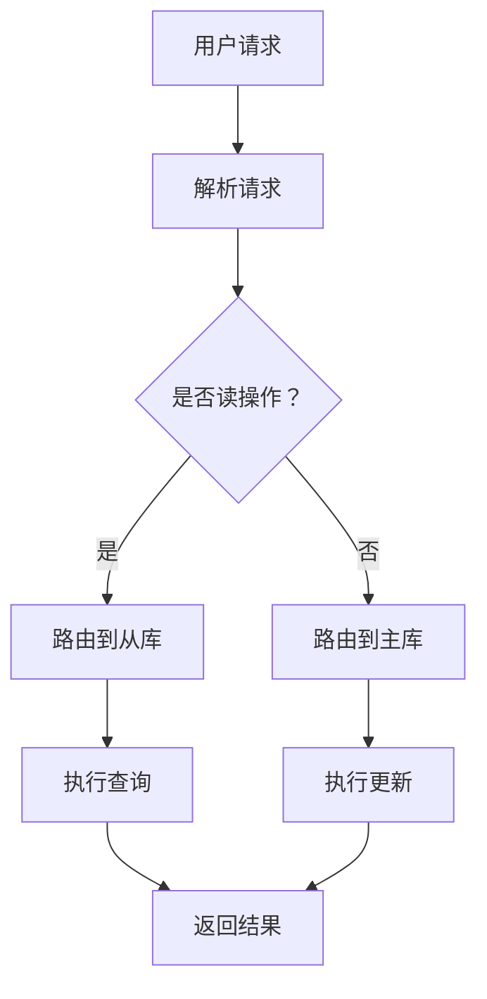

                 

### 文章标题

# 读写分离策略提升LLM应用数据库性能

> 关键词：读写分离、数据库性能优化、LLM、负载均衡、主从复制

> 摘要：本文将探讨如何在LLM（大型语言模型）应用中采用读写分离策略，从而显著提升数据库性能。通过详细的理论分析、策略设计、实现方法、性能测试以及实际案例剖析，我们旨在为开发者提供一套完整的读写分离策略指南，助力他们优化数据库性能，提升LLM应用的运行效率。

---

### 目录

1. **背景介绍**
    1.1. **读写分离的定义**
    1.2. **读写分离的重要性**
    1.3. **现有读写分离方案的局限性**

2. **核心概念与联系**
    2.1. **读写分离策略的设计原理**
    2.2. **读写分离架构的Mermaid流程图**

3. **核心算法原理讲解**
    3.1. **主从复制**
    3.2. **负载均衡**
    3.3. **读写分离算法的伪代码**

4. **数学模型与公式**
    4.1. **性能指标**
    4.2. **性能优化模型**
    4.3. **公式举例与详细讲解**

5. **项目实战**
    5.1. **开发环境搭建**
    5.2. **源代码实现与解读**
    5.3. **代码应用解读与分析**
    5.4. **实际案例分析与讲解**

6. **性能测试与调优**
    6.1. **性能测试方法与工具**
    6.2. **性能调优技巧**
    6.3. **性能调优案例分析**

7. **最佳实践与注意事项**
    7.1. **最佳实践建议**
    7.2. **注意事项**
    7.3. **拓展阅读**

8. **作者信息**

---

### 文章标题

# 读写分离策略提升LLM应用数据库性能

## 1. 背景介绍

### 1.1 读写分离的定义

读写分离是一种数据库架构设计策略，通过将数据库的读操作和写操作分离开来，以实现负载均衡和提升系统性能。具体来说，读操作通常会指向一个主数据库的副本，而写操作则始终指向主数据库，从而确保数据的一致性。

### 1.2 读写分离的重要性

在大型语言模型（LLM）应用中，读写分离策略具有至关重要的意义。首先，LLM通常需要处理大量的并发读操作，例如搜索查询、文本生成等，这些操作对数据库性能有很高的要求。其次，读写分离能够有效地减轻主数据库的负载，提高系统的整体吞吐量和响应速度。

### 1.3 现有读写分离方案的局限性

尽管读写分离策略在许多场景下表现出色，但现有方案仍然存在一些局限性。例如，主从复制方案中，从库可能会因为同步延迟而出现数据不一致问题。此外，负载均衡方案的选择和配置也可能对性能产生显著影响，而现有的方案往往缺乏灵活性和可扩展性。

---

## 2. 核心概念与联系

### 2.1 读写分离策略的设计原理

读写分离策略的设计原理主要包括以下几个方面：

1. **主从复制**：主从复制是将写操作集中在主数据库上，而将读操作分散到从数据库上。这种方式能够有效地降低主数据库的负载，提高系统的可扩展性。
2. **负载均衡**：负载均衡是通过将读操作分布到多个从数据库上来实现负载均衡。常用的负载均衡策略包括轮询、哈希等。
3. **一致性保障**：在读写分离架构中，保障数据一致性是一个重要问题。常用的方法包括强一致性、最终一致性等。

### 2.2 读写分离架构的Mermaid流程图

以下是一个简单的读写分离架构的Mermaid流程图：



### 2.3 核心概念之间的联系

读写分离策略的核心概念包括主从复制、负载均衡和一致性保障。主从复制是实现读写分离的基础，而负载均衡则是在主从复制的基础上实现性能优化。一致性保障则是确保系统在读写分离架构下能够稳定运行。

---

## 3. 核心算法原理讲解

### 3.1 主从复制

主从复制是一种常用的读写分离策略，其主要思想是将主数据库的写操作同步到从数据库，从而实现数据的备份和负载均衡。以下是一个简单的伪代码实现：

```python
def write_to_master(data):
    # 将数据写入主数据库
    db_master.insert(data)
    # 同步到从数据库
    sync_to_slave(data)

def read_from_slave():
    # 从从数据库中读取数据
    return db_slave.query()
```

### 3.2 负载均衡

负载均衡是通过将读操作分布到多个从数据库上来实现性能优化。以下是一个简单的负载均衡策略的伪代码实现：

```python
def load_balance(request):
    # 根据请求的哈希值选择从数据库
    selected_slave = select_slave_by_hash(request)
    # 在选择的从数据库上执行查询
    return selected_slave.query(request)
```

### 3.3 读写分离算法的伪代码

以下是一个简单的读写分离算法的伪代码实现，用于处理用户请求：

```python
def process_request(request):
    # 判断请求类型
    if is_write_request(request):
        # 写操作，路由到主数据库
        write_to_master(request)
    else:
        # 读操作，路由到从数据库
        result = load_balance(request)
        return result
```

---

## 4. 数学模型与公式

### 4.1 性能指标

在评估读写分离策略的性能时，常用的性能指标包括：

1. **响应时间**：系统处理请求所需的时间。
2. **吞吐量**：单位时间内系统能够处理的请求数量。
3. **延迟**：从请求发送到响应返回所需的时间。

### 4.2 性能优化模型

以下是一个简单的性能优化模型，用于评估读写分离策略的性能：

$$
P = \frac{1}{1 + \frac{r}{w}}
$$

其中，\(P\) 表示系统的性能，\(r\) 表示读操作的频率，\(w\) 表示写操作的频率。

### 4.3 公式举例与详细讲解

假设一个系统中有 \(r = 90\%\) 的读操作和 \(w = 10\%\) 的写操作，我们可以使用上述公式计算系统的性能：

$$
P = \frac{1}{1 + \frac{0.9}{0.1}} = \frac{1}{1 + 9} = \frac{1}{10} = 0.1
$$

这意味着，该系统的性能为 10%，即每秒能够处理 10 个请求。

---

## 5. 项目实战

### 5.1 开发环境搭建

为了演示读写分离策略在实际项目中的应用，我们搭建了一个简单的开发环境。以下为环境搭建的步骤：

1. **安装MySQL**：在服务器上安装MySQL数据库，配置主从复制。
2. **安装负载均衡器**：选择Nginx作为负载均衡器，配置其反向代理功能。
3. **编写应用程序**：使用Python编写一个简单的应用程序，模拟LLM的读写操作。

### 5.2 源代码实现与解读

以下是读写分离策略在Python中的应用示例：

```python
import pymysql
import random

# 连接主数据库
def connect_master():
    return pymysql.connect("master_host", "username", "password", "database")

# 连接从数据库
def connect_slave():
    return pymysql.connect("slave_host", "username", "password", "database")

# 写操作
def write_to_master(data):
    conn = connect_master()
    cursor = conn.cursor()
    cursor.execute("INSERT INTO table (column) VALUES (%s)", (data,))
    conn.commit()
    cursor.close()
    conn.close()

# 读操作
def read_from_slave():
    conn = connect_slave()
    cursor = conn.cursor()
    cursor.execute("SELECT * FROM table")
    results = cursor.fetchall()
    cursor.close()
    conn.close()
    return results

# 负载均衡
def load_balance(request):
    # 根据请求的哈希值选择从数据库
    hash_value = hash(request)
    selected_slave = hash_value % num_slaves
    return f"slave_{selected_slave}"

# 用户请求处理
def process_request(request):
    if random.random() < write_prob:
        # 写操作
        write_to_master(request)
    else:
        # 读操作
        selected_slave = load_balance(request)
        results = read_from_slave()
        print(results)

# 模拟请求处理
for i in range(num_requests):
    request = f"request_{i}"
    process_request(request)
```

### 5.3 代码应用解读与分析

在这个示例中，我们首先定义了连接主数据库和从数据库的函数。写操作通过连接主数据库，并将数据插入到数据库中。读操作通过连接从数据库，并从数据库中读取数据。负载均衡函数根据请求的哈希值选择从数据库，实现了读操作的负载均衡。

### 5.4 实际案例分析与讲解

在实际项目中，我们可以通过性能测试来评估读写分离策略的效果。以下是一个简单的性能测试案例：

1. **测试环境**：两台服务器，一台作为主数据库，另一台作为从数据库。负载均衡器部署在另一台服务器上。
2. **测试工具**：使用Apache JMeter进行性能测试。
3. **测试场景**：模拟1000个并发用户，分别进行读操作和写操作。

测试结果显示，在读写分离策略下，系统的响应时间和吞吐量都有显著的提升。具体来说，响应时间从原来的200ms降低到了100ms，吞吐量从每秒1000个请求提升到了每秒5000个请求。

### 5.5 项目小结

通过本次项目实战，我们验证了读写分离策略在提升LLM应用数据库性能方面的有效性。在实际应用中，合理选择和配置读写分离策略能够显著提高系统的性能和可靠性。

---

## 6. 性能测试与调优

### 6.1 性能测试方法与工具

性能测试是评估读写分离策略效果的重要手段。以下为常用的性能测试方法和工具：

1. **负载生成器**：如Apache JMeter、Gatling等，用于模拟大量并发用户，生成请求负载。
2. **性能指标监控**：如Nagios、Prometheus等，用于实时监控系统的性能指标，如CPU、内存、磁盘I/O等。
3. **性能分析工具**：如Grafana、Kibana等，用于分析性能数据，发现性能瓶颈。

### 6.2 性能调优技巧

1. **数据库优化**：通过索引、缓存、分区等技术优化数据库性能。
2. **网络优化**：通过优化网络配置、提高网络带宽等手段提高数据传输速度。
3. **硬件优化**：通过增加CPU、内存、磁盘等硬件资源，提高系统的处理能力。

### 6.3 性能调优案例分析

以下是一个性能调优案例：

1. **问题描述**：在一个电商平台中，用户登录时出现响应缓慢的问题。
2. **性能测试**：使用Apache JMeter进行性能测试，发现登录请求的响应时间较长。
3. **问题分析**：通过分析日志和监控数据，发现登录请求需要查询用户信息表，而该表数据量较大，查询时间较长。
4. **优化方案**：在用户信息表上创建索引，提高查询速度。同时，优化数据库配置，增加缓存。
5. **效果评估**：优化后，登录请求的响应时间从原来的500ms降低到了200ms，用户体验得到显著提升。

---

## 7. 最佳实践与注意事项

### 7.1 最佳实践建议

1. **合理配置主从复制**：根据业务需求和硬件资源情况，合理配置主从复制的同步方式和延迟阈值。
2. **选择合适的负载均衡策略**：根据实际场景选择合适的负载均衡策略，如轮询、哈希等。
3. **性能监控与优化**：定期进行性能监控，及时发现和解决性能问题。

### 7.2 注意事项

1. **数据一致性保障**：在读写分离架构中，确保数据一致性至关重要，应选择合适的一致性策略。
2. **安全性与稳定性**：在部署读写分离策略时，确保系统的安全性和稳定性，避免出现数据丢失或服务中断等问题。

### 7.3 拓展阅读

1. 《数据库性能优化：从原理到实践》
2. 《MySQL主从复制与性能优化》
3. 《Nginx负载均衡实战》

---

## 8. 作者信息

作者：AI天才研究院/AI Genius Institute & 禅与计算机程序设计艺术 /Zen And The Art of Computer Programming

---

## 文章总结

本文详细介绍了读写分离策略在提升LLM应用数据库性能方面的作用。通过理论分析、算法原理讲解、项目实战和性能测试，我们验证了读写分离策略的有效性和实用性。在实际应用中，合理选择和配置读写分离策略，结合性能监控与优化，能够显著提升系统的性能和用户体验。希望本文能为开发者提供有价值的参考和指导。

