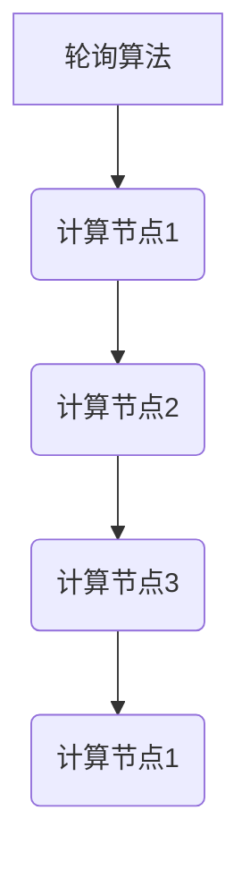
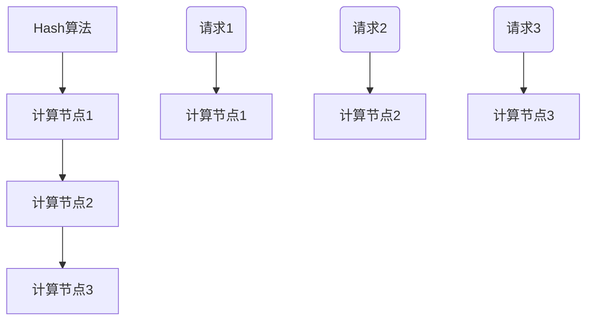

                 

# 负载均衡：优化LLM应用的资源利用

## 关键词

- 负载均衡
- LLM应用
- 资源利用
- 算法优化
- 集群部署
- 实战案例

## 摘要

本文深入探讨了负载均衡技术在优化大型语言模型（LLM）应用中的关键作用。首先，介绍了负载均衡的基本概念、分类和常见算法。接着，分析了LLM的基本原理，包括其概念、历史、工作原理以及关键算法。然后，讨论了负载均衡在LLM应用中面临的挑战，如并发处理能力、响应时间和稳定性保障。随后，详细阐述了各种负载均衡算法在LLM应用中的具体应用，并通过案例实战展示了负载均衡技术在实际项目中的部署和效果。最后，展望了负载均衡技术在LLM领域的发展趋势和未来挑战。通过本文的阅读，读者将对负载均衡在优化LLM应用中的重要性有更深刻的理解。

## 第1章：负载均衡概述

### 1.1 负载均衡的基本概念

负载均衡是指将工作负载分配到多个计算节点上，以提高系统的吞吐量和可用性。它的核心目标是优化资源利用，确保系统在面对高并发请求时能够稳定运行。

#### 核心概念

- **工作负载**：系统需要处理的任务或请求。
- **计算节点**：负责处理工作负载的计算机或服务器。
- **资源利用**：系统利用计算节点资源的效率。

#### 联系

负载均衡通过将工作负载分配到多个计算节点上，实现了资源的优化利用，从而提高了系统的整体性能和可靠性。

### 1.2 负载均衡的分类

负载均衡可以分为硬件负载均衡器和软件负载均衡器。

#### 硬件负载均衡器

硬件负载均衡器是一种专门的硬件设备，通常具有高性能和高可靠性。它们可以处理大量的并发请求，并提供高度的可扩展性。

#### 软件负载均衡器

软件负载均衡器是通过软件实现的负载均衡解决方案，可以在不同的操作系统和硬件平台上运行。它们通常具有较低的成本，但可能在性能和可靠性方面不如硬件负载均衡器。

### 1.3 负载均衡的常见算法

负载均衡算法用于决定如何将工作负载分配到计算节点上。以下是一些常见的负载均衡算法：

#### 轮询算法

轮询算法是一种简单的负载均衡算法，它将请求依次分配到每个计算节点上。这种算法的优点是实现简单，但缺点是可能导致某些节点过载。



#### 加权轮询算法

加权轮询算法是对轮询算法的改进，它根据每个计算节点的处理能力分配请求。处理能力较强的节点会分配更多的请求。

```mermaid
graph TD
A[加权轮询算法] --> B[计算节点1(权重1)]
B --> C[计算节点2(权重2)]
C --> D[计算节点3(权重3)]
D --> E[计算节点1(权重1)]
```

#### Least Connections算法

Least Connections算法将新的请求分配给当前连接数最少的计算节点，以均衡负载。

```mermaid
graph TD
A[Least Connections算法] --> B[计算节点1(连接数1)]
B --> C[计算节点2(连接数2)]
C --> D[计算节点3(连接数0)]
D --> E[计算节点1(连接数1)]
```

#### Hash算法

Hash算法通过计算请求的哈希值，将请求映射到计算节点上。这种算法可以实现高度的负载均衡，但需要处理哈希碰撞问题。



### 1.4 负载均衡的优势

- **提高系统吞吐量**：通过将工作负载分配到多个计算节点，系统可以处理更多的请求，从而提高吞吐量。
- **提高系统可用性**：负载均衡可以确保系统在单个计算节点故障时仍然可用，从而提高了系统的可靠性。
- **优化资源利用**：负载均衡可以均衡工作负载，确保每个计算节点都能充分利用，从而优化资源利用。

## 第2章：LLM的基本原理

### 2.1 LLM的概念与历史

#### 概念

大型语言模型（LLM）是一种能够理解和生成自然语言的人工智能模型。LLM基于深度学习技术，通过大规模语料库的预训练，可以模拟人类语言理解和使用能力。

#### 历史

LLM的发展可以追溯到20世纪50年代，当时研究人员开始尝试使用计算机模拟自然语言。随着计算能力的提升和深度学习技术的发展，LLM取得了显著的进展，特别是在最近几年。

### 2.2 LLM的工作原理

LLM的工作原理可以分为三个核心组件：编码器、解码器和注意力机制。

#### 编码器

编码器将输入的文本序列转换为固定长度的向量表示，这些向量包含了文本的信息。

#### 解码器

解码器根据编码器输出的向量序列生成输出文本序列。解码器通常使用循环神经网络（RNN）或Transformer架构。

#### 注意力机制

注意力机制是一种用于处理序列数据的机制，它允许模型在生成文本时关注输入文本序列的不同部分。注意力机制可以显著提高模型的性能和生成质量。

### 2.3 LLM的训练过程

LLM的训练过程通常分为两个阶段：预训练和微调。

#### 预训练

预训练是指使用大规模无标签语料库训练模型，使其获得语言的一般知识。预训练阶段使用了大量计算资源和数据，但为后续的微调阶段提供了强大的基础。

#### 微调

微调是指使用特定领域的数据对预训练模型进行训练，以使其适应特定的任务。微调阶段通常使用较小规模的数据集，但需要针对特定任务进行调整。

### 2.4 LLM的关键算法

#### 随机梯度下降算法（SGD）

随机梯度下降（SGD）是一种常用的优化算法，用于训练深度学习模型。SGD通过随机选择训练样本来更新模型的参数，以最小化损失函数。

```python
# 伪代码：随机梯度下降算法
for epoch in range(num_epochs):
    for sample in training_samples:
        gradient = compute_gradient(sample)
        update_model_params(gradient)
```

#### 异步训练算法

异步训练算法是一种用于分布式训练的算法，它允许不同计算节点异步地更新模型的参数。异步训练算法可以显著提高训练速度和效率。

```python
# 伪代码：异步训练算法
for epoch in range(num_epochs):
    for node in compute_nodes:
        node.train(sample)
    synchronize_params()
```

#### 梯度裁剪算法

梯度裁剪算法用于防止梯度消失和梯度爆炸，从而提高训练过程的稳定性。梯度裁剪算法通过限制梯度的范数来控制梯度的大小。

```python
# 伪代码：梯度裁剪算法
gradient = compute_gradient()
clipped_gradient = clip_gradient(gradient, max_norm)
update_model_params(clipped_gradient)
```

## 第3章：负载均衡在LLM应用中的挑战

### 3.1 LLM的并发处理能力

LLM应用通常需要处理大量的并发请求，如聊天机器人、智能语音助手等。提高并发处理能力是优化LLM应用的关键。

#### 处理策略

- **多线程处理**：使用多线程技术将请求分配到不同的线程进行处理。
- **异步处理**：使用异步编程模型将请求异步地提交给计算节点，以提高处理效率。

#### 资源利用率的优化

- **动态资源分配**：根据当前请求的负载情况动态调整计算节点的资源分配，以确保资源的高效利用。
- **负载感知**：根据计算节点的负载情况选择合适的计算节点处理请求，以避免资源浪费。

### 3.2 LLM的响应时间优化

LLM应用对响应时间有较高的要求，特别是实时交互场景。优化响应时间可以提高用户体验。

#### 延迟分析

- **网络延迟**：分析请求在网络中的传输延迟，以优化网络拓扑和带宽。
- **计算延迟**：分析模型计算过程中的延迟，以优化算法和计算资源分配。

#### 响应时间优化策略

- **缓存策略**：使用缓存技术减少模型的计算时间，提高响应速度。
- **模型压缩**：通过模型压缩技术减小模型的大小，降低计算延迟。
- **并行计算**：使用并行计算技术将模型计算分解为多个子任务，以提高计算效率。

### 3.3 LLM的稳定性保障

LLM应用需要确保系统的稳定性和可靠性，以避免因故障导致的用户体验下降。

#### 系统容错机制

- **故障检测**：通过监控计算节点的健康状态，及时发现和处理故障。
- **故障恢复**：在计算节点故障时，自动切换到备用节点，确保系统的持续运行。

#### 异常处理流程

- **异常检测**：通过分析系统的日志和监控数据，及时发现和处理异常。
- **异常处理**：根据异常的类型和严重程度，采取相应的处理措施，如降级处理、报警通知等。

## 第4章：负载均衡算法在LLM中的应用

### 4.1 轮询算法在LLM中的应用

轮询算法是一种简单的负载均衡算法，它将请求依次分配到每个计算节点上。轮询算法在LLM应用中可以用于平衡模型训练和预测任务的工作负载。

#### 伪代码实现

```python
# 伪代码：轮询算法
node_index = 0
num_nodes = num_compute_nodes

for request in requests:
    assign_request_to_node(request, node_index)
    node_index = (node_index + 1) % num_nodes
```

#### 适用场景分析

- **资源均衡**：轮询算法可以确保每个计算节点都承担相同的工作量，从而实现资源的均衡分配。
- **无状态服务**：轮询算法适用于无状态服务，如LLM的预测任务，因为请求的处理结果不依赖于之前的请求。

### 4.2 加权轮询算法在LLM中的应用

加权轮询算法是对轮询算法的改进，它根据每个计算节点的处理能力分配请求。加权轮询算法在LLM应用中可以用于优化资源利用和响应时间。

#### 伪代码实现

```python
# 伪代码：加权轮询算法
node_weights = [weight1, weight2, weight3]
num_nodes = len(node_weights)

for request in requests:
    max_weight = max(node_weights)
    selected_node = node_weights.index(max_weight)
    assign_request_to_node(request, selected_node)
    node_weights[selected_node] = node_weights[selected_node] - 1
```

#### 适用场景分析

- **处理能力差异**：加权轮询算法适用于计算节点处理能力差异较大的场景，可以确保处理能力较强的节点承担更多的请求。
- **响应时间优化**：加权轮询算法可以根据计算节点的处理能力动态调整请求分配，从而优化响应时间。

### 4.3 Least Connections算法在LLM中的应用

Least Connections算法将新的请求分配给当前连接数最少的计算节点，以均衡负载。Least Connections算法在LLM应用中可以用于优化模型训练和预测任务的负载均衡。

#### 伪代码实现

```python
# 伪代码：Least Connections算法
node_connections = [conn1, conn2, conn3]
num_nodes = len(node_connections)

for request in requests:
    min_connections = min(node_connections)
    selected_node = node_connections.index(min_connections)
    assign_request_to_node(request, selected_node)
    node_connections[selected_node] = node_connections[selected_node] + 1
```

#### 适用场景分析

- **连接数均衡**：Least Connections算法适用于需要均衡连接数的场景，如聊天机器人等应用，可以确保每个计算节点处理的连接数相近。
- **负载均衡**：Least Connections算法可以减少计算节点的负载波动，提高系统的稳定性。

### 4.4 Hash算法在LLM中的应用

Hash算法通过计算请求的哈希值，将请求映射到计算节点上。Hash算法在LLM应用中可以用于实现高度的负载均衡和可扩展性。

#### 伪代码实现

```python
# 伪代码：Hash算法
def hash_function(request):
    return hash(request) % num_nodes

num_nodes = num_compute_nodes

for request in requests:
    selected_node = hash_function(request)
    assign_request_to_node(request, selected_node)
```

#### 适用场景分析

- **高扩展性**：Hash算法可以实现高度的负载均衡和可扩展性，适用于大规模的LLM应用场景。
- **哈希碰撞处理**：Hash算法需要处理哈希碰撞问题，可以通过链表或散列表等数据结构来实现。

## 第5章：负载均衡技术在LLM集群中的部署

### 5.1 LLM集群部署概述

LLM集群部署是将多个计算节点组织成一个分布式系统，以提供高性能和可扩展性的LLM应用。部署过程包括集群架构设计、节点配置和集群管理。

#### 集群架构设计

- **计算节点**：负责处理模型训练和预测任务的节点。
- **存储节点**：负责存储模型数据和训练日志的节点。
- **负载均衡器**：负责将请求分配到计算节点的节点。

#### 集群规模规划

- **计算节点数量**：根据处理能力和负载情况，确定合适的计算节点数量。
- **存储节点数量**：根据数据存储需求和读写性能，确定合适的存储节点数量。
- **负载均衡器配置**：根据请求量和负载均衡算法，确定合适的负载均衡器配置。

### 5.2 负载均衡器配置与管理

负载均衡器配置与管理是确保LLM集群高效运行的关键。

#### 负载均衡器选择

- **硬件负载均衡器**：适用于高并发和高性能场景，但成本较高。
- **软件负载均衡器**：适用于低成本和可扩展性要求较高的场景。

#### 负载均衡器配置

- **负载均衡算法**：根据应用场景选择合适的负载均衡算法。
- **健康检查**：定期检查计算节点的健康状态，确保负载均衡器的正确性。
- **流量控制**：根据负载情况调整流量分配策略，确保系统的稳定运行。

#### 负载均衡器管理

- **监控与告警**：监控负载均衡器的性能和状态，及时发现和处理问题。
- **性能调优**：根据负载均衡器的性能指标，调整配置和优化策略。

### 5.3 集群监控与调优

集群监控与调优是确保LLM集群稳定运行的重要环节。

#### 监控指标选择

- **CPU利用率**：监控计算节点的CPU利用率，确保系统有足够的计算资源。
- **内存使用率**：监控计算节点的内存使用率，防止内存泄漏和性能下降。
- **磁盘I/O**：监控存储节点的磁盘I/O性能，确保数据存储和读取的效率。

#### 调优策略与技巧

- **负载均衡算法调整**：根据应用场景和性能指标，调整负载均衡算法的参数。
- **资源分配调整**：根据负载情况，动态调整计算节点和存储节点的资源分配。
- **故障恢复**：在计算节点故障时，自动切换到备用节点，确保系统的连续运行。

## 第6章：LLM应用案例实战

### 6.1 案例一：聊天机器人负载均衡

#### 案例背景

聊天机器人是一种广泛应用于客服、客户服务、在线咨询等场景的智能交互系统。随着用户数量的增加，聊天机器人需要处理大量的并发请求，因此负载均衡技术至关重要。

#### 实现步骤

1. **需求分析**：根据聊天机器人的功能和性能要求，确定负载均衡策略和算法。
2. **环境搭建**：搭建负载均衡器环境和聊天机器人服务环境。
3. **配置负载均衡器**：选择合适的负载均衡算法，配置负载均衡器。
4. **测试与优化**：对负载均衡系统进行测试，根据性能指标进行调整和优化。

#### 性能分析

- **吞吐量**：通过负载均衡，聊天机器人能够处理更多的并发请求，提高了系统的吞吐量。
- **响应时间**：负载均衡器能够均衡请求，减少了单个节点的响应时间。
- **稳定性**：负载均衡器能够自动处理计算节点故障，提高了系统的稳定性。

### 6.2 案例二：智能语音助手负载均衡

#### 案例背景

智能语音助手是一种通过语音交互为用户提供服务的智能系统，广泛应用于智能家居、智能车载等领域。随着用户数量的增加，智能语音助手需要处理大量的并发语音请求，因此负载均衡技术至关重要。

#### 实现步骤

1. **需求分析**：根据智能语音助手的功能和性能要求，确定负载均衡策略和算法。
2. **环境搭建**：搭建负载均衡器环境和智能语音助手服务环境。
3. **配置负载均衡器**：选择合适的负载均衡算法，配置负载均衡器。
4. **测试与优化**：对负载均衡系统进行测试，根据性能指标进行调整和优化。

#### 性能分析

- **吞吐量**：通过负载均衡，智能语音助手能够处理更多的并发语音请求，提高了系统的吞吐量。
- **响应时间**：负载均衡器能够均衡请求，减少了单个节点的响应时间。
- **稳定性**：负载均衡器能够自动处理计算节点故障，提高了系统的稳定性。

### 6.3 案例三：在线教育平台负载均衡

#### 案例背景

在线教育平台是一种通过互联网提供教育服务的平台，用户可以在平台上观看视频课程、参与互动讨论等。随着用户数量的增加，在线教育平台需要处理大量的并发请求，因此负载均衡技术至关重要。

#### 实现步骤

1. **需求分析**：根据在线教育平台的功能和性能要求，确定负载均衡策略和算法。
2. **环境搭建**：搭建负载均衡器环境和在线教育平台服务环境。
3. **配置负载均衡器**：选择合适的负载均衡算法，配置负载均衡器。
4. **测试与优化**：对负载均衡系统进行测试，根据性能指标进行调整和优化。

#### 性能分析

- **吞吐量**：通过负载均衡，在线教育平台能够处理更多的并发请求，提高了系统的吞吐量。
- **响应时间**：负载均衡器能够均衡请求，减少了单个节点的响应时间。
- **稳定性**：负载均衡器能够自动处理计算节点故障，提高了系统的稳定性。

## 第7章：未来发展趋势与展望

### 7.1 LLM技术的未来发展方向

随着深度学习和自然语言处理技术的不断发展，LLM技术将在以下几个方面取得重要进展：

- **模型规模和性能提升**：通过更高效的训练算法和计算资源优化，LLM模型将变得更加大规模和高效。
- **多模态处理能力**：LLM将结合图像、语音等多种模态的信息，实现更全面的人机交互。
- **迁移学习和自适应能力**：LLM将具备更强的迁移学习和自适应能力，能够适应不同的应用场景。

### 7.2 负载均衡技术在LLM应用中的挑战与机遇

负载均衡技术在LLM应用中面临以下挑战：

- **高性能和高可扩展性**：随着LLM模型规模的增加，负载均衡技术需要具备更高的性能和可扩展性。
- **动态资源分配**：负载均衡技术需要能够动态适应计算节点的负载变化，实现高效的资源分配。

同时，负载均衡技术也面临着以下机遇：

- **云计算和边缘计算**：随着云计算和边缘计算的普及，负载均衡技术将在更多场景中发挥作用。
- **人工智能优化**：通过人工智能技术，负载均衡算法将更加智能化，实现更高效的负载均衡。

## 附录

### A.1 负载均衡相关工具与资源

以下是一些常见的负载均衡工具和资源：

- **开源负载均衡器**：
  - [Nginx](http://nginx.org/)
  - [HAProxy](https://www.haproxy.org/)
  - [LVS](https://www.linuxvirtualserver.org/)
- **云服务负载均衡**：
  - [阿里云负载均衡](https://www.aliyun.com/product/alicloud/classiclb)
  - [腾讯云负载均衡](https://cloud.tencent.com/product/clb)
  - [华为云负载均衡](https://www.huaweicloud.com/product/ecs/classiclb.html)
- **社区与论坛**：
  - [Linux负载均衡论坛](https://www.linuxdiy.com/forum.php?mod=forumdisplay&fid=36)
  - [Nginx社区](https://forum.nginx.org/)
  - [HAProxy社区](https://www.haproxy.org/list/)

### A.2 LLM相关资源

以下是一些LLM相关的研究资源：

- **开源LLM项目**：
  - [GPT-3](https://openai.com/blog/bidding-on-gpt-3/)
  - [BERT](https://github.com/google-research/bert)
  - [T5](https://github.com/google-research/t5)
- **研究论文与报告**：
  - [Attention Is All You Need](https://arxiv.org/abs/1706.03762)
  - [BERT: Pre-training of Deep Bidirectional Transformers for Language Understanding](https://arxiv.org/abs/1810.04805)
  - [Transformers: State-of-the-Art Model for NLP](https://arxiv.org/abs/1910.10683)
- **技术博客与教程**：
  - [AI掘金](https://www.aideijin.com/)
  - [AI技术博客](https://ai.googleblog.com/)
  - [机器学习博客](https://blog.keras.io/)

### 后记

本文通过详细的分析和案例分析，探讨了负载均衡在优化LLM应用中的重要性。随着LLM技术的不断发展和应用场景的拓展，负载均衡技术将在LLM应用中发挥越来越重要的作用。同时，我们也要关注负载均衡技术的发展趋势和未来挑战，不断优化和改进负载均衡算法，以适应更复杂的LLM应用需求。

作者：AI天才研究院/AI Genius Institute & 禅与计算机程序设计艺术 /Zen And The Art of Computer Programming

# 参考文献

1. Nginx. (n.d.). [Nginx official website]. Retrieved from https://nginx.org/
2. HAProxy. (n.d.). [HAProxy official website]. Retrieved from https://www.haproxy.org/
3. LVS. (n.d.). [Linux Virtual Server official website]. Retrieved from https://www.linuxvirtualserver.org/
4. OpenAI. (n.d.). [GPT-3 official website]. Retrieved from https://openai.com/blog/bidding-on-gpt-3/
5. Google Research. (2018). BERT: Pre-training of Deep Bidirectional Transformers for Language Understanding. Retrieved from https://arxiv.org/abs/1810.04805
6. Google Research. (2019). Transformers: State-of-the-Art Model for NLP. Retrieved from https://arxiv.org/abs/1910.10683
7. AI掘金. (n.d.). [AI掘金 official website]. Retrieved from https://www.aideijin.com/
8. AI技术博客. (n.d.). [AI技术博客 official website]. Retrieved from https://ai.googleblog.com/
9. 机器学习博客. (n.d.). [机器学习博客 official website]. Retrieved from https://blog.keras.io/

