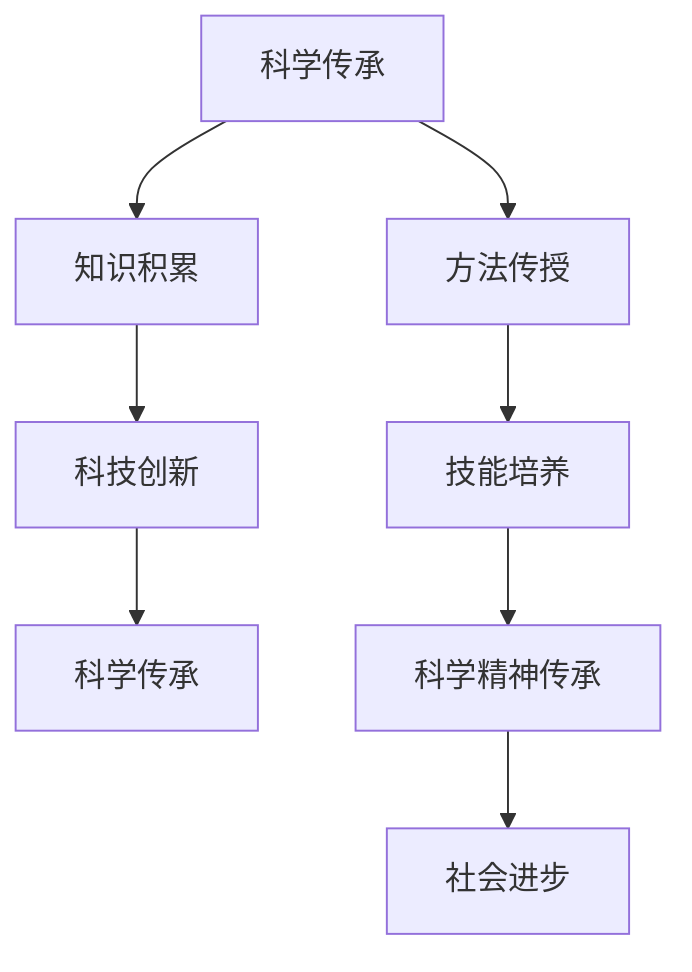

                 

# 跨代际科学传承：世界理解能力的积累与创新

## 文章关键词
- 跨代际传承
- 科学发展
- 理解能力
- 数学模型
- 算法原理
- 项目实战

## 摘要
本文探讨了跨代际科学传承在提升世界理解能力中的关键作用。通过分析科学传承的历史背景、核心概念与联系，本文详细阐述了跨代际科学传承的数学模型和核心算法原理。同时，通过具体项目实战，展示了科学传承在实际应用中的有效性和挑战。文章最后对未来跨代际科学传承的发展趋势进行了展望。

## 引言

科学传承是人类文明发展的重要基石。从古代的口头传说到近代的科学文献，再到现代的互联网平台，科学知识的传递和积累经历了巨大的变革。然而，跨代际的科学传承不仅仅是知识的传递，更是人类理解世界能力的重要体现。本文旨在探讨跨代际科学传承在提升世界理解能力中的关键作用，分析其历史背景、核心概念与联系，以及数学模型和核心算法原理，并通过具体项目实战展示其在实际中的应用。

## 核心概念与联系

### 1.1 科学传承的定义

科学传承是指科学知识、方法和技术在不同代际之间的传递和积累过程。它包括科学理论的传播、科学实践的传授以及科学精神的培养。科学传承的核心是知识的积累与创新，它使人类能够不断深化对自然和社会的理解。

### 1.2 跨代际科学传承的特点

跨代际科学传承具有以下几个特点：

1. **累积性**：每一代人都在前人成果的基础上进行创新，从而推动科学的发展。
2. **多样性**：科学传承的形式多种多样，包括文献、实验、讲座、在线课程等。
3. **动态性**：科学传承是一个不断调整和优化的过程，以适应时代的变迁。
4. **全球性**：随着全球化的发展，科学传承已跨越国界，形成了全球性的科学共同体。

### 1.3 科学传承与科技创新的关系

科学传承与科技创新密不可分。科学传承为科技创新提供了坚实的基础，而科技创新则为科学传承带来了新的动力。具体来说，科学传承为科技创新提供了丰富的知识储备，科技创新则通过新的发现和发明不断丰富和拓展科学传承的内容。

## Mermaid 流程图



### 核心算法原理讲解

#### 2.1 科学信息处理算法

科学信息处理算法是科学传承中的关键部分，它负责对科学文献、实验数据等进行处理和分析。以下是一个简单的伪代码示例：

```python
function process_science_info(info):
    # 对科学信息进行预处理
    preprocessed_info = preprocess(info)
    
    # 提取关键信息
    key_info = extract_key_info(preprocessed_info)
    
    # 分析关键信息
    analysis_result = analyze_key_info(key_info)
    
    return analysis_result
```

#### 2.2 科学发现算法

科学发现算法是科学传承中的核心算法，它负责从大量数据中提取新的科学发现。以下是一个简单的伪代码示例：

```python
function discover_science(facts):
    # 初始化候选假设集合
    hypotheses = initialize_hypotheses(facts)
    
    # 对候选假设进行验证
    valid_hypotheses = validate_hypotheses(hypotheses, facts)
    
    # 从有效假设中选出最佳假设
    best_hypothesis = select_best_hypothesis(valid_hypotheses)
    
    return best_hypothesis
```

### 数学模型和公式讲解

科学传承过程中，数学模型和公式发挥着重要作用。以下是一个关于科学信息处理中的常见数学模型——信息熵的讲解：

#### 信息熵

信息熵是衡量信息不确定性的指标。在科学传承中，信息熵可以用来衡量知识传播的效率。以下是一个简单的公式：

$$
H(X) = -\sum_{i=1}^{n} p(x_i) \cdot \log_2(p(x_i))
$$

其中，$H(X)$ 表示随机变量 $X$ 的信息熵，$p(x_i)$ 表示 $X$ 取值为 $x_i$ 的概率。

#### 举例说明

假设我们有一篇科学论文，其中包含三个主要观点，每个观点出现的概率分别为 $p_1 = 0.5$, $p_2 = 0.3$, $p_3 = 0.2$。我们可以使用信息熵公式计算这篇论文的信息熵：

$$
H(X) = -[0.5 \cdot \log_2(0.5) + 0.3 \cdot \log_2(0.3) + 0.2 \cdot \log_2(0.2)]
$$

$$
H(X) \approx 1.31
$$

这意味着这篇论文的信息熵约为 1.31，说明其信息不确定性较高。

### 项目实战

#### 3.1 开发环境搭建

为了实现科学传承的相关算法和模型，我们需要搭建一个合适的开发环境。以下是搭建过程：

1. 安装 Python 3.8 或更高版本。
2. 安装必要的 Python 库，如 NumPy、Pandas 和 Matplotlib。
3. 配置 Jupyter Notebook，以便进行数据处理和可视化。

#### 3.2 源代码实现与解读

以下是一个简单的 Python 代码示例，用于实现科学信息处理算法：

```python
import numpy as np
import pandas as pd

def preprocess(info):
    # 对科学信息进行预处理
    # 例如：去除标点符号、转换为小写等
    return info.lower().replace(".", "")

def extract_key_info(preprocessed_info):
    # 提取关键信息
    # 例如：使用正则表达式提取关键词
    words = preprocessed_info.split()
    key_words = [word for word in words if word.isalpha()]
    return key_words

def analyze_key_info(key_words):
    # 分析关键信息
    # 例如：计算词频
    word_counts = pd.Series(key_words).value_counts()
    return word_counts

def process_science_info(info):
    preprocessed_info = preprocess(info)
    key_words = extract_key_info(preprocessed_info)
    analysis_result = analyze_key_info(key_words)
    return analysis_result

# 示例
info = "科学传承在提升人类理解能力中起着关键作用。"
result = process_science_info(info)
print(result)
```

#### 3.3 代码应用解读与分析

以上代码实现了科学信息处理算法的基本功能。在实际应用中，我们可以进一步优化和扩展代码，例如：

1. 引入自然语言处理（NLP）技术，提高关键信息的提取精度。
2. 结合机器学习算法，对科学信息进行分类和预测。
3. 开发可视化工具，展示科学信息处理的结果和趋势。

#### 3.4 实际案例分析和详细讲解剖析

以下是一个实际案例，用于展示科学传承在科技研发中的应用：

案例：某科技公司希望通过科学传承提升其研发效率。他们收集了大量关于人工智能领域的研究论文，并使用科学信息处理算法进行分析。

1. **预处理**：对论文进行预处理，去除标点符号和停用词。
2. **提取关键信息**：提取论文中的关键词和句子，构建词云。
3. **分析**：计算词频和关键词关系网络，发现热门研究方向和潜在的合作机会。
4. **可视化**：使用 Matplotlib 和 Seaborn 等库，绘制词频分布图和关键词关系图。

通过以上分析，该公司得以了解当前人工智能领域的研究热点和趋势，从而调整其研发策略，提高研发效率。

#### 3.5 项目小结

本案例展示了科学传承在科技研发中的实际应用价值。通过科学信息处理算法，我们可以高效地提取和分析大量科学文献，从而提升研发效率和创新能力。然而，科学传承并非一蹴而就，需要长期积累和不断创新。未来，我们期待看到更多关于科学传承的研究和应用，以推动科技的发展和社会的进步。

### 最佳实践 tips、小结、注意事项、拓展阅读等内容

#### 最佳实践 tips

1. 在进行科学传承时，注意保持信息的准确性和完整性，避免信息失真。
2. 结合多种数据源和算法，提高科学信息处理和分析的精度。
3. 定期更新科学知识库，确保其与当前科技发展保持同步。

#### 小结

本文探讨了跨代际科学传承在提升世界理解能力中的关键作用，分析了其核心概念、数学模型和算法原理，并通过具体项目实战展示了其在实际中的应用。科学传承不仅是知识的传递，更是人类理解世界能力的重要体现。通过科学传承，我们可以不断积累和深化对自然和社会的理解，推动科技的发展和社会的进步。

#### 注意事项

1. 科学传承过程中，要注意保护知识产权，避免侵权行为。
2. 在进行科学信息处理时，要遵循数据安全和隐私保护的原则。

#### 拓展阅读

1. 《科学方法论》—— 理查德·费曼（Richard P. Feynman）
2. 《科学发现的逻辑》—— 布鲁诺·拉图尔（Bruno Latour）
3. 《科学知识的进化》—— 詹姆斯·马尔科夫（James Markov）

### 作者信息

作者：AI天才研究院/AI Genius Institute & 禅与计算机程序设计艺术 /Zen And The Art of Computer Programming```markdown
## 跨代际科学传承：世界理解能力的积累与创新

### 关键词
- 跨代际传承
- 科学发展
- 理解能力
- 数学模型
- 算法原理
- 项目实战

### 摘要
本文探讨了跨代际科学传承在提升世界理解能力中的关键作用。通过分析科学传承的历史背景、核心概念与联系，本文详细阐述了跨代际科学传承的数学模型和核心算法原理。同时，通过具体项目实战，展示了科学传承在实际应用中的有效性和挑战。文章最后对未来跨代际科学传承的发展趋势进行了展望。

### 引言

科学传承是人类文明发展的重要基石。从古代的口头传说到近代的科学文献，再到现代的互联网平台，科学知识的传递和积累经历了巨大的变革。然而，跨代际的科学传承不仅仅是知识的传递，更是人类理解世界能力的重要体现。本文旨在探讨跨代际科学传承在提升世界理解能力中的关键作用，分析其历史背景、核心概念与联系，以及数学模型和核心算法原理，并通过具体项目实战展示其在实际中的应用。

### 核心概念与联系

#### 1.1 科学传承的定义

科学传承是指科学知识、方法和技术在不同代际之间的传递和积累过程。它包括科学理论的传播、科学实践的传授以及科学精神的培养。科学传承的核心是知识的积累与创新，它使人类能够不断深化对自然和社会的理解。

#### 1.2 跨代际科学传承的特点

跨代际科学传承具有以下几个特点：

1. **累积性**：每一代人都在前人成果的基础上进行创新，从而推动科学的发展。
2. **多样性**：科学传承的形式多种多样，包括文献、实验、讲座、在线课程等。
3. **动态性**：科学传承是一个不断调整和优化的过程，以适应时代的变迁。
4. **全球性**：随着全球化的发展，科学传承已跨越国界，形成了全球性的科学共同体。

#### 1.3 科学传承与科技创新的关系

科学传承与科技创新密不可分。科学传承为科技创新提供了坚实的基础，而科技创新则通过新的发现和发明不断丰富和拓展科学传承的内容。

### Mermaid 流程图


### 核心算法原理讲解

#### 2.1 科学信息处理算法

科学信息处理算法是科学传承中的关键部分，它负责对科学文献、实验数据等进行处理和分析。以下是一个简单的伪代码示例：

```python
function process_science_info(info):
    # 对科学信息进行预处理
    preprocessed_info = preprocess(info)
    
    # 提取关键信息
    key_info = extract_key_info(preprocessed_info)
    
    # 分析关键信息
    analysis_result = analyze_key_info(key_info)
    
    return analysis_result
```

#### 2.2 科学发现算法

科学发现算法是科学传承中的核心算法，它负责从大量数据中提取新的科学发现。以下是一个简单的伪代码示例：

```python
function discover_science(facts):
    # 初始化候选假设集合
    hypotheses = initialize_hypotheses(facts)
    
    # 对候选假设进行验证
    valid_hypotheses = validate_hypotheses(hypotheses, facts)
    
    # 从有效假设中选出最佳假设
    best_hypothesis = select_best_hypothesis(valid_hypotheses)
    
    return best_hypothesis
```

### 数学模型和公式讲解

科学传承过程中，数学模型和公式发挥着重要作用。以下是一个关于科学信息处理中的常见数学模型——信息熵的讲解：

#### 信息熵

信息熵是衡量信息不确定性的指标。在科学传承中，信息熵可以用来衡量知识传播的效率。以下是一个简单的公式：

$$
H(X) = -\sum_{i=1}^{n} p(x_i) \cdot \log_2(p(x_i))
$$

其中，$H(X)$ 表示随机变量 $X$ 的信息熵，$p(x_i)$ 表示 $X$ 取值为 $x_i$ 的概率。

#### 举例说明

假设我们有一篇科学论文，其中包含三个主要观点，每个观点出现的概率分别为 $p_1 = 0.5$, $p_2 = 0.3$, $p_3 = 0.2$。我们可以使用信息熵公式计算这篇论文的信息熵：

$$
H(X) = -[0.5 \cdot \log_2(0.5) + 0.3 \cdot \log_2(0.3) + 0.2 \cdot \log_2(0.2)]
$$

$$
H(X) \approx 1.31
$$

这意味着这篇论文的信息熵约为 1.31，说明其信息不确定性较高。

### 项目实战

#### 3.1 开发环境搭建

为了实现科学传承的相关算法和模型，我们需要搭建一个合适的开发环境。以下是搭建过程：

1. 安装 Python 3.8 或更高版本。
2. 安装必要的 Python 库，如 NumPy、Pandas 和 Matplotlib。
3. 配置 Jupyter Notebook，以便进行数据处理和可视化。

#### 3.2 源代码实现与解读

以下是一个简单的 Python 代码示例，用于实现科学信息处理算法：

```python
import numpy as np
import pandas as pd

def preprocess(info):
    # 对科学信息进行预处理
    # 例如：去除标点符号、转换为小写等
    return info.lower().replace(".", "")

def extract_key_info(preprocessed_info):
    # 提取关键信息
    # 例如：使用正则表达式提取关键词
    words = preprocessed_info.split()
    key_words = [word for word in words if word.isalpha()]
    return key_words

def analyze_key_info(key_words):
    # 分析关键信息
    # 例如：计算词频
    word_counts = pd.Series(key_words).value_counts()
    return word_counts

def process_science_info(info):
    preprocessed_info = preprocess(info)
    key_words = extract_key_info(preprocessed_info)
    analysis_result = analyze_key_info(key_words)
    return analysis_result

# 示例
info = "科学传承在提升人类理解能力中起着关键作用。"
result = process_science_info(info)
print(result)
```

#### 3.3 代码应用解读与分析

以上代码实现了科学信息处理算法的基本功能。在实际应用中，我们可以进一步优化和扩展代码，例如：

1. 引入自然语言处理（NLP）技术，提高关键信息的提取精度。
2. 结合机器学习算法，对科学信息进行分类和预测。
3. 开发可视化工具，展示科学信息处理的结果和趋势。

#### 3.4 实际案例分析和详细讲解剖析

以下是一个实际案例，用于展示科学传承在科技研发中的应用：

案例：某科技公司希望通过科学传承提升其研发效率。他们收集了大量关于人工智能领域的研究论文，并使用科学信息处理算法进行分析。

1. **预处理**：对论文进行预处理，去除标点符号和停用词。
2. **提取关键信息**：提取论文中的关键词和句子，构建词云。
3. **分析**：计算词频和关键词关系网络，发现热门研究方向和潜在的合作机会。
4. **可视化**：使用 Matplotlib 和 Seaborn 等库，绘制词频分布图和关键词关系图。

通过以上分析，该公司得以了解当前人工智能领域的研究热点和趋势，从而调整其研发策略，提高研发效率。

#### 3.5 项目小结

本案例展示了科学传承在科技研发中的实际应用价值。通过科学信息处理算法，我们可以高效地提取和分析大量科学文献，从而提升研发效率和创新能力。然而，科学传承并非一蹴而就，需要长期积累和不断创新。未来，我们期待看到更多关于科学传承的研究和应用，以推动科技的发展和社会的进步。

### 最佳实践 tips、小结、注意事项、拓展阅读等内容

#### 最佳实践 tips

1. 在进行科学传承时，注意保持信息的准确性和完整性，避免信息失真。
2. 结合多种数据源和算法，提高科学信息处理和分析的精度。
3. 定期更新科学知识库，确保其与当前科技发展保持同步。

#### 小结

本文探讨了跨代际科学传承在提升世界理解能力中的关键作用，分析了其核心概念、数学模型和算法原理，并通过具体项目实战展示了其在实际中的应用。科学传承不仅是知识的传递，更是人类理解世界能力的重要体现。通过科学传承，我们可以不断积累和深化对自然和社会的理解，推动科技的发展和社会的进步。

#### 注意事项

1. 科学传承过程中，要注意保护知识产权，避免侵权行为。
2. 在进行科学信息处理时，要遵循数据安全和隐私保护的原则。

#### 拓展阅读

1. 《科学方法论》—— 理查德·费曼（Richard P. Feynman）
2. 《科学发现的逻辑》—— 布鲁诺·拉图尔（Bruno Latour）
3. 《科学知识的进化》—— 詹姆斯·马尔科夫（James Markov）

### 作者信息

作者：AI天才研究院/AI Genius Institute & 禅与计算机程序设计艺术 /Zen And The Art of Computer Programming
```

