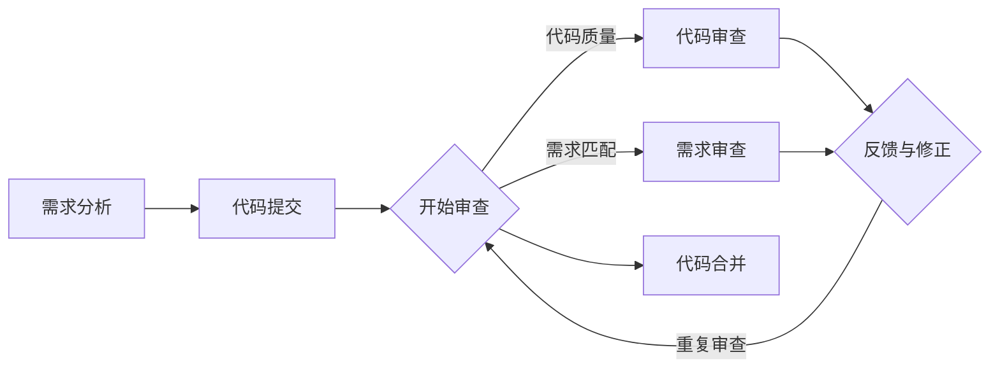
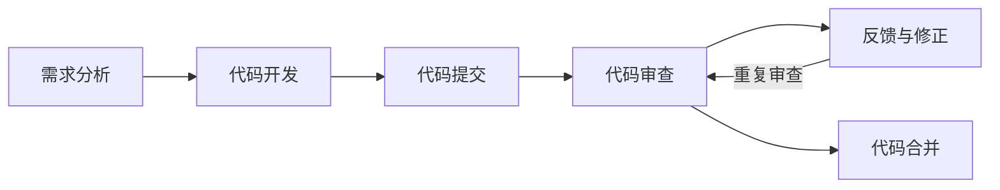

                 

### 文章标题

# 跨团队代码审查在需求实现中的应用

---

**关键词**：跨团队代码审查、需求实现、代码审查流程、协作、算法、应用案例

**摘要**：本文将深入探讨跨团队代码审查在需求实现中的应用。通过介绍跨团队代码审查的核心概念、工作流程、算法原理及其在需求实现中的关键作用，本文旨在为软件开发团队提供有效的代码审查实践指南，提升代码质量和团队协作效率。

---

### 背景介绍

在当今高度复杂和多元化的软件开发环境中，项目往往由多个团队协同完成。每个团队负责不同的模块或功能，这导致了代码的分散和独立性。然而，随着系统规模的扩大和功能的增加，单一团队内部的代码审查已经不足以确保整个系统的稳定性和可靠性。跨团队代码审查应运而生，成为保障软件质量的重要手段之一。

跨团队代码审查不仅关注代码本身的正确性和健壮性，还涉及团队之间的沟通与协作。它通过引入外部视角，对代码进行更全面、深入的检查，有助于发现潜在问题，提高代码质量和团队协作效率。同时，跨团队代码审查也是需求实现过程中不可或缺的一环，能够确保需求被准确理解和实现。

本文将首先介绍跨团队代码审查的核心概念，接着详细阐述其工作流程，并深入探讨代码审查在需求实现中的关键作用。此外，本文还将通过实际案例展示跨团队代码审查的具体应用，最后提供最佳实践和总结。

### 核心概念与联系

#### 跨团队代码审查的概念

跨团队代码审查（Cross-Team Code Review）是一种软件开发实践，旨在通过多个团队成员之间的协作，对代码进行审查，以确保代码质量。与单一团队的代码审查不同，跨团队代码审查涉及不同团队之间的成员，每个团队负责不同的模块或功能。这种审查不仅关注代码的正确性和健壮性，还强调跨团队之间的沟通与协作。

跨团队代码审查的目标包括：

1. **提高代码质量**：通过多个视角的审查，可以更全面地发现潜在的错误和缺陷。
2. **促进知识共享**：团队成员通过审查他人的代码，可以学习和借鉴他人的最佳实践。
3. **确保需求实现**：跨团队代码审查有助于确保每个团队都能准确理解和实现需求。

#### 核心概念之间的关系

跨团队代码审查的核心概念包括代码审查、跨团队协作和需求实现。这些概念之间存在着紧密的联系。

- **代码审查**：是跨团队代码审查的基础，旨在通过审查过程发现和修复代码中的问题。
- **跨团队协作**：是跨团队代码审查的关键，确保不同团队之间能够有效地沟通和协作，共同提高代码质量。
- **需求实现**：是跨团队代码审查的最终目的，确保每个团队都能准确地理解和实现需求。

#### 工作流程

跨团队代码审查的工作流程可以分为以下几个阶段：

1. **需求分析**：在项目启动阶段，明确项目需求和目标，确保所有团队对需求有清晰的理解。
2. **代码提交**：开发团队将各自完成的代码提交到代码库，其他团队可以开始审查。
3. **代码审查**：审查团队对提交的代码进行审查，包括代码质量、功能实现和需求匹配等方面。
4. **反馈与修正**：审查团队将发现的问题和意见反馈给开发团队，开发团队根据反馈进行修正。
5. **重复审查**：修正后的代码需要再次提交进行审查，确保所有问题都得到解决。
6. **代码合并**：在所有团队都完成审查并确认无误后，将代码合并到主分支。

#### Mermaid 流程图

以下是跨团队代码审查的Mermaid流程图：



通过以上流程，跨团队代码审查不仅能够提高代码质量，还能促进团队之间的协作，确保需求的准确实现。

### 核心算法原理讲解

跨团队代码审查中，算法的应用主要体现在代码分析和缺陷检测两个方面。以下将分别介绍这两种算法的核心原理，并通过伪代码和数学公式详细阐述。

#### 1. 静态代码分析

静态代码分析（Static Code Analysis）是一种不运行程序而对源代码进行分析的技术。它主要用于检测代码中的潜在错误、代码质量问题和安全漏洞。静态代码分析算法的核心原理包括语法分析、控制流分析、数据流分析和代码质量评估。

**语法分析**

语法分析是静态代码分析的第一步，它将源代码解析成抽象语法树（Abstract Syntax Tree, AST）。以下是一个简单的语法分析伪代码：

```python
function syntax_analysis(source_code):
    ast = parse_source_code(source_code)
    return ast
```

**控制流分析**

控制流分析旨在分析代码中的控制流，如循环、条件分支等。以下是一个简单的控制流分析伪代码：

```python
function control_flow_analysis(ast):
    control_flow_graph = build_control_flow_graph(ast)
    return control_flow_graph
```

**数据流分析**

数据流分析用于追踪变量在程序中的流动情况，如变量的定义、使用和覆盖。以下是一个简单的数据流分析伪代码：

```python
function data_flow_analysis(control_flow_graph):
    inferences = initialize_inferences()
    for node in control_flow_graph:
        infer_data.Flow(inferences, node)
    return inferences
```

**代码质量评估**

代码质量评估通过计算代码复杂度、代码冗余度等指标来评估代码质量。以下是一个简单的代码质量评估伪代码：

```python
function code_quality_assessment(inferences):
    metrics = calculate_metrics(inferences)
    quality = evaluate_quality(metrics)
    return quality
```

#### 2. 动态代码分析

动态代码分析（Dynamic Code Analysis）是在程序运行时对其进行分析的技术。它主要用于检测运行时的错误、性能问题和安全漏洞。动态代码分析算法的核心原理包括日志分析、性能分析和内存分析。

**日志分析**

日志分析通过分析程序生成的日志文件，来检测程序运行中的错误和异常。以下是一个简单的日志分析伪代码：

```python
function log_analysis(log_file):
    logs = read_logs(log_file)
    errors = find_errors(logs)
    return errors
```

**性能分析**

性能分析通过分析程序运行时的性能指标，如CPU利用率、内存使用情况等，来检测性能瓶颈。以下是一个简单的性能分析伪代码：

```python
function performance_analysis性能分析：
    metrics = capture_performance_metrics()
    bottlenecks = identify_bottlenecks(metrics)
    return bottlenecks
```

**内存分析**

内存分析通过分析程序运行时的内存使用情况，来检测内存泄漏和内存使用效率。以下是一个简单的内存分析伪代码：

```python
function memory_analysis(process_memory):
    leaks = detect_memory_leaks(process_memory)
    efficiency = evaluate_memory_efficiency(process_memory)
    return leaks, efficiency
```

#### 数学模型和数学公式

在代码审查过程中，一些数学模型和公式可以用于评估代码的质量和性能。以下是一个简单的数学模型和公式示例：

**代码复杂度**

$$
C = f(n) = 2n + 2
$$

其中，$C$ 表示代码复杂度，$n$ 表示代码中的函数或方法数。

**代码冗余度**

$$
R = \frac{D_1 + D_2}{2}
$$

其中，$R$ 表示代码冗余度，$D_1$ 和 $D_2$ 分别表示两段代码的重构难度。

通过上述算法和数学模型，跨团队代码审查可以更全面、深入地分析代码，确保代码质量和系统稳定性。

### 数学模型和数学公式

在跨团队代码审查中，数学模型和公式扮演着关键角色，帮助评估代码质量、预测缺陷、优化流程。以下将详细介绍几个常见的数学模型和公式，并通过具体例子进行说明。

#### 1. 缺陷密度模型

缺陷密度模型用于评估代码中的缺陷数量。最常用的缺陷密度模型之一是 **基于行数的缺陷密度模型**：

$$
D = \frac{N_f}{N_l}
$$

其中，$D$ 表示缺陷密度，$N_f$ 表示发现的缺陷数量，$N_l$ 表示代码行数。

**例子**：一个模块有1000行代码，审查过程中发现了10个缺陷。缺陷密度计算如下：

$$
D = \frac{10}{1000} = 0.01
$$

这意味着每100行代码中有1个缺陷。

#### 2. 缺陷发现效率模型

缺陷发现效率模型用于评估代码审查过程中的效率。一个常用的模型是 **帕累托效率模型**：

$$
E = \frac{N_f - N_r}{N_f}
$$

其中，$E$ 表示缺陷发现效率，$N_f$ 表示初始缺陷数量，$N_r$ 表示修复后剩余的缺陷数量。

**例子**：一个模块初始有50个缺陷，经过审查和修复后剩余15个缺陷。缺陷发现效率计算如下：

$$
E = \frac{50 - 15}{50} = 0.70
$$

这意味着审查过程发现了70%的缺陷。

#### 3. 代码质量模型

代码质量模型用于评估代码的总体质量。一个常用的模型是 **代码复杂度模型**，如 **Cyclomatic复杂度**：

$$
C = \text{M} - \text{P} + 2\text{E}
$$

其中，$C$ 表示Cyclomatic复杂度，$\text{M}$ 表示模块中的决定点数，$\text{P}$ 表示模块中的圈数，$\text{E}$ 表示异常点数。

**例子**：一个模块中有5个决定点、3个圈和2个异常点。Cyclomatic复杂度计算如下：

$$
C = 5 - 3 + 2 \times 2 = 7
$$

Cyclomatic复杂度越高，代码越复杂，越可能存在缺陷。

#### 4. 质量成本模型

质量成本模型用于评估代码审查过程中的成本。一个常用的模型是 **质量成本分配模型**：

$$
C_q = C_c + C_r + C_p
$$

其中，$C_q$ 表示总质量成本，$C_c$ 表示预防成本，$C_r$ 表示评估成本，$C_p$ 表示故障成本。

**例子**：预防成本为5000元，评估成本为10000元，故障成本为15000元。总质量成本计算如下：

$$
C_q = 5000 + 10000 + 15000 = 30000
$$

通过这些数学模型和公式，跨团队代码审查可以更科学、系统地评估代码质量，优化审查流程，降低缺陷率和成本。

### 项目实战

#### 开发环境搭建

在进行跨团队代码审查之前，首先需要搭建一个统一的开发环境。以下是搭建开发环境的基本步骤：

1. **选择代码库管理工具**：如Git，用于管理代码版本。
2. **配置代码库服务器**：可以使用GitHub、GitLab等云服务，也可以自建Git服务器。
3. **安装依赖管理工具**：如Maven或Gradle，用于管理项目依赖。
4. **配置代码审查工具**：如SonarQube，用于静态代码分析。
5. **安装IDE**：如IntelliJ IDEA或VS Code，用于代码编辑和调试。

**示例**：

```shell
# 安装Git
sudo apt-get install git

# 配置Git用户信息
git config --global user.name "Your Name"
git config --global user.email "you@example.com"

# 安装Maven
sudo apt-get install maven

# 安装SonarQube
wget https://sonarqube.com/downloads/sonarqube-8.9.zip
sudo unzip sonarqube-8.9.zip -d /opt/sonarqube
sudo ln -s /opt/sonarqube/bin/linux-x86-64/sonar.sh /usr/bin/sonar

# 启动SonarQube
sudo sonar.sh start
```

#### 源代码实现

假设我们正在开发一个简单的Web应用，包括用户注册、登录和文章发布等功能。以下是源代码实现的基本步骤：

1. **创建项目结构**：在代码库中创建项目目录，并建立相应的模块结构。

```shell
mkdir my-web-app
cd my-web-app
mkdir frontend backend
```

2. **编写前端代码**：使用HTML、CSS和JavaScript编写前端页面，并使用Webpack进行模块化管理。

```javascript
// frontend/src/index.js
import React from 'react';
import ReactDOM from 'react-dom';
import App from './App';

ReactDOM.render(<App />, document.getElementById('root'));
```

3. **编写后端代码**：使用Spring Boot构建后端服务，并实现用户注册、登录和文章发布等功能。

```java
// backend/src/main/java/com/myapp/security/UserDetailsService.java
@Service
public class UserDetailsService implements UserDetailsService {

    @Autowired
    private UserRepository userRepository;

    @Override
    public UserDetails loadUserByUsername(String username) throws UsernameNotFoundException {
        User user = userRepository.findByUsername(username);
        if (user == null) {
            throw new UsernameNotFoundException("User not found");
        }
        return user;
    }
}
```

4. **配置依赖**：在项目的pom.xml文件中配置Maven依赖，包括Spring Boot、Spring Security等。

```xml
<dependencies>
    <dependency>
        <groupId>org.springframework.boot</groupId>
        <artifactId>spring-boot-starter-web</artifactId>
    </dependency>
    <dependency>
        <groupId>org.springframework.boot</groupId>
        <artifactId>spring-boot-starter-security</artifactId>
    </dependency>
</dependencies>
```

#### 代码解读与分析

在完成源代码实现后，接下来需要对代码进行解读和分析，以评估其质量。以下是代码解读与分析的步骤：

1. **静态代码分析**：使用SonarQube对代码进行静态分析，检查代码中的潜在问题，如语法错误、潜在缺陷和安全漏洞。

```shell
mvn sonar:sonar
```

2. **动态代码分析**：编写测试用例，对后端服务进行动态分析，检查其在运行时的行为和性能。

```java
// backend/src/test/java/com/myapp/security/UserDetailsServiceTest.java
@Test
void whenLoadUserByUsername_thenCorrectUserIsReturned() {
    UserDetailsService userDetailsService = new UserDetailsService();
    UserDetails user = userDetailsService.loadUserByUsername("user");
    assertEquals("user", user.getUsername());
}
```

3. **代码质量评估**：使用缺陷密度模型和代码复杂度模型评估代码质量。

$$
D = \frac{N_f}{N_l}
$$

$$
C = \text{M} - \text{P} + 2\text{E}
$$

**示例**：

- 缺陷密度：如果在审查过程中发现了5个缺陷，代码总共有1000行，则缺陷密度为0.005。
- 代码复杂度：如果一个模块有5个决定点、3个圈和2个异常点，则Cyclomatic复杂度为7。

通过代码解读与分析，可以更全面地了解代码的质量和潜在问题，为后续的代码审查和优化提供依据。

### 代码应用解读与分析

在完成跨团队代码审查后，我们需要对审查结果进行解读与分析，以确定代码的质量和改进方向。以下是对代码应用解读与分析的步骤：

1. **审查结果汇总**：首先，将所有审查团队发现的问题和意见汇总到一个清单中，包括缺陷类型、严重程度、代码位置等。

2. **分类整理**：根据问题类型对审查结果进行分类整理，如语法错误、逻辑错误、安全漏洞等。

3. **优先级排序**：对每个问题进行优先级排序，优先解决严重程度高、影响范围广的问题。

4. **详细解读**：对每个问题进行详细解读，包括问题原因、可能的影响、解决方案等。

5. **代码优化**：根据解读结果，对代码进行优化，修复发现的缺陷和改进代码质量。

6. **回归测试**：在代码优化后，进行回归测试，确保修复的问题没有引入新的缺陷。

7. **复查与确认**：在完成代码优化和回归测试后，进行复查，确保所有问题都得到解决。

**示例**：

假设在审查过程中发现了以下问题：

- **语法错误**：在某个模块的Java代码中，发现一个变量命名不规范，应更改为符合Java命名规范的格式。
- **逻辑错误**：在后端服务的测试用例中发现一个条件分支处理错误，导致某些用户无法正常登录。
- **安全漏洞**：在前端代码中发现一个跨站脚本（XSS）漏洞，需要添加相应的安全防护措施。

根据这些问题，可以制定以下优化计划：

1. **语法错误**：立即修复，并进行单元测试验证。
2. **逻辑错误**：分析测试用例，定位错误分支，修复并重新运行测试用例。
3. **安全漏洞**：修改前端代码，添加XSS防护措施，并进行渗透测试验证。

通过详细的代码应用解读与分析，我们可以确保代码的质量和安全性，为项目的成功交付提供保障。

### 实际案例分析和详细讲解剖析

在本节中，我们将通过一个实际案例详细分析跨团队代码审查的过程，并对其进行剖析，以展示其在实际项目中的应用效果。

#### 案例背景

假设我们正在开发一个电商平台，该项目由前端团队、后端团队和测试团队三个主要团队协作完成。每个团队分别负责不同模块的开发和测试。由于项目规模较大，涉及的功能复杂，因此跨团队代码审查成为确保代码质量和项目进度的重要手段。

#### 案例实施过程

1. **需求分析**：在项目启动阶段，三个团队共同参与需求分析会议，明确项目需求和功能模块。每个团队根据需求文档进行模块设计，并编写相应的代码。

2. **代码提交**：在模块开发完成后，前端团队将前端代码提交到代码库，后端团队将后端代码提交到代码库，测试团队则编写测试用例并提交。

3. **代码审查**：在代码提交后，其他团队开始进行代码审查。前端团队审查后端代码，后端团队审查前端代码，测试团队则对已提交的代码进行功能测试。

4. **反馈与修正**：在审查过程中，各团队发现了多个问题，如语法错误、逻辑错误和安全漏洞。针对这些问题，开发团队进行修正，并重新提交代码。

5. **重复审查**：修正后的代码需要再次提交进行审查，确保所有问题都得到解决。审查团队继续对代码进行深入审查，直到所有问题都得到妥善处理。

6. **代码合并**：在所有团队都完成审查并确认无误后，将代码合并到主分支，进行最终的集成测试和上线准备。

#### 案例效果评估

1. **代码质量提升**：通过跨团队代码审查，发现并修复了多个潜在的问题，如语法错误、逻辑错误和安全漏洞。代码质量得到了显著提升。

2. **协作效率提高**：跨团队代码审查促进了团队之间的沟通与协作，减少了因代码问题导致的项目延误。团队成员在审查过程中相互学习和借鉴，提高了整体协作效率。

3. **需求实现准确性**：通过审查过程，确保了每个团队都能准确理解和实现需求。需求变更也得到了及时处理，避免了因需求理解不一致导致的问题。

4. **缺陷率降低**：跨团队代码审查显著降低了代码的缺陷率。在审查过程中，测试团队通过编写测试用例和功能测试，发现并解决了多个潜在缺陷。

#### 案例小结

通过上述实际案例，我们可以看到跨团队代码审查在需求实现过程中的重要作用。它不仅提高了代码质量和团队协作效率，还确保了需求的准确实现和项目的顺利推进。跨团队代码审查是一个有效的实践方法，值得在软件开发项目中广泛应用。

### 最佳实践

在跨团队代码审查中，遵循最佳实践是确保审查效果的关键。以下是一些推荐的实践方法：

1. **明确审查标准**：制定统一的审查标准，包括代码格式、命名规范、注释要求等。确保所有团队成员都遵循相同的审查标准，提高审查的一致性。

2. **定期审查**：定期安排代码审查，避免积压。建议每周或每两周进行一次审查，确保问题能够及时发现和解决。

3. **详细的审查注释**：在审查过程中，提供详细的注释，指出代码中的问题及其原因。这有助于开发团队更好地理解和修复问题。

4. **代码质量工具**：利用代码质量工具，如SonarQube、Checkstyle等，自动检测代码中的潜在问题，提高审查效率。

5. **反馈与修正循环**：建立反馈与修正的循环机制，确保审查发现的问题得到及时处理和验证。在修正后，再次提交代码进行审查，确保所有问题都得到解决。

6. **审查记录**：记录审查过程和结果，包括发现的问题、解决方案和反馈。这有助于后续的审查参考和改进。

### 小结

本文深入探讨了跨团队代码审查在需求实现中的应用。我们首先介绍了跨团队代码审查的概念、工作流程和核心算法原理，并通过实际案例展示了其在项目中的应用效果。代码审查不仅提高了代码质量，还促进了团队协作和需求实现的准确性。

在未来的软件开发中，跨团队代码审查将发挥越来越重要的作用。通过遵循最佳实践，我们可以更好地利用代码审查，确保项目的成功交付。我们鼓励开发团队在项目中广泛应用跨团队代码审查，以提高代码质量和团队协作效率。

### 注意事项

在进行跨团队代码审查时，需要特别注意以下几点：

1. **确保沟通畅通**：审查过程中，团队成员需要保持密切沟通，及时反馈问题和意见，避免因信息不畅导致的问题积压。
2. **尊重团队成员**：审查时，尊重每个团队成员的意见，避免出现冲突。鼓励团队成员积极参与审查，共同提高代码质量。
3. **合理分配审查任务**：根据团队成员的技能和经验，合理分配审查任务。确保每个模块都有合适的成员进行审查，提高审查效果。
4. **遵循审查流程**：严格遵守审查流程，确保审查的每个阶段都能得到有效执行，避免遗漏关键问题。
5. **及时反馈与修正**：对审查发现的问题，及时进行反馈和修正。在修正后，再次提交代码进行审查，确保所有问题都得到解决。

### 拓展阅读

1. 《代码大全》 - 史蒂夫·麦基瑞（Steve McConnell）：介绍了软件开发过程中代码质量的重要性，提供了实用的代码审查技巧和最佳实践。
2. 《软件开发实践》 - 克里斯·朗西曼（Chet R. Hesselberth）和约翰·伯恩（John B. Goodenough）：详细讨论了软件开发过程中的团队协作和代码管理，包括代码审查的策略和技巧。
3. 《SonarQube 权威指南》 - James Buzbee：介绍了如何使用SonarQube进行代码质量管理和静态代码分析，包括配置和使用技巧。
4. 《敏捷软件开发：原则、模式与实践》 - 马克·弗雷德里克森（Mark Johnson）：探讨了敏捷开发中的团队协作和代码管理，包括代码审查和持续集成等实践。

这些资源将有助于进一步了解跨团队代码审查的理论和实践，提升软件开发质量和团队协作效率。

---

**作者：AI天才研究院/AI Genius Institute & 禅与计算机程序设计艺术 /Zen And The Art of Computer Programming**## 第1章：跨团队代码审查概述

### 1.1 跨团队代码审查的概念与重要性

跨团队代码审查是一种在软件开发过程中，通过多个团队成员之间的协作，对代码进行详细检查和评估的实践。它不仅仅是对代码正确性的验证，更是一种团队合作、知识共享和质量保证的手段。在传统的代码审查中，通常是单个团队内部的成员对代码进行审查，而在跨团队代码审查中，涉及不同团队之间的成员，每个团队负责不同的模块或功能。

跨团队代码审查的重要性体现在以下几个方面：

1. **提高代码质量**：通过多个团队之间的协作审查，可以更全面地发现代码中的错误和缺陷，从而提高代码的质量和可靠性。
2. **促进知识共享**：团队成员在审查过程中可以学习到其他团队的编程技巧和最佳实践，促进知识的共享和交流。
3. **确保需求实现**：跨团队代码审查有助于确保每个团队都能准确理解和实现需求，从而避免因需求误解导致的开发错误。
4. **减少缺陷传播**：在项目开发过程中，缺陷可能在不同的模块间传播。跨团队代码审查有助于在早期发现并解决这些潜在的问题，避免缺陷扩散。
5. **提升团队协作**：跨团队代码审查可以促进不同团队之间的沟通与协作，提高团队的协作效率和项目的整体进展。

### 1.2 跨团队代码审查的目标与作用

跨团队代码审查的主要目标如下：

1. **代码质量**：通过审查发现并修复代码中的缺陷、错误和潜在问题，确保代码的健壮性和可靠性。
2. **需求匹配**：确保每个团队都能准确理解和实现需求，避免因需求误解导致的开发偏差。
3. **知识共享**：团队成员在审查过程中可以学习和借鉴其他团队的最佳实践和编程技巧。
4. **团队合作**：通过审查过程，增强团队成员之间的沟通与协作，提高团队的整体效率。

跨团队代码审查在软件开发中的作用主要体现在以下几个方面：

1. **代码质量保障**：跨团队代码审查可以更全面地检查代码，提高代码的正确性和可维护性，减少缺陷率。
2. **需求验证**：通过审查，确保每个团队都能准确理解和实现需求，从而提高产品的质量和用户满意度。
3. **团队协作**：跨团队代码审查可以促进团队成员之间的交流与合作，减少误解和冲突，提高团队的协作效率。
4. **知识积累**：团队成员在审查过程中可以积累丰富的编程经验和最佳实践，为后续项目提供参考。

### 1.3 跨团队代码审查的工作流程

跨团队代码审查的工作流程可以分为以下几个阶段：

1. **需求分析**：在项目启动阶段，明确项目需求和功能模块，确保所有团队对需求有清晰的理解。
2. **代码开发**：各团队根据需求文档进行代码开发，并提交各自的代码到代码库。
3. **代码提交**：开发团队将各自完成的代码提交到代码库，其他团队可以开始审查。
4. **代码审查**：审查团队对提交的代码进行详细审查，包括代码质量、功能实现和需求匹配等方面。
5. **反馈与修正**：审查团队将发现的问题和意见反馈给开发团队，开发团队根据反馈进行代码修正。
6. **重复审查**：修正后的代码需要再次提交进行审查，确保所有问题都得到解决。
7. **代码合并**：在所有团队都完成审查并确认无误后，将代码合并到主分支，进行最终的集成测试和上线准备。

以下是跨团队代码审查的Mermaid流程图：



通过上述流程，跨团队代码审查可以确保代码质量和团队协作，从而提高项目的整体进展和成功交付率。

### 第2章：跨团队代码审查理论基础

#### 2.1 代码审查的类型

代码审查是软件开发过程中的一种重要活动，它通过不同形式和方法来确保代码的质量。根据审查的方式和内容，代码审查可以分为以下几种类型：

1. **桌面检查（Desktop Review）**：桌面检查是一种简单的代码审查方式，通常由单个开发者自行审查自己的代码。开发者可以手动检查代码注释、变量命名和代码结构等，以确保代码的规范性。桌面检查的优点是简单易行，但缺点是可能存在主观偏见，无法全面发现代码中的问题。

2. **同行评审（Peer Review）**：同行评审是一种更为正式的代码审查方式，由多位开发者在指定时间内对代码进行审查。审查者可以提出建议、意见和改进措施，以确保代码的正确性和质量。同行评审的优点是能够通过多人视角更全面地发现代码中的问题，但缺点是需要耗费较多时间和人力资源。

3. **形式化审查（Formal Review）**：形式化审查是一种基于标准化流程和规范进行代码审查的方式。它通常涉及详细的审查标准和审查流程，以确保代码的质量和一致性。形式化审查的优点是能够确保审查的一致性和规范性，但缺点是可能过于繁琐，影响开发效率。

4. **自动化审查（Automated Review）**：自动化审查通过使用代码质量工具和静态代码分析工具对代码进行自动检查。这些工具可以检测代码中的潜在问题，如语法错误、代码复杂度和代码风格等。自动化审查的优点是速度快、效率高，能够及时发现代码中的问题，但缺点是无法发现所有潜在问题，需要结合人工审查。

不同类型的代码审查各有优缺点，选择合适的代码审查类型需要根据项目规模、团队结构和开发流程等因素进行综合考虑。

#### 2.2 代码审查的方法与工具

代码审查的方法和工具多种多样，选择合适的方法和工具可以显著提高审查的效率和效果。以下是一些常见的代码审查方法和工具：

1. **代码走查（Code Walkthrough）**：代码走查是一种基于会议形式的代码审查方法。开发者在会议中展示代码，其他团队成员逐一审查并提出建议和意见。代码走查的优点是能够促进团队成员之间的交流和学习，但缺点是可能存在信息传递不准确和审查效率不高等问题。

2. **代码审核（Code Audit）**：代码审核是一种基于详细文档和规范进行的代码审查方法。审查者根据预定的审查标准和规范，逐行审查代码，并记录发现的问题和改进建议。代码审核的优点是能够确保审查的规范性和全面性，但缺点是耗时较长，需要大量人力资源。

3. **代码审查工具**：代码审查工具可以自动或半自动地检测代码中的潜在问题，如语法错误、代码复杂度和代码风格等。常见的代码审查工具有SonarQube、Checkstyle、PMD和FindBugs等。这些工具可以显著提高审查效率，减少人工审查的工作量。

4. **自动化测试**：自动化测试是一种通过编写测试脚本自动运行代码的方法。自动化测试可以检测代码的功能是否符合预期，并发现潜在的问题和缺陷。常见的自动化测试工具有JUnit、Selenium和Cucumber等。自动化测试的优点是能够快速、高效地发现代码中的问题，但缺点是需要编写和维护测试脚本。

5. **代码库审查**：代码库审查是一种基于版本控制系统（如Git）的代码审查方法。开发者在提交代码前，其他团队成员可以在代码库中查看和审查代码，并提出修改建议。代码库审查的优点是能够确保代码的质量和一致性，但缺点是需要团队成员保持良好的沟通和协作。

选择合适的代码审查方法和工具需要根据项目的实际情况和团队的需求进行权衡。不同方法和工具的组合使用可以更全面地发现代码中的问题，提高代码审查的效率和质量。

#### 2.3 代码审查的质量评估

代码审查的质量直接关系到软件项目的成功和质量。为了评估代码审查的质量，可以采用以下几种方法：

1. **缺陷检测率（Defect Detection Rate, DDR）**：缺陷检测率是衡量代码审查效果的重要指标，表示审查过程中发现的缺陷数量与实际缺陷数量的比率。缺陷检测率越高，表示代码审查的效果越好。

2. **代码覆盖率（Code Coverage）**：代码覆盖率是衡量代码审查范围的重要指标，表示被审查的代码行数与总代码行数的比率。高代码覆盖率意味着更多的代码被审查，有助于发现潜在的问题。

3. **审查时间（Review Time）**：审查时间是衡量代码审查效率的重要指标，表示从代码提交到审查完成所需的时间。较短的审查时间意味着审查过程较为高效。

4. **反馈时间（Feedback Time）**：反馈时间是衡量审查者及时响应的重要指标，表示从代码提交到反馈意见返回所需的时间。较短的反馈时间有助于快速发现和解决问题。

5. **缺陷修复率（Defect Fix Rate）**：缺陷修复率是衡量缺陷修复效率的重要指标，表示在指定时间内修复的缺陷数量与总缺陷数量的比率。高缺陷修复率意味着代码问题能够及时得到解决。

通过上述指标，可以全面评估代码审查的质量。此外，还可以通过以下方法改进代码审查的质量：

1. **制定明确的审查标准**：确保所有团队成员都遵循统一的审查标准，提高审查的一致性和规范性。
2. **定期培训**：定期对团队成员进行代码审查培训和技能提升，提高审查能力和效率。
3. **优化审查流程**：简化审查流程，减少不必要的步骤，提高审查效率。
4. **利用代码审查工具**：借助自动化代码审查工具，提高审查效率和准确性。

通过持续改进代码审查质量，可以显著提升软件项目的整体质量和开发效率。

### 第3章：跨团队协作与代码审查

#### 3.1 跨团队协作的关键要素

跨团队协作在跨团队代码审查中起着至关重要的作用。为了确保代码审查的有效性，以下要素是跨团队协作中必须关注的：

1. **沟通**：有效的沟通是跨团队协作的基础。团队成员需要通过会议、邮件、即时通讯工具等渠道，及时分享信息和讨论问题，确保所有团队成员都能理解项目的需求和目标。

2. **信任**：信任是跨团队协作的关键。团队成员之间需要建立相互信任的关系，相信对方能够按时完成任务，提供高质量的工作成果。

3. **角色与职责**：每个团队成员都应该明确自己的角色和职责，了解其他团队成员的职责和工作内容。这有助于确保每个任务都能得到有效的分配和执行。

4. **统一目标**：所有团队成员需要明确项目的共同目标，确保个人的工作目标与团队目标一致。这有助于提高团队的协作效率和凝聚力。

5. **决策过程**：在跨团队协作中，决策过程需要透明和公开。团队成员应该参与到决策过程中，共同讨论并决定最佳的行动方案。

#### 3.2 跨团队代码审查的挑战与解决方案

跨团队代码审查面临一些挑战，以下是一些常见的挑战及其解决方案：

1. **沟通障碍**：不同团队之间的沟通可能存在障碍，导致信息传递不准确或延迟。解决方案是建立有效的沟通渠道，如定期的团队会议、共享文档和即时通讯工具，确保信息流畅传递。

2. **时间冲突**：不同团队的日程安排可能存在冲突，导致审查时间不统一。解决方案是提前规划审查时间，并灵活调整团队日程，确保审查能够按时进行。

3. **文化差异**：不同团队可能来自不同的文化背景，导致在审查过程中出现价值观和行为方式的差异。解决方案是加强团队成员之间的文化培训，提高跨文化沟通能力，促进团队融合。

4. **审查标准不一致**：不同团队可能采用不同的审查标准，导致审查结果不一致。解决方案是制定统一的审查标准，确保所有团队都遵循相同的规范。

5. **资源分配问题**：资源分配不均可能导致某些团队无法充分参与代码审查。解决方案是合理分配资源，确保每个团队都有足够的资源和支持进行代码审查。

#### 3.3 跨团队代码审查的最佳实践

为了确保跨团队代码审查的有效性，以下是一些最佳实践：

1. **明确审查目标和范围**：在审查开始前，明确审查的目标和范围，确保所有团队成员都了解审查的重点和任务。

2. **制定审查计划**：制定详细的审查计划，包括审查时间表、审查标准和审查流程。确保审查计划能够适应团队的需求和实际情况。

3. **利用代码审查工具**：使用自动化代码审查工具，如SonarQube、Checkstyle和PMD等，提高审查效率和准确性。

4. **定期反馈和修正**：在审查过程中，定期收集反馈和修正意见，确保所有问题都能及时得到处理和解决。

5. **鼓励团队参与**：鼓励团队成员积极参与审查过程，提出建设性的意见和建议，共同提高代码质量。

6. **持续改进**：定期回顾审查过程和结果，识别存在的问题和改进机会，持续优化代码审查实践。

通过遵循这些最佳实践，跨团队代码审查可以更有效地提高代码质量和团队协作效率。

### 第4章：需求理解与实现

#### 4.1 需求定义与文档

需求定义是软件开发项目的核心环节，它明确了项目的目标和功能需求。一个明确且准确的需求文档是确保需求实现顺利的关键。

**需求定义的步骤**：

1. **收集需求**：与项目利益相关者（如客户、产品经理、开发团队等）进行交流，收集项目的需求信息。
2. **分析需求**：对收集到的需求进行分析，确定需求的可行性和优先级。
3. **编写需求文档**：将分析后的需求整理成文档，包括功能需求、非功能需求和设计需求等。

**需求文档的内容**：

1. **项目概述**：简要描述项目的背景、目标和范围。
2. **功能需求**：详细描述项目的功能需求，包括用户界面、业务逻辑和数据管理等方面。
3. **非功能需求**：描述项目的非功能需求，如性能、安全性、可维护性等。
4. **设计需求**：提供系统架构和模块设计的详细描述。

**需求文档的格式**：

1. **用户故事**：使用用户故事格式，如“As a user, I want to ... so that ...”，明确用户需求和期望。
2. **用例图**：通过用例图展示用户与系统之间的交互流程。
3. **流程图**：描述业务流程和数据处理过程。
4. **数据模型**：提供数据结构和数据流图。

#### 4.2 需求实现流程

需求实现是将需求文档转化为实际功能的流程。以下是需求实现的主要步骤：

1. **需求评审**：对需求文档进行评审，确保需求的完整性和准确性。评审包括利益相关者、开发团队和测试团队。
2. **设计阶段**：根据需求文档进行系统设计，包括模块设计、数据库设计和用户界面设计等。
3. **开发阶段**：开发团队根据设计文档进行代码编写和模块实现。
4. **集成阶段**：将各个模块集成到一起，进行集成测试，确保模块之间的交互和功能符合需求。
5. **测试阶段**：对实现的功能进行详细测试，包括功能测试、性能测试和安全性测试等。
6. **部署阶段**：将软件部署到生产环境，并进行最终的部署测试。

#### 4.3 需求验证与确认

需求验证和确认是确保需求实现正确和满足用户需求的重要环节。

**需求验证的步骤**：

1. **功能验证**：通过测试用例验证功能需求的实现情况，确保功能符合需求文档的描述。
2. **性能验证**：测试系统的性能，如响应时间、并发处理能力等，确保系统能够满足性能需求。
3. **安全验证**：测试系统的安全性，包括数据加密、用户权限控制等，确保系统能够抵御外部攻击。

**需求确认的步骤**：

1. **用户确认**：与用户进行沟通，确保用户对实现的软件功能满意。
2. **利益相关者确认**：与项目的利益相关者（如客户、产品经理等）进行确认，确保所有利益相关者对需求实现满意。
3. **文档确认**：更新需求文档，记录需求的实现情况和验证结果。

通过需求验证和确认，可以确保需求实现正确和满足用户需求，从而提高软件项目的质量和用户满意度。

### 第5章：代码审查在需求实现中的应用

#### 5.1 代码审查与需求匹配

在需求实现过程中，代码审查是确保需求准确实现的重要手段。通过代码审查，可以验证代码是否符合需求文档的描述，确保需求得到正确理解和实现。

**代码审查与需求匹配的关键步骤**：

1. **需求分析**：在代码审查开始前，对需求文档进行详细分析，明确需求的具体内容和关键点。
2. **代码审查**：审查开发团队提交的代码，重点关注代码是否满足需求文档的要求，包括功能实现、性能、安全性等方面。
3. **需求匹配验证**：通过审查过程，验证代码与需求之间的匹配程度，确保代码实现的功能与需求文档一致。

**代码审查与需求匹配的具体应用**：

1. **功能验证**：审查代码中的功能实现，确保每个功能点都符合需求文档的描述，并通过测试用例进行验证。
2. **性能验证**：对代码的性能进行审查，确保代码能够在指定的性能指标下正常运行，如响应时间、并发处理能力等。
3. **安全性验证**：审查代码的安全性，确保代码能够抵御外部攻击，如SQL注入、跨站脚本（XSS）等。

通过代码审查与需求匹配，可以确保需求在实现过程中得到准确理解和执行，从而提高软件项目的质量和用户满意度。

#### 5.2 代码审查在需求变更管理中的应用

在软件开发过程中，需求变更是一种常见的情况。需求变更管理是确保项目能够灵活应对变更，同时保持项目进度和质量的关键环节。代码审查在需求变更管理中发挥着重要作用。

**代码审查在需求变更管理中的应用**：

1. **需求变更识别**：在需求变更发生时，通过代码审查识别受变更影响的代码模块，确保变更的准确实施。
2. **代码审查与变更验证**：对受影响的代码模块进行代码审查，验证变更的代码是否符合新的需求，确保变更的正确性和一致性。
3. **变更影响分析**：分析需求变更对项目其他部分的影响，确保变更不会引起其他模块的问题。
4. **变更部署**：在代码审查确认变更代码正确后，将变更部署到实际项目中，进行最终的集成和测试。

**代码审查在需求变更管理中的关键步骤**：

1. **变更请求**：收到需求变更请求后，进行初步评估，确定变更的紧急程度和影响范围。
2. **需求变更评审**：组织需求变更评审会议，讨论变更的可行性、影响和实施计划。
3. **代码审查**：对受影响的代码模块进行详细审查，确保变更代码的正确性和一致性。
4. **测试验证**：对变更后的代码进行测试，确保变更不会引入新的缺陷，并满足项目的要求。
5. **变更部署**：在审查和测试通过后，将变更部署到生产环境中，并进行最终验证。

通过代码审查在需求变更管理中的应用，可以确保需求变更得到有效控制和管理，从而提高项目的灵活性和质量。

#### 5.3 代码审查在需求实现风险控制中的作用

在需求实现过程中，风险控制是确保项目顺利进行的关键环节。代码审查在需求实现风险控制中发挥着重要作用。

**代码审查在需求实现风险控制中的应用**：

1. **识别潜在风险**：通过代码审查，识别代码中的潜在风险，如代码质量低下、功能实现错误和安全隐患等。
2. **风险评估**：对识别的风险进行评估，确定风险的严重程度和影响范围，制定相应的风险应对措施。
3. **风险监控**：在代码审查过程中，持续监控代码质量变化，及时发现和解决潜在的风险。
4. **风险管理**：通过代码审查和风险管理，制定有效的风险管理策略，降低项目实现过程中的风险。

**代码审查在需求实现风险控制中的关键步骤**：

1. **风险识别**：在代码审查开始前，进行风险识别，确定可能影响需求实现的风险因素。
2. **风险评估**：对识别的风险进行评估，确定风险的优先级和应对策略。
3. **风险监控**：在代码审查过程中，持续监控风险的变化，确保风险得到及时控制。
4. **风险处理**：在风险发生时，根据风险评估结果，采取相应的处理措施，确保项目能够继续顺利推进。
5. **风险总结**：在项目完成后，对风险控制过程进行总结，识别成功经验和不足，为未来的项目提供改进参考。

通过代码审查在需求实现风险控制中的应用，可以确保需求实现过程中的风险得到有效控制和处理，从而提高项目的成功率和质量。

### 第6章：跨团队代码审查案例研究

#### 6.1 案例背景

假设我们正在开发一个企业资源规划（ERP）系统，该项目涉及多个团队，包括前端开发团队、后端开发团队、测试团队和产品管理团队。前端团队负责用户界面的设计和实现，后端团队负责业务逻辑和数据管理，测试团队负责功能测试和性能测试，产品管理团队负责产品规划和需求管理。该项目时间紧、任务重，对系统稳定性和可靠性要求极高。

#### 6.2 案例实施过程

1. **需求分析**：在项目启动阶段，产品管理团队组织了多次会议，与业务部门和管理层进行深入沟通，明确了项目需求和功能模块。需求文档经过多次评审和修改，最终确定并下发到各个团队。

2. **代码开发**：各团队根据需求文档进行模块设计，并开始编写代码。前端团队负责实现用户界面和交互逻辑，后端团队负责实现业务逻辑和数据管理，测试团队编写测试用例，产品管理团队监控需求变更。

3. **代码提交**：在模块开发完成后，各团队将各自的代码提交到代码库，进行初步的代码审查和测试。

4. **跨团队代码审查**：各团队开始进行跨团队代码审查，前端团队审查后端代码，后端团队审查前端代码，测试团队则对已提交的代码进行功能测试和性能测试。审查过程中，审查团队使用自动化代码审查工具（如SonarQube）和静态代码分析工具（如PMD和Checkstyle）进行辅助审查。

5. **反馈与修正**：审查团队发现的问题和意见通过代码库的评论功能反馈给开发团队，开发团队根据反馈进行代码修正。在修正后，代码再次提交进行审查，确保所有问题都得到解决。

6. **集成与测试**：在所有团队都完成审查并确认无误后，将代码合并到主分支，进行集成测试。测试团队对集成后的系统进行全面的测试，包括功能测试、性能测试和安全性测试。

7. **部署与上线**：在测试通过后，将系统部署到生产环境，并进行最终的部署测试。在上线前，产品管理团队组织了上线评审会议，确保所有准备工作都已完成。

#### 6.3 案例效果评估

1. **代码质量提升**：通过跨团队代码审查，发现并修复了多个潜在的问题，如语法错误、逻辑错误和安全漏洞。代码质量得到了显著提升，系统的稳定性也得到了保障。

2. **团队协作效率提高**：跨团队代码审查促进了不同团队之间的沟通与协作，减少了因代码问题导致的项目延误。团队成员在审查过程中相互学习和借鉴，提高了整体协作效率。

3. **需求实现准确性**：跨团队代码审查确保了每个团队都能准确理解和实现需求，避免了因需求误解导致的开发偏差。需求变更也得到了及时处理，避免了因需求变更引起的问题。

4. **缺陷率降低**：跨团队代码审查显著降低了代码的缺陷率。在审查过程中，测试团队通过编写测试用例和功能测试，发现并解决了多个潜在缺陷。

#### 6.4 案例总结

通过上述案例，我们可以看到跨团队代码审查在需求实现中的应用效果显著。它不仅提高了代码质量和团队协作效率，还确保了需求的准确实现和项目的顺利推进。跨团队代码审查是一个有效的实践方法，值得在软件开发项目中广泛应用。在未来的项目中，我们可以继续优化跨团队代码审查的流程和方法，进一步提高项目的成功率和质量。

### 第7章：代码审查工具实战

#### 7.1 常见代码审查工具介绍

在跨团队代码审查中，选择合适的代码审查工具是提高审查效率和效果的关键。以下介绍几种常见的代码审查工具：

1. **GitLab**：GitLab 是一款基于 Git 的开源代码审查工具，具有代码托管、代码审查、项目管理等功能。GitLab 的代码审查功能支持多步骤审查流程，可以指定审查者、评论和反馈，并提供通知和自动化测试集成。

2. **GitHub**：GitHub 是一款流行的开源代码托管平台，提供强大的代码审查工具。GitHub 的代码审查功能允许团队成员对提交的代码进行审查和评论，支持合并请求（Pull Request）和分支管理。

3. **SonarQube**：SonarQube 是一款全面的代码质量管理平台，提供静态代码分析功能。它可以检测代码中的潜在问题，如代码质量、安全漏洞和代码风格等。SonarQube 支持多种编程语言，并提供丰富的报表和仪表板。

4. **Checkstyle**：Checkstyle 是一款基于 Java 的代码审查工具，用于检查代码的格式、结构和命名规范。Checkstyle 可以集成到开发环境中，自动检测代码中的问题，并提供详细的报告。

5. **PMD**：PMD 是一款通用的代码审查工具，用于检测代码中的潜在问题，如重复代码、冗长方法等。PMD 可以集成到构建工具（如 Maven 和 Gradle）中，自动运行代码审查。

#### 7.2 代码审查工具的配置与使用

以下是使用 GitLab 进行代码审查的配置与使用步骤：

1. **配置 GitLab**：在 GitLab 服务器上安装和配置 GitLab，包括用户权限设置、仓库管理和代码审查规则。

2. **创建仓库**：在 GitLab 上创建项目仓库，并配置适当的权限和协作规则。

3. **提交代码**：开发人员将代码提交到仓库，可以使用本地 Git 进行操作。

4. **发起合并请求**：开发人员创建合并请求（Pull Request），提交待审查的代码。

5. **代码审查**：审查人员查看合并请求，对代码进行审查，包括代码质量、功能实现和需求匹配等方面。

6. **评论和反馈**：审查人员可以在合并请求中添加评论和反馈，提出问题和建议。

7. **修正代码**：开发人员根据审查人员的反馈修正代码，并重新提交。

8. **合并代码**：在审查和修正完成后，合并请求可以合并到主分支，完成代码审查过程。

#### 7.3 代码审查工具的定制与扩展

为了满足特定项目或团队的需求，可能需要对代码审查工具进行定制和扩展。以下是一些常见的定制与扩展方法：

1. **自定义规则**：可以根据项目需求，自定义代码审查规则，如特定的代码格式、命名规范和安全标准。

2. **插件开发**：可以开发自定义插件，扩展代码审查工具的功能，如集成其他代码分析工具或第三方服务。

3. **集成构建工具**：将代码审查工具与构建工具（如 Maven 和 Gradle）集成，自动运行代码审查并在构建过程中报告问题。

4. **自动化测试集成**：将代码审查与自动化测试集成，确保在代码审查过程中同时进行功能测试和性能测试。

通过定制和扩展代码审查工具，可以更好地适应项目需求，提高审查效率和代码质量。

### 第8章：总结与展望

#### 8.1 跨团队代码审查的总结

跨团队代码审查是一种通过多个团队成员协作，对代码进行审查和评估的实践。它不仅在代码质量和需求实现方面发挥了重要作用，还促进了团队之间的协作和知识共享。以下是跨团队代码审查的主要总结：

1. **提高代码质量**：通过多个团队的协作审查，可以更全面地发现代码中的错误和缺陷，提高代码的健壮性和可靠性。
2. **促进知识共享**：团队成员在审查过程中可以学习到其他团队的最佳实践和编程技巧，促进知识的传递和共享。
3. **确保需求实现**：跨团队代码审查有助于确保每个团队都能准确理解和实现需求，减少因需求误解导致的开发偏差。
4. **降低缺陷率**：通过详细的代码审查和测试，可以显著降低代码的缺陷率，提高软件项目的整体质量。

#### 8.2 需求实现中的代码审查展望

在未来的软件开发中，代码审查将继续发挥重要作用。以下是需求实现中代码审查的展望：

1. **自动化审查工具的普及**：随着自动化审查工具的不断发展和普及，代码审查将更加高效和准确。这些工具可以自动检测代码中的潜在问题，减轻人工审查的负担。
2. **持续集成与审查的结合**：持续集成（CI）和代码审查将更加紧密地结合，确保代码在每次提交后都经过审查，及时发现和修复问题。
3. **审查流程的优化**：审查流程将更加标准化和自动化，减少不必要的步骤，提高审查效率和效果。
4. **跨团队协作的深化**：随着软件项目的复杂性和规模增加，跨团队协作将更加深化。代码审查将成为跨团队协作的重要组成部分，促进团队之间的沟通与协作。

#### 8.3 未来发展趋势与挑战

未来，跨团队代码审查将面临以下发展趋势和挑战：

1. **代码审查工具的创新**：随着技术的不断发展，代码审查工具将不断推出新的功能和技术，如机器学习、人工智能等，以提高审查效率和准确性。
2. **审查标准的统一**：为了确保审查的一致性和规范性，将需要制定和推广统一的审查标准，减少因团队差异导致的审查质量差异。
3. **审查团队的多样化**：审查团队将不再局限于开发人员，测试人员、运维人员和其他相关团队成员也将参与代码审查，提高审查的全面性和专业性。
4. **审查与 DevOps 的融合**：随着 DevOps 理念的普及，代码审查将更加融入 DevOps 的流程，确保代码在整个开发、测试和部署过程中的质量。

通过持续创新和优化，跨团队代码审查将在未来的软件开发中发挥更加重要的作用，提高代码质量和团队协作效率，推动软件项目的成功交付。

