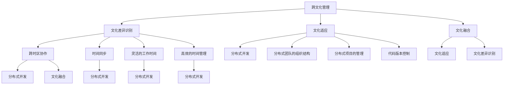
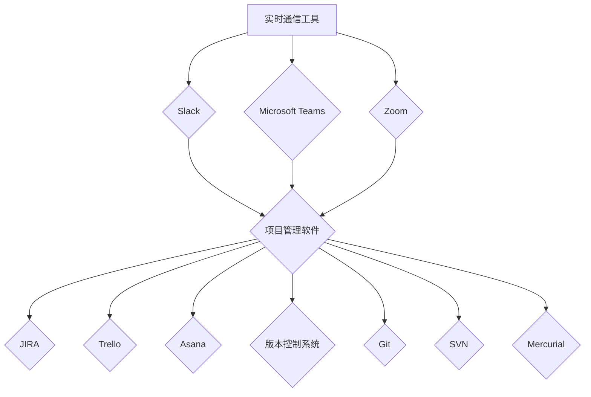

                 

### 引言

#### 1.1 跨地域团队协作的重要性

在当今全球化的时代，跨地域团队协作已经成为现代企业，尤其是技术驱动型企业不可或缺的一部分。跨地域团队协作不仅打破了地理和时区的限制，还汇聚了来自不同文化、背景和专业领域的智慧，从而提高了团队的多样性和创新能力。

**跨地域团队的定义与特点**

跨地域团队是指团队成员分布在不同的地理位置，通过现代信息技术进行协作的团队。这种团队的特点包括：

- **地理分散性**：团队成员分布在不同的城市、国家甚至时区。
- **文化多样性**：团队成员来自不同的文化背景，这可能导致沟通障碍和误解。
- **专业互补性**：团队可以聚集不同领域的人才，从而提高项目的整体质量。

**跨地域团队在大型应用开发中的优势与挑战**

跨地域团队在大型应用开发中具有以下优势：

- **资源整合**：可以充分利用全球各地的专业人才，提高项目质量。
- **成本效益**：通过分散化开发，可以减少物理办公室和设备成本。
- **时间灵活**：不同时区的成员可以在不同时间段工作，提高开发效率。

然而，跨地域团队协作也面临以下挑战：

- **沟通障碍**：由于地理和文化差异，团队成员之间的沟通可能不顺畅。
- **协调困难**：分散的团队成员在任务分配和进度控制上可能存在困难。
- **信任问题**：团队成员之间的信任建立可能需要更长的时间和更多的努力。

#### 1.2 跨地域团队协作的背景

随着互联网技术的飞速发展和全球化的推进，跨地域团队协作的需求日益增长。以下是跨地域团队协作背景的几个关键点：

- **远程工作的普及**：远程工作的普及使得跨地域团队成为可能，许多公司已经开始采用分布式团队模式。
- **全球人才竞争**：企业需要在全球范围内寻找最优秀的工程师和技术专家，跨地域团队协作成为实现这一目标的有效途径。
- **技术创新的驱动**：新的协作工具和技术的不断涌现，如实时通信、云计算和人工智能，为跨地域团队协作提供了强有力的支持。

总的来说，跨地域团队协作不仅是一个应对大型应用开发挑战的必要策略，更是企业提升竞争力、实现持续创新的重要途径。在接下来的章节中，我们将深入探讨跨地域团队协作的核心概念、策略和方法，以帮助读者更好地理解和实践这一重要课题。

#### 第1章 核心概念与联系

跨地域团队协作涉及多个核心概念，这些概念相互联系，共同构成了跨地域团队协作的基础。在本章中，我们将详细探讨这些核心概念，包括跨文化管理、跨时区协作和分布式开发，并使用Mermaid流程图来展示它们之间的联系。

##### 1.1 跨地域团队协作的核心概念

**跨文化管理**

跨文化管理是指在一个组织中，处理和管理来自不同文化背景的员工之间的关系和活动。在跨地域团队协作中，文化差异可能成为沟通和协作的障碍，因此跨文化管理变得尤为重要。核心内容包括：

- **文化差异识别**：了解团队成员的文化背景，包括语言、价值观、行为规范等。
- **文化适应**：通过培训和教育，帮助团队成员适应不同的文化环境。
- **文化融合**：鼓励团队成员相互尊重和包容，促进文化融合。

**跨时区协作**

跨时区协作涉及不同时区团队成员之间的协作。由于时区的差异，团队成员可能在不同的时间段工作，这给团队协作带来了挑战。核心内容包括：

- **时间同步**：通过调整工作计划，实现团队成员的时间同步。
- **灵活的工作时间**：根据团队成员的时区，制定灵活的工作时间安排。
- **高效的时间管理**：通过高效的时间管理工具和技巧，提高团队的工作效率。

**分布式开发**

分布式开发是指团队成员在不同地理位置进行软件开发和协作。这种模式要求团队成员具备高度的自主性和协作能力。核心内容包括：

- **分布式团队的组织结构**：明确团队成员的角色和责任，建立有效的团队沟通机制。
- **分布式项目的管理**：通过项目管理工具和策略，确保项目的进度和质量。
- **代码版本控制**：使用版本控制系统，如Git，实现代码的集中管理和协作开发。

##### 1.2 核心概念之间的联系

跨文化管理、跨时区协作和分布式开发这三个核心概念相互联系，共同构成了跨地域团队协作的框架。以下是一个简化的Mermaid流程图，展示了这三个概念之间的联系：



**Mermaid流程图示例**

以下是一个详细的Mermaid流程图示例，展示了跨文化管理、跨时区协作和分布式开发之间的详细联系：

```mermaid
gantt
    dateFormat  YYYY-MM-DD
    title 跨地域团队协作核心概念联系图

    section 跨文化管理
    A1 : Cultural Management
        a1 : Identify Cultural Differences
            a1start: 2023-04-01
            a1end: 2023-04-05
        a2 : Adapt to Culture
            a2start: 2023-04-06
            a2end: 2023-04-10
        a3 : Integrate Cultures
            a3start: 2023-04-11
            a3end: 2023-04-15

    section 跨时区协作
    B1 : Time Zone Collaboration
        b1 : Time Synchronization
            b1start: 2023-04-01
            b1end: 2023-04-05
        b2 : Flexible Working Hours
            b2start: 2023-04-06
            b2end: 2023-04-10
        b3 : Efficient Time Management
            b3start: 2023-04-11
            b3end: 2023-04-15

    section 分布式开发
    C1 : Distributed Development
        c1 : Organizational Structure
            c1start: 2023-04-01
            c1end: 2023-04-05
        c2 : Project Management
            c2start: 2023-04-06
            c2end: 2023-04-10
        c3 : Version Control
            c3start: 2023-04-11
            c3end: 2023-04-15

    section 联系与融合
    D1 : Connections and Integration
        d1 : Integrate Cultures with Time Zone Collaboration
            d1start: 2023-04-01
            d1end: 2023-04-05
        d2 : Integrate Time Zone Collaboration with Distributed Development
            d2start: 2023-04-06
            d2end: 2023-04-10
        d3 : Integrate Cultural Management with Distributed Development
            d3start: 2023-04-11
            d3end: 2023-04-15
```

通过这个Mermaid流程图，我们可以清晰地看到跨文化管理、跨时区协作和分布式开发之间的相互作用和依赖关系。这些核心概念共同作用，为跨地域团队协作提供了坚实的基础。

#### 第2章 基础概念与原理

在深入探讨跨地域团队协作的策略和方法之前，理解其基础概念和原理是至关重要的。本章节将详细阐述跨地域团队协作的定义、原则以及关键要素，帮助读者建立扎实的理论基础。

##### 2.1 跨地域团队协作的定义

跨地域团队协作，指的是团队成员分布在不同的地理位置，通过信息技术和沟通工具进行合作和交流的过程。这种协作形式不仅限于软件开发，还包括市场营销、项目管理等多个领域。跨地域团队的主要特点包括：

- **地理分散性**：团队成员分布在不同的城市、国家或时区。
- **技术依赖性**：依赖于各种在线工具和技术，如视频会议、即时通讯和项目管理软件，以确保协作的顺畅。
- **文化多样性**：团队成员来自不同的文化背景，这要求团队在协作过程中注重文化适应和沟通。

跨地域团队协作的定义可以归纳为：在全球化背景下，利用信息技术，将分布在不同地理位置的团队成员紧密联系在一起，共同实现项目目标的过程。

##### 2.2 跨地域团队协作的原则

跨地域团队协作的成功离不开以下几个核心原则：

1. **透明化与信任**：透明化的工作环境有助于提高团队成员之间的信任感。通过实时共享项目进展、问题和决策，可以减少信息不对称和误解。

2. **灵活性**：灵活性是应对跨地域团队协作中各种不确定性的关键。团队成员需要适应不同的工作时间和文化差异，灵活调整工作计划和策略。

3. **领导力**：有效的领导力在跨地域团队中至关重要。领导者需要具备较强的沟通能力、决策能力和团队合作精神，以引领团队克服各种挑战。

4. **持续改进**：跨地域团队协作是一个持续优化的过程。团队成员需要不断反思和改进协作方式，以提升效率和效果。

##### 2.3 跨地域团队协作的关键要素

跨地域团队协作的顺利实施依赖于以下几个关键要素：

1. **技术支持**：技术是跨地域团队协作的基础。选择合适的协作工具，如视频会议软件、项目管理软件和版本控制系统，可以提高团队的工作效率和协作效果。

2. **沟通机制**：有效的沟通机制是跨地域团队协作的关键。团队成员需要通过多种沟通渠道，如邮件、即时通讯和视频会议，确保信息传递的及时性和准确性。

3. **项目管理**：良好的项目管理能力是跨地域团队协作的重要保障。项目经理需要制定清晰的项目计划，监控项目进度，并处理各种风险和问题。

4. **团队文化**：团队文化是跨地域团队协作的内在动力。建立积极的团队氛围，鼓励团队成员相互支持和合作，有助于提升团队的凝聚力和战斗力。

通过以上对跨地域团队协作基础概念和原理的阐述，我们为后续章节的策略和方法讨论奠定了坚实的基础。在接下来的章节中，我们将深入探讨跨地域团队协作的具体策略和方法，以帮助读者在实际工作中更好地应对挑战，实现高效协作。

#### 第3章 技术与工具

在跨地域团队协作中，技术工具的选择和有效使用是确保团队高效协作的重要保障。本章节将详细讲解支持跨地域协作的关键技术工具，包括实时通信工具、项目管理软件和版本控制系统，并探讨如何选择和使用这些工具。

##### 3.1 支持跨地域协作的技术

**实时通信工具**

实时通信工具是跨地域团队协作中不可或缺的一部分，它们能够即时传递信息，提高团队的沟通效率。常见的实时通信工具有：

- **Slack**：Slack是一款流行的团队沟通工具，支持文字聊天、语音通话和视频会议等功能，可以方便地集成其他应用和服务。
- **Microsoft Teams**：Microsoft Teams是微软推出的综合性通信和协作平台，提供实时聊天、会议和视频通话等功能，并与微软的其他办公软件深度集成。
- **Zoom**：Zoom是一款专业的视频会议软件，支持大规模的在线会议和协作，适合跨地域团队进行实时沟通和交流。

**项目管理软件**

项目管理软件可以帮助跨地域团队更好地规划和管理项目，确保项目按时完成。常见的项目管理工具有：

- **JIRA**：JIRA是一款功能强大的项目管理工具，支持任务跟踪、敏捷开发和管理，适用于软件开发和其他复杂项目。
- **Trello**：Trello是一款直观易用的项目管理工具，通过卡片和看板的形式展示项目进度，适合小型团队和简单项目。
- **Asana**：Asana是一款功能丰富的项目管理工具，支持任务分配、进度跟踪和协作，适用于各种规模和类型的团队。

**版本控制系统**

版本控制系统是跨地域团队协作中管理代码和文档的重要工具，确保代码的集中管理和协作开发。常见的版本控制系统有：

- **Git**：Git是开源的分布式版本控制系统，支持快速、高效地管理代码，适用于分布式团队协作。
- **Subversion（SVN）**：Subversion是集中式版本控制系统，适合团队协作中对代码的版本管理和追踪。
- **Mercurial**：Mercurial是另一种分布式版本控制系统，与Git类似，支持高效的代码管理和协作。

##### 3.2 工具的选择与使用

**工具的评估标准**

在选择跨地域协作工具时，以下标准可以作为评估工具的依据：

- **功能完整性**：工具是否具备所需的功能，如实时通信、项目管理、版本控制等。
- **用户友好性**：工具是否易于使用，是否提供直观的用户界面和操作流程。
- **兼容性**：工具是否支持跨平台使用，是否与其他常用工具和服务集成。
- **安全性和可靠性**：工具是否提供数据加密和安全保护，是否能够稳定运行。

**工具的选型策略**

根据评估标准，企业或团队可以根据以下策略选择合适的协作工具：

- **需求导向**：根据团队的具体需求和项目特点，选择最适合的工具。
- **灵活性**：选择具备灵活扩展性的工具，以适应未来可能的变化。
- **成本效益**：在满足功能需求的前提下，考虑工具的成本和使用成本。

**工具的集成与优化**

工具的集成与优化是确保跨地域团队协作顺畅的关键。以下策略可以帮助实现工具的集成与优化：

- **集成接口**：通过API接口或其他集成方式，实现不同工具之间的数据共享和流程自动化。
- **培训与支持**：为团队成员提供培训和支持，确保他们能够熟练使用工具。
- **持续优化**：根据团队的实际使用情况，不断优化工具的使用策略和流程。

##### 3.3 技术工具的Mermaid流程图

以下是一个简化的Mermaid流程图，展示了跨地域团队协作中技术工具的应用和集成：



**Mermaid流程图示例**

以下是一个详细的Mermaid流程图示例，展示了跨地域团队协作中常见的技术工具及其集成：

```mermaid
gantt
    dateFormat  YYYY-MM-DD
    title 跨地域团队协作技术工具集成图

    section 实时通信工具
    A1 : Slack
        a1start: 2023-01-01
        a1end: 2023-01-31
    A2 : Microsoft Teams
        a2start: 2023-01-01
        a2end: 2023-01-31
    A3 : Zoom
        a3start: 2023-01-01
        a3end: 2023-01-31

    section 项目管理软件
    B1 : JIRA
        b1start: 2023-01-01
        b1end: 2023-01-31
    B2 : Trello
        b2start: 2023-01-01
        b2end: 2023-01-31
    B3 : Asana
        b3start: 2023-01-01
        b3end: 2023-01-31

    section 版本控制系统
    C1 : Git
        c1start: 2023-01-01
        c1end: 2023-01-31
    C2 : SVN
        c2start: 2023-01-01
        c2end: 2023-01-31
    C3 : Mercurial
        c3start: 2023-01-01
        c3end: 2023-01-31

    section 工具集成
    D1 : Slack & JIRA
        d1start: 2023-01-01
        d1end: 2023-01-31
    D2 : Microsoft Teams & Trello
        d2start: 2023-01-01
        d2end: 2023-01-31
    D3 : Zoom & Asana
        d3start: 2023-01-01
        d3end: 2023-01-31
```

通过这个Mermaid流程图，我们可以清晰地看到跨地域团队协作中常见的技术工具及其集成方式。这些工具的合理使用和集成，能够为团队提供高效、稳定的协作环境。

#### 第4章 协作模式

在跨地域团队协作中，选择合适的协作模式是确保项目顺利进行的关键。协作模式的不同决定了团队的沟通方式、工作流程和管理方法。本章节将分析三种常见的协作模式：集中式协作模式、分布式协作模式和混合式协作模式，并讨论每种模式的适用场景。

##### 4.1 集中式协作模式

**集中式协作模式**指的是团队成员在一个物理位置集中办公，通过面对面沟通和实时协作来完成项目。这种模式的特点包括：

- **高效沟通**：团队成员可以直接面对面交流，减少沟通中的误解和信息失真。
- **快速决策**：团队成员能够快速响应和决策，提高项目的执行速度。
- **集中管理**：项目经理和领导可以直接监控和指导团队成员的工作，确保项目进度和质量。

**适用场景**：

1. **项目初期**：在项目初期，团队需要频繁的面对面沟通和协作，集中式模式有助于快速建立团队文化和合作氛围。
2. **紧急任务**：在项目遇到紧急任务或突发事件时，集中式协作模式可以迅速调动资源，高效解决问题。
3. **团队文化建设**：对于新成立的团队，集中式协作模式有助于加强团队成员之间的信任和合作，促进团队文化的形成。

**挑战**：

1. **地理限制**：集中式协作模式受地理限制，无法充分利用全球范围内的优秀人才。
2. **成本较高**：需要租用办公室、提供设备等，增加了企业的运营成本。

##### 4.2 分布式协作模式

**分布式协作模式**指的是团队成员分布在不同的地理位置，通过远程通信工具和技术协作完成项目。这种模式的特点包括：

- **地理分散性**：团队成员可以分布在不同的城市、国家甚至时区，充分利用全球资源。
- **灵活性**：团队成员可以灵活安排工作时间，提高工作效率和生活质量。
- **技术依赖性**：依赖于各种在线协作工具和技术，如视频会议、即时通讯和项目管理软件。

**适用场景**：

1. **跨国家项目**：当项目涉及多个国家或地区时，分布式协作模式可以有效利用不同时区的优势，提高项目进度。
2. **远程办公趋势**：随着远程办公的普及，分布式协作模式已成为许多企业的标准工作模式。
3. **技术密集型项目**：对于技术驱动型的项目，分布式协作模式可以汇聚全球范围内的技术专家，提高项目质量。

**挑战**：

1. **沟通障碍**：由于地理和文化差异，团队成员之间的沟通可能存在障碍，需要有效的沟通策略和工具。
2. **协调困难**：分散的团队成员在任务分配和进度控制上可能存在困难，需要更加完善的管理策略和工具。

##### 4.3 混合式协作模式

**混合式协作模式**结合了集中式和分布式协作的优点，团队成员根据项目需求和实际情况，选择合适的协作方式。这种模式的特点包括：

- **灵活应对**：可以根据项目的不同阶段和需求，灵活切换协作模式。
- **高效沟通**：在关键阶段或紧急情况下，可以快速集中团队成员进行面对面的沟通和协作。
- **资源整合**：充分利用集中式和分布式协作的优势，实现资源的最优配置。

**适用场景**：

1. **项目迭代**：在项目迭代阶段，团队成员可以集中在特定时间进行面对面的沟通和协作，确保项目的高效推进。
2. **跨地域项目**：对于涉及多个地理位置的项目，混合式协作模式可以结合不同地区的优势，提高项目的整体效率。
3. **多样化需求**：当项目需求变化频繁时，混合式协作模式可以根据实际情况灵活调整，确保项目的顺利进行。

**挑战**：

1. **管理复杂性**：混合式协作模式需要更高的管理水平，项目经理需要具备应对不同协作模式的能力。
2. **文化冲突**：在混合式协作中，不同文化背景的团队成员可能存在文化冲突，需要加强跨文化管理。

总之，跨地域团队协作的模式选择应根据项目的具体需求和团队的实际情况进行。集中式、分布式和混合式协作模式各有优缺点，企业应根据项目特点和管理能力，灵活选择和调整协作模式，以实现项目的顺利推进和成功完成。

#### 第5章 沟通策略

在跨地域团队协作中，沟通策略的选择和实施对于团队的效率和项目成功至关重要。有效的沟通不仅能够减少误解和冲突，还能提高团队成员的工作动力和团队的凝聚力。以下我们将探讨跨地域团队有效沟通的策略和方法。

##### 5.1 有效沟通的重要性

沟通是跨地域团队协作的核心。有效的沟通能够确保团队成员之间的信息畅通，减少误解和误判，提高团队的工作效率和项目质量。以下是有效沟通在跨地域团队协作中的重要性：

- **信息传递**：通过有效沟通，团队成员可以及时了解项目进展、问题和决策，避免信息滞后和偏差。
- **协作效率**：良好的沟通能够减少工作中的重复劳动和冗余，提高团队的整体工作效率。
- **团队凝聚力**：有效的沟通有助于建立团队成员之间的信任和合作关系，增强团队的凝聚力。
- **决策支持**：在项目决策过程中，充分的沟通能够汇集多方意见，提高决策的准确性和有效性。

##### 5.2 沟通工具的选择与使用

在跨地域团队协作中，选择合适的沟通工具是确保沟通顺畅的关键。以下是一些常用的沟通工具及其优缺点：

1. **文字沟通工具**
   - **优点**：方便快捷，便于记录和追溯。
   - **缺点**：缺乏实时性，可能产生误解。

2. **音频沟通工具**
   - **优点**：实时性强，适用于需要快速讨论的情况。
   - **缺点**：不适合记录和追溯。

3. **视频沟通工具**
   - **优点**：结合文字、音频和视频，直观、生动，适用于复杂问题的讨论。
   - **缺点**：对网络带宽要求较高，不适用于网络条件较差的地区。

**选择策略**：

- **根据沟通需求选择工具**：针对不同类型的沟通需求，选择最合适的工具。例如，对于简单的日常信息交流，可以选择文字沟通工具；对于需要快速决策的讨论，可以选择音频沟通工具；对于复杂的讨论和演示，可以选择视频沟通工具。

- **结合团队实际情况**：考虑团队成员的地理位置、网络条件和设备配置，选择适合团队使用的工具。

- **确保工具的兼容性**：选择支持跨平台和跨设备使用的工具，确保所有团队成员都能方便地使用。

**最佳实践**：

- **统一沟通工具**：尽量统一使用一种或几种主要的沟通工具，避免团队成员使用不同的工具，造成沟通障碍。

- **定期培训**：为团队成员提供沟通工具的使用培训，确保他们能够熟练使用这些工具。

- **制定沟通规范**：制定明确的沟通规范和流程，确保团队成员在沟通中有章可循，提高沟通效率。

##### 5.3 沟通技巧与最佳实践

为了确保跨地域团队协作中的沟通效果，以下是一些沟通技巧和最佳实践：

1. **提前准备**：在沟通前，准备好需要讨论的主题、问题和资料，确保沟通的针对性和有效性。

2. **明确目标**：每次沟通前，明确沟通的目标和预期结果，避免讨论偏离主题。

3. **积极倾听**：在沟通中，注重倾听对方的意见和反馈，避免打断对方，确保理解对方的意图。

4. **表达清晰**：使用简洁明了的语言表达自己的观点，避免使用模糊不清的表述。

5. **及时反馈**：在沟通后，及时给予反馈，确认对方是否理解了自己的观点，避免误解和冲突。

6. **跨文化沟通**：在跨文化团队中，注意文化差异，尊重对方的价值观和行为规范，避免文化冲突。

7. **使用多种沟通方式**：结合文字、音频和视频等多种沟通方式，提高沟通的效率和质量。

通过以上沟通策略和技巧，跨地域团队可以更好地实现信息传递、协作和决策，提高项目的成功率。

#### 第6章 管理方法

在跨地域团队协作中，有效的管理策略和方法对于确保项目的顺利进行和目标的达成至关重要。本章节将详细探讨跨地域团队管理的挑战、管理策略与方法，以及管理工具与平台。

##### 6.1 跨地域团队管理的挑战

跨地域团队管理面临诸多挑战，主要体现在以下几个方面：

1. **时区差异**：团队成员分布在不同的时区，导致工作时间不统一，影响沟通和协作效率。

2. **文化差异**：团队成员来自不同的文化背景，可能存在价值观、行为规范和工作习惯上的差异，影响团队的凝聚力和工作效率。

3. **协调困难**：在任务分配、进度控制和问题解决上，跨地域团队的协调难度较大，容易导致项目进度延误和质量问题。

4. **信任问题**：由于地理和文化的差异，团队成员之间可能存在信任危机，影响团队的协作和沟通。

##### 6.2 管理策略与方法

为了应对上述挑战，以下是一些有效的管理策略和方法：

1. **任务分配策略**

   - **基于能力分配任务**：根据团队成员的专业能力和特长，合理分配任务，确保任务与成员能力相匹配。
   - **明确任务责任**：为每个任务指定负责人，明确任务目标和完成标准，确保任务按时高质量完成。
   - **灵活调整任务**：根据项目进展和团队成员的实际情况，及时调整任务分配，确保项目资源的合理利用。

2. **进度控制方法**

   - **制定详细项目计划**：制定详细的项目进度计划，明确各个阶段的时间节点和任务要求。
   - **定期项目会议**：定期召开项目会议，汇报项目进展，讨论和解决项目中出现的问题。
   - **利用项目管理工具**：使用项目管理工具（如Trello、JIRA等）跟踪项目进度，确保项目按时完成。

3. **风险管理措施**

   - **识别风险因素**：定期识别和评估项目中的风险因素，制定相应的风险应对策略。
   - **建立应急预案**：针对可能出现的风险，制定详细的应急预案，确保在风险发生时能够及时应对。
   - **持续监控风险**：项目实施过程中，持续监控风险状况，及时调整风险应对措施。

##### 6.3 管理工具与平台

为了提高跨地域团队的管理效率，以下是一些常用的管理工具与平台：

1. **团队管理软件**

   - **Slack**：提供即时通讯、文件共享和项目管理等功能，适用于日常沟通和协作。
   - **Microsoft Teams**：集成了视频会议、即时通讯、文档共享和项目管理等，适用于综合性的团队协作。

2. **项目管理平台**

   - **JIRA**：支持任务跟踪、敏捷开发和管理，适用于软件开发和其他复杂项目。
   - **Trello**：通过卡片和看板展示项目进度，适用于小型团队和简单项目。
   - **Asana**：提供任务分配、进度跟踪和协作功能，适用于各种规模和类型的团队。

3. **版本控制系统**

   - **Git**：支持分布式版本控制，适用于大规模团队协作。
   - **Subversion（SVN）**：适用于中小型团队的集中式版本控制。
   - **Mercurial**：另一种分布式版本控制系统，适用于多样化的团队协作需求。

通过以上管理策略和工具，跨地域团队可以更好地应对各种挑战，确保项目顺利进行和成功完成。

#### 第7章 实战案例

在探讨跨地域团队协作的策略和方法之后，了解实际案例中的成功经验和挑战对于读者来说至关重要。本章节将通过两个典型的跨地域团队协作案例，展示如何在不同的情境下实施协作策略，并提供详细的分析和解决方案。

##### 7.1 跨地域团队协作的典型案例

**案例一：跨国软件公司的成功经验**

某跨国软件公司开发了一款面向全球市场的企业管理软件。由于团队成员分布在不同的国家，包括美国、印度、中国和欧洲等地，项目面临巨大的协作挑战。以下是该公司的成功经验：

1. **团队组织结构**

   该公司采用了分布式团队组织结构，每个国家设立一个本地团队，负责软件开发的特定模块。同时，设立了一个跨国项目团队，负责整体协调和决策。

2. **协作模式**

   该公司采用了混合式协作模式。在项目初期和关键决策阶段，跨国项目团队通过视频会议和面对面会议进行集中式协作。在项目执行阶段，团队成员根据各自的时区和工作习惯，进行分布式协作。

3. **沟通策略**

   公司采用了多种沟通工具，包括Slack、Microsoft Teams和Zoom，确保团队成员能够方便地进行实时沟通。同时，定期召开项目会议，讨论项目进展和问题。

4. **管理方法**

   项目经理通过JIRA跟踪项目进度，确保各个模块按时完成。同时，建立了应急预案，应对可能出现的风险和问题。

**案例二：分布式开发团队的实践分享**

另一家初创公司，由于团队成员分布在不同的城市，采用了分布式开发模式。以下是该团队的实践经验：

1. **团队协作模式**

   该团队采用了分布式协作模式，团队成员根据各自的技能和专长，独立完成各自的任务。每周通过视频会议进行项目进度汇报和问题讨论。

2. **沟通工具**

   该团队主要使用Slack进行日常沟通，通过即时消息和频道讨论项目进展和问题。同时，使用Trello进行任务分配和进度跟踪。

3. **版本控制系统**

   使用Git作为版本控制系统，确保代码的集中管理和协作开发。团队成员定期进行代码提交和拉取请求，确保代码库的同步更新。

4. **管理策略**

   项目经理通过Trello制定项目计划和任务分配，确保每个成员明确自己的任务和责任。同时，建立风险管理制度，提前识别和应对潜在的风险。

##### 7.2 案例分析

**成功经验**

- **灵活的协作模式**：无论是跨国软件公司还是分布式开发团队，都采用了灵活的协作模式，结合集中式和分布式协作的优势，提高了项目效率。
- **有效的沟通策略**：使用多种沟通工具和定期会议，确保信息传递的及时性和准确性，减少了误解和冲突。
- **严格的项目管理**：通过项目管理工具和风险管理措施，确保项目进度和质量。

**面临的挑战**

- **时区差异**：跨国团队面临最大的挑战之一是时区差异，需要合理安排会议和工作时间，避免影响团队成员的休息和工作效率。
- **文化差异**：文化差异可能导致沟通障碍和误解，需要加强跨文化管理，促进团队成员之间的理解和合作。
- **信任问题**：在分布式团队中，由于团队成员之间较少面对面交流，可能存在信任危机，需要通过有效的沟通和管理策略建立信任。

**解决方案**

- **时区协调**：制定统一的工作时间表，合理安排会议和工作时间，确保团队成员的参与和效率。
- **跨文化培训**：为团队成员提供跨文化培训，提高文化适应能力，减少误解和冲突。
- **建立信任机制**：通过透明化的工作流程和良好的沟通，建立团队成员之间的信任关系。

通过以上案例分析，我们可以看到，跨地域团队协作在实际应用中既有成功经验，也面临诸多挑战。通过灵活的协作模式、有效的沟通策略和严格的项目管理，跨地域团队可以克服这些挑战，实现高效协作和项目的成功。

#### 第8章 总结与展望

在本文中，我们深入探讨了跨地域团队协作的核心概念、策略与方法，通过实际的案例分析了成功经验与挑战，并提出了解决方案。以下是本文的核心内容总结和未来展望。

##### 8.1 总结

**核心概念**：本文明确了跨地域团队协作的定义、原则和关键要素，包括跨文化管理、跨时区协作和分布式开发。通过这些核心概念的解析，我们了解了跨地域团队协作的基本框架和操作要点。

**策略与方法**：我们探讨了集中式、分布式和混合式三种协作模式，并分析了各自的优势与挑战。同时，针对沟通策略和管理方法进行了详细的讨论，提供了实用的工具和最佳实践。

**案例解析**：通过两个实际案例，我们展示了如何在不同情境下实施协作策略，并提供了详细的解决方案，以帮助读者在实际工作中应对跨地域团队协作的挑战。

##### 8.2 展望

**发展趋势**：

- **远程工作的普及**：随着远程工作的趋势不断加强，跨地域团队协作将成为企业常态，更多的公司会采用分布式团队模式。
- **技术的进一步发展**：新的协作工具和技术的不断涌现，如人工智能、区块链和增强现实，将为跨地域团队协作提供更强大的支持。
- **跨文化管理的深化**：随着全球化进程的加速，跨文化管理将越来越重要，企业需要更加注重文化差异的识别和管理。

**未来挑战**：

- **沟通障碍**：随着团队成员分布更加广泛，沟通障碍可能会加剧，如何通过技术手段提高沟通效率是一个重要挑战。
- **信任问题**：建立和维护团队成员之间的信任关系需要更多的努力和时间，特别是在分布式团队中。
- **管理复杂性**：随着团队规模的扩大和项目复杂性的增加，管理跨地域团队将面临更高的复杂性。

##### 8.3 总结

跨地域团队协作不仅是应对大型应用开发挑战的必要策略，更是企业提升竞争力、实现持续创新的重要途径。通过本文的探讨，我们希望读者能够对跨地域团队协作有更深入的理解，并在实际工作中运用这些策略和方法，实现高效协作和项目的成功。

作者：AI天才研究院/AI Genius Institute & 禅与计算机程序设计艺术 /Zen And The Art of Computer Programming

### 附录

#### 8.1 资源与工具

以下是一些在跨地域团队协作中常用的资源与工具：

- **实时通信工具**：Slack、Microsoft Teams、Zoom
- **项目管理软件**：JIRA、Trello、Asana
- **版本控制系统**：Git、Subversion（SVN）、Mercurial
- **协作平台**：Confluence、Trello、Notion

#### 8.2 拓展阅读

- **《全球分布式团队协作实践》**：详细介绍分布式团队的协作模式和策略。
- **《跨文化管理：理论与实践》**：探讨跨文化管理的重要性和实践方法。
- **《远程工作的艺术》**：提供关于远程工作环境和协作技巧的深入分析。

通过这些资源与工具，读者可以进一步探索和学习跨地域团队协作的最佳实践。

