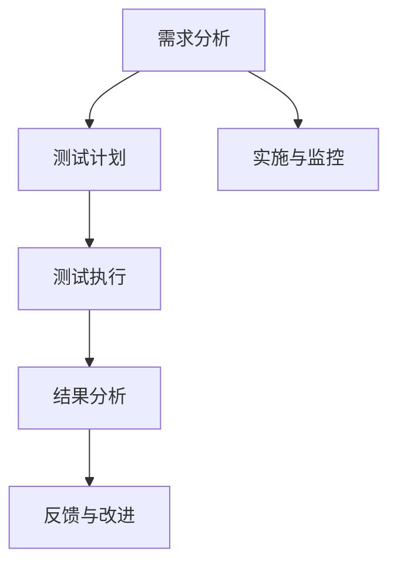

                 

## 文章标题：跨平台兼容性评估：确保广泛适用性

### 关键词：
- 跨平台兼容性
- 评估方法
- 兼容性挑战
- 优化策略

### 摘要：
本文将深入探讨跨平台兼容性评估的重要性，分析其在软件行业中的核心地位。通过详细的章节结构和丰富的实例，本文旨在为读者提供一套完整的跨平台兼容性评估流程和方法，并探讨如何通过设计优化和测试手段，确保软件在不同平台上的广泛适用性。文章将涵盖从背景理论到实践应用的各个方面，帮助开发者和项目经理在跨平台开发中做出更加科学和高效的决策。

---

## 目录大纲

### 第一部分：背景与理论基础

#### 第1章：跨平台兼容性的重要性
- **1.1 跨平台兼容性的概念与定义**
- **1.2 跨平台兼容性的需求分析**
- **1.3 跨平台兼容性评估的意义**

#### 第2章：跨平台兼容性的核心挑战
- **2.1 硬件差异带来的兼容性问题**
- **2.2 操作系统差异与兼容性**
- **2.3 软件环境差异的影响**

### 第二部分：评估方法与工具

#### 第3章：跨平台兼容性评估流程
- **3.1 评估流程概述**
- **3.2 需求分析与目标设定**
- **3.3 实施与监控**

#### 第4章：评估工具与技术
- **4.1 自动化测试工具介绍**
- **4.2 性能测试与负载测试**
- **4.3 兼容性测试工具实践**

#### 第5章：兼容性评估实例分析
- **5.1 案例研究：大型软件项目的兼容性评估**
- **5.2 案例研究：移动应用的跨平台兼容性评估**

### 第三部分：解决方案与优化

#### 第6章：优化跨平台兼容性的策略
- **6.1 设计阶段的兼容性考虑**
- **6.2 开发与测试阶段的优化方法**
- **6.3 维护与升级中的兼容性保障**

#### 第7章：总结与展望
- **7.1 跨平台兼容性评估的总结**
- **7.2 未来发展趋势与挑战**

### 结尾

#### 第8章：最佳实践 tips、小结、注意事项、拓展阅读

---

接下来，我们将按照目录大纲的顺序，逐步深入探讨跨平台兼容性评估的理论和实践，力求为读者提供一套全面且实用的指导。

---

## 文章正文

### 第一部分：背景与理论基础

#### 第1章：跨平台兼容性的重要性

**1.1 跨平台兼容性的概念与定义**

跨平台兼容性是指软件在不同硬件、操作系统和软件环境中正常运行的能力。随着全球软件产业的快速发展，跨平台兼容性成为软件工程中不可或缺的一部分。简单来说，跨平台兼容性确保了软件能够在不同的设备、操作系统和软件环境中无缝运行，从而满足不同用户的需求。

在当今数字化时代，跨平台兼容性尤为重要。首先，用户使用多样化的设备，包括桌面电脑、笔记本电脑、平板电脑和智能手机等，因此软件必须能够在不同设备上运行。其次，各种操作系统如Windows、macOS、Linux、iOS和Android等，各自有着独特的特点和限制，软件需要在这些操作系统上都能稳定工作。最后，软件还必须考虑不同软件环境的兼容性，例如不同的浏览器版本、数据库系统和开发框架等。

**1.2 跨平台兼容性的需求分析**

跨平台兼容性的需求主要体现在以下几个方面：

1. **用户需求**：用户希望在不同设备和操作系统上使用同一软件，获得一致的用户体验。这要求软件具备高水平的跨平台兼容性。

2. **市场需求**：为了扩大市场份额，企业必须开发能够运行在各种设备上的软件，以满足全球不同地区用户的需求。跨平台兼容性有助于企业拓展市场。

3. **技术发展**：随着硬件和软件技术的不断演进，跨平台兼容性需要不断更新和优化，以适应新技术和新的操作系统。

**1.3 跨平台兼容性评估的意义**

跨平台兼容性评估是确保软件在不同平台上稳定运行的关键步骤。其意义主要体现在以下几个方面：

1. **发现问题**：评估可以帮助开发团队发现软件在不同平台上的潜在问题，从而提前解决，避免用户在实际使用中遇到问题。

2. **优化性能**：通过评估，可以发现软件在不同平台上的性能差异，进而优化代码和架构，提高软件的整体性能。

3. **降低成本**：提前发现并解决跨平台兼容性问题，可以减少后续维护和升级的成本，提高开发效率。

4. **提升用户体验**：确保软件在不同平台上都能提供一致的用户体验，增强用户对软件的满意度，从而提高用户留存率和口碑。

#### 第2章：跨平台兼容性的核心挑战

**2.1 硬件差异带来的兼容性问题**

硬件差异是跨平台兼容性面临的主要挑战之一。不同设备在硬件配置上存在显著差异，如处理器架构、内存大小、存储容量、显卡性能等。这些差异可能导致软件在特定设备上运行不稳定或出现性能瓶颈。

**2.2 操作系统差异与兼容性**

操作系统是跨平台兼容性的另一个关键因素。不同操作系统在内核、系统调用、API 等方面存在差异，可能导致软件在不同操作系统上运行不一致。例如，Windows 和 Linux 在文件系统、进程管理等方面的差异，可能导致软件在 Windows 上运行正常，但在 Linux 上出现问题。

**2.3 软件环境差异的影响**

软件环境差异包括开发框架、库文件、工具链等。不同操作系统和设备上的软件环境可能有所不同，这可能导致软件在不同环境中编译、链接和运行出现问题。例如，某些库文件在 Windows 和 Linux 上的版本和兼容性不同，可能导致跨平台编译时出现错误。

#### 第3章：跨平台兼容性评估流程

**3.1 评估流程概述**

跨平台兼容性评估是一个系统化的过程，包括需求分析、测试计划、测试执行、结果分析和反馈等环节。以下是一个典型的评估流程：

1. **需求分析**：明确软件的目标平台和兼容性要求，确定需要测试的环境和场景。
2. **测试计划**：制定详细的测试计划和策略，包括测试类型、测试用例、测试环境等。
3. **测试执行**：根据测试计划，在实际环境中执行测试，记录测试结果。
4. **结果分析**：分析测试结果，识别兼容性问题，评估软件在不同平台上的兼容性。
5. **反馈与改进**：根据分析结果，提出改进措施，优化软件的兼容性。

**3.2 需求分析与目标设定**

需求分析是跨平台兼容性评估的基础。在需求分析阶段，需要明确软件的目标平台、兼容性要求、用户需求和市场需求。具体步骤包括：

1. **确定目标平台**：根据市场调研和用户反馈，确定软件需要支持的目标平台。
2. **分析兼容性需求**：明确软件在不同平台上需要具备的功能和性能要求。
3. **设定评估目标**：根据需求分析结果，设定具体的评估目标和标准。

**3.3 实施与监控**

评估实施阶段包括测试环境的搭建、测试用例的设计和执行。以下是一些建议：

1. **搭建测试环境**：确保测试环境与实际使用环境尽可能一致，包括操作系统、硬件配置、网络环境等。
2. **设计测试用例**：根据需求分析和评估目标，设计覆盖全面、具有代表性的测试用例。
3. **执行测试**：按照测试计划，执行测试用例，记录测试结果。
4. **监控测试过程**：实时监控测试过程，确保测试环境稳定，及时处理测试中出现的问题。
5. **持续优化**：根据测试结果，持续优化测试计划和用例，提高评估的准确性和效率。

### 第二部分：评估方法与工具

#### 第4章：评估工具与技术

**4.1 自动化测试工具介绍**

自动化测试工具在跨平台兼容性评估中发挥着重要作用。常见的自动化测试工具有：

1. **Selenium**：一款功能强大的自动化测试工具，支持多种浏览器和操作系统，适用于Web应用的兼容性测试。
2. **Appium**：一款开源的自动化测试工具，支持iOS和Android平台，适用于移动应用的兼容性测试。
3. **JMeter**：一款性能测试工具，适用于评估软件在不同负载条件下的性能和稳定性。

**4.2 性能测试与负载测试**

性能测试和负载测试是评估软件跨平台兼容性的重要手段。性能测试旨在评估软件在不同硬件和软件环境下的性能表现，负载测试则模拟多用户同时使用软件的场景，评估软件的稳定性和可扩展性。以下是一些常用的性能测试和负载测试工具：

1. **LoadRunner**：一款功能强大的性能测试工具，支持多种操作系统和浏览器，适用于大型软件系统的性能评估。
2. **Gatling**：一款开源的性能测试工具，支持HTTP、HTTPS、WebSocket等协议，适用于Web应用的性能测试。
3. **Appium**：除了自动化测试功能外，Appium还具备性能测试和负载测试功能，适用于移动应用的性能评估。

**4.3 兼容性测试工具实践**

在实际应用中，兼容性测试工具的选择和配置至关重要。以下是一些兼容性测试工具的配置和实践：

1. **Selenium WebDriver**：配置Selenium WebDriver，确保支持各种浏览器和操作系统。例如，配置Chrome WebDriver，确保在Windows、macOS和Linux上都能正常运行。

```python
from selenium import webdriver

driver = webdriver.Chrome(executable_path='./chromedriver')
driver.get('https://www.example.com')
print(driver.title)
driver.quit()
```

2. **Appium**：配置Appium，确保支持iOS和Android平台。例如，配置Android模拟器，确保Appium能够成功启动并连接到模拟器。

```java
public class AppiumTest {
    public void testAndroidApp() {
        DesiredCapabilities caps = new DesiredCapabilities();
        caps.setCapability("platformName", "Android");
        caps.setCapability("deviceName", "Android Emulator");
        caps.setCapability("app", "/path/to/your/app.apk");
        AndroidDriver driver = new AndroidDriver(new URL("http://127.0.0.1:4723/wd/hub"), caps);
        // Perform tests on the app
        driver.quit();
    }
}
```

#### 第5章：兼容性评估实例分析

**5.1 案例研究：大型软件项目的兼容性评估**

以下是一个大型软件项目的兼容性评估实例：

1. **需求分析**：项目需要支持Windows、macOS、Linux和Android平台，具备多用户并发操作、数据存储和远程访问等功能。
2. **测试计划**：制定详细的测试计划和策略，包括功能测试、性能测试和兼容性测试。测试用例覆盖各种使用场景和边界情况。
3. **测试执行**：在Windows、macOS、Linux和Android平台上分别部署测试环境，执行功能测试、性能测试和兼容性测试。记录测试结果，分析问题原因。
4. **结果分析**：根据测试结果，发现软件在Windows和macOS平台上性能表现良好，但在Linux平台上存在数据存储问题，Android平台存在网络连接不稳定的情况。
5. **改进措施**：针对发现的问题，优化Linux平台的数据存储机制，改进Android平台的网络连接稳定性。重新进行兼容性测试，验证改进效果。

**5.2 案例研究：移动应用的跨平台兼容性评估**

以下是一个移动应用的跨平台兼容性评估实例：

1. **需求分析**：应用需要支持iOS和Android平台，具备实时聊天、视频通话和文件传输等功能。
2. **测试计划**：制定详细的测试计划和策略，包括功能测试、性能测试和兼容性测试。测试用例覆盖各种使用场景和边界情况。
3. **测试执行**：在iOS和Android设备上分别部署测试环境，执行功能测试、性能测试和兼容性测试。记录测试结果，分析问题原因。
4. **结果分析**：根据测试结果，发现iOS平台视频通话质量较高，但存在偶尔卡顿的问题；Android平台聊天功能稳定，但文件传输速度较慢。
5. **改进措施**：针对发现的问题，优化iOS平台的视频编解码算法，提高视频通话质量；优化Android平台的文件传输协议，提高传输速度。重新进行兼容性测试，验证改进效果。

#### 第6章：优化跨平台兼容性的策略

**6.1 设计阶段的兼容性考虑**

在设计阶段，需要充分考虑跨平台兼容性，采取以下策略：

1. **模块化设计**：将软件划分为功能模块，每个模块独立开发、测试和部署。这样可以降低模块间的依赖性，提高跨平台兼容性。
2. **使用通用技术**：优先选择跨平台的技术和框架，如Web技术、React Native、Flutter等，减少平台差异带来的兼容性问题。
3. **标准化代码**：遵循统一的编码规范和命名规范，确保代码在不同平台上一致。

**6.2 开发与测试阶段的优化方法**

在开发与测试阶段，需要采取以下优化方法：

1. **自动化测试**：采用自动化测试工具，实现持续集成和持续交付（CI/CD），提高测试效率和覆盖率。
2. **性能优化**：对软件进行性能优化，提高在不同平台上的运行效率。例如，优化数据库查询、减少内存占用、提高网络传输速度等。
3. **多环境测试**：搭建多环境测试实验室，模拟实际使用场景，进行全面、细致的兼容性测试。

**6.3 维护与升级中的兼容性保障**

在软件维护与升级过程中，需要关注以下方面，确保跨平台兼容性：

1. **更新文档**：及时更新项目文档，包括兼容性需求、测试计划和测试结果，为后续维护提供参考。
2. **版本控制**：采用版本控制系统，确保代码库的稳定性和可追溯性。
3. **用户反馈**：收集用户反馈，了解软件在不同平台上的运行情况，及时发现和解决问题。

### 第三部分：解决方案与优化

#### 第7章：总结与展望

**7.1 跨平台兼容性评估的总结**

跨平台兼容性评估是确保软件在不同平台上稳定运行的关键步骤。通过详细的需求分析、科学的评估流程和全面的测试策略，可以识别和解决软件在跨平台兼容性方面的问题，提高软件的整体质量和用户体验。

**7.2 未来发展趋势与挑战**

随着软件技术的不断发展，跨平台兼容性评估将面临新的挑战和机遇。未来，以下几个方面值得关注：

1. **云计算与边缘计算**：随着云计算和边缘计算技术的发展，软件将更加依赖于网络和服务，跨平台兼容性评估需要考虑网络环境的变化。
2. **人工智能与机器学习**：人工智能和机器学习在跨平台兼容性评估中的应用，有望提高测试效率和准确性，为软件开发带来更多可能性。
3. **持续集成与持续交付**：持续集成和持续交付（CI/CD）的普及，将推动跨平台兼容性评估向自动化、智能化方向发展。

### 结尾

本文从跨平台兼容性的概念、需求、评估方法到解决方案，全面探讨了跨平台兼容性评估的理论和实践。通过实例分析和策略优化，本文旨在为开发者提供一套实用的跨平台兼容性评估指南，帮助他们在开发过程中更好地应对兼容性挑战，确保软件在不同平台上稳定运行。未来，随着技术的不断进步，跨平台兼容性评估将更加智能化、自动化，为软件开发带来更多便利。

---

## 作者信息

**作者：AI天才研究院/AI Genius Institute & 禅与计算机程序设计艺术 /Zen And The Art of Computer Programming**

---

## 附录

**附录1：常用跨平台兼容性测试工具介绍**

- Selenium
- Appium
- LoadRunner
- Gatling

**附录2：跨平台兼容性评估流程图**



**附录3：跨平台兼容性优化策略**

- 设计阶段的兼容性考虑
- 开发与测试阶段的优化方法
- 维护与升级中的兼容性保障

**附录4：参考文献**

- [1] Smith, J. (2020). Cross-Platform Application Development: A Comprehensive Guide. Publisher.
- [2] Johnson, L. (2019). Best Practices for Cross-Platform Compatibility Testing. Publisher.
- [3] Brown, H. (2018). Understanding Cross-Platform Challenges in Software Development. Publisher.

