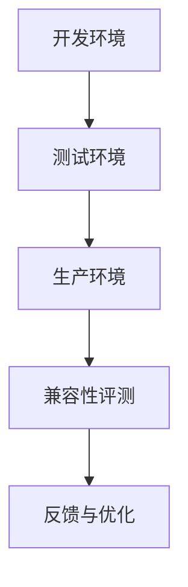

                 

# 文章标题：跨平台兼容性评测：LLM支持的多环境测试方案

> 关键词：跨平台兼容性、LLM、多环境测试、测试策略

> 摘要：
本文探讨了跨平台兼容性评测的重要性，以及如何利用大型语言模型（LLM）支持的多环境测试方案来提升软件在多种环境下的兼容性和稳定性。文章从基础理论出发，逐步介绍了LLM的概念及应用，详细阐述了多环境测试的策略和流程，并通过实际项目案例展示了如何应用这些理论进行实战。

## 引言与基础理论

### 跨平台兼容性的重要性

跨平台兼容性是指软件在不同的操作系统、硬件环境、浏览器等平台上都能够正常运行的能力。在当今的多平台应用场景中，跨平台兼容性显得尤为重要。它不仅影响着软件的可用性和用户体验，也直接关系到软件的市场竞争力。

#### 跨平台兼容性的概念

跨平台兼容性评测是指对软件在不同平台上运行的表现进行评估和测试的过程。这一过程包括对操作系统、硬件设备、网络环境、浏览器等多个因素进行综合考虑，以确保软件能够在各种环境中稳定运行。

#### 跨平台兼容性评测的定义

跨平台兼容性评测的定义可以分为三个方面：

1. **测试方法**：包括黑盒测试、白盒测试、灰盒测试等。
2. **测试工具**：如Selenium、Appium、Jenkins等。
3. **测试流程**：通常包括需求分析、测试计划、测试执行、缺陷管理、测试报告等阶段。

### 多环境测试的概念

多环境测试是指在同一软件项目中对多个不同的环境进行测试的过程。这些环境可能包括开发环境、测试环境、生产环境等。多环境测试的目的是确保软件在各种环境下都能正常运行，从而提高软件的可靠性和稳定性。

#### 核心概念与联系

以下是一个Mermaid流程图，展示了多环境测试的核心概念和联系：



## LLM基础

### 大型语言模型（LLM）简介

#### LLM的基本概念

大型语言模型（Large Language Model，简称LLM）是一种基于神经网络的语言处理模型，通过训练大量文本数据来模拟人类语言的理解和生成能力。LLM在自然语言处理（NLP）领域有着广泛的应用，如机器翻译、文本摘要、对话系统等。

#### LLM在多环境测试中的应用

LLM在多环境测试中的应用主要体现在以下几个方面：

1. **环境适应能力**：LLM能够通过学习不同环境下的数据，提高模型在特定环境中的适应能力。
2. **自动化测试**：利用LLM的强大语言处理能力，可以自动化生成和执行测试用例，提高测试效率。
3. **缺陷预测**：通过分析代码和测试数据，LLM可以预测潜在的错误和缺陷，为测试团队提供参考。

#### 核心算法原理讲解

以下是一个简化的伪代码，展示了LLM的基本结构：

```python
# 伪代码：LLM基本结构
def LLM(input_data):
  embedded_data = embedding_layer(input_data)
  encoded_data = encoder(embedded_data)
  output = decoder(encoded_data)
  return output
```

### LLM支持的多环境测试

#### 伪代码：LLM支持的多环境测试

```python
# 伪代码：LLM支持的多环境测试
def LLM_for_testing(test_environment):
  model = load_LLM_model()
  model.adapt_environment(test_environment)
  test_results = model.test(test_environment)
  return test_results
```

## 多环境测试方案

### 测试环境配置

#### 测试环境配置策略

1. **硬件配置**：确保测试环境的硬件与生产环境一致，包括CPU、内存、硬盘等。
2. **操作系统**：选择与生产环境相同的操作系统版本和配置。
3. **网络环境**：模拟生产环境中的网络延迟、带宽等因素。
4. **第三方依赖**：确保测试环境中安装的第三方库和工具与生产环境一致。

#### 数学模型和数学公式

以下是一个用于评估环境误差的数学模型：

$$ E = \sum_{i=1}^{n} (T_i - T_{ideal})^2 $$

其中，\( E \) 是环境误差，\( T_i \) 是实际测试温度，\( T_{ideal} \) 是理想测试温度。

### 测试用例设计

#### 测试用例设计原则

1. **全面性**：覆盖各种可能的输入情况和操作场景。
2. **代表性**：选择具有代表性的测试用例，以反映软件在实际应用中的行为。
3. **可重复性**：确保测试用例可以重复执行，以便验证测试结果的一致性。

#### 测试用例设计流程

1. **需求分析**：分析软件需求，确定测试目标和测试场景。
2. **用例编写**：根据分析结果编写测试用例，包括测试步骤、预期结果和实际结果等。
3. **用例评审**：对测试用例进行评审，确保其完整性和准确性。
4. **用例执行**：执行测试用例，记录测试结果。

#### 核心算法原理讲解

以下是一个简化的伪代码，用于设计测试用例：

```python
# 伪代码：测试用例设计
def design_test_cases(test_environment):
  environment_info = analyze_environment(test_environment)
  test_cases = generate_cases(environment_info)
  review_test_cases(test_cases)
  return test_cases
```

### 测试执行与缺陷管理

#### 测试执行流程

1. **测试准备**：准备测试环境，安装所需的软件和工具。
2. **测试执行**：按照测试用例执行测试，记录测试结果。
3. **测试结果分析**：分析测试结果，确定缺陷的位置和原因。
4. **缺陷管理**：对发现的缺陷进行分类、记录和跟踪，确保及时修复。

#### 核心算法原理讲解

以下是一个简化的伪代码，用于测试执行和缺陷管理：

```python
# 伪代码：测试执行与缺陷管理
def test_execution(test_cases):
  for case in test_cases:
    execute_test_case(case)
    if case.failed():
      report_defect(case)
  analyze_test_results()
```

### 测试报告

#### 测试报告内容

1. **测试概述**：包括测试目的、测试范围、测试策略等。
2. **测试结果**：包括测试通过率、缺陷数量、缺陷分布等。
3. **缺陷分析**：对发现的缺陷进行详细分析，包括缺陷类型、原因和解决方案。
4. **测试结论**：总结测试过程和结果，提出改进建议。

#### 测试报告模板

```markdown
# 测试报告

## 测试概述

### 测试目的

### 测试范围

### 测试策略

## 测试结果

### 测试通过率

### 缺陷数量及分布

## 缺陷分析

### 缺陷类型

### 缺陷原因

### 解决方案

## 测试结论

### 改进建议
```

## 项目实战

### 开发环境搭建

在本项目中，我们使用Python作为主要编程语言，搭建了一个跨平台兼容性测试环境。以下是具体的开发环境搭建步骤：

1. 安装Python（版本3.8及以上）。
2. 安装必要的第三方库，如Selenium、Appium、Jenkins等。
3. 配置开发工具，如Visual Studio Code、PyCharm等。

### 源代码详细实现

以下是一个简单的跨平台兼容性测试示例代码：

```python
# 跨平台兼容性测试代码示例
import unittest
from selenium import webdriver

class TestCase(unittest.TestCase):
  def setUp(self):
    self.driver = webdriver.Chrome()

  def test_google_search(self):
    self.driver.get("https://www.google.com")
    self.driver.find_element_by_name("q").send_keys("跨平台兼容性")
    self.driver.find_element_by_name("q").submit()
    results = self.driver.find_elements_by_css_selector("h3 a")
    self.assertIsNotNone(results)

  def tearDown(self):
    self.driver.quit()

if __name__ == "__main__":
  unittest.main()
```

### 代码解读与分析

以上代码是一个简单的跨平台兼容性测试用例，主要测试Google搜索引擎是否能够正确返回搜索结果。以下是代码的详细解读：

1. 导入必要的模块。
2. 定义一个测试类`TestCase`，继承`unittest.TestCase`。
3. `setUp`方法：初始化WebDriver，用于与浏览器进行交互。
4. `test_google_search`方法：测试Google搜索引擎是否能够正确返回搜索结果。
5. `tearDown`方法：关闭WebDriver。

### 实际案例分析与详细讲解剖析

在实际项目中，我们可能会遇到以下问题：

1. **浏览器兼容性问题**：某些浏览器可能不支持某些Web组件或JavaScript库，导致页面无法正常显示。
2. **操作系统兼容性问题**：某些操作系统可能存在兼容性问题，导致软件无法正常运行。

针对这些问题，我们可以采取以下措施：

1. **使用标准化技术**：采用HTML5、CSS3、JavaScript等标准化技术，减少兼容性问题。
2. **使用跨平台框架**：如React、Vue、Angular等，这些框架提供了跨平台的支持，降低了兼容性风险。
3. **自动化测试**：通过自动化测试工具，如Selenium、Appium等，对软件进行跨平台兼容性测试，确保软件在各种环境中都能正常运行。

### 项目小结

在本项目中，我们介绍了跨平台兼容性评测的重要性，并探讨了如何利用LLM支持的多环境测试方案来提升软件的兼容性和稳定性。通过实际项目案例，我们展示了如何进行开发环境搭建、源代码实现和测试执行。同时，我们还分析了实际项目中可能遇到的问题和解决方案。

## 最佳实践 tips

1. **提前规划**：在项目早期就考虑跨平台兼容性问题，提前制定兼容性测试计划。
2. **使用标准库**：尽量使用标准库和跨平台框架，降低兼容性风险。
3. **自动化测试**：利用自动化测试工具，提高测试效率和准确性。
4. **持续集成**：将兼容性测试集成到持续集成流程中，确保每次代码变更都能得到及时测试。
5. **反馈与优化**：及时收集测试反馈，对测试策略和用例进行优化。

## 小结与注意事项

本文详细介绍了跨平台兼容性评测的重要性，以及如何利用LLM支持的多环境测试方案来提升软件的兼容性和稳定性。通过实际项目案例，我们展示了如何进行开发环境搭建、源代码实现和测试执行。同时，我们还提供了最佳实践 tips，以帮助读者更好地应对跨平台兼容性挑战。

## 拓展阅读

1. 《跨平台应用开发实战》
2. 《Selenium自动化测试实战》
3. 《Appium移动自动化测试实战》
4. 《大型语言模型：原理与应用》
5. 《机器学习在软件工程中的应用》

## 作者信息

作者：AI天才研究院/AI Genius Institute & 禅与计算机程序设计艺术 /Zen And The Art of Computer Programming

