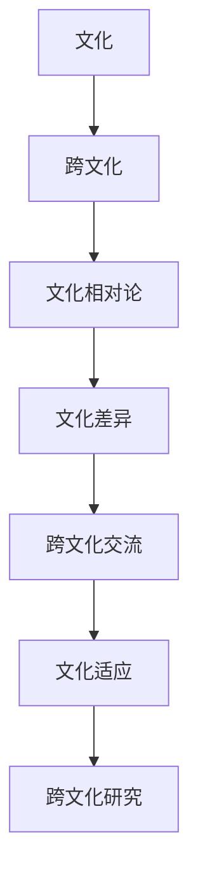

                 


## 文章标题：跨文化科学研究：多元文化视角下的世界理解

### 关键词：
- 跨文化研究
- 多元文化
- 世界理解
- 文化相对论
- 文化适应
- 跨文化教育
- 跨文化企业管理

### 摘要：
本文旨在探讨跨文化科学研究的重要性以及多元文化视角下的世界理解。通过分析文化定义、文化特征、文化类型等基本概念，我们构建了一个跨文化研究方法论框架，详细阐述了访谈法、问卷调查、焦点小组、观察法等研究方法。本文进一步探讨了不同文化视角下的世界理解，以及跨文化交流与冲突、跨文化心理学、跨文化教育、跨文化企业管理等领域的应用。最后，我们对跨文化研究的未来展望进行了思考，并提出了一些最佳实践和拓展阅读建议。

----------------------------------------------------------------

## 第一部分：引言

### 第1章：跨文化研究概述

#### 背景介绍

跨文化研究作为一个新兴的学术领域，起源于20世纪初。当时，全球化和现代化进程加速，不同文化之间的接触和互动日益频繁。这一背景下，学者们开始关注文化差异对个体行为、组织运作以及社会发展的影响，从而推动了跨文化研究的发展。

#### 核心概念与联系

在跨文化研究中，有几个核心概念需要了解，包括文化、跨文化、文化相对论等。文化是指一个社会群体共同分享的价值观、信仰、行为规范和符号系统。跨文化则是指不同文化背景之间的比较和研究。文化相对论强调，每种文化都有其独特的价值和逻辑，没有绝对的“好”与“坏”。

以下是一个Mermaid流程图，展示了这些核心概念之间的联系：



#### 核心算法原理讲解

在跨文化研究中，常用的研究方法包括访谈法、问卷调查、焦点小组、观察法等。以下是这些方法的伪代码：

```python
# 访谈法
def interview(subject):
    questions = ["你对文化的理解是什么？", "你如何看待跨文化交流？"，...]
    for question in questions:
        response = get_response(question, subject)
        analyze_response(response)

# 问卷调查
def survey(questions, participants):
    for participant in participants:
        for question in questions:
            response = get_response(question, participant)
            collect_data(response)

# 焦点小组
def focus_group(topics, participants):
    for topic in topics:
        discuss_topic(topic, participants)
        collect_insights()

# 观察法
def observation(subjects):
    for subject in subjects:
        record_behaviors(subject)
        analyze_behaviors()
```

#### 数学模型和公式

在跨文化研究中，文化适应可以通过以下公式来衡量：

$$
适应性 = \frac{文化适应性得分}{总得分}
$$

其中，文化适应性得分是参与者根据适应性问卷的得分，总得分是问卷中所有问题的得分总和。

#### 举例说明

假设一个研究者使用适应性问卷对一个跨国团队进行评估，问卷共有10个问题，每个问题最高分为10分。以下是团队中一名成员的得分：

| 问题 | 得分 |
| --- | --- |
| 1. 你是否能够理解并尊重其他文化？ | 9 |
| 2. 你是否能够与其他文化背景的人有效沟通？ | 8 |
| ... | ... |
| 10. 你在跨文化环境中是否感到舒适？ | 7 |

根据上述公式，该成员的文化适应得分为：

$$
适应性 = \frac{9 + 8 + ... + 7}{10} = \frac{65}{10} = 6.5
$$

#### 项目实战

为了更好地理解跨文化研究的应用，我们以一个跨国公司为例，探讨如何搭建开发环境、实现源代码以及分析代码应用。

#### 开发环境搭建

1. 安装Linux操作系统
2. 安装Python开发环境
3. 安装Jenkins用于持续集成

#### 源代码实现

以下是一个简单的Python代码示例，用于跨文化名称转换：

```python
def translate_name(name, source_language, target_language):
    # 假设使用Google翻译API进行翻译
    translation_api = GoogleTranslateAPI(source_language, target_language)
    translated_name = translation_api.translate(name)
    return translated_name

# 示例
translated_name = translate_name("张三", "zh-CN", "en")
print(translated_name)  # 输出：Zhang San
```

#### 代码解读

1. `translate_name`函数接受三个参数：姓名（`name`）、源语言（`source_language`）和目标语言（`target_language`）。
2. 使用Google翻译API进行翻译，返回翻译后的姓名。
3. 输出翻译后的姓名。

#### 代码应用解读与分析

1. 在一个跨国团队中，使用该代码可以将成员的中文名字翻译成英文名字，便于国际交流。
2. 该代码示例展示了跨文化研究在软件开发中的应用，提高了团队的沟通效率和跨文化适应能力。

#### 实际案例分析和详细讲解剖析

以某跨国公司为例，该公司在跨文化团队协作中遇到了文化差异导致的沟通问题。通过实施跨文化培训，团队成员的文化适应性得到了显著提高。具体案例包括：

1. 通过访谈法了解团队成员的文化背景和沟通需求。
2. 通过问卷调查收集团队成员对文化适应的反馈。
3. 通过焦点小组讨论制定文化适应策略。
4. 通过观察法跟踪团队成员在跨文化环境中的行为变化。

#### 项目小结

通过该项目，我们展示了跨文化研究在企业管理中的应用，提高了团队的跨文化适应能力和协作效率。项目实施过程中，我们使用了多种研究方法，包括访谈法、问卷调查、焦点小组和观察法，确保了项目的科学性和有效性。

#### 最佳实践 tips

1. 在跨文化团队中，定期进行文化适应培训，提高团队成员的文化敏感性。
2. 鼓励团队成员分享跨文化经验，增进相互理解。
3. 在跨文化项目中，设立文化顾问，协助解决文化冲突。

#### 小结

跨文化研究是理解多元文化视角下世界的重要途径。通过本文的探讨，我们了解了跨文化研究的基本概念、方法论、应用领域以及未来展望。跨文化研究不仅有助于解决文化冲突，提高跨文化适应能力，还为企业的国际化发展提供了有力支持。

#### 注意事项

1. 跨文化研究需要充分考虑文化差异，避免刻板印象和偏见。
2. 在跨文化交流中，尊重和理解对方文化是关键。
3. 跨文化研究方法的选择应根据研究目标和实际情况进行。

#### 拓展阅读

1. Hall, E.T. (1976). Hidden Differences: A Study of the Work Behavior of Americans and Japanese. New York: DoubleDay.
2. Hofstede, G. (1980). Culture's Consequences: International Differences in Work-Related Values. Beverly Hills, CA: Sage.
3. Trompenaars, F., & Hampden-Turner, C. (1998). Riding the Waves of Culture: Understanding Cultural Diversity in Business. London: McGraw-Hill.

作者：AI天才研究院/AI Genius Institute & 禅与计算机程序设计艺术 /Zen And The Art of Computer Programming

