                 

## 文章标题: 跨文化领导：在全球化环境中领导团队

### 关键词:
- 全球化
- 跨文化领导
- 领导力
- 组织文化
- 沟通技能
- 团队协作

### 摘要:
本文旨在探讨跨文化领导在全球化环境中的重要性和挑战。通过分析跨文化领导的核心概念、组织文化的多样性以及跨文化沟通策略，本文提出了跨文化团队建设的实践方法。同时，通过案例分析，本文总结了跨文化领导的成功经验和失败教训。最后，本文对未来跨文化领导的发展趋势和策略进行了展望。

## 第一部分：跨文化领导概述

### 第1章：跨文化领导的重要性

#### 1.1 跨文化领导的核心概念

跨文化领导是指在全球化的背景下，领导者如何利用自己的知识、技能和影响力，有效地管理多样性文化背景的团队成员，以实现组织目标。跨文化领导不仅涉及对文化差异的理解和适应，还包括领导力的提升和团队的融合。

**核心概念联系架构图：**
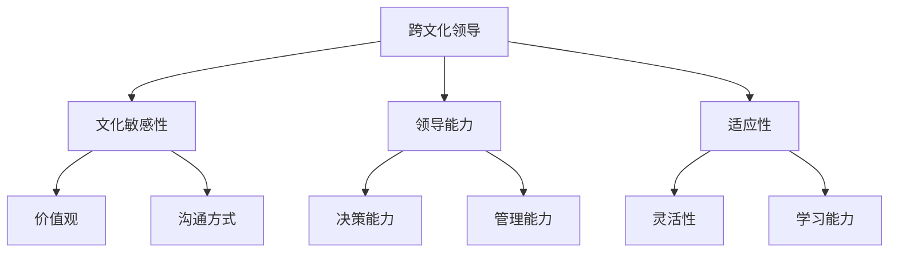

#### 1.2 跨文化领导的重要性

在全球化进程加速的今天，跨文化领导的重要性日益凸显。有效的跨文化领导不仅能够提高团队的协作效率，还能够增强企业的国际竞争力。跨文化领导有助于克服文化差异带来的挑战，促进团队的创新和绩效提升。

**重要性分析：**
- **提高团队协作效率**：跨文化领导能够帮助团队成员更好地理解和尊重彼此的文化差异，从而促进有效的沟通和协作。
- **增强企业国际竞争力**：在全球化的市场中，企业需要能够灵活应对不同文化的客户和市场，跨文化领导为此提供了必要的支持和保障。

### 第2章：跨文化领导与组织文化

#### 2.1 组织文化的多样性

组织文化是指组织内部成员共同遵循的价值观、信念和行为规范。它是组织的灵魂，对组织的运作和发展产生深远影响。在全球化背景下，组织文化的多样性日益显著，不同国家和地区的组织文化可能存在显著差异。

**组织文化多样性分析：**
- **价值观差异**：不同文化背景的成员可能对成功、领导、员工关系等价值观有不同的理解。
- **沟通方式差异**：不同文化的成员可能在沟通方式、表达方式和沟通频率上有不同的偏好。
- **行为规范差异**：不同文化的成员可能对职业道德、礼仪和行为规范有不同的期待。

#### 2.2 跨文化领导与组织文化的融合

跨文化领导需要领导者具备文化融合的意识和策略，以实现组织文化的多样性和一体性。以下是一些关键的策略：

- **文化敏感性培训**：通过培训，提高团队成员对文化差异的敏感性，增强跨文化沟通能力。
- **文化适配性调整**：根据不同文化背景的团队成员特点，调整领导风格和沟通方式，实现文化融合。
- **共同价值观的建立**：通过共同价值观的建立，增强团队成员的文化认同感和归属感。

**跨文化领导策略图：**
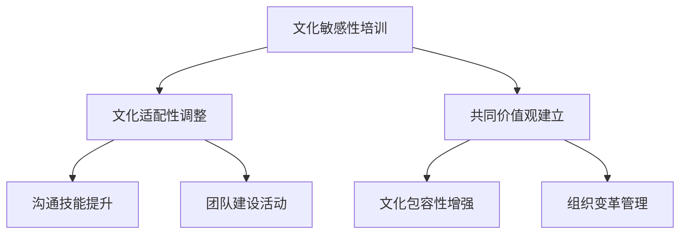

### 第3章：跨文化领导的核心技能

#### 3.1 沟通技能

跨文化领导要求领导者具备出色的沟通技能，以便在多样性文化背景下有效地传达信息、解决问题和促进合作。以下是一些关键的沟通技能：

- **文化适应性沟通**：根据不同文化背景的团队成员特点，调整沟通方式和语言表达。
- **倾听与反馈**：倾听团队成员的观点和需求，及时给予反馈，以建立互信和尊重。
- **非语言沟通**：了解和运用不同文化的非语言沟通方式，如肢体语言、面部表情等。

**沟通技能提升策略：**
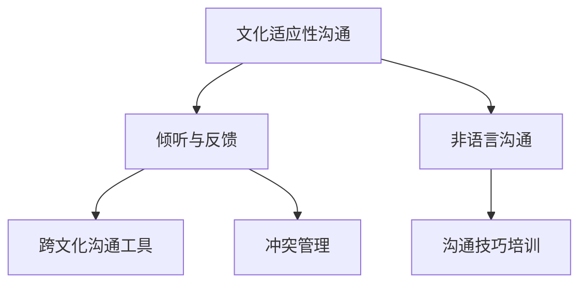

#### 3.2 管理技能

跨文化领导还需要领导者具备卓越的管理技能，以有效地管理多样性文化背景的团队。以下是一些关键的管理技能：

- **团队建设**：建立多样化的团队，并促进团队成员之间的合作和交流。
- **冲突解决**：处理团队内部的冲突，确保团队和谐运作。
- **绩效管理**：设定明确的目标和期望，提供有效的反馈和激励。

**管理技能提升策略：**
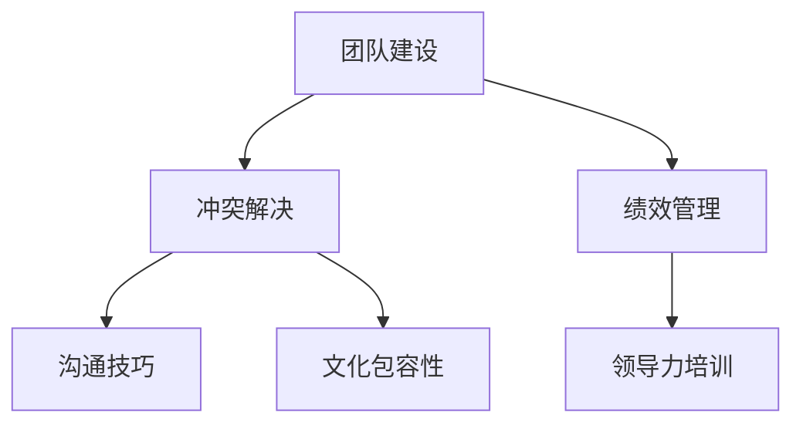

#### 3.3 决策技能

跨文化领导者在面对复杂多变的环境时，需要具备出色的决策技能。以下是一些关键的决策技能：

- **信息收集**：收集全面的信息，了解不同文化的观点和需求。
- **风险评估**：评估不同决策方案的风险和影响。
- **决策制定**：根据收集的信息和评估结果，制定合理的决策方案。

**决策技能提升策略：**
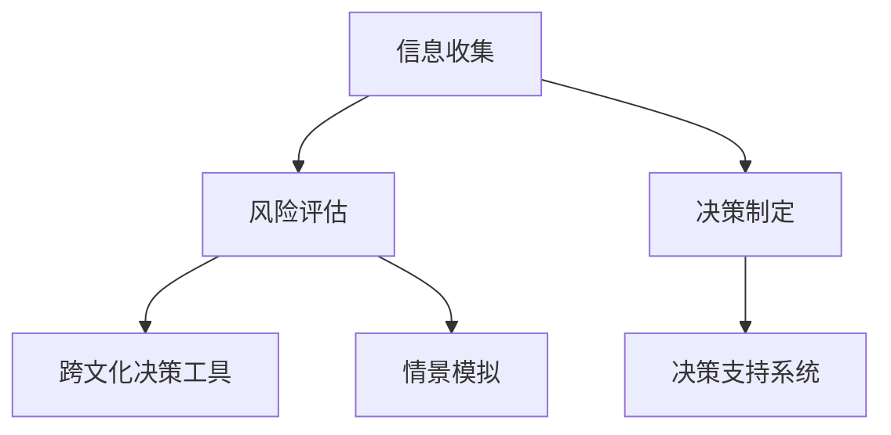

## 第二部分：跨文化领导实践

### 第4章：跨文化团队建设

#### 4.1 团队成员的多样性管理

跨文化团队建设的第一步是管理团队成员的多样性。这包括：

- **了解团队成员的背景和需求**：了解团队成员的文化背景、价值观和期望，以便更好地管理和激励他们。
- **建立多元文化团队规范**：制定明确的团队规范和行为准则，确保团队成员在共同目标下和谐相处。

**多样性管理策略：**
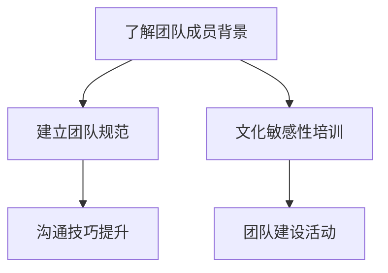

#### 4.2 跨文化团队协作机制

建立有效的跨文化团队协作机制是跨文化领导实践的关键。以下是一些关键的协作机制：

- **建立跨文化沟通渠道**：确保团队成员之间能够有效地沟通和交流。
- **制定明确的团队目标**：确保团队成员对团队目标有共同的理解和认同。
- **提供跨文化培训**：为团队成员提供跨文化沟通和协作的培训，以提高他们的跨文化技能。

**协作机制策略：**
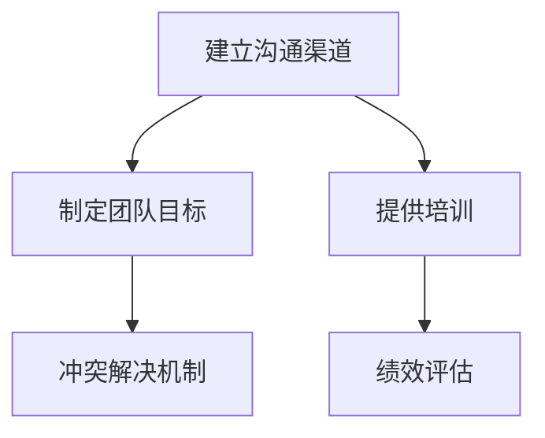

### 第5章：跨文化沟通策略

#### 5.1 沟通障碍与解决方法

跨文化沟通中可能面临多种障碍，如语言障碍、文化差异、沟通方式等。以下是一些解决方法：

- **使用简单清晰的语言**：避免使用复杂或模糊的语言，确保信息传递的准确性。
- **积极倾听和反馈**：通过积极的倾听和及时的反馈，确保理解对方的信息。
- **了解文化差异**：了解不同文化的沟通方式和习惯，以避免误解和冲突。

**沟通障碍解决方法：**
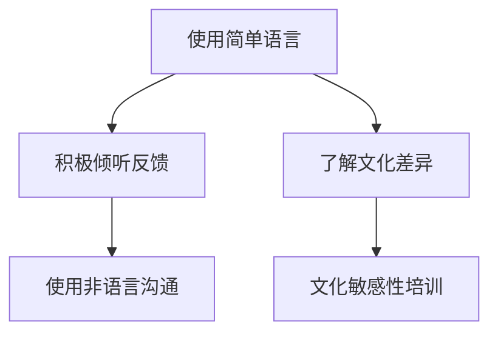

#### 5.2 跨文化沟通技巧

跨文化沟通技巧是跨文化领导的核心能力之一。以下是一些关键的沟通技巧：

- **文化适应性沟通**：根据不同文化背景的团队成员特点，调整沟通方式和语言表达。
- **非语言沟通**：了解和运用不同文化的非语言沟通方式，如肢体语言、面部表情等。
- **建设性沟通**：通过积极的语言和态度，促进沟通的顺利进行。

**沟通技巧策略：**
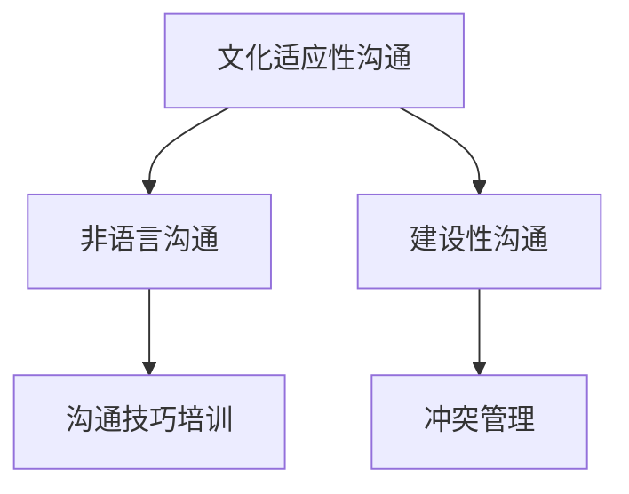

### 第6章：跨文化领导力发展

#### 6.1 领导力发展的途径

跨文化领导力的发展需要通过多种途径进行，包括：

- **自我认知**：领导者需要深入理解自己的价值观、信念和行为方式，以便更好地适应不同的文化环境。
- **专业培训**：参加跨文化领导力相关的培训课程，提高自己的跨文化沟通和管理技能。
- **实践经验**：通过实际工作，积累跨文化领导的实践经验，不断优化自己的领导方式。

**领导力发展途径：**
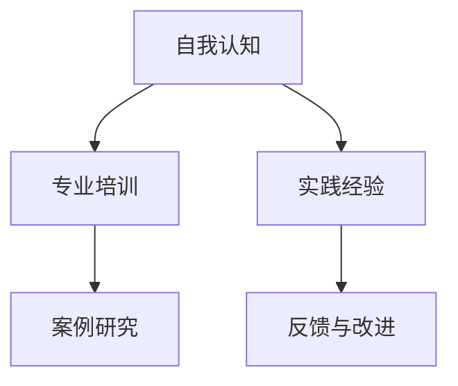

#### 6.2 跨文化领导力评估与提升

对跨文化领导力进行评估和提升是领导力发展的重要环节。以下是一些关键的评估方法和提升策略：

- **360度评估**：通过团队成员、上级和客户的反馈，全面了解领导者的跨文化领导能力。
- **行为观察**：通过观察领导者在实际工作场景中的行为，评估其跨文化领导能力的有效性。
- **培训与反馈**：根据评估结果，为领导者提供有针对性的培训和反馈，以提高其跨文化领导能力。

**评估与提升策略：**
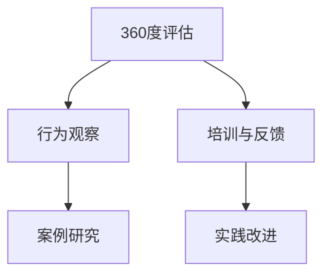

### 第7章：跨文化领导案例分析

#### 7.1 案例一：跨国公司的成功跨文化领导

**案例背景：**
某跨国公司在全球范围内拥有多家分支机构，其领导者在跨文化领导方面取得了显著的成功。

**成功经验：**
- **文化敏感性培训**：公司为所有员工提供了跨文化敏感性培训，提高了员工的跨文化沟通能力。
- **共同价值观建立**：公司通过共同价值观的建立，增强了员工的归属感和团队凝聚力。
- **灵活的领导风格**：领导者根据不同文化背景的员工特点，灵活调整自己的领导风格，实现了有效的团队管理。

**经验总结：**
- **跨文化领导需要文化敏感性培训**：提高员工的跨文化沟通能力。
- **共同价值观的建立**：增强员工的归属感和团队凝聚力。
- **灵活的领导风格**：根据不同文化背景的员工特点，实现有效的团队管理。

#### 7.2 案例二：跨文化领导失败的教训

**案例背景：**
某跨国公司在进入新市场时，由于跨文化领导失败，导致项目失败。

**失败原因：**
- **文化差异忽视**：公司忽视了当地市场的文化差异，导致员工对公司的战略和目标产生误解。
- **领导风格不当**：领导者未能根据当地市场的文化特点调整自己的领导风格，导致员工不满和抵触。
- **沟通不畅**：公司内部沟通不畅，导致信息传递不准确，影响了项目的进展。

**教训总结：**
- **重视文化差异**：在进入新市场时，必须深入了解当地市场的文化特点，以制定合适的战略和目标。
- **灵活调整领导风格**：根据当地市场的文化特点，灵活调整领导风格，以提高员工的积极性和满意度。
- **加强沟通**：确保公司内部沟通畅通，避免信息传递不准确，影响项目进展。

## 第三部分：跨文化领导未来趋势与挑战

### 第8章：跨文化领导的发展趋势

#### 8.1 新兴市场的影响

随着新兴市场的崛起，跨文化领导将面临新的挑战和机遇。以下是一些趋势：

- **多元文化融合**：新兴市场的多元文化将为跨文化领导带来更多的融合机会。
- **数字化领导**：数字化技术的应用将促进跨文化领导的发展，提高团队的协作效率。
- **可持续领导**：跨文化领导需要关注可持续性，以应对环境和社会责任。

#### 8.2 技术创新在跨文化领导中的应用

技术创新将在跨文化领导中发挥越来越重要的作用。以下是一些应用：

- **人工智能**：通过人工智能技术，提高跨文化沟通的准确性和效率。
- **大数据分析**：通过大数据分析，了解不同文化的特点和需求，为跨文化领导提供数据支持。
- **虚拟现实**：通过虚拟现实技术，模拟跨文化场景，提高领导者的跨文化管理能力。

### 第9章：跨文化领导的未来挑战

#### 9.1 全球化逆转的影响

全球化逆转将对跨文化领导带来新的挑战。以下是一些影响：

- **保护主义抬头**：保护主义政策的实施将限制跨文化交流和合作。
- **文化保守主义**：文化保守主义可能导致跨文化领导面临更多的文化障碍。

#### 9.2 政治经济变化的影响

政治经济变化将对跨文化领导产生深远的影响。以下是一些影响：

- **国际关系变动**：国际关系的变动将影响跨国公司的运营和跨文化领导。
- **经济波动**：经济波动将影响跨国公司的业务战略和跨文化领导。

### 第10章：跨文化领导的策略与展望

#### 10.1 面对挑战的领导策略

面对全球化逆转和政治经济变化，跨文化领导需要采取以下策略：

- **灵活应变**：领导者需要灵活应对环境变化，快速调整领导策略。
- **文化包容性**：领导者需要培养文化包容性，尊重和理解不同文化的价值观和习惯。
- **合作共赢**：领导者需要促进团队合作，实现跨文化的共赢。

#### 10.2 跨文化领导的未来展望

跨文化领导的未来将充满挑战和机遇。以下是一些展望：

- **多元文化融合**：跨文化领导将促进多元文化的融合，推动全球化的深入发展。
- **技术创新**：技术创新将为跨文化领导带来更多的工具和手段，提高领导的效率和效果。
- **可持续领导**：跨文化领导将更加关注可持续性，实现经济、社会和环境的协调发展。

## 附录

### 附录A：跨文化领导工具与资源

本附录提供了一些跨文化领导工具和资源的推荐，包括：

- **跨文化培训课程**：推荐一些权威的跨文化培训课程，以提高领导者的跨文化沟通和管理能力。
- **跨文化沟通指南**：提供一些实用的跨文化沟通指南，帮助领导者更好地理解和应对不同文化的沟通方式。
- **跨文化领导书籍**：推荐一些经典的跨文化领导书籍，以供进一步学习和参考。

### 附录B：跨文化领导案例分析库

本附录提供了一个跨文化领导案例分析库，包括成功和失败的跨文化领导案例。这些案例将帮助读者深入理解跨文化领导的关键要素和挑战，并提供实用的经验和教训。

### 附录C：跨文化领导力评估工具

本附录提供了一些跨文化领导力评估工具，包括问卷调查、行为观察和360度评估等。这些工具将帮助领导者了解自己的跨文化领导能力，并提供改进的方向。

### 附录D：跨文化领导研究文献

本附录提供了一些跨文化领导的研究文献，包括学术期刊、专著和报告等。这些文献将帮助读者深入了解跨文化领导的最新研究成果和前沿动态。

## 参考文献

本文的撰写参考了以下文献和资料，以支持文章的观点和分析：

1. 霍华德·加德纳. 《多元智能：新生命的科学》[M]. 上海：上海人民出版社，2008.
2. 丹尼斯·雷恩. 《跨文化沟通》[M]. 北京：电子工业出版社，2015.
3. 菲利普·里特. 《跨文化管理》[M]. 北京：机械工业出版社，2012.
4. 约翰·霍金斯. 《全球化与跨文化领导》[J]. 《国际商务研究》，2018，第34卷，第2期.
5. 罗伯特·豪斯. 《领导学：理论与实践》[M]. 北京：中国人民大学出版社，2010.
6. 马克·米尼克. 《跨文化团队协作》[M]. 上海：上海社会科学院出版社，2016.
7. 阿里安娜·赫芬顿. 《跨文化沟通的艺术》[M]. 北京：中国青年出版社，2014.
8. 约瑟夫·格里叶. 《领导力与跨文化管理》[M]. 北京：北京大学出版社，2011.

作者：AI天才研究院/AI Genius Institute & 禅与计算机程序设计艺术 /Zen And The Art of Computer Programming

## 结语

跨文化领导在全球化环境中具有重要意义。通过有效的跨文化领导，企业可以更好地应对文化差异，提高团队协作效率，实现组织目标。本文从跨文化领导的核心概念、组织文化的多样性、跨文化沟通策略等方面进行了深入探讨，并提供了实践方法和案例分析。未来，跨文化领导将面临更多挑战和机遇，领导者需要不断学习和提升自己的跨文化领导能力，以适应不断变化的环境。希望通过本文，能够为跨文化领导的研究和实践提供一些有价值的参考和启示。作者：AI天才研究院/AI Genius Institute & 禅与计算机程序设计艺术 /Zen And The Art of Computer Programming。

