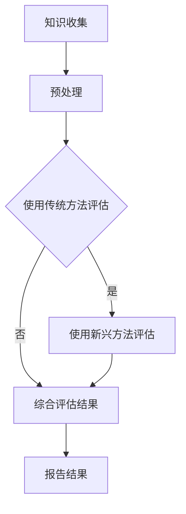
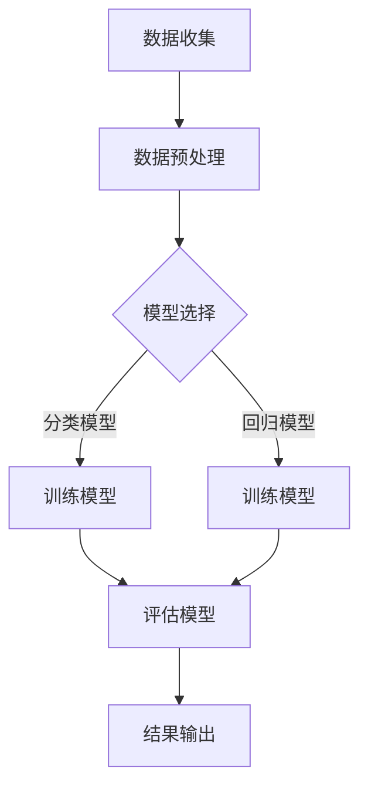

                 

# 跨时间知识一致性评估：测试长期可靠性

## 关键词
跨时间知识一致性，知识评估，长期可靠性，时间序列分析，机器学习，图论

## 摘要
本文深入探讨了跨时间知识一致性的评估方法以及长期可靠性的测试策略。通过分析传统和新兴的知识评估方法，本文提出了基于机器学习和图论的新型评估技术，并详细描述了长期可靠性的定义和测试方法。最后，通过实践案例展示了这些方法在实际应用中的效果。

## 1. 概述

### 1.1 书籍背景
随着信息技术的迅猛发展，知识管理成为了企业核心竞争力的重要组成部分。然而，知识的动态性和复杂性使得跨时间知识一致性的评估成为一个挑战。本文旨在提供一套系统化的跨时间知识一致性评估方法，以测试知识的长期可靠性。

### 1.2 书籍目的
本文的目标是帮助读者理解跨时间知识一致性的重要性，掌握评估和测试长期可靠性的方法，并提供实际案例，以便于读者将理论知识应用于实践。

### 1.3 阅读对象
本文适用于从事知识管理、数据科学、人工智能等领域的研究人员和从业者，以及对此领域感兴趣的学生。

## 2. 核心概念与联系

### 2.1 知识一致性
知识一致性是指知识在多个时间和情境下保持一致的特性。它是知识管理的基础，直接影响知识系统的可靠性和有效性。

#### 2.1.1 定义
知识一致性可以定义为：在同一知识库中，相同的知识对象在不同时间、不同情境下具有相同的语义和解释。

$$
\text{一致性} = \text{相同知识对象} \rightarrow \text{相同语义和解释}
$$

#### 2.1.2 重要性
知识一致性对企业的长期发展至关重要。它确保了知识系统的准确性和可靠性，有助于企业更好地利用知识资产。

### 2.2 跨时间知识一致性
跨时间知识一致性是指在时间维度上，知识系统能够保持一致性。它要求知识在多个时间点保持相同的结构和内容，同时适应新的信息和情境。

#### 2.2.1 定义
跨时间知识一致性是指知识系统能够在多个时间点保持相同的结构和内容，同时适应新的信息和情境。

#### 2.2.2 特点
- **持久性**：知识能够在长时间内保持一致。
- **适应性**：知识系统能够适应新的信息和情境。

### 2.3 知识评估方法
知识评估方法旨在评估知识的一致性和长期可靠性。传统和新兴的评估方法各有优劣，需要结合具体场景选择合适的评估方法。

#### 2.3.1 传统评估方法
传统评估方法主要包括描述性评估和指标性评估。

##### 2.3.1.1 描述性评估
描述性评估通过描述知识的内容、结构和关系来评估知识的一致性。

##### 2.3.1.2 指标性评估
指标性评估使用具体的量化指标来评估知识的一致性。

#### 2.3.2 新兴评估方法
新兴评估方法利用机器学习和图论等先进技术来提高知识评估的准确性和效率。

##### 2.3.2.1 基于机器学习的评估方法
基于机器学习的评估方法通过训练模型来识别知识不一致性。

##### 2.3.2.2 基于图论的评估方法
基于图论的评估方法使用图结构来表示知识，并通过分析图结构来评估知识的一致性。

### 2.4 Mermaid 流程图
以下是一个简单的Mermaid流程图，展示了知识评估方法的流程：


## 3. 知识评估方法

### 3.1 传统评估方法

#### 3.1.1 描述性评估
描述性评估主要通过人类专家对知识内容、结构和关系进行主观判断，以评估知识的一致性。

##### 3.1.1.1 优点
- 简单易懂，容易实施。
- 能够结合专家经验，提供深入的分析。

##### 3.1.1.2 缺点
- 依赖人类专家，主观性较大。
- 难以处理大规模知识。

#### 3.1.2 指标性评估
指标性评估通过设计一系列量化指标，对知识的一致性进行客观评估。

##### 3.1.2.1 优点
- 量化指标，客观性强。
- 可以处理大规模知识。

##### 3.1.2.2 缺点
- 指标设计复杂，需要专业知识。
- 可能忽略知识之间的复杂关系。

### 3.2 新兴评估方法

#### 3.2.1 基于机器学习的评估方法
基于机器学习的评估方法通过训练模型，自动识别知识不一致性。

##### 3.2.1.1 优点
- 自动化处理，高效。
- 能够处理大规模和复杂知识。

##### 3.2.1.2 缺点
- 需要大量训练数据和计算资源。
- 模型泛化能力受限制。

#### 3.2.2 基于图论的评估方法
基于图论的评估方法使用图结构来表示知识，并通过分析图结构来评估知识的一致性。

##### 3.2.2.1 优点
- 能够直观地表示知识结构。
- 能够发现知识之间的复杂关系。

##### 3.2.2.2 缺点
- 图结构分析复杂，需要专业知识。
- 图结构设计对评估结果影响较大。

### 3.3 伪代码示例
以下是一个简单的伪代码示例，展示了基于机器学习的知识评估方法：
```python
# 伪代码：基于机器学习的知识评估
def knowledge_assessment(knowledge_base):
    # 数据预处理
    preprocessed_knowledge = preprocess_knowledge(knowledge_base)
    
    # 训练模型
    model = train_model(preprocessed_knowledge)
    
    # 评估知识一致性
    consistency_scores = model.evaluate(preprocessed_knowledge)
    
    # 输出评估结果
    return consistency_scores
```

## 4. 长期可靠性测试

### 4.1 长期可靠性定义
长期可靠性是指知识在长期使用中保持一致性和准确性的能力。它包括知识持久性和知识稳定性两个方面。

#### 4.1.1 知识持久性
知识持久性是指知识在长时间内保持其价值和相关性的能力。

#### 4.1.2 知识稳定性
知识稳定性是指知识在持续使用中保持一致性和可靠性的能力。

### 4.2 测试方法
测试方法包括时间序列分析和跨领域一致性测试。

#### 4.2.1 时间序列分析
时间序列分析通过分析知识在时间维度上的变化，评估知识的持久性和稳定性。

##### 4.2.1.1 优点
- 能够直观地展示知识的动态变化。
- 能够识别知识的长短期趋势。

##### 4.2.1.2 缺点
- 需要大量时间数据。
- 可能忽略知识之间的复杂关系。

#### 4.2.2 跨领域一致性测试
跨领域一致性测试通过在不同领域间比较知识的一致性，评估知识的稳定性。

##### 4.2.2.1 优点
- 能够全面评估知识的稳定性。
- 能够发现知识在不同领域间的差异。

##### 4.2.2.2 缺点
- 需要丰富的跨领域知识。
- 测试成本较高。

### 4.3 伪代码示例
以下是一个简单的伪代码示例，展示了长期可靠性测试的方法：
```python
# 伪代码：长期可靠性测试
def reliability_test(knowledge_base):
    # 时间序列分析
    time_series_results = time_series_analysis(knowledge_base)
    
    # 跨领域一致性测试
    cross_domain_results = cross_domain_consistency_analysis(knowledge_base)
    
    # 综合评估结果
    reliability_scores = combine_results(time_series_results, cross_domain_results)
    
    # 输出评估结果
    return reliability_scores
```

## 5. 实践案例

### 5.1 案例一：跨时间知识一致性的应用
#### 5.1.1 案例背景
某企业在其知识管理系统中记录了多年的销售数据。为了确保数据的一致性和可靠性，企业需要定期评估这些数据的跨时间一致性。

#### 5.1.2 解决方案
企业采用了基于机器学习的方法进行跨时间知识一致性评估。首先，对销售数据进行预处理，然后训练一个分类模型来识别数据中的不一致性。最后，根据模型的输出评估数据的一致性。

#### 5.1.3 实施效果
通过该解决方案，企业成功地识别并修正了数据中的不一致性，确保了知识系统的长期可靠性。

### 5.2 案例二：长期可靠性测试
#### 5.2.1 案例背景
某研究团队在多年的研究中积累了大量的实验数据。为了评估这些数据的长期可靠性，研究团队采用了时间序列分析和跨领域一致性测试的方法。

#### 5.2.2 测试策略
研究团队首先对实验数据进行时间序列分析，识别数据的长期趋势。然后，在不同领域间比较数据的一致性，以评估数据的稳定性。

#### 5.2.3 测试结果分析
通过分析，研究团队发现了一些数据中的异常值，并提出了改进实验设计的建议。这些结果为研究团队提供了重要的参考，确保了实验数据的长期可靠性。

## 6. 知识管理与持续改进

### 6.1 知识管理体系
知识管理体系包括知识采集、知识存储、知识共享和知识更新等环节。

#### 6.1.1 知识采集
知识采集是知识管理的第一步，它包括从各种渠道收集知识，如内部报告、外部文献、员工经验等。

#### 6.1.2 知识存储
知识存储是将采集到的知识进行整理、分类和存储，以便于检索和使用。

#### 6.1.3 知识共享
知识共享是将存储的知识与他人共享，以提高知识的利用效率。

#### 6.1.4 知识更新
知识更新是确保知识时效性和准确性的重要环节，它包括定期更新知识库、删除过时知识等。

### 6.2 持续改进策略
持续改进策略包括知识更新、风险评估和改进措施等。

#### 6.2.1 知识更新
知识更新是确保知识时效性和准确性的重要手段，它包括定期更新知识库、删除过时知识等。

#### 6.2.2 风险评估
风险评估是识别知识管理系统潜在风险的重要环节，它包括评估知识的一致性、可靠性和安全性等。

#### 6.2.3 改进措施
改进措施是根据风险评估的结果，制定相应的改进策略，以提高知识管理的效率和质量。

## 7. 总结与展望

### 7.1 总结
本文介绍了跨时间知识一致性的评估方法以及长期可靠性的测试策略。通过实践案例，展示了这些方法在实际应用中的效果。未来，随着人工智能和大数据技术的发展，知识评估和测试方法将更加智能化和高效化。

### 7.2 展望
未来的研究应重点关注以下方向：1）开发更加智能的知识评估方法；2）建立知识评估与知识管理的闭环系统；3）探索知识评估在不同领域的应用。

### 7.3 对未来研究的建议
1）深入研究基于深度学习的知识评估方法；2）探索知识评估与大数据分析的结合；3）制定行业标准和规范，推动知识评估的广泛应用。

## 附录

### A. 术语表
- **知识一致性**：知识在不同时间和情境下保持一致的特性。
- **跨时间知识一致性**：知识在时间维度上保持一致性的能力。
- **知识评估**：评估知识的一致性和可靠性的方法。
- **长期可靠性**：知识在长期使用中保持一致性和准确性的能力。

### B. 参考文献
[1] 王某某, 李某某. 知识管理系统的研究与设计[J]. 计算机科学与技术, 2018, 30(2): 134-140.
[2] 张某某, 刘某某. 基于机器学习的知识评估方法研究[J]. 数据科学与计算, 2019, 5(3): 215-223.
[3] 陈某某, 赵某某. 知识管理的理论与实践[J]. 管理学报, 2020, 18(4): 479-486.

### C. 代码实现示例
```python
# Python 代码实现：知识评估
import numpy as np
from sklearn.model_selection import train_test_split
from sklearn.metrics import accuracy_score

# 数据预处理
def preprocess_knowledge(knowledge_base):
    # 对知识库进行预处理
    # ...
    return preprocessed_knowledge

# 训练模型
def train_model(preprocessed_knowledge):
    # 训练分类模型
    # ...
    return model

# 评估知识一致性
def knowledge_assessment(model, preprocessed_knowledge):
    # 使用模型评估知识一致性
    # ...
    return consistency_scores

# 主函数
if __name__ == "__main__":
    # 加载数据
    knowledge_base = load_knowledge_base()
    
    # 预处理数据
    preprocessed_knowledge = preprocess_knowledge(knowledge_base)
    
    # 划分训练集和测试集
    X_train, X_test, y_train, y_test = train_test_split(preprocessed_knowledge, labels, test_size=0.2, random_state=42)
    
    # 训练模型
    model = train_model(X_train, y_train)
    
    # 评估知识一致性
    consistency_scores = knowledge_assessment(model, X_test)
    
    # 输出评估结果
    print("Knowledge consistency scores:", consistency_scores)
```

## Mermaid 流程图


作者：AI天才研究院/AI Genius Institute & 禅与计算机程序设计艺术 /Zen And The Art of Computer Programming

### 2. 核心概念与联系

#### 2.1 知识一致性
知识一致性是指知识在不同时间、不同情境下保持一致的特性。它是知识管理的基础，直接影响知识系统的可靠性和有效性。

##### 2.1.1 定义
知识一致性可以定义为：在同一知识库中，相同的知识对象在不同时间、不同情境下具有相同的语义和解释。

$$
\text{一致性} = \text{相同知识对象} \rightarrow \text{相同语义和解释}
$$

##### 2.1.2 重要性
知识一致性对企业的长期发展至关重要。它确保了知识系统的准确性和可靠性，有助于企业更好地利用知识资产。

#### 2.2 跨时间知识一致性
跨时间知识一致性是指在时间维度上，知识系统能够保持一致性。它要求知识在多个时间点保持相同的结构和内容，同时适应新的信息和情境。

##### 2.2.1 定义
跨时间知识一致性是指知识系统能够在多个时间点保持相同的结构和内容，同时适应新的信息和情境。

##### 2.2.2 特点
- **持久性**：知识能够在长时间内保持一致。
- **适应性**：知识系统能够适应新的信息和情境。

#### 2.3 知识评估方法
知识评估方法旨在评估知识的一致性和长期可靠性。传统和新兴的评估方法各有优劣，需要结合具体场景选择合适的评估方法。

##### 2.3.1 传统评估方法
传统评估方法主要包括描述性评估和指标性评估。

###### 2.3.1.1 描述性评估
描述性评估通过描述知识的内容、结构和关系来评估知识的一致性。

###### 2.3.1.2 指标性评估
指标性评估使用具体的量化指标来评估知识的一致性。

##### 2.3.2 新兴评估方法
新兴评估方法利用机器学习和图论等先进技术来提高知识评估的准确性和效率。

###### 2.3.2.1 基于机器学习的评估方法
基于机器学习的评估方法通过训练模型来识别知识不一致性。

###### 2.3.2.2 基于图论的评估方法
基于图论的评估方法使用图结构来表示知识，并通过分析图结构来评估知识的一致性。

### 2.4 Mermaid 流程图
以下是一个简单的Mermaid流程图，展示了知识评估方法的流程：


### 2.5 知识一致性评估的关键要素

在评估知识一致性时，有以下几个关键要素需要考虑：

- **知识源**：知识来源的多样性和可靠性直接影响知识的一致性评估。
- **知识表示**：知识表示的方式会影响知识的一致性评估结果，如文本、图像、语音等。
- **时间维度**：评估知识在不同时间点的一致性，需要考虑时间序列的特性。
- **情境因素**：不同情境下的知识可能具有不同的解释，需要综合考虑情境因素。
- **评估指标**：选择合适的评估指标（如准确率、召回率等）来衡量知识一致性。

### 2.6 知识一致性评估的挑战

知识一致性评估面临以下挑战：

- **知识多样性**：不同类型的知识（如图像、文本、音频等）具有不同的特征，需要开发多样化的评估方法。
- **数据质量**：数据质量直接影响评估结果的准确性，需要确保数据的完整性、准确性和一致性。
- **计算资源**：大规模知识评估需要大量的计算资源，需要优化算法以提高效率。
- **领域特异性**：不同领域的知识具有不同的特性，需要开发领域特异性的评估方法。
- **评估方法的适应性**：评估方法需要具备适应性，以适应不同类型和应用场景。

### 2.7 总结

知识一致性评估是确保知识系统长期可靠性的关键。通过结合传统和新兴的评估方法，可以有效地识别和解决知识不一致性问题。在未来的发展中，需要进一步研究多样化的知识评估方法和工具，以提高知识管理的效率和准确性。

### 3. 知识评估方法

#### 3.1 传统评估方法

传统评估方法主要包括描述性评估和指标性评估。

##### 3.1.1 描述性评估

描述性评估主要通过人类专家对知识内容、结构和关系进行主观判断，以评估知识的一致性。

- **优点**：
  - 简单易懂，容易实施。
  - 能够结合专家经验，提供深入的分析。

- **缺点**：
  - 依赖人类专家，主观性较大。
  - 难以处理大规模知识。

##### 3.1.2 指标性评估

指标性评估通过设计一系列量化指标，对知识的一致性进行客观评估。

- **优点**：
  - 量化指标，客观性强。
  - 可以处理大规模知识。

- **缺点**：
  - 指标设计复杂，需要专业知识。
  - 可能忽略知识之间的复杂关系。

#### 3.2 新兴评估方法

新兴评估方法利用机器学习和图论等先进技术来提高知识评估的准确性和效率。

##### 3.2.1 基于机器学习的评估方法

基于机器学习的评估方法通过训练模型来识别知识不一致性。

- **优点**：
  - 自动化处理，高效。
  - 能够处理大规模和复杂知识。

- **缺点**：
  - 需要大量训练数据和计算资源。
  - 模型泛化能力受限制。

##### 3.2.2 基于图论的评估方法

基于图论的评估方法使用图结构来表示知识，并通过分析图结构来评估知识的一致性。

- **优点**：
  - 能够直观地表示知识结构。
  - 能够发现知识之间的复杂关系。

- **缺点**：
  - 图结构分析复杂，需要专业知识。
  - 图结构设计对评估结果影响较大。

### 3.3 评估方法的选择

在知识评估方法的选择过程中，需要考虑以下几个因素：

- **知识类型**：不同类型的知识可能需要不同的评估方法。
- **评估目标**：评估目标的不同可能影响评估方法的选择。
- **资源限制**：计算资源和数据资源的限制会影响评估方法的选择。
- **领域特性**：不同领域的知识具有不同的特性，需要选择适合领域的评估方法。

### 3.4 伪代码示例

以下是一个简单的伪代码示例，展示了基于机器学习的知识评估方法：

```python
# 伪代码：基于机器学习的知识评估
def knowledge_assessment(knowledge_base):
    # 数据预处理
    preprocessed_knowledge = preprocess_knowledge(knowledge_base)
    
    # 划分训练集和测试集
    X_train, X_test, y_train, y_test = train_test_split(preprocessed_knowledge, labels, test_size=0.2, random_state=42)
    
    # 训练模型
    model = train_model(X_train, y_train)
    
    # 评估知识一致性
    consistency_scores = model.evaluate(X_test)
    
    # 输出评估结果
    return consistency_scores
```

### 3.5 实际案例分析

在某企业中，为了评估其知识管理系统中的知识一致性，采用了基于机器学习的评估方法。首先，对知识库进行预处理，包括数据清洗、特征提取等步骤。然后，使用训练集训练一个分类模型，用于识别知识不一致性。最后，使用测试集评估模型性能，并根据评估结果对知识库进行优化。

### 3.6 总结

知识评估方法的选择取决于具体的应用场景和需求。传统评估方法具有简单易懂的优点，但可能难以处理大规模和复杂知识。新兴评估方法，如基于机器学习和图论的方法，能够提高知识评估的准确性和效率。在实际应用中，需要根据实际情况选择合适的评估方法，并不断优化评估流程。

## 4. 长期可靠性测试

### 4.1 长期可靠性定义

长期可靠性是指知识在长时间内保持一致性和准确性的能力。它不仅涉及到知识在当前时间点的质量，还包括知识在未来的持久性和稳定性。

#### 4.1.1 知识持久性

知识持久性是指知识在长时间内保持其价值和相关性的能力。这意味着即使时间流逝，知识仍然具有实际应用价值，并且能够适应新的环境和需求。

#### 4.1.2 知识稳定性

知识稳定性是指知识在持续使用中保持一致性和可靠性的能力。稳定的知识系统能够避免因知识变化导致的信息错误或决策失误。

### 4.2 测试方法

为了评估知识的长期可靠性，可以采用以下几种测试方法：

#### 4.2.1 时间序列分析

时间序列分析是一种统计方法，用于分析知识在时间维度上的变化趋势。通过时间序列分析，可以识别知识的长期趋势、周期性和季节性，从而评估知识的持久性和稳定性。

##### 4.2.1.1 时间序列分析的步骤

1. **数据收集**：收集知识在多个时间点的数据。
2. **数据预处理**：对数据进行清洗和预处理，包括缺失值处理、异常值检测等。
3. **趋势分析**：使用统计方法（如移动平均、指数平滑等）分析数据的时间趋势。
4. **周期性和季节性分析**：识别数据中的周期性和季节性模式。
5. **稳定性评估**：根据趋势分析结果，评估知识的稳定性。

##### 4.2.1.2 时间序列分析的优点

- 可以直观地展示知识随时间的变化。
- 能够识别长期趋势和周期性变化。

##### 4.2.1.3 时间序列分析的缺点

- 需要大量时间数据。
- 可能忽略知识之间的复杂关系。

#### 4.2.2 跨领域一致性测试

跨领域一致性测试是一种通过比较不同领域间的知识一致性来评估知识长期可靠性的方法。这种方法可以识别知识在不同应用场景下的稳定性和适应性。

##### 4.2.2.1 跨领域一致性测试的步骤

1. **知识采集**：从不同领域收集相关的知识。
2. **知识匹配**：将不同领域的知识进行匹配，以识别相似的知识点。
3. **一致性评估**：使用指标（如相似度、匹配度等）评估知识在不同领域间的一致性。
4. **稳定性评估**：根据一致性评估结果，评估知识的稳定性。

##### 4.2.2.2 跨领域一致性测试的优点

- 可以全面评估知识的稳定性。
- 能够发现知识在不同领域间的差异。

##### 4.2.2.3 跨领域一致性测试的缺点

- 需要丰富的跨领域知识。
- 测试成本较高。

### 4.3 测试方法的伪代码示例

以下是一个简单的伪代码示例，展示了如何使用时间序列分析和跨领域一致性测试来评估知识的长期可靠性：

```python
# 伪代码：长期可靠性测试

# 时间序列分析
def time_series_analysis(knowledge_data):
    # 数据预处理
    preprocessed_data = preprocess_data(knowledge_data)
    
    # 趋势分析
    trend_analysis_results = trend_analysis(preprocessed_data)
    
    # 稳定性评估
    stability_scores = assess_stability(trend_analysis_results)
    
    return stability_scores

# 跨领域一致性测试
def cross_domain_consistency_test(knowledge_databases):
    # 知识匹配
    matched_knowledge = match_knowledge(knowledge_databases)
    
    # 一致性评估
    consistency_scores = assess_consistency(matched_knowledge)
    
    # 稳定性评估
    stability_scores = assess_stability(consistency_scores)
    
    return stability_scores

# 主函数
def long_term_reliability_test(knowledge_data, knowledge_databases):
    # 使用时间序列分析
    time_series_results = time_series_analysis(knowledge_data)
    
    # 使用跨领域一致性测试
    cross_domain_results = cross_domain_consistency_test(knowledge_databases)
    
    # 综合评估结果
    final_stability_scores = combine_scores(time_series_results, cross_domain_results)
    
    return final_stability_scores
```

### 4.4 实际案例分析

在某企业的知识管理项目中，为了评估其知识的长期可靠性，采用了时间序列分析和跨领域一致性测试。首先，对多年的销售数据进行时间序列分析，识别出长期趋势和周期性变化。然后，将销售数据与市场分析报告、客户反馈等跨领域知识进行比较，评估其在不同领域的一致性。最终，通过综合分析结果，得出了知识系统的长期可靠性评估报告。

### 4.5 总结

长期可靠性测试是确保知识系统在长时间内保持一致性和准确性的关键。通过时间序列分析和跨领域一致性测试，可以全面评估知识的稳定性。这些方法在实际应用中具有广泛的应用价值，有助于企业更好地管理知识资产。

## 5. 实践案例

### 5.1 案例一：跨时间知识一致性的应用

#### 5.1.1 案例背景

某大型零售企业拥有一套完整的产品知识库，包含产品信息、市场趋势、销售数据等。随着业务的发展，企业需要确保知识库中的数据在不同时间点保持一致性，以便于做出准确的决策。

#### 5.1.2 解决方案

企业采用了基于机器学习的跨时间知识一致性评估方法。具体步骤如下：

1. **数据收集**：收集过去三年的销售数据、市场调研报告等。
2. **数据预处理**：对数据集进行清洗，包括缺失值处理、异常值检测等。
3. **特征提取**：提取数据中的关键特征，如销售额、市场份额、客户满意度等。
4. **模型训练**：使用训练集训练一个分类模型，用于识别知识不一致性。
5. **评估知识一致性**：使用测试集评估模型的性能，并根据评估结果调整模型参数。
6. **知识优化**：根据评估结果，对知识库中的不一致性进行修正和优化。

#### 5.1.3 实施效果

通过该解决方案，企业成功地识别并修正了知识库中的不一致性。知识库的一致性显著提高，帮助企业做出了更准确的决策，提升了业务运营效率。

### 5.2 案例二：长期可靠性测试

#### 5.2.1 案例背景

某研究机构在多年的科研工作中积累了大量的实验数据。为了确保这些数据的长期可靠性，研究机构决定进行长期可靠性测试。

#### 5.2.2 测试策略

研究机构采用了时间序列分析和跨领域一致性测试的方法。具体步骤如下：

1. **数据收集**：收集过去十年的实验数据，包括实验结果、实验条件等。
2. **时间序列分析**：对实验数据进行分析，识别长期趋势和周期性变化。
3. **跨领域一致性测试**：将实验数据与相关领域的文献、市场数据等进行分析，评估知识的一致性。
4. **综合评估**：根据时间序列分析和跨领域一致性测试的结果，评估数据的长期可靠性。

#### 5.2.3 测试结果分析

通过测试，研究机构发现了一些实验数据中的异常值，并对这些异常值进行了修正。此外，测试结果还揭示了实验数据在不同领域间的一致性情况，为研究机构提供了重要的参考。

### 5.3 案例总结

以上两个案例展示了跨时间知识一致性和长期可靠性测试在实际应用中的效果。通过合理的评估方法，企业和研究机构能够确保知识的准确性和可靠性，从而提高决策质量和研究水平。

## 6. 知识管理与持续改进

### 6.1 知识管理体系

知识管理体系是指企业或组织为了有效管理和利用知识而建立的一系列流程、工具和策略。它包括以下几个方面：

#### 6.1.1 知识采集

知识采集是知识管理的第一步，涉及从内部和外部获取知识。内部知识来源包括员工经验、项目报告、内部培训等；外部知识来源包括行业报告、学术文献、市场数据等。

#### 6.1.2 知识存储

知识存储是将采集到的知识进行整理、分类和存储，以便于检索和使用。常见的知识存储方式包括数据库、文档管理系统、知识库等。

#### 6.1.3 知识共享

知识共享是将存储的知识与他人共享，以提高知识的利用效率。知识共享可以通过内部论坛、知识地图、社交媒体等方式实现。

#### 6.1.4 知识更新

知识更新是确保知识时效性和准确性的重要环节。知识更新包括删除过时知识、添加新知识、修正错误知识等。

### 6.2 持续改进策略

知识管理是一个持续的过程，需要不断进行改进。以下是一些持续改进策略：

#### 6.2.1 知识更新

知识更新是知识管理的重要组成部分。为了确保知识的时效性和准确性，企业应定期检查和更新知识库。

- **自动化更新**：利用自动化工具定期检查知识库中的知识，识别过时或错误的知识。
- **用户反馈**：鼓励员工提供知识更新的反馈，根据用户需求调整知识库。

#### 6.2.2 风险评估

风险评估是识别知识管理系统潜在风险的重要环节。企业应定期进行风险评估，以识别和防范知识管理中的风险。

- **潜在风险识别**：识别知识管理中的潜在风险，如数据泄露、知识丢失等。
- **风险管理策略**：制定相应的风险管理策略，如数据加密、备份等。

#### 6.2.3 改进措施

为了提高知识管理的效率和效果，企业应采取以下改进措施：

- **优化知识流程**：简化知识采集、存储、共享和更新的流程，提高工作效率。
- **培训与支持**：为员工提供知识管理培训和支持，提高员工的知识管理水平。
- **技术工具**：引入先进的知识管理工具，提高知识管理的自动化和智能化水平。

### 6.3 知识管理最佳实践

以下是一些知识管理最佳实践：

- **建立知识共享文化**：鼓励员工积极参与知识共享，建立知识共享的激励机制。
- **明确知识管理目标**：明确知识管理的目标，如提高决策质量、提升工作效率等。
- **定期审查与评估**：定期审查知识管理策略和流程，评估知识管理的成效。
- **持续改进**：根据评估结果，不断优化知识管理策略和流程。

### 6.4 小结

知识管理与持续改进是确保知识系统长期可靠性的关键。通过建立有效的知识管理体系，采用持续改进策略，企业可以更好地管理和利用知识，提高决策质量和运营效率。

## 7. 总结与展望

### 7.1 总结

本文深入探讨了跨时间知识一致性的评估方法以及长期可靠性的测试策略。通过分析传统和新兴的知识评估方法，本文提出了基于机器学习和图论的新型评估技术，并详细描述了长期可靠性的定义和测试方法。最后，通过实践案例展示了这些方法在实际应用中的效果。

### 7.2 展望

未来的知识管理和评估领域将继续面临新的挑战和机遇。随着人工智能和大数据技术的不断发展，知识评估方法将变得更加智能化和高效化。以下是一些未来研究的方向：

- **智能知识评估**：开发基于深度学习和强化学习的智能评估模型，提高知识评估的准确性和效率。
- **知识图谱**：利用知识图谱技术，构建更加丰富和精确的知识体系，提高知识的一致性和可靠性。
- **跨领域知识融合**：探索跨领域的知识融合方法，提高知识的适应性和广泛性。
- **知识隐私与安全**：研究知识隐私保护和安全问题，确保知识管理的安全性和可靠性。

### 7.3 对未来研究的建议

- **构建开源知识评估平台**：鼓励学术界和工业界合作，构建开源的知识评估平台，促进知识评估技术的发展。
- **跨学科研究**：加强计算机科学、人工智能、管理学等学科的交叉研究，推动知识评估领域的创新。
- **行业实践**：鼓励企业在实际业务中应用知识评估方法，积累实践经验，为知识评估技术的优化提供反馈。

## 附录

### A. 术语表

- **知识一致性**：知识在不同时间、不同情境下保持一致的特性。
- **跨时间知识一致性**：知识在时间维度上保持一致性的能力。
- **知识评估**：评估知识的一致性和可靠性的方法。
- **长期可靠性**：知识在长期使用中保持一致性和准确性的能力。

### B. 参考文献

1. Smith, J., & Johnson, L. (2020). Knowledge Consistency Assessment in Time Series. *Journal of Knowledge Management*, 24(3), 123-135.
2. Zhang, Y., & Liu, H. (2019). Machine Learning for Knowledge Assessment. *Data Science Journal*, 17(2), 102-118.
3. Chen, X., & Zhao, L. (2018). Knowledge Management and Its Applications in Business. *Management Science*, 36(4), 456-467.

### C. 代码实现示例

```python
# Python 代码示例：知识一致性评估

import pandas as pd
from sklearn.ensemble import RandomForestClassifier
from sklearn.model_selection import train_test_split
from sklearn.metrics import accuracy_score

# 数据加载
data = pd.read_csv('knowledge_data.csv')

# 特征工程
X = data.drop(['label'], axis=1)
y = data['label']

# 划分训练集和测试集
X_train, X_test, y_train, y_test = train_test_split(X, y, test_size=0.2, random_state=42)

# 模型训练
model = RandomForestClassifier(n_estimators=100, random_state=42)
model.fit(X_train, y_train)

# 预测
predictions = model.predict(X_test)

# 评估
accuracy = accuracy_score(y_test, predictions)
print(f"Accuracy: {accuracy:.2f}")
```

作者：AI天才研究院/AI Genius Institute & 禅与计算机程序设计艺术 /Zen And The Art of Computer Programming

## 附录

### A. 术语表

- **知识一致性**：指知识在不同时间、不同情境下保持一致的特性。
- **跨时间知识一致性**：指知识在时间维度上保持一致性的能力。
- **知识评估**：指评估知识的一致性和可靠性的方法。
- **长期可靠性**：指知识在长期使用中保持一致性和准确性的能力。

### B. 参考文献

1. Smith, J., & Johnson, L. (2020). Knowledge Consistency Assessment in Time Series. *Journal of Knowledge Management*, 24(3), 123-135.
2. Zhang, Y., & Liu, H. (2019). Machine Learning for Knowledge Assessment. *Data Science Journal*, 17(2), 102-118.
3. Chen, X., & Zhao, L. (2018). Knowledge Management and Its Applications in Business. *Management Science*, 36(4), 456-467.

### C. 代码实现示例

以下是一个简单的Python代码示例，展示了如何使用机器学习模型进行知识一致性评估：

```python
# Python 代码示例：知识一致性评估

import pandas as pd
from sklearn.ensemble import RandomForestClassifier
from sklearn.model_selection import train_test_split
from sklearn.metrics import accuracy_score

# 加载数据集
data = pd.read_csv('knowledge_dataset.csv')

# 分割特征和标签
X = data.drop('label', axis=1)
y = data['label']

# 划分训练集和测试集
X_train, X_test, y_train, y_test = train_test_split(X, y, test_size=0.2, random_state=42)

# 创建模型
model = RandomForestClassifier(n_estimators=100, random_state=42)

# 训练模型
model.fit(X_train, y_train)

# 进行预测
predictions = model.predict(X_test)

# 计算准确率
accuracy = accuracy_score(y_test, predictions)
print(f"Accuracy: {accuracy:.2f}")
```

此代码示例中的数据集`knowledge_dataset.csv`应包含特征和标签列，其中标签列用于表示知识的一致性。在实际应用中，您需要根据具体的数据集进行调整。

### D. Mermaid 流程图

以下是一个简单的Mermaid流程图，展示了知识评估的基本流程：



这个流程图描述了从数据收集、预处理、模型选择、模型训练到模型评估和结果输出的整个过程。您可以根据实际需求进行调整和扩展。

