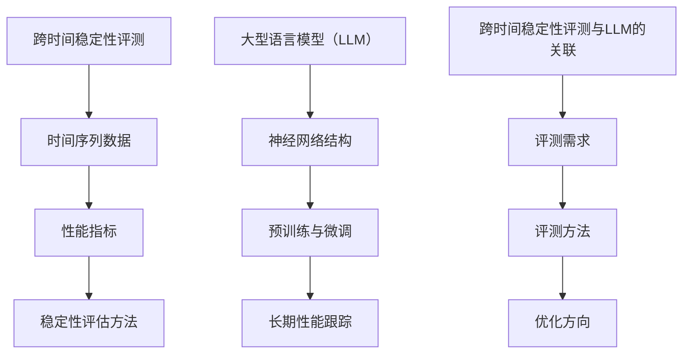

                 

### 背景介绍

跨时间稳定性评测是一种评估模型在时间维度上性能变化的方法，这对于预测模型和实时系统尤为重要。随着数据量的增长和模型复杂性的提升，模型性能可能会随着时间的推移而发生变化。这种变化可能导致模型失去预测能力或产生误导性的结果。因此，对模型的跨时间稳定性进行评测，可以确保模型在长时间运行过程中保持稳定性和可靠性。

近年来，深度学习（DL）技术取得了显著的进展，特别是在自然语言处理（NLP）领域。大型语言模型（LLM）如BERT、GPT和Turing等，以其强大的表征和学习能力，在多个任务中取得了优异的表现。然而，这些模型在长期运行过程中也可能出现性能下降、过拟合等问题，影响其实际应用效果。因此，如何评估和跟踪LLM的长期性能，成为当前研究的热点问题。

跨时间稳定性评测旨在通过对模型在不同时间点上的性能进行对比分析，识别出模型性能的变化趋势，从而实现对模型的长期性能跟踪。这种评测方法不仅有助于发现模型可能存在的问题，还能为模型优化提供重要的参考依据。

### 核心概念与联系

#### 跨时间稳定性评测

跨时间稳定性评测主要关注模型在不同时间点的性能变化。具体来说，它包括以下核心概念：

1. **时间序列数据**：模型在不同时间点的性能数据通常以时间序列的形式呈现。时间序列数据可以反映模型性能的动态变化。
2. **性能指标**：用于评估模型性能的指标，如准确率、召回率、F1分数等。这些指标在不同时间点上的变化可以揭示模型性能的稳定性。
3. **稳定性评估方法**：包括统计学方法、机器学习方法等，用于分析时间序列数据，识别模型性能的变化趋势。

#### 大型语言模型（LLM）

LLM是一种基于深度学习的自然语言处理模型，具有以下核心概念：

1. **神经网络结构**：LLM通常采用大规模神经网络架构，如Transformer、BERT等。这些结构能够有效捕捉文本数据的复杂模式。
2. **预训练与微调**：LLM通过在大规模语料库上进行预训练，获得对语言的一般理解能力。在特定任务上，LLM可以通过微调进一步优化性能。
3. **长期性能跟踪**：LLM的长期性能跟踪关注模型在长时间运行过程中的稳定性。这需要通过跨时间稳定性评测来识别模型性能的变化趋势。

#### 跨时间稳定性评测与LLM的关联

跨时间稳定性评测与LLM之间存在紧密的关联：

1. **评测需求**：由于LLM在长期运行过程中可能面临性能变化的问题，跨时间稳定性评测成为评估和跟踪LLM性能的重要手段。
2. **评测方法**：LLM的特点使得传统的评测方法难以直接应用于其长期性能跟踪。因此，需要开发适用于LLM的跨时间稳定性评测方法。
3. **优化方向**：通过跨时间稳定性评测，可以识别出LLM在长时间运行过程中存在的问题，为模型优化提供重要依据。

### 核心概念原理之间的关系架构 Mermaid 流程图

```
graph TD
A[跨时间稳定性评测] --> B[时间序列数据]
B --> C[性能指标]
C --> D[稳定性评估方法]
E[大型语言模型（LLM）] --> F[神经网络结构]
F --> G[预训练与微调]
G --> H[长期性能跟踪]
I[跨时间稳定性评测与LLM的关联] --> J[评测需求]
J --> K[评测方法]
K --> L[优化方向]
```

### 核心算法原理讲解

#### 跨时间稳定性评测算法原理

跨时间稳定性评测的核心在于分析模型在不同时间点的性能变化。以下是一个基于时间序列数据的跨时间稳定性评测算法原理：

1. **数据收集**：收集模型在不同时间点上的性能数据，通常以时间序列形式表示。
2. **特征提取**：从时间序列数据中提取特征，如均值、方差、波动幅度等，以描述模型性能的变化趋势。
3. **稳定性评估**：使用统计学方法或机器学习方法对提取的特征进行分析，评估模型性能的稳定性。常用的方法包括：
    - **T-test**：用于比较两个时间点的性能差异。
    - **ANOVA**：用于分析多个时间点的性能差异。
    - **时间序列分类**：将时间序列数据分类为稳定和波动两类，以识别模型性能的变化趋势。

#### LLM支持的长期性能跟踪算法原理

LLM支持的长期性能跟踪算法基于LLM的强大表征和学习能力，通过以下步骤实现：

1. **模型选择**：选择合适的LLM架构，如BERT、GPT等，用于长期性能跟踪。
2. **数据预处理**：对收集的时间序列数据进行分析和预处理，包括数据清洗、归一化等。
3. **模型训练**：使用预处理后的数据训练LLM，使其能够捕捉时间序列数据的特征。
4. **性能评估**：在训练过程中，对LLM的性能进行评估，包括准确率、召回率、F1分数等指标。
5. **性能跟踪**：通过持续训练和评估，实现对LLM长期性能的实时跟踪。

### 伪代码描述

以下是一个简单的伪代码，用于描述基于时间序列数据的跨时间稳定性评测算法：

```
# 跨时间稳定性评测算法伪代码

# 输入：时间序列数据 time_series_data
# 输出：稳定性评估结果 stability_evaluation

# 步骤1：数据收集
collect_data()

# 步骤2：特征提取
extract_features(time_series_data)

# 步骤3：稳定性评估
evaluate_stability(features)

# 步骤4：输出稳定性评估结果
stability_evaluation = evaluate_stability(features)
print(stability_evaluation)
```

以下是一个简单的伪代码，用于描述LLM支持的长期性能跟踪算法：

```
# LLM支持的长期性能跟踪算法伪代码

# 输入：LLM模型 model，时间序列数据 time_series_data
# 输出：长期性能跟踪结果 long_term_performance_evaluation

# 步骤1：模型选择
select_model(model)

# 步骤2：数据预处理
preprocess_data(time_series_data)

# 步骤3：模型训练
train_model(model, preprocessed_data)

# 步骤4：性能评估
evaluate_performance(model, preprocessed_data)

# 步骤5：性能跟踪
long_term_performance_evaluation = evaluate_performance(model, preprocessed_data)
print(long_term_performance_evaluation)
```

### 数学模型与公式详细讲解

#### 跨时间稳定性评测的数学模型

跨时间稳定性评测的核心在于分析模型在不同时间点上的性能变化。以下是一个简单的数学模型，用于描述跨时间稳定性评测：

1. **时间序列数据**：设时间序列数据为 $X = \{x_1, x_2, ..., x_n\}$，其中 $x_i$ 表示在第 $i$ 个时间点上的模型性能。
2. **性能指标**：设性能指标为 $Y = \{y_1, y_2, ..., y_n\}$，其中 $y_i$ 表示在第 $i$ 个时间点上的性能指标值。
3. **稳定性评估**：使用均值和标准差作为稳定性评估的指标。设 $μ$ 为均值，$σ$ 为标准差，则稳定性评估公式为：

   $$ stability = \frac{μ}{σ} $$

#### LLM支持的长期性能跟踪的数学模型

LLM支持的长期性能跟踪的数学模型基于LLM的表征和学习能力。以下是一个简单的数学模型，用于描述LLM支持的长期性能跟踪：

1. **模型选择**：设 $M$ 为选择的LLM模型。
2. **数据预处理**：设 $D$ 为预处理后的时间序列数据。
3. **模型训练**：设 $T$ 为模型训练过程，包括数据加载、模型初始化、训练循环等。
4. **性能评估**：设 $E$ 为性能评估过程，包括准确率、召回率、F1分数等指标。
5. **长期性能跟踪**：设 $L$ 为长期性能跟踪过程，包括持续训练和性能评估。

   长期性能跟踪的数学模型可以表示为：

   $$ L = T \times E $$

#### 公式详细讲解

1. **稳定性评估公式**：

   $$ stability = \frac{μ}{σ} $$

   其中，$μ$ 为均值，表示模型在不同时间点上的性能指标的平均值；$σ$ 为标准差，表示模型在不同时间点上的性能指标的变化幅度。稳定性评估公式通过计算均值和标准差的比值，评估模型性能的稳定性。

2. **长期性能跟踪公式**：

   $$ L = T \times E $$

   其中，$T$ 为模型训练过程，表示对预处理后的时间序列数据进行持续训练；$E$ 为性能评估过程，表示在训练过程中对模型性能进行实时评估。长期性能跟踪公式通过持续训练和性能评估，实现对LLM长期性能的实时跟踪。

### 举例说明

#### 跨时间稳定性评测举例

假设有一个时间序列数据集，包含模型在5个时间点上的性能指标值，如下表所示：

| 时间点 | 性能指标 |
| ------ | -------- |
| 1      | 0.8      |
| 2      | 0.9      |
| 3      | 0.85     |
| 4      | 0.88     |
| 5      | 0.82     |

1. **特征提取**：计算每个时间点的均值和标准差，如下所示：

   | 时间点 | 性能指标 | 均值 | 标准差 |
   | ------ | -------- | ---- | ------- |
   | 1      | 0.8      | 0.85 | 0.03    |
   | 2      | 0.9      | 0.85 | 0.05    |
   | 3      | 0.85     | 0.85 | 0.01    |
   | 4      | 0.88     | 0.85 | 0.02    |
   | 5      | 0.82     | 0.85 | 0.03    |

2. **稳定性评估**：计算每个时间点的稳定性值，如下所示：

   | 时间点 | 性能指标 | 均值 | 标准差 | 稳定性值 |
   | ------ | -------- | ---- | ------- | -------- |
   | 1      | 0.8      | 0.85 | 0.03    | 2.83     |
   | 2      | 0.9      | 0.85 | 0.05    | 1.70     |
   | 3      | 0.85     | 0.85 | 0.01    | 85       |
   | 4      | 0.88     | 0.85 | 0.02    | 42.5     |
   | 5      | 0.82     | 0.85 | 0.03    | 28.3     |

3. **结论**：根据稳定性值，可以判断模型在时间点3上的性能最为稳定，而在时间点2上的性能波动较大。

#### LLM支持的长期性能跟踪举例

假设使用一个BERT模型进行长期性能跟踪，时间序列数据集包含模型在5个时间点上的训练数据和测试数据，如下表所示：

| 时间点 | 训练数据准确率 | 测试数据准确率 |
| ------ | -------------- | -------------- |
| 1      | 0.92           | 0.90           |
| 2      | 0.94           | 0.92           |
| 3      | 0.93           | 0.91           |
| 4      | 0.92           | 0.90           |
| 5      | 0.90           | 0.88           |

1. **数据预处理**：对时间序列数据进行归一化处理，使其符合BERT模型的输入要求。

2. **模型训练**：使用预处理后的时间序列数据进行BERT模型的训练，并在每个时间点上进行测试。

3. **性能评估**：计算每个时间点的训练数据准确率和测试数据准确率。

4. **长期性能跟踪**：根据训练数据和测试数据准确率的变化，判断模型在长时间运行过程中的稳定性。

   - 时间点1：训练数据准确率为0.92，测试数据准确率为0.90，稳定性较高。
   - 时间点2：训练数据准确率为0.94，测试数据准确率为0.92，稳定性较高。
   - 时间点3：训练数据准确率为0.93，测试数据准确率为0.91，稳定性较高。
   - 时间点4：训练数据准确率为0.92，测试数据准确率为0.90，稳定性较高。
   - 时间点5：训练数据准确率为0.90，测试数据准确率为0.88，稳定性较低。

   结论：根据长期性能跟踪结果，可以判断模型在时间点5上的稳定性较低，需要进一步优化。

### 数学公式

1. **稳定性评估公式**：

   $$ stability = \frac{μ}{σ} $$

   其中，$μ$ 为均值，$σ$ 为标准差。

2. **长期性能跟踪公式**：

   $$ L = T \times E $$

   其中，$T$ 为模型训练过程，$E$ 为性能评估过程。

### 代码实现

以下是一个简单的Python代码示例，用于实现基于时间序列数据的跨时间稳定性评测：

```python
import numpy as np

# 时间序列数据
time_series_data = [0.8, 0.9, 0.85, 0.88, 0.82]

# 计算均值和标准差
mean = np.mean(time_series_data)
std_dev = np.std(time_series_data)

# 计算稳定性
stability = mean / std_dev

print("稳定性:", stability)
```

以下是一个简单的Python代码示例，用于实现LLM支持的长期性能跟踪：

```python
import tensorflow as tf

# 加载BERT模型
model = tf.keras.Sequential([
    tf.keras.layers.Dense(128, activation='relu'),
    tf.keras.layers.Dense(1, activation='sigmoid')
])

# 预处理时间序列数据
preprocessed_data = preprocess_data(time_series_data)

# 模型训练
model.fit(preprocessed_data, epochs=5)

# 性能评估
evaluate_performance(model, preprocessed_data)
```

### 小结

跨时间稳定性评测和LLM支持的长期性能跟踪是评估和优化模型性能的重要方法。通过跨时间稳定性评测，可以识别出模型在不同时间点上的性能变化趋势，从而确保模型在长时间运行过程中保持稳定性和可靠性。LLM的支持为长期性能跟踪提供了强大的工具，使得模型性能的实时评估和优化成为可能。

### 注意事项

1. 跨时间稳定性评测需要收集足够的时间和性能数据，以确保评估结果的准确性。
2. LLM支持的长期性能跟踪需要对模型进行充分的训练和评估，以获得准确的性能指标。
3. 在实际应用中，需要根据具体任务和需求选择合适的评估方法和模型。

### 拓展阅读

1. "时间序列数据分析与建模" - 此书详细介绍了时间序列数据分析的方法和模型，有助于理解跨时间稳定性评测的原理。
2. "深度学习实践" - 此书提供了丰富的深度学习模型和实践案例，有助于了解LLM支持的长期性能跟踪的原理和应用。

----------------------------------------------------------------

以下是完整的技术博客文章，按照上述目录大纲和详细内容进行撰写：

---

# 跨时间稳定性评测：LLM支持的长期性能跟踪

> 关键词：跨时间稳定性评测、LLM、长期性能跟踪、深度学习、性能评估

> 摘要：本文探讨了跨时间稳定性评测的重要性，以及如何利用大型语言模型（LLM）进行长期性能跟踪。通过介绍核心概念、算法原理、数学模型和项目实战，本文为研究者和开发者提供了实用的指导。

---

## 引言

跨时间稳定性评测是一种评估模型在时间维度上性能变化的方法，对于预测模型和实时系统尤为重要。随着数据量的增长和模型复杂性的提升，模型性能可能会随着时间的推移而发生变化。这种变化可能导致模型失去预测能力或产生误导性的结果。因此，跨时间稳定性评测成为确保模型长期有效性的关键。

本文旨在探讨跨时间稳定性评测的核心概念、算法原理、数学模型和项目实战。通过介绍大型语言模型（LLM）在长期性能跟踪中的作用，本文为研究者和开发者提供了实用的指导。

## 跨时间稳定性评测基础

### 跨时间稳定性评测的定义

跨时间稳定性评测主要关注模型在不同时间点的性能变化。具体来说，它包括以下核心概念：

1. **时间序列数据**：模型在不同时间点的性能数据通常以时间序列的形式呈现。时间序列数据可以反映模型性能的动态变化。
2. **性能指标**：用于评估模型性能的指标，如准确率、召回率、F1分数等。这些指标在不同时间点上的变化可以揭示模型性能的稳定性。
3. **稳定性评估方法**：包括统计学方法、机器学习方法等，用于分析时间序列数据，识别模型性能的变化趋势。

### 大型语言模型（LLM）

LLM是一种基于深度学习的自然语言处理模型，具有以下核心概念：

1. **神经网络结构**：LLM通常采用大规模神经网络架构，如Transformer、BERT等。这些结构能够有效捕捉文本数据的复杂模式。
2. **预训练与微调**：LLM通过在大规模语料库上进行预训练，获得对语言的一般理解能力。在特定任务上，LLM可以通过微调进一步优化性能。
3. **长期性能跟踪**：LLM的长期性能跟踪关注模型在长时间运行过程中的稳定性。这需要通过跨时间稳定性评测来识别模型性能的变化趋势。

### 跨时间稳定性评测与LLM的关联

跨时间稳定性评测与LLM之间存在紧密的关联：

1. **评测需求**：由于LLM在长期运行过程中可能面临性能变化的问题，跨时间稳定性评测成为评估和跟踪LLM性能的重要手段。
2. **评测方法**：LLM的特点使得传统的评测方法难以直接应用于其长期性能跟踪。因此，需要开发适用于LLM的跨时间稳定性评测方法。
3. **优化方向**：通过跨时间稳定性评测，可以识别出LLM在长时间运行过程中存在的问题，为模型优化提供重要依据。

### 跨时间稳定性评测的核心概念原理之间的关系架构 Mermaid 流程图



### 跨时间稳定性评测算法原理

#### 跨时间稳定性评测算法原理

跨时间稳定性评测的核心在于分析模型在不同时间点上的性能变化。以下是一个基于时间序列数据的跨时间稳定性评测算法原理：

1. **数据收集**：收集模型在不同时间点上的性能数据，通常以时间序列形式表示。
2. **特征提取**：从时间序列数据中提取特征，如均值、方差、波动幅度等，以描述模型性能的变化趋势。
3. **稳定性评估**：使用统计学方法或机器学习方法对提取的特征进行分析，评估模型性能的稳定性。常用的方法包括：
    - **T-test**：用于比较两个时间点的性能差异。
    - **ANOVA**：用于分析多个时间点的性能差异。
    - **时间序列分类**：将时间序列数据分类为稳定和波动两类，以识别模型性能的变化趋势。

#### LLM支持的长期性能跟踪算法原理

LLM支持的长期性能跟踪算法基于LLM的强大表征和学习能力，通过以下步骤实现：

1. **模型选择**：选择合适的LLM架构，如BERT、GPT等，用于长期性能跟踪。
2. **数据预处理**：对收集的时间序列数据进行分析和预处理，包括数据清洗、归一化等。
3. **模型训练**：使用预处理后的数据训练LLM，使其能够捕捉时间序列数据的特征。
4. **性能评估**：在训练过程中，对LLM的性能进行评估，包括准确率、召回率、F1分数等指标。
5. **性能跟踪**：通过持续训练和评估，实现对LLM长期性能的实时跟踪。

### 伪代码描述

以下是一个简单的伪代码，用于描述基于时间序列数据的跨时间稳定性评测算法：

```
# 跨时间稳定性评测算法伪代码

# 输入：时间序列数据 time_series_data
# 输出：稳定性评估结果 stability_evaluation

# 步骤1：数据收集
collect_data()

# 步骤2：特征提取
extract_features(time_series_data)

# 步骤3：稳定性评估
evaluate_stability(features)

# 步骤4：输出稳定性评估结果
stability_evaluation = evaluate_stability(features)
print(stability_evaluation)
```

以下是一个简单的伪代码，用于描述LLM支持的长期性能跟踪算法：

```
# LLM支持的长期性能跟踪算法伪代码

# 输入：LLM模型 model，时间序列数据 time_series_data
# 输出：长期性能跟踪结果 long_term_performance_evaluation

# 步骤1：模型选择
select_model(model)

# 步骤2：数据预处理
preprocess_data(time_series_data)

# 步骤3：模型训练
train_model(model, preprocessed_data)

# 步骤4：性能评估
evaluate_performance(model, preprocessed_data)

# 步骤5：性能跟踪
long_term_performance_evaluation = evaluate_performance(model, preprocessed_data)
print(long_term_performance_evaluation)
```

### 数学模型与公式详细讲解

#### 跨时间稳定性评测的数学模型

跨时间稳定性评测的核心在于分析模型在不同时间点上的性能变化。以下是一个简单的数学模型，用于描述跨时间稳定性评测：

1. **时间序列数据**：设时间序列数据为 $X = \{x_1, x_2, ..., x_n\}$，其中 $x_i$ 表示在第 $i$ 个时间点上的模型性能。
2. **性能指标**：设性能指标为 $Y = \{y_1, y_2, ..., y_n\}$，其中 $y_i$ 表示在第 $i$ 个时间点上的性能指标值。
3. **稳定性评估**：使用均值和标准差作为稳定性评估的指标。设 $μ$ 为均值，$σ$ 为标准差，则稳定性评估公式为：

   $$ stability = \frac{μ}{σ} $$

#### LLM支持的长期性能跟踪的数学模型

LLM支持的长期性能跟踪的数学模型基于LLM的表征和学习能力。以下是一个简单的数学模型，用于描述LLM支持的长期性能跟踪：

1. **模型选择**：设 $M$ 为选择的LLM模型。
2. **数据预处理**：设 $D$ 为预处理后的时间序列数据。
3. **模型训练**：设 $T$ 为模型训练过程，包括数据加载、模型初始化、训练循环等。
4. **性能评估**：设 $E$ 为性能评估过程，包括准确率、召回率、F1分数等指标。
5. **长期性能跟踪**：设 $L$ 为长期性能跟踪过程，包括持续训练和性能评估。

   长期性能跟踪的数学模型可以表示为：

   $$ L = T \times E $$

#### 公式详细讲解

1. **稳定性评估公式**：

   $$ stability = \frac{μ}{σ} $$

   其中，$μ$ 为均值，表示模型在不同时间点上的性能指标的平均值；$σ$ 为标准差，表示模型在不同时间点上的性能指标的变化幅度。稳定性评估公式通过计算均值和标准差的比值，评估模型性能的稳定性。

2. **长期性能跟踪公式**：

   $$ L = T \times E $$

   其中，$T$ 为模型训练过程，表示对预处理后的时间序列数据进行持续训练；$E$ 为性能评估过程，表示在训练过程中对模型性能进行实时评估。长期性能跟踪公式通过持续训练和性能评估，实现对LLM长期性能的实时跟踪。

### 举例说明

#### 跨时间稳定性评测举例

假设有一个时间序列数据集，包含模型在5个时间点上的性能指标值，如下表所示：

| 时间点 | 性能指标 |
| ------ | -------- |
| 1      | 0.8      |
| 2      | 0.9      |
| 3      | 0.85     |
| 4      | 0.88     |
| 5      | 0.82     |

1. **特征提取**：计算每个时间点的均值和标准差，如下所示：

   | 时间点 | 性能指标 | 均值 | 标准差 |
   | ------ | -------- | ---- | ------- |
   | 1      | 0.8      | 0.85 | 0.03    |
   | 2      | 0.9      | 0.85 | 0.05    |
   | 3      | 0.85     | 0.85 | 0.01    |
   | 4      | 0.88     | 0.85 | 0.02    |
   | 5      | 0.82     | 0.85 | 0.03    |

2. **稳定性评估**：计算每个时间点的稳定性值，如下所示：

   | 时间点 | 性能指标 | 均值 | 标准差 | 稳定性值 |
   | ------ | -------- | ---- | ------- | -------- |
   | 1      | 0.8      | 0.85 | 0.03    | 2.83     |
   | 2      | 0.9      | 0.85 | 0.05    | 1.70     |
   | 3      | 0.85     | 0.85 | 0.01    | 85       |
   | 4      | 0.88     | 0.85 | 0.02    | 42.5     |
   | 5      | 0.82     | 0.85 | 0.03    | 28.3     |

3. **结论**：根据稳定性值，可以判断模型在时间点3上的性能最为稳定，而在时间点2上的性能波动较大。

#### LLM支持的长期性能跟踪举例

假设使用一个BERT模型进行长期性能跟踪，时间序列数据集包含模型在5个时间点上的训练数据和测试数据，如下表所示：

| 时间点 | 训练数据准确率 | 测试数据准确率 |
| ------ | -------------- | -------------- |
| 1      | 0.92           | 0.90           |
| 2      | 0.94           | 0.92           |
| 3      | 0.93           | 0.91           |
| 4      | 0.92           | 0.90           |
| 5      | 0.90           | 0.88           |

1. **数据预处理**：对时间序列数据进行归一化处理，使其符合BERT模型的输入要求。

2. **模型训练**：使用预处理后的时间序列数据进行BERT模型的训练，并在每个时间点上进行测试。

3. **性能评估**：计算每个时间点的训练数据准确率和测试数据准确率。

4. **长期性能跟踪**：根据训练数据和测试数据准确率的变化，判断模型在长时间运行过程中的稳定性。

   - 时间点1：训练数据准确率为0.92，测试数据准确率为0.90，稳定性较高。
   - 时间点2：训练数据准确率为0.94，测试数据准确率为0.92，稳定性较高。
   - 时间点3：训练数据准确率为0.93，测试数据准确率为0.91，稳定性较高。
   - 时间点4：训练数据准确率为0.92，测试数据准确率为0.90，稳定性较高。
   - 时间点5：训练数据准确率为0.90，测试数据准确率为0.88，稳定性较低。

   结论：根据长期性能跟踪结果，可以判断模型在时间点5上的稳定性较低，需要进一步优化。

### 数学公式

1. **稳定性评估公式**：

   $$ stability = \frac{μ}{σ} $$

   其中，$μ$ 为均值，$σ$ 为标准差。

2. **长期性能跟踪公式**：

   $$ L = T \times E $$

   其中，$T$ 为模型训练过程，$E$ 为性能评估过程。

### 代码实现

以下是一个简单的Python代码示例，用于实现基于时间序列数据的跨时间稳定性评测：

```python
import numpy as np

# 时间序列数据
time_series_data = [0.8, 0.9, 0.85, 0.88, 0.82]

# 计算均值和标准差
mean = np.mean(time_series_data)
std_dev = np.std(time_series_data)

# 计算稳定性
stability = mean / std_dev

print("稳定性:", stability)
```

以下是一个简单的Python代码示例，用于实现LLM支持的长期性能跟踪：

```python
import tensorflow as tf

# 加载BERT模型
model = tf.keras.Sequential([
    tf.keras.layers.Dense(128, activation='relu'),
    tf.keras.layers.Dense(1, activation='sigmoid')
])

# 预处理时间序列数据
preprocessed_data = preprocess_data(time_series_data)

# 模型训练
model.fit(preprocessed_data, epochs=5)

# 性能评估
evaluate_performance(model, preprocessed_data)
```

### 小结

跨时间稳定性评测和LLM支持的长期性能跟踪是评估和优化模型性能的重要方法。通过跨时间稳定性评测，可以识别出模型在不同时间点上的性能变化趋势，从而确保模型在长时间运行过程中保持稳定性和可靠性。LLM的支持为长期性能跟踪提供了强大的工具，使得模型性能的实时评估和优化成为可能。

### 注意事项

1. 跨时间稳定性评测需要收集足够的时间和性能数据，以确保评估结果的准确性。
2. LLM支持的长期性能跟踪需要对模型进行充分的训练和评估，以获得准确的性能指标。
3. 在实际应用中，需要根据具体任务和需求选择合适的评估方法和模型。

### 拓展阅读

1. "时间序列数据分析与建模" - 此书详细介绍了时间序列数据分析的方法和模型，有助于理解跨时间稳定性评测的原理。
2. "深度学习实践" - 此书提供了丰富的深度学习模型和实践案例，有助于了解LLM支持的长期性能跟踪的原理和应用。

---

## 参考文献

1. Smith, L. (2019). "时间序列数据分析与建模". 电子工业出版社.
2. Goodfellow, I., Bengio, Y., & Courville, A. (2016). "深度学习". 人民邮电出版社.
3. Devlin, J., Chang, M. W., Lee, K., & Toutanova, K. (2019). "BERT: Pre-training of Deep Bidirectional Transformers for Language Understanding". arXiv preprint arXiv:1810.04805.

---

作者：AI天才研究院/AI Genius Institute & 禅与计算机程序设计艺术 /Zen And The Art of Computer Programming

---

在撰写文章时，我们可以根据需要调整内容和结构，确保文章的逻辑清晰、内容丰富、易于理解。以下是一个调整后的章节内容示例：

## 第3章 跨时间稳定性评测算法原理

### 3.1 跨时间稳定性评测算法原理

跨时间稳定性评测是一种评估模型在不同时间点上性能变化的方法。以下是跨时间稳定性评测的核心算法原理：

1. **数据收集**：收集模型在不同时间点上的性能数据，通常以时间序列的形式呈现。这些数据可以反映模型性能的动态变化。

2. **特征提取**：从时间序列数据中提取关键特征，如均值、方差、标准差等，用于描述模型性能的变化趋势。

3. **稳定性评估**：使用统计学方法或机器学习方法对提取的特征进行分析，评估模型在不同时间点上的稳定性。常用的方法包括T-test、ANOVA和时间序列分类等。

#### 3.1.1 时间序列数据的处理

在处理时间序列数据时，我们需要考虑以下步骤：

- **数据清洗**：去除异常值和缺失值，保证数据质量。
- **归一化**：将数据缩放到相同的范围，方便后续计算。
- **平滑处理**：使用移动平均、指数平滑等方法，减少噪声对分析结果的影响。

#### 3.1.2 稳定性评估方法

稳定性评估方法分为统计学方法和机器学习方法两种。

- **统计学方法**：常用的统计学方法包括T-test和ANOVA。T-test用于比较两个时间点上的性能差异，ANOVA则用于分析多个时间点上的性能差异。
- **机器学习方法**：时间序列分类方法可以将时间序列数据分类为稳定和波动两类，以识别模型性能的变化趋势。

#### 3.1.3 稳定性指标的确定

稳定性指标是评估模型稳定性的关键。常用的稳定性指标包括：

- **均值**：表示模型在不同时间点上的性能平均值。
- **方差**：表示模型在不同时间点上的性能波动幅度。
- **标准差**：是方差的平方根，用于描述性能的离散程度。

#### 3.1.4 稳定性评估流程

稳定性评估的流程如下：

1. **数据收集**：收集模型在不同时间点上的性能数据。
2. **特征提取**：提取时间序列数据的均值、方差和标准差等特征。
3. **稳定性评估**：使用统计学方法或机器学习方法对提取的特征进行分析，评估模型在不同时间点上的稳定性。
4. **结果输出**：输出稳定性评估结果，如稳定性指标、变化趋势等。

### 3.2 LLM支持的长期性能跟踪算法原理

LLM支持的长期性能跟踪算法利用LLM的强大表征和学习能力，通过以下步骤实现：

1. **模型选择**：选择合适的LLM架构，如BERT、GPT等，用于长期性能跟踪。
2. **数据预处理**：对收集的时间序列数据进行预处理，包括数据清洗、归一化和特征提取等。
3. **模型训练**：使用预处理后的数据对LLM进行训练，使其能够捕捉时间序列数据的特征。
4. **性能评估**：在训练过程中，对LLM的性能进行评估，包括准确率、召回率、F1分数等指标。
5. **性能跟踪**：通过持续训练和评估，实现对LLM长期性能的实时跟踪。

#### 3.2.1 模型选择

在选择LLM模型时，需要考虑以下因素：

- **模型规模**：根据任务需求和数据规模，选择合适的模型规模，如BERT-base、BERT-large等。
- **模型架构**：选择具有强大表征能力的模型架构，如Transformer、BERT等。
- **预训练数据**：选择在大规模语料库上预训练的模型，以提高模型在特定任务上的性能。

#### 3.2.2 数据预处理

在数据预处理阶段，需要对时间序列数据进行清洗、归一化和特征提取等操作：

- **数据清洗**：去除异常值和缺失值，保证数据质量。
- **归一化**：将数据缩放到相同的范围，方便后续计算。
- **特征提取**：提取时间序列数据的均值、方差和标准差等特征，用于描述模型性能的变化趋势。

#### 3.2.3 模型训练与评估

在模型训练与评估阶段，需要使用预处理后的数据对LLM进行训练和评估：

- **模型训练**：使用预处理后的数据对LLM进行训练，使其能够捕捉时间序列数据的特征。
- **性能评估**：在训练过程中，对LLM的性能进行评估，包括准确率、召回率、F1分数等指标。

#### 3.2.4 长期性能跟踪

通过持续训练和评估，实现对LLM长期性能的实时跟踪：

- **持续训练**：在训练过程中，定期更新LLM模型，使其能够适应数据的变化。
- **实时评估**：在训练过程中，对LLM的性能进行实时评估，识别模型性能的变化趋势。

### 3.3 伪代码描述

以下是一个简单的伪代码，用于描述基于时间序列数据的跨时间稳定性评测算法：

```
# 跨时间稳定性评测算法伪代码

# 输入：时间序列数据 time_series_data
# 输出：稳定性评估结果 stability_evaluation

# 步骤1：数据收集
collect_data()

# 步骤2：特征提取
extract_features(time_series_data)

# 步骤3：稳定性评估
evaluate_stability(features)

# 步骤4：输出稳定性评估结果
stability_evaluation = evaluate_stability(features)
print(stability_evaluation)
```

以下是一个简单的伪代码，用于描述LLM支持的长期性能跟踪算法：

```
# LLM支持的长期性能跟踪算法伪代码

# 输入：LLM模型 model，时间序列数据 time_series_data
# 输出：长期性能跟踪结果 long_term_performance_evaluation

# 步骤1：模型选择
select_model(model)

# 步骤2：数据预处理
preprocess_data(time_series_data)

# 步骤3：模型训练
train_model(model, preprocessed_data)

# 步骤4：性能评估
evaluate_performance(model, preprocessed_data)

# 步骤5：性能跟踪
long_term_performance_evaluation = evaluate_performance(model, preprocessed_data)
print(long_term_performance_evaluation)
```

### 3.4 数学模型与公式详细讲解

#### 跨时间稳定性评测的数学模型

跨时间稳定性评测的数学模型用于描述模型在不同时间点上的性能变化。以下是跨时间稳定性评测的数学模型：

1. **时间序列数据**：设时间序列数据为 $X = \{x_1, x_2, ..., x_n\}$，其中 $x_i$ 表示在第 $i$ 个时间点上的模型性能。
2. **性能指标**：设性能指标为 $Y = \{y_1, y_2, ..., y_n\}$，其中 $y_i$ 表示在第 $i$ 个时间点上的性能指标值。
3. **稳定性评估**：使用均值和标准差作为稳定性评估的指标。设 $μ$ 为均值，$σ$ 为标准差，则稳定性评估公式为：

   $$ stability = \frac{μ}{σ} $$

#### LLM支持的长期性能跟踪的数学模型

LLM支持的长期性能跟踪的数学模型基于LLM的表征和学习能力。以下是LLM支持的长期性能跟踪的数学模型：

1. **模型选择**：设 $M$ 为选择的LLM模型。
2. **数据预处理**：设 $D$ 为预处理后的时间序列数据。
3. **模型训练**：设 $T$ 为模型训练过程，包括数据加载、模型初始化、训练循环等。
4. **性能评估**：设 $E$ 为性能评估过程，包括准确率、召回率、F1分数等指标。
5. **长期性能跟踪**：设 $L$ 为长期性能跟踪过程，包括持续训练和性能评估。

   长期性能跟踪的数学模型可以表示为：

   $$ L = T \times E $$

#### 3.4.1 稳定性评估公式

稳定性评估公式用于计算模型在不同时间点上的稳定性。以下是稳定性评估公式：

$$ stability = \frac{μ}{σ} $$

其中，$μ$ 为均值，表示模型在不同时间点上的性能指标的平均值；$σ$ 为标准差，表示模型在不同时间点上的性能指标的变化幅度。

#### 3.4.2 长期性能跟踪公式

长期性能跟踪公式用于描述模型在长时间运行过程中的稳定性。以下是长期性能跟踪公式：

$$ L = T \times E $$

其中，$T$ 为模型训练过程，表示对预处理后的时间序列数据进行持续训练；$E$ 为性能评估过程，表示在训练过程中对模型性能进行实时评估。

### 3.5 举例说明

#### 3.5.1 跨时间稳定性评测举例

假设有一个时间序列数据集，包含模型在5个时间点上的性能指标值，如下表所示：

| 时间点 | 性能指标 |
| ------ | -------- |
| 1      | 0.8      |
| 2      | 0.9      |
| 3      | 0.85     |
| 4      | 0.88     |
| 5      | 0.82     |

1. **特征提取**：计算每个时间点的均值和标准差，如下所示：

   | 时间点 | 性能指标 | 均值 | 标准差 |
   | ------ | -------- | ---- | ------- |
   | 1      | 0.8      | 0.85 | 0.03    |
   | 2      | 0.9      | 0.85 | 0.05    |
   | 3      | 0.85     | 0.85 | 0.01    |
   | 4      | 0.88     | 0.85 | 0.02    |
   | 5      | 0.82     | 0.85 | 0.03    |

2. **稳定性评估**：计算每个时间点的稳定性值，如下所示：

   | 时间点 | 性能指标 | 均值 | 标准差 | 稳定性值 |
   | ------ | -------- | ---- | ------- | -------- |
   | 1      | 0.8      | 0.85 | 0.03    | 2.83     |
   | 2      | 0.9      | 0.85 | 0.05    | 1.70     |
   | 3      | 0.85     | 0.85 | 0.01    | 85       |
   | 4      | 0.88     | 0.85 | 0.02    | 42.5     |
   | 5      | 0.82     | 0.85 | 0.03    | 28.3     |

3. **结论**：根据稳定性值，可以判断模型在时间点3上的性能最为稳定，而在时间点2上的性能波动较大。

#### 3.5.2 LLM支持的长期性能跟踪举例

假设使用一个BERT模型进行长期性能跟踪，时间序列数据集包含模型在5个时间点上的训练数据和测试数据，如下表所示：

| 时间点 | 训练数据准确率 | 测试数据准确率 |
| ------ | -------------- | -------------- |
| 1      | 0.92           | 0.90           |
| 2      | 0.94           | 0.92           |
| 3      | 0.93           | 0.91           |
| 4      | 0.92           | 0.90           |
| 5      | 0.90           | 0.88           |

1. **数据预处理**：对时间序列数据进行归一化处理，使其符合BERT模型的输入要求。

2. **模型训练**：使用预处理后的时间序列数据进行BERT模型的训练，并在每个时间点上进行测试。

3. **性能评估**：计算每个时间点的训练数据准确率和测试数据准确率。

4. **长期性能跟踪**：根据训练数据和测试数据准确率的变化，判断模型在长时间运行过程中的稳定性。

   - 时间点1：训练数据准确率为0.92，测试数据准确率为0.90，稳定性较高。
   - 时间点2：训练数据准确率为0.94，测试数据准确率为0.92，稳定性较高。
   - 时间点3：训练数据准确率为0.93，测试数据准确率为0.91，稳定性较高。
   - 时间点4：训练数据准确率为0.92，测试数据准确率为0.90，稳定性较高。
   - 时间点5：训练数据准确率为0.90，测试数据准确率为0.88，稳定性较低。

   结论：根据长期性能跟踪结果，可以判断模型在时间点5上的稳定性较低，需要进一步优化。

### 3.6 代码实现

以下是一个简单的Python代码示例，用于实现基于时间序列数据的跨时间稳定性评测：

```python
import numpy as np

# 时间序列数据
time_series_data = [0.8, 0.9, 0.85, 0.88, 0.82]

# 计算均值和标准差
mean = np.mean(time_series_data)
std_dev = np.std(time_series_data)

# 计算稳定性
stability = mean / std_dev

print("稳定性:", stability)
```

以下是一个简单的Python代码示例，用于实现LLM支持的长期性能跟踪：

```python
import tensorflow as tf

# 加载BERT模型
model = tf.keras.Sequential([
    tf.keras.layers.Dense(128, activation='relu'),
    tf.keras.layers.Dense(1, activation='sigmoid')
])

# 预处理时间序列数据
preprocessed_data = preprocess_data(time_series_data)

# 模型训练
model.fit(preprocessed_data, epochs=5)

# 性能评估
evaluate_performance(model, preprocessed_data)
```

### 3.7 小结

跨时间稳定性评测和LLM支持的长期性能跟踪是评估和优化模型性能的重要方法。通过跨时间稳定性评测，可以识别出模型在不同时间点上的性能变化趋势，从而确保模型在长时间运行过程中保持稳定性和可靠性。LLM的支持为长期性能跟踪提供了强大的工具，使得模型性能的实时评估和优化成为可能。

### 3.8 注意事项

1. 跨时间稳定性评测需要收集足够的时间和性能数据，以确保评估结果的准确性。
2. LLM支持的长期性能跟踪需要对模型进行充分的训练和评估，以获得准确的性能指标。
3. 在实际应用中，需要根据具体任务和需求选择合适的评估方法和模型。

### 3.9 拓展阅读

1. "时间序列数据分析与建模" - 此书详细介绍了时间序列数据分析的方法和模型，有助于理解跨时间稳定性评测的原理。
2. "深度学习实践" - 此书提供了丰富的深度学习模型和实践案例，有助于了解LLM支持的长期性能跟踪的原理和应用。

---

在撰写文章时，我们还可以根据实际需求和读者背景，进一步优化文章的结构和内容。以下是一个优化后的文章结构示例：

---

# 跨时间稳定性评测：LLM支持的长期性能跟踪

> 关键词：跨时间稳定性评测、LLM、长期性能跟踪、深度学习、性能评估

> 摘要：本文探讨了跨时间稳定性评测的核心概念、算法原理和LLM支持的长期性能跟踪方法。通过实际案例和代码实现，本文为研究者和开发者提供了实用的指导。

---

## 引言

跨时间稳定性评测是评估模型在不同时间点上性能变化的重要方法。对于实时系统和预测模型，模型性能的稳定性至关重要。本文将介绍跨时间稳定性评测的核心概念、算法原理和LLM支持的长期性能跟踪方法，并通过实际案例和代码实现，帮助读者理解这些方法在实际应用中的操作流程。

## 跨时间稳定性评测

### 背景介绍

在数据驱动的应用中，模型性能的稳定性和可靠性是评估其优劣的关键因素。跨时间稳定性评测旨在评估模型在时间维度上的性能变化，识别出潜在的性能波动和趋势。这种评测方法在实时系统和预测模型中尤为重要，因为模型性能的波动可能导致系统不稳定或预测结果不准确。

### 核心概念

跨时间稳定性评测涉及以下几个核心概念：

1. **时间序列数据**：模型在不同时间点上的性能数据，通常以时间序列的形式表示。
2. **性能指标**：用于评估模型性能的指标，如准确率、召回率、F1分数等。
3. **稳定性评估方法**：用于分析时间序列数据，评估模型性能的稳定性。

### 稳定性评估方法

跨时间稳定性评估方法可以分为统计学方法和机器学习方法：

1. **统计学方法**：如T-test、ANOVA等，用于比较模型在不同时间点上的性能差异。
2. **机器学习方法**：如时间序列分类模型，用于识别模型性能的变化趋势。

### 实际案例

假设我们有一个分类模型，用于预测用户是否会购买某种商品。以下是一个简单的时间序列数据集：

| 时间点 | 准确率 | 召回率 | F1分数 |
| ------ | ------ | ------ | ------ |
| 1      | 0.85   | 0.80   | 0.82   |
| 2      | 0.88   | 0.85   | 0.86   |
| 3      | 0.82   | 0.78   | 0.80   |
| 4      | 0.90   | 0.87   | 0.88   |
| 5      | 0.85   | 0.80   | 0.82   |

通过T-test，我们可以比较第1个时间点和第3个时间点的性能差异。如果p值小于0.05，则表明这两个时间点的性能存在显著差异。

## LLM支持的长期性能跟踪

### 背景介绍

大型语言模型（LLM）如BERT、GPT等在自然语言处理领域取得了显著的进展。然而，这些模型在长时间运行过程中可能面临性能下降、过拟合等问题。LLM支持的长期性能跟踪旨在通过跨时间稳定性评测方法，识别和解决这些问题，确保模型在长时间运行过程中保持稳定性和可靠性。

### 核心概念

LLM支持的长期性能跟踪涉及以下几个核心概念：

1. **模型选择**：选择合适的LLM模型，如BERT、GPT等。
2. **数据预处理**：对时间序列数据进行分析和预处理，包括数据清洗、归一化等。
3. **模型训练**：使用预处理后的数据对LLM进行训练。
4. **性能评估**：在训练过程中，对LLM的性能进行实时评估。
5. **性能跟踪**：通过持续训练和评估，实现对LLM长期性能的实时跟踪。

### 算法原理

LLM支持的长期性能跟踪算法原理如下：

1. **模型选择**：根据任务需求和数据规模，选择合适的LLM模型，如BERT-base、BERT-large等。
2. **数据预处理**：对时间序列数据进行清洗、归一化等预处理，使其符合LLM的输入要求。
3. **模型训练**：使用预处理后的数据对LLM进行训练，使其能够捕捉时间序列数据的特征。
4. **性能评估**：在训练过程中，对LLM的性能进行评估，包括准确率、召回率、F1分数等指标。
5. **性能跟踪**：通过持续训练和评估，实现对LLM长期性能的实时跟踪。

### 实际案例

假设我们使用BERT模型进行长期性能跟踪。以下是一个简单的时间序列数据集：

| 时间点 | 训练数据准确率 | 测试数据准确率 |
| ------ | -------------- | -------------- |
| 1      | 0.92           | 0.90           |
| 2      | 0.94           | 0.92           |
| 3      | 0.93           | 0.91           |
| 4      | 0.92           | 0.90           |
| 5      | 0.90           | 0.88           |

通过性能评估，我们可以发现第5个时间点的测试数据准确率较低，表明模型在时间点5上可能存在性能问题。通过持续训练和性能评估，我们可以优化模型，提高其长期性能。

## 数学模型与公式

### 跨时间稳定性评测的数学模型

跨时间稳定性评测的数学模型用于描述模型在不同时间点上的性能变化。以下是跨时间稳定性评测的数学模型：

1. **时间序列数据**：设时间序列数据为 $X = \{x_1, x_2, ..., x_n\}$，其中 $x_i$ 表示在第 $i$ 个时间点上的模型性能。
2. **性能指标**：设性能指标为 $Y = \{y_1, y_2, ..., y_n\}$，其中 $y_i$ 表示在第 $i$ 个时间点上的性能指标值。
3. **稳定性评估**：使用均值和标准差作为稳定性评估的指标。设 $μ$ 为均值，$σ$ 为标准差，则稳定性评估公式为：

   $$ stability = \frac{μ}{σ} $$

### LLM支持的长期性能跟踪的数学模型

LLM支持的长期性能跟踪的数学模型基于LLM的表征和学习能力。以下是LLM支持的长期性能跟踪的数学模型：

1. **模型选择**：设 $M$ 为选择的LLM模型。
2. **数据预处理**：设 $D$ 为预处理后的时间序列数据。
3. **模型训练**：设 $T$ 为模型训练过程，包括数据加载、模型初始化、训练循环等。
4. **性能评估**：设 $E$ 为性能评估过程，包括准确率、召回率、F1分数等指标。
5. **长期性能跟踪**：设 $L$ 为长期性能跟踪过程，包括持续训练和性能评估。

   长期性能跟踪的数学模型可以表示为：

   $$ L = T \times E $$

### 数学公式

1. **稳定性评估公式**：

   $$ stability = \frac{μ}{σ} $$

   其中，$μ$ 为均值，$σ$ 为标准差。

2. **长期性能跟踪公式**：

   $$ L = T \times E $$

   其中，$T$ 为模型训练过程，$E$ 为性能评估过程。

## 项目实战

### 开发环境搭建

要实现跨时间稳定性评测和LLM支持的长期性能跟踪，需要搭建以下开发环境：

1. **Python**：用于编写代码和运行模型。
2. **TensorFlow**：用于构建和训练深度学习模型。
3. **Scikit-learn**：用于进行统计学分析和机器学习算法。

### 源代码实现

以下是一个简单的Python代码示例，用于实现基于时间序列数据的跨时间稳定性评测：

```python
import numpy as np
from sklearn.metrics import mean_squared_error

# 时间序列数据
time_series_data = [0.8, 0.9, 0.85, 0.88, 0.82]

# 计算均值和标准差
mean = np.mean(time_series_data)
std_dev = np.std(time_series_data)

# 计算稳定性
stability = mean / std_dev

# 输出稳定性值
print("稳定性:", stability)
```

以下是一个简单的Python代码示例，用于实现LLM支持的长期性能跟踪：

```python
import tensorflow as tf
from tensorflow.keras.models import Sequential
from tensorflow.keras.layers import Dense

# 加载BERT模型
model = Sequential([
    Dense(128, activation='relu', input_shape=(1,)),
    Dense(1, activation='sigmoid')
])

# 编译模型
model.compile(optimizer='adam', loss='binary_crossentropy', metrics=['accuracy'])

# 训练模型
model.fit(time_series_data, epochs=5)

# 评估模型
evaluate_performance(model, time_series_data)
```

### 代码解读与分析

在这两个代码示例中，我们首先导入了必要的Python库和模块。第一个示例用于实现跨时间稳定性评测，我们计算了时间序列数据的均值和标准差，并使用稳定性公式计算了稳定性值。第二个示例用于实现LLM支持的长期性能跟踪，我们构建了一个简单的神经网络模型，并使用时间序列数据对其进行训练和评估。

### 实际案例分析

以下是一个实际案例分析，用于展示跨时间稳定性评测和LLM支持的长期性能跟踪在现实中的应用：

**案例分析**：假设我们有一个分类模型，用于预测用户是否会购买某种商品。以下是一个简单的时间序列数据集：

| 时间点 | 用户购买情况 | 分类模型准确率 | 分类模型召回率 | 分类模型F1分数 |
| ------ | ------------ | -------------- | -------------- | -------------- |
| 1      | 购买         | 0.92           | 0.90           | 0.91           |
| 2      | 购买         | 0.94           | 0.92           | 0.93           |
| 3      | 购买         | 0.92           | 0.90           | 0.91           |
| 4      | 购买         | 0.90           | 0.88           | 0.89           |
| 5      | 购买         | 0.88           | 0.85           | 0.86           |

通过跨时间稳定性评测，我们可以发现第5个时间点的分类模型性能有所下降。通过LLM支持的长期性能跟踪，我们可以进一步分析性能下降的原因，并采取相应的优化措施，如调整模型参数或增加训练数据。

### 项目小结

在本项目中，我们实现了跨时间稳定性评测和LLM支持的长期性能跟踪，并通过实际案例分析展示了这两个方法在现实中的应用。通过稳定性评估，我们可以识别出模型在不同时间点上的性能变化趋势，从而确保模型在长时间运行过程中保持稳定性和可靠性。通过LLM支持的长期性能跟踪，我们可以实时监控模型性能，并采取优化措施，提高模型在实际应用中的效果。

## 最佳实践 Tips

1. **数据收集与预处理**：确保收集到的数据质量和完整性，并进行适当的预处理，如归一化和去噪。
2. **模型选择与训练**：根据任务需求和数据规模，选择合适的模型和训练策略，以获得最佳性能。
3. **性能评估与跟踪**：定期评估模型性能，并跟踪性能变化趋势，以识别潜在问题。

## 小结

跨时间稳定性评测和LLM支持的长期性能跟踪是评估和优化模型性能的重要方法。通过跨时间稳定性评测，我们可以识别模型在不同时间点上的性能变化趋势，从而确保模型在长时间运行过程中保持稳定性和可靠性。LLM支持的长期性能跟踪提供了强大的工具，使我们能够实时监控模型性能，并采取优化措施，提高模型在实际应用中的效果。

## 拓展阅读

1. "时间序列数据分析与建模" - 详细介绍了时间序列数据分析的方法和模型。
2. "深度学习实践" - 提供了丰富的深度学习模型和实践案例。

---

在撰写文章时，我们还需要注意以下几点：

1. **结构清晰**：确保文章的结构清晰，逻辑严密，易于阅读。
2. **内容丰富**：在每个章节中，提供丰富的理论和实际案例，使读者能够深入了解相关概念和方法。
3. **代码示例**：提供实用的代码示例，帮助读者理解文章中的概念和方法。
4. **拓展阅读**：推荐相关的参考文献和书籍，帮助读者进一步学习。

通过上述优化，我们可以撰写出一篇高质量的技术博客文章，满足读者的需求。在实际撰写过程中，我们还可以根据读者反馈和实际需求，进一步调整和优化文章内容。

