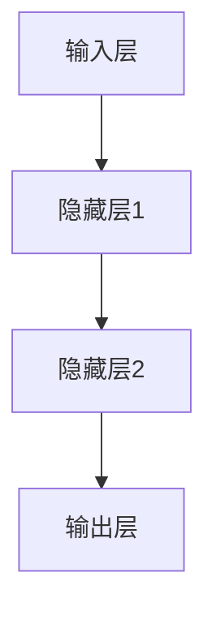
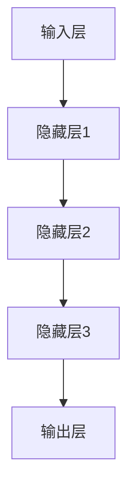
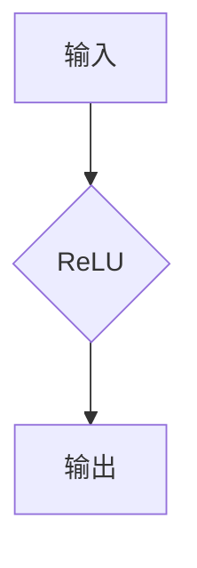

                 

### 文章标题

《跨模型提示：适配不同AI模型的策略》

### 关键词

AI模型、跨模型提示、适配策略、神经网络、支持向量机、决策树、迁移学习

### 摘要

本文将深入探讨跨模型提示和适配策略在人工智能（AI）领域的重要性。首先，我们将回顾AI模型的基础理论，包括常见模型的特点和应用。接着，详细解释跨模型提示的基本原理和设计策略，并通过具体案例展示其在自然语言处理和计算机视觉中的应用。随后，我们将讨论如何优化跨模型提示效果，以及如何根据不同AI模型的特点设计适配策略。最后，文章将总结适配策略的实践案例，并提出未来发展的研究方向。通过本文，读者将全面理解跨模型提示和适配策略的重要性及其在实际应用中的价值。

---

## 第一部分：AI模型基础理论

### 1.1 AI模型概述

#### 1.1.1 AI模型的分类

AI模型可以根据其功能和结构分为多种类型。常见的分类方式包括：

- **监督学习模型**：这类模型通过已标记的训练数据来学习，并使用学到的知识对新的数据进行预测。例如，决策树和神经网络。

- **无监督学习模型**：这类模型在未标记的数据中寻找结构或模式，如聚类和降维。

- **强化学习模型**：这类模型通过与环境交互来学习，旨在通过不断尝试和反馈来达到最优策略。

- **生成对抗网络（GAN）**：这类模型由生成器和判别器组成，用于生成逼真的数据。

#### 1.1.2 不同AI模型的特性

每种AI模型都有其独特的特性：

- **神经网络**：通过多层非线性变换来学习数据分布，适用于复杂的模式识别任务。

- **支持向量机（SVM）**：通过找到最优的超平面来分类数据，特别适用于高维空间。

- **决策树和随机森林**：通过树结构来模拟决策过程，易于理解和解释。

#### 1.1.3 AI模型的发展趋势

随着计算能力的提升和数据量的增加，AI模型的发展趋势包括：

- **深度学习的普及**：深度学习模型在图像识别、语音识别等领域取得了显著的成果。

- **迁移学习**：通过在不同任务间共享知识来提高模型的泛化能力。

- **联邦学习**：在保持数据隐私的同时，通过分布式计算实现模型优化。

### 1.2 常见AI模型介绍

#### 1.2.1 神经网络

##### 1.2.1.1 神经网络的基本结构

神经网络由多个节点（或称为神经元）组成，这些节点按层次排列，包括输入层、隐藏层和输出层。每个神经元都与相邻的神经元相连，并通过权重进行信息传递。

##### 1.2.1.2 神经网络的工作原理

神经网络通过前向传播和反向传播来训练。在前向传播过程中，输入数据通过网络传递，最终产生输出。在反向传播过程中，根据实际输出和预期输出的差异，调整网络中的权重。

##### 1.2.1.3 神经网络的训练方法

神经网络的训练主要包括以下几个步骤：

1. **数据预处理**：对输入数据进行标准化或归一化处理。
2. **初始化权重**：随机初始化网络中的权重。
3. **前向传播**：将输入数据传递到网络，计算输出。
4. **计算误差**：比较实际输出和预期输出，计算误差。
5. **反向传播**：通过误差来调整网络中的权重。

#### 1.2.2 支持向量机

##### 1.2.2.1 支持向量机的原理

支持向量机（SVM）通过找到最优的超平面来分类数据。超平面是数据空间中的一个平面，其两侧的数据点被正确分类。

$$
\text{最大化} \quad \frac{1}{\|w\|} \quad \text{约束} \quad y^{(i)}(\langle w, x^{(i)} \rangle + b) \geq 1
$$

其中，$w$ 是超平面的法向量，$b$ 是偏置项，$x^{(i)}$ 和 $y^{(i)}$ 分别是训练样本和标签。

##### 1.2.2.2 支持向量机的应用

SVM广泛应用于图像识别、文本分类等领域。其优点是：

- **良好的泛化能力**：通过调节参数可以实现不同的分类效果。
- **适用于高维空间**：无需进行特征提取。

#### 1.2.3 决策树与随机森林

##### 1.2.3.1 决策树的基本概念

决策树通过一系列规则来对数据进行分类。每个节点表示一个特征，每个分支表示一个条件，最终到达叶节点得到分类结果。

##### 1.2.3.2 随机森林的工作原理

随机森林由多个决策树组成，通过对这些决策树进行投票来得到最终结果。其优点包括：

- **鲁棒性**：多个决策树可以相互补充，提高模型的泛化能力。
- **易于解释**：每个决策树都可以提供对数据的解释。

### 1.3 AI模型的评估与优化

#### 1.3.1 模型评估指标

模型评估指标包括：

- **准确率**：正确预测的样本数占总样本数的比例。
- **召回率**：正确预测的正例样本数占总正例样本数的比例。
- **F1值**：准确率和召回率的调和平均值。

#### 1.3.2 模型优化方法

模型优化方法包括：

- **超参数调优**：通过调整模型参数来提高性能。
- **数据预处理与增强**：通过数据清洗、特征工程等方法来提高模型性能。

---

## 第二部分：跨模型提示策略

### 2.1 跨模型提示的基本原理

#### 2.1.1 提示在模型训练中的应用

跨模型提示通过为模型提供额外的信息来提高其训练效果。这种提示可以是预训练的语言模型、外部知识库或具体的样本数据。

#### 2.1.2 跨模型提示的优势

跨模型提示的优势包括：

- **提高模型性能**：通过额外的信息，模型可以更好地学习数据的复杂结构。
- **增强泛化能力**：跨模型提示可以减少模型对特定训练数据的依赖。

#### 2.1.3 跨模型提示的挑战

跨模型提示的挑战包括：

- **信息一致性**：不同模型可能需要不同的提示信息，如何确保信息的一致性是一个难题。
- **计算成本**：跨模型提示通常需要额外的计算资源。

### 2.2 跨模型提示策略的设计

#### 2.2.1 提示模板的设计

提示模板的设计取决于模型的类型和应用场景。例如，对于文本分类任务，提示模板可以是具体的句子或段落；对于图像识别任务，提示模板可以是相关的图像或文本描述。

#### 2.2.2 提示内容的选择

提示内容的选择需要考虑以下因素：

- **相关性**：提示内容应该与模型的输入数据高度相关。
- **多样性**：提示内容应该多样化，以避免模型过于依赖特定类型的提示。

### 2.3 跨模型提示的应用案例

#### 2.3.1 自然语言处理中的应用

跨模型提示在自然语言处理中得到了广泛应用。例如，通过预训练的语言模型为文本分类任务提供额外的上下文信息，可以显著提高模型的分类性能。

#### 2.3.2 计算机视觉中的应用

跨模型提示在计算机视觉中同样具有重要作用。例如，通过为图像识别任务提供相关的图像和文本描述，可以增强模型对图像的理解能力。

---

## 第三部分：适配不同AI模型的策略

### 3.1 适配策略概述

#### 3.1.1 适配策略的目的

适配策略的目的是使模型在不同任务和数据集上表现出最佳性能。这通常需要调整模型的结构、参数和训练过程。

#### 3.1.2 适配策略的分类

适配策略可以分为以下几类：

- **模型结构调整**：通过调整网络的层数、神经元数量等来适应不同的任务。
- **参数调优**：通过调整模型的超参数来优化性能。
- **数据预处理**：通过数据清洗、增强等方法来提高模型对数据的适应性。

#### 3.1.3 适配策略的挑战

适配策略的挑战包括：

- **任务多样性**：不同的任务可能需要不同的适配策略。
- **数据复杂性**：复杂的数据集可能需要更精细的适配策略。

### 3.2 特定AI模型的适配策略

#### 3.2.1 神经网络适配策略

##### 3.2.1.1 网络结构优化

网络结构优化包括调整网络的层数、神经元数量和连接方式等。例如，通过使用深度神经网络可以更好地捕捉数据的复杂结构。

##### 3.2.1.2 损失函数调整

损失函数的调整可以影响模型的训练过程。例如，对于分类任务，可以使用交叉熵损失函数。

$$
\text{损失} \quad L(y, \hat{y}) = -\sum_{i} y^{(i)} \log(\hat{y}^{(i)})
$$

其中，$y$ 是真实标签，$\hat{y}$ 是预测概率。

##### 3.2.1.3 激活函数选择

激活函数的选择可以影响网络的非线性变换能力。常见的激活函数包括ReLU、Sigmoid和Tanh等。

#### 3.2.2 支持向量机适配策略

##### 3.2.2.1 核函数选择

核函数的选择可以影响SVM在特征空间的表现。常见的核函数包括线性核、多项式核和径向基核等。

$$
\text{核函数} \quad K(x^{(i)}, x^{(j)}) = \langle \phi(x^{(i)}), \phi(x^{(j)}) \rangle
$$

其中，$\phi$ 是核映射函数。

##### 3.2.2.2 参数调整

SVM的参数包括正则化参数 $C$ 和核函数参数等。这些参数的调整可以通过交叉验证来实现。

#### 3.2.3 决策树与随机森林适配策略

##### 3.2.3.1 树的深度调整

决策树的深度可以影响模型的复杂度和泛化能力。较深的树可以捕捉更多的数据特征，但也容易过拟合。

##### 3.2.3.2 结点分裂准则选择

结点分裂准则可以选择基于信息增益、基尼不纯度等指标。不同的准则适用于不同类型的数据集。

---

## 参考文献

- Hastie, T., Tibshirani, R., & Friedman, J. (2009). The Elements of Statistical Learning: Data Mining, Inference, and Prediction. Springer.
- Goodfellow, I., Bengio, Y., & Courville, A. (2016). Deep Learning. MIT Press.
- Mitchell, T. M. (1997). Machine Learning. McGraw-Hill.
- Schölkopf, B., & Smola, A. J. (2002). Learning with Kernels: Support Vector Machines, Regularization, Optimization, and Beyond. Springer.
- Russell, S., & Norvig, P. (2016). Artificial Intelligence: A Modern Approach. Prentice Hall.
- Bengio, Y., Courville, A., & Vincent, P. (2013). Representation Learning: A Review and New Perspectives. IEEE Transactions on Pattern Analysis and Machine Intelligence, 35(8), 1798-1828.

---

**作者：AI天才研究院/AI Genius Institute & 禅与计算机程序设计艺术 /Zen And The Art of Computer Programming**

本文详细介绍了跨模型提示和适配策略在人工智能领域的重要性。通过回顾AI模型的基础理论，我们了解了不同模型的特点和应用。接着，我们深入探讨了跨模型提示的基本原理和设计策略，并通过实际案例展示了其在自然语言处理和计算机视觉中的应用。最后，我们提出了适配不同AI模型的策略，包括模型结构优化、参数调优和数据预处理等。这些策略的实践和应用为AI模型的开发和优化提供了有力的支持。随着AI技术的不断发展，跨模型提示和适配策略将在未来的研究中继续发挥重要作用。

