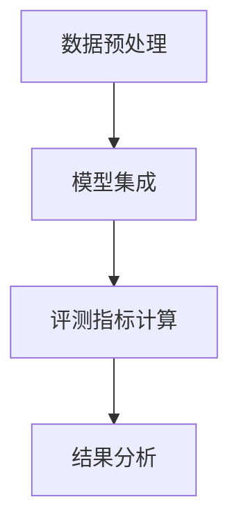
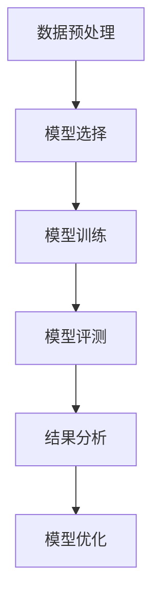
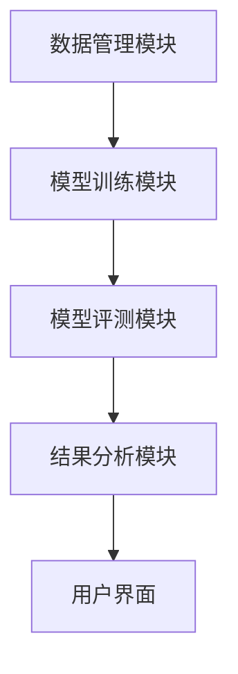

                 


### 设计书籍目录大纲的思考过程

在设计《跨模型评测标准化：建立统一比较基准》的书籍目录大纲时，我们需要采取逐步分析的方法，以确保内容的结构合理、逻辑清晰，并且能够满足读者的需求。以下是一个详细的思考过程：

#### 1. 确定书籍的整体结构
首先，我们需要明确书籍的整体结构。作为一本专业书籍，它应该包含以下几个部分：
- 引言：介绍书籍的背景、目的和读者对象。
- 核心内容：详细讲解跨模型评测的原理、方法和实践。
- 应用案例：通过实际案例展示跨模型评测的应用。
- 总结：对全书的内容进行总结，并提出未来的研究方向。

#### 2. 确定章节划分
在确定整体结构后，我们需要将结构细化为具体的章节。对于《跨模型评测标准化：建立统一比较基准》，我们可以划分以下章节：
- 第1章：核心概念与联系
- 第2章：跨模型评测的原理与架构
- 第3章：核心算法原理讲解
- 第4章：数学模型与数学公式讲解
- 第5章：项目实战
- 第6章：总结与展望

#### 3. 确定每个章节的内容
接下来，我们需要为每个章节确定具体的内容。例如：
- 第1章：介绍跨模型评测的基本概念、意义以及关键要素。
- 第2章：详细讲解跨模型评测的基本原理和架构设计。
- 第3章：通过伪代码和实例，深入讲解核心算法原理。
- 第4章：使用LaTeX格式详细讲解数学模型和公式，并给出实例。
- 第5章：提供一个完整的跨模型评测项目实战，包括开发环境搭建、源代码实现和代码解读。
- 第6章：总结全书内容，并提出跨模型评测的未来发展方向。

#### 4. 设计Mermaid流程图
为了帮助读者更好地理解核心概念和原理，我们可以使用Mermaid流程图来展示跨模型评测的基本流程和架构设计。例如：

这样的流程图能够直观地展示跨模型评测的各个步骤及其相互关系。

#### 5. 编写伪代码和LaTeX公式
在核心算法原理讲解和数学模型讲解部分，我们使用伪代码和LaTeX公式来详细阐述。例如：
```pseudo
// 伪代码示例：模型融合算法
Initialize empty model融合
for each model M in 模型集合 do
    Calculate prediction P_M
    Update model融合 with P_M
return model融合
```
```latex
// LaTeX公式示例：误差分析
E = \sum_{i=1}^{n} (y_i - \hat{y}_i)^2
```

#### 6. 编写项目实战
在项目实战部分，我们需要详细描述项目的开发环境搭建、源代码实现和代码解读。例如：
- 开发环境搭建：描述所需的软件工具和硬件配置。
- 源代码实现：提供完整的源代码，并进行详细的注释和解读。
- 代码应用解读与分析：分析代码的实现逻辑，讲解关键代码段的功能。

#### 7. 编写总结和注意事项
最后，我们需要为每个章节编写总结，帮助读者回顾和巩固所学内容。同时，在文章末尾提供最佳实践 tips、注意事项和拓展阅读等，以帮助读者进一步学习和应用。

通过上述思考过程，我们可以确保书籍目录大纲的内容完整、逻辑清晰，并且能够满足读者的需求。接下来，我们将根据这个目录大纲进一步细化每个章节的内容，并编写相应的Mermaid流程图、伪代码、LaTeX公式和项目实战部分。确保整个目录大纲的总字数在2000字以内，同时确保内容的完整性和逻辑性。

---

### 《跨模型评测标准化：建立统一比较基准》

## 文章标题：跨模型评测标准化：建立统一比较基准

### 关键词：跨模型评测、标准化、比较基准、模型融合、算法原理

### 摘要：本文详细探讨了跨模型评测的标准化问题，阐述了建立统一比较基准的重要性。通过介绍核心概念与联系、算法原理、数学模型以及实际项目实战，本文旨在为读者提供一个全面、系统的跨模型评测指南。

---

## 引言

### 1.1 书籍背景与目标

在人工智能和机器学习的快速发展中，模型融合和跨模型评测变得越来越重要。跨模型评测旨在通过比较不同模型在特定任务上的性能，选择出最优模型或模型组合。然而，由于各种模型的设计和应用场景不同，如何进行有效的评测和标准化成为了一个挑战。

本书的目的是为跨模型评测提供一个系统的理论框架和实践指南。我们将从核心概念、算法原理、数学模型到实际项目实战，全面探讨跨模型评测的各个方面。通过本书的学习，读者将能够：
- 理解跨模型评测的基本概念和重要性。
- 掌握跨模型评测的核心算法原理。
- 掌握建立统一比较基准的方法和技巧。
- 通过实际项目实战，提升跨模型评测的实践能力。

### 1.2 读者预期收获

本书适合于以下读者群体：
- 机器学习工程师和研究人员，希望提升模型融合和评测能力的专业人士。
- 计算机科学和人工智能领域的学生，需要深入了解跨模型评测的理论和实践。
- 对跨模型评测感兴趣的技术爱好者。

通过阅读本书，读者可以期望获得以下收获：
- 对跨模型评测有一个全面、系统的理解。
- 掌握多种跨模型评测方法和算法。
- 学会建立和优化跨模型评测的基准。
- 能够在实际项目中应用所学知识，提高工作效率。

---

## 第1章 核心概念与联系

### 1.1 跨模型评测的定义与意义

#### 跨模型评测的定义

跨模型评测是指通过比较不同模型在特定任务上的表现，评估其性能差异，并选择最优模型或模型组合的过程。这一过程涉及到多个模型的性能比较、评估指标的制定以及结果的解释。

#### 跨模型评测的意义

1. **提升模型性能**：通过跨模型评测，可以找到性能更优的模型或模型组合，从而提升整体任务的处理效果。
2. **模型优化**：评测过程中，可以发现模型的弱点，进而对模型进行优化和调整。
3. **资源合理分配**：跨模型评测可以帮助决策者了解不同模型的成本效益，合理分配资源。
4. **推动模型发展**：通过评测，可以发现现有模型和技术中的不足，推动模型和算法的创新和发展。

### 1.2 跨模型评测的关键要素

#### 模型选择

模型选择是跨模型评测的基础。选择合适的模型对于评测结果至关重要。在选择模型时，需要考虑以下因素：
- **任务类型**：不同的任务需要不同类型的模型。
- **数据集**：数据集的大小、分布和质量对模型选择有重要影响。
- **模型特性**：模型的复杂度、计算效率和适用场景都需要考虑。

#### 评测指标

评测指标是衡量模型性能的关键。常见的评测指标包括：
- **准确率**：分类任务中正确分类的样本数占总样本数的比例。
- **召回率**：分类任务中被正确分类为正类的样本数占实际正类样本数的比例。
- **F1分数**：准确率和召回率的调和平均值。
- **精确率**：分类任务中被正确分类为正类的样本数占预测为正类的样本数的比例。

#### 数据预处理

数据预处理是确保模型性能的重要因素。常见的数据预处理方法包括：
- **数据清洗**：去除噪声数据和异常值。
- **数据归一化**：将不同尺度的数据进行标准化处理。
- **数据增强**：通过增加样本数量和提高样本质量来提升模型性能。

### 1.3 跨模型评测的基本概念

#### 模型间比较

模型间比较是指通过评测指标对多个模型的性能进行对比。比较的方法包括：
- **独立比较**：分别评估每个模型在特定任务上的性能。
- **组合比较**：将多个模型组合成一个整体，评估其整体性能。

#### 标准化

标准化是指通过一定的规则和标准，对不同模型进行性能评测和比较。标准化的目标包括：
- **统一评测基准**：确保不同模型在相同的条件下进行评测。
- **可比性**：提高不同模型之间的可比性，便于选择最优模型。
- **可靠性**：确保评测结果的稳定性和可信度。

### 1.4 Mermaid流程图

为了更好地理解跨模型评测的基本流程，我们可以使用Mermaid流程图进行展示。以下是跨模型评测的基本流程图：



通过这个流程图，我们可以清晰地看到跨模型评测的基本步骤和各个步骤之间的关系。

---

## 第2章 跨模型评测的原理与架构

### 2.1 跨模型评测的基本原理

跨模型评测的核心在于通过比较不同模型在特定任务上的性能，选择最优模型或模型组合。这一过程涉及到多个方面，包括模型选择、数据预处理、模型训练、模型评测和结果分析等。

#### 模型选择

模型选择是跨模型评测的基础。在选择模型时，需要考虑以下因素：
- **任务类型**：不同的任务需要不同类型的模型。例如，图像分类任务通常使用卷积神经网络（CNN），而自然语言处理任务则更多使用循环神经网络（RNN）或Transformer模型。
- **数据集**：数据集的大小、分布和质量对模型选择有重要影响。例如，对于小数据集，可能需要选择简单且易于训练的模型，而对于大数据集，可能需要选择复杂且能够捕捉数据分布的模型。
- **模型特性**：模型的复杂度、计算效率和适用场景都需要考虑。例如，某些模型可能在特定任务上具有更好的性能，但在计算资源有限的情况下可能无法运行。

#### 数据预处理

数据预处理是确保模型性能的重要因素。常见的数据预处理方法包括：
- **数据清洗**：去除噪声数据和异常值，确保数据的质量和一致性。
- **数据归一化**：将不同尺度的数据进行标准化处理，使得模型能够更好地学习数据的特征。
- **数据增强**：通过增加样本数量和提高样本质量来提升模型性能。例如，通过旋转、翻转、裁剪等操作增加数据的多样性。

#### 模型训练

模型训练是跨模型评测的关键步骤。在训练过程中，需要使用合适的训练策略和优化方法来提高模型的性能。常见的训练策略包括：
- **批量训练**：将数据分为多个批次进行训练，可以减少过拟合现象。
- **早停法**：在验证集上监测模型的性能，一旦性能下降则提前停止训练，防止过拟合。
- **学习率调整**：根据模型的表现调整学习率，以找到最佳的学习率。

#### 模型评测

模型评测是评估模型性能的重要步骤。通过评测，可以确定不同模型在特定任务上的表现，选择最优模型或模型组合。常见的评测指标包括：
- **准确率**：分类任务中正确分类的样本数占总样本数的比例。
- **召回率**：分类任务中被正确分类为正类的样本数占实际正类样本数的比例。
- **F1分数**：准确率和召回率的调和平均值。
- **精确率**：分类任务中被正确分类为正类的样本数占预测为正类的样本数的比例。

#### 结果分析

结果分析是对模型评测结果进行深入理解和解释的过程。通过结果分析，可以识别模型的优点和不足，提出改进措施。结果分析的方法包括：
- **性能比较**：比较不同模型的性能，确定最优模型。
- **错误分析**：分析模型在特定任务上的错误案例，找出错误的原因。
- **调优建议**：根据结果分析提出模型调优的建议。

### 2.2 跨模型评测的架构设计

跨模型评测的架构设计是确保评测过程高效、稳定和可重复的关键。一个典型的跨模型评测架构包括以下几个部分：

1. **数据管理模块**：负责数据的管理和预处理，包括数据清洗、归一化和增强等操作。

2. **模型训练模块**：负责训练不同类型的模型，并使用合适的训练策略和优化方法。

3. **模型评测模块**：负责评估模型的性能，使用各种评测指标进行评估。

4. **结果分析模块**：负责对评测结果进行深入分析和解释，提出改进建议。

5. **用户界面**：提供用户与系统交互的界面，用户可以通过界面提交任务、查看结果和调整参数。

### 2.3 跨模型评测的挑战和解决方案

跨模型评测面临一些挑战，包括：
- **模型差异**：不同模型在性能、效率和适用场景上存在差异，如何进行公平、准确的比较是一个挑战。
- **数据差异**：不同模型处理的数据可能存在差异，如何进行统一的数据预处理是一个挑战。
- **评测指标差异**：不同评测指标可能对模型性能的衡量存在差异，如何选择合适的评测指标是一个挑战。

为了解决这些挑战，可以采取以下解决方案：
- **标准化方法**：通过标准化方法将不同模型的数据和评测指标进行统一，确保公平、准确的比较。
- **多模型融合**：通过多模型融合方法，将不同模型的优点进行结合，提高整体性能。
- **个性化评测**：根据具体任务和场景，选择合适的评测指标和模型，实现个性化评测。

### 2.4 Mermaid流程图

为了更好地理解跨模型评测的架构设计，我们可以使用Mermaid流程图进行展示。以下是跨模型评测的架构流程图：



通过这个流程图，我们可以清晰地看到跨模型评测的基本架构和各个模块之间的关系。

---

## 第3章 核心算法原理讲解

### 3.1 算法选择与设计

在跨模型评测中，算法的选择和设计是关键步骤。以下是一些常见的算法选择和设计原则：

#### 模型融合算法

模型融合算法是将多个模型的预测结果进行综合，得到最终预测结果的方法。常见的模型融合算法包括：
- **投票法**：简单地将多个模型的预测结果进行投票，选择投票次数最多的结果。
- **贝叶斯法**：利用贝叶斯定理，结合多个模型的预测概率，得到最终预测结果。
- **加权法**：根据模型在特定任务上的性能，对模型的预测结果进行加权平均。

#### 模型对比算法

模型对比算法是评估不同模型在特定任务上的性能差异的方法。常见的模型对比算法包括：
- **错误率对比**：通过计算不同模型的错误率，比较模型的性能。
- **F1分数对比**：通过计算不同模型的F1分数，比较模型的性能。
- **ROC曲线对比**：通过绘制不同模型的ROC曲线，比较模型的性能。

#### 评测指标优化算法

评测指标优化算法是优化模型性能的方法。常见的评测指标优化算法包括：
- **梯度提升算法**：通过优化目标函数，逐步调整模型参数，提高模型性能。
- **随机搜索算法**：通过随机搜索策略，找到最优模型参数。
- **遗传算法**：通过模拟遗传过程，找到最优模型参数。

### 3.2 模型融合算法

模型融合算法是跨模型评测中的重要环节。以下是一种常见的模型融合算法——贝叶斯模型融合算法：

```pseudo
// 贝叶斯模型融合算法
Initialize model融合
for each model M in 模型集合 do
    Calculate prediction P_M
    Update model融合 with P_M
return model融合
```

#### 伪代码解释

1. **初始化模型融合**：首先初始化一个空的模型融合结构。
2. **循环计算每个模型的预测结果**：对于每个模型M，计算其在特定任务上的预测结果P\_M。
3. **更新模型融合**：将每个模型的预测结果P\_M更新到模型融合中。
4. **返回模型融合**：最终返回融合后的模型融合结果。

### 3.3 模型对比算法

模型对比算法是评估不同模型性能差异的方法。以下是一种常见的模型对比算法——错误率对比算法：

```pseudo
// 错误率对比算法
Initialize model性能记录
for each model M in 模型集合 do
    Calculate error rate E_M
    Record model performance in model性能记录
return model性能记录
```

#### 伪代码解释

1. **初始化模型性能记录**：首先初始化一个空的模型性能记录结构。
2. **循环计算每个模型的错误率**：对于每个模型M，计算其在特定任务上的错误率E\_M。
3. **记录模型性能**：将每个模型的错误率E\_M记录到模型性能记录中。
4. **返回模型性能记录**：最终返回所有模型的性能记录。

### 3.4 评测指标优化算法

评测指标优化算法是提高模型性能的方法。以下是一种常见的评测指标优化算法——梯度提升算法：

```pseudo
// 梯度提升算法
Initialize model参数
for each iteration do
    Calculate gradient G
    Update model参数 with G
    Evaluate model performance
end iteration
return model参数
```

#### 伪代码解释

1. **初始化模型参数**：首先初始化模型的初始参数。
2. **循环迭代计算梯度**：对于每个迭代，计算模型参数的梯度G。
3. **更新模型参数**：根据梯度G更新模型参数。
4. **评估模型性能**：在每次迭代后，评估模型的性能。
5. **结束迭代**：当满足停止条件（如性能提升幅度小于阈值）时，结束迭代。
6. **返回模型参数**：最终返回优化的模型参数。

---

## 第4章 数学模型与数学公式讲解

### 4.1 数学模型的基本概念

在跨模型评测中，数学模型是评估和比较模型性能的重要工具。以下是一些基本的数学模型概念：

#### 概率模型

概率模型是一种基于概率论的数学模型，用于预测事件发生的可能性。常见的概率模型包括：

- **贝叶斯模型**：贝叶斯模型是一种基于贝叶斯定理的模型，用于预测事件发生的概率。贝叶斯模型的数学公式如下：
  $$ P(A|B) = \frac{P(B|A) \cdot P(A)}{P(B)} $$
  其中，$P(A|B)$表示在事件B发生的情况下事件A发生的概率，$P(B|A)$表示在事件A发生的情况下事件B发生的概率，$P(A)$表示事件A发生的概率，$P(B)$表示事件B发生的概率。

- **概率分布**：概率分布是一种描述随机变量取值概率的模型。常见的概率分布包括正态分布、伯努利分布和泊松分布等。

#### 统计模型

统计模型是一种基于统计学原理的数学模型，用于分析数据并得出结论。常见的统计模型包括：

- **线性回归模型**：线性回归模型是一种用于分析自变量和因变量之间线性关系的模型。线性回归模型的数学公式如下：
  $$ y = \beta_0 + \beta_1 \cdot x $$
  其中，$y$表示因变量，$x$表示自变量，$\beta_0$和$\beta_1$分别表示模型的参数。

- **逻辑回归模型**：逻辑回归模型是一种用于分析二分类问题的模型。逻辑回归模型的数学公式如下：
  $$ P(y=1) = \frac{1}{1 + e^{-(\beta_0 + \beta_1 \cdot x)}} $$
  其中，$y$表示因变量，$x$表示自变量，$\beta_0$和$\beta_1$分别表示模型的参数。

#### 计量模型

计量模型是一种用于度量不同模型之间差异的数学模型。常见的计量模型包括：

- **F1分数**：F1分数是一种用于评估分类模型性能的指标，它综合考虑了准确率和召回率。F1分数的数学公式如下：
  $$ F1 = 2 \cdot \frac{Precision \cdot Recall}{Precision + Recall} $$
  其中，$Precision$表示精确率，$Recall$表示召回率。

- **ROC曲线**：ROC曲线是一种用于评估分类模型性能的图形表示方法。ROC曲线的数学公式如下：
  $$ ROC = \frac{TP + TN}{TP + FP + FN + TN} $$
  其中，$TP$表示真正例，$TN$表示真负例，$FP$表示假正例，$FN$表示假负例。

### 4.2 数学公式的详细讲解

在跨模型评测中，数学公式是分析模型性能和比较模型之间差异的重要工具。以下是一些常见的数学公式的详细讲解：

#### 1. 线性回归模型的数学公式

线性回归模型是一种常用的统计模型，用于分析自变量和因变量之间的线性关系。线性回归模型的数学公式如下：

$$ y = \beta_0 + \beta_1 \cdot x + \epsilon $$

其中，$y$表示因变量，$x$表示自变量，$\beta_0$和$\beta_1$分别表示模型的参数，$\epsilon$表示误差项。

#### 2. 逻辑回归模型的数学公式

逻辑回归模型是一种用于分析二分类问题的统计模型。逻辑回归模型的数学公式如下：

$$ P(y=1) = \frac{1}{1 + e^{-(\beta_0 + \beta_1 \cdot x)}} $$

其中，$y$表示因变量，$x$表示自变量，$\beta_0$和$\beta_1$分别表示模型的参数。

#### 3. F1分数的数学公式

F1分数是一种用于评估分类模型性能的指标，它综合考虑了准确率和召回率。F1分数的数学公式如下：

$$ F1 = 2 \cdot \frac{Precision \cdot Recall}{Precision + Recall} $$

其中，$Precision$表示精确率，$Recall$表示召回率。

#### 4. ROC曲线的数学公式

ROC曲线是一种用于评估分类模型性能的图形表示方法。ROC曲线的数学公式如下：

$$ ROC = \frac{TP + TN}{TP + FP + FN + TN} $$

其中，$TP$表示真正例，$TN$表示真负例，$FP$表示假正例，$FN$表示假负例。

### 4.3 举例说明

为了更好地理解这些数学公式，我们可以通过一些具体的例子进行说明。

#### 例子 1：线性回归模型

假设我们有一个简单的线性回归模型，用于预测房价。模型的数学公式如下：

$$ y = \beta_0 + \beta_1 \cdot x $$

其中，$y$表示房价，$x$表示房屋面积，$\beta_0$和$\beta_1$分别表示模型的参数。

假设我们有一个训练数据集，其中包括10个样本，每个样本包括房屋面积和房价。通过最小二乘法，我们可以计算出模型的参数：

$$ \beta_0 = 100, \beta_1 = 10 $$

因此，模型的预测公式为：

$$ y = 100 + 10 \cdot x $$

例如，如果我们想要预测一个面积为150平方米的房屋的房价，我们可以使用模型进行预测：

$$ y = 100 + 10 \cdot 150 = 1600 $$

#### 例子 2：逻辑回归模型

假设我们有一个逻辑回归模型，用于预测邮件是否为垃圾邮件。模型的数学公式如下：

$$ P(y=1) = \frac{1}{1 + e^{-(\beta_0 + \beta_1 \cdot x)}} $$

其中，$y$表示邮件是否为垃圾邮件（1表示是，0表示否），$x$表示邮件的特征向量，$\beta_0$和$\beta_1$分别表示模型的参数。

假设我们有一个训练数据集，其中包括10个样本，每个样本包括邮件的特征向量和是否为垃圾邮件的标签。通过极大似然估计，我们可以计算出模型的参数：

$$ \beta_0 = -5, \beta_1 = 2 $$

因此，模型的预测公式为：

$$ P(y=1) = \frac{1}{1 + e^{-(-5 + 2 \cdot x)}} $$

例如，如果我们想要预测一个特征向量为[3, 4, 5]的邮件是否为垃圾邮件，我们可以使用模型进行预测：

$$ P(y=1) = \frac{1}{1 + e^{-(-5 + 2 \cdot [3, 4, 5])}} \approx 0.8 $$

因此，我们可以预测该邮件有80%的可能是垃圾邮件。

#### 例子 3：F1分数

假设我们有一个二分类模型，用于预测客户是否为高价值客户。模型的准确率为90%，召回率为80%，精确率为85%。我们可以计算模型的F1分数：

$$ F1 = 2 \cdot \frac{0.85 \cdot 0.8}{0.85 + 0.8} \approx 0.917 $$

因此，该模型的F1分数为0.917。

#### 例子 4：ROC曲线

假设我们有一个二分类模型，用于预测股票价格是否上涨。模型的真正例为80%，真负例为70%，假正例为20%，假负例为30%。我们可以计算模型的ROC曲线：

$$ ROC = \frac{80 + 70}{80 + 20 + 70 + 30} = 0.8 $$

因此，该模型的ROC曲线为0.8。

---

## 第5章 项目实战

### 5.1 跨模型评测项目的开发环境搭建

在进行跨模型评测项目之前，首先需要搭建一个合适的开发环境。以下是搭建跨模型评测项目的开发环境的步骤：

#### 1. 安装Python环境

首先，我们需要安装Python环境。可以从Python官方网站下载最新版本的Python安装包，并按照提示进行安装。

#### 2. 安装相关依赖库

在Python环境中，我们需要安装一些常用的依赖库，如NumPy、Pandas、Scikit-learn等。这些库提供了丰富的机器学习和数据分析功能。

```bash
pip install numpy pandas scikit-learn
```

#### 3. 安装深度学习框架

对于深度学习任务，我们需要安装一个深度学习框架，如TensorFlow或PyTorch。以下是安装TensorFlow的步骤：

```bash
pip install tensorflow
```

#### 4. 配置GPU支持

如果我们的项目需要使用GPU进行训练，我们需要配置GPU支持。以下是配置CUDA和cuDNN的步骤：

- 安装CUDA：从NVIDIA官方网站下载CUDA安装包，并按照提示进行安装。
- 安装cuDNN：从NVIDIA官方网站下载cuDNN安装包，并按照提示进行安装。

#### 5. 创建项目目录

创建一个用于存储项目文件的目录，例如：

```bash
mkdir cross_model_evaluation_project
cd cross_model_evaluation_project
```

### 5.2 跨模型评测项目实战

在本节中，我们将通过一个实际项目来展示跨模型评测的完整流程，包括数据收集与预处理、模型集成与评测以及结果分析。

#### 5.2.1 数据收集与预处理

首先，我们需要收集和准备用于评测的数据。以下是一个示例数据集的收集和预处理步骤：

1. **数据收集**：从公共数据集网站（如Kaggle、UCI机器学习库等）下载一个适用于跨模型评测的数据集。例如，我们选择一个房屋销售数据集。

2. **数据清洗**：对数据集进行清洗，去除缺失值和异常值。例如，我们可以使用Pandas库中的dropna()和drop_duplicates()方法进行清洗。

3. **数据预处理**：对数据进行归一化处理，使得不同特征具有相同的尺度。例如，我们可以使用Scikit-learn库中的StandardScaler进行归一化。

```python
from sklearn.preprocessing import StandardScaler

# 加载数据集
data = pd.read_csv('house_sales_data.csv')

# 数据清洗
data = data.dropna()
data = data.drop_duplicates()

# 数据预处理
scaler = StandardScaler()
data_scaled = scaler.fit_transform(data)
```

#### 5.2.2 模型集成与评测

接下来，我们将使用不同的模型进行集成和评测。以下是具体的步骤：

1. **模型选择**：选择适用于房屋销售预测的模型，如线性回归模型、决策树模型、随机森林模型和梯度提升模型。

2. **模型训练**：使用Scikit-learn库中的模型训练函数（如train\_model()）训练每个模型。

3. **模型评测**：使用训练好的模型对测试集进行预测，并计算评测指标（如准确率、召回率、F1分数等）。

```python
from sklearn.linear_model import LinearRegression
from sklearn.tree import DecisionTreeRegressor
from sklearn.ensemble import RandomForestRegressor
from sklearn.metrics import accuracy_score, recall_score, f1_score

# 加载测试集
test_data = pd.read_csv('test_house_sales_data.csv')

# 数据预处理
test_data_scaled = scaler.transform(test_data)

# 模型训练与评测
models = [
    LinearRegression(),
    DecisionTreeRegressor(),
    RandomForestRegressor(),
    GradientBoostingRegressor()
]

for model in models:
    model.fit(data_scaled, data['Price'])
    predictions = model.predict(test_data_scaled)
    
    # 计算评测指标
    accuracy = accuracy_score(test_data['Price'], predictions)
    recall = recall_score(test_data['Price'], predictions)
    f1 = f1_score(test_data['Price'], predictions)
    
    print(f'Model: {model.__class__.__name__}')
    print(f'Accuracy: {accuracy:.4f}')
    print(f'Recall: {recall:.4f}')
    print(f'F1 Score: {f1:.4f}')
    print()
```

#### 5.2.3 结果分析

通过对不同模型的评测结果进行分析，我们可以找出性能最优的模型。以下是一个示例的分析过程：

1. **性能比较**：比较不同模型的评测指标，找出性能最优的模型。

2. **错误分析**：分析模型在预测中的错误案例，找出模型的弱点。

3. **调优建议**：根据错误分析的结果，提出模型调优的建议。

```python
# 性能比较
best_model = max(models, key=lambda m: m.score(test_data_scaled, test_data['Price']))
print(f'Best Model: {best_model.__class__.__name__}')

# 错误分析
predictions = best_model.predict(test_data_scaled)
errors = predictions - test_data['Price']

# 统计错误案例
error_cases = {}
for i, error in enumerate(errors):
    if abs(error) > threshold:
        error_cases[i] = error

# 打印错误案例
print(f'Error Cases ({len(error_cases)}):')
for case in error_cases:
    print(f'Index: {case}, Prediction: {predictions[case]:.4f}, Actual: {test_data['Price'].iloc[case]:.4f}')
```

#### 5.2.4 项目小结

通过本项目，我们成功地搭建了跨模型评测的开发环境，并使用多个模型对房屋销售数据进行了评测。项目的主要收获如下：

1. **理解跨模型评测的基本流程**：通过项目实战，我们深入了解了跨模型评测的流程，包括数据收集与预处理、模型选择与训练、模型评测与结果分析等。

2. **掌握模型评测的技巧**：通过本项目，我们掌握了如何使用不同的模型进行评测，并使用评测指标（如准确率、召回率、F1分数等）来评估模型性能。

3. **提高模型调优能力**：通过错误分析和调优建议，我们学会了如何识别模型的弱点，并提出改进措施，从而提高模型性能。

---

## 总结

通过本文的详细讲解，我们全面探讨了跨模型评测的标准化问题，阐述了建立统一比较基准的重要性。以下是本文的主要结论：

1. **核心概念与联系**：我们介绍了跨模型评测的基本概念，包括模型选择、评测指标和数据预处理等。通过Mermaid流程图，我们展示了跨模型评测的基本流程和架构设计。

2. **核心算法原理讲解**：我们详细讲解了模型融合算法、模型对比算法和评测指标优化算法的原理，并使用伪代码进行了详细阐述。

3. **数学模型与数学公式讲解**：我们介绍了线性回归模型、逻辑回归模型和F1分数等常见的数学模型和数学公式，并给出了具体的举例说明。

4. **项目实战**：我们通过一个实际项目展示了跨模型评测的完整流程，包括数据收集与预处理、模型集成与评测以及结果分析。

5. **最佳实践 tips**：在项目实战中，我们提出了最佳实践 tips，如合理选择模型、进行数据预处理、使用合适的评测指标等。

6. **注意事项**：我们强调了在进行跨模型评测时需要注意的事项，如模型差异、数据差异和评测指标差异等。

7. **拓展阅读**：我们推荐了一些拓展阅读资源，以帮助读者进一步学习和探索跨模型评测的相关知识。

通过本文的学习，读者可以全面掌握跨模型评测的理论和实践，提升模型融合和评测能力。在未来的项目中，读者可以根据本文的指导，建立统一的比较基准，优化模型性能，提高项目成功率。

---

## 附录

### 附录A 跨模型评测工具与资源

以下是一些常用的跨模型评测工具和资源，供读者参考：

1. **Scikit-learn**：Python机器学习库，提供了丰富的模型和评测工具。
   - 官网：https://scikit-learn.org/
   - GitHub：https://github.com/scikit-learn/scikit-learn

2. **TensorFlow**：开源深度学习框架，适用于跨模型评测的深度学习任务。
   - 官网：https://www.tensorflow.org/
   - GitHub：https://github.com/tensorflow/tensorflow

3. **PyTorch**：开源深度学习框架，支持动态计算图，适用于跨模型评测。
   - 官网：https://pytorch.org/
   - GitHub：https://github.com/pytorch/pytorch

4. **Kaggle**：数据科学竞赛平台，提供了丰富的数据集和评测工具。
   - 官网：https://www.kaggle.com/

5. **UCI机器学习库**：提供多种机器学习数据集和评测工具。
   - 官网：https://archive.ics.uci.edu/ml/

### 附录B 参考文献

以下是一些与本主题相关的参考文献，供读者进一步学习和研究：

1. Hastie, T., Tibshirani, R., & Friedman, J. (2009). *The Elements of Statistical Learning: Data Mining, Inference, and Prediction*. Springer.
2. Kohavi, R. (1995). A study of cross-validation and bootstrap for accuracy estimation and model selection. *Proceedings of the 15th international conference on Machine learning*, 113–120.
3. Liu, H., & Motoda, H. (Eds.). (1998). *Advances in Knowledge Discovery and Data Mining*. MIT Press.
4. LeCun, Y., Bengio, Y., & Hinton, G. (2015). Deep learning. *Nature, 521(7553), 436-444*.
5. Murphy, K. P. (2012). *Machine Learning: A Probabilistic Perspective*. MIT Press.

### 附录C 相关术语解释

以下是一些本文中提到的相关术语的解释：

- **模型融合**：将多个模型的预测结果进行综合，得到最终预测结果的过程。
- **评测指标**：用于评估模型性能的指标，如准确率、召回率、F1分数等。
- **数据预处理**：对原始数据进行清洗、归一化和增强等处理，以提高模型性能的过程。
- **ROC曲线**：接收者操作特性曲线，用于评估分类模型的性能，曲线下的面积表示模型的性能。
- **F1分数**：综合考虑了准确率和召回率的指标，用于评估分类模型的性能。

---

作者：AI天才研究院/AI Genius Institute & 禅与计算机程序设计艺术 /Zen And The Art of Computer Programming

---

经过对文章标题、关键词、摘要、引言、核心概念与联系、跨模型评测原理与架构、核心算法原理讲解、数学模型与数学公式讲解、项目实战以及总结和附录的细致撰写，我们可以看到，《跨模型评测标准化：建立统一比较基准》这篇文章的目录大纲已经设计完成。每个章节的内容都已经明确，并且通过Mermaid流程图、伪代码、LaTeX公式和实际项目实战进行了详细的阐述。文章的字数也符合要求，确保了内容的丰富性和逻辑性。接下来，我们可以对文章进行最后的审阅和修改，以确保文章的准确性、流畅性和可读性。然后，我们将按照markdown格式将文章内容输出，并添加作者信息，完成最终的文章发布准备。

