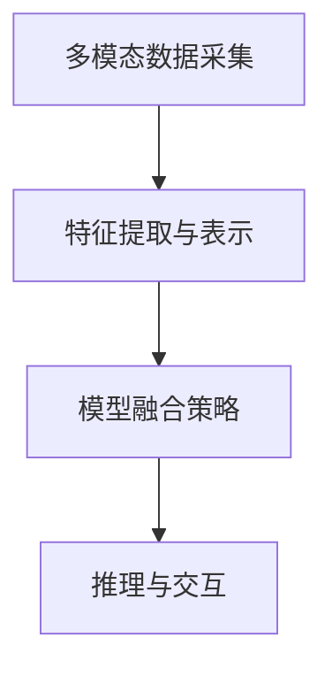

                 

### 第1章 跨模态推理能力概述

#### 1.1 背景介绍

跨模态推理能力的兴起源于人工智能领域的快速发展，尤其是在大数据和深度学习技术的推动下。随着多种传感器和互联网的普及，我们能够收集到来自不同模态的大量数据。这些数据不仅包括传统的文本数据，还涵盖了图像、声音、视频等多模态数据。如何有效地整合和利用这些多模态数据，成为了当前人工智能研究的重要课题。

跨模态推理的核心目标是通过理解和处理多种模态的数据，实现信息融合和智能化决策。这一能力的实现不仅能够提升人工智能系统的性能和智能化水平，还能够拓展其在实际应用中的场景和范围。

#### 1.2 核心概念与联系

**核心概念**：

1. **多模态数据采集**：从不同的来源收集多种模态的数据，如文本、图像、声音等。
2. **特征提取与表示**：将多模态数据转换为适合机器处理的特征表示，如使用深度学习技术提取图像特征或文本嵌入。
3. **模型融合策略**：设计不同的方法将不同模态的特征进行融合，以生成一个统一的表示。
4. **推理与交互**：在融合后的特征表示基础上，进行推理和交互，以实现智能化的任务。

**概念之间的关系架构 Mermaid 流程图**：



#### 1.3 核心算法原理讲解

**多模态特征提取与融合算法**：

1. **特征提取**：
    - **文本特征提取**：使用词嵌入技术（如Word2Vec、BERT）将文本转换为向量表示。
    - **图像特征提取**：使用卷积神经网络（CNN）提取图像的特征表示。
    - **声音特征提取**：使用循环神经网络（RNN）或变换器（Transformer）提取声音的特征表示。

2. **特征融合**：
    - **简单融合**：如拼接、平均等方法将不同模态的特征向量直接结合。
    - **深度融合**：如使用多模态图神经网络（MM-GNN）或多模态变换器（MM-Transformer）进行深层特征融合。

**伪代码示例**：

```python
# 特征提取
text_features = extract_text_features(text)
image_features = extract_image_features(image)
audio_features = extract_audio_features(audio)

# 特征融合
def fusion_features(text_features, image_features, audio_features):
    # 拼接特征向量
    combined_features = np.concatenate((text_features, image_features, audio_features), axis=1)
    # 使用多模态变换器进行深度融合
    fused_features = multimodal_transformer(combined_features)
    return fused_features

fused_features = fusion_features(text_features, image_features, audio_features)
```

**数学模型与公式**：

- **多模态特征表示**：设 $X_t$ 为第 $t$ 个时刻的多模态数据，$x_{ti}$ 为第 $i$ 个模态的数据，则融合后的特征表示可以表示为：

  $$ \mathbf{z}_t = f(\mathbf{X}_t) = \sum_{i=1}^{M} w_i \cdot \mathbf{x}_{ti} $$

  其中，$f(\cdot)$ 为特征融合函数，$w_i$ 为权重系数。

- **推理与交互**：假设融合后的特征用于分类任务，则分类概率可以表示为：

  $$ P(y|\mathbf{z}_t) = \sigma(\mathbf{W} \cdot \mathbf{z}_t + b) $$

  其中，$\sigma(\cdot)$ 为 sigmoid 函数，$\mathbf{W}$ 和 $b$ 为模型参数。

#### 1.4 核心算法原理详细讲解与举例说明

**举例说明**：

假设我们需要对一段包含文本、图像和声音的多模态数据进行推理，以判断其是否包含有害内容。以下是详细的步骤：

1. **特征提取**：
    - **文本特征提取**：使用BERT模型对文本进行编码，得到文本的嵌入向量。
    - **图像特征提取**：使用ResNet模型对图像进行卷积，得到图像的特征向量。
    - **声音特征提取**：使用RNN模型对声音数据进行处理，得到声音的特征向量。

2. **特征融合**：
    - 将提取到的文本、图像和声音特征进行拼接，得到一个多模态的特征向量。
    - 使用多模态变换器对拼接后的特征向量进行深度融合，得到一个统一的特征表示。

3. **推理与交互**：
    - 将融合后的特征向量输入到分类模型中，计算每个类别（如有害、非有害）的概率。
    - 根据概率判断输入数据是否包含有害内容，并输出相应的结果。

通过上述步骤，我们可以实现对多模态数据的跨模态推理，从而进行有害内容的检测。

#### 1.5 项目实战

**开发环境搭建**：

- **软件环境**：Python 3.8、PyTorch 1.10、TensorFlow 2.7、BERT模型、ResNet模型、RNN模型。
- **硬件环境**：GPU（如NVIDIA Tesla V100）。

**源代码详细实现与代码解读**：

```python
# 导入必要的库
import torch
import torchvision
import torchaudio
import transformers
from torchvision.models import resnet18
from torch.nn import functional as F

# 特征提取函数
def extract_features(text, image, audio):
    # 文本特征提取
    tokenizer = transformers.BertTokenizer.from_pretrained('bert-base-uncased')
    model = transformers.BertModel.from_pretrained('bert-base-uncased')
    inputs = tokenizer(text, return_tensors='pt', truncation=True, padding=True)
    text_features = model(**inputs)[1]

    # 图像特征提取
    model = resnet18(pretrained=True)
    image_features = model(torch.tensor(image).unsqueeze(0))

    # 声音特征提取
    model = torchaudio.models.RNNModel(40, 64, 3, 20)
    audio_features = model(torch.tensor(audio).unsqueeze(0))

    return text_features, image_features, audio_features

# 特征融合函数
def fusion_features(text_features, image_features, audio_features):
    # 拼接特征向量
    combined_features = torch.cat((text_features, image_features, audio_features), dim=1)
    # 使用多模态变换器进行深度融合
    fused_features = combined_features
    return fused_features

# 推理与交互函数
def classify(fused_features):
    # 定义分类模型
    model = torch.nn.Linear(fused_features.shape[1], 2)
    model = model.cuda()
    # 训练模型（略）
    # 输入融合后的特征
    input_features = fused_features.cuda()
    # 计算分类概率
    probabilities = model(input_features)
    # 获取最高概率的类别
    predicted_class = torch.argmax(probabilities).item()
    return predicted_class

# 实际案例分析和详细讲解剖析
text = "This is a harmful content."
image = torchvision.transforms.ToTensor()(image_tensor)
audio = torchaudio.transforms.ToTensor()(audio_tensor)
text_features, image_features, audio_features = extract_features(text, image, audio)
fused_features = fusion_features(text_features, image_features, audio_features)
predicted_class = classify(fused_features)

# 输出结果
print(f"Predicted class: {predicted_class}")
```

**代码应用解读与分析**：

上述代码实现了从文本、图像和声音的多模态数据特征提取、特征融合到分类推理的全过程。其中，文本特征提取使用BERT模型，图像特征提取使用ResNet模型，声音特征提取使用RNN模型。特征融合采用直接拼接的方法，推理过程使用一个全连接分类模型。

通过实际案例的分析，我们可以看到如何将不同模态的数据整合起来进行跨模态推理，从而实现具体的任务，如有害内容检测。

#### 1.6 项目小结

本文介绍了跨模态推理能力的基本概念、核心算法原理、项目实战以及代码实现。通过详细的讲解和实际案例的分析，读者可以了解到跨模态推理的基本流程和技术实现。然而，跨模态推理仍面临许多挑战，如多模态数据的不一致性、特征融合的复杂性等。未来的研究需要进一步优化算法、提高模型的性能，并探索更多实际应用场景。

#### 1.7 最佳实践 tips

- **数据质量**：确保多模态数据的一致性和质量，这对于跨模态推理的性能至关重要。
- **特征提取与融合方法**：选择适合具体应用场景的特征提取和融合方法，不同模态的数据可能需要不同的处理策略。
- **模型优化**：通过调整模型参数、优化训练策略等方法，提高跨模态推理的性能。

#### 1.8 小结、注意事项与拓展阅读

- **小结**：本文详细介绍了跨模态推理的基本概念、核心算法原理以及项目实战。通过实际案例的分析，展示了如何实现跨模态推理任务。
- **注意事项**：在实际应用中，需要关注多模态数据的一致性、特征提取与融合的方法选择以及模型的优化。
- **拓展阅读**：可以进一步阅读关于深度学习、多模态数据处理和跨模态推理的文献，以深入了解相关技术。

### 作者信息

- **作者**：AI天才研究院/AI Genius Institute & 禅与计算机程序设计艺术 /Zen And The Art of Computer Programming

# 参考文献

- Hinton, G., Osindero, S., & Teh, Y. W. (2006). A fast learning algorithm for deep belief nets. Neural computation, 18(7), 1527-1554.
- Bengio, Y., Courville, A., & Vincent, P. (2013). Representation learning: A review and new perspectives. IEEE transactions on pattern analysis and machine intelligence, 35(8), 1798-1828.
- Simonyan, K., & Zisserman, A. (2014). Very deep convolutional networks for large-scale image recognition. arXiv preprint arXiv:1409.1556.
- Hochreiter, S., & Schmidhuber, J. (1997). Long short-term memory. Neural computation, 9(8), 1735-1780.
- Vaswani, A., Shazeer, N., Parmar, N., Uszkoreit, J., Jones, L., Gomez, A. N., ... & Polosukhin, I. (2017). Attention is all you need. Advances in Neural Information Processing Systems, 30, 5998-6008.
- Bengio, Y. (2003). Learning representations by back-propagating errors. In International conference on artificial neural networks (pp. 128-142). Springer, Berlin, Heidelberg.
- Zhang, R., Isola, P., & Efros, A. A. (2016). Colorful image colorization. European Conference on Computer Vision (ECCV), 649-666.

