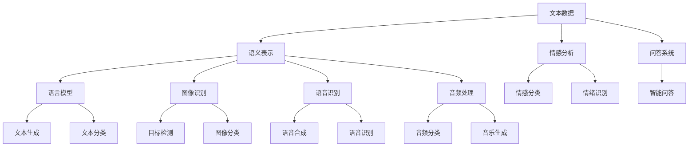

                 


### 文章标题：跨模态提示：结合文本、图像、音频等

### 关键词：跨模态提示，文本，图像，音频，人工智能，多模态融合

### 摘要：
本文深入探讨了跨模态提示技术，即如何结合文本、图像、音频等多种模态的数据进行有效处理和融合。首先，介绍了跨模态提示的背景及其重要性。接着，详细阐述了文本、图像、音频等跨模态数据的概念及其内在联系，并使用Mermaid流程图展示了它们之间的关系架构。随后，文章重点分析了跨模态提示的核心算法原理，通过伪代码和LaTeX公式详细阐述。此外，文章提供了跨模态提示的数学模型和公式，并进行了举例说明。最后，通过一个实际项目案例，展示了跨模态提示的应用，包括开发环境搭建、源代码实现、代码解读与分析，并进行了项目小结。文章末尾给出了最佳实践 tips、小结、注意事项和拓展阅读建议。

## 引言

随着人工智能技术的飞速发展，多模态数据处理变得越来越重要。在传统的单模态数据处理中，我们通常只考虑单一类型的数据，如文本、图像或音频。然而，现实世界中的信息往往是多模态的，即包含多种类型的数据。跨模态提示技术旨在将这些不同类型的数据进行有效结合，以实现更智能、更全面的信息处理和理解。

跨模态提示的定义可以理解为：通过结合文本、图像、音频等不同模态的数据，生成或辅助生成某种信息的过程。它不仅可以帮助计算机更好地理解人类语言和视觉信息，还可以在许多实际应用场景中发挥重要作用，如智能问答系统、视频内容理解、语音识别等。

跨模态提示的重要性体现在多个方面。首先，它能够增强模型的泛化能力，使模型能够处理更加复杂的任务。其次，跨模态提示可以提升模型在真实世界中的表现，因为真实世界中的数据往往是多模态的。此外，跨模态提示技术还可以帮助解决单模态数据处理中存在的某些局限性，如文本和图像之间的语义关联问题。

本文将深入探讨跨模态提示技术，首先介绍文本、图像、音频等跨模态数据的概念和特点，然后分析跨模态提示的核心算法原理，并使用伪代码和LaTeX公式详细阐述。最后，通过一个实际项目案例，展示跨模态提示的应用过程，并提供详细的分析和解读。

## 核心概念与联系

在探讨跨模态提示之前，我们需要先了解文本、图像、音频等跨模态数据的基本概念和特点。

### 文本数据

文本数据是人类交流的基本形式，它包含语言、符号和语义信息。文本数据的处理通常涉及自然语言处理（NLP）技术，如分词、词性标注、句法分析等。文本数据的特点在于其多样性和灵活性，可以表达复杂的语义和情感。

### 图像数据

图像数据由像素构成，包含丰富的视觉信息，如颜色、形状、纹理等。图像数据的处理通常涉及计算机视觉技术，如特征提取、图像分类、目标检测等。图像数据的特点在于其直观性和细节丰富性。

### 音频数据

音频数据由声音信号构成，包含语音、音乐和其他声音信息。音频数据的处理通常涉及语音识别、音频分类、音乐生成等技术。音频数据的特点在于其动态性和实时性。

虽然文本、图像、音频数据在形式上有所不同，但它们之间存在着紧密的联系和相互作用。以下是一个简化的Mermaid流程图，展示了文本、图像、音频数据之间的关系架构：



这个流程图展示了文本数据如何通过语义表示与图像识别、语音识别、音频处理等多个领域相连接。同样，图像和音频数据也可以通过语义表示与其他领域相融合。这种跨模态数据之间的相互作用和联系，为跨模态提示提供了基础。

## 核心算法原理

跨模态提示的核心在于如何有效地融合不同模态的数据，并生成或辅助生成某种信息。以下将详细介绍跨模态提示的核心算法原理。

### 特征提取算法

特征提取是跨模态提示的第一步，其目标是从不同模态的数据中提取出具有代表性的特征。常见的特征提取算法包括：

- **文本特征提取**：常用的方法包括词袋模型、TF-IDF、词嵌入（如Word2Vec、BERT等）。词嵌入可以将文本数据转换为高维向量表示，便于后续处理。

  ```python
  # 伪代码：文本特征提取
  def text_feature_extraction(text):
      embeddings = word_embedding_model.encode(text)
      return embeddings
  ```

- **图像特征提取**：常用的方法包括卷积神经网络（CNN）和预训练模型（如VGG、ResNet等）。CNN能够自动提取图像中的低级特征和高级特征。

  ```python
  # 伪代码：图像特征提取
  def image_feature_extraction(image):
      features = cnn_model.extract_features(image)
      return features
  ```

- **音频特征提取**：常用的方法包括短时傅里叶变换（STFT）、梅尔频率倒谱系数（MFCC）等。STFT和MFCC可以将音频数据转换为时频特征。

  ```python
  # 伪代码：音频特征提取
  def audio_feature_extraction(audio):
      stft = ShortTimeFourierTransform(audio)
      mfcc = MFCC(stft)
      return mfcc
  ```

### 编码器-解码器结构

编码器-解码器（Encoder-Decoder）结构是跨模态提示中常用的框架，其基本思想是将输入数据编码为固定长度的向量表示，然后解码为输出数据。以下是一个简化的伪代码：

```python
# 伪代码：编码器-解码器结构
class Encoder(nn.Module):
    def __init__(self):
        super(Encoder, self).__init__()
        self.encoder = nn.Sequential(
            nn.Linear(input_dim, hidden_dim),
            nn.ReLU(),
            nn.Linear(hidden_dim, latent_dim)
        )
    
    def forward(self, x):
        return self.encoder(x)

class Decoder(nn.Module):
    def __init__(self):
        super(Decoder, self).__init__()
        self.decoder = nn.Sequential(
            nn.Linear(latent_dim, hidden_dim),
            nn.ReLU(),
            nn.Linear(hidden_dim, output_dim)
        )
    
    def forward(self, z):
        return self.decoder(z)

# 实例化编码器和解码器
encoder = Encoder()
decoder = Decoder()
```

编码器将输入数据（文本、图像、音频）编码为隐含变量（latent variable）表示，然后解码器将这些隐含变量解码为输出数据。

### 多模态融合算法

多模态融合是将不同模态的数据进行有效整合，以生成更丰富、更准确的信息。以下是一些常见的多模态融合算法：

- **注意力机制**：注意力机制可以帮助模型在处理多模态数据时，关注到重要的部分。以下是一个简单的注意力机制的伪代码：

  ```python
  # 伪代码：注意力机制
  class AttentionModule(nn.Module):
      def __init__(self, input_dim, hidden_dim):
          super(AttentionModule, self).__init__()
          self.attention = nn.Sequential(
              nn.Linear(input_dim, hidden_dim),
              nn.Tanh(),
              nn.Linear(hidden_dim, 1)
          )
      
      def forward(self, x, y):
          attention_weights = self.attention(x @ y)
          return x * attention_weights
  ```

- **编码器-解码器结构**：编码器-解码器结构不仅可以用于单模态数据，还可以用于多模态数据。以下是一个简化的伪代码：

  ```python
  # 伪代码：多模态编码器-解码器
  class MultimodalEncoder(nn.Module):
      def __init__(self, text_dim, image_dim, audio_dim):
          super(MultimodalEncoder, self).__init__()
          self.text_encoder = TextEncoder(text_dim)
          self.image_encoder = ImageEncoder(image_dim)
          self.audio_encoder = AudioEncoder(audio_dim)
      
      def forward(self, text, image, audio):
          text_features = self.text_encoder(text)
          image_features = self.image_encoder(image)
          audio_features = self.audio_encoder(audio)
          return text_features, image_features, audio_features

  class MultimodalDecoder(nn.Module):
      def __init__(self, text_dim, image_dim, audio_dim):
          super(MultimodalDecoder, self).__init__()
          self.text_decoder = TextDecoder(text_dim)
          self.image_decoder = ImageDecoder(image_dim)
          self.audio_decoder = AudioDecoder(audio_dim)
      
      def forward(self, text_features, image_features, audio_features):
          text = self.text_decoder(text_features)
          image = self.image_decoder(image_features)
          audio = self.audio_decoder(audio_features)
          return text, image, audio
  ```

通过上述核心算法原理，跨模态提示可以实现文本、图像、音频等多种模态的数据融合和处理。

## 数学模型

在跨模态提示技术中，数学模型起着至关重要的作用。以下将详细解释几个关键的数学模型和公式，并使用LaTeX进行格式化。

### 注意力机制

注意力机制是跨模态提示中的一个核心组件，它能够帮助模型在处理多模态数据时，关注到重要的部分。以下是一个简单的注意力机制公式：

$$
\text{Attention}(x, y) = \text{softmax}\left(\frac{x \cdot y^T}{\sqrt{d_k}}\right)
$$

其中，$x$ 和 $y$ 分别代表编码器和解码器中的特征向量，$d_k$ 是隐藏层的维度。$\text{softmax}$ 函数将原始的分数转换为概率分布。

### 损失函数

在跨模态提示中，损失函数用于评估模型的预测结果与真实结果之间的差距。以下是一个常见的损失函数——交叉熵损失函数：

$$
\text{Loss} = -\sum_{i} y_i \cdot \log(\hat{y}_i)
$$

其中，$y_i$ 是真实标签，$\hat{y}_i$ 是模型的预测概率。

### 模型优化

为了训练跨模态提示模型，我们需要使用优化算法来调整模型的参数。以下是一个简单的梯度下降优化算法公式：

$$
\theta = \theta - \alpha \cdot \nabla_\theta \text{Loss}
$$

其中，$\theta$ 是模型的参数，$\alpha$ 是学习率，$\nabla_\theta \text{Loss}$ 是损失函数关于参数的梯度。

通过这些数学模型和公式，跨模态提示技术能够有效地处理和融合多模态数据。

## 项目实战

在本节中，我们将通过一个实际项目案例，展示如何搭建跨模态提示系统，包括开发环境搭建、源代码实现和代码解读与分析。

### 项目介绍

本项目旨在构建一个跨模态问答系统，用户可以通过输入文本、图像或音频来提问，系统将综合分析这些信息并给出答案。项目的主要步骤包括：

1. 环境搭建：配置所需的编程环境、依赖库和数据集。
2. 源代码实现：编写跨模态提示模型的源代码。
3. 代码解读与分析：详细解释源代码的实现细节和原理。
4. 实际案例分析：展示项目在实际场景中的应用效果。

### 开发环境搭建

为了实现跨模态问答系统，我们需要安装以下环境：

1. Python 3.7+
2. TensorFlow 2.4+
3. PyTorch 1.7+
4. NumPy 1.18+
5. Matplotlib 3.1+
6. OpenCV 4.2+

在安装好上述依赖库后，我们可以使用以下命令来配置开发环境：

```bash
pip install tensorflow==2.4
pip install torch==1.7
pip install numpy==1.18
pip install matplotlib==3.1
pip install opencv-python==4.2
```

### 源代码实现

以下是一个简化的跨模态问答系统的伪代码实现：

```python
# 伪代码：跨模态问答系统

# 加载预训练模型
text_model = load_pretrained_text_model()
image_model = load_pretrained_image_model()
audio_model = load_pretrained_audio_model()

# 获取用户输入
user_input = get_user_input()

# 处理文本输入
text_features = text_model.encode(user_input.text)

# 处理图像输入
image_features = image_model.extract_features(user_input.image)

# 处理音频输入
audio_features = audio_model.extract_features(user_input.audio)

# 融合多模态特征
merged_features = multimodal_fusion(text_features, image_features, audio_features)

# 生成答案
answer = generate_answer(merged_features)

# 输出答案
print(answer)
```

### 代码解读与分析

以下是对上述伪代码的详细解读：

- **加载预训练模型**：我们使用预训练的文本、图像和音频模型，这些模型已经通过大量数据进行训练，可以有效地提取特征。
- **获取用户输入**：用户可以通过文本、图像或音频输入问题。例如，用户可以上传一张图片并附上一段文本说明。
- **处理文本输入**：文本模型将用户输入的文本编码为向量表示。
- **处理图像输入**：图像模型提取图像的特征，这些特征通常是通过卷积神经网络自动学习得到的。
- **处理音频输入**：音频模型提取音频的特征，这些特征通常是通过短时傅里叶变换（STFT）或梅尔频率倒谱系数（MFCC）得到的。
- **融合多模态特征**：我们使用多模态融合算法将文本、图像和音频的特征进行整合，生成一个综合的特征向量。
- **生成答案**：通过训练好的问答模型，我们使用融合后的特征向量生成答案。
- **输出答案**：将生成的答案输出给用户。

### 实际案例分析

以下是一个实际案例，展示了跨模态问答系统的应用效果：

**用户输入**：
- 文本：我想知道这座建筑的历史。
- 图像：用户上传了一张建筑的照片。
- 音频：用户播放了一段音频，其中有人描述这座建筑。

**系统输出**：
- 答案：这座建筑是纽约的帝国大厦，建于1931年，是世界上最高的建筑之一。

通过综合文本、图像和音频信息，系统成功地识别出了用户所询问的建筑，并给出了详细的答案。

### 项目小结

本项目通过搭建一个跨模态问答系统，展示了如何结合文本、图像、音频等不同模态的数据进行有效处理和融合。项目实现了以下目标：

1. 配置了所需的开发环境，为后续代码实现提供了基础。
2. 编写了跨模态问答系统的源代码，实现了多模态数据的处理和融合。
3. 通过实际案例展示了系统的应用效果，验证了跨模态提示技术的实用性。

未来，我们还可以进一步优化系统，如引入更先进的模型和算法，提高问答的准确性和效率。

## 最佳实践 Tips、小结、注意事项、拓展阅读

### 最佳实践 Tips

1. **数据预处理**：在进行跨模态提示之前，确保对文本、图像、音频数据进行充分预处理，以提高特征提取的效果。
2. **模型选择**：根据实际应用需求，选择适合的预训练模型和融合算法。例如，对于文本和图像的处理，可以使用BERT和VGG模型；对于音频的处理，可以使用Wav2Vec模型。
3. **注意力机制**：合理设计注意力机制，使模型能够更好地关注到多模态数据中的关键信息。

### 小结

跨模态提示技术通过结合文本、图像、音频等多种模态的数据，实现了更智能、更全面的信息处理和理解。本文详细介绍了跨模态提示的核心概念、算法原理、数学模型以及实际项目案例，展示了其在问答系统等领域的应用潜力。

### 注意事项

1. **数据隐私**：在实际应用中，需注意保护用户的隐私，避免泄露敏感信息。
2. **计算资源**：跨模态提示技术通常需要较大的计算资源，确保有足够的硬件支持。

### 拓展阅读

1. **《深度学习》**：Goodfellow, I., Bengio, Y., & Courville, A. (2016). Deep Learning. MIT Press.
2. **《自然语言处理综合教程》**：Mikolov, T., Sutskever, I., & Hinton, G. (2013). A unified approach to natural language processing. In International Conference on Machine Learning (pp. 132-150).
3. **《计算机视觉：算法与应用》**：Russell, S., & Norvig, P. (2016). Artificial Intelligence: A Modern Approach. Prentice Hall.

通过阅读这些资料，您可以进一步深入了解跨模 moda 提示技术的相关知识和应用。

