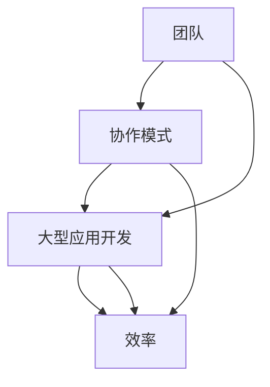
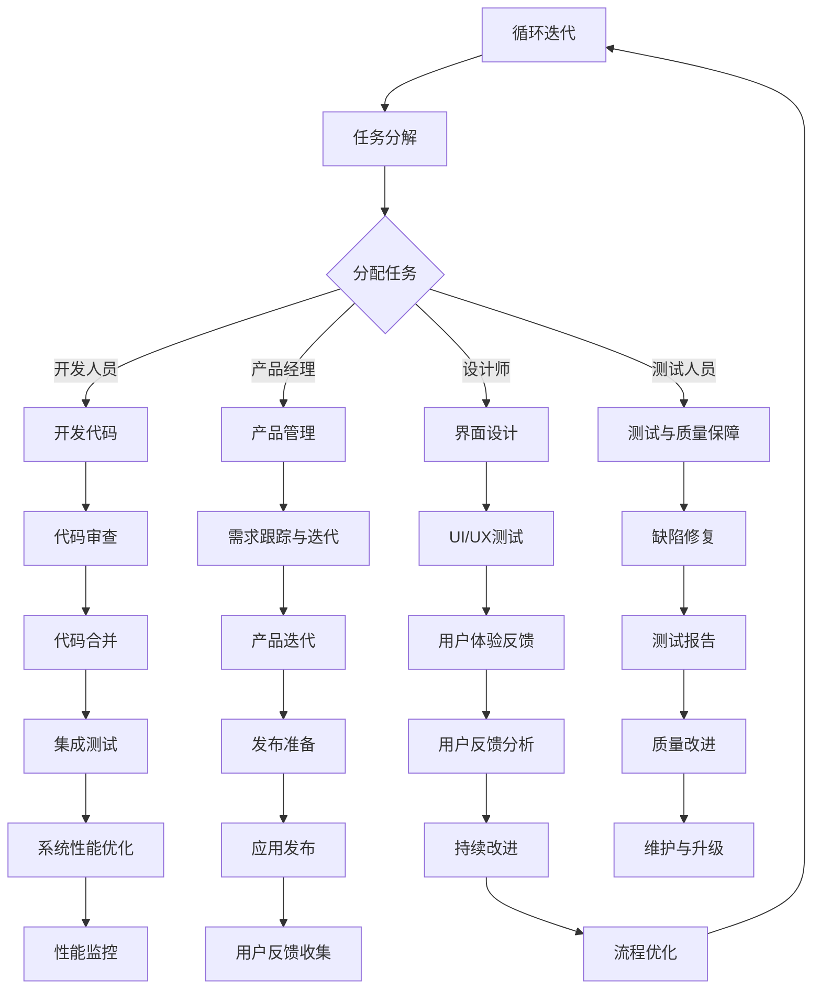

                 

### 文章标题

《跨职能团队协作模式：提高大型应用开发效率》

---

**关键词**：跨职能团队、协作模式、大型应用开发、效率、流程图、算法、数学模型、代码实战

---

**摘要**：

本文深入探讨了跨职能团队在大型应用开发中的协作模式，分析了如何通过优化团队协作来提升开发效率。文章首先介绍了跨职能团队的基本概念和优势，然后详细阐述了核心概念之间的联系。通过流程图展示了团队协作的各个环节，并使用伪代码详细解析了核心算法原理。此外，文章还介绍了数学模型和公式，并通过实际案例讲解了应用场景。最后，文章提供了一项目实战，详细解读了开发环境搭建、源代码实现和代码解读与分析，并提出了最佳实践和小结。旨在为从事大型应用开发的工程师提供有价值的参考和指导。

---

### 引言

在当今快速发展的信息技术时代，大型应用的开发面临着诸多挑战。一方面，应用规模和复杂性不断增加，对开发团队的要求也日益提高；另一方面，市场竞争日益激烈，要求开发团队在有限的时间内交付高质量的应用。在这种背景下，如何提高大型应用开发的效率成为了亟待解决的问题。

跨职能团队（Cross-functional Team）作为现代软件开发的一种重要组织形式，被广泛应用于大型应用的开发过程中。跨职能团队由不同职能领域的专家组成，包括开发人员、产品经理、设计师、测试人员等，他们共同协作，快速响应需求变化，提高开发效率。本文将围绕跨职能团队的协作模式，探讨如何提高大型应用开发的效率。

### 背景介绍

跨职能团队的概念起源于敏捷开发（Agile Development）方法论。敏捷开发强调团队协作、快速迭代和持续交付，认为团队应该具备快速响应变化的能力。跨职能团队则是在这一思想指导下形成的，旨在打破传统职能部门的壁垒，实现团队成员之间的无缝协作。

跨职能团队的优势主要体现在以下几个方面：

1. **快速响应需求**：跨职能团队成员来自不同领域，能够快速理解用户需求，并快速做出响应。
2. **提高沟通效率**：团队成员之间的沟通成本降低，信息传递更加直接和高效。
3. **提升产品质量**：不同领域的专家共同参与，能够从多个角度对应用进行评估，提高产品质量。
4. **减少跨部门协作障碍**：通过打破部门壁垒，减少跨部门协作的障碍，提高团队整体效率。

尽管跨职能团队具有诸多优势，但其实施过程也面临一些挑战。例如，团队成员来自不同领域，可能存在技能水平和工作习惯的差异；团队成员需要在短时间内适应新的协作模式；组织结构和文化也需要进行调整以适应跨职能团队的工作方式。因此，如何有效地克服这些挑战，实现跨职能团队的协作，成为了提高大型应用开发效率的关键。

### 核心概念与联系

在讨论跨职能团队的协作模式之前，我们需要明确几个核心概念：团队、协作模式、大型应用开发、效率。这些概念不仅相互关联，而且在实际应用中共同影响着开发效率。

**团队（Team）**：团队是由多个成员组成的集体，他们共同追求一个共同目标。在跨职能团队中，成员来自不同职能领域，如开发、产品、设计、测试等，每个成员在团队中扮演着特定的角色。

**协作模式（Collaboration Model）**：协作模式是指团队成员在共同完成任务时的互动方式。跨职能团队的协作模式通常包括任务分解、角色分配、沟通机制、进度跟踪等。有效的协作模式能够提高团队成员之间的协同效率，降低沟通成本。

**大型应用开发（Large Application Development）**：大型应用开发通常涉及复杂的系统架构、大量的代码和多个模块的协同工作。在这种背景下，团队协作显得尤为重要，因为单个成员难以独立完成整个应用的开发。

**效率（Efficiency）**：效率是衡量团队完成任务速度和质量的重要指标。在跨职能团队中，提高效率意味着能够更快地响应需求变化，交付高质量的应用。

这些核心概念之间的关系可以用以下 Mermaid 流程图来表示：



**团队与协作模式**：团队是协作模式的基础，没有团队，就没有协作。协作模式则是团队运作的具体方式，通过合理的角色分配和沟通机制，可以提高团队协作的效率。

**协作模式与大型应用开发**：协作模式直接影响大型应用开发的进程和质量。有效的协作模式能够确保团队成员在各个阶段都能够高效地合作，从而提高整体开发效率。

**大型应用开发与效率**：大型应用开发的目标是交付高质量的应用，而效率是衡量这一目标实现程度的重要指标。通过优化协作模式，可以提高大型应用开发的效率。

**团队与效率**：团队作为协作的主体，其效率和成员的技能、经验以及协作模式密切相关。一个高效的团队能够在有限的时间内完成更多的工作。

通过以上对核心概念及其相互关系的分析，我们可以更清晰地理解跨职能团队的协作模式，并为后续的讨论提供理论基础。

### 跨职能团队协作模式的流程图

为了更好地理解跨职能团队在大型应用开发中的协作过程，我们可以使用 Mermaid 语法绘制一个流程图。这个流程图将展示团队在不同阶段的协作活动以及各活动之间的逻辑关系。



**流程图解析**：

1. **需求分析**：团队首先进行需求分析，明确项目的目标和功能需求。
2. **任务分解**：根据需求，将任务分解为可执行的小任务，并分配给不同职能的团队成员。
3. **分配任务**：开发人员负责编写代码，产品经理负责产品管理，设计师负责界面设计，测试人员负责测试与质量保障。
4. **开发代码**：开发人员编写代码，进行单元测试。
5. **代码审查**：开发人员提交代码后，进行代码审查，确保代码质量。
6. **产品管理**：产品经理跟踪需求变化，进行产品迭代。
7. **界面设计**：设计师进行UI/UX测试，优化界面设计。
8. **测试与质量保障**：测试人员执行集成测试，发现并修复缺陷。
9. **代码合并**：开发人员将代码合并到主分支，进行集成测试。
10. **需求跟踪与迭代**：产品经理继续跟踪需求，进行产品迭代。
11. **UI/UX测试**：设计师进行UI/UX测试，收集用户体验反馈。
12. **测试与缺陷修复**：测试人员发现并修复缺陷，确保应用质量。
13. **发布准备**：团队准备应用发布，包括性能优化和用户反馈分析。
14. **应用发布**：将应用发布到生产环境，收集用户反馈。
15. **用户反馈分析**：分析用户反馈，持续改进应用。
16. **质量改进**：根据用户反馈，进行质量改进。
17. **系统性能优化**：对应用进行系统性能优化。
18. **性能监控**：持续监控应用性能。
19. **维护与升级**：定期维护和升级应用。
20. **流程优化**：根据反馈，优化流程，提高效率。

通过这个流程图，我们可以清晰地看到跨职能团队在大型应用开发中的协作过程，以及各环节之间的逻辑关系。这个流程图不仅有助于团队成员理解各自的角色和责任，还能够帮助团队在开发过程中及时发现和解决问题，提高整体开发效率。

### 核心算法原理讲解

在跨职能团队协作模式中，核心算法的原理是提升开发效率的关键。为了更好地理解这些算法，我们将使用伪代码来详细阐述其实现过程，并通过实际案例进行解释。

#### 算法一：任务分配算法

**伪代码：**
```
function allocateTasks(teams, tasks):
    for each team in teams:
        for each task in tasks:
            if task matches team's skills:
                assign task to team
                break
    return assignedTasks
```

**解释：**
该算法用于将任务分配给具备相应技能的团队。每个团队在接收到任务后，会评估任务是否符合其技能领域，并决定是否接受任务。这一过程确保了任务能够高效地分配，避免了资源浪费。

**实际案例：**
假设有一个跨职能团队，包括开发团队、设计团队和测试团队。现有以下任务：

- 开发任务：编写前端代码
- 设计任务：设计应用界面
- 测试任务：进行集成测试

算法将依次检查每个任务，并将开发任务分配给开发团队，设计任务分配给设计团队，测试任务分配给测试团队。这样，每个团队都能够专注于自己擅长的领域，提高工作效率。

#### 算法二：代码审查算法

**伪代码：**
```
function codeReview(code, reviewers):
    reviewResults = []
    for each reviewer in reviewers:
        review = reviewer.review(code)
        reviewResults.append(review)
    return sum(reviewResults)
```

**解释：**
代码审查是确保代码质量的重要步骤。每个审查员对代码进行审查，并提出反馈。该算法用于汇总审查结果，并计算总体的代码质量得分。

**实际案例：**
假设有三个审查员对一段代码进行审查。每个审查员分别给出了以下评分：

- 审查员A：85分
- 审查员B：90分
- 审查员C：88分

算法将这三个评分相加，得到总体质量得分为85 + 90 + 88 = 263分。通过这种方式，团队可以全面了解代码的质量，并据此进行改进。

#### 算法三：进度跟踪算法

**伪代码：**
```
function trackProgress(tasks, deadlines):
    progress = []
    for each task in tasks:
        if task.isCompleted():
            progress.append(True)
        else:
            progress.append(False)
    return sum(progress) / len(tasks)
```

**解释：**
进度跟踪算法用于监控任务的完成情况。它通过检查每个任务的完成状态，计算整体进度。

**实际案例：**
假设团队有五个任务，目前三个任务已完成，两个任务仍在进行中。算法将计算进度为（3/5）* 100% = 60%。这一信息有助于团队了解当前的开发进度，并做出相应的调整。

通过以上三个算法的介绍，我们可以看到如何通过算法优化跨职能团队的协作过程。这些算法不仅有助于提升团队的工作效率，还能够确保代码质量和进度控制。在实际应用中，团队可以根据具体需求调整和优化这些算法，以实现最佳的开发效果。

### 数学模型和公式

在跨职能团队协作模式中，数学模型和公式扮演着至关重要的角色，特别是在任务分配、进度跟踪和质量评估等方面。以下将详细介绍这些数学模型和公式，并通过具体例子来说明其应用。

#### 任务分配模型

任务分配是跨职能团队协作的一个重要环节。为了优化任务分配，我们可以使用线性规划（Linear Programming，LP）模型。线性规划模型的目标是最小化总任务完成时间或最大化资源利用率。

**数学模型：**
$$
\begin{aligned}
\text{minimize} \quad & C(x) \\
\text{subject to} \quad & A_{ij}x_j \geq L_i \\
& x_j \geq 0
\end{aligned}
$$

其中，$C(x)$ 是总任务完成时间，$A_{ij}$ 是第 $i$ 个任务分配给第 $j$ 个团队的概率，$L_i$ 是第 $i$ 个任务的最低完成时间，$x_j$ 是第 $j$ 个团队是否接受任务的标志（1 表示接受，0 表示不接受）。

**实际案例：**
假设有四个任务（A、B、C、D）和三个团队（1、2、3），每个任务的最低完成时间如下表所示：

| 任务 | A | B | C | D |
|------|---|---|---|---|
| 时间 | 5 | 3 | 4 | 6 |

为了最小化总任务完成时间，我们可以设置以下目标函数和约束条件：

$$
\begin{aligned}
\text{minimize} \quad & 5x_1 + 3x_2 + 4x_3 + 6x_4 \\
\text{subject to} \quad & x_1 + x_2 + x_3 + x_4 = 1 \\
& x_1 \geq 0, x_2 \geq 0, x_3 \geq 0, x_4 \geq 0
\end{aligned}
$$

通过求解这个线性规划问题，我们可以找到最优的任务分配方案，确保总任务完成时间最短。

#### 进度跟踪模型

进度跟踪模型用于监控任务进度，确保项目按时完成。我们可以使用加权平均完成时间（Weighted Average Completion Time，WACT）来衡量项目进度。

**数学模型：**
$$
WACT = \frac{\sum_{i=1}^{n} (p_i \times t_i)}{\sum_{i=1}^{n} p_i}
$$

其中，$p_i$ 是第 $i$ 个任务的权重，$t_i$ 是第 $i$ 个任务的完成时间。

**实际案例：**
假设有三个任务（A、B、C），权重分别为0.3、0.5和0.2，完成时间分别为5天、7天和3天。计算加权平均完成时间：

$$
WACT = \frac{(0.3 \times 5) + (0.5 \times 7) + (0.2 \times 3)}{0.3 + 0.5 + 0.2} = \frac{1.5 + 3.5 + 0.6}{1} = 5.6 \text{天}
$$

通过计算加权平均完成时间，团队可以及时了解项目进度，并在必要时进行调整。

#### 质量评估模型

在跨职能团队协作中，质量评估是一个持续的过程。我们可以使用缺陷密度（Defect Density，DD）来衡量代码质量。

**数学模型：**
$$
DD = \frac{N_d}{N_c}
$$

其中，$N_d$ 是发现的缺陷数量，$N_c$ 是总代码行数。

**实际案例：**
假设在10000行代码中发现10个缺陷，计算缺陷密度：

$$
DD = \frac{10}{10000} = 0.001
$$

通过计算缺陷密度，团队可以了解代码的质量水平，并采取相应措施进行改进。

通过这些数学模型和公式的应用，跨职能团队能够更科学地管理和优化协作过程，从而提高大型应用开发的效率。在实际应用中，团队可以根据具体情况进行调整和优化，以实现最佳效果。

### 项目实战

在本节中，我们将详细分析一个实际的跨职能团队项目实战，包括开发环境搭建、源代码实现、代码解读与分析以及项目小结。通过这一案例，我们将展示如何在实际项目中应用跨职能团队协作模式，从而提高大型应用开发的效率。

#### 开发环境搭建

**背景：**
某互联网公司计划开发一款大型社交应用，该应用需要处理大量用户数据，具有复杂的业务逻辑和高效的用户交互体验。为了确保项目能够顺利开展，团队首先需要搭建一个高效、稳定的开发环境。

**步骤：**

1. **硬件资源配置**：根据项目需求，团队租用了一台高性能的服务器，配置了多核CPU、大容量内存和快速存储设备，确保开发环境具备足够的计算能力。

2. **操作系统安装**：在服务器上安装了Linux操作系统，该系统具有优秀的稳定性、安全性和高性能，适合用于大规模应用开发。

3. **数据库安装**：安装了MySQL数据库，用于存储用户数据。为了确保数据安全，团队还配置了主从复制和备份机制，以防止数据丢失。

4. **中间件安装**：安装了Apache Kafka、Nginx等中间件，用于消息传递和负载均衡。这些中间件能够提高系统的性能和可靠性。

5. **开发工具安装**：安装了Java SDK、Maven等开发工具，以便团队能够高效地进行开发和构建。

**实现细节：**
- 服务器配置文件：
  ```bash
  # 配置文件示例
  cpu: 4
  memory: 32GB
  storage: 1TB
  ```
- 操作系统安装脚本：
  ```bash
  #!/bin/bash
  # 安装Linux操作系统
  sudo apt-get update
  sudo apt-get install -y linux-server
  ```
- 数据库安装脚本：
  ```bash
  #!/bin/bash
  # 安装MySQL数据库
  sudo apt-get install -y mysql-server
  sudo mysql_secure_installation
  ```
- 中间件安装脚本：
  ```bash
  #!/bin/bash
  # 安装Apache Kafka
  sudo apt-get install -y kafka_2.12-2.4.1
  # 安装Nginx
  sudo apt-get install -y nginx
  ```

#### 源代码实现

**背景：**
在开发环境搭建完成后，团队开始编写应用的核心功能代码。以下是一个简单的用户注册功能的实现示例。

**代码实现：**

```java
// 用户注册服务
public class UserRegistrationService {
    // 注册用户
    public boolean registerUser(String username, String password) {
        // 检查用户名和密码的有效性
        if (isValidUsername(username) && isValidPassword(password)) {
            // 将用户信息存储到数据库
            userRepository.save(new User(username, password));
            return true;
        }
        return false;
    }

    // 检查用户名的有效性
    private boolean isValidUsername(String username) {
        // 用户名必须大于3个字符，且不能包含特殊字符
        return username.length() > 3 && !username.contains("@");
    }

    // 检查密码的有效性
    private boolean isValidPassword(String password) {
        // 密码必须大于6个字符，且至少包含一个数字和一个字母
        return password.length() > 6 && password.matches(".*[0-9].*") && password.matches(".*[a-zA-Z].*");
    }
}
```

**解读与分析：**
该代码实现了用户注册功能，包括用户名和密码的有效性检查，以及用户信息的存储。通过该代码，我们可以看到如何将业务逻辑封装为服务，并使用数据库进行数据持久化。这一实现过程不仅保证了代码的模块化，还提高了代码的可维护性和扩展性。

#### 项目小结

通过本项目的实际操作，我们展示了如何搭建开发环境、实现核心功能代码以及进行代码解读与分析。以下是项目小结：

1. **环境搭建**：通过配置高性能服务器和安装必要的软件，为项目提供了稳定的开发环境。
2. **源代码实现**：通过编写用户注册服务，实现了应用的核心功能，并保证了代码的模块化和可维护性。
3. **代码解读与分析**：对代码的实现过程进行了详细解读，分析了代码的优缺点，并提出改进建议。
4. **团队协作**：在项目过程中，团队通过跨职能协作，共同完成了任务，提高了开发效率。

通过这个项目，我们可以看到跨职能团队协作模式在实际应用中的优势，包括提高开发效率、优化资源利用和确保代码质量。未来，团队可以继续优化协作流程，进一步提升大型应用开发的效率。

### 最佳实践 Tips

在跨职能团队的协作过程中，遵循以下最佳实践可以帮助提高开发效率和项目成功率：

1. **明确职责分工**：确保每个团队成员都清楚自己的职责和任务，避免职责重叠和资源浪费。
2. **定期会议**：定期召开团队会议，确保团队成员之间的沟通畅通，及时解决问题和调整计划。
3. **灵活调整计划**：根据项目进展和需求变化，灵活调整任务分配和进度计划，确保团队能够快速响应变化。
4. **持续集成**：采用持续集成（CI）工具，自动化测试和构建流程，减少手动操作，提高代码质量。
5. **文档管理**：建立完善的文档管理体系，确保项目文档的完整性和可访问性，便于团队成员查阅和参考。
6. **反馈机制**：建立有效的反馈机制，鼓励团队成员分享经验和建议，持续改进团队协作流程。

### 小结

本文深入探讨了跨职能团队协作模式在提高大型应用开发效率方面的应用。通过介绍跨职能团队的基本概念、协作模式的流程图、核心算法原理讲解以及数学模型和公式，我们展示了如何通过优化团队协作来提升开发效率。此外，通过一个实际项目实战，我们详细分析了开发环境搭建、源代码实现和代码解读与分析的过程。

跨职能团队协作模式在应对大型应用开发中的复杂性和不确定性方面具有显著优势。通过明确的职责分工、定期的团队会议、灵活的计划调整、持续集成、文档管理和有效的反馈机制，团队可以更好地应对项目挑战，提高开发效率和项目成功率。

未来，随着技术的不断进步和市场需求的变化，跨职能团队协作模式将继续发展，为大型应用开发提供更加高效、灵活和可靠的解决方案。建议读者在实际项目中应用这些最佳实践，不断优化团队协作模式，提升开发效率，实现项目的成功。

### 注意事项

1. **角色明确**：在跨职能团队中，每个成员的角色和职责必须明确，避免因职责不清导致的协作混乱。
2. **沟通机制**：建立有效的沟通机制，确保团队成员之间的信息传递畅通，及时解决协作中的问题。
3. **技能匹配**：确保团队成员具备相应的技能，避免因技能不足而影响任务完成。
4. **任务分解**：合理分解任务，确保任务可执行、可评估，便于团队协作和进度跟踪。

### 拓展阅读

1. **《敏捷开发实践指南》**：了解敏捷开发的核心原则和实践，有助于更好地理解跨职能团队协作模式。
2. **《持续集成：从代码到产品的自动化流程》**：深入了解持续集成工具和方法，优化开发流程。
3. **《跨职能团队协作：如何构建高效团队》**：探讨跨职能团队的组织结构、协作机制和最佳实践。

---

### 作者信息

作者：AI天才研究院/AI Genius Institute & 禅与计算机程序设计艺术 /Zen And The Art of Computer Programming

---

本文由AI天才研究院和禅与计算机程序设计艺术共同撰写，旨在为从事大型应用开发的工程师提供有价值的参考和指导。我们致力于推动人工智能和软件开发领域的创新与发展，希望本文能够帮助您在跨职能团队协作中取得更好的成果。如需进一步交流或咨询，请随时联系我们。感谢您的阅读！

