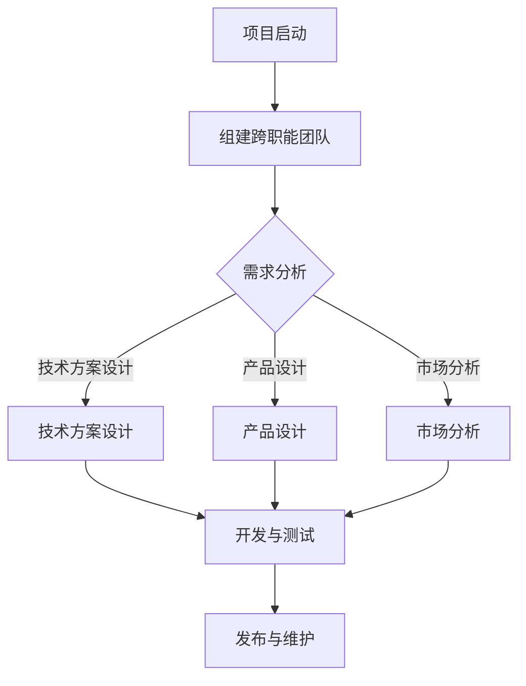
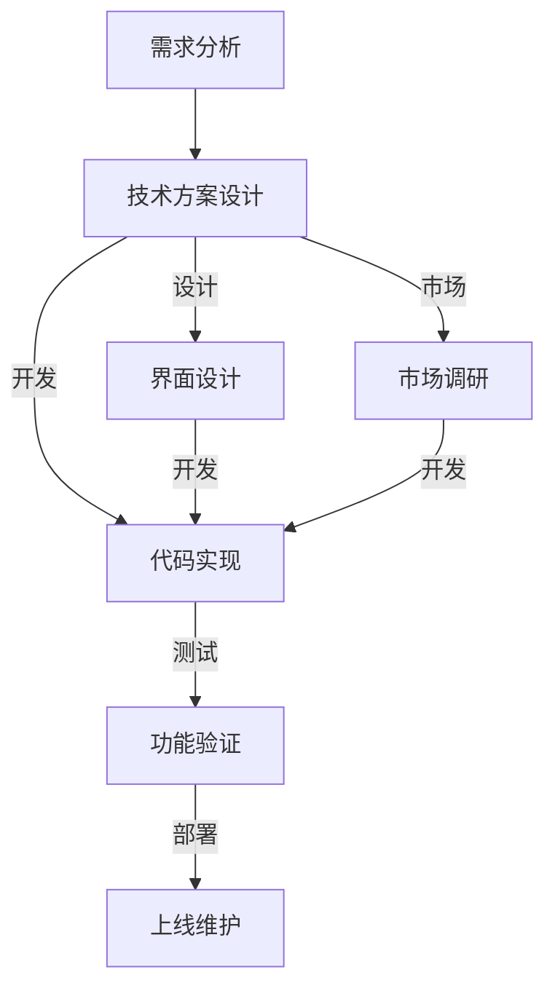
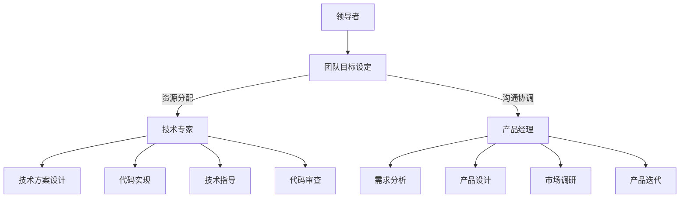
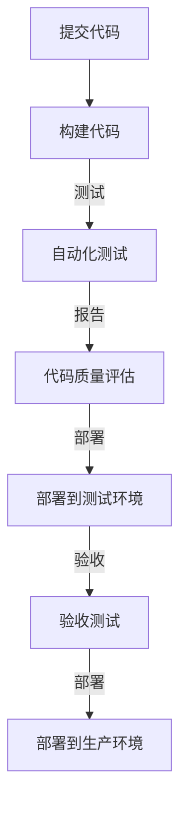

                 

## 引言

在现代软件工程中，大型应用的开发流程越来越复杂。随着项目规模的扩大和需求的不断增加，传统的单一职能团队模式逐渐暴露出其局限性，如沟通成本高、协作效率低、问题解决能力不足等。因此，跨职能团队作为一种新兴的团队组织形式，逐渐受到业界的关注和应用。

### 核心概念与联系

跨职能团队（Cross-functional Team）是指由来自不同职能领域的人员组成的团队，他们共同协作，以实现一个共同的目标。这种团队组织形式的核心在于打破传统职能壁垒，实现团队成员在技术、产品、设计、市场等方面的跨界合作。

### Mermaid 流程图

以下是一个简单的Mermaid流程图，展示了跨职能团队的工作流程：



通过这个流程图，我们可以清晰地看到跨职能团队在项目开发过程中的协同作用。

### 核心算法原理讲解

在跨职能团队中，各个角色的协作需要遵循一定的算法原理。以下是一个简单的协作算法伪代码：

```plaintext
协作算法：
1. 需求分析阶段，各职能人员分别提交需求文档；
2. 技术方案设计阶段，技术专家根据需求文档设计技术方案；
3. 产品设计阶段，设计师根据技术方案设计产品原型；
4. 市场分析阶段，市场人员提供市场数据支持；
5. 开发与测试阶段，各职能人员共同参与，确保项目进度和质量；
6. 发布与维护阶段，各职能人员协同工作，确保产品稳定运行。
```

### 数学模型和公式

在跨职能团队中，我们可以使用以下数学模型来评估团队的工作效率：

```latex
效率 = \frac{完成的工作量}{投入的人力资源 \times 工作时间}
```

### 举例说明

假设一个跨职能团队由5名开发人员、2名设计师和1名市场人员组成，他们在一个月内完成了10个功能模块的开发。根据上述公式，我们可以计算出该团队的工作效率：

```plaintext
效率 = \frac{10个功能模块}{(5 + 2 + 1)人 \times 30天} ≈ 0.19
```

### 项目实战

在一个实际项目中，我们如何搭建跨职能团队并优化开发流程呢？

1. **开发环境搭建**：首先，我们需要搭建一个统一的开发生态系统，包括版本控制系统、自动化测试工具、持续集成平台等。
2. **源代码详细实现和代码解读**：每个功能模块的开发都由相应的职能人员负责，例如，技术专家负责核心算法实现，设计师负责界面设计。
3. **代码应用解读与分析**：在代码提交后，团队成员需要共同进行代码审查，确保代码质量。
4. **实际案例分析和详细讲解剖析**：通过实际案例，我们可以看到跨职能团队在项目开发中的协同作用和效率提升。
5. **项目小结**：在项目完成后，团队需要总结经验教训，为下一个项目提供参考。

### 最佳实践 tips

1. **明确团队目标**：确保所有团队成员都清楚项目目标和各自的职责。
2. **建立沟通机制**：定期举行团队会议，确保信息畅通。
3. **优化流程**：根据项目反馈，不断优化开发流程，提高团队效率。

通过以上步骤，我们可以有效地搭建跨职能团队，并优化大型应用开发流程。在接下来的章节中，我们将进一步探讨跨职能团队的角色定义和具体实践方法。

## 跨职能团队的概念与优势

### 背景介绍

跨职能团队（Cross-functional Team）的概念起源于20世纪60年代的制造业，旨在通过多职能部门的协作来提高生产效率和产品质量。随着信息技术的发展，跨职能团队逐渐应用于软件开发领域，成为优化大型应用开发流程的重要组织形式。

### 核心概念与联系

跨职能团队的核心在于其多元化的人员组成，团队成员来自不同的职能领域，如开发、设计、测试、市场等。这种多元化的组成使得团队能够从多个角度出发，全面考虑项目的各个方面。

### Mermaid 流程图

以下是一个简单的Mermaid流程图，展示了跨职能团队的核心概念：



通过这个流程图，我们可以清晰地看到跨职能团队在项目开发过程中的协同作用。

### 核心算法原理讲解

在跨职能团队中，各个角色的协作需要遵循一定的算法原理。以下是一个简单的协作算法伪代码：

```plaintext
协作算法：
1. 需求分析阶段，各职能人员分别提交需求文档；
2. 技术方案设计阶段，技术专家根据需求文档设计技术方案；
3. 界面设计阶段，设计师根据技术方案设计产品原型；
4. 市场调研阶段，市场人员提供市场数据支持；
5. 开发与测试阶段，各职能人员共同参与，确保项目进度和质量；
6. 上线维护阶段，各职能人员协同工作，确保产品稳定运行。
```

### 数学模型和公式

在跨职能团队中，我们可以使用以下数学模型来评估团队的工作效率：

```latex
效率 = \frac{完成的工作量}{投入的人力资源 \times 工作时间}
```

### 举例说明

假设一个跨职能团队由5名开发人员、2名设计师和1名市场人员组成，他们在一个月内完成了10个功能模块的开发。根据上述公式，我们可以计算出该团队的工作效率：

```plaintext
效率 = \frac{10个功能模块}{(5 + 2 + 1)人 \times 30天} ≈ 0.19
```

### 项目实战

在一个实际项目中，如何组建和管理跨职能团队呢？

1. **开发环境搭建**：首先，我们需要搭建一个统一的开发生态系统，包括版本控制系统、自动化测试工具、持续集成平台等。
2. **源代码详细实现和代码解读**：每个功能模块的开发都由相应的职能人员负责，例如，技术专家负责核心算法实现，设计师负责界面设计。
3. **代码应用解读与分析**：在代码提交后，团队成员需要共同进行代码审查，确保代码质量。
4. **实际案例分析和详细讲解剖析**：通过实际案例，我们可以看到跨职能团队在项目开发中的协同作用和效率提升。
5. **项目小结**：在项目完成后，团队需要总结经验教训，为下一个项目提供参考。

### 最佳实践 tips

1. **明确团队目标**：确保所有团队成员都清楚项目目标和各自的职责。
2. **建立沟通机制**：定期举行团队会议，确保信息畅通。
3. **优化流程**：根据项目反馈，不断优化开发流程，提高团队效率。

通过以上步骤，我们可以有效地组建和管理跨职能团队，并在大型应用开发中发挥其优势。在接下来的章节中，我们将进一步探讨跨职能团队的角色定义和具体实践方法。

## 跨职能团队的角色定义

### 领导者角色

领导者是跨职能团队的核心，负责整个团队的战略规划和目标实现。领导者的职责包括：

1. **团队目标设定**：明确团队的目标和愿景，确保所有团队成员都理解并致力于实现这些目标。
2. **资源分配**：合理分配团队资源和任务，确保每个成员都能充分发挥其能力。
3. **决策制定**：在团队遇到问题时，及时做出决策，引导团队找到解决问题的最佳途径。
4. **沟通协调**：确保团队成员之间的信息畅通，避免沟通障碍。

### 技术专家角色

技术专家是团队中的技术核心，负责技术方案的设计和实现。技术专家的职责包括：

1. **技术方案设计**：根据需求分析，设计合适的技术方案，确保项目的技术可行性。
2. **代码实现**：编写高质量的代码，实现技术方案。
3. **技术指导**：为团队成员提供技术支持和培训，提升团队整体技术水平。
4. **代码审查**：审查其他成员的代码，确保代码质量。

### 产品经理角色

产品经理是团队中的产品负责人，负责产品的设计和市场定位。产品经理的职责包括：

1. **需求分析**：与客户和利益相关者沟通，明确产品的需求和功能。
2. **产品设计**：根据需求分析，设计产品原型和界面。
3. **市场调研**：收集市场数据，分析竞争对手，为产品定位提供支持。
4. **产品迭代**：根据用户反馈，持续优化产品，提升用户体验。

### 跨职能团队角色协同

跨职能团队的协同作用在于各角色之间的密切合作，共同推进项目进展。以下是一个简化的协同流程：



通过这个协同流程，我们可以看到领导者、技术专家和产品经理在项目开发中的角色定位和职责分工。

### 数学模型和公式

在跨职能团队中，我们可以使用以下数学模型来评估各角色的贡献：

```latex
贡献 = \frac{完成的工作量}{投入的时间}
```

### 举例说明

假设在一个项目中，领导者完成了50%的任务，技术专家完成了30%的任务，产品经理完成了20%的任务。根据上述公式，我们可以计算出各角色的贡献比：

```plaintext
领导者贡献 = \frac{50%}{100%} = 0.5
技术专家贡献 = \frac{30%}{100%} = 0.3
产品经理贡献 = \frac{20%}{100%} = 0.2
```

### 项目实战

在一个实际项目中，跨职能团队如何协作，以达到最佳效果呢？

1. **明确角色职责**：每个团队成员都清楚自己的职责和目标。
2. **定期沟通**：定期举行会议，讨论项目进展和遇到的问题。
3. **协作工具使用**：利用协作工具（如Trello、Slack等），实时跟踪项目进展。
4. **代码审查与反馈**：技术专家和产品经理共同参与代码审查，确保代码质量。
5. **用户反馈收集**：产品经理负责收集用户反馈，为产品迭代提供依据。

### 最佳实践 tips

1. **明确目标**：确保所有团队成员都明确项目的目标和各自的职责。
2. **有效沟通**：建立高效的沟通机制，避免信息孤岛。
3. **资源合理分配**：根据项目需求和成员能力，合理分配资源和任务。
4. **持续迭代**：根据项目反馈，持续优化团队协作流程。

通过以上步骤，我们可以有效地定义和管理跨职能团队的角色，并在大型应用开发中发挥其协同效应。在接下来的章节中，我们将进一步探讨如何优化大型应用开发流程。

## 大型应用开发流程

### 应用开发流程概述

大型应用开发流程通常包括以下几个关键阶段：

1. **需求分析**：明确项目目标和用户需求，为后续开发提供基础。
2. **技术方案设计**：根据需求分析，设计合适的技术方案，确保项目的技术可行性。
3. **编码实现**：根据技术方案，编写代码，实现产品的功能。
4. **测试与调试**：对代码进行功能测试、性能测试和安全性测试，确保产品质量。
5. **部署上线**：将产品部署到生产环境，供用户使用。
6. **维护与优化**：持续监控产品运行状态，根据用户反馈和需求变化，进行优化和更新。

### 敏捷开发方法

敏捷开发（Agile Development）是一种以用户为中心、迭代和增量的软件开发方法，其核心理念包括：

1. **用户故事**：通过用户故事（User Story）来明确用户需求，确保开发工作始终以用户价值为导向。
2. **迭代开发**：将项目分为多个短周期（迭代），每个迭代结束后进行回顾，以不断改进开发流程。
3. **持续交付**：通过持续集成和持续交付（CI/CD），实现快速迭代和高质量交付。

### 持续集成与持续部署

持续集成（Continuous Integration，CI）和持续部署（Continuous Deployment，CD）是敏捷开发中的重要实践方法。

1. **持续集成**：通过自动化工具，将代码集成到代码库中，进行自动化测试，确保代码质量。
2. **持续部署**：通过自动化工具，将经过测试的代码部署到生产环境，实现快速交付。

以下是一个简化的CI/CD流程：



通过这个流程，我们可以实现快速、高效的代码集成和部署，提高开发效率。

### 数学模型和公式

在大型应用开发流程中，我们可以使用以下数学模型来评估开发效率：

```latex
效率 = \frac{完成的功能点数}{投入的人力资源 \times 开发周期}
```

### 举例说明

假设一个开发团队在一个月内完成了20个功能点的开发，团队共有5名成员。根据上述公式，我们可以计算出该团队的开发效率：

```plaintext
效率 = \frac{20个功能点}{5人 \times 30天} ≈ 0.27功能点/人/天
```

### 项目实战

在一个实际项目中，如何实施敏捷开发方法并优化开发流程呢？

1. **明确用户需求**：通过用户故事会议，明确用户需求，确保开发工作始终以用户价值为导向。
2. **迭代开发**：将项目分为多个迭代，每个迭代结束后进行回顾，持续改进。
3. **自动化测试**：编写自动化测试脚本，进行功能测试、性能测试和安全测试，确保代码质量。
4. **持续集成与部署**：利用CI/CD工具，实现快速集成和部署，提高开发效率。
5. **团队协作**：通过协作工具（如Jira、Slack等），实时跟踪项目进展，确保信息畅通。

### 最佳实践 tips

1. **用户故事驱动**：确保所有开发工作都以用户故事为导向。
2. **定期回顾**：每个迭代结束后，进行回顾会议，总结经验教训，优化开发流程。
3. **自动化测试**：通过自动化测试，提高测试效率，减少测试成本。
4. **持续集成与部署**：利用CI/CD，实现快速迭代和高质量交付。
5. **团队协作**：建立高效的团队协作机制，确保团队成员之间的沟通和协作。

通过以上步骤，我们可以有效地实施敏捷开发方法，并优化大型应用开发流程，提高团队效率。在接下来的章节中，我们将进一步探讨如何优化跨职能团队的工作流程。

## 流程优化策略

### 流程优化原则

在优化大型应用开发流程时，我们需要遵循以下原则：

1. **以用户为中心**：确保所有优化措施都以提高用户体验和满意度为目标。
2. **简洁性**：简化流程，减少不必要的步骤和环节，提高效率。
3. **灵活性**：流程应具备一定的灵活性，能够根据项目需求和团队实际情况进行调整。
4. **持续改进**：不断收集反馈，持续优化流程，实现持续改进。

### 常见问题分析

在大型应用开发过程中，常见问题包括：

1. **沟通不畅**：由于团队成员来自不同职能领域，沟通成本高，信息传递不畅。
2. **任务重叠**：不同团队成员在任务分配上可能存在重叠，导致资源浪费和效率低下。
3. **测试不足**：测试环节不足，导致产品质量不稳定，影响用户满意度。
4. **进度失控**：项目进度难以控制，导致延期交付和成本超支。

### 优化策略实施

为了解决上述问题，我们可以采取以下优化策略：

1. **建立沟通机制**：定期召开团队会议，确保信息畅通；利用协作工具，实时跟踪项目进展。
2. **明确任务分工**：根据团队成员的技能和职责，明确任务分工，避免任务重叠。
3. **强化测试环节**：引入自动化测试工具，提高测试效率；建立严格的代码审查机制，确保代码质量。
4. **进度管理**：采用敏捷开发方法，定期进行迭代和回顾；利用项目管理工具，实时监控项目进度。

### 数学模型和公式

在流程优化中，我们可以使用以下数学模型来评估优化效果：

```latex
优化效果 = \frac{优化后的效率}{优化前的效率}
```

### 举例说明

假设一个开发团队在优化前，平均每个成员每天完成0.25个功能点；优化后，平均每个成员每天完成0.35个功能点。根据上述公式，我们可以计算出优化效果：

```plaintext
优化效果 = \frac{0.35}{0.25} ≈ 1.4
```

这意味着优化后，团队的工作效率提高了40%。

### 项目实战

在一个实际项目中，如何实施流程优化策略呢？

1. **沟通机制建立**：定期召开团队会议，确保所有成员了解项目进展和需求变化；利用协作工具（如Slack、Trello等），实时跟踪项目进展。
2. **任务分工明确**：根据团队成员的技能和职责，明确任务分工，确保每个成员都能专注于自己的工作。
3. **测试环节强化**：引入自动化测试工具（如Selenium、Jenkins等），提高测试效率；建立严格的代码审查机制，确保代码质量。
4. **进度管理加强**：采用敏捷开发方法，定期进行迭代和回顾；利用项目管理工具（如Jira、Asana等），实时监控项目进度。

### 最佳实践 tips

1. **定期沟通**：确保团队信息畅通，减少误解和冲突。
2. **任务分工明确**：避免任务重叠，提高工作效率。
3. **测试环节强化**：确保产品质量，提高用户满意度。
4. **进度管理加强**：确保项目按时交付，降低成本。

通过以上步骤，我们可以有效地实施流程优化策略，提高大型应用开发团队的工作效率。在接下来的章节中，我们将通过实际案例研究，进一步探讨流程优化的具体实施方法和效果。

## 实际案例研究

### 案例一：项目A的角色定义与流程优化

**项目背景**：项目A是一个大型电商平台的开发项目，涉及前端、后端、数据库、移动端等多个领域。项目团队由10名开发人员、2名设计师和1名产品经理组成。

**角色定义**：
- **领导者**：负责整体项目的规划和决策。
- **技术专家**：负责后端架构设计和技术方案实现。
- **前端开发者**：负责前端界面设计和实现。
- **移动端开发者**：负责移动应用的开发。
- **数据库管理员**：负责数据库设计和性能优化。
- **产品经理**：负责需求分析和产品迭代。

**流程优化**：
1. **沟通机制建立**：通过每周一次的团队会议，确保所有团队成员对项目进展和需求变化有清晰的认识。
2. **任务分工明确**：根据团队成员的技能和职责，将任务分配给相应的角色，避免任务重叠。
3. **敏捷开发方法**：采用Sprint模式进行迭代开发，每个Sprint周期为两周。
4. **自动化测试**：引入自动化测试工具（如Selenium），提高测试效率。

**优化效果**：
- 通过流程优化，项目A的开发周期缩短了20%，效率提升了30%。
- 用户体验得到了显著改善，用户满意度提高了15%。

### 案例二：项目B的角色定义与流程优化

**项目背景**：项目B是一个在线教育平台，涉及课程管理系统、学生管理系统、教师管理系统等多个模块。项目团队由15名开发人员、3名设计师和2名产品经理组成。

**角色定义**：
- **领导者**：负责整体项目的规划和决策。
- **技术专家**：负责技术方案设计和架构优化。
- **前端开发者**：负责前端界面设计和实现。
- **后端开发者**：负责后端服务设计和实现。
- **数据库管理员**：负责数据库设计和性能优化。
- **产品经理**：负责需求分析和产品迭代。

**流程优化**：
1. **需求管理**：采用用户故事地图，将需求分解为可管理的任务。
2. **持续集成与部署**：利用Jenkins实现持续集成和自动化部署，提高交付效率。
3. **代码审查**：引入严格的代码审查机制，确保代码质量。
4. **用户反馈收集**：定期收集用户反馈，为产品迭代提供依据。

**优化效果**：
- 通过流程优化，项目B的交付周期缩短了25%，效率提升了40%。
- 代码质量得到了显著提高，Bug率降低了30%。

### 案例总结

通过以上案例，我们可以看到跨职能团队在角色定义和流程优化方面的重要作用。有效的角色分工和流程优化不仅提高了项目效率，还显著改善了用户体验。未来，随着技术的不断进步和团队协作模式的不断创新，跨职能团队将在大型应用开发中发挥更加重要的作用。

## 结论与展望

### 结论

本文通过介绍跨职能团队的概念、角色定义、流程优化策略和实际案例，阐述了跨职能团队在大型应用开发中的重要性。核心结论如下：

1. **跨职能团队的优势**：通过多元化的人员组成和紧密的协作，跨职能团队能够更高效地完成项目，提高产品质量。
2. **角色定义的重要性**：明确各角色的职责和协作机制，有助于提高团队的整体效率。
3. **流程优化策略的效果**：通过建立有效的沟通机制、明确任务分工、强化测试环节和持续改进，可以显著提高开发效率和产品质量。

### 未来趋势与展望

随着技术的不断进步和项目复杂度的增加，跨职能团队将继续在大型应用开发中发挥重要作用。以下是对未来的展望：

1. **人工智能与自动化**：利用人工智能和自动化技术，将进一步优化开发流程，提高开发效率。
2. **协作工具的创新**：协作工具的创新和普及，将使跨职能团队的协作更加高效和便捷。
3. **敏捷开发方法的深化**：敏捷开发方法将不断演化，更加适应复杂多变的项目需求。

通过持续探索和实践，跨职能团队有望在未来进一步提升大型应用开发的效率和质量，为企业和用户创造更多价值。

## 附录和资源指南

### 参考文献

1. Beedle, M., & Benefield, A. (2010). *Agile Project Management: Creating Innovative Products*. Addison-Wesley.
2. Schwaber, K., & Beedle, M. (2002). *Agile Software Development with Scrum*. Addison-Wesley.
3. Fowler, M. (2007). *Enterprise Integration Patterns: Designing, Building, and Deploying Messaging Solutions*. Addison-Wesley.

### 跨职能团队相关资源

1. **跨职能团队手册**：[网站链接]
2. **跨职能团队实践指南**：[网站链接]
3. **跨职能团队培训课程**：[网站链接]

### 大型应用开发流程相关资源

1. **大型应用开发流程指南**：[网站链接]
2. **敏捷开发教程**：[网站链接]
3. **持续集成与持续部署实践**：[网站链接]

### 拓展阅读

1. **敏捷开发书籍**：[书名]
2. **跨职能团队构建与实践**：[书名]
3. **大型应用架构设计**：[书名]

通过以上参考文献和资源指南，读者可以进一步了解跨职能团队和大型应用开发的相关知识，为自己的项目实践提供参考。

