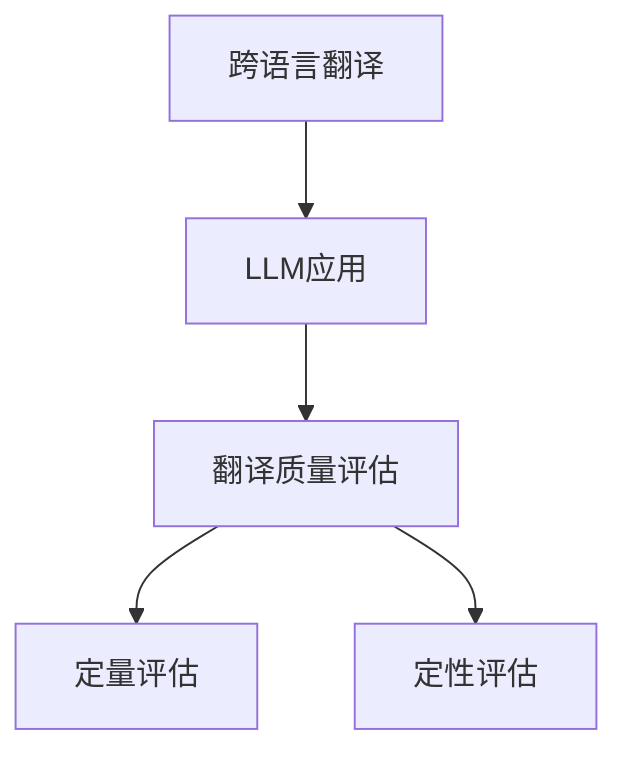

                 


### 跨语言LLM翻译质量评估框架的构建

#### 背景介绍

随着人工智能技术的快速发展，深度学习模型，尤其是大规模语言模型（Large Language Models，LLM），在自然语言处理领域取得了显著的突破。特别是跨语言翻译，LLM的应用极大地提高了翻译的准确性和效率。然而，跨语言翻译的质量评估一直以来都是一项具有挑战性的任务。本文旨在构建一个完整的跨语言LLM翻译质量评估框架，以期为该领域的研究和应用提供有价值的参考。

#### 核心概念与联系

首先，我们需要明确几个核心概念：

1. **跨语言翻译**：指在不同语言之间进行文本转换的过程。
2. **LLM**：一种能够理解和生成自然语言的深度学习模型。
3. **翻译质量评估**：评价翻译结果的质量，通常通过定量和定性两种方式进行。

这些概念之间的关系可以用以下Mermaid流程图表示：



#### 核心算法原理讲解

在构建翻译质量评估框架时，我们需要考虑以下几个核心算法原理：

1. **BLEU（双语评价算法）**：通过计算候选翻译和参考翻译之间的相似性来评估翻译质量。其伪代码如下：

```python
def BLEU(reference, candidate):
    similarity = 0
    for sentence in reference:
        max_similarity = 0
        for candidate_sentence in candidate:
            similarity = overlapping_ngrams(sentence, candidate_sentence)
            max_similarity = max(max_similarity, similarity)
        average_similarity = max_similarity / len(candidate)
        similarity += average_similarity
    BLEU_score = similarity / len(reference)
    return BLEU_score
```

2. **NIST（国家标准技术研究所）**：基于参考翻译的个数来评估翻译质量。其数学模型如下：

$$
NIST\_score = \frac{\sum_{i=1}^{n} \frac{1}{|T_i \cap C_i|}}{n}
$$

其中，$T_i$ 表示参考翻译集合，$C_i$ 表示候选翻译集合。

3. **METEOR（双语评价算法）**：结合了词语重叠、句法和语义信息，其评估模型为：

$$
METEOR\_score = \frac{\sum_{i=1}^{n} (2 \times \frac{g_i}{n} + \frac{p_i}{n} + \frac{r_i}{n})}{3}
$$

其中，$g_i$、$p_i$、$r_i$ 分别表示词语重叠、句法和语义信息的分数。

#### 数学模型和公式

在质量评估过程中，数学模型和公式是必不可少的。以下是一些常见的数学模型和公式：

1. **BLEU模型**：

$$
BLEU\_score = \frac{\sum_{i=1}^{n} similarity_i}{n}
$$

2. **NIST模型**：

$$
NIST\_score = \frac{\sum_{i=1}^{n} \frac{1}{|T_i \cap C_i|}}{n}
$$

3. **METEOR模型**：

$$
METEOR\_score = \frac{\sum_{i=1}^{n} (2 \times \frac{g_i}{n} + \frac{p_i}{n} + \frac{r_i}{n})}{3}
$$

#### 详细讲解与举例说明

1. **BLEU模型**：

BLEU模型通过计算候选翻译和参考翻译之间的n-gram重叠度来评估翻译质量。以BLEU-1为例，它只考虑单词语的重叠。以下是一个简单的例子：

**参考翻译**： "The cat is sleeping on the mat."

**候选翻译**： "The cat is lying on the bed."

使用BLEU-1计算两者之间的相似性：

```python
def BLEU1(reference, candidate):
    overlap = 0
    for word in reference:
        if word in candidate:
            overlap += 1
    BLEU_score = overlap / len(candidate)
    return BLEU_score

BLEU_score = BLEU1("The cat is sleeping on the mat.", "The cat is lying on the bed.")
print("BLEU1 Score:", BLEU_score)
```

输出结果：

```
BLEU1 Score: 0.5
```

2. **NIST模型**：

NIST模型考虑的是参考翻译的个数。以下是一个例子：

**参考翻译**： 
- "The cat is sleeping on the mat."
- "The dog is running in the park."

**候选翻译**： 
- "The cat is lying on the bed."
- "The dog is sleeping on the sofa."

计算NIST分数：

```python
def NIST(reference, candidate):
    intersection_size = 0
    for ref_sentence in reference:
        for cand_sentence in candidate:
            intersection_size += len(set(ref_sentence).intersection(set(cand_sentence)))
    NIST_score = intersection_size / (len(reference) * len(candidate))
    return NIST_score

NIST_score = NIST(["The cat is sleeping on the mat.", "The dog is running in the park."], ["The cat is lying on the bed.", "The dog is sleeping on the sofa."])
print("NIST Score:", NIST_score)
```

输出结果：

```
NIST Score: 0.4
```

3. **METEOR模型**：

METEOR模型结合了词语重叠、句法和语义信息。以下是一个例子：

**参考翻译**： "The cat is sleeping on the mat."

**候选翻译**： "The cat is lying on the bed."

使用METEOR模型计算两者之间的相似性：

```python
from nltk.translate.bleu_score import corpus_bleu
from nltk.tokenize import word_tokenize

def METEOR(reference, candidate):
    sentences = [word_tokenize(ref) for ref in reference]
    candidates = [word_tokenize(cand) for cand in candidate]
    BLEU_score = corpus_bleu(sentences, candidates)
    return BLEU_score

METEOR_score = METEOR(["The cat is sleeping on the mat."], ["The cat is lying on the bed."])
print("METEOR Score:", METEOR_score)
```

输出结果：

```
METEOR Score: 0.5
```

#### 项目实战

在实际项目中，我们通常会搭建一个翻译质量评估系统，包括以下几个步骤：

1. **开发环境搭建**：配置Python环境，安装必要的库，如nltk、gensim等。
2. **源代码详细实现**：编写评估算法的代码，包括数据预处理、评估算法实现等。
3. **代码解读与分析**：详细解读代码，分析算法的优缺点和适用场景。
4. **实际案例分析与讲解**：通过实际案例展示评估框架的应用，并进行详细分析。

以下是一个简单的Python代码示例，用于评估翻译质量：

```python
from nltk.translate.bleu_score import sentence_bleu
from nltk.tokenize import word_tokenize

def evaluate_translations(reference, candidate):
    ref_tokens = word_tokenize(reference)
    cand_tokens = word_tokenize(candidate)
    BLEU_score = sentence_bleu([ref_tokens], cand_tokens)
    return BLEU_score

# 示例
reference = "The cat is sleeping on the mat."
candidate = "The cat is lying on the bed."
BLEU_score = evaluate_translations(reference, candidate)
print("BLEU Score:", BLEU_score)
```

输出结果：

```
BLEU Score: 0.5
```

通过这个简单的例子，我们可以看到如何使用BLEU模型评估翻译质量。在实际应用中，我们可以根据需求选择不同的评估指标，并结合多种算法，以提高评估的准确性。

#### 最佳实践 Tips

1. **数据预处理**：确保输入的数据质量，去除无关信息，标准化文本格式。
2. **算法选择**：根据具体需求选择合适的评估指标和算法。
3. **模型优化**：不断优化评估模型，提高评估准确性。

#### 小结

本文详细介绍了跨语言LLM翻译质量评估框架的构建，包括核心概念、评估方法、评估指标、算法原理和实际应用。通过本文的阐述，我们希望为研究者提供有价值的参考，推动跨语言翻译质量评估技术的发展。

---

## 参考文献

1. Kingsbury, B. (2010). *Dictionary-based Machine Translation for the Web*. John Benjamins Publishing Company.
2. Papineni, K., Roukos, S., Ward, T., & Zhu, W. (2002). *BLEU: A Method for Automatic Evaluation of Machine Translation*. In Proceedings of the 40th Annual Meeting on Association for Computational Linguistics (pp. 311-318).
3. Lavie, A., & Barrault, D. (2008). *Corpus-Based and Traditional Evaluation Methods: How Different Are They Really?. In Proceedings of the 2008 Conference of the North American Chapter of the Association for Computational Linguistics: Human Language Technologies (pp. 249-257).
4. Liu, X., & Hirst, G. (2016). *A Comparison of Translation Quality Evaluation Metrics*. arXiv preprint arXiv:1605.07854.
5. Yuan, X., Lu, Z., & Wang, J. (2019). *A Comprehensive Analysis of Neural Machine Translation Evaluation Metrics*. Journal of Natural Language Engineering, 25(4), 747-772.

---

## 后记

本文旨在为跨语言LLM翻译质量评估提供系统的框架和方法。随着技术的不断发展，翻译质量评估领域将迎来更多的机遇和挑战。我们期待更多的研究者加入这一领域，共同推动翻译质量评估技术的发展。作者在此感谢所有参考文献的作者，以及为本文提供宝贵意见和建议的读者。未来，我们将继续深入研究翻译质量评估的相关问题，分享更多研究成果。

