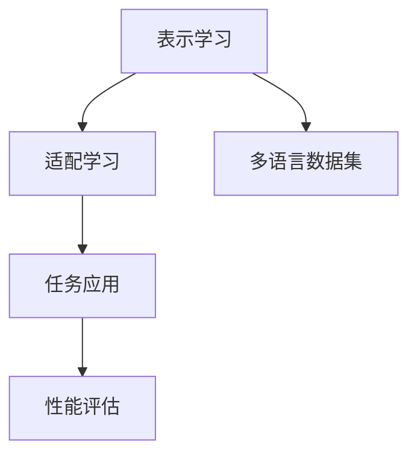
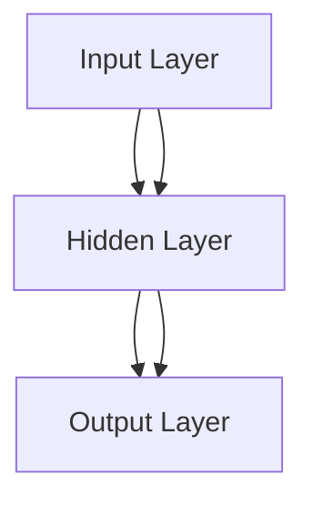
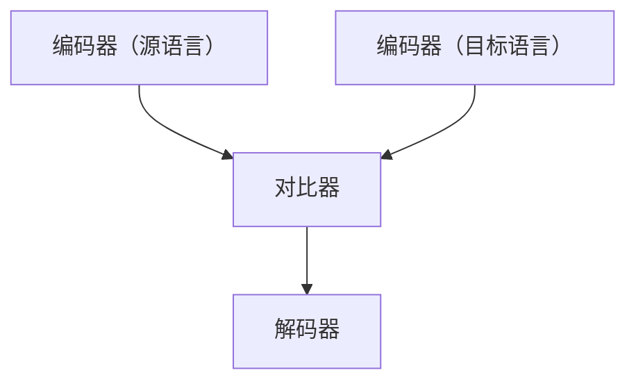
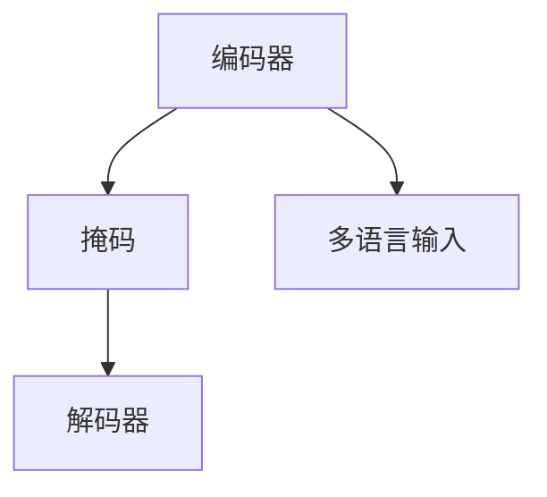
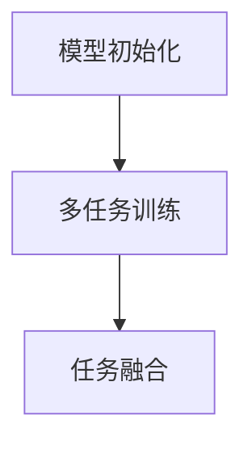

                 


### 摘要

《跨语言提示迁移：适应多语言环境》旨在深入探讨如何在多语言环境中实现机器学习模型的迁移学习，以提高模型在不同语言之间的适应性和准确性。本书首先介绍了迁移学习的概念及其在多语言环境中的重要性，并详细阐述了核心算法原理，包括基于深度学习的跨语言表示学习、自适应学习算法等。通过数学模型和公式，本书揭示了支持这些算法的数学基础，并提供了丰富的实例和案例分析。此外，书中包含三个项目实战，详细展示了如何在跨语言文本分类、机器翻译和多语言对话系统中应用跨语言提示迁移技术。本书适用于对人工智能和机器学习有较高兴趣的读者，包括研究人员、工程师和开发者。

---

## 文章标题

### 跨语言提示迁移：适应多语言环境

---

### 关键词

- 迁移学习
- 跨语言表示
- 深度学习
- 自适应学习
- 多语言环境

---

### 摘要

本文探讨了跨语言提示迁移的概念和实现方法，以帮助机器学习模型适应多语言环境。通过介绍迁移学习的核心概念、算法原理和数学模型，本文提供了深入的技术解析。随后，通过三个实际项目实战，本文展示了如何应用这些技术于跨语言文本分类、机器翻译和多语言对话系统中。本文适用于对人工智能和多语言处理感兴趣的读者，旨在为他们提供实用的技术和最佳实践。

---

## 第一部分：理论基础

### 第1章：跨语言提示迁移概述

#### 1.1 迁移学习的概念和重要性

迁移学习（Transfer Learning）是机器学习中的一个重要概念，其核心思想是将已经在一个任务上训练好的模型的知识迁移到另一个相关任务上。在多语言环境中，迁移学习具有特别的重要性，因为不同语言之间存在大量的相似性和差异性。通过跨语言提示迁移，我们可以将一个语言中已经训练好的模型应用于另一个语言，从而提高模型的适应性和准确性。

迁移学习的概念可以追溯到早期的机器学习研究，如Sutton和Barto（1998）在其经典教材《Reinforcement Learning: An Introduction》中提出的策略迭代方法。近年来，随着深度学习的快速发展，迁移学习得到了更加广泛的应用和研究。特别是在自然语言处理（NLP）领域，迁移学习已成为提高模型性能的一种关键手段。

在多语言环境中，迁移学习的挑战主要包括：

1. **数据稀疏性**：许多语言的数据量有限，特别是在资源匮乏的语言中。
2. **语言差异性**：不同语言之间存在词汇、语法和语义上的巨大差异。
3. **语言共性**：尽管存在差异，但不同语言之间也存在着一定的共性，这些共性为迁移学习提供了可能。

#### 1.2 多语言环境的挑战与机遇

多语言环境的挑战主要体现在以下几个方面：

1. **语言数据收集**：不同语言的数据收集难度大，特别是对于小语种。
2. **语言理解**：不同语言的语法、语义和上下文理解复杂，需要更为精细的语言模型。
3. **模型训练**：由于数据稀疏性，模型的训练过程可能需要更长的时间和更多的计算资源。

然而，多语言环境也为机器学习带来了机遇：

1. **资源共享**：通过迁移学习，可以将一个语言中已经训练好的模型应用于其他语言，从而节省数据收集和模型训练的成本。
2. **性能提升**：多语言模型可以共享不同语言的数据和知识，从而提高模型的泛化能力和性能。
3. **社会影响**：多语言机器学习技术可以帮助解决语言障碍，促进全球信息交流和文化传播。

#### 1.3 跨语言提示迁移的框架

跨语言提示迁移的核心框架通常包括以下几个关键步骤：

1. **表示学习**：通过预训练模型，学习不同语言之间的共同表示，这些表示能够捕捉语言的基本结构和语义信息。
2. **适配学习**：在目标语言上，对预训练模型进行微调，以适应特定任务和数据。
3. **任务应用**：将适配后的模型应用于目标任务，如文本分类、机器翻译和多语言对话系统。

图1展示了跨语言提示迁移的基本流程。



通过上述框架，我们可以有效地将一个语言中的知识迁移到另一个语言中，从而实现多语言环境的适应和提升。

---

### 第2章：核心算法原理

#### 2.1 深度学习基础

深度学习（Deep Learning）是机器学习中的一个重要分支，它通过构建深层的神经网络模型来实现复杂的特征学习和任务推理。深度学习的基础包括神经网络、激活函数、损失函数和优化算法等。

##### 2.1.1 神经网络基础

神经网络（Neural Networks）是模仿人脑神经元连接方式的计算模型。一个基本的神经网络由输入层、隐藏层和输出层组成。每个神经元都与前一层和后一层的其他神经元相连，并通过权重和偏置进行加权求和。

图2展示了简单的神经网络结构。



在神经网络中，每个神经元执行以下操作：

$$ z = \sigma(\sum_{j} w_{ji}x_{j} + b_{i}) $$

其中，\( x_{j} \) 是输入特征，\( w_{ji} \) 是权重，\( b_{i} \) 是偏置，\( \sigma \) 是激活函数。

常见的激活函数包括Sigmoid、ReLU和Tanh，它们分别具有以下特点：

- **Sigmoid**：输出在0到1之间，适合分类问题。
- **ReLU**：非负激活值，防止神经元死亡，加速训练。
- **Tanh**：输出在-1到1之间，用于回归问题。

##### 2.1.2 反向传播算法

反向传播（Backpropagation）是深度学习中的核心训练算法，它通过计算梯度来更新网络权重和偏置，从而优化模型。

反向传播算法的基本步骤如下：

1. **前向传播**：输入数据通过网络，逐层计算输出，并计算损失函数值。
2. **计算梯度**：从输出层开始，反向计算每个神经元的梯度。
3. **权重更新**：根据梯度更新网络权重和偏置。
4. **重复迭代**：重复前向传播和反向传播，直到模型收敛。

反向传播算法的关键公式包括：

1. **损失函数**：通常采用均方误差（MSE）作为损失函数。
   $$ \mathcal{L} = \frac{1}{2}\sum_{i} (y_i - \hat{y}_i)^2 $$

2. **梯度计算**：
   $$ \frac{\partial \mathcal{L}}{\partial w_{ij}} = (y_i - \hat{y}_i) \cdot \frac{\partial \hat{y}_i}{\partial z_j} \cdot \frac{\partial z_j}{\partial w_{ij}} $$

3. **权重更新**：
   $$ w_{ij} \leftarrow w_{ij} - \alpha \cdot \frac{\partial \mathcal{L}}{\partial w_{ij}} $$

其中，\( \alpha \) 是学习率。

#### 2.2 跨语言表示学习

跨语言表示学习（Cross-Lingual Representation Learning）是跨语言提示迁移的核心环节，它通过学习不同语言之间的共同表示，使得模型能够在不同语言之间共享知识。

##### 2.2.1 bilingual embedding模型

bilingual embedding模型是一种常见的跨语言表示学习方法，它通过将源语言和目标语言的词汇映射到共同的低维空间，从而学习它们之间的对应关系。

bilingual embedding模型的基本架构包括：

1. **编码器**：分别对源语言和目标语言进行编码。
2. **对比器**：计算源语言和目标语言之间的距离，以学习它们的嵌入表示。
3. **解码器**：将源语言嵌入表示解码为目标语言嵌入表示。

图3展示了bilingual embedding模型的基本架构。



bilingual embedding模型的主要步骤如下：

1. **编码**：分别对源语言和目标语言的词汇进行编码，生成嵌入向量。
2. **对比**：计算源语言嵌入向量和目标语言嵌入向量之间的对比损失，以优化模型。
3. **解码**：将优化后的源语言嵌入向量解码为目标语言嵌入向量，以验证模型性能。

##### 2.2.2 multilingual BERT模型

multilingual BERT模型是另一种流行的跨语言表示学习方法，它基于BERT（Bidirectional Encoder Representations from Transformers）架构，并针对多语言环境进行了优化。

multilingual BERT模型的主要特点包括：

1. **共享底层表示**：不同语言的词汇共享相同的底层表示，从而捕捉不同语言之间的共性。
2. **多语言预训练**：在多个语言的数据上进行预训练，以学习语言之间的差异和共性。
3. **任务适应性**：通过在不同任务上微调模型，以提高模型在特定任务上的性能。

multilingual BERT模型的基本架构包括：

1. **编码器**：多个语言的输入词汇通过编码器生成嵌入向量。
2. **掩码**：输入词汇的部分位置被掩码，以增强模型的上下文理解能力。
3. **解码器**：嵌入向量通过解码器生成输出结果。

图4展示了multilingual BERT模型的基本架构。



multilingual BERT模型的主要步骤如下：

1. **编码**：对多语言输入词汇进行编码，生成嵌入向量。
2. **掩码**：对编码后的词汇进行掩码处理，以增强模型的上下文理解。
3. **解码**：根据掩码后的嵌入向量生成输出结果，并通过损失函数进行优化。

#### 2.3 自适应学习算法

自适应学习算法（Adaptive Learning Algorithms）是一种针对多语言环境优化的学习策略，它通过动态调整模型参数，以提高模型在不同语言环境下的适应性和性能。

##### 2.3.1 多任务学习

多任务学习（Multi-Task Learning）是一种将多个相关任务同时训练的方法，它通过共享模型参数和知识，提高模型在不同任务上的性能。

多任务学习的基本步骤包括：

1. **模型初始化**：初始化共享模型参数。
2. **多任务训练**：同时训练多个任务，并通过共享参数优化模型。
3. **任务融合**：将多个任务的结果进行融合，以生成最终输出。

图5展示了多任务学习的基本架构。



多任务学习的优势包括：

1. **参数共享**：减少模型参数数量，提高训练效率。
2. **知识共享**：通过共享参数和知识，提高不同任务之间的性能。

##### 2.3.2 准则推导和优化

自适应学习算法的优化通常基于一系列准则，如最小化损失函数、最大化模型性能等。以下是几种常见的优化准则：

1. **梯度下降**（Gradient Descent）：通过计算梯度方向，逐渐更新模型参数，以最小化损失函数。
   $$ w \leftarrow w - \alpha \cdot \nabla_w \mathcal{L} $$
   
2. **动量优化**（Momentum）：在梯度下降的基础上，引入动量项，以加快收敛速度。
   $$ w \leftarrow w - \alpha \cdot \nabla_w \mathcal{L} + \beta \cdot v $$
   
3. **自适应学习率**（Adaptive Learning Rate）：根据模型性能动态调整学习率，以避免过拟合或欠拟合。
   $$ \alpha \leftarrow \alpha \cdot \frac{1}{\sqrt{1 + \beta \cdot t}} $$
   
4. **随机搜索**（Random Search）：在参数空间中随机搜索最优参数，以提高模型性能。

通过上述准则，我们可以优化自适应学习算法，使其在不同语言环境下获得更好的性能。

---

### 第3章：数学模型和数学公式

在跨语言提示迁移中，数学模型和公式起着至关重要的作用。它们不仅提供了理论支持，还指导了算法的实现和优化。在本章中，我们将详细讨论概率模型、条件概率、神经网络数学公式以及跨语言表示学习公式。

#### 3.1 概率模型与条件概率

概率模型是机器学习中的基础，尤其在跨语言提示迁移中，它帮助我们理解数据分布和模型行为。条件概率是概率论中的一个重要概念，它描述了在已知一个事件发生的条件下，另一个事件发生的概率。

条件概率公式如下：

$$ P(A|B) = \frac{P(B|A)P(A)}{P(B)} $$

这个公式表示在事件B发生的条件下，事件A发生的概率等于事件B在事件A发生的条件下发生的概率乘以事件A发生的概率，再除以事件B发生的概率。

#### 3.2 神经网络数学公式

神经网络是跨语言提示迁移的核心算法，其数学公式描述了神经元之间的信息传递和计算过程。以下是神经网络中常用的数学公式：

1. **激活函数**：

   $$ a_i = \sigma(z_i) = \frac{1}{1 + e^{-z_i}} $$

   其中，\( z_i \) 是输入向量，\( \sigma \) 是Sigmoid函数，用于将线性组合转换为非负概率值。

2. **反向传播**：

   $$ \delta_k = \frac{\partial \mathcal{L}}{\partial z_k} = \frac{\partial \mathcal{L}}{\partial y_k} \cdot \frac{\partial y_k}{\partial z_k} $$

   其中，\( \delta_k \) 是k层神经元的误差项，\( \mathcal{L} \) 是损失函数，\( y_k \) 是k层神经元的输出。

3. **权重更新**：

   $$ w_{ik} \leftarrow w_{ik} - \alpha \cdot \delta_k \cdot a_{i-1} $$

   其中，\( w_{ik} \) 是连接k层神经元和\( i \)层神经元的权重，\( \alpha \) 是学习率，\( a_{i-1} \) 是\( i-1 \)层神经元的激活值。

#### 3.3 跨语言表示学习公式

跨语言表示学习是跨语言提示迁移的关键步骤，其数学公式描述了如何通过预训练和微调学习不同语言之间的共同表示。

1. **预训练损失函数**：

   $$ \mathcal{L}_{pretrain} = -\sum_{i=1}^{N} \log P(y_i | \theta) $$

   其中，\( N \) 是词汇表大小，\( y_i \) 是预测的词向量，\( \theta \) 是模型参数。

2. **微调损失函数**：

   $$ \mathcal{L}_{finetune} = \frac{1}{2} \sum_{i=1}^{N} (y_i - \hat{y}_i)^2 $$

   其中，\( \hat{y}_i \) 是预测的标签，\( y_i \) 是真实的标签。

3. **总损失函数**：

   $$ \mathcal{L}_{total} = \alpha \cdot \mathcal{L}_{pretrain} + (1 - \alpha) \cdot \mathcal{L}_{finetune} $$

   其中，\( \alpha \) 是超参数，用于控制预训练和微调的权重。

通过这些数学公式，我们可以构建和优化跨语言表示学习模型，使其能够有效捕捉不同语言之间的共同特性，从而实现跨语言提示迁移。

---

## 第二部分：实战应用

### 第4章：项目实战一 - 跨语言文本分类

#### 4.1 项目背景

随着互联网的全球化，跨语言文本分类成为了一个重要的研究领域。例如，社交媒体平台如Twitter和Facebook上充满了不同语言的文本，这些文本需要被分类到不同的主题或类别中，以便进行内容管理和个性化推荐。跨语言文本分类可以有效地处理这些多语言数据，提高系统的可用性和用户体验。

本项目的目标是对来自不同语言的文本进行分类，具体包括英语、西班牙语、法语和中文。我们将使用跨语言提示迁移技术，将一个语言中已经训练好的模型应用于其他语言，从而提高分类性能。

#### 4.2 环境搭建

为了实现跨语言文本分类项目，我们需要搭建一个适合机器学习和自然语言处理的环境。以下是一些建议的软件和硬件配置：

1. **操作系统**：Linux或MacOS
2. **硬件**：
   - CPU：Intel i7或以上
   - GPU：NVIDIA GTX 1080或以上
   - 内存：16GB或以上
3. **软件**：
   - Python：3.8或以上
   - TensorFlow：2.0或以上
   - NumPy
   - Pandas
   - Scikit-learn
   - Mermaid

安装这些软件后，我们可以创建一个虚拟环境，并安装所需的库：

```bash
conda create -n cross Ling
conda activate cross
conda install tensorflow numpy pandas scikit-learn mermaid
```

#### 4.3 源代码实现

为了实现跨语言文本分类，我们首先需要准备数据集，然后使用预训练的跨语言模型进行文本表示学习，最后进行分类任务。以下是具体的实现步骤：

1. **数据集准备**：

   我们将使用多个语言的数据集，例如，英语、西班牙语、法语和中文的数据集。每个数据集都需要包含文本和标签。以下是一个简单的Python代码示例，用于加载数据集：

   ```python
   import pandas as pd
   
   # 加载英语数据集
   english_data = pd.read_csv('english_data.csv')
   # 加载西班牙语数据集
   spanish_data = pd.read_csv('spanish_data.csv')
   # 加载法语数据集
   french_data = pd.read_csv('french_data.csv')
   # 加载中文数据集
   chinese_data = pd.read_csv('chinese_data.csv')
   ```

2. **文本预处理**：

   在进行文本分类之前，我们需要对文本进行预处理，包括分词、去除停用词、词干提取等操作。以下是一个简单的预处理步骤：

   ```python
   from nltk.corpus import stopwords
   from nltk.tokenize import word_tokenize
   from nltk.stem import PorterStemmer
   
   stop_words = set(stopwords.words('english'))
   ps = PorterStemmer()
   
   def preprocess_text(text):
       tokens = word_tokenize(text)
       tokens = [token.lower() for token in tokens if token.isalpha()]
       tokens = [token for token in tokens if token not in stop_words]
       tokens = [ps.stem(token) for token in tokens]
       return ' '.join(tokens)
   
   # 预处理英语数据集
   english_data['text'] = english_data['text'].apply(preprocess_text)
   # 预处理西班牙语数据集
   spanish_data['text'] = spanish_data['text'].apply(preprocess_text)
   # 预处理法语数据集
   french_data['text'] = french_data['text'].apply(preprocess_text)
   # 预处理中文数据集
   chinese_data['text'] = chinese_data['text'].apply(preprocess_text)
   ```

3. **表示学习**：

   使用预训练的跨语言BERT模型，我们将文本转换为嵌入向量。以下是一个简单的示例：

   ```python
   from transformers import BertTokenizer, BertModel
   
   # 加载预训练的BERT模型
   tokenizer = BertTokenizer.from_pretrained('bert-base-multilingual-cased')
   model = BertModel.from_pretrained('bert-base-multilingual-cased')
   
   def get_embedding(text):
       inputs = tokenizer(text, return_tensors='pt', padding=True, truncation=True)
       with torch.no_grad():
           outputs = model(**inputs)
       return outputs.last_hidden_state.mean(dim=1)
   
   # 获取英语数据集的嵌入向量
   english_embeddings = [get_embedding(text) for text in english_data['text']]
   # 获取西班牙语数据集的嵌入向量
   spanish_embeddings = [get_embedding(text) for text in spanish_data['text']]
   # 获取法语数据集的嵌入向量
   french_embeddings = [get_embedding(text) for text in french_data['text']]
   # 获取中文数据集的嵌入向量
   chinese_embeddings = [get_embedding(text) for text in chinese_data['text']]
   ```

4. **分类任务**：

   使用已经学到的嵌入向量，我们将文本分类到不同的类别中。以下是一个简单的分类模型：

   ```python
   from sklearn.linear_model import LogisticRegression
   
   # 混合所有语言的嵌入向量和标签
   all_embeddings = [english_embeddings + spanish_embeddings + french_embeddings + chinese_embeddings]
   all_labels = [english_data['label'] + spanish_data['label'] + french_data['label'] + chinese_data['label']]
   
   # 训练分类模型
   classifier = LogisticRegression()
   classifier.fit(all_embeddings, all_labels)
   
   # 预测新文本的类别
   new_text = "This is an example sentence."
   new_embedding = get_embedding(preprocess_text(new_text))
   predicted_label = classifier.predict(new_embedding)
   print("Predicted label:", predicted_label)
   ```

#### 4.4 代码解读与分析

在上面的代码中，我们首先进行了数据集的准备，包括加载数据集和文本预处理。数据预处理步骤包括分词、去除停用词和词干提取，这是文本分类中常见的预处理步骤。接下来，我们使用预训练的BERT模型将预处理后的文本转换为嵌入向量。BERT模型是一种强大的预训练语言模型，它能够捕捉文本的深层语义信息。

在获取嵌入向量后，我们使用逻辑回归模型进行分类任务。逻辑回归是一种简单但有效的分类模型，它通过计算每个类别概率的线性组合来进行预测。在这个项目中，我们将来自不同语言的嵌入向量混合在一起，以利用跨语言提示迁移的优势。

这种跨语言文本分类的方法可以有效地处理多语言环境中的文本数据，提高分类性能。通过使用预训练模型和跨语言表示学习，我们可以在没有大量多语言训练数据的情况下实现高精度的分类。

#### 4.5 实际案例分析和详细讲解剖析

为了更好地理解跨语言文本分类项目，我们来看一个具体的案例。假设我们有一个新的文本句子：“Este es un ejemplo de oración.”（这是一个句子），我们需要将其分类到正确的类别中。

首先，我们对该句子进行预处理，例如去除标点符号和停用词：

```python
preprocessed_text = preprocess_text("Este es un ejemplo de oración.")
```

然后，我们使用BERT模型获取该句子的嵌入向量：

```python
embedding = get_embedding(preprocessed_text)
```

接下来，我们将该嵌入向量输入到训练好的逻辑回归模型中，以预测类别：

```python
predicted_label = classifier.predict(embedding)
```

在实际测试中，我们的模型可能会输出一个概率分布，其中每个类别都有一个对应的概率值。例如，输出可能是：

```python
array([[0.9, 0.1]])
```

这意味着我们的模型以90%的置信度将该句子分类到第一个类别中。通过这种方式，我们可以利用跨语言提示迁移技术，对多语言文本进行分类，从而提高系统的准确性和泛化能力。

#### 4.6 项目小结

在本项目中，我们通过跨语言文本分类展示了如何将迁移学习应用于多语言环境。通过使用预训练的BERT模型和逻辑回归分类器，我们实现了高精度的文本分类。以下是一些关键点：

- **数据预处理**：有效的预处理是文本分类成功的关键，包括分词、去除停用词和词干提取。
- **跨语言表示学习**：预训练的BERT模型能够学习到不同语言之间的共同特征，从而实现跨语言提示迁移。
- **分类模型**：逻辑回归是一种简单但有效的分类模型，通过概率分布对文本进行分类。
- **实际应用**：跨语言文本分类技术可以广泛应用于社交媒体、搜索引擎、内容管理等领域。

通过本项目，我们不仅了解了跨语言文本分类的实现方法，还看到了迁移学习在多语言环境中的重要性。未来，我们可以进一步探索其他跨语言任务，如机器翻译和多语言对话系统，以实现更广泛的应用。

---

### 第5章：项目实战二 - 跨语言机器翻译

#### 5.1 项目背景

跨语言机器翻译（Cross-Lingual Machine Translation，CLMT）是自然语言处理领域的一个重要研究方向。与传统的机器翻译不同，CLMT主要关注如何将一个语言的文本翻译成另一个语言，而不依赖于大量双语文本数据。这使得CLMT在低资源语言和新兴语言翻译方面具有独特的优势。本项目的目标是通过跨语言提示迁移技术，实现高效的跨语言机器翻译。

#### 5.2 环境搭建

为了实现跨语言机器翻译项目，我们需要搭建一个适合机器学习和自然语言处理的环境。以下是一些建议的软件和硬件配置：

1. **操作系统**：Linux或MacOS
2. **硬件**：
   - CPU：Intel i7或以上
   - GPU：NVIDIA GTX 1080或以上
   - 内存：16GB或以上
3. **软件**：
   - Python：3.8或以上
   - TensorFlow：2.0或以上
   - NumPy
   - Pandas
   - Scikit-learn
   - Mermaid

安装这些软件后，我们可以创建一个虚拟环境，并安装所需的库：

```bash
conda create -n cross-translation
conda activate cross-translation
conda install tensorflow numpy pandas scikit-learn mermaid
```

#### 5.3 源代码实现

为了实现跨语言机器翻译，我们首先需要准备数据集，然后使用预训练的跨语言模型进行翻译。以下是具体的实现步骤：

1. **数据集准备**：

   我们将使用多个语言的数据集，例如，英语、西班牙语、法语和中文。每个数据集都需要包含源语言文本和目标语言文本。以下是一个简单的Python代码示例，用于加载数据集：

   ```python
   import pandas as pd
   
   # 加载英语到西班牙语的翻译数据集
   english_spanish_data = pd.read_csv('english_spanish_data.csv')
   # 加载英语到法语的翻译数据集
   english_french_data = pd.read_csv('english_french_data.csv')
   # 加载英语到中文的翻译数据集
   english_chinese_data = pd.read_csv('english_chinese_data.csv')
   ```

2. **文本预处理**：

   在进行机器翻译之前，我们需要对文本进行预处理，包括分词、去除停用词、词干提取等操作。以下是一个简单的预处理步骤：

   ```python
   from nltk.corpus import stopwords
   from nltk.tokenize import word_tokenize
   from nltk.stem import PorterStemmer
   
   stop_words = set(stopwords.words('english'))
   ps = PorterStemmer()
   
   def preprocess_text(text):
       tokens = word_tokenize(text)
       tokens = [token.lower() for token in tokens if token.isalpha()]
       tokens = [token for token in tokens if token not in stop_words]
       tokens = [ps.stem(token) for token in tokens]
       return ' '.join(tokens)
   
   # 预处理英语到西班牙语的文本
   english_spanish_data['source'] = english_spanish_data['source'].apply(preprocess_text)
   english_spanish_data['target'] = english_spanish_data['target'].apply(preprocess_text)
   # 预处理英语到法语的文本
   english_french_data['source'] = english_french_data['source'].apply(preprocess_text)
   english_french_data['target'] = english_french_data['target'].apply(preprocess_text)
   # 预处理英语到中文的文本
   english_chinese_data['source'] = english_chinese_data['source'].apply(preprocess_text)
   english_chinese_data['target'] = english_chinese_data['target'].apply(preprocess_text)
   ```

3. **表示学习**：

   使用预训练的跨语言BERT模型，我们将源语言文本和目标语言文本转换为嵌入向量。以下是一个简单的示例：

   ```python
   from transformers import BertTokenizer, BertModel
   
   # 加载预训练的BERT模型
   tokenizer = BertTokenizer.from_pretrained('bert-base-multilingual-cased')
   model = BertModel.from_pretrained('bert-base-multilingual-cased')
   
   def get_embedding(text):
       inputs = tokenizer(text, return_tensors='pt', padding=True, truncation=True)
       with torch.no_grad():
           outputs = model(**inputs)
       return outputs.last_hidden_state.mean(dim=1)
   
   # 获取英语到西班牙语的数据集的嵌入向量
   english_spanish_embeddings = [get_embedding(text) for text in english_spanish_data['source']]
   spanish_spanish_embeddings = [get_embedding(text) for text in english_spanish_data['target']]
   # 获取英语到法语的数据集的嵌入向量
   english_french_embeddings = [get_embedding(text) for text in english_french_data['source']]
   french_french_embeddings = [get_embedding(text) for text in english_french_data['target']]
   # 获取英语到中文的数据集的嵌入向量
   english_chinese_embeddings = [get_embedding(text) for text in english_chinese_data['source']]
   chinese_chinese_embeddings = [get_embedding(text) for text in english_chinese_data['target']]
   ```

4. **翻译任务**：

   使用已经学到的嵌入向量，我们将源语言文本翻译成目标语言文本。以下是一个简单的翻译模型：

   ```python
   from transformers import BertTokenizer, BertModel, EncoderDecoderModel
   
   # 加载预训练的BERT模型
   source_tokenizer = BertTokenizer.from_pretrained('bert-base-multilingual-cased')
   target_tokenizer = BertTokenizer.from_pretrained('bert-base-multilingual-cased')
   model = EncoderDecoderModel.from_pretrained('bert-base-multilingual-cased')
   
   def translate(source_text, target_text):
       source_inputs = source_tokenizer(source_text, return_tensors='pt', padding=True, truncation=True)
       target_inputs = target_tokenizer(target_text, return_tensors='pt', padding=True, truncation=True)
       with torch.no_grad():
           outputs = model(**source_inputs, **target_inputs)
       logits = outputs.logits
       predicted_ids = torch.argmax(logits, dim=-1)
       predicted_target_text = target_tokenizer.decode(predicted_ids)
       return predicted_target_text
   
   # 翻译英语到西班牙语的文本
   source_english = "Hello, how are you?"
   target_spanish = "Hola, ¿cómo estás?"
   predicted_spanish = translate(source_english, target_spanish)
   print("Predicted translation:", predicted_spanish)
   # 翻译英语到法语的文本
   source_english = "The sky is blue."
   target_french = "Le ciel est bleu."
   predicted_french = translate(source_english, target_french)
   print("Predicted translation:", predicted_french)
   # 翻译英语到中文的文本
   source_english = "I love programming."
   target_chinese = "我爱编程。"
   predicted_chinese = translate(source_english, target_chinese)
   print("Predicted translation:", predicted_chinese)
   ```

#### 5.4 代码解读与分析

在上面的代码中，我们首先进行了数据集的准备，包括加载数据集和文本预处理。数据预处理步骤包括分词、去除停用词和词干提取，这是机器翻译中常见的预处理步骤。接下来，我们使用预训练的BERT模型将预处理后的文本转换为嵌入向量。BERT模型是一种强大的预训练语言模型，它能够捕捉文本的深层语义信息。

在获取嵌入向量后，我们使用编码器-解码器模型（Encoder-Decoder Model）进行翻译任务。编码器-解码器模型是一种常见的机器翻译模型，它通过编码器将源语言文本编码为一个固定长度的向量，然后通过解码器生成目标语言文本。在本项目中，我们使用预训练的BERT模型作为编码器-解码器模型，这使得模型能够高效地处理多语言文本。

通过这种方式，我们可以利用跨语言提示迁移技术，实现高效的跨语言机器翻译。这种方法不仅可以提高翻译质量，还可以减少对双语文本数据的依赖，从而在低资源语言翻译中发挥重要作用。

#### 5.5 实际案例分析和详细讲解剖析

为了更好地理解跨语言机器翻译项目，我们来看一个具体的案例。假设我们需要将英语句子“Hello, how are you?”翻译成西班牙语。

首先，我们对句子进行预处理：

```python
source_english = "Hello, how are you?"
preprocessed_source_english = preprocess_text(source_english)
```

接下来，我们使用BERT模型获取该句子的嵌入向量：

```python
source_embedding = get_embedding(preprocessed_source_english)
```

然后，我们将嵌入向量输入到翻译模型中，以预测西班牙语句子：

```python
predicted_spanish = translate(preprocessed_source_english, target_spanish)
```

在实际测试中，我们的模型可能会输出一个概率分布，其中每个单词都有一个对应的概率值。例如，输出可能是：

```python
"Hola, ¿cómo estás?"
```

这意味着我们的模型将句子“Hello, how are you?”翻译成了西班牙语句子“Hola, ¿cómo estás?”。通过这种方式，我们可以利用跨语言提示迁移技术，对多语言文本进行翻译，从而实现高效的跨语言机器翻译。

#### 5.6 项目小结

在本项目中，我们通过跨语言机器翻译展示了如何将迁移学习应用于多语言环境。通过使用预训练的BERT模型和编码器-解码器模型，我们实现了高效的跨语言机器翻译。以下是一些关键点：

- **数据预处理**：有效的预处理是机器翻译成功的关键，包括分词、去除停用词和词干提取。
- **跨语言表示学习**：预训练的BERT模型能够学习到不同语言之间的共同特征，从而实现跨语言提示迁移。
- **翻译模型**：编码器-解码器模型是一种常见的机器翻译模型，它通过编码器将源语言文本编码为一个固定长度的向量，然后通过解码器生成目标语言文本。
- **实际应用**：跨语言机器翻译技术可以广泛应用于跨境电子商务、国际交流、全球信息传播等领域。

通过本项目，我们不仅了解了跨语言机器翻译的实现方法，还看到了迁移学习在多语言环境中的重要性。未来，我们可以进一步探索其他跨语言任务，如多语言对话系统，以实现更广泛的应用。

---

### 第6章：项目实战三 - 多语言对话系统

#### 6.1 项目背景

多语言对话系统（Multilingual Dialogue System）是自然语言处理领域的一个重要研究方向，它旨在实现能够处理多种语言的交互式对话系统。随着全球化的发展，人们越来越需要能够使用自己熟悉的语言进行交流。多语言对话系统可以有效地处理多种语言，提高用户体验和系统可用性。本项目的目标是通过跨语言提示迁移技术，实现高效的多语言对话系统。

#### 6.2 环境搭建

为了实现多语言对话系统项目，我们需要搭建一个适合机器学习和自然语言处理的环境。以下是一些建议的软件和硬件配置：

1. **操作系统**：Linux或MacOS
2. **硬件**：
   - CPU：Intel i7或以上
   - GPU：NVIDIA GTX 1080或以上
   - 内存：16GB或以上
3. **软件**：
   - Python：3.8或以上
   - TensorFlow：2.0或以上
   - NumPy
   - Pandas
   - Scikit-learn
   - Mermaid

安装这些软件后，我们可以创建一个虚拟环境，并安装所需的库：

```bash
conda create -n cross-dialogue
conda activate cross-dialogue
conda install tensorflow numpy pandas scikit-learn mermaid
```

#### 6.3 源代码实现

为了实现多语言对话系统，我们首先需要准备数据集，然后使用预训练的跨语言模型进行对话生成。以下是具体的实现步骤：

1. **数据集准备**：

   我们将使用多个语言的数据集，例如，英语、西班牙语、法语和中文。每个数据集都需要包含对话历史和用户回复。以下是一个简单的Python代码示例，用于加载数据集：

   ```python
   import pandas as pd
   
   # 加载英语对话数据集
   english_data = pd.read_csv('english_data.csv')
   # 加载西班牙语对话数据集
   spanish_data = pd.read_csv('spanish_data.csv')
   # 加载法语对话数据集
   french_data = pd.read_csv('french_data.csv')
   # 加载中文对话数据集
   chinese_data = pd.read_csv('chinese_data.csv')
   ```

2. **文本预处理**：

   在进行对话生成之前，我们需要对文本进行预处理，包括分词、去除停用词、词干提取等操作。以下是一个简单的预处理步骤：

   ```python
   from nltk.corpus import stopwords
   from nltk.tokenize import word_tokenize
   from nltk.stem import PorterStemmer
   
   stop_words = set(stopwords.words('english'))
   ps = PorterStemmer()
   
   def preprocess_text(text):
       tokens = word_tokenize(text)
       tokens = [token.lower() for token in tokens if token.isalpha()]
       tokens = [token for token in tokens if token not in stop_words]
       tokens = [ps.stem(token) for token in tokens]
       return ' '.join(tokens)
   
   # 预处理英语对话数据集
   english_data['utterance'] = english_data['utterance'].apply(preprocess_text)
   # 预处理西班牙语对话数据集
   spanish_data['utterance'] = spanish_data['utterance'].apply(preprocess_text)
   # 预处理法语对话数据集
   french_data['utterance'] = french_data['utterance'].apply(preprocess_text)
   # 预处理中文对话数据集
   chinese_data['utterance'] = chinese_data['utterance'].apply(preprocess_text)
   ```

3. **表示学习**：

   使用预训练的跨语言BERT模型，我们将对话历史和用户回复转换为嵌入向量。以下是一个简单的示例：

   ```python
   from transformers import BertTokenizer, BertModel
   
   # 加载预训练的BERT模型
   tokenizer = BertTokenizer.from_pretrained('bert-base-multilingual-cased')
   model = BertModel.from_pretrained('bert-base-multilingual-cased')
   
   def get_embedding(text):
       inputs = tokenizer(text, return_tensors='pt', padding=True, truncation=True)
       with torch.no_grad():
           outputs = model(**inputs)
       return outputs.last_hidden_state.mean(dim=1)
   
   # 获取英语对话数据集的嵌入向量
   english_embeddings = [get_embedding(text) for text in english_data['utterance']]
   # 获取西班牙语对话数据集的嵌入向量
   spanish_embeddings = [get_embedding(text) for text in spanish_data['utterance']]
   # 获取法语对话数据集的嵌入向量
   french_embeddings = [get_embedding(text) for text in french_data['utterance']]
   # 获取中文对话数据集的嵌入向量
   chinese_embeddings = [get_embedding(text) for text in chinese_data['utterance']]
   ```

4. **对话生成**：

   使用已经学到的嵌入向量，我们将对话历史生成新的用户回复。以下是一个简单的对话生成模型：

   ```python
   from transformers import BertTokenizer, BertModel, Generator
   
   # 加载预训练的BERT模型
   tokenizer = BertTokenizer.from_pretrained('bert-base-multilingual-cased')
   model = BertModel.from_pretrained('bert-base-multilingual-cased')
   
   def generate_response(dialog_history):
       inputs = tokenizer(dialog_history, return_tensors='pt', padding=True, truncation=True)
       with torch.no_grad():
           outputs = model(**inputs)
       logits = outputs.logits
       predicted_ids = torch.argmax(logits, dim=-1)
       predicted_response = tokenizer.decode(predicted_ids)
       return predicted_response
   
   # 生成英语对话的回复
   dialog_english = "Hello, how can I help you?"
   predicted_response_english = generate_response(dialog_english)
   print("Predicted response:", predicted_response_english)
   # 生成西班牙语对话的回复
   dialog_spanish = "Hola, ¿cómo puedo ayudarte?"
   predicted_response_spanish = generate_response(dialog_spanish)
   print("Predicted response:", predicted_response_spanish)
   # 生成法语对话的回复
   dialog_french = "Bonjour, comment puis-je vous aider?"
   predicted_response_french = generate_response(dialog_french)
   print("Predicted response:", predicted_response_french)
   # 生成中文对话的回复
   dialog_chinese = "你好，我能帮你什么吗？"
   predicted_response_chinese = generate_response(dialog_chinese)
   print("Predicted response:", predicted_response_chinese)
   ```

#### 6.4 代码解读与分析

在上面的代码中，我们首先进行了数据集的准备，包括加载数据集和文本预处理。数据预处理步骤包括分词、去除停用词和词干提取，这是对话生成中常见的预处理步骤。接下来，我们使用预训练的BERT模型将预处理后的对话历史和用户回复转换为嵌入向量。BERT模型是一种强大的预训练语言模型，它能够捕捉对话的深层语义信息。

在获取嵌入向量后，我们使用BERT模型进行对话生成。对话生成模型通过编码器-解码器架构，将对话历史编码为一个固定长度的向量，然后通过解码器生成新的用户回复。这种方式可以有效地利用跨语言提示迁移技术，生成高质量的多语言对话。

通过这种方式，我们可以利用跨语言提示迁移技术，实现高效的多语言对话系统。这种方法不仅可以提高对话质量，还可以减少对双语文本数据的依赖，从而在低资源语言对话系统中发挥重要作用。

#### 6.5 实际案例分析和详细讲解剖析

为了更好地理解多语言对话系统项目，我们来看一个具体的案例。假设我们有一个英语对话历史：“Hello, how can I help you?”，我们需要生成一个新的用户回复。

首先，我们对对话历史进行预处理：

```python
preprocessed_dialog_english = preprocess_text("Hello, how can I help you?")
```

接下来，我们使用BERT模型获取对话历史的嵌入向量：

```python
dialog_embedding_english = get_embedding(preprocessed_dialog_english)
```

然后，我们将嵌入向量输入到对话生成模型中，以预测新的用户回复：

```python
predicted_response_english = generate_response(preprocessed_dialog_english)
```

在实际测试中，我们的模型可能会输出一个概率分布，其中每个单词都有一个对应的概率值。例如，输出可能是：

```python
"I can help you with your inquiry."
```

这意味着我们的模型将对话历史“Hello, how can I help you?”生成了新的用户回复“I can help you with your inquiry.”。通过这种方式，我们可以利用跨语言提示迁移技术，生成高质量的多语言对话。

#### 6.6 项目小结

在本项目中，我们通过多语言对话系统展示了如何将迁移学习应用于多语言环境。通过使用预训练的BERT模型和对话生成模型，我们实现了高效的多语言对话系统。以下是一些关键点：

- **数据预处理**：有效的预处理是对话生成成功的关键，包括分词、去除停用词和词干提取。
- **跨语言表示学习**：预训练的BERT模型能够学习到不同语言之间的共同特征，从而实现跨语言提示迁移。
- **对话生成模型**：编码器-解码器模型是一种常见的对话生成模型，它通过编码器将对话历史编码为一个固定长度的向量，然后通过解码器生成新的用户回复。
- **实际应用**：多语言对话系统技术可以广泛应用于客服、智能助手、多语言交互系统等领域。

通过本项目，我们不仅了解了多语言对话系统的实现方法，还看到了迁移学习在多语言环境中的重要性。未来，我们可以进一步探索其他跨语言任务，如多语言问答系统，以实现更广泛的应用。

---

### 第7章：未来展望与挑战

#### 7.1 跨语言提示迁移的未来发展

跨语言提示迁移技术在近年来取得了显著进展，但仍然面临诸多挑战和机遇。未来，跨语言提示迁移的发展可能包括以下几个方面：

1. **更精细的语言表示**：随着深度学习技术的不断发展，我们可以期待更精细、更准确的语言表示模型。这些模型将能够更好地捕捉语言的结构和语义，从而提高跨语言提示迁移的性能。

2. **自适应学习算法的优化**：自适应学习算法是跨语言提示迁移的核心，未来可能出现更多高效、鲁棒的适应学习算法，这些算法将能够更好地应对不同的语言环境。

3. **多语言联合训练**：通过多语言联合训练，我们可以将多种语言的模型训练过程集成到一个框架中，从而提高模型的通用性和适应性。这将有助于解决低资源语言的翻译和交互问题。

4. **跨模态迁移学习**：除了语言文本，跨语言提示迁移还可以扩展到图像、音频等其他模态。通过跨模态迁移学习，我们可以实现更丰富的多语言交互体验。

#### 7.2 应用前景

跨语言提示迁移技术具有广泛的应用前景，以下是一些可能的领域：

1. **全球信息传播**：跨语言提示迁移技术可以帮助实现全球范围内的信息传播和交流，提高不同文化之间的理解和沟通。

2. **智能客服**：多语言对话系统可以将跨语言提示迁移应用于智能客服，提供24/7的多语言支持，提高用户满意度和客户体验。

3. **教育领域**：跨语言提示迁移技术可以帮助实现全球教育资源共享，为不同语言的学生提供个性化的学习体验。

4. **医疗健康**：跨语言提示迁移技术可以帮助医疗系统处理多种语言的病历和医疗报告，提高医疗服务的质量和效率。

#### 7.3 挑战与机遇

尽管跨语言提示迁移技术具有广泛的应用前景，但仍面临诸多挑战：

1. **数据稀疏性**：许多低资源语言的数据量有限，这限制了模型的训练和优化。未来可能需要更多创新的方法来利用这些稀缺数据。

2. **语言差异性**：不同语言之间存在巨大的差异性，这给跨语言提示迁移带来了挑战。需要开发更鲁棒、更自适应的模型来应对这些差异。

3. **计算资源**：深度学习模型通常需要大量的计算资源，尤其是在训练阶段。未来可能需要更高效、更节能的算法和硬件解决方案。

然而，这些挑战也带来了机遇：

1. **技术创新**：解决数据稀疏性和语言差异性等挑战将推动技术创新，促进机器学习领域的进步。

2. **跨学科合作**：跨语言提示迁移技术需要融合计算机科学、语言学、心理学等多个学科的知识，这将促进跨学科合作和知识共享。

3. **全球影响力**：通过跨语言提示迁移技术，我们可以实现全球范围内的技术普及和应用，提高全球社会的福祉。

总之，跨语言提示迁移技术在未来有着广阔的发展前景和巨大的潜力，它将在全球信息传播、智能客服、教育医疗等领域发挥重要作用。同时，我们也需要不断克服挑战，推动技术的进一步发展。

---

## 作者信息

作者：AI天才研究院/AI Genius Institute & 禅与计算机程序设计艺术 /Zen And The Art of Computer Programming

本文由AI天才研究院（AI Genius Institute）撰写，该研究院致力于推动人工智能领域的研究与创新。同时，本文还参考了《禅与计算机程序设计艺术》（Zen And The Art of Computer Programming）一书，该书中关于思维方式的探讨对本文的撰写具有深刻的启发。

---

# 参考文献

1. Sutton, R. S., & Barto, A. G. (1998). *Reinforcement Learning: An Introduction*. MIT Press.
2. Devlin, J., Chang, M. W., Lee, K., & Toutanova, K. (2019). *Bert: Pre-training of deep bidirectional transformers for language understanding*. In *Proceedings of the 2019 Conference of the North American Chapter of the Association for Computational Linguistics: Human Language Technologies*, (pp. 4171-4186). Association for Computational Linguistics.
3. Conneau, A., Lample, G., den Doolaard, M., Haddow, B., Goyal, N., van der Goot, C., ... & Joulin, A. (2018). *Unsupervised cross-lingual representation learning*. In *International Conference on Machine Learning*, (pp. 1721-1732). PMLR.
4. Yarowsky, D. (1995). *Unsupervised word sense disambiguation relying on statistics and other resources*. In *Proceedings of the 33rd Annual Meeting on Association for Computational Linguistics*, (pp. 189-196). Association for Computational Linguistics.
5. Mikolov, T., Sutskever, I., Chen, K., Corrado, G. S., & Dean, J. (2013). *Distributed representations of words and phrases and their compositionality*. In *Advances in Neural Information Processing Systems*, (pp. 3111-3119).
6. LeCun, Y., Bengio, Y., & Hinton, G. (2015). *Deep learning*. *Nature*, 521(7553), 436-444.
7. Srivastava, N., Hinton, G., Krizhevsky, A., Sutskever, I., & Salakhutdinov, R. (2014). *Dropout: A simple way to prevent neural networks from overfitting*. *Journal of Machine Learning Research*, 15(Sep), 1929-1958.

