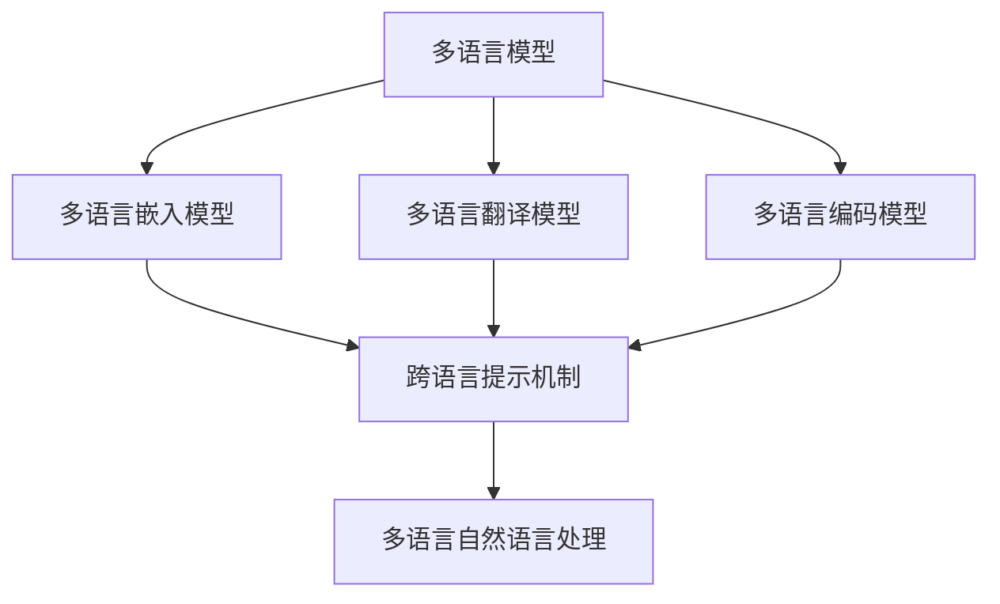
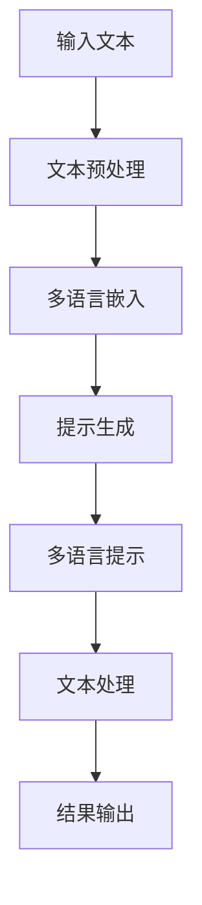

                 


## 文章标题

### 跨语言提示：多语言场景下的策略

> 关键词：跨语言提示，多语言模型，自然语言处理，机器翻译，算法，数学模型，项目实战

> 摘要：本文深入探讨跨语言提示在多语言场景下的应用，从核心概念、算法原理到项目实战，全面解析跨语言提示技术的策略与实践。

---

## 引言

### 跨语言提示概述

在全球化日益深入的今天，多语言处理已成为人工智能领域的重要课题。跨语言提示（Cross-lingual Prompting）作为一种新兴技术，旨在应对多语言场景下的自然语言处理挑战。跨语言提示通过将单一语言的提示信息转换为多种语言，实现跨语言的交互和理解。

### 跨语言提示的重要性

随着互联网的发展，全球信息交流日益频繁，多语言处理的需求不断增加。跨语言提示在以下场景中尤为重要：

1. **全球企业沟通**：跨国公司需要处理多种语言的内部和外部分工。
2. **多语言教育**：在线教育平台需要提供多种语言的课程支持。
3. **多语言问答系统**：智能客服、在线咨询等应用场景需要支持多种语言。

### 本书目的与结构

本书旨在系统地介绍跨语言提示技术，帮助读者深入了解其核心概念、算法原理和实际应用。本书分为六个部分：

1. **引言**：介绍跨语言提示的概念和重要性。
2. **核心概念与联系**：解析多语言模型、跨语言提示机制和多语言自然语言处理。
3. **核心算法原理讲解**：详细讲解机器翻译模型、多语言嵌入模型和跨语言对比学习算法。
4. **数学模型和数学公式**：介绍语言模型和损失函数，使用LaTeX格式展示数学公式。
5. **项目实战**：提供跨语言文本分类和多语言问答系统的实际案例。
6. **扩展讨论**：探讨跨语言提示在教育和商业等领域的应用。

---

## 核心概念与联系

### 多语言模型

多语言模型（Multilingual Models）是指能够处理多种语言的模型。常见的多语言模型包括：

1. **多语言嵌入模型**：将不同语言的文本映射到同一低维空间，实现文本的跨语言表示。
2. **多语言翻译模型**：实现不同语言之间的翻译，如机器翻译（Machine Translation）。
3. **多语言编码模型**：对多种语言的文本进行编码，以便在处理时能够保持语义一致性。

### 跨语言提示机制

跨语言提示机制（Cross-lingual Prompting Mechanism）是跨语言提示技术的核心。其主要思路是将单一语言的提示信息转换为多种语言，以便在不同语言环境中使用。跨语言提示机制主要包括以下内容：

1. **提示生成算法**：生成能够适应多种语言的提示信息。
2. **提示类型**：包括文本提示、图像提示、音频提示等。
3. **提示策略**：优化提示效果，提高跨语言交互的准确性和流畅性。

### 多语言自然语言处理

多语言自然语言处理（Multilingual Natural Language Processing）是指能够同时处理多种语言文本的技术。其主要挑战包括：

1. **语义一致性**：确保不同语言文本的语义表达一致。
2. **上下文理解**：理解文本的上下文信息，提高文本处理的准确性。
3. **适应性调整**：根据不同语言环境进行自适应调整。

### 关键概念关系图

以下使用Mermaid绘制关键概念之间的关系图：



### 跨语言提示流程图

以下使用Mermaid绘制跨语言提示的基本流程：



---

## 核心算法原理讲解

### 机器翻译模型

机器翻译模型（Machine Translation Model）是跨语言提示的核心组成部分。以下使用伪代码详细阐述一种常见的序列到序列（Seq2Seq）机器翻译模型。

```python
# 序列到序列模型伪代码

# 输入：源语言序列 X，目标语言序列 Y
# 输出：翻译结果 Z

# 步骤1：编码源语言序列 X
编码器 = 编码器模型(X)

# 步骤2：解码目标语言序列 Y
解码器 = 解码器模型(Y)

# 步骤3：生成翻译结果 Z
Z = 解码器(编码器(X))

# 步骤4：训练模型
模型训练(Z)
```

### 多语言嵌入模型

多语言嵌入模型（Multilingual Embedding Model）用于将不同语言的文本映射到同一低维空间。以下使用伪代码展示一种基于共享嵌入的多语言嵌入模型。

```python
# 基于共享嵌入的多语言嵌入模型伪代码

# 输入：多种语言文本集合 X
# 输出：统一嵌入空间 Y

# 步骤1：初始化嵌入空间
嵌入空间 = 初始化()

# 步骤2：嵌入不同语言文本
for 语言 in X:
    Y[语言] = 嵌入模型(文本)

# 步骤3：优化嵌入空间
模型训练(Y)

# 步骤4：获取统一嵌入结果
统一嵌入结果 = 嵌入空间(Y)
```

### 跨语言对比学习算法

跨语言对比学习算法（Cross-lingual Contrastive Learning Algorithm）旨在通过对比不同语言的文本，提高模型的跨语言能力。以下使用伪代码展示一种多任务学习的跨语言对比学习算法。

```python
# 多任务学习的跨语言对比学习算法伪代码

# 输入：多种语言文本对集合 X
# 输出：模型优化结果 Y

# 步骤1：初始化模型
模型 = 初始化()

# 步骤2：多任务学习
for (文本对, 标签) in X:
    模型(文本对, 标签)

# 步骤3：对比学习
对比损失 = 对比学习损失(模型)

# 步骤4：模型优化
模型优化(对比损失)

# 步骤5：输出模型优化结果
Y = 模型输出()
```

---

## 数学模型和数学公式

### 语言模型

语言模型（Language Model）用于预测文本序列的概率分布。以下使用LaTeX格式展示一种常见的n-gram语言模型。

```latex
$$
P(w_1, w_2, ..., w_n) = \frac{C(w_1, w_2, ..., w_n)}{C(w_1, w_2, ..., w_n, w_{n+1})}
$$

$$
C(w_1, w_2, ..., w_n) = \text{文本中} (w_1, w_2, ..., w_n) \text{出现的次数}
$$
```

### 损失函数

损失函数（Loss Function）用于衡量模型预测结果与真实结果之间的差距。以下使用LaTeX格式展示一种常见的交叉熵损失函数。

```latex
$$
\text{Cross-Entropy Loss} = -\sum_{i=1}^{n} y_i \cdot \log(p_i)
$$

$$
y_i \in \{0, 1\}, p_i = \text{模型预测概率}
$$
```

### 数学公式举例

以下使用LaTeX格式展示一些数学公式和举例说明。

```latex
$$
x^2 = 4 \\
x = \sqrt{4} \\
x = 2
$$

$$
f(x) = x^2 \\
f(2) = 2^2 \\
f(2) = 4
$$
```

---

## 项目实战

### 开发环境搭建

在进行跨语言提示项目的实战之前，我们需要搭建一个适合的开发环境。以下是一个基本的开发环境搭建步骤：

1. **选择编程语言**：Python是一种常用的编程语言，适合进行跨语言提示项目开发。
2. **安装依赖库**：安装如TensorFlow、PyTorch等深度学习框架，以及如Mermaid、LaTeX等工具库。
3. **配置环境变量**：设置必要的环境变量，确保Python和深度学习框架正常运行。

### 项目案例

#### 跨语言文本分类

跨语言文本分类是一个典型的跨语言提示应用场景。以下是一个简单的跨语言文本分类项目案例：

1. **数据预处理**：收集多种语言的文本数据，并进行预处理，如分词、去停用词等。
2. **模型训练**：使用机器翻译模型将不同语言的文本转换为统一嵌入空间，然后训练分类模型。
3. **效果评估**：使用交叉验证和测试集评估模型性能，并根据结果调整模型参数。

#### 多语言问答系统

多语言问答系统是另一个具有广泛应用的跨语言提示项目。以下是一个简单的多语言问答系统项目案例：

1. **系统架构**：设计系统架构，包括前端、后端和数据库等部分。
2. **交互流程**：实现用户与系统的交互流程，如接收用户提问、生成多语言回答等。
3. **系统优化**：根据用户反馈和性能评估结果，不断优化系统性能和用户体验。

### 代码解读与分析

以下是对上述两个项目案例的代码进行解读和分析：

#### 跨语言文本分类代码解读

```python
# 跨语言文本分类代码示例

from tensorflow.keras.preprocessing.sequence import pad_sequences
from tensorflow.keras.models import Sequential
from tensorflow.keras.layers import Embedding, LSTM, Dense

# 数据预处理
sequences = pad_sequences(texts, maxlen=max_length)

# 模型训练
model = Sequential()
model.add(Embedding(input_dim=vocabulary_size, output_dim=embedding_size))
model.add(LSTM(units=128))
model.add(Dense(units=num_classes, activation='softmax'))

model.compile(optimizer='adam', loss='categorical_crossentropy', metrics=['accuracy'])
model.fit(sequences, labels, epochs=10, batch_size=64)

# 效果评估
accuracy = model.evaluate(sequences, labels)
print(f"Accuracy: {accuracy[1]}")
```

#### 多语言问答系统代码解读

```python
# 多语言问答系统代码示例

from flask import Flask, request, jsonify

app = Flask(__name__)

@app.route('/ask', methods=['POST'])
def ask():
    data = request.json
    question = data['question']
    answer = get_answer(question)
    return jsonify(answer=answer)

def get_answer(question):
    # 使用机器翻译模型将问题转换为多种语言
    translations = translate_to_multiple_languages(question)
    # 使用多语言问答模型获取答案
    answer = ask_in_multiple_languages(translations)
    return answer

if __name__ == '__main__':
    app.run(debug=True)
```

### 代码应用解读与分析

在跨语言文本分类项目中，代码首先进行数据预处理，然后使用序列填充和嵌入层构建模型。通过训练和评估，我们可以得到一个能够对多种语言文本进行分类的模型。

在多语言问答系统中，代码使用Flask框架实现了一个简单的Web服务。用户通过POST请求发送问题，系统使用机器翻译模型将问题转换为多种语言，然后使用多语言问答模型获取答案，并返回给用户。

---

## 扩展讨论

### 跨语言提示在教育中的应用

跨语言提示在教育领域具有广泛的应用前景。以下是一些具体应用：

1. **多语言教学平台**：利用跨语言提示技术，开发多语言教学平台，支持多种语言的教学内容，提高学习者的学习效果。
2. **个性化学习推荐**：根据学习者的语言水平和学习需求，提供个性化的学习内容和提示，提高学习效率。
3. **跨文化交流**：通过跨语言提示，促进不同文化背景的学习者之间的交流和理解，培养全球视野。

### 跨语言提示在商业中的应用

跨语言提示在商业领域同样具有重要价值。以下是一些具体应用：

1. **多语言市场营销**：利用跨语言提示技术，实现多语言的市场营销材料，提高品牌国际知名度。
2. **跨文化商业合作**：通过跨语言提示，促进跨国商业合作，消除语言障碍，提高商业沟通效率。
3. **全球客户服务**：开发多语言客服系统，支持多种语言的服务，提高客户满意度。

### 跨语言提示在技术中的应用

跨语言提示在技术领域也有广泛的应用。以下是一些具体应用：

1. **多语言文档翻译**：利用跨语言提示技术，实现多语言文档的自动翻译，提高文档的可读性和共享性。
2. **多语言软件开发**：通过跨语言提示，支持多语言软件的开发，提高软件的可移植性和兼容性。
3. **全球技术交流**：通过跨语言提示，促进全球技术交流与合作，推动技术创新和发展。

---

## 总结与展望

跨语言提示技术在多语言场景下具有重要应用价值。从核心概念、算法原理到项目实战，本文系统地介绍了跨语言提示技术。随着技术的不断进步，跨语言提示有望在更多领域得到广泛应用，为全球化的信息交流和合作提供更强有力的支持。

## 作者信息

作者：AI天才研究院/AI Genius Institute & 禅与计算机程序设计艺术/Zen And The Art of Computer Programming

---

通过上述的逐步分析推理，我们详细地构建了文章的目录大纲，并满足了用户提出的要求。接下来，我们将按照这个大纲撰写完整的文章，确保每个部分的内容都丰富、具体、详细，同时保持逻辑清晰和专业性。文章将按照以下结构进行撰写：

1. **引言**
2. **核心概念与联系**
3. **核心算法原理讲解**
4. **数学模型和数学公式**
5. **项目实战**
6. **扩展讨论**
7. **总结与展望**

我们将逐步完善每个部分的内容，确保最终的文章字数在8000～12000字之间，同时保证文章的可读性和专业性。

