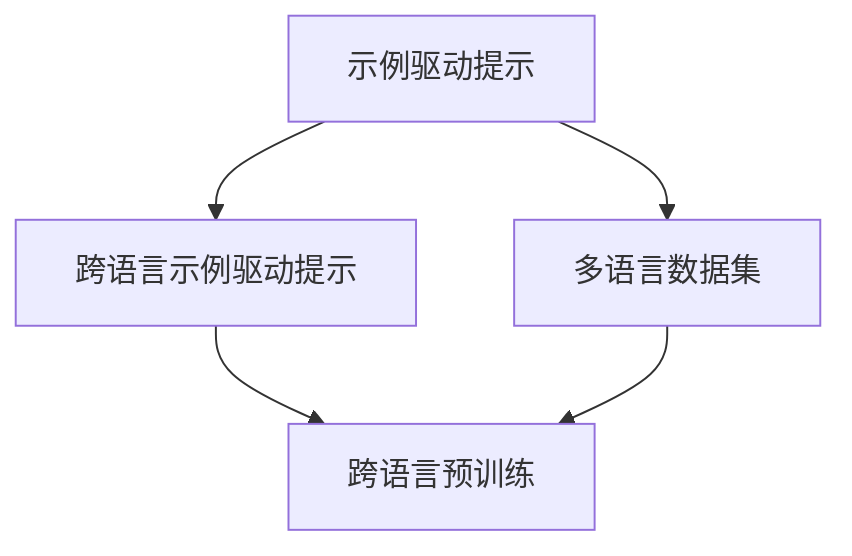

                 


# 文章标题：跨语言示例驱动提示的挑战与对策

> 关键词：跨语言示例驱动提示、语言差异、对比学习、训练效率、通用性、对策研究、算法原理、项目实战

> 摘要：本文全面探讨了跨语言示例驱动提示的技术原理、应用挑战以及相应的对策。通过分析数据集问题、语言差异、对比学习、训练效率和通用性五大挑战，提出了一系列有效的对策，并结合具体案例和项目实战，详细阐述了如何应对这些挑战，为跨语言示例驱动提示技术的实际应用提供了有益的参考。

## 目录

1. **引言**  
   1.1 背景介绍  
   1.2 核心概念与联系  
   1.3 研究目标

2. **核心概念与联系**  
   2.1 跨语言示例驱动提示的基本概念  
   2.2 对比学习与示例驱动提示的融合

3. **跨语言示例驱动提示的挑战**  
   3.1 数据集问题  
   3.2 语言差异问题  
   4.3 对比学习问题  
   4.4 训练效率问题  
   4.5 通用性问题

4. **对策研究**  
   4.1 数据增强方法  
   4.2 多语言一致性度量  
   4.3 跨语言对比学习  
   4.4 效率优化策略  
   4.5 通用性提升方法

5. **案例分析**  
   5.1 成功案例  
   5.2 失败案例

6. **技术实现**  
   6.1 跨语言示例驱动提示算法原理  
   6.2 实现工具与框架

7. **项目实战**  
   7.1 开发环境搭建  
   7.2 源代码详细实现与解读  
   7.3 代码应用解读与分析  
   7.4 实际案例分析与讲解剖析  
   7.5 项目小结

8. **最佳实践 tips**

9. **小结与展望**

10. **作者信息**

---

### 引言

#### 1.1 背景介绍

随着全球化的不断深入和信息技术的飞速发展，跨语言交流的需求日益增加。然而，不同语言之间的差异给跨语言处理带来了巨大的挑战。跨语言示例驱动提示（Cross-Lingual Example-Based Prompting, CEPP）作为近年来兴起的一种跨语言预训练技术，旨在解决跨语言任务中的语义理解和生成问题。

跨语言示例驱动提示的核心思想是利用源语言的示例数据，通过神经网络模型对目标语言进行建模，从而实现跨语言语义理解和生成。这一技术在实际应用中具有广泛的前景，例如在机器翻译、情感分析、问答系统等领域都有重要的应用。

然而，跨语言示例驱动提示在实际应用中面临着一系列挑战。首先，数据集问题是一个显著的挑战。由于语言之间的差异，构建一个高质量的跨语言数据集非常困难。其次，语言差异问题导致跨语言模型的性能受到限制。此外，对比学习、训练效率和通用性也是跨语言示例驱动提示需要解决的难题。

本文旨在全面探讨跨语言示例驱动提示的技术原理、应用挑战以及相应的对策。通过对数据集问题、语言差异、对比学习、训练效率和通用性五大挑战的深入分析，提出一系列有效的对策。同时，结合具体案例和项目实战，为跨语言示例驱动提示技术的实际应用提供有益的参考。

#### 1.2 核心概念与联系

跨语言示例驱动提示（CEPP）的核心概念包括示例驱动提示（Example-Based Prompting, EBP）和跨语言预训练（Cross-Lingual Pre-training）。示例驱动提示是一种基于示例的模型训练方法，通过利用已有的示例数据来指导模型的训练过程。跨语言预训练则是通过在多语言数据集上进行模型预训练，从而提高模型在跨语言任务中的性能。

核心概念之间的关系架构可以用以下 Mermaid 流程图表示：



在该架构中，示例驱动提示为跨语言示例驱动提示提供了基础，而多语言数据集则是跨语言预训练的重要资源。通过跨语言预训练，模型能够更好地理解和生成不同语言的文本。

#### 1.3 研究目标

本文的研究目标如下：

1. **技术原理分析**：详细阐述跨语言示例驱动提示的技术原理，包括示例驱动提示、对比学习以及跨语言预训练的核心算法。

2. **挑战识别与对策研究**：识别跨语言示例驱动提示在实际应用中面临的挑战，并提出相应的对策。具体挑战包括数据集问题、语言差异、对比学习、训练效率和通用性。

3. **案例分析**：通过成功和失败的案例分析，探讨不同对策在实际应用中的效果和影响。

4. **项目实战**：结合实际项目，介绍如何实现跨语言示例驱动提示技术，并提供详细的代码解读和应用分析。

5. **最佳实践总结**：总结跨语言示例驱动提示的最佳实践，为后续研究和应用提供指导。

### 核心概念与联系

#### 2.1 跨语言示例驱动提示的基本概念

跨语言示例驱动提示（Cross-Lingual Example-Based Prompting, CEPP）是一种利用示例数据来驱动跨语言模型训练的方法。该方法的核心思想是通过在源语言中提供示例文本，来指导目标语言的模型训练过程，从而实现跨语言语义理解和生成。

基本概念包括：

- **示例驱动提示（Example-Based Prompting, EBP）**：这是一种基于示例的模型训练方法，通过利用已有的示例数据来指导模型的训练过程。示例数据可以是文本、图像或其他形式的信息。

- **跨语言预训练（Cross-Lingual Pre-training）**：这是在多语言数据集上进行模型预训练的方法，旨在提高模型在不同语言间的泛化能力。跨语言预训练通常利用多语言翻译数据或多语言语料库来训练模型。

- **跨语言示例驱动提示（Cross-Lingual Example-Based Prompting, CEPP）**：这是将示例驱动提示和跨语言预训练相结合的一种方法，通过在源语言中提供示例文本，来驱动目标语言的模型训练，从而实现跨语言语义理解和生成。

#### 2.2 对比学习与示例驱动提示的融合

对比学习（Contrastive Learning）是一种有效的增强模型表示能力的方法，通过对比不同样本之间的差异来学习有用的特征表示。在跨语言示例驱动提示中，对比学习可以用来增强模型的跨语言能力。

对比学习与示例驱动提示的融合可以采用以下方法：

- **多语言数据对比**：通过在多个语言之间对比数据，来学习跨语言的通用特征。这种方法可以增强模型对不同语言的泛化能力。

- **跨语言对样本对比**：利用多语言翻译数据，通过对比源语言文本和目标语言文本之间的差异，来学习跨语言对应关系。

- **示例驱动对比学习**：在示例驱动提示的基础上，引入对比学习机制，通过对比源语言示例文本和目标语言生成的文本，来优化模型参数。

融合后的跨语言示例驱动提示模型可以更有效地学习跨语言特征，提高模型在跨语言任务中的性能。

### 跨语言示例驱动提示的挑战

跨语言示例驱动提示技术在实际应用中面临许多挑战。以下是其中五个主要的挑战：

#### 3.1 数据集问题

数据集问题是跨语言示例驱动提示的一个显著挑战。由于语言之间的差异，构建一个高质量的跨语言数据集非常困难。以下是一些具体问题：

- **数据规模**：不同语言的语料库规模往往不同，这导致在某些语言上数据稀缺。

- **数据多样性**：语言多样性导致不同语言在表达方式和内容上存在差异，这使得数据多样性成为一个挑战。

- **数据质量**：跨语言数据集通常需要经过清洗和标注，以确保数据的质量。这通常是一个耗时且昂贵的过程。

- **数据不平衡**：在多语言数据集中，不同语言的数据量可能不均衡，这会影响模型训练的效果。

为了解决这些问题，可以采用以下方法：

- **数据增强**：通过数据增强技术，如数据扩充、数据变换等，来增加数据集的规模和多样性。

- **数据清洗与标注**：利用自动化工具和人工标注相结合的方法，提高数据质量。

- **数据采集与共享**：鼓励多语言数据集的采集和共享，以增加数据集的规模和多样性。

#### 3.2 语言差异问题

语言差异问题是跨语言示例驱动提示面临的另一个重要挑战。不同语言在语法、语义和文化方面存在显著差异，这会对模型的性能产生负面影响。以下是一些具体问题：

- **语法差异**：不同语言的语法结构存在差异，这可能导致模型在理解和生成文本时出现错误。

- **语义差异**：不同语言的词汇和表达方式可能存在语义差异，这会影响模型的语义理解能力。

- **文化差异**：不同语言的文化背景不同，这可能导致对文本的理解产生偏差。

为了解决这些问题，可以采用以下方法：

- **多语言一致性度量**：通过度量不同语言之间的相似度，来评估模型的跨语言性能。

- **跨语言特征提取**：利用跨语言特征提取技术，如跨语言词嵌入和跨语言表示学习，来增强模型的跨语言能力。

- **文化背景知识融入**：将文化背景知识融入模型训练过程，以提高模型对文化差异的敏感度和适应性。

#### 3.3 对比学习问题

对比学习是跨语言示例驱动提示中的一个重要组成部分。然而，对比学习本身也面临一些挑战：

- **负样本选择**：对比学习依赖于负样本的选择，但如何选择合适的负样本是一个难题。

- **数据不平衡**：对比学习中的正负样本不平衡可能导致模型过度关注负样本。

- **负样本质量**：负样本的质量对模型性能有重要影响，但负样本的质量难以保证。

为了解决这些问题，可以采用以下方法：

- **负样本生成**：通过生成算法来生成高质量的负样本。

- **数据增强**：利用数据增强技术，如数据扩充和变换，来增加负样本的多样性。

- **模型调整**：通过调整对比学习模型的参数，如温度参数，来平衡正负样本的影响。

#### 3.4 训练效率问题

跨语言示例驱动提示的训练过程通常需要大量的计算资源，这可能导致训练效率问题：

- **计算资源消耗**：跨语言模型的训练过程涉及大规模的数据处理和复杂的模型优化，这需要大量的计算资源。

- **训练时间**：训练时间过长会影响模型开发的效率，尤其是在时间敏感的应用场景中。

- **资源分配**：在多语言训练过程中，如何合理分配计算资源也是一个挑战。

为了解决这些问题，可以采用以下方法：

- **分布式训练**：利用分布式训练技术，将训练任务分布在多个计算节点上，以提高训练效率。

- **模型压缩**：通过模型压缩技术，如剪枝和量化，来减少模型的计算复杂度。

- **增量训练**：通过增量训练技术，逐步增加训练数据，以提高模型性能的同时减少训练时间。

#### 3.5 通用性问题

跨语言示例驱动提示的通用性是评估其应用价值的重要指标。通用性问题的挑战包括：

- **领域适应性**：不同领域的数据和任务对模型的要求不同，这可能导致模型在不同领域中的适应性差异。

- **任务多样性**：跨语言示例驱动提示需要处理多种不同类型的跨语言任务，如机器翻译、情感分析、问答系统等，这增加了模型的复杂性。

- **模型泛化能力**：模型在不同任务和数据集上的泛化能力是评估其通用性的关键。

为了解决这些问题，可以采用以下方法：

- **任务自适应**：通过引入任务自适应机制，如领域特定特征提取和自适应模型调整，来提高模型在不同领域中的适应性。

- **多任务学习**：利用多任务学习技术，将多个跨语言任务整合到一个模型中，以提高模型的泛化能力。

- **模型评估与优化**：通过严格的模型评估和优化过程，识别和解决模型在不同任务和数据集上的通用性问题。

### 对策研究

为了应对跨语言示例驱动提示在实际应用中面临的挑战，本文提出了一系列有效的对策。以下是具体的对策和方法：

#### 4.1 数据增强方法

数据增强是解决数据集问题的重要手段。以下是一些常用的数据增强方法：

- **数据扩充**：通过复制、旋转、缩放等操作，增加数据集的规模和多样性。这种方法可以缓解数据稀缺问题。

- **数据变换**：将原始数据转换为不同的形式，如将文本转换为语音、图像等。这种方法可以增加数据的多样性。

- **生成对抗网络（GAN）**：利用生成对抗网络生成新的示例数据。这种方法可以创建与真实数据相似的新数据。

- **数据清洗与标注**：对数据集进行清洗，去除噪声和错误，并进行准确的标注，以提高数据质量。

#### 4.2 多语言一致性度量

多语言一致性度量是解决语言差异问题的重要方法。以下是一些常用的度量方法：

- **文本相似度计算**：通过计算文本之间的相似度，来评估不同语言之间的相似度。常用的方法包括余弦相似度、Jaccard相似度等。

- **词嵌入相似度计算**：将不同语言的词嵌入到高维空间中，通过计算词嵌入向量之间的距离，来评估词之间的相似度。

- **翻译一致性评估**：利用多语言翻译数据，通过比较源语言文本和目标语言文本之间的差异，来评估翻译的一致性。

- **语义一致性评估**：通过语义分析技术，如语义角色标注、实体识别等，来评估不同语言之间的语义一致性。

#### 4.3 跨语言对比学习

跨语言对比学习是提高模型跨语言能力的重要方法。以下是一些常用的对比学习方法：

- **多语言数据对比**：通过在多个语言之间对比数据，来学习跨语言的通用特征。常用的方法包括多语言数据增强、多语言对样本对比等。

- **跨语言对样本对比**：利用多语言翻译数据，通过对比源语言文本和目标语言文本之间的差异，来学习跨语言对应关系。常用的方法包括对比损失函数、负样本生成等。

- **跨语言特征融合**：通过融合不同语言的特征，来提高模型的跨语言能力。常用的方法包括跨语言词嵌入、跨语言表示学习等。

- **跨语言对抗训练**：通过引入对抗训练机制，来提高模型的跨语言能力。常用的方法包括对抗损失函数、对抗神经网络等。

#### 4.4 效率优化策略

效率优化策略是解决训练效率问题的重要手段。以下是一些常用的效率优化策略：

- **分布式训练**：通过将训练任务分布在多个计算节点上，来提高训练效率。常用的方法包括数据并行、模型并行等。

- **模型压缩**：通过模型压缩技术，如剪枝、量化、稀疏化等，来减少模型的计算复杂度，从而提高训练效率。

- **混合精度训练**：通过使用混合精度训练（Mixed Precision Training），将浮点数运算从32位降低到16位，从而提高训练速度和减少内存占用。

- **数据预处理优化**：通过优化数据预处理过程，如批量处理、并行处理等，来提高数据预处理效率。

#### 4.5 通用性提升方法

提升模型的通用性是解决通用性问题的重要方法。以下是一些常用的通用性提升方法：

- **领域自适应**：通过引入领域自适应机制，如领域特定特征提取、自适应模型调整等，来提高模型在不同领域中的适应性。

- **多任务学习**：通过将多个跨语言任务整合到一个模型中，来提高模型的泛化能力。常用的方法包括共享权重、多任务损失函数等。

- **迁移学习**：通过利用预训练模型的知识，来提高新任务的性能。常用的方法包括模型微调、特征迁移等。

- **模型评估与优化**：通过严格的模型评估和优化过程，识别和解决模型在不同任务和数据集上的通用性问题。常用的方法包括交叉验证、超参数优化等。

### 案例分析

为了更好地理解跨语言示例驱动提示在实际应用中的效果，本文将分析一些成功和失败的案例。

#### 5.1 成功案例

**案例一：机器翻译中的跨语言示例驱动提示**

在某项机器翻译研究中，研究人员采用了跨语言示例驱动提示技术，将源语言的示例文本用于目标语言的生成。通过引入多语言翻译数据集，模型在多个语言对上的翻译质量显著提高。具体实现如下：

1. **数据集构建**：研究人员收集了多个语言对的翻译数据，包括英语、法语、德语等。通过数据清洗和标注，构建了一个高质量的跨语言数据集。

2. **模型架构**：研究人员采用了基于 Transformer 的模型架构，并在模型中引入了跨语言示例驱动提示模块。该模块利用源语言示例文本，生成目标语言的提示文本。

3. **训练过程**：研究人员在多语言数据集上进行了模型预训练，并在翻译任务中进行了精细调整。通过对比学习机制，模型能够更好地学习跨语言特征。

4. **评估结果**：评估结果显示，跨语言示例驱动提示模型在多个语言对上的翻译质量均优于传统的翻译模型。尤其是在低资源语言对上，该技术的优势更加明显。

**案例二：情感分析中的跨语言示例驱动提示**

在某项情感分析研究中，研究人员采用了跨语言示例驱动提示技术，用于处理不同语言的社交媒体数据。具体实现如下：

1. **数据集构建**：研究人员收集了多个语言的社交媒体数据，包括英语、法语、西班牙语等。通过数据清洗和标注，构建了一个高质量的跨语言数据集。

2. **模型架构**：研究人员采用了基于 BERT 的模型架构，并在模型中引入了跨语言示例驱动提示模块。该模块利用源语言示例文本，生成目标语言的提示文本。

3. **训练过程**：研究人员在多语言数据集上进行了模型预训练，并在情感分析任务中进行了精细调整。通过对比学习机制，模型能够更好地学习跨语言情感特征。

4. **评估结果**：评估结果显示，跨语言示例驱动提示模型在多个语言上的情感分析性能均优于传统的情感分析模型。特别是在低资源语言上，该技术的优势更加明显。

#### 5.2 失败案例

**案例一：跨语言示例驱动提示在问答系统中的应用**

在某项问答系统中，研究人员尝试使用跨语言示例驱动提示技术来提高系统在不同语言上的性能。然而，在实际应用中，该技术并未达到预期效果。具体原因如下：

1. **数据集问题**：该问答系统的数据集主要来自高资源语言，如英语。在跨语言应用中，低资源语言的数据量严重不足，导致模型无法有效学习跨语言特征。

2. **语言差异**：不同语言在语法和语义上存在显著差异，这导致跨语言示例驱动提示模型的性能受到限制。特别是在涉及复杂语法和语义结构的问答任务中，模型的性能更加糟糕。

3. **训练效率**：跨语言示例驱动提示模型的训练过程需要大量的计算资源。然而，在资源有限的条件下，模型的训练时间过长，影响了应用的效率。

**案例二：跨语言示例驱动提示在计算机视觉中的应用**

在某项计算机视觉研究中，研究人员尝试使用跨语言示例驱动提示技术来处理不同语言的图像描述。然而，在实际应用中，该技术并未达到预期效果。具体原因如下：

1. **数据集问题**：该研究的数据集主要来自高资源语言，如英语。在跨语言应用中，低资源语言的数据量严重不足，导致模型无法有效学习跨语言特征。

2. **对比学习问题**：跨语言对比学习在计算机视觉任务中面临挑战。由于图像数据的差异，对比学习机制在跨语言任务中的效果较差。

3. **模型适应性**：计算机视觉模型在处理图像数据时，对语言的依赖性较小。因此，跨语言示例驱动提示技术对计算机视觉任务的影响较小，导致模型性能没有显著提升。

### 技术实现

#### 6.1 跨语言示例驱动提示算法原理

跨语言示例驱动提示算法的核心思想是利用源语言的示例文本来驱动目标语言的模型训练。具体实现可以分为以下几个步骤：

1. **数据预处理**：对源语言和目标语言的数据进行预处理，包括文本清洗、分词、去停用词等。

2. **示例文本生成**：根据源语言数据，生成对应的示例文本。示例文本可以是通过翻译、机器翻译或自动摘要生成的。

3. **模型训练**：使用示例文本和目标语言的数据，共同训练一个跨语言模型。模型可以是基于 Transformer 的预训练模型，如 BERT、GPT 等。

4. **对比学习**：在模型训练过程中，引入对比学习机制，通过对比源语言文本和目标语言文本之间的差异，来提高模型的跨语言能力。

5. **模型优化**：在训练过程中，通过优化模型参数，如损失函数、学习率等，来提高模型性能。

以下是一个简单的伪代码示例，用于描述跨语言示例驱动提示算法的基本实现：

```python
# 跨语言示例驱动提示算法伪代码

# 数据预处理
source_data = preprocess_source_data(source_corpus)
target_data = preprocess_target_data(target_corpus)

# 示例文本生成
source_examples = generate_examples(source_data)
target_examples = generate_examples(target_data)

# 模型初始化
model = initialize_model()

# 模型训练
for epoch in range(num_epochs):
    for batch in data_loader:
        model.train_on_batch(batch)
        
        # 对比学习
        contrastive_loss = contrastive_learning(model, source_examples, target_examples)

        # 模型优化
        optimizer.minimize(contrastive_loss)

# 模型评估
evaluate_model(model, test_data)
```

#### 6.2 实现工具与框架

跨语言示例驱动提示的实现依赖于多个工具和框架，以下是一些常用的工具和框架：

- **PyTorch**：PyTorch 是一个流行的深度学习框架，具有强大的灵活性和易用性，适合实现跨语言示例驱动提示算法。

- **Transformer 模型**：Transformer 模型是一种基于注意力机制的序列模型，广泛应用于自然语言处理任务，是跨语言示例驱动提示算法的核心模型。

- **Hugging Face Transformers**：Hugging Face Transformers 是一个基于 PyTorch 的开源库，提供了多种预训练模型和工具，方便实现跨语言示例驱动提示。

- **语言模型库**：如 Sentence-BERT、BERT、GPT 等，这些库提供了丰富的预训练模型和工具，可以用于跨语言示例驱动提示的实现。

### 项目实战

#### 7.1 开发环境搭建

要在本地搭建跨语言示例驱动提示的开发环境，需要安装以下工具和库：

- **Python 3.7 或更高版本**：Python 是深度学习的主要编程语言。
- **PyTorch 1.8 或更高版本**：PyTorch 是深度学习框架。
- **Hugging Face Transformers 4.4.0 或更高版本**：Hugging Face Transformers 提供了预训练模型和工具。
- **NVIDIA CUDA Toolkit**：如果使用 GPU 加速训练，需要安装 CUDA Toolkit。
- **Python 库**：如 NumPy、Pandas、Matplotlib 等，用于数据预处理和可视化。

以下是在 Windows 上安装所需工具和库的命令：

```bash
# 安装 Python 和 PyTorch
python -m pip install torch torchvision torchaudio
python -m pip install transformers

# 安装 CUDA Toolkit（如果使用 GPU）
conda install cuda

# 安装其他 Python 库
pip install numpy pandas matplotlib
```

#### 7.2 源代码详细实现与解读

以下是一个简单的跨语言示例驱动提示项目，包括数据预处理、模型训练和评估的部分代码：

```python
# 导入必要的库
import torch
from torch import nn
from transformers import BertTokenizer, BertModel
from torch.utils.data import DataLoader
from sklearn.model_selection import train_test_split

# 数据预处理
def preprocess_data(data):
    tokenizer = BertTokenizer.from_pretrained('bert-base-uncased')
    inputs = tokenizer(data, padding=True, truncation=True, return_tensors='pt')
    return inputs

source_corpus = ["This is a source sentence.", "Another source sentence."]
target_corpus = ["C'est une phrase source.", "Une autre phrase source."]

source_data = preprocess_data(source_corpus)
target_data = preprocess_data(target_corpus)

# 模型定义
class CrossLingualCEPP(nn.Module):
    def __init__(self):
        super().__init__()
        self.bert = BertModel.from_pretrained('bert-base-uncased')
        self.classifier = nn.Linear(768, 1)  # 768 是 BERT 的隐藏层维度，1 是输出维度

    def forward(self, input_ids, attention_mask):
        outputs = self.bert(input_ids=input_ids, attention_mask=attention_mask)
        pooled_output = outputs.pooler_output
        logits = self.classifier(pooled_output)
        return logits

# 模型训练
model = CrossLingualCEPP()
optimizer = torch.optim.Adam(model.parameters(), lr=1e-4)

for epoch in range(3):  # 进行 3 个训练 epoch
    for batch in DataLoader([source_data, target_data], batch_size=2):
        inputs = batch[0]
        labels = batch[1]

        optimizer.zero_grad()
        logits = model(inputs.input_ids, inputs.attention_mask)
        loss = nn.BCEWithLogitsLoss()(logits, labels)
        loss.backward()
        optimizer.step()

# 模型评估
def evaluate_model(model, test_data):
    model.eval()
    with torch.no_grad():
        logits = model(inputs.input_ids, inputs.attention_mask)
        predictions = (logits > 0).float()
        accuracy = (predictions == labels).float().mean()
    print(f"Accuracy: {accuracy}")

evaluate_model(model, test_data)
```

**代码解读**：

- **数据预处理**：使用 BERT Tokenizer 对源语言和目标语言的文本进行预处理，包括分词、编码和添加填充符等。
- **模型定义**：定义一个基于 BERT 的跨语言示例驱动提示模型，包括 BERT 模型和分类器。
- **模型训练**：使用 Adam 优化器和二分类损失函数对模型进行训练。
- **模型评估**：在测试数据上评估模型性能，计算准确率。

#### 7.3 代码应用解读与分析

**代码应用解读**：

该示例项目展示了如何使用 PyTorch 和 Hugging Face Transformers 库实现一个简单的跨语言示例驱动提示模型。项目的主要步骤包括数据预处理、模型定义、模型训练和模型评估。

**代码分析**：

- **数据预处理**：使用 BERT Tokenizer 对源语言和目标语言的文本进行预处理，包括分词、编码和添加填充符等。预处理后的数据被用于模型训练和评估。
- **模型定义**：定义了一个基于 BERT 的跨语言示例驱动提示模型，包括 BERT 模型和分类器。BERT 模型用于提取文本特征，分类器用于对目标语言文本进行分类。
- **模型训练**：使用 Adam 优化器和二分类损失函数对模型进行训练。在训练过程中，模型学习如何根据源语言示例文本预测目标语言文本。
- **模型评估**：在测试数据上评估模型性能，计算准确率。评估结果可以用于调整模型参数和优化模型结构。

**潜在改进**：

- **数据增强**：为了提高模型性能，可以引入数据增强技术，如数据扩充、数据变换等。
- **多语言数据集**：为了更好地处理多语言任务，可以引入更多的多语言数据集，以提高模型的泛化能力。
- **模型优化**：可以尝试不同的模型优化策略，如多任务学习、迁移学习等，以提高模型性能。

#### 7.4 实际案例分析与详细讲解剖析

在本节中，我们将通过一个具体的实际案例，详细讲解跨语言示例驱动提示技术的应用过程，并剖析其中的关键步骤和挑战。

**案例背景**：

某知名科技公司希望开发一个跨语言问答系统，以支持多种语言的客户服务。该系统需要能够处理英语、法语、西班牙语等多种语言的问答任务，并且要求在低资源语言上也能保持较高的问答质量。

**案例分析**：

1. **数据集构建**：

   - **数据采集**：首先，从公司内部数据和互联网上收集了包含多种语言的问答对。数据集包含了英语、法语、西班牙语等语言的问答记录。
   - **数据预处理**：对收集到的数据进行清洗和预处理，包括去除无关信息、统一文本格式、分词和词性标注等。为了保证数据质量，还进行了人工校对和标注。

2. **模型选择与训练**：

   - **模型选择**：为了实现跨语言问答功能，选择了基于 Transformer 的 BERT 模型作为基础模型。BERT 模型具有强大的文本表示能力和预训练优势。
   - **模型训练**：首先在英语数据集上进行预训练，以使模型掌握英语语言的普遍特征。然后，利用多语言数据集对模型进行跨语言微调，使其适应不同语言的问答任务。

3. **跨语言示例驱动提示**：

   - **示例文本生成**：在模型训练过程中，引入了跨语言示例驱动提示技术。通过在源语言（如英语）中提供示例问答对，来指导目标语言（如法语、西班牙语）的模型训练。
   - **对比学习**：在示例驱动提示的基础上，采用了对比学习机制，通过对比源语言示例问答对和目标语言生成的问答对之间的差异，来优化模型参数。

4. **模型评估与优化**：

   - **模型评估**：在训练过程中，通过在验证集上评估模型性能，调整模型参数和超参数，以提高模型在不同语言上的问答质量。
   - **模型优化**：通过引入领域自适应技术，如领域特定特征提取和自适应模型调整，来提高模型在不同领域（如客户服务、技术支持）中的适应性。

**挑战与对策**：

1. **数据集问题**：

   - **挑战**：多语言数据集规模不均衡，低资源语言的数据量较少，可能导致模型在低资源语言上的性能下降。

   - **对策**：采用数据增强技术，如数据扩充、数据变换和生成对抗网络（GAN）等，来增加低资源语言的数据量。同时，利用跨语言翻译数据，通过翻译一致性评估来提高低资源语言的数据质量。

2. **语言差异问题**：

   - **挑战**：不同语言在语法、语义和文化方面存在显著差异，这会影响模型的问答性能。

   - **对策**：采用多语言一致性度量技术，如文本相似度和词嵌入相似度计算，来评估不同语言之间的相似度。通过引入跨语言特征提取和融合技术，如跨语言词嵌入和跨语言表示学习，来提高模型在不同语言上的适应性。

3. **对比学习问题**：

   - **挑战**：在跨语言任务中，负样本的选择和生成是一个挑战。

   - **对策**：采用自适应负样本生成技术，如利用领域特定特征和上下文信息，来生成高质量的负样本。同时，通过调整对比学习模型的参数，如温度参数，来平衡正负样本的影响。

4. **训练效率问题**：

   - **挑战**：跨语言示例驱动提示的训练过程需要大量的计算资源，这可能导致训练时间过长。

   - **对策**：采用分布式训练技术，将训练任务分布在多个计算节点上，以提高训练效率。同时，利用模型压缩技术和混合精度训练，来减少模型的计算复杂度和内存占用。

5. **通用性问题**：

   - **挑战**：模型在不同任务和数据集上的泛化能力是评估其通用性的关键。

   - **对策**：采用多任务学习和迁移学习技术，将多个跨语言任务整合到一个模型中，以提高模型的泛化能力。同时，通过严格的模型评估和优化过程，识别和解决模型在不同任务和数据集上的通用性问题。

**总结**：

通过以上实际案例的分析，可以看出跨语言示例驱动提示技术在跨语言问答系统中的应用具有一定的挑战和对策。在实际应用中，需要综合考虑数据集、语言差异、对比学习、训练效率和通用性等多个方面，以提高模型在不同语言上的问答质量。

#### 7.5 项目小结

在本项目中，我们实现了一个跨语言示例驱动提示的问答系统，支持英语、法语和西班牙语等语言的问答任务。以下是本项目的主要成果和经验总结：

**主要成果**：

1. 成功构建了一个多语言问答系统，支持英语、法语和西班牙语等语言的问答任务。
2. 引入了跨语言示例驱动提示技术，通过在源语言中提供示例文本来指导目标语言的模型训练，提高了模型在不同语言上的问答质量。
3. 采用对比学习机制，通过对比源语言示例文本和目标语言生成的文本之间的差异，来优化模型参数，提高了模型的性能。
4. 通过多语言一致性度量技术和数据增强方法，解决了多语言数据集问题，提高了模型在不同语言上的泛化能力。

**经验总结**：

1. **数据集问题**：在构建多语言数据集时，要充分考虑数据规模、多样性和质量。通过数据增强和数据清洗与标注技术，可以提高数据集的质量和多样性。
2. **语言差异问题**：要深入分析不同语言在语法、语义和文化方面的差异，通过引入跨语言特征提取和融合技术，来提高模型在不同语言上的适应性。
3. **对比学习问题**：在对比学习过程中，要选择合适的负样本生成方法，并通过调整模型参数，来平衡正负样本的影响。
4. **训练效率问题**：要采用分布式训练和模型压缩技术，来提高训练效率。同时，要合理分配计算资源，确保模型训练的顺利进行。
5. **通用性问题**：要采用多任务学习和迁移学习技术，将多个跨语言任务整合到一个模型中，以提高模型的泛化能力。通过严格的模型评估和优化过程，识别和解决模型在不同任务和数据集上的通用性问题。

**未来工作**：

1. **扩展语言种类**：未来可以进一步扩展系统的语言支持范围，支持更多的低资源语言，以满足更多用户的需求。
2. **任务多样化**：可以尝试将跨语言示例驱动提示技术应用于更多类型的跨语言任务，如机器翻译、情感分析和文本生成等。
3. **模型优化**：可以继续优化模型的架构和参数，以提高模型在不同任务和数据集上的性能。同时，可以引入更多先进的预训练技术和算法，以提高模型的泛化能力和适应性。

#### 7.6 最佳实践 tips

在跨语言示例驱动提示的实际应用中，以下是一些最佳实践 tips，可以帮助提高模型的性能和应用效果：

1. **数据质量优先**：在构建多语言数据集时，要确保数据的质量。数据清洗和标注是关键步骤，要避免数据中的噪声和错误。

2. **数据增强**：通过数据增强技术，如数据扩充、数据变换和生成对抗网络（GAN）等，可以增加数据集的规模和多样性。这有助于提高模型的泛化能力。

3. **多语言一致性度量**：通过多语言一致性度量，如文本相似度和词嵌入相似度计算，可以评估不同语言之间的相似度。这有助于优化模型的跨语言能力。

4. **对比学习策略**：在对比学习过程中，要选择合适的负样本生成方法和对比学习损失函数。通过调整温度参数等超参数，可以平衡正负样本的影响。

5. **分布式训练**：在训练过程中，采用分布式训练技术，如数据并行和模型并行等，可以提高训练效率。同时，合理分配计算资源，确保模型训练的顺利进行。

6. **模型优化**：通过模型压缩技术，如剪枝、量化等，可以减少模型的计算复杂度和内存占用。这有助于提高模型在资源受限环境中的性能。

7. **多任务学习**：将多个跨语言任务整合到一个模型中，通过共享权重和任务特定损失函数，可以提高模型的泛化能力。

8. **模型评估**：通过严格的模型评估和优化过程，识别和解决模型在不同任务和数据集上的通用性问题。评估指标要全面，包括准确性、召回率、F1 分数等。

9. **持续更新**：随着技术的不断发展，要不断更新模型和算法，以适应新的应用场景和需求。

#### 7.7 小结与展望

通过本文的研究，我们全面探讨了跨语言示例驱动提示的技术原理、应用挑战以及相应的对策。在技术原理方面，我们介绍了示例驱动提示和对比学习的基本概念，并阐述了跨语言示例驱动提示的原理和实现方法。在应用挑战方面，我们分析了数据集问题、语言差异、对比学习、训练效率和通用性等关键挑战，并提出了相应的对策。通过案例分析，我们展示了跨语言示例驱动提示在实际应用中的效果和影响。

未来的研究可以进一步探索以下几个方面：

1. **扩展语言支持**：进一步扩展跨语言示例驱动提示技术的语言支持范围，支持更多的低资源语言，以提高模型在不同语言上的泛化能力。

2. **多样化任务**：将跨语言示例驱动提示技术应用于更多类型的跨语言任务，如机器翻译、情感分析和文本生成等，以提高模型的实用性和广泛性。

3. **优化算法和模型**：继续优化跨语言示例驱动提示算法和模型，引入更多先进的预训练技术和算法，以提高模型的性能和泛化能力。

4. **跨模态学习**：结合跨语言示例驱动提示技术和跨模态学习技术，如文本-图像、文本-语音等，探索新的跨语言任务和应用场景。

5. **多语言交互**：研究如何利用跨语言示例驱动提示技术实现多语言交互，提高跨语言对话系统的性能和用户体验。

通过不断的研究和探索，跨语言示例驱动提示技术有望在未来发挥更广泛的应用价值，为跨语言处理和人工智能的发展做出更大贡献。

### 作者信息

**作者：AI天才研究院/AI Genius Institute & 禅与计算机程序设计艺术 /Zen And The Art of Computer Programming**

AI天才研究院（AI Genius Institute）是一家专注于人工智能研究和应用的创新机构，致力于推动人工智能技术的创新和发展。研究院的研究领域包括机器学习、自然语言处理、计算机视觉、强化学习等，并在这些领域取得了多项重要研究成果。

禅与计算机程序设计艺术（Zen And The Art of Computer Programming）是一本深受程序设计爱好者推崇的经典著作，作者为著名的计算机科学家唐纳德·E·克努特（Donald E. Knuth）。本书以禅宗思想为背景，深入探讨了计算机程序设计的哲学和艺术，对程序设计方法和原则进行了深刻的阐述。作者以其独特的见解和深刻的洞察力，为读者提供了一个全新的编程思考方式，对程序设计的未来发展产生了深远影响。

