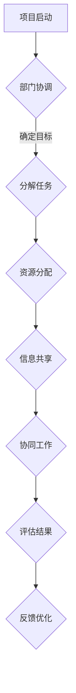

                 

# 《跨部门协作模式：应对大型应用开发的复杂性》

## 摘要

在当今快速发展的信息技术时代，大型应用开发项目的复杂性日益增加，跨部门协作成为了实现项目成功的关键因素。本文旨在探讨跨部门协作模式，通过分析其背景、重要性、理论基础、实践方法以及面临的挑战，为读者提供一套全面且实用的指导框架，以应对大型应用开发中的复杂性。文章首先介绍了跨部门协作的背景，包括其起源、发展以及在不同领域的应用。随后，文章详细阐述了跨部门协作的核心概念、模式以及其与复杂性科学的关系。接着，本文通过实例分析，展示了跨部门协作在沟通、协调、组织与管理等方面的实践策略。此外，文章还探讨了跨部门协作中可能遇到的问题及解决方案，最后对跨部门协作的未来趋势进行了展望，并为读者提供了实用的建议和拓展阅读资源。

## 引言

### 跨部门协作的背景与重要性

跨部门协作在现代企业管理中占据着重要地位。随着企业规模的扩大和业务复杂度的增加，单一部门已无法满足项目的全部需求。跨部门协作成为了企业应对复杂业务挑战、提高运营效率、实现协同创新的必要手段。在软件开发领域，跨部门协作尤其重要。大型应用开发项目通常涉及多个技术领域和业务模块，需要不同部门之间的紧密配合和协作。

### 大型应用开发的复杂性

大型应用开发的复杂性主要体现在以下几个方面：

1. **需求多样性**：用户需求不断变化，需求多样，需要各部门协同工作，确保需求的全面理解和满足。
2. **技术复杂性**：涉及多种技术栈和工具，需要不同技术团队之间的知识共享和资源整合。
3. **时间压力**：项目周期往往较短，需要在短时间内完成高质量的开发和测试工作。
4. **资源分配**：资源的合理分配和调度是项目成功的关键，跨部门协作有助于优化资源利用。

### 书的框架与目标读者

本文将以逻辑清晰、结构紧凑、简单易懂的方式，系统地探讨跨部门协作模式。全文分为十章，涵盖跨部门协作的背景、理论基础、实践方法、案例分析、挑战与解决方案等内容。本文的目标读者包括：

- 管理层：需要了解跨部门协作的重要性和方法，以提高项目管理效率。
- 技术团队负责人：需要掌握跨部门协作的具体策略和工具，以实现项目的顺利推进。
- 软件开发工程师：需要了解跨部门协作的实践应用，以提高个人和团队的工作效率。

通过本文的阅读，读者将能够全面了解跨部门协作模式，掌握其实践方法，并能够在实际工作中应用这些方法，解决大型应用开发中的复杂性问题。

### 第2章 跨部门协作模式概述

#### 跨部门协作的定义与类型

跨部门协作是指在组织内部，不同部门之间为了共同完成某一任务或实现某一目标而进行的合作。它不仅仅是简单的任务分配，更强调部门间的信息共享、资源整合和协同工作。

跨部门协作的类型可以分为以下几种：

1. **垂直型协作**：以组织层级为基础，上下级部门之间的协作，如研发部门与市场部门之间的信息传递和任务执行。
2. **水平型协作**：同一层级不同部门之间的协作，如产品部门与研发部门在产品设计和技术实现中的沟通与协调。
3. **矩阵型协作**：结合了垂直型和水平型协作的特点，适用于复杂项目中的多部门合作，如研发部门、市场部门与运营部门在市场推广活动中的协作。

#### 跨部门协作模式的核心概念

跨部门协作模式的核心概念包括：

1. **协同工作**：各部门共同完成一项任务，相互依赖、相互支持。
2. **信息共享**：通过有效的沟通机制，实现信息的透明和流通。
3. **资源整合**：将不同部门的资源进行优化配置，提高资源利用效率。
4. **目标导向**：明确项目的目标和期望结果，确保协作的针对性和有效性。
5. **流程管理**：建立规范的协作流程，确保协作的有序进行。

#### 跨部门协作模式的 Mermaid 流程图

以下是一个简化的跨部门协作模式 Mermaid 流程图：



在该流程图中，项目启动后，首先进行部门协调，明确项目目标和任务分解。然后进行资源分配和信息共享，确保各部门能够有效协同工作。最后，对项目结果进行评估和反馈，不断优化协作流程。

通过上述流程，跨部门协作能够有条不紊地进行，各部门在协作中相互支持、共同推进项目进展。这种模式不仅提高了工作效率，也促进了部门间的沟通和理解，为大型应用开发提供了有力的保障。

### 第3章 复杂性科学在跨部门协作中的应用

#### 复杂性科学的原理与模型

复杂性科学是一门研究复杂系统行为的跨学科领域，它探讨的是由大量相互作用的个体组成的系统的整体行为。在复杂性科学中，常用的原理和模型包括：

1. **复杂性网络模型**：该模型通过研究网络结构及其动态行为，揭示了系统内各个节点（部门）之间的相互作用和协作关系。
2. **自组织模型**：自组织是指系统在没有外部指令的情况下，通过内部相互作用自发形成有序结构。在跨部门协作中，自组织模型有助于实现各部门的自主协调和合作。
3. **适应性模型**：适应性模型强调系统在面临不确定性时的动态调整能力。在跨部门协作中，适应性有助于各部门根据项目进展和环境变化，灵活调整协作策略。

#### 复杂性科学在跨部门协作中的应用场景

复杂性科学在跨部门协作中有着广泛的应用场景，以下是一些典型的应用：

1. **项目管理**：利用复杂性科学的方法，可以更好地理解和管理项目中的复杂关系，提高项目规划和执行的科学性。
2. **团队协调**：通过构建复杂性网络模型，可以揭示团队协作中的瓶颈和关键节点，从而优化协作流程，提升团队效率。
3. **风险控制**：在复杂项目中，不确定性是常见现象。利用复杂性科学的原理，可以识别和评估潜在风险，制定有效的风险管理策略。

#### 伪代码阐述复杂性科学模型在跨部门协作中的应用

以下是一个简化的伪代码示例，用于说明复杂性科学模型在跨部门协作中的应用：

```python
# 初始化部门网络模型
department_network = initialize_network(num_departments)

# 定义部门间的协作关系和权重
for department in department_network:
    department.set_connections(department_network)

# 定义自组织协作规则
def organization_rules(department):
    # 根据部门历史协作记录，调整连接权重
    department.adjust_connections(department_network)
    # 根据项目目标和当前状态，调整协作策略
    department.update协作策略()

# 模拟跨部门协作过程
while not project_completed:
    # 各部门执行任务
    for department in department_network:
        department.execute_task()
    # 更新网络模型和协作状态
    department_network.update_model()
    organization_rules()

# 评估协作效果
evaluation_results = evaluate_collaboration(department_network)
print("协作效果评估：", evaluation_results)
```

在该伪代码中，首先初始化一个部门网络模型，然后定义部门间的协作关系和权重。通过自组织规则，各部门根据历史协作记录和项目目标，动态调整协作策略和连接权重。在协作过程中，各部门执行任务，并不断更新网络模型和协作状态。最终，通过评估协作效果，可以分析跨部门协作的成功程度和改进方向。

通过上述应用，复杂性科学为跨部门协作提供了理论支持和工具方法，有助于更有效地应对大型应用开发中的复杂性。

### 第4章 跨部门协作的沟通与协调

#### 沟通在跨部门协作中的重要性

在跨部门协作中，沟通是确保项目顺利进行的关键因素。良好的沟通能够确保各部门在任务执行过程中保持信息的一致性，减少误解和冲突，提高协作效率。以下是沟通在跨部门协作中的一些重要性：

1. **信息传递**：跨部门协作需要各部门之间传递大量的信息，包括需求、任务进展、问题反馈等。有效的沟通能够确保信息准确无误地传递。
2. **需求理解**：在项目初期，各部门需要明确项目的目标和需求。良好的沟通有助于各部门准确理解项目需求，从而制定合理的计划和策略。
3. **冲突解决**：在协作过程中，各部门可能会因为资源分配、任务分工等问题产生冲突。有效的沟通能够及时解决这些问题，避免影响项目的进展。
4. **协同工作**：跨部门协作需要各部门在任务执行过程中紧密配合，共同推进项目进展。良好的沟通能够确保各部门在协作中保持步调一致。

#### 协调策略与技巧

为了确保跨部门协作的顺利进行，需要采取一系列协调策略与技巧。以下是几种常见的协调策略与技巧：

1. **设立协调角色**：在项目团队中设立专门的协调角色，如项目经理或协调员，负责协调各部门之间的沟通和协作。
2. **定期会议**：定期召开跨部门协作会议，让各部门负责人共同讨论项目的进展、问题和需求，确保信息畅通。
3. **沟通平台**：利用高效的沟通平台，如邮件、即时通讯工具、项目管理软件等，确保各部门能够实时获取和传递信息。
4. **明确责任与权限**：在项目开始前，明确各部门的任务分工和责任，确保每个部门都知道自己的职责和权限，避免出现职责不清、互相推诿的情况。
5. **透明化流程**：建立透明的协作流程，让每个部门都能了解项目的进展情况、存在的问题和下一步的计划，减少信息不对称。

#### 案例分析：成功的跨部门沟通与协调实践

以下是一个成功的跨部门沟通与协调实践案例：

**案例背景**：某大型互联网公司正在开发一款全新的社交应用，项目涉及多个部门，包括产品部门、研发部门、市场部门等。

**案例过程**：

1. **设立协调角色**：公司任命了一位项目经理负责协调各部门之间的工作。项目经理定期召开跨部门协作会议，确保各部门及时沟通和协调。

2. **定期会议**：项目经理每周召开一次跨部门协作会议，各部门负责人参加。会议内容包括项目进展报告、问题反馈和需求讨论。通过会议，各部门能够及时了解项目的进展和存在的问题。

3. **沟通平台**：公司采用了一套高效的项目管理软件，各部门可以在平台上实时更新项目进展、提交问题和反馈建议。这个平台不仅方便了信息传递，还提供了任务分配和进度跟踪功能。

4. **明确责任与权限**：在项目开始前，项目经理与各部门负责人共同制定了详细的任务分工和责任分配表。每个部门都清楚自己的职责和权限，确保项目顺利推进。

5. **透明化流程**：项目经理通过项目管理软件，将项目的进展情况、问题和需求透明化。每个部门都能随时查看项目的最新动态，确保协作过程中信息畅通。

**案例结果**：通过有效的跨部门沟通与协调，这款社交应用在短时间内顺利上线，并取得了良好的市场反响。各部门在项目过程中紧密配合，共同克服了各种困难和挑战，确保了项目的成功。

通过这个案例，我们可以看到，成功的跨部门沟通与协调实践需要明确的协调角色、定期会议、高效的沟通平台、明确的责任与权限以及透明的流程。这些措施不仅提高了协作效率，也确保了项目的顺利进行。

### 第5章 跨部门协作的组织与管理

#### 团队角色的设定与职责分配

在跨部门协作中，明确团队角色的设定与职责分配是确保协作顺利进行的重要步骤。以下是一些关键团队角色的设定及其职责：

1. **项目经理**：项目经理是整个项目的负责人，负责制定项目计划、协调各部门之间的工作、解决项目中遇到的问题，确保项目按时、按质完成。

2. **部门负责人**：部门负责人负责本部门的任务执行，协调团队成员之间的工作，确保部门任务按时、高质量完成。

3. **技术专家**：技术专家负责技术方案的设计、开发与实现，为项目提供技术支持，解决技术难题。

4. **业务分析师**：业务分析师负责分析用户需求、撰写需求文档，确保项目开发方向与用户需求一致。

5. **测试工程师**：测试工程师负责对项目进行全面的测试，确保项目的功能和质量符合预期。

6. **产品经理**：产品经理负责产品规划和设计，确保产品符合市场需求和用户期望。

#### 项目管理方法在跨部门协作中的应用

在跨部门协作中，应用合适的项目管理方法有助于提高协作效率，确保项目顺利进行。以下是一些常用的项目管理方法：

1. **敏捷开发**：敏捷开发强调快速迭代和持续交付，通过频繁的会议和反馈，确保项目能够快速响应变化和需求。

2. **Scrum**：Scrum是一种敏捷开发方法，通过每日站会、迭代回顾和规划会议，确保团队成员保持高效的协作。

3. **Kanban**：Kanban通过看板管理方法，可视化项目的进展和任务状态，帮助团队成员了解项目的整体情况，避免任务积压。

4. **项目管理软件**：利用项目管理软件（如JIRA、Trello等），可以实现对项目任务的分配、跟踪和监控，提高协作效率。

#### 案例分析：有效的跨部门组织与管理实践

以下是一个成功的跨部门组织与管理实践案例：

**案例背景**：某电子商务公司计划上线一款新的购物应用，项目涉及研发部门、产品部门、市场部门等。

**案例过程**：

1. **团队角色设定**：公司明确了项目经理、部门负责人、技术专家、业务分析师、测试工程师和产品经理等团队角色，并为他们分配了相应的职责。

2. **项目管理方法**：项目经理采用Scrum方法，每两周进行一次迭代，通过每日站会和迭代回顾，确保团队成员之间的有效沟通和协作。

3. **Kanban看板**：项目团队在项目管理软件中创建了Kanban看板，将任务分为“待办”、“进行中”和“已完成”三个状态，实时更新任务状态，确保任务进展透明。

4. **需求管理**：业务分析师与产品经理密切合作，定期召开需求评审会议，确保需求文档的准确性和完整性，并及时调整开发方向。

5. **质量保证**：测试工程师在整个开发过程中进行了严格的测试，确保项目的功能和质量符合预期。

**案例结果**：通过有效的跨部门组织与管理，该购物应用在短时间内顺利上线，用户体验良好，市场反响热烈。各部门在项目过程中紧密配合，共同克服了各种挑战，确保了项目的成功。

通过这个案例，我们可以看到，成功的跨部门组织与管理实践需要明确的团队角色设定、合适的项目管理方法、有效的需求管理和严格的质量保证。这些措施不仅提高了协作效率，也确保了项目的顺利进行。

### 第6章 跨部门协作策略与工具

#### 跨部门协作策略概述

在跨部门协作中，制定有效的策略至关重要。以下是一些常见的跨部门协作策略：

1. **明确目标与职责**：确保每个部门都明确自己的目标和职责，避免职责重叠和推诿现象。

2. **建立沟通机制**：设立定期的沟通会议，确保各部门能够及时交流信息和解决问题。

3. **共享资源与信息**：通过共享平台或工具，实现各部门之间的信息透明，提高协作效率。

4. **灵活调整策略**：根据项目进展和环境变化，灵活调整协作策略，确保项目目标的实现。

5. **强化团队文化**：培养团队间的信任和合作精神，促进跨部门协作的顺利进行。

#### 常用协作工具介绍与应用

在跨部门协作中，选择合适的协作工具可以提高工作效率，以下是一些常用的协作工具：

1. **项目管理软件**：如JIRA、Trello、Asana等，用于任务分配、进度跟踪和团队协作。

2. **即时通讯工具**：如Slack、Microsoft Teams、WhatsApp等，用于实时沟通和协作。

3. **文档共享平台**：如Google Docs、Dropbox、OneDrive等，用于文档共享和协同编辑。

4. **视频会议工具**：如Zoom、Microsoft Teams、Google Meet等，用于远程会议和在线交流。

5. **协作平台**：如Confluence、Notion等，用于知识管理和团队协作。

#### 代码示例：使用协作工具实现跨部门协作

以下是一个简化的代码示例，展示了如何使用协作工具实现跨部门协作：

```python
import slack
import confluence
import asana

# 初始化协作工具
slack_client = slack.SlackClient(api_key="your_slack_api_key")
confluence_client = confluence.ConfluenceClient(base_url="your_confluence_base_url", username="your_confluence_username", password="your_confluence_password")
asana_client = asana.AsanaClient(api_key="your_asana_api_key")

# 发送通知
def send_notification(channel, message):
    slack_client.chat_postMessage(channel=channel, text=message)

# 创建任务
def create_task(project, name, description):
    task = asana_client.tasks.create(project=project, name=name, description=description)
    return task

# 更新文档
def update_document(space, title, content):
    page = confluence_client.pages.create(space=space, title=title, content=content)
    return page

# 实现跨部门协作
def collaborate():
    # 发送通知
    send_notification("#general", "项目启动，各部门请注意！")
    
    # 创建任务
    project = asana_client.projects.get(id="your_project_id")
    task = create_task(project, "编写需求文档", "请产品部门编写并提交需求文档。")
    
    # 更新文档
    space = "your_confluence_space"
    title = "需求文档"
    content = "## 需求概述\n\n描述项目需求。"
    page = update_document(space, title, content)
    
    # 更新任务状态
    asana_client.tasks.update(id=task.id, name="任务完成", status="Completed")

# 执行协作流程
collaborate()
```

在该示例中，我们首先初始化了Slack、Confluence和Asana的协作工具，然后定义了发送通知、创建任务和更新文档的函数。通过调用这些函数，可以实现跨部门协作的流程，包括通知发送、任务创建和文档更新。这个示例展示了如何利用协作工具实现跨部门之间的信息共享和任务协同，提高了协作效率和效果。

### 第7章 跨部门协作的文化建设

#### 跨部门协作文化的核心要素

跨部门协作文化是指组织内部不同部门之间为了实现共同目标而形成的协作理念和价值观。建设良好的跨部门协作文化对于提升组织整体协作效率至关重要。以下是一些核心要素：

1. **共同目标**：明确组织的目标和愿景，确保各部门在协作过程中目标一致，形成合力。
2. **信任与尊重**：建立信任和尊重的基础，鼓励各部门之间开放沟通、分享信息，减少误解和冲突。
3. **合作精神**：鼓励团队合作，强调集体利益，培养员工为共同目标努力的精神。
4. **信息透明**：保持信息透明，确保各部门能够及时了解项目进展和问题，提高协作效率。
5. **公平与正义**：确保资源分配公平，奖励机制合理，激励各部门积极参与跨部门协作。

#### 建立和加强跨部门协作文化的策略

以下是一些建立和加强跨部门协作文化的策略：

1. **领导力培训**：通过领导力培训，提高管理层对跨部门协作重要性的认识，培养领导者的协作能力和领导力。
2. **跨部门团队建设活动**：定期组织跨部门团队建设活动，增强团队成员之间的互信和合作精神。
3. **激励与奖励机制**：建立公平的激励与奖励机制，鼓励员工积极参与跨部门协作，对表现优秀的团队和个人给予表彰和奖励。
4. **培训与分享**：开展跨部门协作培训，分享成功的跨部门协作案例和经验，提高员工的协作意识和能力。
5. **信息共享平台**：建立高效的跨部门信息共享平台，确保各部门能够方便地获取和分享信息，促进协作。

#### 案例分析：跨部门协作文化的成功实践

以下是一个成功的跨部门协作文化案例：

**案例背景**：某大型科技公司为了提高研发效率，决定在公司内部推行跨部门协作文化。

**案例过程**：

1. **领导力培训**：公司高层领导参与了跨部门协作的领导力培训，深入了解了跨部门协作的重要性和方法，并在公司内部推广协作理念。

2. **跨部门团队建设活动**：公司定期组织跨部门团队建设活动，如团队拓展训练、团队聚餐等，增强了团队成员之间的互信和合作精神。

3. **激励与奖励机制**：公司制定了跨部门协作的激励与奖励机制，对在跨部门协作中表现优秀的团队和个人给予表彰和奖励，激发了员工参与跨部门协作的积极性。

4. **培训与分享**：公司开展了多次跨部门协作培训，邀请了外部专家分享成功的跨部门协作案例和经验，提高了员工的协作意识和能力。

5. **信息共享平台**：公司建立了高效的跨部门信息共享平台，各部门可以通过平台实时获取和分享项目进展、问题和需求，提高了协作效率。

**案例结果**：通过一系列措施，公司成功建立了跨部门协作文化，项目研发效率显著提高，员工之间的合作更加紧密，公司整体竞争力得到了提升。

通过这个案例，我们可以看到，成功的跨部门协作文化建设需要领导层的重视和推动，有效的团队建设活动，公平的激励与奖励机制，以及高效的培训和信息共享平台。这些措施不仅促进了跨部门协作，也提升了组织的整体绩效。

### 第8章 跨部门协作成功案例分析

#### 案例一：大型软件开发项目中的跨部门协作

**案例背景**：某国际知名软件公司计划开发一款大型企业资源规划（ERP）系统，项目涉及研发、测试、产品管理、业务分析和市场营销等多个部门。

**案例过程**：

1. **项目管理与沟通**：公司采用敏捷开发方法，每两周进行一次迭代。项目经理组织跨部门协作会议，确保各部门了解项目进展、任务分配和需求变更。

2. **需求管理**：业务分析师与产品经理密切合作，通过需求评审会议和迭代反馈，确保需求文档的准确性和可行性。

3. **研发与测试协作**：研发团队和测试团队采用持续集成和持续部署（CI/CD）流程，实时反馈和修复问题，确保软件质量。

4. **市场营销协作**：市场营销团队参与项目规划，了解产品特性，制定市场推广策略，确保产品发布后能够迅速占领市场。

**案例结果**：该项目在两年内成功完成，系统功能完善，用户体验良好，获得了客户的高度评价。各部门在项目过程中紧密配合，共同克服了技术难题和市场挑战，实现了项目的成功。

#### 案例二：跨部门协作在市场营销活动中的应用

**案例背景**：某知名零售企业计划推出一次大型促销活动，活动涉及市场部门、销售部门、供应链部门和客户服务部门。

**案例过程**：

1. **活动策划与沟通**：市场部门制定促销活动方案，组织跨部门协作会议，确保各部门了解活动目标、时间和资源需求。

2. **资源调配**：供应链部门提前安排货源和物流，销售部门安排门店促销活动，客户服务部门准备应对活动期间可能出现的问题。

3. **活动执行与监控**：各部门在活动期间密切配合，实时监控活动进展，及时调整策略，确保活动顺利进行。

4. **数据分析和反馈**：活动结束后，各部门共同分析活动数据，总结经验教训，为下一次活动提供参考。

**案例结果**：活动取得了巨大成功，销售额大幅增长，品牌知名度提高。各部门在活动过程中紧密协作，共同应对了各种挑战，确保了活动的成功。

#### 案例三：跨国公司跨部门协作的经验与教训

**案例背景**：某跨国公司在中国和印度设有研发中心，公司计划在两个国家同步开发一款移动应用。

**案例过程**：

1. **项目管理与沟通**：公司采用统一的项目管理工具，确保中国和印度的研发团队能够实时了解项目进展。

2. **时间同步**：公司安排跨时区会议，确保中国和印度的研发团队能够同步参与项目讨论和决策。

3. **技术共享**：印度研发中心在技术方面具有优势，中国研发中心在用户体验方面有独到见解，两团队通过定期交流，实现了技术和设计的融合。

4. **文化差异管理**：公司注重文化差异的管理，通过跨文化培训，提高团队成员对文化差异的认知和适应能力。

**案例结果**：该项目在短时间内完成，产品得到了全球用户的认可。通过成功的跨部门协作，公司不仅提高了研发效率，也增强了全球团队的协作能力。

这三个案例展示了跨部门协作在不同领域的成功实践，通过有效的沟通、资源调配和团队协作，实现了项目的顺利推进和成功。这些经验为其他企业在跨部门协作中提供了宝贵的借鉴。

### 第9章 跨部门协作的挑战与解决方案

#### 跨部门协作中的常见问题

在跨部门协作中，常见的问题包括：

1. **信息不对称**：不同部门之间信息传递不畅，导致各部门对项目进展和需求的理解不一致。
2. **职责不清**：各部门之间的任务分工不明确，导致任务重叠或责任推诿。
3. **沟通障碍**：不同部门之间的沟通机制不完善，导致沟通效率低下，问题解决不及时。
4. **资源冲突**：各部门之间的资源分配不均衡，导致资源浪费或资源争夺。
5. **文化差异**：不同部门之间的文化差异，导致协作过程中的冲突和误解。

#### 解决方案与对策

针对上述问题，以下是一些解决方案与对策：

1. **信息共享平台**：建立统一的信息共享平台，确保各部门能够实时获取和传递信息，提高信息透明度。
2. **明确的职责分工**：在项目启动前，明确各部门的任务分工和职责，确保任务不重叠、不推诿。
3. **沟通机制建设**：建立定期的沟通机制，如跨部门会议、即时通讯工具等，确保沟通渠道畅通，问题能够及时解决。
4. **资源调配策略**：制定合理的资源调配策略，确保资源能够在各部门之间合理分配和流动，避免资源浪费。
5. **文化差异管理**：开展跨文化培训，提高团队成员对文化差异的认知和适应能力，促进文化融合。

#### 案例分析：克服跨部门协作难题的实践

以下是一个成功克服跨部门协作难题的案例：

**案例背景**：某全球知名的软件公司在中国和印度设有研发中心，公司计划在两个国家同步开发一款移动应用。

**案例过程**：

1. **信息共享平台**：公司采用统一的项目管理工具（如JIRA），确保中国和印度的研发团队能够实时查看项目进展、任务分配和需求变更。

2. **明确的职责分工**：在项目启动前，公司明确了中国和印度研发团队的任务分工，确保任务不重叠、不推诿。每个团队负责不同的模块开发，但保持相互之间的沟通和协调。

3. **沟通机制建设**：公司建立了定期的沟通机制，包括每周的跨时区会议和即时通讯工具（如Slack），确保中国和印度的研发团队能够及时交流信息、解决问题。

4. **资源调配策略**：公司制定了合理的资源调配策略，确保两地的研发团队能够共享资源和信息，避免资源浪费。例如，印度研发中心在技术方面有优势，中国研发中心在用户体验方面有独到见解，两团队通过定期交流，实现了技术和设计的融合。

5. **文化差异管理**：公司注重文化差异的管理，通过跨文化培训，提高团队成员对文化差异的认知和适应能力，促进文化融合。

**案例结果**：通过上述措施，公司在短时间内成功完成了移动应用的研发，产品得到了全球用户的认可。跨部门协作的难题得到了有效克服，公司的研发效率和协作能力得到了显著提升。

通过这个案例，我们可以看到，有效的跨部门协作需要信息共享平台、明确的职责分工、沟通机制建设、资源调配策略和文化差异管理等多种措施的综合运用。这些措施不仅提高了协作效率，也确保了项目的成功。

### 第10章 跨部门协作的未来趋势

#### 当前跨部门协作的发展趋势

随着信息技术的不断进步和企业管理理念的更新，跨部门协作正朝着更加高效、智能和人性化的方向发展。以下是当前跨部门协作的几个主要发展趋势：

1. **数字化转型**：越来越多的企业将数字化工具应用于跨部门协作，如云计算、大数据、人工智能等，以提高协作效率和决策质量。
2. **敏捷协作**：敏捷开发方法在全球范围内得到广泛应用，跨部门协作逐渐向敏捷、迭代、自组织的方向发展，以适应快速变化的市场需求。
3. **知识共享**：知识管理平台和协作工具的普及，使得跨部门间的知识共享和经验传承变得更加容易，有助于提高整个组织的创新能力。
4. **远程办公**：远程办公的普及，尤其是新冠疫情后的工作模式转变，使得跨部门协作不再受地域限制，更加灵活和高效。
5. **文化融合**：随着全球化进程的加速，企业越来越重视跨文化的融合和沟通，跨部门协作中的文化差异管理成为重要课题。

#### 跨部门协作的未来展望

展望未来，跨部门协作将继续在以下几个方面取得突破：

1. **智能化协作**：人工智能技术将深度应用于跨部门协作，如智能会议助手、智能任务分配、智能问题诊断等，提高协作的智能化和自动化水平。
2. **人本管理**：随着员工对工作环境和质量的要求不断提高，企业将更加注重人本管理，关注员工的情感和需求，提升员工的参与感和满意度。
3. **生态协同**：企业内部不同部门和外部合作伙伴之间的协作将更加紧密，形成生态协同，共同应对复杂的市场环境和挑战。
4. **平台化发展**：协作平台将逐渐成为企业内部的核心系统，整合各种协作工具和资源，提供一站式服务，提升跨部门协作的整体效能。
5. **社会责任**：企业将在跨部门协作中更加注重社会责任，通过绿色环保、公益事业等举措，实现经济、社会和环境的可持续发展。

#### 对读者的建议

为了更好地应对跨部门协作中的挑战，读者可以采取以下措施：

1. **学习新技术**：积极学习和掌握数字化转型、敏捷协作等新工具和方法，提高自己的协作能力。
2. **提升沟通技巧**：加强沟通技巧的学习和实践，提高跨部门沟通的效率和质量。
3. **培养团队精神**：注重团队建设，培养团队成员的合作精神和共同目标感。
4. **关注人本管理**：关注员工的需求和情感，营造积极向上的工作氛围，提升团队凝聚力。
5. **参与培训**：积极参加跨部门协作相关的培训和研讨会，学习最新的协作理念和最佳实践。

通过上述措施，读者可以更好地适应跨部门协作的新趋势，提升个人的协作能力和团队的整体效能，为企业的成功贡献力量。

### 作者信息

**作者：AI天才研究院/AI Genius Institute & 禅与计算机程序设计艺术 /Zen And The Art of Computer Programming** 

**版权声明：本文版权归作者所有，欢迎分享，禁止未经授权的商业转载。**

**联系方式：[ai_genius_institute@example.com](mailto:ai_genius_institute@example.com)**

**感谢您的阅读，期待您的反馈和建议。**

