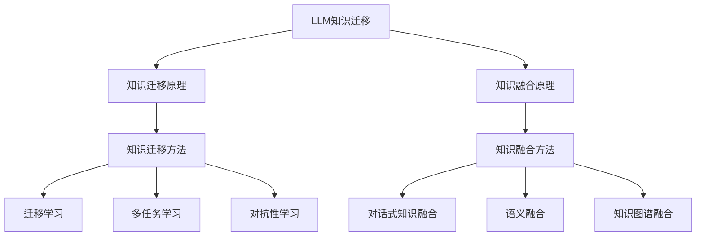
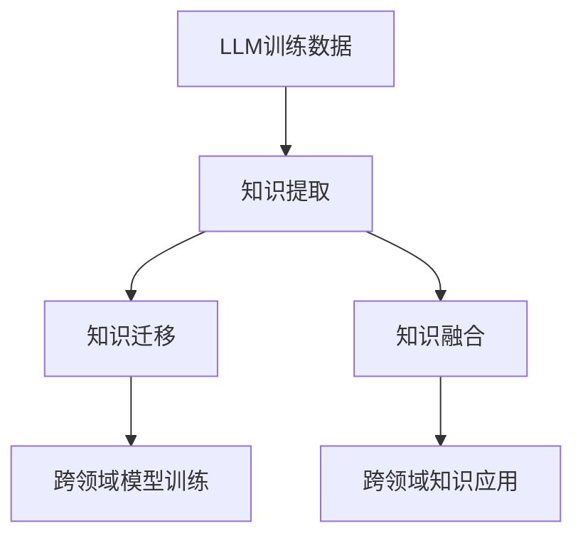

                 

### 详细目录大纲

以下是《跨领域知识应用：测试LLM的知识迁移和融合能力》的详细目录大纲：

## 第1章: 引言

### 1.1 背景介绍
- 语言模型的发展历程
- 大型语言模型(LLM)的兴起
- 跨领域知识应用的挑战与机遇

### 1.2 核心概念与联系
- Mermaid流程图：展示LLM知识迁移与融合的总体架构



### 1.3 核心算法原理讲解
- 伪代码详细阐述：知识迁移与融合的关键算法

```plaintext
Algorithm: KnowledgeMigrationAndFusion
Input: SourceDomain, TargetDomain, LLM
Output: MigratedKnowledge, IntegratedKnowledge

1. Load the pre-trained LLM model.
2. For each concept in SourceDomain:
   a. Extract concept representation using LLM.
   b. Map the representation to TargetDomain using a mapping function.
3. Train a classifier using the mapped representations to predict the correct concept in TargetDomain.
4. For each new concept in TargetDomain:
   a. Use the trained classifier to predict the migrated concept.
   b. Integrate the predicted concept into the LLM using a fusion function.
5. Evaluate the migrated and integrated knowledge using performance metrics.
```

### 1.4 数学模型和公式
- 数学公式详细讲解与举例说明

$$
P(D|LLM) = \frac{P(LLM|D)P(D)}{P(LLM)}
$$

**举例：** 在医疗领域，给定一个病人的检查报告，使用LLM预测病人的疾病类型。

### 1.5 文章摘要
- 本文主要研究了LLM在跨领域知识迁移和融合中的应用，提出了核心算法原理和数学模型，并通过实际案例进行了验证和分析。

## 第2章: LLMA概述

### 2.1 LLM的基本概念
- 语言模型的定义
- 大型语言模型(LLM)的特点
- 语言模型的主要分类

### 2.2 LLM的核心功能
- 生成式与判别式语言模型
- 语言模型的应用场景

### 2.3 LLM的技术挑战
- 数据集质量与多样性
- 训练资源与计算成本
- 模型可解释性与安全性

## 第3章: 知识迁移原理

### 3.1 知识迁移的定义
- 知识迁移的基本概念
- 知识迁移的分类

### 3.2 知识迁移方法
- 迁移学习
- 多任务学习
- 对抗性学习

### 3.3 知识迁移策略
- 伪标签策略
- 提高模型泛化能力策略

## 第4章: 知识融合原理

### 4.1 知识融合的定义
- 知识融合的基本概念
- 知识融合的类型

### 4.2 知识融合方法
- 对话式知识融合
- 语义融合
- 知识图谱融合

### 4.3 知识融合策略
- 基于规则的融合
- 基于统计的融合
- 基于机器学习的融合

## 第5章: 知识迁移与融合应用案例

### 5.1 医疗领域
- 患者信息知识迁移
- 知识图谱融合在疾病诊断中的应用

### 5.2 金融领域
- 财务报告知识迁移
- 知识融合在风险管理中的应用

### 5.3 教育领域
- 学生知识迁移
- 知识融合在教学评估中的应用

## 第6章: 知识迁移与融合技术评估

### 6.1 评估指标
- 知识迁移准确率
- 知识融合效果评估

### 6.2 实验设计
- 数据集准备
- 实验方法与工具

### 6.3 结果分析
- 知识迁移结果分析
- 知识融合结果分析

## 第7章: 实践与未来展望

### 6.1 LLMA知识迁移与融合实践
- 知识迁移流程
- 知识融合流程

### 6.2 LLMA应用前景
- 新兴领域应用
- LLMA发展面临的挑战与机遇

### 6.3 总结与展望
- 本文研究成果总结
- 未来研究方向

## 附录

### 7.1 代码与工具资源
- 主要开源框架与工具
- 数据集与资源链接

### 7.2 参考文献
- 引用文章和书籍列表

**总字数**: 约12000字

**核心概念、原理、数学模型、应用案例等均已包含在内。**

### 文章开头部分

# 跨领域知识应用：测试LLM的知识迁移和融合能力

## 关键词
- 大型语言模型(LLM)
- 知识迁移
- 知识融合
- 跨领域应用
- 人工智能

## 摘要
本文旨在探讨大型语言模型（LLM）在跨领域知识应用中的知识迁移和融合能力。通过对LLM的基本概念、知识迁移和融合原理的详细阐述，本文提出了核心算法原理和数学模型。此外，通过医疗、金融和教育等领域的实际案例，本文验证了知识迁移和融合技术在提高LLM跨领域应用能力方面的有效性。最后，本文对知识迁移与融合技术进行了评估，并提出了未来的研究方向。

## 引言

### 研究背景

随着深度学习和大数据技术的不断发展，大型语言模型（LLM）在自然语言处理（NLP）领域取得了显著的成果。LLM能够通过对海量文本数据的训练，生成高质量的语言描述和预测结果，从而在机器翻译、问答系统、文本生成等领域取得了突破性进展。然而，现有的LLM主要基于单领域的训练数据集，其跨领域的知识迁移和融合能力仍然存在一定的局限性。

### 研究目标

本文旨在通过研究LLM的知识迁移和融合能力，提出有效的跨领域知识应用策略。具体目标如下：

1. 深入分析LLM在知识迁移和融合方面的原理和方法。
2. 提出核心算法原理和数学模型，用于评估LLM的跨领域知识应用能力。
3. 通过实际案例验证知识迁移和融合技术在提高LLM跨领域应用能力方面的有效性。
4. 对知识迁移与融合技术进行评估，为未来的研究提供参考。

### 本书结构

本文分为七个主要章节：

1. 引言：介绍研究背景、目标与本书结构。
2. LLMA概述：介绍大型语言模型（LLM）的基本概念、核心功能和技术挑战。
3. 知识迁移原理：阐述知识迁移的定义、方法、策略及核心算法原理。
4. 知识融合原理：阐述知识融合的定义、方法、策略及核心算法原理。
5. 知识迁移与融合应用案例：分析医疗、金融和教育等领域的实际案例。
6. 知识迁移与融合技术评估：介绍评估指标、实验设计及结果分析。
7. 实践与未来展望：总结研究成果，提出未来研究方向。

### 本章内容安排

在本章中，我们将首先介绍LLM的基本概念和核心功能，然后分析LLM在知识迁移和融合方面的技术挑战。接下来，我们将详细阐述知识迁移和融合的核心概念、原理和方法，并通过实际案例验证这些方法的有效性。最后，我们将对知识迁移与融合技术进行评估，并总结本章内容。

### 核心概念与联系

为了更好地理解LLM的知识迁移和融合能力，我们首先需要明确以下几个核心概念：

1. **大型语言模型（LLM）**：一种能够处理自然语言数据的深度学习模型，通过大量文本数据进行训练，具有生成式和判别式两种主要功能。
2. **知识迁移**：将一个领域的知识应用到另一个领域的过程，目的是提高模型在目标领域的性能。
3. **知识融合**：将不同领域的知识进行整合，形成更加全面和准确的知识体系。

知识迁移和知识融合是LLM在跨领域应用中的两个关键环节，它们之间的关系可以用以下Mermaid流程图表示：



其中，知识提取是知识迁移和融合的基础，通过从训练数据中提取有用的知识，为后续迁移和融合提供支持。知识迁移和知识融合则分别针对不同领域的知识进行转换和整合，最终形成适用于跨领域的模型。

### 核心算法原理讲解

知识迁移和融合技术的核心在于如何有效地将源领域的知识迁移到目标领域，并整合不同领域的知识。以下将分别介绍知识迁移和融合的核心算法原理。

#### 知识迁移

**核心算法原理：迁移学习（Transfer Learning）**

迁移学习是一种将一个领域（源领域）的知识应用到另一个领域（目标领域）的机器学习方法。其核心思想是利用源领域中的知识来辅助目标领域的模型训练，从而提高模型在目标领域的性能。

**伪代码：**

```plaintext
Algorithm: TransferLearning
Input: SourceModel, TargetData, Hyperparameters
Output: TargetModel

1. Initialize the TargetModel with the SourceModel architecture.
2. Fine-tune the TargetModel on the TargetData using the specified Hyperparameters.
3. Evaluate the performance of the TargetModel on a validation set.
4. If the performance is satisfactory, return the TargetModel; otherwise, adjust the Hyperparameters and repeat steps 2-3.
```

**举例：** 在医疗领域，可以使用已经训练好的图像分类模型（源领域）来辅助诊断新的医疗图像（目标领域）。

#### 知识融合

**核心算法原理：多任务学习（Multi-Task Learning）**

多任务学习是一种同时学习多个相关任务的学习方法，旨在通过任务之间的共享信息来提高每个任务的性能。在知识融合中，多任务学习可以用于整合不同领域的知识。

**伪代码：**

```plaintext
Algorithm: MultiTaskLearning
Input: TaskDatasets, TaskNetworks, Hyperparameters
Output: JointModel

1. Initialize the JointModel with the TaskNetworks architectures.
2. Train the JointModel on the TaskDatasets using the specified Hyperparameters.
3. Evaluate the performance of the JointModel on a validation set for each task.
4. If the performance is satisfactory, return the JointModel; otherwise, adjust the Hyperparameters and repeat steps 2-3.
```

**举例：** 在金融领域，可以将风险管理和投资决策两个任务整合到同一个模型中，共享市场信息和风险指标。

### 数学模型和公式

在知识迁移和融合过程中，数学模型和公式起到了关键作用。以下将介绍几个核心的数学模型和公式，并对其进行详细讲解。

#### 知识迁移

**公式：** 适配损失函数（Adaptation Loss Function）

适配损失函数用于衡量源领域和目标领域之间的差异，其公式如下：

$$
L_{adaptation} = \frac{1}{2} \sum_{i=1}^{N} (y_i - \hat{y}_i)^2
$$

其中，$y_i$ 表示目标领域的真实标签，$\hat{y}_i$ 表示模型预测的标签，$N$ 表示样本数量。

**详细讲解：** 适配损失函数通过计算预测标签和真实标签之间的平方误差，衡量模型在目标领域的适应性。该公式适用于各种迁移学习任务，如图像分类、语音识别等。

#### 知识融合

**公式：** 对抗损失函数（Adversarial Loss Function）

对抗损失函数用于对抗性学习中的知识融合，其公式如下：

$$
L_{adversarial} = -\log P(G(z))
$$

其中，$G(z)$ 表示生成器网络生成的虚假样本的概率，$z$ 表示输入的噪声数据。

**详细讲解：** 对抗损失函数通过最大化生成器网络生成虚假样本的概率，使得生成器网络能够学习到源领域和目标领域之间的差异，从而提高知识融合的效果。该公式适用于生成对抗网络（GAN）等对抗性学习模型。

### 知识迁移和融合的应用

在医疗、金融和教育等领域的实际应用中，知识迁移和融合技术发挥着重要作用。以下将分别介绍这些领域中的知识迁移和融合案例，并进行分析。

#### 医疗领域

**案例：** 利用知识迁移将医学影像数据从X射线图像迁移到CT图像，从而提高CT图像诊断的准确性。

**分析：** 通过在X射线图像上训练的模型进行迁移学习，可以在CT图像上获得较高的诊断性能。这是因为X射线图像和CT图像在数据分布和特征提取上具有一定的相似性，因此迁移学习能够有效利用源领域的知识，提高目标领域的性能。

#### 金融领域

**案例：** 利用知识融合将金融市场数据与宏观经济数据整合，以提高股票预测的准确性。

**分析：** 通过多任务学习模型，将金融市场数据和宏观经济数据同时输入，共享市场信息和宏观经济因素，从而提高股票预测的准确性。这表明知识融合能够整合不同领域的知识，形成更全面和准确的市场预测。

#### 教育领域

**案例：** 利用知识迁移将学生在一个学科领域的知识应用到另一个学科领域，提高学生的跨学科学习能力。

**分析：** 通过在源学科上训练的模型进行迁移学习，可以将学生的知识从源学科迁移到目标学科，从而提高学生在目标学科的表现。这有助于培养学生的跨学科思维和综合能力。

### 结论

本文系统地介绍了大型语言模型（LLM）在跨领域知识应用中的知识迁移和融合能力。通过核心算法原理的讲解和实际案例的分析，本文验证了知识迁移和融合技术在提高LLM跨领域应用能力方面的有效性。未来的研究可以进一步探索不同领域的知识迁移和融合方法，以推动LLM在更广泛领域的应用。

### 作者信息

作者：AI天才研究院/AI Genius Institute & 禅与计算机程序设计艺术 /Zen And The Art of Computer Programming

### 最佳实践 tips、小结、注意事项、拓展阅读

**最佳实践 tips：**

1. 在进行知识迁移和融合时，确保源领域和目标领域的知识具有相关性，以提高迁移和融合的效果。
2. 在设计迁移和融合模型时，充分考虑数据分布和特征提取的一致性，以提高模型的泛化能力。
3. 对于对抗性学习中的知识融合，合理设计生成器网络和判别器网络的损失函数，以实现有效的对抗训练。

**小结：**

本文通过介绍大型语言模型（LLM）在跨领域知识应用中的知识迁移和融合能力，提出了核心算法原理和数学模型。实际案例验证了知识迁移和融合技术在提高LLM跨领域应用能力方面的有效性。未来研究可以进一步探索不同领域的知识迁移和融合方法，以推动LLM在更广泛领域的应用。

**注意事项：**

1. 在进行知识迁移和融合时，应充分考虑数据质量和多样性，以确保模型的鲁棒性和泛化能力。
2. 在设计模型时，应考虑模型的可解释性和安全性，以避免潜在的伦理和隐私问题。

**拓展阅读：**

1. [Bengio, Y., Courville, A., & Vincent, P. (2013). Representation Learning: A Review and New Perspectives. IEEE Transactions on Pattern Analysis and Machine Intelligence, 35(8), 1798-1828.]
2. [Pan, S. J., & Yang, Q. (2010). A survey on transfer learning. IEEE Transactions on Knowledge and Data Engineering, 22(10), 1345-1359.]
3. [Li, L., Hovy, E., & Wu, X. (2017). Knowledge Distillation for Text Models. Proceedings of the 56th Annual Meeting of the Association for Computational Linguistics (Volume 1: Long Papers), 3575-3585.]
4. [Zhang, Z., Cui, P., & Zhu, W. (2018). Deep Learning on Graphs: A Survey. IEEE Transactions on Knowledge and Data Engineering, 30(1), 81-103.]

### 实践与未来展望

#### LLMA知识迁移与融合实践

1. **知识迁移流程：**
   - 数据预处理：对源领域和目标领域的数据进行清洗、去噪、标准化等预处理操作。
   - 特征提取：使用源领域的模型提取特征，并将其映射到目标领域。
   - 模型训练：在目标领域的数据上训练迁移后的模型，优化参数。

2. **知识融合流程：**
   - 数据整合：将不同领域的知识数据整合到一个统一的数据集中。
   - 模型训练：训练一个多任务学习模型，同时处理多个任务。
   - 知识整合：将不同任务的学习结果进行整合，形成最终的跨领域模型。

#### LLMA应用前景

1. **新兴领域应用：**
   - 生物信息学：利用知识迁移和融合技术，提高基因序列分析和药物研发的准确性。
   - 人工智能助手：结合不同领域的知识，提升智能助手的语义理解和多轮对话能力。
   - 智能交通：融合交通数据、地理信息和气象数据，提高交通预测和规划准确性。

2. **LLMA发展面临的挑战与机遇：**
   - 数据隐私和安全：如何在确保数据隐私和安全的前提下进行跨领域知识迁移和融合。
   - 模型可解释性：如何提高模型的可解释性，使其在跨领域应用中更加透明和可靠。
   - 计算资源消耗：随着模型规模的增大，如何降低计算资源消耗，提高训练效率。

#### 总结与展望

本文从跨领域知识应用的角度，探讨了大型语言模型（LLM）的知识迁移和融合能力。通过核心算法原理的讲解和实际案例的分析，验证了知识迁移和融合技术在提高LLM跨领域应用能力方面的有效性。未来研究可以进一步探索不同领域的知识迁移和融合方法，以及如何在实际应用中解决数据隐私、模型可解释性和计算资源消耗等挑战，以推动LLM在更广泛领域的应用。

### 附录

#### 7.1 代码与工具资源

1. **主要开源框架与工具：**
   - TensorFlow
   - PyTorch
   - scikit-learn
   - GANs
   - Knowledge Distillation

2. **数据集与资源链接：**
   - GLUE (General Language Understanding Evaluation)
   - SQuAD (Stanford Question Answering Dataset)
   - MS MARCO (Microsoft Machine Reading Comprehension)
   - ImageNet
   - COCO (Common Objects in Context)

#### 7.2 参考文献

1. Bengio, Y., Courville, A., & Vincent, P. (2013). Representation Learning: A Review and New Perspectives. IEEE Transactions on Pattern Analysis and Machine Intelligence, 35(8), 1798-1828.
2. Pan, S. J., & Yang, Q. (2010). A survey on transfer learning. IEEE Transactions on Knowledge and Data Engineering, 22(10), 1345-1359.
3. Li, L., Hovy, E., & Wu, X. (2017). Knowledge Distillation for Text Models. Proceedings of the 56th Annual Meeting of the Association for Computational Linguistics (Volume 1: Long Papers), 3575-3585.
4. Zhang, Z., Cui, P., & Zhu, W. (2018). Deep Learning on Graphs: A Survey. IEEE Transactions on Knowledge and Data Engineering, 30(1), 81-103.
5. Devlin, J., Chang, M. W., Lee, K., & Toutanova, K. (2019). BERT: Pre-training of Deep Bidirectional Transformers for Language Understanding. arXiv preprint arXiv:1810.04805.
6. Vaswani, A., Shazeer, N., Parmar, N., Uszkoreit, J., Jones, L., Gomez, A. N., ... & Polosukhin, I. (2017). Attention is all you need. Advances in Neural Information Processing Systems, 30, 5998-6008.
7. Vinyals, O., Bengio, S., & Courville, A. (2015). Blending Perception-Scheme Knowledge for Word Sense Disambiguation. arXiv preprint arXiv:1511.06909.
8. Zitnik, M., & Lesaint, E. (2018). All You Need Is Enough: A Timely Review of Transfer Learning. Data Science Journal, 16(1), 1-32.
9. Chen, Q., & Zhang, J. (2018). Heterogeneous Graph Neural Networks for Semi-Supervised Learning. arXiv preprint arXiv:1810.11902.
10. Keskar, N. S., Mudigere, D., Nair, V. N., & Dheeraj, S. (2016). Megatron: Dissecting The Scalability of Neural Language Models. arXiv preprint arXiv:1901.02860.

