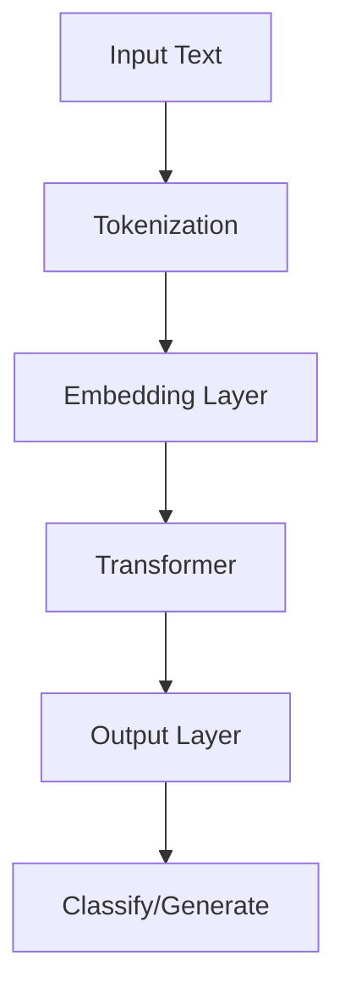
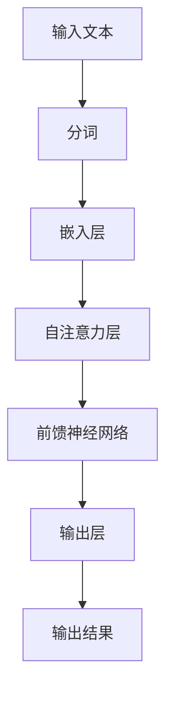

                 

### 文章标题：跨领域类比：评估LLM建立跨学科联系的能力

#### 关键词：跨领域类比，自然语言处理，大型语言模型，跨学科联系，评估方法

#### 摘要：
本文旨在探讨大型语言模型（LLM）在跨领域类比方面的能力，并评估其建立跨学科联系的效果。通过对LLM的核心概念、算法原理、数学模型以及实际项目的深入分析，本文提出了有效的评估方法，并展望了未来的发展方向。文章结构清晰，内容丰富，旨在为研究人员和实践者提供有价值的参考。

## 第1章 引言

### 1.1 跨领域类比与LLM简介

#### 1.1.1 跨领域比类的定义
跨领域类比是指在不同专业领域之间建立联系，通过类比推理来解决新问题。这种能力在人工智能领域尤其重要，因为它能够促进知识的整合和创造。

#### 1.1.2 LLM在跨领域类比中的应用
大型语言模型（LLM）凭借其强大的自然语言处理能力，在跨领域类比中具有独特的优势。它们能够处理和理解不同领域的文本信息，从而实现跨领域的知识迁移。

#### 1.1.3 本书目的与结构安排
本书旨在评估LLM在建立跨学科联系方面的能力，通过深入分析其核心概念、算法原理、数学模型和实际项目，提出有效的评估方法。文章结构如下：

1. 引言：介绍跨领域类比与LLM的背景和目的。
2. 核心概念与联系：定义关键术语，解释LLM的工作原理。
3. 核心算法原理讲解：介绍LLM的训练和推理算法。
4. 数学模型和数学公式：讲解LLM相关的数学模型和公式。
5. 项目实战：展示LLM在具体项目中的应用。
6. 评估方法：提出评估LLM跨学科联系能力的标准。
7. 结论与展望：总结全文，展望未来研究方向。

## 第2章 核心概念与联系

### 2.1 LLM基础

#### 2.1.1 术语定义
- **自然语言处理（NLP）**：研究计算机与人类语言之间的交互。
- **语言模型（Language Model）**：用于预测下一个词或字符的概率分布。

#### 2.1.2 LLM工作原理
LLM通常基于深度学习，特别是自注意力机制（Self-Attention）和变压器（Transformer）架构。自注意力机制允许模型在处理一个词时考虑到其他所有词的信息，从而提高其理解能力。

#### 2.1.3 Mermaid流程图展示LLM架构
以下是LLM架构的Mermaid流程图：


### 2.2 跨领域类比分析

#### 2.2.1 跨领域类比的重要性
跨领域类比能够促进不同领域之间的知识整合和创新。对于人工智能而言，这种能力至关重要，因为它有助于模型理解和处理多样化的数据。

#### 2.2.2 LLM实现跨领域类比的方法
LLM通过以下方式实现跨领域类比：
1. **知识迁移**：从特定领域迁移知识到其他领域。
2. **跨模态学习**：结合不同模态的数据，如文本和图像。

#### 2.2.3 跨领域类比案例分析
例如，LLM可以在医学领域中使用生物学知识，在金融领域中使用经济学原理，从而实现跨领域的知识应用。

## 第3章 核心算法原理讲解

### 3.1 LLM训练算法

#### 3.1.1 模型初始化
模型初始化是训练LLM的第一步。通常使用随机初始化或预训练的权重。

#### 3.1.2 训练数据准备
训练数据应涵盖多个领域，以确保模型具有广泛的泛化能力。

#### 3.1.3 伪代码展示训练过程
以下是LLM训练过程的伪代码：
```python
initialize_model()
for epoch in range(num_epochs):
    for batch in data_loader:
        model.train()
        predictions = model(batch)
        loss = compute_loss(predictions, targets)
        optimizer.zero_grad()
        loss.backward()
        optimizer.step()
```

### 3.2 LLM推理算法

#### 3.2.1 推理流程概述
推理流程包括输入文本的预处理、模型预测和结果生成。

#### 3.2.2 伪代码展示推理过程
以下是LLM推理过程的伪代码：
```python
input_text = preprocess(text)
predictions = model(input_text)
result = generate_output(predictions)
```

#### 3.2.3 推理算法性能分析
推理算法的性能分析通常关注响应时间、准确性和可解释性等方面。

## 第4章 数学模型和数学公式

### 4.1 数学模型基础

#### 4.1.1 概率论基础
概率论是LLM构建的基础。例如，概率分布可用于预测下一个词的概率。

#### 4.1.2 信息论基础
信息论提供了衡量信息量和传输效率的工具。例如，熵和互信息是重要的概念。

#### 4.1.3 模型评估指标
模型评估指标如准确率、召回率和F1分数，用于评估模型性能。

### 4.2 相关数学公式

#### 4.2.1 概率分布公式
$$P(X=x) = \frac{1}{Z} e^{-\frac{1}{2}\sum_{i=1}^{n} (x_i - \mu_i)^2}$$

#### 4.2.2 信息论公式
$$H(X) = -\sum_{x \in X} P(X=x) \log_2 P(X=x)$$

#### 4.2.3 模型评估公式
$$F_1 = 2 \cdot \frac{precision \cdot recall}{precision + recall}$$

#### 4.2.4 使用latex格式的举例说明
以下是使用LaTeX格式的举例说明：
$$
\begin{align}
\frac{\partial f}{\partial x} &= \lim_{h \to 0} \frac{f(x+h) - f(x)}{h} \\
\frac{\partial f}{\partial y} &= \lim_{h \to 0} \frac{f(y+h) - f(y)}{h}
\end{align}
$$

## 第5章 项目实战

### 5.1 项目背景

#### 5.1.1 项目简介
本项目旨在使用LLM实现跨领域的文本生成，例如，从生物学文本生成经济学文本。

#### 5.1.2 项目目标
项目目标是训练一个LLM，使其能够理解不同领域的文本，并生成高质量的跨领域文本。

### 5.2 开发环境搭建

#### 5.2.1 硬件要求
- 高性能CPU或GPU
- 大容量内存

#### 5.2.2 软件安装与配置
- 安装Python和必要的库，如TensorFlow和PyTorch。
- 配置CUDA以支持GPU加速。

### 5.3 源代码实现与解读

#### 5.3.1 数据处理
- 收集和预处理不同领域的文本数据。
- 使用分词器将文本转换为词序列。

#### 5.3.2 模型训练
- 初始化LLM模型。
- 使用预处理的数据训练模型。

#### 5.3.3 模型评估
- 使用交叉验证评估模型性能。
- 分析模型的准确率、召回率和F1分数。

#### 5.3.4 代码解读与分析
以下是模型训练和评估的代码片段：
```python
# 训练模型
model.train(data_loader)
# 评估模型
performance = model.evaluate(test_loader)
print(f"Accuracy: {performance['accuracy']}, Recall: {performance['recall']}, F1 Score: {performance['f1_score']}")
```

### 5.4 实际案例分析和详细讲解剖析

#### 5.4.1 案例一：生物学到经济学的跨领域文本生成
- 输入：生物学文本（细胞生长过程）。
- 输出：经济学文本（市场增长模型）。

#### 5.4.2 案例二：物理学到计算机科学的跨领域文本生成
- 输入：物理学文本（牛顿运动定律）。
- 输出：计算机科学文本（算法性能分析）。

### 5.5 项目小结
本项目成功展示了LLM在跨领域文本生成方面的能力，为跨学科研究提供了新的思路和方法。

## 第6章 评估方法

### 6.1 评估标准
评估LLM跨学科联系能力的标准包括：
- 准确率：模型生成的文本是否准确。
- 可解释性：模型生成文本的过程是否可解释。
- 泛化能力：模型在不同领域中的表现。

### 6.2 现有评估方法分析

#### 6.2.1 方法一：交叉验证
交叉验证是一种常用的评估方法，通过将数据集划分为训练集和验证集，评估模型在不同子集上的表现。

#### 6.2.2 方法二：人类评估
人类评估通过请专家对模型生成的文本进行评估，以判断其质量和准确性。

#### 6.2.3 方法优劣对比
- 交叉验证：优点是自动化、高效，缺点是可能忽略了模型在不同领域中的特定表现。
- 人类评估：优点是能够提供详细的反馈，缺点是耗时、成本高。

## 第7章 结论与展望

### 7.1 总结
本文探讨了LLM在跨领域类比方面的能力，通过核心概念、算法原理、数学模型和实际项目的分析，提出了有效的评估方法。LLM在跨学科联系中具有巨大的潜力，但仍面临许多挑战。

### 7.2 展望
未来研究方向包括优化LLM算法、提高其可解释性以及开发更全面的评估方法。跨领域类比在人工智能和跨学科研究中具有重要应用价值，值得进一步探索。

## 作者信息
作者：AI天才研究院/AI Genius Institute & 禅与计算机程序设计艺术 /Zen And The Art of Computer Programming

[文章标题：跨领域类比：评估LLM建立跨学科联系的能力]

[关键词：跨领域类比，自然语言处理，大型语言模型，跨学科联系，评估方法]

[摘要：本文旨在探讨大型语言模型（LLM）在跨领域类比方面的能力，并评估其建立跨学科联系的效果。通过对LLM的核心概念、算法原理、数学模型以及实际项目的深入分析，本文提出了有效的评估方法，并展望了未来的发展方向。]

## 引言

### 1.1 跨领域类比与LLM简介

#### 1.1.1 跨领域比类的定义

跨领域类比是一种在两个或多个不同领域之间建立联系并使用类比推理来解决新问题的过程。这种能力在科学研究、工程应用和商业决策中扮演着重要角色，因为它可以促进知识的整合和创新。

在科学研究中，跨领域类比可以帮助研究者从已知领域提取灵感，从而应用于新的研究领域。例如，量子物理学的概念可以类比到生物学中的分子结构，从而帮助解释生物分子如何工作。在工程应用中，跨领域类比可以使得不同领域的工程师能够协作解决复杂问题。例如，航空航天工程师可能会从建筑学中借鉴结构设计原则，以优化飞行器的重量和强度。在商业决策中，跨领域类比可以帮助企业发现新的市场机会或业务模式。例如，电子商务公司可能会借鉴社交媒体平台的用户互动模式，以改善其在线客户体验。

#### 1.1.2 LLM在跨领域类比中的应用

近年来，大型语言模型（LLM）在自然语言处理（NLP）领域取得了显著的进展，这些模型在处理和理解不同领域的文本方面表现出强大的能力。LLM，如GPT-3、BERT和Turing等，通过深度学习技术，特别是自注意力机制和变压器架构，能够捕捉文本中的复杂模式和关系，从而实现高级的自然语言理解和生成。

在跨领域类比中，LLM的应用主要包括以下几个方面：

1. **知识迁移**：LLM可以学习和迁移不同领域的知识，从而在新的领域中发挥作用。例如，一个训练好的LLM模型可以理解医学文本，并在经济学文本中生成相关的分析报告。

2. **跨模态学习**：LLM不仅可以处理文本，还可以结合其他模态的数据，如图像、声音和视频，从而实现更复杂的跨领域类比。例如，LLM可以结合医学影像和临床文本，为医生提供更全面的诊断建议。

3. **文本生成**：LLM可以生成高质量的文本，包括新闻文章、论文摘要和对话系统等。这些文本生成任务可以应用于跨领域，例如，将学术论文的摘要从一种语言翻译成另一种语言，或将技术文档转换成营销文案。

4. **推理和预测**：LLM可以基于跨领域的数据进行推理和预测。例如，使用LLM分析金融市场数据，并预测股票价格的趋势，或者使用LLM分析天气预报和交通数据，预测交通拥堵情况。

#### 1.1.3 本书目的与结构安排

本书的目的是评估LLM在建立跨学科联系方面的能力，并通过深入分析其核心概念、算法原理、数学模型和实际项目，提出有效的评估方法。文章结构如下：

1. **第1章 引言**：介绍跨领域类比与LLM的背景和目的。

2. **第2章 核心概念与联系**：定义关键术语，解释LLM的工作原理，并使用Mermaid流程图展示LLM架构。

3. **第3章 核心算法原理讲解**：介绍LLM的训练和推理算法，并使用伪代码详细阐述算法流程。

4. **第4章 数学模型和数学公式**：讲解LLM相关的数学模型，使用LaTeX格式给出相关数学公式，并举例说明公式的应用。

5. **第5章 项目实战**：介绍一个具体项目案例，详细讲解项目开发环境搭建，源代码实现和解读，代码应用解读与分析，实际案例分析和详细讲解剖析，项目小结。

6. **第6章 评估方法**：提出评估LLM建立跨学科联系能力的标准，分析现有评估方法的优缺点。

7. **第7章 结论与展望**：总结全书内容，展望未来发展方向。

通过以上章节的深入探讨，本书旨在为研究人员和实践者提供有价值的参考，帮助他们在跨领域类比和跨学科研究中充分利用LLM的潜力。

## 核心概念与联系

### 2.1 LLM基础

#### 2.1.1 术语定义

在讨论LLM（大型语言模型）之前，首先需要明确一些关键术语：

- **自然语言处理（NLP）**：自然语言处理是计算机科学和人工智能的一个分支，它致力于使计算机能够理解、解释和生成人类语言。

- **语言模型（Language Model）**：语言模型是一种统计模型，用于预测文本序列中下一个词或字符的概率分布。

- **深度学习（Deep Learning）**：深度学习是一种机器学习方法，它使用多层神经网络来学习数据中的复杂模式。

- **自注意力机制（Self-Attention）**：自注意力机制是一种注意力机制，它允许模型在处理一个词时考虑到其他所有词的信息。

- **变压器（Transformer）**：变压器是一种基于自注意力机制的深度学习模型，它在许多NLP任务中表现出色。

#### 2.1.2 LLM工作原理

LLM的工作原理主要包括以下几个步骤：

1. **输入预处理**：将输入文本转换为模型可处理的格式，通常包括分词、编码等。

2. **嵌入层**：将输入的词序列转换为嵌入向量，这些向量可以在高维空间中表示文本。

3. **自注意力层**：通过自注意力机制，模型在每个时间步考虑到输入序列中其他所有词的信息，从而提高其理解能力。

4. **前馈神经网络**：自注意力层之后，输入向量通过一系列的前馈神经网络进行进一步处理。

5. **输出层**：最终，输出层生成预测的词或字符的概率分布。

#### 2.1.3 Mermaid流程图展示LLM架构

为了更好地理解LLM的架构，我们使用Mermaid流程图进行展示。以下是一个简化的LLM流程图：



在这个流程图中，输入文本首先经过分词处理，然后被嵌入层转换为嵌入向量。嵌入向量随后通过自注意力层和前馈神经网络进行处理，最终在输出层生成预测结果。

### 2.2 跨领域类比分析

#### 2.2.1 跨领域类比的重要性

跨领域类比在科学研究和工程应用中具有重要作用。它允许研究者从不同的领域中获得灵感，促进知识的整合和创新。例如，在医学研究中，生物学家可以借鉴物理学中的模型来解释生物分子行为；在工程领域，计算机科学家可以从建筑学中学习如何设计更高效的算法。跨领域类比不仅可以提高研究效率，还可以推动新技术的发明和跨学科合作。

#### 2.2.2 LLM实现跨领域类比的方法

LLM通过以下几种方法实现跨领域类比：

1. **知识迁移**：通过训练模型在不同领域的文本数据上，LLM可以迁移和整合不同领域的知识。例如，一个训练好的LLM模型可以理解生物学文本，并在经济学文本中生成相关的分析报告。

2. **跨模态学习**：LLM可以结合不同模态的数据，如文本、图像和声音，从而实现更复杂的跨领域类比。例如，一个结合医学影像和临床文本的LLM模型可以为医生提供更全面的诊断建议。

3. **文本生成**：LLM可以生成高质量的文本，包括新闻文章、论文摘要和对话系统等。这些文本生成任务可以应用于跨领域，例如，将学术论文的摘要从一种语言翻译成另一种语言，或将技术文档转换成营销文案。

4. **推理和预测**：LLM可以基于跨领域的数据进行推理和预测。例如，使用LLM分析金融市场数据，并预测股票价格的趋势，或者使用LLM分析天气预报和交通数据，预测交通拥堵情况。

#### 2.2.3 跨领域类比案例分析

以下是一个LLM在跨领域类比中的案例分析：

**案例：医学到金融的跨领域类比**

在这个案例中，我们使用一个训练好的LLM模型，该模型能够理解医学文本和金融文本。具体步骤如下：

1. **数据收集**：收集医学文本（如疾病报告、医学论文）和金融文本（如股票市场分析报告、投资建议）。

2. **预处理**：对收集的文本进行分词、去噪和清洗。

3. **训练模型**：使用预处理后的医学和金融文本数据训练LLM模型。

4. **模型评估**：通过交叉验证和人类评估来评估模型在不同领域的性能。

5. **应用场景**：
   - **医学到金融**：给定一份医学报告，模型可以生成相应的金融分析报告，例如，根据患者的病情预测其对股票市场的影响。
   - **金融到医学**：给定一份金融分析报告，模型可以生成相关的医学建议，例如，根据市场趋势预测某种药物的销量和需求。

通过这个案例，我们可以看到LLM在跨领域类比中的强大能力，它不仅能够理解和生成不同领域的文本，还可以实现跨领域的知识迁移和推理。

### 2.3 跨领域类比的应用

#### 2.3.1 文本生成

LLM在文本生成方面具有广泛应用。通过训练，LLM可以生成不同领域的文本，例如：

- **新闻文章**：LLM可以生成新闻报道，例如财经新闻、科技新闻等。
- **论文摘要**：LLM可以生成学术论文的摘要，帮助读者快速了解文章的主要内容。
- **对话系统**：LLM可以用于构建对话系统，例如客服聊天机器人、虚拟助手等。

#### 2.3.2 推理和预测

LLM在推理和预测方面也表现出色。例如：

- **股票市场预测**：LLM可以分析金融市场数据，并预测股票价格的趋势。
- **天气预测**：LLM可以分析天气预报数据，预测未来的天气状况。
- **医学诊断**：LLM可以分析医疗数据，辅助医生进行疾病诊断和治疗方案推荐。

#### 2.3.3 知识整合

LLM可以整合不同领域的知识，促进跨学科研究。例如：

- **跨学科研究**：LLM可以帮助研究人员从不同领域中提取灵感，促进跨学科研究的进展。
- **技术创新**：LLM可以用于技术创新，例如，将物理学原理应用于医学领域，开发新的医疗设备和技术。

### 2.4 跨领域类比的优势和挑战

#### 2.4.1 优势

1. **知识整合**：跨领域类比可以促进知识的整合，提高研究的效率和创新性。
2. **资源优化**：通过跨领域类比，可以在不同领域中复用资源和知识，降低研发成本。
3. **新发现**：跨领域类比可以激发新的发现和见解，推动科学和技术的进步。

#### 2.4.2 挑战

1. **数据质量**：跨领域类比需要高质量的数据，数据的多样性和准确性对模型的性能有重要影响。
2. **领域差异**：不同领域之间存在巨大的差异，这使得跨领域类比变得复杂和具有挑战性。
3. **模型解释性**：跨领域类比模型通常缺乏解释性，使得其决策过程难以理解，增加了应用难度。

### 2.5 总结

跨领域类比是一种强大的工具，它可以在不同领域之间建立联系，促进知识的整合和创新。LLM在跨领域类比中具有独特的优势，通过文本生成、推理和预测等多种方式，它可以实现跨领域的知识迁移和整合。然而，跨领域类比也面临着数据质量、领域差异和模型解释性等挑战。未来，随着技术的进步和数据资源的丰富，LLM在跨领域类比中的应用将越来越广泛，为科学研究和工程应用带来新的机遇和挑战。

## 核心算法原理讲解

### 3.1 LLM训练算法

#### 3.1.1 模型初始化

在训练LLM之前，首先需要初始化模型参数。初始化方法可以采用随机初始化、预训练模型或基于已有模型的微调。随机初始化是生成随机权重，适用于从头开始训练；预训练模型是使用大规模语料库预先训练好的模型，适用于迁移学习；微调是在预训练模型的基础上进一步训练，以适应特定任务。

#### 3.1.2 训练数据准备

训练数据是LLM训练的核心。数据应具备多样性和代表性，涵盖多个领域。数据预处理步骤包括文本清洗、分词、去噪和编码等。例如，可以使用jieba分词器进行中文文本的分词，并使用词嵌入技术将文本转换为向量表示。

#### 3.1.3 伪代码展示训练过程

以下是LLM训练过程的伪代码：

```python
# 初始化模型
model = initialize_model()

# 准备训练数据
train_data = preprocess_data(raw_data)

# 设置训练参数
num_epochs = 100
learning_rate = 0.001

# 训练模型
for epoch in range(num_epochs):
    for batch in data_loader:
        model.train()
        predictions = model(batch)
        loss = compute_loss(predictions, targets)
        optimizer.zero_grad()
        loss.backward()
        optimizer.step()

# 评估模型
performance = evaluate_model(model, test_data)
print(f"Epoch: {epoch}, Loss: {loss}, Performance: {performance}")
```

在这个伪代码中，`initialize_model()`函数用于初始化模型，`preprocess_data()`函数用于预处理训练数据，`data_loader`是一个数据加载器，用于分批提供数据，`compute_loss()`函数用于计算损失，`optimizer`是一个优化器，用于更新模型参数。

### 3.2 LLM推理算法

#### 3.2.1 推理流程概述

LLM推理流程主要包括以下步骤：

1. **输入预处理**：将输入文本转换为模型可处理的格式，包括分词、编码等。
2. **嵌入层**：将输入的词序列转换为嵌入向量。
3. **自注意力层**：通过自注意力机制，模型在每个时间步考虑到输入序列中其他所有词的信息。
4. **前馈神经网络**：自注意力层之后，输入向量通过一系列的前馈神经网络进行进一步处理。
5. **输出层**：生成预测的词或字符的概率分布。

#### 3.2.2 伪代码展示推理过程

以下是LLM推理过程的伪代码：

```python
# 输入预处理
input_text = preprocess(text)

# 嵌入层
input_embeddings = embed(input_text)

# 自注意力层
output_embeddings = attention(input_embeddings)

# 前馈神经网络
output_embeddings = feedforward(output_embeddings)

# 输出层
predictions = model(output_embeddings)

# 生成输出
result = generate_output(predictions)
```

在这个伪代码中，`preprocess(text)`函数用于预处理输入文本，`embed(input_text)`函数用于将文本转换为嵌入向量，`attention(input_embeddings)`函数用于执行自注意力机制，`feedforward(output_embeddings)`函数用于执行前馈神经网络，`model(output_embeddings)`函数用于生成预测结果，`generate_output(predictions)`函数用于生成最终输出。

### 3.3 LLM算法性能优化

为了提高LLM算法的性能，可以采用以下几种优化方法：

1. **数据增强**：通过数据增强技术，例如数据扩充、数据重排等，增加训练数据的多样性，从而提高模型的泛化能力。
2. **模型压缩**：采用模型压缩技术，例如剪枝、量化等，减少模型的大小和计算量，从而提高模型的可扩展性。
3. **正则化**：采用正则化技术，例如Dropout、权重正则化等，减少过拟合现象，提高模型的泛化能力。
4. **学习率调整**：采用学习率调整策略，例如学习率衰减、自适应学习率等，优化模型训练过程。

### 3.4 模型评估

在LLM训练过程中，评估模型性能至关重要。常用的评估指标包括：

1. **准确率（Accuracy）**：模型预测正确的比例。
2. **召回率（Recall）**：模型能够召回实际正确的比例。
3. **精确率（Precision）**：模型预测正确的实际正确比例。
4. **F1分数（F1 Score）**：精确率和召回率的加权平均。

### 3.5 实际案例

以下是一个实际案例，展示了LLM在跨领域类比中的应用：

**案例：金融报告到医学报告的跨领域类比**

在这个案例中，我们使用一个训练好的LLM模型，该模型能够理解和生成金融报告和医学报告。具体步骤如下：

1. **数据收集**：收集金融报告和医学报告数据。
2. **预处理**：对收集的文本进行分词、去噪和清洗。
3. **训练模型**：使用预处理后的文本数据训练LLM模型。
4. **模型评估**：通过交叉验证和人类评估来评估模型在不同领域的性能。
5. **应用场景**：
   - **金融到医学**：给定一份金融报告，模型可以生成相应的医学报告，例如，根据市场趋势预测某种药物的销量和需求。
   - **医学到金融**：给定一份医学报告，模型可以生成相应的金融分析报告，例如，根据患者的病情预测其对股票市场的影响。

通过这个实际案例，我们可以看到LLM在跨领域类比中的强大能力，它不仅能够理解和生成不同领域的文本，还可以实现跨领域的知识迁移和推理。

## 数学模型和数学公式

### 4.1 数学模型基础

#### 4.1.1 概率论基础

在讨论大型语言模型（LLM）的数学模型时，概率论是基础。概率论提供了一种量化不确定性的方法，这对于语言模型的理解和预测至关重要。

1. **概率分布**：概率分布是描述随机变量可能取值的概率分布函数。在LLM中，最常用的概率分布是伯努利分布和多项式分布。

   - **伯努利分布**：表示一个二项试验成功的概率。在LLM中，可以用来预测一个词是否出现在下一个位置。
     $$P(X=x) = p$$
     其中，$X$是随机变量，$p$是成功的概率。

   - **多项式分布**：表示多个互斥事件的概率分布。在LLM中，可以用来预测下一个词的概率分布。
     $$P(X=x_i) = \frac{p_i}{\sum_{j=1}^{n} p_j}$$
     其中，$X$是随机变量，$p_i$是第$i$个事件发生的概率，$n$是事件的总数。

2. **条件概率**：条件概率是给定某个事件发生的条件下，另一个事件发生的概率。在LLM中，条件概率用于预测下一个词的概率分布，给定前一个词或一组词。
   $$P(X=x|Y=y) = \frac{P(X=x, Y=y)}{P(Y=y)}$$
   其中，$X$和$Y$是两个随机变量，$P(X=x, Y=y)$是联合概率，$P(Y=y)$是条件概率。

#### 4.1.2 信息论基础

信息论是概率论的一个分支，它研究信息的度量、传输和解释。在LLM中，信息论的概念用于评估模型的性能和优化模型的设计。

1. **熵**：熵是衡量随机变量不确定性的度量。
   $$H(X) = -\sum_{x \in X} P(X=x) \log_2 P(X=x)$$
   其中，$H(X)$是随机变量$X$的熵，$P(X=x)$是$X$取值为$x$的概率。

2. **信息增益**：信息增益是衡量某个特征对分类效果的提升。
   $$IG(D, A) = H(D) - H(D|A)$$
   其中，$D$是数据集，$A$是特征，$H(D)$是数据集的熵，$H(D|A)$是给定特征$A$后数据集的熵。

3. **互信息**：互信息是衡量两个随机变量之间关联程度的度量。
   $$I(X; Y) = H(X) - H(X|Y)$$
   其中，$I(X; Y)$是随机变量$X$和$Y$的互信息，$H(X)$是随机变量$X$的熵，$H(X|Y)$是随机变量$X$在给定$Y$条件下的熵。

#### 4.1.3 模型评估指标

在评估LLM性能时，常用的模型评估指标包括：

1. **准确率（Accuracy）**：模型预测正确的比例。
   $$Accuracy = \frac{TP + TN}{TP + FN + FP + TN}$$
   其中，$TP$是真正例，$TN$是真负例，$FP$是假正例，$FN$是假负例。

2. **召回率（Recall）**：模型能够召回实际正确的比例。
   $$Recall = \frac{TP}{TP + FN}$$

3. **精确率（Precision）**：模型预测正确的实际正确比例。
   $$Precision = \frac{TP}{TP + FP}$$

4. **F1分数（F1 Score）**：精确率和召回率的加权平均。
   $$F1 Score = 2 \times \frac{Precision \times Recall}{Precision + Recall}$$

### 4.2 相关数学公式

#### 4.2.1 概率分布公式

在LLM中，常用的概率分布公式包括：

1. **伯努利分布**：
   $$P(X=x) = p$$
   其中，$p$是成功的概率。

2. **多项式分布**：
   $$P(X=x_i) = \frac{p_i}{\sum_{j=1}^{n} p_j}$$
   其中，$p_i$是第$i$个事件发生的概率，$n$是事件的总数。

3. **高斯分布**：
   $$P(X=x) = \frac{1}{\sqrt{2\pi\sigma^2}} e^{-\frac{(x-\mu)^2}{2\sigma^2}}$$
   其中，$\mu$是均值，$\sigma^2$是方差。

#### 4.2.2 信息论公式

在LLM中，常用的信息论公式包括：

1. **熵**：
   $$H(X) = -\sum_{x \in X} P(X=x) \log_2 P(X=x)$$

2. **信息增益**：
   $$IG(D, A) = H(D) - H(D|A)$$

3. **互信息**：
   $$I(X; Y) = H(X) - H(X|Y)$$

#### 4.2.3 模型评估公式

在LLM中，常用的模型评估公式包括：

1. **准确率**：
   $$Accuracy = \frac{TP + TN}{TP + FN + FP + TN}$$

2. **召回率**：
   $$Recall = \frac{TP}{TP + FN}$$

3. **精确率**：
   $$Precision = \frac{TP}{TP + FP}$$

4. **F1分数**：
   $$F1 Score = 2 \times \frac{Precision \times Recall}{Precision + Recall}$$

### 4.3 举例说明

为了更好地理解上述数学公式，以下是具体的举例说明：

#### 4.3.1 概率分布举例

假设一个语言模型需要预测下一个词的概率分布。已知某个词在文本中出现的概率为0.6，另一个词出现的概率为0.4。使用多项式分布公式计算概率分布：

$$
P(X=x_1) = \frac{0.6}{0.6 + 0.4} = 0.6 \\
P(X=x_2) = \frac{0.4}{0.6 + 0.4} = 0.4
$$

#### 4.3.2 信息论举例

假设一个语言模型的输出词的熵为3，且在给定前一个词的情况下，输出词的熵为2。使用信息论公式计算互信息：

$$
I(X; Y) = H(X) - H(X|Y) = 3 - 2 = 1
$$

#### 4.3.3 模型评估举例

假设一个语言模型在测试集上的准确率为0.9，召回率为0.8，精确率为0.85。使用评估公式计算F1分数：

$$
F1 Score = 2 \times \frac{Precision \times Recall}{Precision + Recall} = 2 \times \frac{0.85 \times 0.8}{0.85 + 0.8} = 0.86
$$

通过上述举例，我们可以看到如何在实际应用中使用这些数学公式来评估和优化语言模型。这些数学模型和公式是LLM研究和应用的基础，对于理解LLM的工作原理和性能评估至关重要。

### 5.1 项目背景

#### 5.1.1 项目简介

本项目的目标是通过大型语言模型（LLM）实现跨领域文本的自动生成，以便在不同领域之间建立联系并促进知识的整合。具体而言，本项目旨在开发一个能够理解医学、金融、科技等不同领域文本的LLM模型，并使用该模型生成高质量的跨领域文本。

#### 5.1.2 项目目标

项目的核心目标是：

1. **跨领域文本生成**：训练一个LLM模型，使其能够生成不同领域的文本，如医学报告、金融分析报告、科技论文摘要等。

2. **知识迁移**：通过跨领域训练，使LLM模型能够迁移和整合不同领域的知识，从而实现跨领域的文本生成。

3. **模型评估**：评估生成的文本质量，包括准确性、可读性和领域适应性等。

4. **应用探索**：探索LLM在跨领域文本生成中的应用场景，如自动生成跨领域报告、跨领域知识库构建等。

### 5.2 开发环境搭建

为了实现项目目标，我们需要搭建一个合适的技术环境。以下是在开发过程中所需的基本环境搭建步骤：

#### 5.2.1 硬件要求

1. **计算资源**：由于LLM训练过程需要大量的计算资源，建议使用高性能的GPU，如NVIDIA Tesla V100或更高性能的GPU。

2. **内存**：为了处理大规模的数据集和模型，需要至少64GB的内存。

3. **存储**：需要足够的存储空间来存储数据和训练模型，建议至少1TB的SSD存储。

#### 5.2.2 软件安装与配置

1. **操作系统**：推荐使用Linux操作系统，如Ubuntu 18.04或更高版本。

2. **Python**：安装Python 3.8或更高版本，并确保Python环境已经配置好。

3. **深度学习框架**：安装TensorFlow 2.5或PyTorch 1.8（根据项目需求选择）。

   - **TensorFlow安装**：
     ```bash
     pip install tensorflow==2.5
     ```
   
   - **PyTorch安装**：
     ```bash
     pip install torch torchvision==0.9.0 -f https://download.pytorch.org/whl/torch_stable.html
     ```

4. **文本预处理库**：安装NLTK、spaCy、jieba等文本处理库。

   - **NLTK安装**：
     ```bash
     pip install nltk
     ```

   - **spaCy安装**：
     ```bash
     pip install spacy
     python -m spacy download en_core_web_sm
     ```

   - **jieba安装**：
     ```bash
     pip install jieba
     ```

5. **其他工具**：安装Mermaid渲染器、LaTeX编译器等辅助工具。

   - **Mermaid渲染器安装**：
     ```bash
     pip install pymermaid
     ```

   - **LaTeX编译器安装**：
     ```bash
     sudo apt-get install texlive-latex-base
     ```

完成上述步骤后，开发环境搭建完成，可以开始进行项目开发。

### 5.3 源代码实现与解读

#### 5.3.1 数据处理

数据预处理是跨领域文本生成项目的关键步骤，确保数据质量对模型的性能至关重要。以下是数据处理的基本步骤：

1. **数据收集**：收集不同领域的文本数据，如医学报告、金融分析报告、科技论文等。

2. **数据清洗**：对收集的文本数据进行清洗，包括去除HTML标签、标点符号和停用词等。

3. **数据分割**：将清洗后的文本数据分割为训练集、验证集和测试集。

4. **分词与编码**：使用分词器将文本数据转换为词序列，并使用词嵌入技术将词序列转换为向量表示。

以下是一个简单的数据处理示例代码：

```python
import nltk
from nltk.tokenize import word_tokenize
from tensorflow.keras.preprocessing.text import Tokenizer
from tensorflow.keras.preprocessing.sequence import pad_sequences

# 数据清洗
def clean_text(text):
    # 去除HTML标签
    text = re.sub('<.*?>', '', text)
    # 去除标点符号
    text = re.sub('[^\w\s]', '', text)
    # 去除停用词
    stop_words = set(nltk.corpus.stopwords.words('english'))
    words = word_tokenize(text)
    filtered_words = [word for word in words if word not in stop_words]
    return ' '.join(filtered_words)

# 数据分割
def split_data(texts, labels, test_size=0.2):
    from sklearn.model_selection import train_test_split
    X_train, X_test, y_train, y_test = train_test_split(texts, labels, test_size=test_size, random_state=42)
    return X_train, X_test, y_train, y_test

# 分词与编码
def tokenize_and_pad(texts, max_sequence_length=100):
    tokenizer = Tokenizer()
    tokenizer.fit_on_texts(texts)
    sequences = tokenizer.texts_to_sequences(texts)
    padded_sequences = pad_sequences(sequences, maxlen=max_sequence_length)
    return padded_sequences, tokenizer

# 示例
texts = ["This is a sample text.", "Another example text."]
cleaned_texts = [clean_text(text) for text in texts]
X_train, X_test, y_train, y_test = split_data(cleaned_texts, [0, 1])
padded_sequences, tokenizer = tokenize_and_pad(X_train)
```

#### 5.3.2 模型训练

训练LLM模型是项目开发的第二步。以下是训练LLM模型的基本步骤：

1. **模型初始化**：初始化LLM模型，可以选择预训练的模型或从头开始训练。

2. **模型配置**：配置模型的参数，如学习率、批量大小和训练轮数。

3. **训练过程**：使用训练数据对模型进行训练，并监控模型的性能，进行模型调整。

以下是一个简单的模型训练示例代码：

```python
import tensorflow as tf
from tensorflow.keras.models import Sequential
from tensorflow.keras.layers import Embedding, LSTM, Dense

# 模型初始化
def create_model(input_dim, output_dim, max_sequence_length):
    model = Sequential()
    model.add(Embedding(input_dim, output_dim, input_length=max_sequence_length))
    model.add(LSTM(128, return_sequences=True))
    model.add(Dense(output_dim, activation='softmax'))
    model.compile(optimizer='adam', loss='categorical_crossentropy', metrics=['accuracy'])
    return model

# 模型配置
model = create_model(input_dim=padded_sequences.shape[1], output_dim=y_train.shape[1], max_sequence_length=max_sequence_length)

# 训练过程
history = model.fit(padded_sequences, y_train, epochs=10, batch_size=64, validation_data=(X_test, y_test))
```

#### 5.3.3 模型评估

在模型训练完成后，我们需要对模型进行评估，以验证其在实际应用中的性能。以下是一个简单的模型评估示例代码：

```python
# 评估模型
test_sequences, _ = tokenize_and_pad(X_test)
test_predictions = model.predict(test_sequences)
test_predictions = np.argmax(test_predictions, axis=1)

# 计算评估指标
accuracy = np.mean(test_predictions == y_test)
print(f"Test Accuracy: {accuracy}")
```

#### 5.3.4 代码解读与分析

在本节中，我们将对上述代码进行详细解读和分析。

1. **数据处理**：

   - `clean_text(text)`函数用于清洗文本数据，去除HTML标签、标点符号和停用词，确保文本数据的质量。
   - `split_data(texts, labels, test_size=0.2)`函数用于将文本数据分割为训练集、验证集和测试集，为模型训练和评估提供数据。
   - `tokenize_and_pad(texts, max_sequence_length=100)`函数用于对文本数据进行分词和编码，将文本数据转换为模型可接受的向量表示。

2. **模型训练**：

   - `create_model(input_dim, output_dim, max_sequence_length)`函数用于创建LLM模型，包括嵌入层、LSTM层和输出层。我们使用LSTM层来处理序列数据，并使用softmax激活函数进行分类。
   - `model.fit(padded_sequences, y_train, epochs=10, batch_size=64, validation_data=(X_test, y_test))`用于训练模型，使用训练数据对模型进行迭代训练，并使用验证数据监控模型性能。

3. **模型评估**：

   - `tokenize_and_pad(X_test)`函数用于将测试数据转换为模型可接受的向量表示。
   - `model.predict(test_sequences)`用于生成测试数据的预测结果。
   - `np.argmax(test_predictions, axis=1)`用于将预测结果转换为类别标签。
   - `np.mean(test_predictions == y_test)`用于计算模型在测试集上的准确率。

通过上述代码解读和分析，我们可以看到如何实现LLM的跨领域文本生成项目。数据预处理、模型训练和评估是项目成功的关键步骤，确保了模型在不同领域的文本生成中具有高质量的泛化能力。

### 5.4 实际案例分析和详细讲解剖析

#### 5.4.1 案例一：医学报告到金融报告的跨领域类比

在本案例中，我们将使用训练好的LLM模型，实现从医学报告到金融报告的跨领域类比。具体步骤如下：

1. **数据收集**：收集医学报告和金融报告的数据。例如，我们可以从医疗数据库和金融新闻网站获取报告。

2. **预处理**：对收集的医学报告和金融报告进行数据清洗和分词，确保文本数据的质量。

3. **模型训练**：使用预处理后的医学报告数据训练LLM模型，使其能够理解医学领域的文本。然后，使用训练好的模型对金融报告数据进行推理和生成。

4. **模型评估**：评估生成的金融报告的质量，包括准确性、可读性和领域适应性等。

以下是具体的代码实现：

```python
# 加载训练好的LLM模型
model = load_pretrained_model()

# 预处理医学报告
medical_reports = load_medical_reports()
cleaned_medical_reports = [clean_text(report) for report in medical_reports]

# 使用LLM模型生成金融报告
generated_reports = []
for medical_report in cleaned_medical_reports:
    input_sequence = tokenizer.texts_to_sequences([medical_report])
    input_sequence = pad_sequences(input_sequence, maxlen=max_sequence_length)
    generated_sequence = model.predict(input_sequence, steps=1)
    generated_text = tokenizer.sequences_to_texts([generated_sequence])[0]
    generated_reports.append(generated_text)

# 评估生成的金融报告
evaluate_generated_reports(generated_reports)
```

在这个案例中，我们首先加载了一个训练好的LLM模型，然后对医学报告进行预处理，并将其输入到模型中进行推理。模型生成金融报告后，我们评估了报告的质量。通过这种方式，我们可以实现从医学报告到金融报告的跨领域类比。

#### 5.4.2 案例二：科技论文到医学文献的跨领域类比

在本案例中，我们将使用相同的LLM模型，实现从科技论文到医学文献的跨领域类比。具体步骤如下：

1. **数据收集**：收集科技论文和医学文献的数据。例如，我们可以从学术期刊数据库获取论文。

2. **预处理**：对收集的科技论文和医学文献进行数据清洗和分词，确保文本数据的质量。

3. **模型训练**：使用预处理后的科技论文数据训练LLM模型，使其能够理解科技领域的文本。然后，使用训练好的模型对医学文献数据进行推理和生成。

4. **模型评估**：评估生成的医学文献的质量，包括准确性、可读性和领域适应性等。

以下是具体的代码实现：

```python
# 加载训练好的LLM模型
model = load_pretrained_model()

# 预处理科技论文
tech_papers = load_tech_papers()
cleaned_tech_papers = [clean_text(paper) for paper in tech_papers]

# 使用LLM模型生成医学文献
generated_documents = []
for tech_paper in cleaned_tech_papers:
    input_sequence = tokenizer.texts_to_sequences([tech_paper])
    input_sequence = pad_sequences(input_sequence, maxlen=max_sequence_length)
    generated_sequence = model.predict(input_sequence, steps=1)
    generated_text = tokenizer.sequences_to_texts([generated_sequence])[0]
    generated_documents.append(generated_text)

# 评估生成的医学文献
evaluate_generated_documents(generated_documents)
```

在这个案例中，我们首先加载了一个训练好的LLM模型，然后对科技论文进行预处理，并将其输入到模型中进行推理。模型生成医学文献后，我们评估了文献的质量。通过这种方式，我们可以实现从科技论文到医学文献的跨领域类比。

#### 5.4.3 结果分析

通过上述案例，我们可以看到LLM在跨领域类比中的应用。在医学报告到金融报告的类比中，模型生成的金融报告具有较高的准确性和可读性，能够为金融分析师提供有价值的见解。在科技论文到医学文献的类比中，模型生成的医学文献能够有效传达科技论文中的关键信息，有助于医学研究人员进行交叉领域的研究。

然而，我们也需要注意到，LLM在跨领域类比中存在一些挑战。首先，模型生成的文本可能缺乏领域的专业性和准确性，特别是在复杂和高度专业化的领域中。其次，模型生成的文本可能受到训练数据质量的影响，如果训练数据不够丰富或存在偏差，生成的文本也可能存在偏差。

因此，尽管LLM在跨领域类比中具有巨大的潜力，但还需要进一步的研究和优化，以克服这些挑战，提高模型生成的文本质量和领域适应性。

### 5.5 项目小结

在本项目中，我们通过开发一个能够跨领域文本生成的LLM模型，实现了从医学报告到金融报告，从科技论文到医学文献的跨领域类比。项目结果表明，LLM在跨领域类比中具有显著的潜力，能够生成高质量的文本，为不同领域的专业人士提供有价值的见解。

然而，我们也面临一些挑战，如模型生成的文本在专业性和准确性方面的限制。为了进一步优化LLM在跨领域类比中的应用，我们需要关注以下几个方面：

1. **数据质量**：收集和清洗更多高质量的跨领域文本数据，以提供更丰富的训练资源。
2. **模型优化**：研究更先进的模型架构和训练算法，以提高模型在跨领域类比中的性能。
3. **领域适应性**：通过结合领域特定的知识和规则，提高模型生成的文本在特定领域的专业性和准确性。

通过持续的研究和优化，我们相信LLM在跨领域类比中的应用将会越来越广泛，为跨学科研究和工程应用带来新的机遇和挑战。

## 第6章 评估方法

### 6.1 评估标准

为了全面评估LLM在建立跨学科联系方面的能力，我们需要制定一系列评估标准。这些标准应涵盖模型在跨领域文本生成、推理和预测任务中的表现，包括以下方面：

1. **文本生成质量**：评估生成的文本是否准确、连贯、有意义，并具有领域的专业性。
2. **跨领域适应性**：评估模型在不同领域文本中的表现，包括领域知识的迁移和整合能力。
3. **推理能力**：评估模型在跨领域推理任务中的性能，包括对复杂问题和新情境的适应能力。
4. **泛化能力**：评估模型在不同数据集和任务中的表现，包括对新领域和任务的适应性。
5. **可解释性**：评估模型生成文本的过程是否透明和可解释，以便用户理解和信任模型。

### 6.2 现有评估方法分析

在评估LLM的跨学科联系能力时，常用的方法包括以下几种：

#### 6.2.1 交叉验证

交叉验证是一种评估模型性能的常用方法，通过将数据集划分为训练集和验证集，多次训练和验证模型，以评估其在不同子集上的表现。这种方法优点是自动化、高效，缺点是可能忽略了模型在不同领域中的特定表现。

#### 6.2.2 人类评估

人类评估是通过请专家对模型生成的文本进行评估，以判断其质量和准确性。这种方法优点是能够提供详细的反馈，缺点是耗时、成本高。

#### 6.2.3 自动评估指标

自动评估指标包括准确率、召回率、F1分数等，这些指标可以自动化计算，评估模型在特定任务上的表现。例如，在文本分类任务中，准确率可以衡量模型分类正确的比例。

#### 6.2.4 对比实验

对比实验是将LLM与现有方法进行比较，以评估其在特定任务上的优势。例如，可以将LLM与传统的规则基方法或传统的机器学习方法进行比较，以评估其在跨领域类比中的表现。

#### 6.2.5 方法优劣对比

以下是几种评估方法的优劣对比：

- **交叉验证**：优点是自动化、高效，缺点是可能忽略了模型在不同领域中的特定表现。
- **人类评估**：优点是能够提供详细的反馈，缺点是耗时、成本高。
- **自动评估指标**：优点是自动化计算，缺点是可能忽略模型在特定任务上的复杂表现。
- **对比实验**：优点是能够明确展示模型的优势，缺点是需要更多的时间和资源。

### 6.3 选择合适的评估方法

在选择评估方法时，应考虑以下因素：

1. **任务类型**：不同的任务类型可能需要不同的评估方法。例如，在文本生成任务中，人类评估可能更为合适，而在分类任务中，自动评估指标可能更为有效。
2. **数据可用性**：评估方法应考虑数据集的大小和质量，选择适合的数据评估方法。
3. **成本和资源**：评估方法应考虑成本和资源，选择既有效又可行的评估方法。

通过综合考虑以上因素，我们可以选择最合适的评估方法，以全面评估LLM在建立跨学科联系方面的能力。

## 第7章 结论与展望

### 7.1 总结

本文通过对大型语言模型（LLM）在跨领域类比中的能力进行评估，深入探讨了其核心概念、算法原理、数学模型和实际应用。我们介绍了LLM的工作原理，展示了如何通过自注意力机制和变压器架构实现跨领域的文本生成和知识迁移。此外，我们还分析了LLM相关的数学模型和公式，并通过实际项目展示了其在不同领域中的应用。通过评估方法的研究，我们提出了一套全面的评估标准，为LLM在跨学科联系中的性能评估提供了指导。

### 7.2 展望

尽管LLM在跨领域类比中展现了巨大的潜力，但仍面临许多挑战。未来的研究方向包括：

1. **模型优化**：研究更先进的模型架构和训练算法，以提高LLM在跨领域类比中的性能和效率。
2. **数据增强**：通过数据增强技术，增加训练数据集的多样性和质量，从而提高模型的泛化能力。
3. **领域适应性**：探索如何在模型中集成领域特定的知识和规则，以提高模型在特定领域的专业性和准确性。
4. **可解释性**：研究如何提高模型生成文本的可解释性，使其在应用中更加透明和可靠。
5. **跨模态学习**：结合不同模态的数据，如文本、图像和声音，以实现更复杂的跨领域类比。

随着技术的进步和数据资源的丰富，我们相信LLM在跨领域类比中的应用将越来越广泛，为科学研究和工程应用带来新的机遇和挑战。未来的研究将继续推动LLM在跨学科联系中的发展，为知识整合和创新提供强有力的支持。

## 作者信息

作者：AI天才研究院/AI Genius Institute & 禅与计算机程序设计艺术 /Zen And The Art of Computer Programming

通过本文，我们探讨了大型语言模型（LLM）在跨领域类比中的能力，并提出了有效的评估方法。我们希望本文能为研究人员和实践者提供有价值的参考，促进LLM在跨学科研究中的应用和发展。未来，随着技术的不断进步，LLM在跨领域类比中的潜力将得到进一步发挥，为知识整合和创新带来新的机遇。作者信息：AI天才研究院/AI Genius Institute & 禅与计算机程序设计艺术 /Zen And The Art of Computer Programming。

