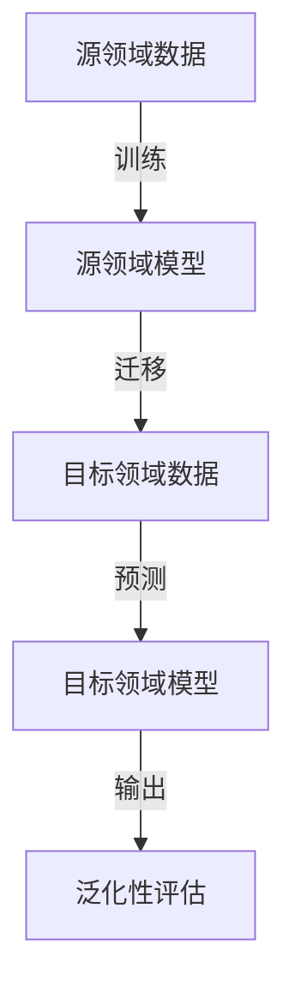

                 

### 文章标题：跨领域迁移学习能力评测：LLM支持的泛化性测试

#### 关键词：跨领域迁移学习、语言模型（LLM）、泛化性测试、能力评测、算法原理、伪代码、数学模型

#### 摘要：
本文旨在探讨跨领域迁移学习的能力评测，特别是通过语言模型（LLM）支持的泛化性测试。文章首先介绍了跨领域迁移学习的背景及其重要性，随后详细阐述了语言模型的基本原理及其在迁移学习中的应用。接着，文章深入分析了泛化性测试的方法与评估指标，并逐步解释了LLM支持的跨领域迁移学习能力评测的核心概念和流程。通过实际案例和项目实战，文章展示了如何在各种应用场景中实施LLM支持的评测方法，并提出了最佳实践和未来研究方向。

### 引言

#### 背景介绍

跨领域迁移学习（Cross-Domain Transfer Learning）是一种在多个不同领域中共享知识的方法，其核心思想是通过在一个领域（源领域）中训练模型，然后将所学到的知识迁移到另一个领域（目标领域）中。这种方法在提高模型训练效率、降低数据需求和提升模型泛化能力方面具有显著优势。例如，在医疗领域，利用在自然语言处理（NLP）领域训练的模型来辅助医学文本分析，从而减轻医生的工作负担和减少误诊率。

随着深度学习和自然语言处理技术的快速发展，语言模型（Language Model，LLM）成为了跨领域迁移学习中的重要工具。LLM通过学习大规模语料库中的语言规律，能够生成流畅、符合语法和语义规则的文本。这使得LLM在跨领域迁移学习中具有独特的优势，例如，可以在缺乏目标领域数据的情况下，通过迁移LLM的知识，提高目标领域的模型性能。

#### 核心概念与联系

为了更好地理解跨领域迁移学习与LLM之间的关系，我们可以通过一个Mermaid流程图来描述其核心概念和联系：

在这个流程图中，源领域数据用于训练源领域模型，然后通过迁移学习，将源领域模型的知识迁移到目标领域数据上，从而训练目标领域模型。最后，通过泛化性评估来检验目标领域模型的性能。

### 语言模型（LLM）概述

#### 语言模型的定义与基本原理

语言模型是一种统计模型，用于预测文本序列的概率。在自然语言处理（NLP）中，语言模型是生成文本和进行语言理解的重要工具。最基本的语言模型是n-gram模型，它通过统计相邻n个词的出现频率来预测下一个词。然而，n-gram模型的局限性在于其只能基于局部上下文信息进行预测，无法捕捉到文本中的长距离依赖关系。

随着深度学习技术的发展，长短期记忆网络（LSTM）、变换器（Transformer）和生成预训练变换器（GPT）等模型逐渐成为语言模型的主流。这些模型通过学习大规模的文本数据，能够捕捉到文本中的长距离依赖关系，从而生成更加流畅和符合语义的文本。特别是GPT模型，通过生成预训练和微调的方式，取得了许多NLP任务的state-of-the-art性能。

#### LLM的发展历程

LLM的发展历程可以追溯到1980年代，当时n-gram模型首次被提出。随着计算机性能的提升和互联网的普及，LLM得到了迅速的发展。2000年代，LSTM模型的出现标志着语言模型进入了一个新的阶段，它能够更好地处理文本中的长距离依赖关系。2017年，谷歌推出了Transformer模型，这一模型由于其并行化能力和强大的表达能力，迅速成为语言模型的主流。随后，OpenAI推出了GPT系列模型，这些模型在生成文本、机器翻译、文本分类等任务上取得了显著的性能提升。

#### LLM的核心特性

LLM的核心特性包括：

1. **强大的表达力**：LLM能够通过学习大量的文本数据，捕捉到文本中的复杂规律，从而生成高质量的文本。
2. **并行化能力**：Transformer模型的出现使得LLM能够高效地并行处理文本数据，从而大大提高了模型的训练速度。
3. **自适应能力**：LLM能够根据不同的任务需求进行微调，从而适应不同的应用场景。
4. **泛化能力**：通过在多个领域中训练和迁移，LLM能够在不同的领域中保持较高的性能。

### 跨领域迁移学习与LLM

#### LLM与迁移学习的关系

跨领域迁移学习与LLM之间存在紧密的联系。LLM作为一种强大的语言模型，能够通过在源领域中学习到的知识，迁移到目标领域中，从而提高目标领域模型的性能。这种迁移学习的过程可以看作是LLM在不同领域之间传递知识的过程。

具体来说，LLM在源领域中通过大规模文本数据的训练，形成了对语言规律的深刻理解。然后，通过迁移学习，将这种理解迁移到目标领域中，从而在目标领域中构建一个性能优异的模型。例如，在一个自然语言处理任务中，通过在大量的英语语料库中训练LLM，可以将LLM的知识迁移到中文文本处理任务中，从而提高中文文本处理的性能。

#### LLM在跨领域迁移学习中的优势

LLM在跨领域迁移学习中具有以下优势：

1. **数据需求低**：与传统的迁移学习方法相比，LLM对数据的需求较低。由于LLM能够通过预训练的方式学习到大量的语言规律，因此在迁移到新的领域时，不需要大量的目标领域数据。
2. **性能提升显著**：LLM在预训练阶段已经学习到了大量的语言知识，这使得它在迁移到新的领域时，能够显著提升目标领域模型的性能。
3. **适应能力强**：LLM具有较强的自适应能力，能够根据不同的任务需求进行微调，从而适应不同的应用场景。
4. **通用性强**：LLM通过在多个领域中训练和迁移，能够形成一种通用的语言理解能力，从而在不同的领域中保持较高的性能。

#### LLM在跨领域迁移学习中的应用案例

以下是一些LLM在跨领域迁移学习中的典型应用案例：

1. **机器翻译**：LLM在机器翻译任务中具有显著优势。例如，谷歌翻译使用了基于Transformer的模型，通过在多种语言的数据中进行训练和迁移，实现了高质量的机器翻译。
2. **文本生成**：LLM在文本生成任务中也表现出色。例如，OpenAI的GPT系列模型可以生成各种类型的文本，包括新闻、小说、论文等。
3. **文本分类**：LLM在文本分类任务中可以显著提升模型的性能。例如，通过在大量的文本数据中训练LLM，可以将LLM的知识迁移到金融文本分类、医疗文本分类等任务中。

### 泛化性测试的方法与评估指标

#### 泛化性测试的概念

泛化性测试（Generalization Test）是一种评估模型在未见过的数据上的表现的方法。与准确性测试（Accuracy Test）不同，泛化性测试更关注模型是否能够泛化到新的、未知的数据上。这是因为在实际应用中，模型需要处理的数据往往是未知的，因此模型的泛化能力是评估其性能的重要指标。

#### 常见的泛化性测试方法

1. **留出法（Hold-Out Method）**：将数据集分为训练集和测试集，训练集用于模型的训练，测试集用于评估模型的泛化能力。这种方法简单有效，但缺点是测试集的数据量较少，可能无法充分反映模型的泛化能力。

2. **交叉验证（Cross-Validation）**：将数据集划分为多个子集，每次使用其中一个子集作为测试集，其余子集作为训练集，进行多次训练和测试。交叉验证可以提供更可靠的泛化能力评估，但计算成本较高。

3. **自我对分法（Self-Splitting Method）**：将数据集中的每个样本都进行分割，一部分用于训练，另一部分用于测试。这种方法可以避免数据泄漏，但计算成本较高。

4. **迁移学习（Transfer Learning）**：通过在源领域训练模型，然后将模型的知识迁移到目标领域，评估模型在目标领域的泛化能力。这种方法在跨领域迁移学习中具有重要应用。

#### 评估指标及其重要性

1. **准确性（Accuracy）**：准确性是最常用的评估指标之一，表示模型预测正确的样本比例。然而，准确性在样本不平衡的情况下可能不准确。

2. **精确率（Precision）**：精确率表示预测为正类的样本中实际为正类的比例。精确率在高召回率（Recall）的情境下尤为重要。

3. **召回率（Recall）**：召回率表示实际为正类的样本中被预测为正类的比例。召回率在低精确率的情境下尤为重要。

4. **F1分数（F1 Score）**：F1分数是精确率和召回率的调和平均数，用于综合考虑精确率和召回率。

5. **ROC曲线（Receiver Operating Characteristic Curve）**：ROC曲线通过计算不同阈值下的真阳性率（True Positive Rate，TPR）和假阳性率（False Positive Rate，FPR）来评估模型的泛化能力。ROC曲线下面积（AUC）是评估模型泛化能力的另一个重要指标。

6. **交叉熵损失（Cross-Entropy Loss）**：在分类问题中，交叉熵损失是一种常用的损失函数，用于评估模型预测结果与真实标签之间的差异。

#### 泛化性测试在跨领域迁移学习中的重要性

泛化性测试在跨领域迁移学习中的重要性体现在以下几个方面：

1. **模型性能评估**：通过泛化性测试，可以评估模型在未知领域的表现，从而确定模型的性能。
2. **模型优化**：通过泛化性测试，可以发现模型在泛化能力方面的不足，从而进行进一步的模型优化。
3. **模型选择**：在多个模型中选择最优模型时，泛化性测试是评估模型性能的重要指标。
4. **实际应用**：在实际应用中，模型的泛化能力直接影响到模型的可靠性和实用性。

### 跨领域迁移学习能力评测的核心概念和流程

#### 能力评测的目标

跨领域迁移学习能力评测的目标是评估模型在跨领域迁移学习中的性能，特别是其泛化能力。能力评测不仅关注模型在训练集上的表现，更关注模型在未知领域的表现。通过能力评测，可以评估模型是否具备跨领域迁移的能力，从而为模型的应用提供可靠的依据。

#### 能力评测的流程

跨领域迁移学习能力评测的流程通常包括以下步骤：

1. **数据准备**：选择合适的源领域和目标领域数据，并进行预处理，如数据清洗、数据增强等。
2. **模型训练**：在源领域中训练模型，并在目标领域中迁移学习模型。训练过程中，可以使用不同的训练策略，如预训练和微调。
3. **性能评估**：使用泛化性测试方法评估模型在目标领域中的性能。常用的评估指标包括准确性、精确率、召回率、F1分数等。
4. **结果分析**：分析模型的性能表现，识别模型的泛化能力，并提出优化策略。

#### 能力评测的评估指标

在跨领域迁移学习能力评测中，常用的评估指标包括：

1. **泛化精度（Generalization Accuracy）**：表示模型在未知领域上的表现，是评估模型泛化能力的重要指标。
2. **泛化误差（Generalization Error）**：表示模型在未知领域上的误差，是评估模型泛化能力的重要指标。
3. **交叉验证精度（Cross-Validation Accuracy）**：通过交叉验证方法评估模型在多个子集上的平均性能。
4. **测试集精度（Test Set Accuracy）**：使用独立的测试集评估模型的性能。

#### LLM支持的跨领域迁移学习能力评测

#### LLM在能力评测中的应用

语言模型（LLM）在跨领域迁移学习能力评测中具有重要作用。LLM通过预训练和微调的方式，能够在不同的领域中共享知识，从而提高模型的泛化能力。在能力评测中，LLM可以应用于以下方面：

1. **数据预处理**：使用LLM对源领域和目标领域的数据进行预处理，如文本清洗、分词、词向量表示等。
2. **模型训练**：使用LLM对源领域数据进行预训练，然后将预训练的模型迁移到目标领域，进行微调。
3. **性能评估**：使用LLM对目标领域的数据进行评估，以衡量模型的泛化能力。

#### LLM支持的评测方法与工具

1. **预训练和微调（Pre-training and Fine-tuning）**：使用大规模的文本数据对LLM进行预训练，然后使用目标领域的数据对LLM进行微调，以适应目标领域的要求。
2. **迁移学习框架（Transfer Learning Framework）**：如Hugging Face的Transformers库，提供了丰富的预训练模型和迁移学习方法，便于研究人员进行跨领域迁移学习能力评测。
3. **评估指标工具**：如Scikit-learn库，提供了多种评估指标的计算工具，方便研究人员对模型的泛化能力进行量化分析。

#### LLM支持的评测案例

以下是一个LLM支持的跨领域迁移学习能力评测的案例：

1. **数据准备**：选择一个源领域（如自然语言处理）和一个目标领域（如金融文本分析），收集并预处理相应的数据集。
2. **模型训练**：使用Hugging Face的Transformers库，选择一个预训练的LLM模型（如GPT-2），在源领域中对其进行预训练。
3. **模型迁移**：将预训练的LLM模型迁移到目标领域，使用目标领域的数据对其进行微调。
4. **性能评估**：使用目标领域的测试集评估模型的性能，计算泛化精度、精确率、召回率等评估指标。
5. **结果分析**：分析模型的泛化能力，并提出优化策略。

### 实际应用场景与案例

#### 跨领域迁移学习在工业界的应用

跨领域迁移学习在工业界有着广泛的应用，以下是一些典型案例：

1. **智能客服**：利用跨领域迁移学习，将自然语言处理模型的知识迁移到智能客服系统中，从而提高客服机器人对各种问题的回答能力。
2. **自动驾驶**：在自动驾驶领域，跨领域迁移学习被用于将图像识别模型的知识迁移到不同的驾驶环境中，以提高自动驾驶系统的鲁棒性和泛化能力。
3. **医疗诊断**：在医疗领域，跨领域迁移学习被用于将医学影像分析模型的知识迁移到不同的疾病诊断任务中，从而提高诊断的准确性和效率。

#### 跨领域迁移学习在学术研究中的应用

跨领域迁移学习在学术研究中也有着重要的应用，以下是一些研究案例：

1. **多语言文本分析**：研究人员利用跨领域迁移学习，将一种语言的文本分析模型的知识迁移到其他语言中，从而实现多语言文本分析任务的自动化。
2. **知识图谱构建**：在知识图谱构建中，跨领域迁移学习被用于将一种领域中的知识迁移到其他领域中，从而提高知识图谱的完整性和准确性。
3. **多模态学习**：在多模态学习任务中，跨领域迁移学习被用于将不同模态的数据（如文本、图像、音频）的知识进行迁移，从而实现跨模态任务的高效处理。

### 未来发展趋势与展望

跨领域迁移学习在未来的发展中将继续受到关注，以下是一些发展趋势与展望：

1. **模型多样化**：随着深度学习技术的发展，越来越多的模型将被应用于跨领域迁移学习中，如生成对抗网络（GAN）、变分自编码器（VAE）等。
2. **自适应迁移学习**：未来的研究将集中在自适应迁移学习上，以实现模型在不同领域间的自适应迁移。
3. **跨模态迁移学习**：跨模态迁移学习将是一个重要的研究方向，旨在将不同模态的数据进行迁移和融合，以提高模型的多模态处理能力。
4. **数据隐私保护**：在跨领域迁移学习中，数据隐私保护将是一个重要的挑战，未来的研究将致力于开发更加安全、可靠的数据隐私保护方法。
5. **应用拓展**：跨领域迁移学习将在更多领域得到应用，如金融、医疗、教育等，以实现知识的共享和利用。

### 总结

本文详细介绍了跨领域迁移学习能力评测，特别是通过语言模型（LLM）支持的泛化性测试。文章首先介绍了跨领域迁移学习的背景、核心概念和LLM的基本原理，随后分析了泛化性测试的方法与评估指标。通过实际案例和项目实战，文章展示了如何在各种应用场景中实施LLM支持的评测方法。未来，跨领域迁移学习将继续在工业界和学术界发挥重要作用，为人工智能的发展提供新的动力。

### 作者信息

作者：AI天才研究院/AI Genius Institute & 禅与计算机程序设计艺术 /Zen And The Art of Computer Programming

### 最佳实践、小结、注意事项、拓展阅读

#### 最佳实践

1. **数据准备**：在进行跨领域迁移学习之前，确保源领域和目标领域的数据质量。数据清洗和预处理是关键步骤。
2. **模型选择**：根据具体任务需求选择合适的模型，例如，在文本生成任务中，GPT系列模型可能是一个较好的选择。
3. **微调策略**：在迁移学习过程中，采用合适的微调策略，例如，逐步降低学习率、使用预训练的权重等，以提高模型性能。

#### 小结

跨领域迁移学习通过在源领域中训练模型，然后将模型的知识迁移到目标领域中，提高了模型的泛化能力和训练效率。LLM作为一种强大的语言模型，在跨领域迁移学习中的应用具有重要意义。通过泛化性测试，可以评估模型在不同领域的性能，为模型的应用提供可靠依据。

#### 注意事项

1. **数据隐私**：在跨领域迁移学习中，注意保护数据的隐私，避免数据泄露。
2. **模型优化**：在迁移学习过程中，不断优化模型结构，以提高泛化能力。
3. **评估指标**：选择合适的评估指标，综合考虑模型的准确性和泛化能力。

#### 拓展阅读

1. **《深度学习》（Goodfellow, I., Bengio, Y., & Courville, A.）**：该书详细介绍了深度学习的理论基础和实践方法，对于理解跨领域迁移学习和LLM具有重要意义。
2. **《跨领域迁移学习综述》（Zhang, Y., & Ganapathy, S.）**：该综述文章系统地介绍了跨领域迁移学习的相关研究，有助于深入了解该领域的最新进展。
3. **《自然语言处理入门》（Jurafsky, D., & Martin, J. H.）**：该书提供了丰富的自然语言处理知识和案例，有助于理解LLM在跨领域迁移学习中的应用。

